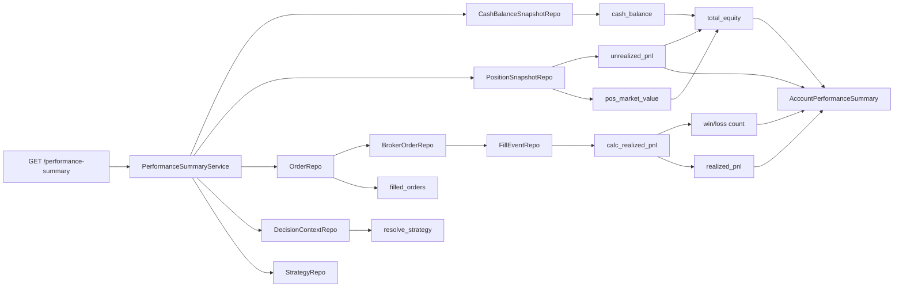

# Paper PnL / Performance Summary — 설계

## 1. PnL Source Inventory

| PnL 종류 | Source | 접근 경로 | 정확도 |
|----------|--------|-----------|--------|
| **Realized PnL** | `FillEventEntity.fill_price` × `fill_quantity` ± `fill_fee`/`fill_tax` | account → orders (by account_id) → broker_orders → fills | **정확** (실제 체결 기준) |
| **Unrealized PnL** | `PositionSnapshotEntity.(market_price - average_price) × quantity` | `position_snapshots.list_latest_by_account(account_id)` | **근사** (snapshot 시점 기준) |
| **Cash Balance** | `CashBalanceSnapshotEntity.available_cash` | `cash_balance_snapshots.get_latest_by_account(account_id)` | **정확** (broker snapshot 기준) |
| **Strategy Mapping** | `OrderRequestEntity.decision_context_id` → `DecisionContextEntity.strategy_id` | orders.list() → decision_contexts.get() | **정확** (decision tracing 기준) |

### 계산 방식

- **Realized PnL** = Σ (fill.fill_price × fill.fill_quantity × side_multiplier) - fill.fill_fee - fill.fill_tax
  - side_multiplier: BUY = -1, SELL = +1 (매수는 현금流出, 매도는 현금流入)
  - FILLED/PARTIALLY_FILLED 상태의 주문만 집계
- **Unrealized PnL** = Σ position.quantity × (position.market_price - position.average_price)
  - position.market_price가 None인 position은 unrealized_pnl = 0으로 처리
- **Position Market Value** = Σ |position.quantity| × position.market_price
- **Total Equity** = cash_balance + position_market_value + realized_pnl (누적)
  - 또는 단순: total_equity = cash_balance + position_market_value
- **Winning Trade** = realized_pnl > 0인 개별 fill 집합
- **Losing Trade** = realized_pnl < 0인 개별 fill 집합

> **참고**: realized_pnl 누적은 paper 계좌의 총 손익을 나타냄. Total equity는 간단히 `cash_balance + position_market_value`로 계산 (누적 PnL은 realized_pnl 필드로 별도 표시).

## 2. Summary Model 설계

```python
@dataclass(slots=True, frozen=True)
class AccountPerformanceSummary:
    """계좌 수준 성과 요약 — paper 운용 성과 평가용."""
    account_id: UUID
    as_of: datetime                     # 집계 기준 시점
    cash_balance: Decimal               # 최신 현금 잔고
    position_market_value: Decimal      # 포지션 평가액
    total_equity: Decimal               # 총 평가액 = cash + position_market_value
    realized_pnl: Decimal               # 실현 손익 (누적, 모든 체결 합계)
    unrealized_pnl: Decimal             # 미실현 손익 (snapshot 기준)
    total_pnl: Decimal                  # 총 손익 = realized + unrealized
    filled_order_count: int             # 체결 완료 주문 수
    open_position_count: int            # 미결제 포지션 수
    winning_trade_count: int            # 이익 체결 수
    losing_trade_count: int             # 손실 체결 수


@dataclass(slots=True, frozen=True)
class StrategyPerformanceSummary:
    """전략 수준 성과 요약 — 전략별 기여도 평가용."""
    account_id: UUID
    strategy_id: UUID
    as_of: datetime
    realized_pnl: Decimal
    filled_order_count: int
    winning_trade_count: int
    losing_trade_count: int
```

## 3. Service: `src/agent_trading/services/performance_summary.py`

### Pure Functions (테스트 용이)

```python
def calc_realized_pnl_for_order(
    fills: Sequence[FillEventEntity], side: OrderSide
) -> Decimal:
    """단일 주문의 realized PnL 계산."""
    total = Decimal("0")
    for fill in fills:
        # 매수: fill_price * fill_quantity (현금流出)
        # 매도: fill_price * fill_quantity (현금流入)
        multiplier = Decimal("-1") if side == OrderSide.BUY else Decimal("1")
        trade_value = fill.fill_price * fill.fill_quantity * multiplier
        fee = fill.fill_fee or Decimal("0")
        tax = fill.fill_tax or Decimal("0")
        total += trade_value - fee - tax
    return total


def calc_unrealized_pnl_from_positions(
    positions: Sequence[PositionSnapshotEntity],
) -> Decimal:
    """포지션 snapshot 기반 미실현 손익."""
    total = Decimal("0")
    for pos in positions:
        if pos.market_price is None:
            continue
        total += pos.quantity * (pos.market_price - pos.average_price)
    return total


def calc_position_market_value(
    positions: Sequence[PositionSnapshotEntity],
) -> Decimal:
    """포지션 평가액 = Σ |quantity| × market_price."""
    total = Decimal("0")
    for pos in positions:
        if pos.market_price is None:
            continue
        total += abs(pos.quantity) * pos.market_price
    return total
```

### Service Class

```python
class PerformanceSummaryService:
    """Read-only performance summary service.

    모든 PnL 계산은 결정론적 pure function에 위임.
    Repository access만 이 서비스에서 처리.
    """

    def __init__(self, repos: RepositoryContainer) -> None:
        self._repos = repos

    async def get_account_summary(
        self, account_id: UUID
    ) -> AccountPerformanceSummary:
        # 1. Cash
        cash_snap = await self._repos.cash_balance_snapshots.get_latest_by_account(account_id)
        cash = cash_snap.available_cash if cash_snap else Decimal("0")
        as_of = cash_snap.snapshot_at if cash_snap else datetime.now(timezone.utc)

        # 2. Positions → unrealized PnL
        positions = await self._repos.position_snapshots.list_latest_by_account(account_id)
        unrealized = calc_unrealized_pnl_from_positions(positions)
        pos_market_value = calc_position_market_value(positions)

        # 3. Orders → fills → realized PnL
        all_orders = await self._repos.orders.list(
            OrderQuery(account_id=account_id)
        )
        filled_orders = [o for o in all_orders if o.status in (
            OrderStatus.FILLED, OrderStatus.PARTIALLY_FILLED
        )]

        realized_pnl = Decimal("0")
        winning = 0
        losing = 0
        for order in filled_orders:
            broker_orders = await self._repos.broker_orders.list_by_order_request(order.order_request_id)
            order_fills: list[FillEventEntity] = []
            for bo in broker_orders:
                fills = await self._repos.fill_events.list_by_broker_order(bo.broker_order_id)
                order_fills.extend(fills)
            if order_fills:
                pnl = calc_realized_pnl_for_order(order_fills, order.side)
                realized_pnl += pnl
                if pnl > 0:
                    winning += 1
                elif pnl < 0:
                    losing += 1

        total_equity = cash + pos_market_value

        return AccountPerformanceSummary(
            account_id=account_id,
            as_of=as_of,
            cash_balance=cash,
            position_market_value=pos_market_value,
            total_equity=total_equity,
            realized_pnl=realized_pnl,
            unrealized_pnl=unrealized,
            total_pnl=realized_pnl + unrealized,
            filled_order_count=len(filled_orders),
            open_position_count=len(positions),
            winning_trade_count=winning,
            losing_trade_count=losing,
        )

    async def get_strategy_summary(
        self, account_id: UUID, strategy_id: UUID
    ) -> StrategyPerformanceSummary:
        """전략 수준 성과 요약.

        decision_context → trade_decision → order 체인으로
        특정 strategy에 속한 주문만 필터링.
        """
        all_orders = await self._repos.orders.list(
            OrderQuery(account_id=account_id)
        )
        as_of = datetime.now(timezone.utc)

        realized_pnl = Decimal("0")
        winning = 0
        losing = 0
        filled_count = 0

        for order in all_orders:
            if order.status not in (OrderStatus.FILLED, OrderStatus.PARTIALLY_FILLED):
                continue
            # Check if this order belongs to the strategy
            if order.decision_context_id is not None:
                ctx = await self._repos.decision_contexts.get(order.decision_context_id)
                if ctx is None or ctx.strategy_id != strategy_id:
                    continue
            else:
                continue  # Can't determine strategy

            broker_orders = await self._repos.broker_orders.list_by_order_request(order.order_request_id)
            order_fills: list[FillEventEntity] = []
            for bo in broker_orders:
                fills = await self._repos.fill_events.list_by_broker_order(bo.broker_order_id)
                order_fills.extend(fills)
            if order_fills:
                pnl = calc_realized_pnl_for_order(order_fills, order.side)
                realized_pnl += pnl
                filled_count += 1
                if pnl > 0:
                    winning += 1
                elif pnl < 0:
                    losing += 1

        return StrategyPerformanceSummary(
            account_id=account_id,
            strategy_id=strategy_id,
            as_of=as_of,
            realized_pnl=realized_pnl,
            filled_order_count=filled_count,
            winning_trade_count=winning,
            losing_trade_count=losing,
        )
```

## 4. API: `src/agent_trading/api/routes/performance.py`

```python
"""Performance summary inspection endpoint.

``GET /performance-summary`` — paper 운용 성과 요약.
```

- Route: `@router.get("/performance-summary", response_model=AccountPerformanceSummaryView)`
- Query params: `account_id` (required), `strategy_id` (optional)
- Internally creates `PerformanceSummaryService(repos)` and delegates
- Protected router (requires viewer role)

Pydantic schema in `api/schemas.py`:

```python
class AccountPerformanceSummaryView(BaseModel):
    """GET /performance-summary response model."""
    model_config = ConfigDict(from_attributes=True)

    account_id: str
    as_of: datetime
    cash_balance: float
    position_market_value: float
    total_equity: float
    realized_pnl: float
    unrealized_pnl: float
    total_pnl: float
    filled_order_count: int
    open_position_count: int
    winning_trade_count: int
    losing_trade_count: int


class StrategyPerformanceSummaryView(BaseModel):
    """Strategy-level performance summary (returned when strategy_id provided)."""
    model_config = ConfigDict(from_attributes=True)

    strategy_id: str
    realized_pnl: float
    filled_order_count: int
    winning_trade_count: int
    losing_trade_count: int
```

## 5. 변경 파일 목록

| 파일 | 작업 | 설명 |
|------|------|------|
| `src/agent_trading/services/performance_summary.py` | **생성** | Pure PnL 함수 + PerformanceSummaryService |
| `src/agent_trading/api/routes/performance.py` | **생성** | GET /performance-summary 엔드포인트 |
| `src/agent_trading/api/schemas.py` | **수정** | AccountPerformanceSummaryView, StrategyPerformanceSummaryView 추가 |
| `src/agent_trading/api/app.py` | **수정** | performance router 등록 |
| `tests/services/test_performance_summary.py` | **생성** | 6+ 단위 테스트 |
| `plans/[BACKLOG] backlog.md` | **수정** | Item 1b 상태 업데이트 + paper performance 항목 추가 |

## 6. 테스트 계획

| # | 시나리오 | 검증 내용 |
|---|----------|-----------|
| 1 | `calc_realized_pnl_for_order` — 매수 1건, 매도 1건 | BUY는 음수 현금흐름, SELL은 양수 |
| 2 | `calc_realized_pnl_for_order` — fee/tax 포함 | fee/tax 차감 확인 |
| 3 | `calc_unrealized_pnl_from_positions` — long position | market_price > avg_price → 양수 PnL |
| 4 | `calc_unrealized_pnl_from_positions` — market_price=None | 해당 position 제외 (0) |
| 5 | `calc_position_market_value` — 여러 position | 절대값 × market_price 합계 |
| 6 | `get_account_summary` — cash only | total_equity=cash, unrealized=0 |
| 7 | `get_account_summary` — open position + fill | realized/unrealized/total 정확성 |
| 8 | `get_account_summary` — no data | zero-filled summary |
| 9 | `get_strategy_summary` — strategy filter | 특정 strategy만 집계 |
| 10 | 기존 semantics 회귀 없음 | 전체 테스트 스위트 통과 |

## 7. Mermaid: Data Flow



## 8. 실행 단계

| 단계 | 작업 | 상세 |
|------|------|------|
| 1 | Service pure functions | `calc_realized_pnl_for_order`, `calc_unrealized_pnl_from_positions`, `calc_position_market_value` |
| 2 | Service class | `PerformanceSummaryService.get_account_summary()`, `.get_strategy_summary()` |
| 3 | API route | `GET /performance-summary` with account_id / optional strategy_id |
| 4 | Schema + router 등록 | Pydantic models + app.py router include |
| 5 | 단위 테스트 | 10 tests covering pure functions + service + edge cases |
| 6 | 회귀 테스트 | 전체 pytest suite |
| 7 | 문서 정리 | [BACKLOG] backlog.md Item 1b → ✅ 승격됨, Paper Performance 항목 추가 |
