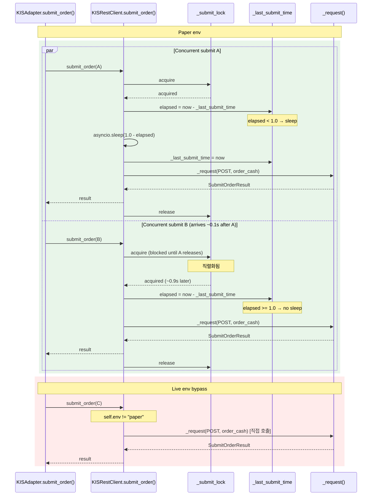

# KIS Paper Submit Pacing 설계 문서

## 1. 배경

KIS paper 환경은 `global_rest_capacity=1`, `global_rest_refill_rate=1/s` (1RPS) 제약이 있습니다.  
[`RateLimitBudgetManager`](../src/agent_trading/brokers/rate_limit.py:567)의 [`build_kis_budget_manager()`](../src/agent_trading/brokers/rate_limit.py:567)에서 paper 환경에 대해 `global_rest_capacity=1, global_rest_refill_rate=1.0`로 설정됩니다.

Decision loop의 병렬 symbol 처리 중 quote/submit/inquiry가 같은 global 1RPS cap을 경쟁하여 `BUDGET_EXHAUSTED(global)`이 발생합니다.

**문제점**: `BUDGET_EXHAUSTED`는 [`KISAdapter.submit_order()`](../src/agent_trading/brokers/koreainvestment/adapter.py:249-292)에서 `BudgetExhaustedError`를 `OrderStatus.REJECTED`로 매핑하여 주문이 즉시 실패합니다. 이는 paper 환경에서 불필요한 주문 실패를 초래합니다.

---

## 2. 구현 위치 선택

### 권장: `KISRestClient.submit_order()` (rest_client.py:1041-1101)

**선택 이유**:

| 기준 | 판단 |
|------|------|
| 단일 진입점 | 모든 submit은 `submit_order()`를 통과 (adapter → rest_client) |
| env 접근 가능 | `self.env` 필드로 live/paper 직접 판별 (line 366) |
| 기존 패턴 존재 | [`_auth_lock`](../src/agent_trading/brokers/koreainvestment/rest_client.py:384) + [`_last_auth_call_time`](../src/agent_trading/brokers/koreainvestment/rest_client.py:386) 패턴이 이미 있음 (동일한 lock + monotonic sleep 패턴) |
| read-only 경로와 분리 | `_request()` 하위에서 budget 소비는 공유하지만, pacing 로직은 `submit_order()`에만 추가 → quote/inquiry 영향 없음 |

### 대안 검토

| 후보 | 장점 | 단점 | 기각 이유 |
|------|------|------|----------|
| **adapter.py submit 경로** | adapter가 비즈니스 로직 레이어 | submit 외 cancel도 같은 adapter 통과, rest_client env 정보 직접 접근 불가 | rest_client가 이미 env 보유, adapter는 단순 위임 |
| **order_manager / order_sync_service** | 더 높은 레벨에서 제어 가능 | 모든 order service 경로에 pacing 적용 필요, 테스트 범위 확대 | 불필요한 계층 침투, 단일 진입점 원칙 위배 |

---

## 3. 변경 상세

### 3.1 대상 파일 및 위치

**파일**: [`src/agent_trading/brokers/koreainvestment/rest_client.py`](../src/agent_trading/brokers/koreainvestment/rest_client.py)

### 3.2 추가할 필드 (dataclass field, lines 383-387 인근)

```python
# --- submit pacing (paper env 1s interval) ---
_submit_lock: asyncio.Lock = field(default_factory=asyncio.Lock, init=False, repr=False)
_last_submit_time: float = field(default=0.0, init=False, repr=False)
```

**위치**: [`_auth_lock`](../src/agent_trading/brokers/koreainvestment/rest_client.py:384) / [`_approval_lock`](../src/agent_trading/brokers/koreainvestment/rest_client.py:385) 필드 바로 다음 (line 387 이후).

**근거**: 동일한 `asyncio.Lock` + `time.monotonic()` 패턴이 이미 auth pacing에 사용 중. 일관성 유지.

### 3.3 `submit_order()` 메서드 변경 (line 1041-1101)

**변경 전**:

```python
async def submit_order(
    self,
    request: SubmitOrderRequest,
    _held_position_sell: bool = False,
) -> SubmitOrderResult:
    side = request.side
    tr_id_key = "order_buy" if side == OrderSide.BUY else "order_sell"
    body = { ... }
    data = await self._request("POST", endpoint_key="order_cash", ...)
    output = data.get("output", data)
    ...
    return SubmitOrderResult(...)
```

**변경 후 pseudocode**:

```python
async def submit_order(
    self,
    request: SubmitOrderRequest,
    _held_position_sell: bool = False,
) -> SubmitOrderResult:
    side = request.side
    tr_id_key = "order_buy" if side == OrderSide.BUY else "order_sell"
    body = { ... }

    # ── Paper env pacing: 1s interval between submits ──
    if self.env == "paper":
        async with self._submit_lock:
            now = time.monotonic()
            elapsed = now - self._last_submit_time
            if self._last_submit_time > 0.0 and elapsed < 1.0:
                await asyncio.sleep(1.0 - elapsed)
                now = time.monotonic()  # sleep 후 재측정
            self._last_submit_time = now
            data = await self._request("POST", endpoint_key="order_cash", ...)
    else:
        data = await self._request("POST", endpoint_key="order_cash", ...)

    output = data.get("output", data)
    ...
    return SubmitOrderResult(...)
```

**핵심 상세**:
- `self._last_submit_time > 0.0` 체크: 첫 번째 submit은 sleep 없이 즉시 실행 (초기값 0.0)
- `time.monotonic()` 사용: 시스템 시간 변경에 영향 받지 않음
- `asyncio.sleep()`으로 sleep 동안 event loop 양보 → 다른 coroutine 처리 가능
- `async with self._submit_lock`: 동시 submit 호출을 직렬화

### 3.4 `__post_init__` 변경

[`__post_init__`](../src/agent_trading/brokers/koreainvestment/rest_client.py:415)는 `asyncio.Lock` 필드의 `default_factory`로 이미 초기화되므로 **추가 변경 불필요**.

`field(default_factory=asyncio.Lock)`는 dataclass 생성 시 자동으로 새로운 Lock 인스턴스를 생성합니다.

---

## 4. 영향 분석

### 4.1 Live env

```
self.env == "paper" 조건 → False → pacing 로직 완전히 우회
```

- Lock 획득/체크/타이머 없이 기존 `_request()` 경로 그대로 실행
- **성능 영향 0%**

### 4.2 Read-only 경로 (pacing 미적용)

| 메서드 | Bucket | Pacing 적용? | 이유 |
|--------|--------|-------------|------|
| `inquire_daily_ccld()` | INQUIRY | ❌ | 자체 1s pagination pacing(line 1253) 별도 존재 |
| `get_positions()` | INQUIRY | ❌ | 조회 전용 |
| `get_cash_balance()` | INQUIRY | ❌ | 조회 전용 |
| `get_cash_and_positions()` | INQUIRY | ❌ | 조회 전용 |
| `get_quote()` | MARKET_DATA | ❌ | 시세 조회 |
| `get_orderbook()` | MARKET_DATA | ❌ | 호가 조회 |
| `get_orderable_cash()` | INQUIRY | ❌ | 조회 전용 |
| `get_order_status()` | INQUIRY | ❌ | 조회 전용 |
| `get_disclosure_news_title()` | INQUIRY | ❌ | 조회 전용 |
| `resolve_unknown_state()` | INQUIRY | ❌ | 정산 복구 경로 |

### 4.3 `cancel_order()` — pacing 적용하지 않음

```python
async def cancel_order(self, broker_order_id, symbol, quantity) -> CancelOrderResult:
    # Pacing 적용하지 않음 — cancel은 긴급 경로
```

**이유**:
- 주문 취소는 타이밍이 중요한 긴급 작업 (가격 급변 시 손실 방지)
- 취소 실패 시 재시도가 필요하므로 지연 불가
- Paper 환경에서도 cancel은 즉시 처리되어야 함

### 4.4 `_request()` 메서드 — pacing 미적용

`_request()`는 모든 API 호출의 공통 경로이므로 pacing을 여기에 추가하면:
- quote/inquiry/submit/cancel 모두에 lock이 걸림 → 심각한 성능 저하
- quote 1초 대기 → decision loop 지연 → submit도 지연 → 악순환
- **절대 금지**

---

## 5. 데이터 흐름 다이어그램



---

## 6. 테스트 전략

### 6.1 단위 테스트 (`tests/brokers/koreainvestment/test_rest_client.py`)

**Test 1: Paper env 연속 submit → 1초 간격 검증**
```python
async def test_paper_submit_pacing_enforces_1s_interval():
    client = KISRestClient(api_key="k", api_secret="s", account_number="a",
                           account_product_code="01", env="paper")
    # mock _request to return successful result
    # 1. First submit → no delay
    t0 = time.monotonic()
    await client.submit_order(mock_request)
    t1 = time.monotonic()
    assert t1 - t0 < 0.1  # 즉시 실행

    # 2. Second submit immediately after → delayed ~1s
    await client.submit_order(mock_request)
    t2 = time.monotonic()
    assert t2 - t1 >= 0.9  # 최소 1초 간격 (sleep jitter 고려)
```

**Test 2: Live env → pacing 미적용**
```python
async def test_live_env_no_pacing():
    client = KISRestClient(api_key="k", api_secret="s", account_number="a",
                           account_product_code="01", env="live")
    # mock _request
    t0 = time.monotonic()
    await client.submit_order(mock_request)
    await client.submit_order(mock_request)
    t1 = time.monotonic()
    assert t1 - t0 < 0.2  # 두 번 다 즉시 실행
```

**Test 3: 동시 submit → 직렬화 검증**
```python
async def test_concurrent_submits_are_serialized():
    client = KISRestClient(...)
    # 동시에 3개 submit
    tasks = [client.submit_order(mock_request) for _ in range(3)]
    t0 = time.monotonic()
    await asyncio.gather(*tasks)
    t1 = time.monotonic()
    # 첫 번째 즉시, 두 번째 ~1s, 세 번째 ~2s
    assert t1 - t0 >= 2.0  # 최소 2초 이상
```

**Test 4: cancel_order → pacing 미적용**
```python
async def test_cancel_order_not_paced():
    client = KISRestClient(..., env="paper")
    t0 = time.monotonic()
    await client.cancel_order(...)
    await client.cancel_order(...)
    t1 = time.monotonic()
    assert t1 - t0 < 0.2  # delay 없이 즉시 실행
```

**Test 5: submit + cancel 혼합 → cancel은 즉시**
```python
async def test_cancel_not_blocked_by_submit_lock():
    client = KISRestClient(..., env="paper")
    t0 = time.monotonic()
    submit_task = asyncio.create_task(client.submit_order(mock_request))
    await asyncio.sleep(0.01)  # submit이 lock 획득
    await client.cancel_order(...)  # cancel은 별도 lock → 즉시
    t1 = time.monotonic()
    assert t1 - t0 < 0.1  # cancel은 submit lock과 무관
```

### 6.2 Mock 전략

| 대상 | Mock 방법 |
|------|----------|
| `_request()` | `unittest.mock.AsyncMock` → 성공 응답 반환 |
| `time.monotonic()` | `unittest.mock.patch`로 제어 가능하나, 실제 시간 사용 권장 (신뢰성) |
| `asyncio.sleep()` | 실제 sleep 사용 (0.01~1.0s 단위, 테스트 시간 허용 범위 내) |

### 6.3 통합 테스트

Paper 환경 실제 API 연동 테스트:
- 2개 symbol에 동시 submit → 두 번째가 ~1초 후 실행됨을 로그로 확인
- Live 환경 동일 테스트 → 지연 없음 확인

---

## 7. 리스크 및 고려사항

| 리스크 | 영향 | 완화 |
|--------|------|------|
| `asyncio.Lock` 데드락 | submit + 다른 lock 중첩 시 | `_submit_lock`은 `submit_order()` scope 내에서만 사용, 중첩 호출 없음 |
| 시간 측정 오차 | `time.monotonic()`은 nanosecond 정밀도, `asyncio.sleep()`은 platform 의존 | 1.0s sleep → 실제 0.95~1.05s 허용 |
| `_last_submit_time` race condition | `asyncio.Lock`으로 완벽 보호 | Lock 범위 내에서만 읽기/쓰기 |
| Paper→Live env 전환 시 pacing 잔여 | `_last_submit_time` 초기값 0.0 → 첫 호출 즉시 실행 | 영향 없음 |

---

## 8. 변경 요약

| 항목 | 변경 전 | 변경 후 |
|------|--------|--------|
| `__init__` 필드 (line 384-387 인근) | 없음 | `_submit_lock: asyncio.Lock`, `_last_submit_time: float` |
| `submit_order()` (line 1041-1101) | `_request()` 직접 호출 | paper env: lock + sleep pacing 후 `_request()` |
| `cancel_order()` | 변경 없음 | 변경 없음 (pacing 미적용) |
| `_request()` | 변경 없음 | 변경 없음 (pacing 미적용) |
| `KISAdapter.submit_order()` | 변경 없음 | 변경 없음 (하위 호환) |
| 테스트 파일 | 신규 | `test_paper_submit_pacing` 테스트 추가 필요 |
