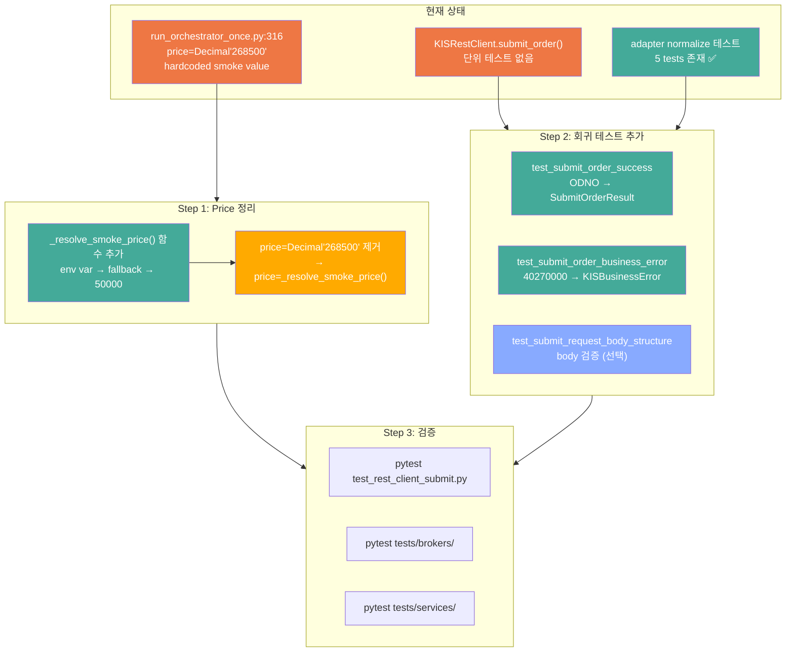

# Paper Submit Smoke 후속 정리 — 설계 문서

> 작성일: 2026-05-11
> 컨텍스트: KIS paper submit smoke 성공 이후, smoke 전용 하드코딩 정리 + KIS submit 회귀 테스트 추가

---

## 1. 현재 상태 요약

| 항목 | 상태 | 비고 |
|------|------|------|
| KIS paper broker accept (6/10 SUBMITTED) | ✅ 완료 | `run_orchestrator_once.py --submit`으로 검증 완료 |
| `rest_client.py:submit_order()` 버그 수정 | ✅ 완료 | `SubmitOrderResult` 생성자 불일치 해결 |
| `run_orchestrator_once.py:316` price 하드코딩 | 🚫 **제거 대상** | `price=Decimal("268500")` — smoke 실험값, 일반 코드에 유지 불가 |
| KIS submit 성공 응답(ODNO) 회귀 테스트 | ❌ **없음** | `rest_client.submit_order()` 단위 테스트 전무 |
| adapter normalize 레이어 테스트 | ✅ 기존 커버 | `test_kis_adapter_validation.py:TestNormalizeSubmitResult` (5 tests) |

---

## 2. 선택: B안 (env override) — 권장

### 2.1 선택지 비교

| 안 | 접근 | 평가 | 선정 |
|----|------|------|------|
| **A안** — 원복 | `price=Decimal("50000")`으로 복원, smoke는 문서 절차로 관리 | 가장 단순하지만 재실행 시 KIS price validation error(40270000) 재발 | ❌ |
| **B안** — env override | `KIS_SMOKE_PRICE` env var 추가, 없으면 기본값 사용 | **권장**. mode boundary 정책 부합(env-specific config), 재현 가능, 최소 변경 | ✅ |
| **C안** — 동적 산정 | 현재가/전일종가 기반 자동 조회 | 장기적 해법이지만 이번 범위 초과, KIS API 추가 호출 필요 | ❌ 후순위 |

### 2.2 B안 선택 이유

1. **mode boundary 정합성**: [`mode_boundary_paper_live.md`](plans/mode_boundary_paper_live.md)에 따르면 `run_orchestrator_once.py`는 🟢 공통(mode-neutral). env-specific price는 🔵 env-based config로 관리하는 것이 아키텍처 정책에 부합.
2. **최소 변경**: `run_orchestrator_once.py` 1개 파일 최소 수정.
3. **재현 가능성**: 동일 env var로 언제든 동일 조건 재실행 가능.
4. **관찰 가능성**: resolved price를 로그로 출력하여 submit 시 어떤 가격이 사용되는지 투명하게 공개.

### 2.3 Smoke env override의 역할과 한계

`KIS_SMOKE_PRICE`는 **smoke 실행 제어용 env override**입니다. 운영 일반 해법이 아니라, smoke 시나리오에서 KIS paper validation을 통과하기 위한 가격을 env로 주입하는 메커니즘입니다.

- **운영 일반 실행(dry-run)**: `KIS_SMOKE_PRICE` 미설정 → `Decimal("50000")` 사용 (dry-run은 실제 submit이 없으므로 validation 무관)
- **Smoke 실행**: `KIS_SMOKE_PRICE=268500` 설정 → 해당 가격으로 submit (KIS paper validation 통과)
- **Live 환경**: `KIS_SMOKE_PRICE` 사용 자체가 live의도가 아님. live는 실시간 시장가/지정가를 AI 결정을 통해 산정함.

> **장기 해법(C안, 동적 가격 산정)** 은 이번 턴 범위를 벗어납니다. B안은 그 중간 단계로, 최소 변경으로 smoke 재현성을 확보하면서 코드 하드코딩을 제거합니다.

---

## 3. 변경 상세

### 3.1 변경 파일 목록

| # | 파일 | 변경 유형 | 변경 내용 |
|---|------|-----------|----------|
| 1 | [`scripts/run_orchestrator_once.py`](scripts/run_orchestrator_once.py) | ✅ 수정 | price 하드코딩 제거 → `_resolve_smoke_price()` 함수 추가 |
| 2 | [`tests/brokers/koreainvestment/test_rest_client_submit.py`](tests/brokers/koreainvestment/test_rest_client_submit.py) | ✅ **신규 생성** | `KISRestClient.submit_order()` 단위 테스트 (성공/실패 경로) |

### 3.2 변경 제외 (명시적)

| 파일 | 제외 사유 |
|------|----------|
| `src/agent_trading/brokers/koreainvestment/rest_client.py` | 버그는 이미 수정 완료. 추가 변경 불필요. |
| `src/agent_trading/brokers/koreainvestment/adapter.py` | `_normalize_submit_result()`는 기존 테스트로 커버. 변경 불필요. |
| `src/agent_trading/services/decision_orchestrator.py` | price는 request에서 그대로 전달. 변경 불필요. |
| `tests/brokers/test_kis_adapter_validation.py` | 기존 normalize 테스트 유지. 변경 불필요. |
| `tests/smoke/test_kis_paper_smoke.py` | read-only 원칙 유지. submit 테스트 추가 금지. |

### 3.3 `run_orchestrator_once.py` price 처리 Before/After

**Before (line 306-317)**:
```python
request = SubmitOrderRequest(
    account_ref=ACCOUNT_ALIAS,
    client_order_id="entrypoint-001",
    ...
    price=Decimal("268500"),  # KIS paper 005930 전일종가 기준 (smoke 검증용)
)
```

**After**:
```python
request = SubmitOrderRequest(
    account_ref=ACCOUNT_ALIAS,
    client_order_id="entrypoint-001",
    ...
    price=_resolve_smoke_price(),
)
```

**추가 함수** (파일 상단, `main()` 외부):
```python
def _resolve_smoke_price() -> Decimal:
    """Return order price for smoke/test execution.
    
    Priority:
    1. ``KIS_SMOKE_PRICE`` env var (for smoke runs with specific price)
    2. ``Decimal("50000")`` safe default (dry-run / non-submit usage)
    
    Always logs the resolved price and its source for observability.
    """
    raw = os.environ.get("KIS_SMOKE_PRICE")
    if raw is not None:
        try:
            price = Decimal(raw)
            logger.info("Using KIS_SMOKE_PRICE=%s from env var", price)
            return price
        except Exception:
            logger.warning("Invalid KIS_SMOKE_PRICE=%r, falling back to default 50000", raw)
    logger.info("KIS_SMOKE_PRICE not set, using default price=50000")
    return Decimal("50000")
```

**`--submit` 경로에 추가할 경고 로그** (line 367-379, submit 실행 직전):
```python
# Submit 경로: resolved price가 default(50000)일 경우 경고
resolved_price = _resolve_smoke_price()
if resolved_price == Decimal("50000"):
    logger.warning(
        "KIS_SMOKE_PRICE not set — using default price=%s. "
        "This may cause KIS price validation error (msg_cd=40270000). "
        "Set KIS_SMOKE_PRICE env var for paper submit smoke.",
        resolved_price,
    )
```

---

## 4. KIS Submit 회귀 테스트 설계

### 4.1 테스트 파일 위치

**신규**: [`tests/brokers/koreainvestment/test_rest_client_submit.py`](tests/brokers/koreainvestment/test_rest_client_submit.py)

이유:
- `tests/brokers/koreainvestment/` 디렉토리는 KIS-specific 단위 테스트 전용 (`test_snapshot.py` 존재)
- `tests/brokers/test_kis_adapter_validation.py`는 adapter 레벨. rest_client 레벨은 별도 파일 필요.
- smoke 테스트는 read-only 원칙 위반 → unit test로 분리

### 4.2 테스트 설계

#### 테스트 1: `test_submit_order_success`

**목적**: KIS submit 성공 응답(ODNO 반환)에서 `SubmitOrderResult`가 정상 생성되는지 검증.

**방법**: `KISRestClient._request()`를 mock 처리하여 ODNO 응답 반환.

```python
async def _mock_request(*args, **kwargs) -> dict:
    return {
        "output": {
            "ODNO": "0000027326",
            "ORD_TMD": "152530",
        }
    }
```

**검증 항목**:
| 필드 | 기대값 |
|------|--------|
| `accepted` | `True` |
| `broker_name` | `BrokerName.KOREA_INVESTMENT` |
| `client_order_id` | 요청과 동일 |
| `broker_order_id` | `"0000027326"` (ODNO) |
| `broker_status` | `OrderStatus.SUBMITTED` |
| `raw_code` | `"0000027326"` (ODNO) |
| `raw_message` | `"152530"` (ORD_TMD) |
| `normalized_status` | `OrderStatus.SUBMITTED` |
| `uncertain` | `False` |
| `requires_reconciliation` | `False` |
| `ack_timestamp` | `not None` |

#### 테스트 2: `test_submit_order_business_error`

**목적**: 이전 price error(40270000)처럼 business error 응답 경로가 기존대로 유지되는지 검증.

**방법**: `KISRestClient._request()`를 mock하여 `KISBusinessError` raise.

```python
async def _mock_request_error(*args, **kwargs):
    raise KISBusinessError(
        status_code=200,
        msg_cd="40270000",
        msg="주문가격이 상하한가를 초과하였습니다.",
        screen_no=None,
    )
```

**검증**: `pytest.raises(KISBusinessError, match="40270000")`

#### 테스트 3: `test_submit_request_body_structure` (권장)

**목적**: `SubmitOrderRequest`가 올바른 body 구조로 KIS API에 전달되는지 검증. 이 테스트는 회귀 방지에 유용하므로 **필수 포함**.

**방법**: `_request()`가 올바른 endpoint/bucket/body로 호출되었는지 assertion.

```python
with patch.object(client, "_request", AsyncMock()) as mock_request:
    mock_request.return_value = {"output": {"ODNO": "0000027326", "ORD_TMD": "152530"}}
    await client.submit_order(request)
    mock_request.assert_called_once()
    call_kwargs = mock_request.call_args[1]
    assert call_kwargs["endpoint_key"] == "order_cash"
    assert call_kwargs["tr_id_key"] == "order_buy"  # BUY side
    assert call_kwargs["bucket"] == BucketType.ORDER
    assert call_kwargs["body"]["ORD_UNPR"] == "50000"
    assert call_kwargs["body"]["ORD_QTY"] == "10"
    assert call_kwargs["body"]["PDNO"] == "005930"
    assert call_kwargs["body"]["ORD_DVSN"] in ("00", "03")  # LIMIT order type
    assert call_kwargs["requires_hashkey"] is True
```

#### 테스트 4-6: `_resolve_smoke_price()` 단위 테스트

**테스트 파일 위치**: [`tests/scripts/test_run_orchestrator_once.py`](tests/scripts/test_run_orchestrator_once.py) (신규) 또는 `run_orchestrator_once.py` 내 함수를 import하여 `test_rest_client_submit.py`에 추가.

권장: **`test_rest_client_submit.py`에 통합** (파일명이 rest_client 전용이지만, smoke price 함수도 submit 관련 로직이므로 같은 맥락에서 테스트 가능).

```python
# 테스트 4: env 미설정 → 50000
def test_resolve_smoke_price_default(monkeypatch):
    monkeypatch.delenv("KIS_SMOKE_PRICE", raising=False)
    from scripts.run_orchestrator_once import _resolve_smoke_price
    assert _resolve_smoke_price() == Decimal("50000")

# 테스트 5: env 유효값 설정 → 해당 Decimal
def test_resolve_smoke_price_from_env(monkeypatch):
    monkeypatch.setenv("KIS_SMOKE_PRICE", "268500")
    from scripts.run_orchestrator_once import _resolve_smoke_price
    assert _resolve_smoke_price() == Decimal("268500")

# 테스트 6: env 잘못된 값 → 경고 후 50000
def test_resolve_smoke_price_invalid_env(caplog, monkeypatch):
    monkeypatch.setenv("KIS_SMOKE_PRICE", "not-a-number")
    from scripts.run_orchestrator_once import _resolve_smoke_price
    assert _resolve_smoke_price() == Decimal("50000")
    assert "Invalid KIS_SMOKE_PRICE" in caplog.text
```

### 4.3 `_resolve_smoke_price()` 테스트

`run_orchestrator_once.py`의 `_resolve_smoke_price()` 함수는 `scripts` 패키지에 속하지만, submit 성공을 위해 반드시 통과해야 하는 smoke price 정책 검증이므로 동일 테스트 파일에 포함.

| 테스트 | 조건 | 기대값 |
|--------|------|--------|
| test 4: `test_resolve_smoke_price_default` | env 미설정 | `Decimal("50000")` |
| test 5: `test_resolve_smoke_price_from_env` | `KIS_SMOKE_PRICE=268500` | `Decimal("268500")` |
| test 6: `test_resolve_smoke_price_invalid_env` | `KIS_SMOKE_PRICE=not-a-number` | `Decimal("50000")` + 경고 로그 |

### 4.4 기존 테스트와의 관계

| 기존 테스트 | 커버리지 | 이번 작업 |
|-------------|----------|-----------|
| `test_kis_adapter_validation.py:TestNormalizeSubmitResult` (5 tests) | `_normalize_submit_result()` 단위 검증 | ✅ 변경 없음 |
| `test_order_submit_to_broker.py` (7 tests) | `OrderManager.submit_order_to_broker()` | ✅ 변경 없음 |
| `test_decision_submit_pipeline.py` (10 tests) | `assemble_and_submit()` full pipeline | ✅ 변경 없음 |
| **신규**: `test_rest_client_submit.py` (6 tests) | submit 성공/business error/body 구조/price resolve 3종 | 🆕 추가 |

### 4.5 회귀 방지 매트릭스

| 경로 | 기존 테스트 | 신규 테스트 | 회귀 방지 |
|------|------------|-------------|----------|
| broker accept → ODNO → SubmitOrderResult 정상 생성 | ❌ 없음 | ✅ test 1 | ✅ |
| business error → KISBusinessError raise | ❌ 없음 | ✅ test 2 | ✅ |
| body 구조/endpoint/tr_id 정확성 | ❌ 없음 | ✅ test 3 | ✅ |
| smoke price resolve 정책 | ❌ 없음 | ✅ tests 4-6 | ✅ |
| adapter normalize → uncertain/reconcile 플래그 | ✅ 5 tests | 불필요 | ✅ 기존 |
| OrderManager → broker submit → status 전이 | ✅ 7 tests | 불필요 | ✅ 기존 |
| pipeline assemble → sizing → submit | ✅ 10 tests | 불필요 | ✅ 기존 |

---

## 5. 작업 제약 준수 확인

| 제약 | 준수 | 근거 |
|------|------|------|
| 실제 live 주문 금지 | ✅ | paper env 한정, 단위 테스트는 mock 사용 |
| broker submit semantics 변경 금지 | ✅ | rest_client 변경 없음 |
| hard guardrail / reconciliation 경계 변경 금지 | ✅ | 해당 없음 |
| admin UI 변경 금지 | ✅ | 해당 없음 |
| 과도한 리팩터링 금지 | ✅ | 변경 파일 2개, 최소 수정 |

---

## 6. 실행 계획 (Code mode)

### Step 1: `run_orchestrator_once.py` 수정

```python
# (1) 파일 상단에 _resolve_smoke_price() 함수 추가
# (2) line 316 price=Decimal("268500") → price=_resolve_smoke_price()
```

### Step 2: `tests/brokers/koreainvestment/test_rest_client_submit.py` 신규 생성

테스트 3개 구현:
1. `test_submit_order_success` — ODNO → SubmitOrderResult 정상 생성
2. `test_submit_order_business_error` — KISBusinessError 전파 유지
3. `test_submit_request_body_structure` — body 구조 검증 (선택)

### Step 3: 테스트 실행

```bash
# 신규 테스트만 실행
pytest tests/brokers/koreainvestment/test_rest_client_submit.py -v

# 전체 broker 테스트 회귀 확인
pytest tests/brokers/ -v --tb=short -q
```

### Step 4: 전체 서비스 테스트 회귀 확인

```bash
pytest tests/services/ -v --tb=short -q
```

---

## 7. Mermaid: 전체 작업 흐름



---

## 8. 완료 보고 형식 (8항목)

작업 완료 시 아래 형식으로 보고:

1. **선택한 가격 처리 방식**
   - env override 규칙: `KIS_SMOKE_PRICE` env var 우선
   - fallback 규칙: env 미설정 시 `Decimal("50000")`, 잘못된 값 시 경고 후 `Decimal("50000")`
   - submit 시 로그/경고 정책: resolved price source 로그 출력, fallback 50000 사용 시 경고 로그

2. **변경 파일 목록**
   - 실제 수정된 파일만 나열
   - 각 파일별 변경 목적 1줄 설명

3. **테스트 추가 내용**
   - `_resolve_smoke_price()` 테스트 3종 (env 미설정/유효값/잘못된값)
   - `submit_order` 성공 경로 (ODNO → SubmitOrderResult)
   - business error 경로 (KISBusinessError raise)
   - request body 구조 검증

4. **migration 필요 여부**
   - 필요 없으면 이유 명시

5. **테스트 결과**
   - 신규 테스트 통과 여부
   - 기존 회귀 여부

6. **현재 정리 상태**
   - smoke용 하드코딩 제거 여부
   - broker accept 성공 경로 회귀 방지 여부

7. **남은 리스크 1개**
   - `KIS_SMOKE_PRICE` 미설정 submit 시 기본값 50000은 여전히 KIS reject 가능

8. **다음 직접 액션 1개**
   - smoke 재실행 또는 후속 observability 보강 중 하나만 제시
