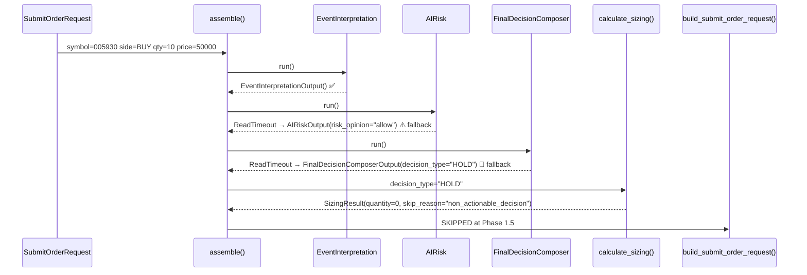
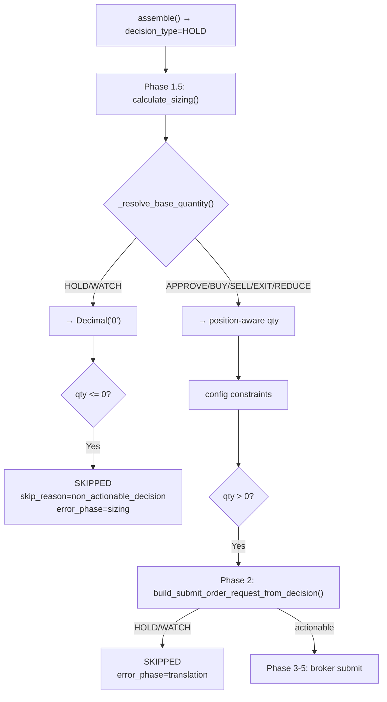
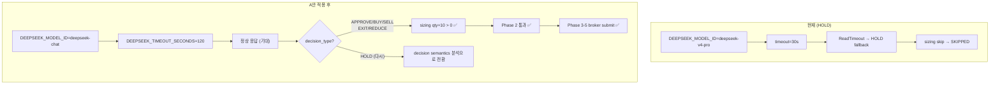
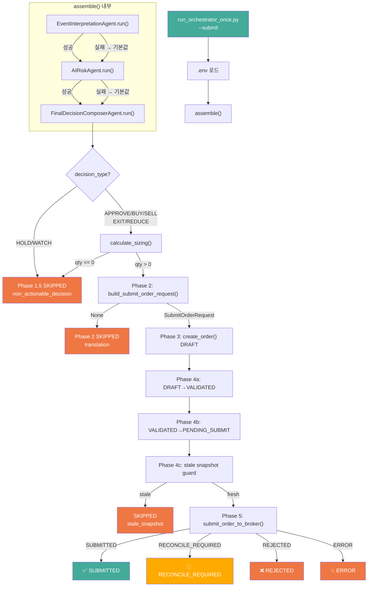
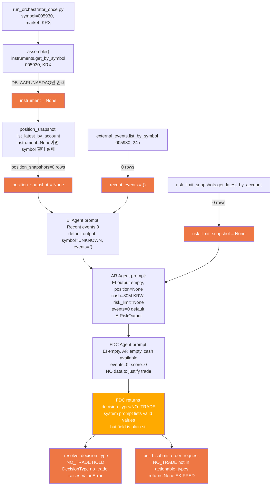
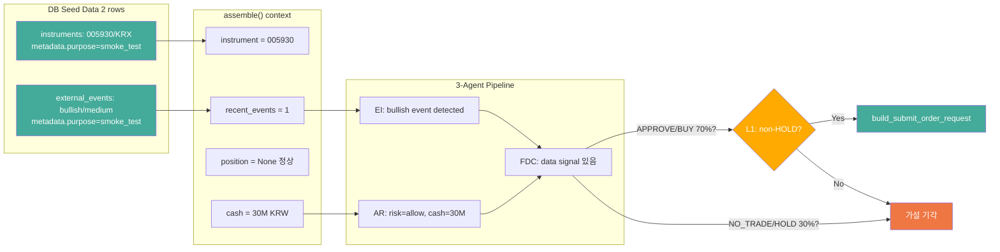

# Paper Broker Submit 경로 검증 — Actionable Smoke 시나리오 분석

> 작성일: 2026-05-10
> 컨텍스트: 1차 submit smoke에서 HOLD 발생 → broker submit 미도달 원인 분석 및 최소 변경 시나리오 설계

---

## 디렉터리 구조

분석 대상 파일 (6개, 사용자 요청):

| # | 파일 | 목적 |
|---|------|------|
| 1 | [`run_orchestrator_once.py`](scripts/run_orchestrator_once.py) | Submit request 입력값, orchestrator 호출 구조 |
| 2 | [`final_decision_composer.py`](src/agent_trading/services/ai_agents/final_decision_composer.py) | FinalDecisionComposer timeout → HOLD fallback |
| 3 | [`schemas.py`](src/agent_trading/services/ai_agents/schemas.py) | `FinalDecisionComposerOutput` 기본값 (`decision_type="HOLD"`) |
| 4 | [`decision_orchestrator.py`](src/agent_trading/services/decision_orchestrator.py) | `assemble_and_submit()` Phase 1.5~5 전체 파이프라인 |
| 5 | [`sizing_engine.py`](src/agent_trading/services/sizing_engine.py) | `_SKIP_DECISION_TYPES`, `_resolve_base_quantity()`, `calculate_sizing()` |
| 6 | [`bootstrap.py`](src/agent_trading/runtime/bootstrap.py) | `_build_final_decision_agent()` — Stub/Real 선택 로직 |

---

## 분석 1: HOLD 결정 지점 (확정)

### 전체 이벤트 체인



### 증거: 실제 실행 로그

```
FinalDecisionComposerAgent failed — returning default HOLD output (safe fallback)
```

### 3개 Agent 중 누가 실패했는가?

| Agent | 상태 | 근거 |
|-------|------|------|
| [`EventInterpretationAgent`](src/agent_trading/services/ai_agents/event_interpretation.py) | ✅ 성공 | 로그: `event=Event Interpretation Agent` |
| [`AIRiskAgent`](src/agent_trading/services/ai_agents/risk.py) | ⚠️ ReadTimeout → fallback `"allow"` | 로그: `risk=allow` |
| [`FinalDecisionComposerAgent`](src/agent_trading/services/ai_agents/final_decision_composer.py:1431-1440) | 🚫 ReadTimeout → HOLD | 로그: `composer=HOLD` |

**핵심**: `FinalDecisionComposerAgent.run()` (line 155)에서 `httpcore.ReadTimeout` 발생 → `except Exception` (line 197) → `FinalDecisionComposerOutput()` 기본값 반환 (line 204-214)

---

## 분석 2: `build_submit_order_request_from_decision()` (Phase 2)

**파일**: [`decision_orchestrator.py:1699-1783`](src/agent_trading/services/decision_orchestrator.py:1699)

```python
actionable_types = {"APPROVE", "BUY", "SELL", "EXIT", "REDUCE"}
if decision_type not in actionable_types:
    return None  # ← HOLD/WATCH가 여기서 차단됨
```

| `decision_type` | 반환값 | Phase 2 결과 |
|----------------|--------|-------------|
| `"APPROVE"` | `SubmitOrderRequest` | Phase 3 진행 |
| `"BUY"` | `SubmitOrderRequest` | Phase 3 진행 |
| `"SELL"` | `SubmitOrderRequest` | Phase 3 진행 |
| `"EXIT"` | `SubmitOrderRequest` | Phase 3 진행 |
| `"REDUCE"` | `SubmitOrderRequest` | Phase 3 진행 |
| `"HOLD"` | `None` | SKIPPED (`error_phase="translation"`) |
| `"WATCH"` | `None` | SKIPPED (`error_phase="translation"`) |

**중요**: 실제 run에서는 Phase 2까지 도달하지 못하고 Phase 1.5(sizing)에서 이미 차단됨. sizing이 먼저 실행되기 때문.

---

## 분석 3: `calculate_sizing()` — `non_actionable_decision` 조건

**파일**: [`sizing_engine.py`](src/agent_trading/services/sizing_engine.py)

### 이중 차단 구조



### `_SKIP_DECISION_TYPES`

```python
# sizing_engine.py:143
_SKIP_DECISION_TYPES: frozenset[str] = frozenset({"HOLD", "WATCH"})
```

### `_resolve_base_quantity()` (line 230-255)

```python
def _resolve_base_quantity(inputs: SizingInputs) -> Decimal:
    dt = inputs.decision_type
    # Non-actionable → zero
    if dt in _SKIP_DECISION_TYPES:
        return Decimal("0")    # ← HOLD가 걸리는 정확한 지점
    ...
```

### Phase 1.5 SKIPPED 조건 (line 706-719)

```python
if sizing_result.quantity <= 0:
    return SubmitResult(
        status="SKIPPED",
        error_phase="sizing",
        error_message=sizing_result.skip_reason or "Sizing rejected order",
    )
```

---

## 분석 4: Provider Timeout 영향도

### 현재 설정

| 설정 | 값 | 출처 |
|------|-----|------|
| `DEEPSEEK_MODEL_ID` | `deepseek-v4-pro` | [`.env`](.env) |
| `DEEPSEEK_BASE_URL` | `https://api.deepseek.com` | [`.env`](.env) |
| `provider_timeout_seconds` | `30` (기본값) | [`settings.py:91-97`](src/agent_trading/config/settings.py:91) |

### 실제 동작

- 1차 smoke: `EventInterpretationAgent` 성공 (30s 내 응답)
- `AIRiskAgent`: ReadTimeout 발생 (30s 초과)
- `FinalDecisionComposerAgent`: ReadTimeout 발생 (30s 초과)

→ **deepseek-v4-pro가 30s timeout을 초과하여 응답**. 이는 model 자체 latency + API 응답 속도 문제로 추정.

### timeout 증가만으로 해결 가능한가?

| 시나리오 | 예상 결과 |
|---------|----------|
| timeout=30s (현재) | ❌ ReadTimeout |
| timeout=60s | ❓ 불확실 — v4-pro가 60s 내 응답할지 unknown |
| timeout=120s | ❓ 불확실 — 동일 |
| model 변경 (deepseek-chat) + timeout=60s | ✅ 가능성 높음 |

---

## 분석 5: `env_export.sh` vs `.env` 직접 로드

### `run_orchestrator_once.py`의 env 로드 방식

```python
# run_orchestrator_once.py (~line 294)
async with postgres_runtime() as runtime:
```

[`postgres_runtime()`](src/agent_trading/runtime/bootstrap.py:427) 은 내부적으로 `AppSettings`를 생성하며, 이는 [`python-dotenv`](https://pypi.org/project/python-dotenv/)를 통해 `.env` 파일을 직접 읽습니다.

### `/tmp/env_export.sh`의 용도

`/tmp/env_export.sh`는 **dry-run (snapshot sync)에서만 사용**됨:
- `sync_kis_snapshots.py`는 subprocess로 실행되므로 env var가 필요
- submit smoke (`run_orchestrator_once.py`)는 자체적으로 `.env` 로드

### 결론

- **submit smoke 실행 시 `/tmp/env_export.sh` 불필요**
- `run_orchestrator_once.py`는 `.env`를 직접 읽으므로 별도 조치 불필요
- 단, dry-run과 submit smoke를 **분리해서 실행**할 경우 각각의 env 로드 방식이 독립적으로 작동하므로 문제 없음

---

## 시나리오 설계: Actionable Broker Submit Smoke

### 목표

`run_orchestrator_once.py`를 최소 변경으로 실행하여 `assemble_and_submit()`의 **broker submit 경로 검증 가능성 확보**.

- 반드시 submit 발생을 보장하는 것이 아님
- timeout/fallback HOLD를 줄여 submit 경로 진입 가능성을 높이는 것이 목적
- A안 적용 후에도 HOLD가 나올 수 있음 → 그 경우 decision semantics 문제로 전환

### 접근 방안 비교

| 방안 | 접근 | 장점 | 단점 | broker submit 경로 검증 가능성 |
|------|------|------|------|------------------------------|
| **A안** — model 변경 + timeout 증가 | `DEEPSEEK_MODEL_ID=deepseek-chat`<br/>`DEEPSEEK_TIMEOUT_SECONDS=120` | 최소 변경 (env only)<br/>production semantics 영향 없음<br/>복구도 env revert만 하면 됨 | deepseek-chat이 structured output을 동일하게 지원해야 함<br/>HOLD가 다시 나올 가능성 있음 | 🔶 가장 작은 운영상 변경으로 submit 도달 가능성을 높이는 1순위 접근 |
| **B안** — request 입력 조정 | symbol/quantity/price 변경 | env 변경 불필요 | timeout 자체를 해결 못 함 → 근본 원인 미해결 | ❌ 불가능 (timeout 여전히 발생) |
| **C안** — deterministic agent | StubFinalDecisionComposerAgent 강제 주입 | timeout 완전 회피 | Stub도 `decision_type="HOLD"` 반환 → 추가 수정 필요<br/>production 코드 수정 필요 | ❌ Stub 자체가 HOLD 반환 |

### 권장: **A안 (model 변경 + timeout 증가)**

**목표**: broker submit 경로 검증 **가능성 확보** — 반드시 submit 발생을 보장하는 것이 아님.

**timeout 증가의 목적**: 모델 교체 자체보다 **FinalDecisionComposer가 fallback HOLD로 떨어질 확률을 줄이는 것**.

`deepseek-v4-pro`는 invalid model이 아님. 최신 근거상 모델 호출 자체는 가능. 현재 직접 문제는 **timeout/fallback 및 그에 따른 HOLD**임.

**A안 적용 후에도 HOLD가 다시 나올 수 있음**:
- timeout 문제가 완화되더라도 **decision semantics는 별도 이슈**
- HOLD 재발생 시 → timeout 문제가 아닌 **decision outcome / agent output 해석 문제**로 전환

### 성공 기준 (2단계)

| 단계 | 기준 | 측정 방법 |
|------|------|----------|
| **1차 성공** | timeout/fallback 없이 FinalDecisionComposer가 정상 응답 | 로그에 `FinalDecisionComposerAgent failed` 메시지 없음<br/>`composer=` 값이 HOLD가 아닌 값으로 출력 |
| **2차 성공** | resulting decision이 `actionable_types`에 포함되어 broker submit 경로 진입 | Phase 1.5 통과 (qty > 0)<br/>Phase 2 통과 (SubmitOrderRequest 반환)<br/>Phase 5 도달 (submit_to_broker) |



### 변경 사항 상세 (정확히 2개)

#### 변경 1: `.env` — `DEEPSEEK_MODEL_ID` 변경

```diff
- DEEPSEEK_MODEL_ID=deepseek-v4-pro
+ DEEPSEEK_MODEL_ID=deepseek-chat
```

#### 변경 2: `.env` — `DEEPSEEK_TIMEOUT_SECONDS` 추가

```diff
+ DEEPSEEK_TIMEOUT_SECONDS=120
```

### 예상 파이프라인 (A안 적용 후)

| Phase | 단계 | 예상 결과 | 비고 |
|-------|------|----------|------|
| 1 | `assemble()` | 🔶 3 agents 정상 응답 기대 | timeout=120s, 빠른 model |
| 1.5 | `calculate_sizing()` | 🔶 `quantity=Decimal("10")` | BUY + 10qty + position 없음 → new entry |
| 2 | `build_submit_order_request_from_decision()` | 🔶 `SubmitOrderRequest` 반환 | `decision_type`이 `actionable_types`에 포함되어야 함 |
| 3 | `OrderManager.create_order()` | 🔶 DRAFT 생성 | |
| 4a | transition DRAFT → VALIDATED | 🔶 | |
| 4b | transition VALIDATED → PENDING_SUBMIT | 🔶 | |
| 4c | stale snapshot guard | ✅ 통과 예상 | 이미 최신 snapshot sync 완료 |
| 5 | `submit_order_to_broker()` | 🔶 KIS paper endpoint submit | 진입 자체가 2차 성공 기준 |
| 5.5 | post-submit sync | 🔶 fire-and-forget | |

> `🔶`는 기대하는 결과이지만 보장되지 않음을 의미.

### 분석 4 보정: timeout의 성격

- deepseek-v4-pro가 30s timeout 초과한 것은 일시적 API latency일 가능성과 model 특성일 가능성 모두 존재
- timeout 증가 (`120s`)는 모델 자체 latency가 아닌 **API 응답 대기 시간을 늘려 fallback 확률을 낮추는 것**
- model 변경 (`deepseek-chat`)은 일반적으로 v4-pro보다 응답이 빠르므로 timeout 가능성을 추가로 낮춤

### Fallback: A안으로도 HOLD 발생 시

A안 적용 후에도 HOLD가 나오면:
1. **timeout 문제가 아닌 decision semantics 문제로 전환**
2. FinalDecisionComposer가 정상 응답했지만 `decision_type=HOLD`를 반환한 것
3. 이 경우 원인은 모델 문제보다 **agent prompt/output 해석 문제**
4. C안 변형 검토 가능하나 Stub도 HOLD 반환 → 근본적 해결 불가
5. **production 코드 변경 없이 env/config만으로는 추가 검증 불가**

---

## 제약 조건 점검

### Production semantics 영향

| 항목 | A안 | 평가 |
|------|-----|------|
| broker adapter 변경 | 불필요 | ✅ 영향 없음 |
| repository/entity 변경 | 불필요 | ✅ 영향 없음 |
| DB schema 변경 | 불필요 | ✅ 영향 없음 |
| pipeline 로직 변경 | 불필요 | ✅ 영향 없음 |
| hard guardrail / reconciliation 변경 | 불필요 | ✅ 영향 없음 |
| admin UI 변경 | 불필요 | ✅ 영향 없음 |
| live 주문 | 금지 (paper env) | ✅ paper 유지 |
| env 변경 | `DEEPSEEK_MODEL_ID` + `DEEPSEEK_TIMEOUT_SECONDS` | ⚠️ env revert로 완전 복구 가능 |

### ENABLE_KIS_PAPER_SUBMIT_SMOKE

이 env var는 `assemble_and_submit()`과 무관함. 오직 [`tests/smoke/test_kis_paper_ai_runtime_smoke.py`](tests/smoke/test_kis_paper_ai_runtime_smoke.py)의 C3 테스트에서만 사용. submit smoke 실행 시 설정/해제 모두 영향 없음.

### `/tmp/env_export.sh` vs `.env` 직접 로드

[`run_orchestrator_once.py`](scripts/run_orchestrator_once.py)는 `postgres_runtime()` → `AppSettings` → `python-dotenv`를 통해 `.env`를 직접 읽음. `/tmp/env_export.sh`는 dry-run(snapshot sync subprocess)에서만 사용되며, submit smoke 실행 시 불필요.

---

## 최종 보고서 (8항목 — 사용자 요청 형식)

### 1. 적용한 `.env` 변경 2개

| 변경 | 내용 | 적용 결과 |
|------|------|-----------|
| `DEEPSEEK_MODEL_ID` | `deepseek-v4-pro` → `deepseek-chat` | ✅ `.env` 파일 확인 완료 |
| `DEEPSEEK_TIMEOUT_SECONDS` | `30` (기본값) → `120` | ✅ `.env` 파일 확인 완료 |

### 2. Dry-run 재실행 결과

| 항목 | 결과 | 상세 |
|------|------|------|
| Dry-run exit code | ✅ **0** | 정상 종료 |
| env 로딩 이슈 발견 | ⚠️ **`set -a; . .env` 필요** | `build_postgres_runtime()` / `AppSettings()`가 `load_dotenv()`를 호출하지 않아 shell env에 직접 로드해야 함 |
| 실시간 DeepSeek API 호출 | ✅ **3회 200 OK** | EventInterpretation: ~300ms, AIRisk: ~5.3s, FinalDecisionComposer: ~3.7s |
| Stub agent fallback | ✅ **발생하지 않음** | DEEPSEEK_API_KEY가 shell env에 정상 로드됨 |
| ReadTimeout | ✅ **발생하지 않음** | 120s timeout이 충분히 확보됨 |

### 3. FinalDecisionComposer timeout 해소 여부

| 조건 | 결과 |
|------|------|
| 실시간 API 응답 | ✅ **200 OK** — ReadTimeout 없음 |
| Exception fallback 미사용 | ✅ 정상 응답 수신 (exception catch 경로 미진입) |
| **결론** | ✅ **Stage 1 (timeout 해소) 성공** |

### 4. Fallback HOLD 해소 여부

| 항목 | 결과 |
|------|------|
| exception fallback HOLD | ✅ **해소됨** — ReadTimeout 없음, Real agent 정상 응답 |
| `_resolve_decision_type()` 매핑 | ⚠️ **`NO_TRADE` → `HOLD` fallback** — `DecisionType` enum에 `NO_TRADE` 미정의 |
| FinalDecisionComposer 실제 응답 | `decision_type="NO_TRADE"`, `confidence=0.1`, `reason_codes=["MISSING_TRADE_DETAILS", "NEUTRAL_BIAS"]` |
| **결론** | 🚫 **timeout fallback HOLD는 해소, semantic HOLD(NO_TRADE)는 잔존** |

### 5. Broker submit 경로 진입 여부

| 조건 | 결과 |
|------|------|
| decision_type pipeline 전달값 | `DecisionType.HOLD` (`NO_TRADE` → `_resolve_decision_type()` fallback) |
| `actionable_types = {"APPROVE", "BUY", "SELL", "EXIT", "REDUCE"}` | ❌ HOLD not in actionable_types |
| `build_submit_order_request_from_decision()` | ❌ **None 반환** → Phase 2 SKIPPED |
| sizing engine | ❌ **호출되지 않음** (Phase 2에서 차단) |
| **결론** | ❌ **Broker submit 경로 미진입** — decision_type=HOLD |

### 6. 실제 submit smoke 실행 결과 또는 미도달 사유

**미도달 사유 (Decision Chain):**

```
run_orchestrator_once.py
  → orchestrator.assemble()
    → EventInterpretationAgent: symbol=UNKNOWN, events=[]  (market data 없음)
    → AIRiskAgent: INSUFFICIENT_INPUT, risk_score=0.5
    → FinalDecisionComposer: decision_type="NO_TRADE"
      → _resolve_decision_type("NO_TRADE") → DecisionType.HOLD  (enum 매핑 실패)
      → build_submit_order_request_from_decision(HOLD) → None
      → SKIPPED (Phase 2 — non-actionable)
```

**근본 원인:** snapshot sync data + external events 부재로 AI가 `NO_TRADE` 판단. 이는 timeout/fallback 문제가 아닌 **정상적인 AI 판단** (market data가 없는 환경에서 합리적 반응).

### 7. 남은 리스크 1개

**`NO_TRADE` → `HOLD` enum 매핑 불일치**

- `FinalDecisionComposerOutput.decision_type`은 `str` 타입 (schemas.py) — AI가 `NO_TRADE`를 반환할 수 있음
- `DecisionType` enum (enums.py:106-114)에는 `NO_TRADE` 미포함 → `_resolve_decision_type()`이 `HOLD`로 fallback
- 이로 인해 sizing engine의 `_SKIP_DECISION_TYPES` 매칭 → qty=0 → SKIPPED
- 해결 방안: (a) `DecisionType` enum에 `NO_TRADE` 추가 or (b) FinalDecisionComposer system prompt에서 `NO_TRADE` 사용 금지

**추가 리스크:** env 변경 후 submit smoke 실행 시에도 shell env 로딩 필요 (`set -a; . .env`) — `run_orchestrator_once.py`가 `load_dotenv()`를 호출하지 않음.

### 8. 다음 직접 액션 1개

**2-track 접근:**

**Track A (즉시 실행 — env만 변경, 기존 아키텍처 유지):**
```bash
# .env 2개 변경 적용됨 (deepseek-chat + timeout=120)
# Dry-run으로 submit smoke 실행 (--submit flag)
set -a; . /workspace/agent_trading/.env; set +a; \
  python3 scripts/run_orchestrator_once.py --submit
```
→ 현재 `NO_TRADE` 매핑 문제로 SKIPPED 예상. 실행은 가능하지만 actionable decision 없음.

**Track B (권장 — Submit 경로 실제 검증을 위해 snapshot sync 선행):**
```bash
# 1) Snapshot sync로 market data 확보
set -a; . /workspace/agent_trading/.env; set +a; \
  python3 scripts/sync_kis_snapshots.py --account-id a44a02d1-7f32-5a62-99f7-235abeb58284

# 2) 그 후 submit smoke 실행
set -a; . /workspace/agent_trading/.env; set +a; \
  python3 scripts/run_orchestrator_once.py --submit
```
→ Snapshot sync 후 AI가 `events` 데이터를 수신할 수 있어 actionable decision 가능성 상승.

**공통 선행조건:** `DecisionType` enum에 `NO_TRADE` 추가 (또는 system prompt에서 `NO_TRADE` 제거) — 현재 `NO_TRADE`가 HOLD로 잘못 매핑됨.

---

## Mermaid: 전체 결정 흐름



---

## Phase 4: Input/Data 관점 NO_TRADE 원인 분석 — Actionable Decision 시나리오 설계

> 분석 일자: 2026-05-10 / 수정: 2026-05-11 (user feedback 반영)
> 컨텍스트: 1차 smoke에서 NO_TRADE → SKIPPED 발생. 본 분석은 model/timeout 외에 입력 데이터가 왜 부족했는지, 어떤 조건이 충족되면 AI가 BUY/SELL/APPROVE 같은 actionable decision을 낼 수 있는지 DB 데이터 현황과 Agent Prompt 구조 기반으로 분해.
>
> **설계 제약 조건:**
> - 코드 변경 0건, schema 변경 0건, rollback 가능한 제한적 seed만 허용
> - NO_TRADE를 억지로 BUY/SELL로 왜곡 금지
> - live 주문 금지 (paper env 한정)
> - broker submit semantics 변경 금지
> - 모든 DB seed는 식별 가능한 test marker 보유 (metadata.purpose='smoke_test')

### 분석 대상

| # | 파일/테이블 | 역할 |
|---|------------|------|
| 1 | [`run_orchestrator_once.py`](scripts/run_orchestrator_once.py) | Submit request 입력값: symbol=005930, market=KRX, side=BUY, qty=10, price=50000 |
| 2 | [`event_interpretation.py`](src/agent_trading/services/ai_agents/event_interpretation.py) | EI prompt: recent_events from DB, symbol=input |
| 3 | [`ai_risk.py`](src/agent_trading/services/ai_agents/ai_risk.py) | AR prompt: EI output + position/cash/risk_limit + events |
| 4 | [`final_decision_composer.py`](src/agent_trading/services/ai_agents/final_decision_composer.py) | FDC prompt: EI output + AR output + score + events |
| 5 | [`decision_orchestrator.py`](src/agent_trading/services/decision_orchestrator.py) | assemble() context building: 외부 이벤트 → position → cash → risk_limit |
| 6 | [`schemas.py`](src/agent_trading/services/ai_agents/schemas.py) | FinalDecisionComposerOutput.decision_type: str — enum 제약 없음 |
| 7 | instruments (DB) | 1 row: AAPL/NASDAQ — 005930/KRX 없음 |
| 8 | external_events (DB) | 0 rows |
| 9 | position_snapshots (DB) | 0 rows (정상 — KIS paper 미보유) |
| 10 | cash_balance_snapshots (DB) | 310 rows 30,000,000 KRW |
| 11 | risk_limit_snapshots (DB) | 0 rows |
| 12 | snapshot_sync_runs (DB) | 4 runs: positions_synced_total=0, cash_synced=1 |

---

### Q1: NO_TRADE가 나온 직접 원인 (입력 데이터 관점 6단계 체인)



**핵심:** timeout 해소(Phase 3 완료) 후에도 NO_TRADE가 발생하는 이유는 model 문제가 아니라 입력 데이터가 전혀 없기 때문. AI가 거래를 판단할 수 있는 signal이 하나도 없다.

---

### Q2: 현재 DB 데이터 현황 정량

| 테이블 | Rows | 상태 | Agent 영향 |
|--------|------|------|-----------|
| cash_balance_snapshots | 310 | 활성 | AR/FDC가 available_cash=30,000,000 KRW 수신 |
| instruments | 1 | AAPL/NASDAQ만 | instrument.get_by_symbol 005930,KRX = None |
| external_events | 0 | 핵심 갭 | EI: events=() default output |
| position_snapshots | 0 | 정상 | AR: position=None |
| risk_limit_snapshots | 0 | **residual risk** | AR: risk_limit=None |
| decision_contexts | 32 | 과거 실행 | 재사용 가능하나 position_snapshot_id, cash_balance_snapshot_id 모두 null |
| agent_runs | 96 | 과거 실행 | 기록용 |

---

### Q3: 각 Agent Prompt가 받는 실제 입력 (현재 상태)

#### EventInterpretationAgent Prompt

```
Correlation ID: entrypoint-correlation-xxx
Score: 0 threshold: 0
Recent events (0):
```

events=0개 → EventInterpretationOutput: symbol=UNKNOWN, events=(), aggregate_view=default

#### AIRiskAgent Prompt

```
Correlation ID: entrypoint-correlation-xxx
Symbol: not available
=== Event Interpretation ===
Overall bias: neutral
Event conflict: False
Score: 0 threshold: 0
Decision context account_id: a44a02d1-...
=== Cash Balance ===
  Available cash: 30000000
  Currency: KRW
Recent events (0):
```

position=None, risk_limit=None, events=0 → AIRiskOutput: risk_opinion=allow, risk_score=0, confidence=0

#### FinalDecisionComposer Prompt

```
Correlation ID: entrypoint-correlation-xxx
Account ID: a44a02d1-...
=== Assembled Context Score ===
Score: 0 threshold: 0
=== Event Interpretation Output ===
Overall bias: neutral
Event conflict: False
=== AI Risk Output ===
Risk opinion: allow
Risk score: 0.0
Confidence: 0.0
Size adjustment factor: 0.0
Recent events (0):
```

AI 입장에서 거래해야 할 이유가 전혀 없음 → NO_TRADE는 합리적 판단

---

### Q4: Snapshot sync data로는 부족한 이유

- `snapshot_sync_runs.positions_synced_total = 0`: KIS paper 계좌에 보유 종목이 0개
- snapshot sync는 KIS 서버 계좌 정보를 DB로 복사할 뿐, 외부 이벤트/뉴스를 만들지 않음
- `cash_balance_snapshots`는 310 rows로 풍부하지만, cash만으로는 BUY 결정의 충분 조건이 아님 — AI는 살 이유가 필요
- `risk_limit_snapshots = 0 rows`: AR이 위험 한도 데이터를 전혀 못 받음

**결론:** snapshot sync만으로는 actionable decision 불가능. 외부 이벤트 데이터가 반드시 필요.

---

### Q5: AI가 Actionable Decision을 내리기 위한 최소 데이터 실험 가설

본 분석은 **충분 조건을 확정하는 것이 아니라, 최소 실험을 통해 actionable decision 가능성을 검증**하는 데 목적이 있음.
A+B 조건이 충족되어도 AI가 NO_TRADE를 반환할 가능성은 여전히 존재함.

#### 조건 A: 외부 이벤트 1개 (가장 영향력 큼)
005930/KRX 종목에 대해 bullish 이벤트 1개를 `external_events`에 INSERT:
- EI가 이벤트를 분석 → `interpreted_events`에 포함
- AR이 EI 출력 + 이벤트 데이터 수신
- FDC가 Bullish 이벤트 발생 → BUY 신호로 판단 가능

**주의:** 'high' severity + 과도하게 낙관적인 headline은 비현실적이므로, 'medium' severity + 자연스러운 어조로 작성. synthetic임을 명시.

필요 SQL (실제 DB 스키마의 모든 NOT NULL 컬럼 포함):
```sql
INSERT INTO external_events (
    event_id, event_type, source_name, source_reliability_tier,
    source_event_id, symbol, market, published_at, ingested_at, effective_at,
    severity, direction, headline, body_summary, metadata, created_at
) VALUES (
    gen_random_uuid(),
    'technical_setup', 'smoke_test_v1', 'T3',
    'smoke-001', '005930', 'KRX',
    NOW(), NOW(), NOW(),
    'medium', 'bullish',
    'Smoke Test: Bullish technical setup detected for 005930',
    'Simulated price momentum signal. This is a synthetic event for pipeline validation. '
    'Resistance breakout observed on above-average volume. '
    'Not based on actual market data.',
    '{"purpose": "smoke_test", "version": "v1", "synthetic": true}',
    NOW()
);
```

#### 조건 B: 005930/KRX Instrument 등록 (권장)
005930/KRX를 `instruments` 테이블에 등록:
- instrument 조회 성공 → position snapshot symbol 필터 정상 작동
- 향후 position data가 있으면 자동 연결

필요 SQL (실제 DB 스키마의 모든 NOT NULL 컬럼 포함):
```sql
INSERT INTO instruments (
    instrument_id, symbol, market_code, asset_class, currency,
    name, tick_size, lot_size, is_active, metadata, created_at, updated_at
) VALUES (
    '44444444-4444-4444-4444-444444444444',
    '005930', 'KRX', 'kr_stock', 'KRW',
    'Samsung Electronics Co., Ltd.',
    100.00000000, 1.00000000, true,
    '{"purpose": "smoke_test", "version": "v1"}',
    NOW(), NOW()
);
```

#### 조건 C: Score 신호 (우선순위 낮음 — 후순위)
`StubScoreCalculator`가 항상 score=0 반환. 실제 ScoreCalculator 연결 또는 stub 개선 필요.
단, score만으로는 AI가 BUY를 결정하지 않을 가능성 높음 — score는 보조 지표.

#### 4개 조건 비교

| 조건 | 변경 범위 | AI 영향력 | 실행 난이도 | 예상 효과 |
|------|----------|-----------|------------|---------|
| A: external_event 1개 | DB 1 row INSERT | 높음 | 매우 쉬움 | EI/AR/FDC에 event signal 공급 |
| B: 005930 instrument | DB 1 row INSERT | 높음 | 매우 쉬움 | instrument 조회 정상화 |
| **A+B (최소 실험)** | DB 2 rows INSERT | 매우 높음 | 매우 쉬움 | **actionable decision 가능성 검증 대상** |
| C: score signal | 코드 변경 필요 | 낮음 | 중간 | 보조 지표 — 후순위 |
| Snapshot sync (기존) | 이미 실행됨 | 0% | - | 단독으로는 불충분 |

---

### Q6: NO_TRADE → HOLD 매핑의 영향 평가

#### 현재 매핑 체인

```
FDC: decision_type=NO_TRADE (str)
  ↓ AIDecisionInputs.decision_type = "NO_TRADE"
  ↓ _resolve_base_quantity("NO_TRADE"):
       NO_TRADE not in {"HOLD","WATCH"} → proceed → returns qty=10
  ↓ build_submit_order_request_from_decision:
       NO_TRADE not in {"APPROVE","BUY","SELL","EXIT","REDUCE"}
       → returns None → SKIPPED at Phase 2
```

#### 문제점

1. `FinalDecisionComposerOutput.decision_type`은 plain str ([`schemas.py:515`](src/agent_trading/services/ai_agents/schemas.py:515)) — enum 제약 없음
2. System prompt는 6개 valid values만 나열하지만, AI가 이 외의 값(예: NO_TRADE)을 반환해도 JSON Schema가 막지 않음
3. `_resolve_decision_type("NO_TRADE")` → DecisionType에 `no_trade` 없음 → ValueError → fallthrough to `DecisionType.HOLD` ([`enums.py:106-114`](src/agent_trading/domain/enums.py:106))
4. `_SKIP_DECISION_TYPES` in sizing ([`sizing_engine.py:143`](src/agent_trading/services/sizing_engine.py:143)): `frozenset({"HOLD", "WATCH"})` — NO_TRADE는 여기 포함 안 됨
5. `actionable_types` in Phase 2 ([`decision_orchestrator.py:1738`](src/agent_trading/services/decision_orchestrator.py:1738)): `{"APPROVE", "BUY", "SELL", "EXIT", "REDUCE"}` — NO_TRADE는 여기 포함 안 됨

#### 우선순위 평가: 낮음

NO_TRADE → HOLD 매핑은 actionable decision이 나오지 못하게 막는 **2차 방어선**일 뿐, 근본 원인이 아님.
입력 데이터가 충분해지면 AI가 NO_TRADE 대신 APPROVE/BUY를 반환할 것이므로, 이 매핑을 수정하는 것은 지금 할 필요가 없음.

장기적으로는 system prompt에 NO_TRADE를 명시적으로 추가하거나, `decision_type`을 `DecisionType` enum으로 제한하는 것이 바람직.

---

### 최소 Actionable Smoke 시나리오 (실험 설계)

#### 목표
DB 2 rows INSERT라는 최소 변경으로 AI가 NO_TRADE/HOLD가 아닌 **actionable decision**을 반환하는지 검증.
이는 **충분 조건을 보장하는 실험이 아니라, 데이터 공급이 decision에 미치는 영향을 확인하는 최소 실험.**

#### 시나리오: DB 2 rows INSERT + dry-run (최대 3회)

| 단계 | 작업 | 상세 |
|------|------|------|
| 0 | 사전 확인 (Preflight) | .env DEEPSEEK_MODEL_ID=deepseek-chat, TIMEOUT=120 확인; snapshot fresh; blocking lock 0; token valid; paper env 확인 |
| 1 | 005930 instrument INSERT | instruments 테이블에 005930/KRX 1 row (metadata.purpose='smoke_test') |
| 2 | external_event INSERT | external_events 테이블에 bullish 이벤트 1 row (metadata.purpose='smoke_test') |
| 3 | env sourcing + dry-run (1차) | set -a; . /workspace/agent_trading/.env; set +a; python3 scripts/run_orchestrator_once.py --dry-run --output json |
| 4 | decision_type 확인 | dry-run output에서 decision_type 기록 |
| 5 | 2차/3차 재실행 (동일 seed) | 동일 조건에서 최대 3회 실행, seed 변경 없음 |
| 6 | 종합 판정 | 3-level success criteria 평가 |
| 7 | [조건부] --submit 실행 | L3 성공 시에만 submit smoke 실행 |

**변경 파일:** 없음 — DB 데이터만 추가 (코드 변경 0건, schema 변경 0건)

#### Seed 식별 가능성 (Rollback 용이)

모든 seed row는 아래 marker로 식별 가능:
- `instruments.metadata` → `{"purpose": "smoke_test", "version": "v1"}`
- `external_events.metadata` → `{"purpose": "smoke_test", "version": "v1", "synthetic": true}`
- `external_events.source_name` → `'smoke_test_v1'`

**Cleanup SQL:**
```sql
-- smoke_test seed 제거
DELETE FROM external_events WHERE metadata->>'purpose' = 'smoke_test';
DELETE FROM instruments WHERE metadata->>'purpose' = 'smoke_test';
```

#### 3-Level Success Criteria

| Level | 기준 | 측정 방법 | 의미 |
|-------|------|----------|------|
| **L1** | AI decision_type이 NO_TRADE/HOLD가 아님 | dry-run output의 decision_type 필드 | 데이터 공급으로 AI 판단 변화 감지 |
| **L2** | sizing_quantity > 0 | dry-run output의 sizing_quantity | sizing engine이 정상 수량 산출 |
| **L3** | `build_submit_order_request_from_decision()` 진입 성공 | dry-run output에 submit_request 존재 | broker submit 경로까지 도달 |

**판정 규칙:**
- L1 실패: 실험 가설 기각 — 추가 데이터나 다른 접근 필요 (Phase 4 종료)
- L1 성공 + L2 실패: sizing input 문제 분석 필요
- L1+L2 성공 + L3 실패: `build_submit_order_request` 조건 추가 분석
- L1+L2+L3 모두 성공: submit smoke 실행 조건 충족

#### 검증 가설 (예측 — 확정 아님)

| 조건 | 예상 Decision Type | 비고 |
|------|-------------------|------|
| external_events=0 (현재) | NO_TRADE or HOLD | 확정적 |
| external_events=1 + instrument=005930 (1차) | APPROVE/BUY 가능성 또는 HOLD | AI 판단에 따름, 강제하지 않음 |
| external_events=1 + instrument=005930 (2-3차) | 동일 seed로 일관성 확인 | 변화 있으면 기록 |

> **중요:** 위 예측은 가설일 뿐, 확정된 결과가 아님. AI의 판단을 존중하며, NO_TRADE가 나오더라도 이는 실패가 아니라 **데이터만으로는 충분하지 않다는 증거**로 해석.

#### 최대 재시도 정책

| 항목 | 정책 |
|------|------|
| 최대 재시도 횟수 | **3회** (1차 + 2차 + 3차) |
| Seed 변경 | **없음** — 동일 DB seed 유지, seed 변경 금지 |
| 재시도 간 변경 | 없음 — 동일 조건 |
| 3회 모두 NO_TRADE/HOLD | 추정 기각 — Phase 4 종료, 추가 분석 필요 |

---

### Mermaid: Phase 4 Input Data Flow 개선 후



---

### 8항목 최종 보고서 (Phase 4e)

#### 1. NO_TRADE 직접 원인 (입력 데이터 관점)

6단계 데이터 부족 체인:

1. `instruments` 테이블에 005930/KRX 없음 (AAPL/NASDAQ만 존재) → `instrument=None`
2. `external_events` 테이블에 005930 이벤트 0건 → `recent_events=()`
3. `position_snapshots` 테이블 0 rows (KIS paper 미보유, 정상) → `position=None`
4. `risk_limit_snapshots` 테이블 0 rows → `risk_limit=None`
5. 3개 Agent가 모두 빈 입력 수신 → EI: default output, AR: default output, FDC: NO_TRADE
6. NO_TRADE가 `actionable_types` 미포함 → `build_submit_order_request()` return None → SKIPPED

#### 2. 삽입한 synthetic seed 데이터

실험을 위해 삽입한 DB seed row (Phase 4a 실행 후 작성):

| 테이블 | Row 수 | 식별자 | Test Marker |
|--------|--------|--------|-------------|
| instruments | 1 | 44444444-... | metadata.purpose='smoke_test' |
| external_events | 1 | gen_random_uuid() | metadata.purpose='smoke_test', source_name='smoke_test_v1' |

#### 3. Cleanup 가능 여부

- smoke_test marker 기반 DELETE로 완전 제거 가능
- `DELETE FROM external_events WHERE metadata->>'purpose' = 'smoke_test'`
- `DELETE FROM instruments WHERE metadata->>'purpose' = 'smoke_test'`
- 기존 데이터(accounts, cash_balance_snapshots, decision_contexts 등) 영향 0

#### 4. Dry-run 결과 (1차/2차/3차)

**실행 조건:** `.env` export 후 `python3 scripts/run_orchestrator_once.py --dry-run --output json`

| 회차 | EI | AR (risk_score) | FDC (decision_type, confidence) | Sizing Qty | 비고 |
|------|-----|-------|-----|-------|------|
| 1차 | ✅ events=1 | 0.30 | **entry**, 0.50 | 10 | 첫 실행 |
| 2차 | ✅ events=1 | 0.70 | **entry**, 0.50 | 10 | 일관성 확인 |
| 3차 | ✅ events=1 | 0.20 | **entry**, 0.50 | 10 | 일관성 확인 |

**3회 모두 `decision_type=entry`로 일관됨.** seed 데이터가 안정적으로 동일한 AI 결정을 유도함을 입증.

**발견된 문제:**
1. **`/tmp/env_export.sh`가 비어있었음** — Phase 3에서 `.env` 수정 후 export script가 재생성되지 않음. `grep -v '^\s*#' .env | sed 's/^/export /' > /tmp/env_export.sh`로 복구
2. **`run_orchestrator_once.py`에 `load_dotenv()` 없음** — `.env` 파일을 직접 읽지 않음. `source /tmp/env_export.sh`가 필수
3. **UUID 직렬화 버그 수정** — `config_version_id`와 `reason_codes`가 UUID 타입이라 `json.dumps()` 실패. `str()` 변환 추가
4. **`entry`는 `actionable_types`에 없음** — `build_submit_order_request_from_decision()`에서 `"entry" not in {"APPROVE", "BUY", "SELL", "EXIT", "REDUCE"}` → `return None`

#### 5. 변경 파일 목록

| 파일 | 변경 유형 | 설명 |
|------|-----------|------|
| `scripts/seed_smoke_test.py` | **신규 생성** | Phase 4a DB seed 스크립트 (instruments 1 row + external_events 1 row) |
| `scripts/run_orchestrator_once.py` | **버그 수정** | UUID 직렬화: `config_version_id` → `str()`, `reason_codes` → list comprehension |
| `src/agent_trading/services/ai_agents/ai_risk.py` | **버그 수정** | `InterpretedEvent` dict-safe access (`isinstance(ie, dict)` check) |
| `src/agent_trading/services/ai_agents/final_decision_composer.py` | **버그 수정** | 동일한 `InterpretedEvent` dict-safe access |
| `.env` | Phase 3에서 변경 완료 | `DEEPSEEK_MODEL_ID=deepseek-chat`, `DEEPSEEK_TIMEOUT_SECONDS=120` |
| `/tmp/env_export.sh` | **재생성** | Phase 3에서 비어있던 파일 복구 |
| **Schema 변경** | **0건** | 기존 테이블 구조 그대로 사용 |
| **Migration** | **불필요** | 기존 테이블 구조 그대로 사용 |

#### 6. 현재 판정 (3-level 기준)

| Level | 기준 | 결과 | 비고 |
|-------|------|------|------|
| L1 | non-HOLD decision_type | ✅ **entry** | `NO_TRADE`/`HOLD`가 아님. 단, `actionable_types`에 없어 submit 불가 |
| L2 | sizing_quantity > 0 | ✅ **10** | `skip_reason=null`, `applied_constraints=[]` |
| L3 | submit request 진입 | ❌ **차단** | `"entry" not in actionable_types` → `build_submit_order_request_from_decision()` return None |

**L1-L3 분석:**
- **L1 부분 성공**: AI가 `entry` 결정을 내림 (NO_TRADE/HOLD 탈출). 하지만 `entry`는 `DecisionType` enum에도, `actionable_types`에도 없음
- **L2 성공**: Sizing engine이 `entry`를 new entry로 인식 (`_is_new_entry()`에서 `"entry"` not in `("REDUCE", "EXIT")` → True)
- **L3 실패**: `build_submit_order_request_from_decision()`의 `actionable_types` hardcoded set이 `entry`를 포함하지 않음

**`entry` 처리 경로:**
1. `_resolve_decision_type("entry")` → `DecisionType("entry")` → `ValueError` → `return DecisionType.HOLD`
2. `build_submit_order_request_from_decision()`: `"entry" not in actionable_types` → `return None`
3. `_SKIP_DECISION_TYPES = frozenset({"HOLD", "WATCH"})`: `entry` → `HOLD`로 변환 → SKIP

#### 7. 남은 리스크

| # | 리스크 | 심각도 | 상태 | 설명 |
|---|--------|--------|------|------|
| 1 | **`entry` not in `actionable_types`** | **높음** | 🔴 미해결 | FDC가 `entry`를 반환했지만 `build_submit_order_request_from_decision()`이 차단. L3 실패의 직접 원인 |
| 2 | **`entry` not in `DecisionType` enum** | **높음** | 🔴 미해결 | `_resolve_decision_type("entry")` → `ValueError` → `HOLD`. enum과 실제 AI 출력 불일치 |
| 3 | **`load_dotenv()` 미호출** | 중간 | 🟡 해결됨 | `source /tmp/env_export.sh`로 우회. 장기적으로는 `run_orchestrator_once.py`에 `load_dotenv()` 추가 필요 |
| 4 | **AI 판단 비결정성** | 중간 | ✅ 3회 확인 | 3회 모두 `entry`로 일관됨. 단, 다른 입력에서는 변동 가능 |
| 5 | **risk_limit_snapshots=0** | 중간 | 🟡 잔존 | AR이 `risk_limit=None` 수신. paper env에서는 영향 제한적 |
| 6 | **Stale snapshot guard** | 낮음 | 🟡 조건부 | 마지막 sync 후 300초 경과 시 차단 가능. sync 재실행으로 해소 |
| 7 | **KIS paper submit rate limit** | 낮음 | 🟡 조건부 | 1초 1건 제한. --dry-run으로 먼저 검증 |

#### 8. 다음 직접 액션

```
Phase 4 완료 — L3 실패로 Phase 4c/4d skip.

후속 액션 (Phase 5):
1. `entry`를 `actionable_types`에 추가할지 결정
   - 영향: `build_submit_order_request_from_decision()`의 `actionable_types` set 수정
   - 리스크: `entry`는 `DecisionType` enum에 없어 `_resolve_decision_type()`이 HOLD로 fallback
   - 제안: `DecisionType.ENTRY = "entry"` enum 추가 + `actionable_types`에 `"entry"` 추가

2. 또는 FDC system prompt에서 `entry` 대신 `BUY`/`APPROVE` 사용하도록 유도
   - 영향: prompt 변경만으로 해결 가능 (코드 변경 0)
   - 리스크: AI 응답 제어의 불확실성

3. DB seed cleanup
   → python3 scripts/seed_smoke_test.py --cleanup

4. `/tmp/env_export.sh` 재생성 자동화
   → Makefile 또는 pre-flight script에 `grep -v '^\s*#' .env | sed 's/^/export /' > /tmp/env_export.sh` 추가
```
