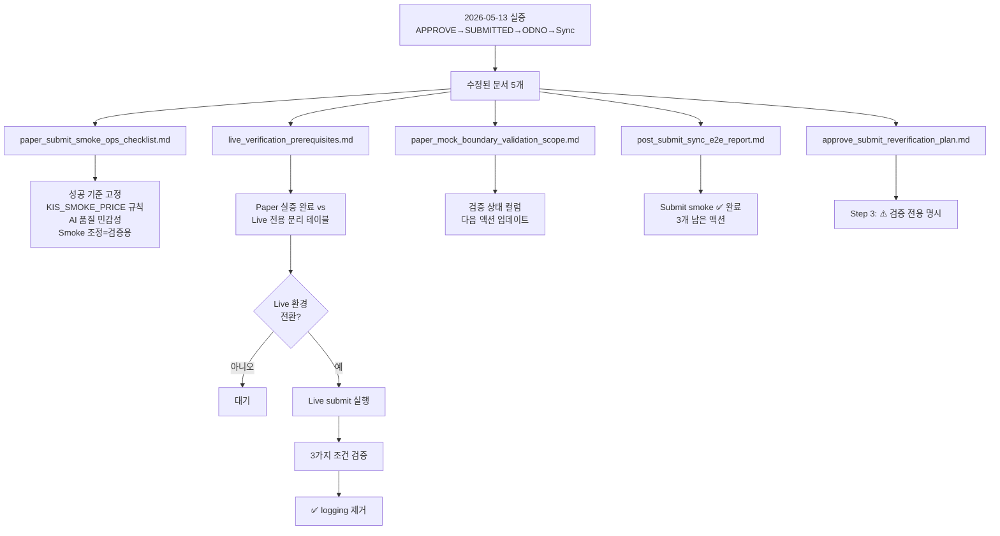

# Paper Submit 성공 경로 문서 고정 + Live 전환 전 잔여 체크 정리 — 최종 보고

> **작성일**: 2026-05-13 KST  
> **목표**: APPROVE submit + post-submit sync 재검증 결과를 운영 기준으로 고정하고, live 전환 전 남은 체크 항목 분리

---

## 1. 수정한 문서 목록 (5개)

| # | 문서 | 변경 내용 | 상태 |
|---|------|----------|------|
| 1 | [`paper_submit_smoke_ops_checklist.md`](plans/paper_submit_smoke_ops_checklist.md) | **4개 변경**: 2-B KIS_SMOKE_PRICE 시장가 일치 설명, 7-C KIS API 현재가 조회 명령어, 8-E AI 입력 품질 민감성, 8-F Smoke 조정 기법(검증 전용), 9-C 성공 기준 검증 상태 컬럼 | ✅ |
| 2 | [`live_verification_prerequisites.md`](plans/live_verification_prerequisites.md) | **신규 Section 6** "Paper 실증 완료 vs Live 전용 분리" 추가 (6.1 Paper 완료/6.2 Live 전용/6.3 Logging 조건 관계). 기존 6→7, 7→8 재번호 | ✅ |
| 3 | [`paper_mock_boundary_validation_scope.md`](plans/paper_mock_boundary_validation_scope.md) | Section 2: 검증 상태 컬럼 추가 (+`side`/`requested_quantity`). Section 8: 완료/남은 액션 분리. Section 9.6: 3가지 조건 테이블 | ✅ |
| 4 | [`post_submit_sync_e2e_report.md`](plans/post_submit_sync_e2e_report.md) | Section 6: "Submit smoke 재시도" → ✅ 완료. 남은 액션 3개로 재구성 | ✅ |
| 5 | [`approve_submit_reverification_plan.md`](plans/approve_submit_reverification_plan.md) | Step 3: ⚠️ "검증 전용 임시 조치 — 운영 절차가 아님" 명시 + cross-ref to 8-F | ✅ |

---

## 2. 핵심 결론 (5가지)

### 2.1 Paper Submit 성공 경로 확정
```
APPROVE → SUBMITTED → ODNO 발급 → post-submit sync 성공 → reconcile_required (허용)
```
- 2026-05-13 KST 09:36~09:48 실증으로 **모든 단계 ✅ 확인**
- 성공 기준 문서 [`paper_submit_smoke_ops_checklist.md#9-C`](plans/paper_submit_smoke_ops_checklist.md:538)에 고정

### 2.2 KIS_SMOKE_PRICE = 시장가 필수 일치
- 26850 ❌ (전일종가), 50000 ❌ (임의값) → 267000 ✅ (당일 시장가)
- **당일 현재가** (`stck_prpr`)를 KIS API로 조회 후 설정
- [`paper_submit_smoke_ops_checklist.md#7`](plans/paper_submit_smoke_ops_checklist.md:345)에 3-try 비교표 + KIS API 조회 명령어 추가

### 2.3 AI 결정 품질 = 입력 이벤트 품질에 비례
| 조건 | 결과 |
|------|------|
| stale + synthetic + headline=NULL | HOLD (AI가 판단 불가) |
| fresh + headline=구체적 + severity=high + direction=positive + importance=high | APPROVE ✅ |
- [`paper_submit_smoke_ops_checklist.md#8-E`](plans/paper_submit_smoke_ops_checklist.md:454)에 상관관계 분석 추가

### 2.4 Smoke Event 데이터 조정 = 검증용 기법 (운영 절차 아님)
- DB UPDATE로 `published_at`, `headline`, `severity`, `direction`, `importance` 보정
- **운영 환경에서 사용 금지** — Live에서는 실제 OpenDART 공시 데이터 사용 예상
- [`paper_submit_smoke_ops_checklist.md#8-F`](plans/paper_submit_smoke_ops_checklist.md:468) + [`approve_submit_reverification_plan.md#step-3`](plans/approve_submit_reverification_plan.md:55)에 명시

### 2.5 Live 전용 검증 항목 3가지
Paper mock에서 검증 불가능하며, **Live 환경에서만 확인 가능**:

1. `inquire-daily-ccld` 실제 payload (`output_count > 0`)
2. ODNO 매칭 성공 (`item.get("ODNO") == broker_order_id`)
3. Terminal status 수렴 (FILLED/CANCELLED/REJECTED)

→ [`live_verification_prerequisites.md#6`](plans/live_verification_prerequisites.md:148)에 분리 완료

### 2.6 Stale PENDING_SUBMIT 정리 기준 (2026-05-13 확정)

**운영 규칙**: near-real execution 환경에서 broker 미제출 `pending_submit` 주문은 24h 기준으로 정리한다.

| 항목 | 기준 |
|------|------|
| 대상 | `status='pending_submit' AND created_at < 24h AND no broker_orders` |
| 처리 | `PENDING_SUBMIT → REJECTED` (reason_code=`stale_cleanup`) |
| 증적 | `order_state_events`에 상태전이 이벤트 INSERT |
| 도구 | [`_cleanup_pending_submit.py`](_cleanup_pending_submit.py) |
| 실행 결과 (2026-05-13) | 15건 정리 완료. `reconcile_required` 6건 영향 없음. |

> **중요**: `pending_submit`과 `reconcile_required`는 별개 상태다. `reconcile_required`는 broker 제출 후 응답 불확실 상태로, cleanup 대상이 아니다.

---

## 3. 코드 변경 여부

**이번 턴: 코드 변경 없음** — 문서/검증 기준만 수정. 단, [`_cleanup_pending_submit.py`](_cleanup_pending_submit.py)는 일회성 운영 스크립트로 추가됨.

기존 instrumentation logging (`rest_client.py:896-928`)은 **Live 검증 조건 충족 시까지 유지**.

---

## 4. 남은 리스크 2개

### 4.1 Live `inquire-daily-ccld` 응답 구조가 paper mock과 다를 가능성

Paper mock은 `output: []` (빈 배열)이지만, Live 응답 구조가 코드가 예상하는 형식과 다를 수 있음. Instrumentation logging이 DEBUG 레벨로 남아있으면 첫 Live 호출 시 즉시 탐지 가능.

→ [`paper_mock_boundary_validation_scope.md#95-남은-리스크-1개`](plans/paper_mock_boundary_validation_scope.md:171) 유지

### 4.2 Stale `pending_submit` 재발생 가능성

24h 이상 broker 미제출 주문이 다시 쌓일 수 있음. 정기적인 stale cleanup 실행 필요. 향후 운영 절차에 포함.

---

## 5. 다음 액션 2개

### 5.1 Live 환경 전환 + 3가지 logging 제거 조건 검증

| # | 조건 | 확인 방법 |
|---|------|----------|
| 1 | `inquire-daily-ccld` `output_count > 0` | DEBUG logging 출력 확인 |
| 2 | ODNO 매칭 성공 | INFO logging에 ODNO match failure 미출력 |
| 3 | Terminal status 수렴 (FILLED/CANCELLED/REJECTED) | DB `broker_orders.broker_status` 확인 |
| — | 모두 충족 시 logging 제거 | `git checkout -- src/agent_trading/brokers/koreainvestment/rest_client.py` |

상세: [`live_verification_prerequisites.md#7-logging-제거-조건-요약`](plans/live_verification_prerequisites.md:193)

### 5.2 정기 stale pending_submit cleanup (운영 절차)

24h 이상 broker 미제출 주문이 다시 쌓이면 [`_cleanup_pending_submit.py`](_cleanup_pending_submit.py) 실행.

---

## 6. 다이어그램: 문서 간 관계


