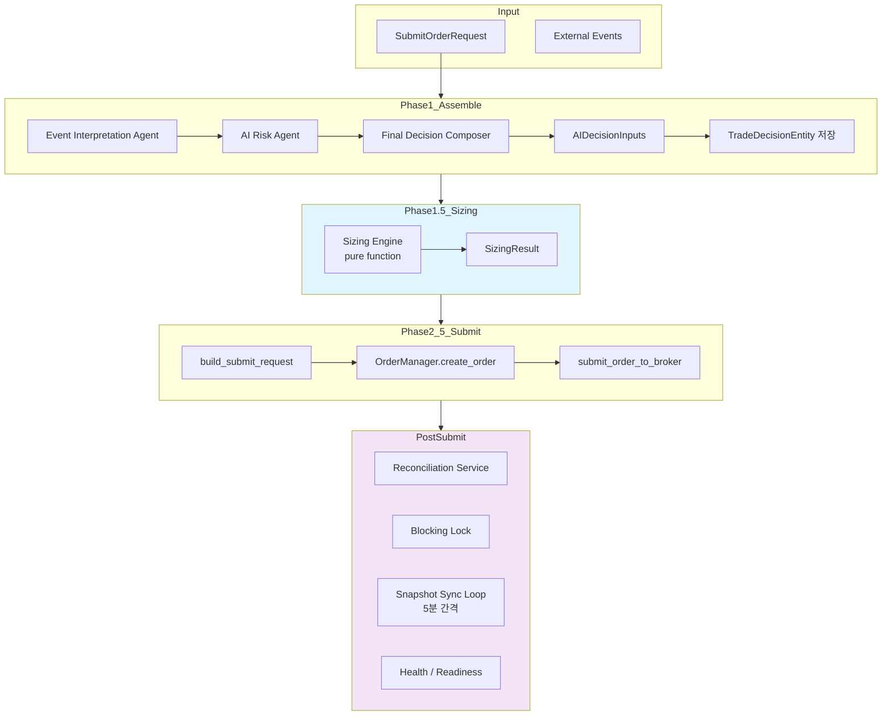

# Paper Trading Loop Validation — Plan

> **목적**: KIS paper 환경에서 실제 운영 루프를 반복 가능하게 검증하는 기반을 완성한다.
> live canary로 바로 가지 않고, paper에서 충분한 검증을 마친 후 live로 전환한다.
>
> **상태**: 구현 완료 (Gap 5 사전 작업 → Paper Trading Loop Validation으로 승격)
>
> **사용자 피드백 반영**:
> 1. **Stale Snapshot 차단 위치**: submit 단계(Phase 5)에서 차단, assemble은 정상 실행
> 2. **Replay 검증 초점**: broker 결과 재현이 아닌 동일 입력→동일 sizing/SubmitOrderRequest 결정론적 검증
> 3. **단발 vs 반복 실행 분리**: `run_orchestrator_once.py`는 단발 유지, 반복은 `verify_paper_loop.py` 전담
> 4. **Go/No-Go 조건 판정 방법**: 각 조건별 테스트/스크립트/health signal 매핑
---

## 1. Paper Trading Loop Inventory

### 현재 충족된 요소

| 영역 | 상태 | 상세 |
|------|------|------|
| **Decision** | ✅ 완료 | `assemble()` — EI→AR→FDC 3-agent chain, `AIDecisionInputs` contract, `AssembledContext` with position/cash/risk snapshots. `TradeDecisionEntity` persistence. Decision context ↔ order traceability |
| **Sizing** | ✅ 완료 | Phase 1.5: position-aware/config-driven deterministic sizing. `calculate_sizing()` 8-step pure function. Cash/concentration/bounds/lot-size constraints |
| **Submit** | ✅ 완료 | `assemble_and_submit()` 5-phase pipeline. `OrderManager` state machine (DRAFT→VALIDATED→PENDING_SUBMIT→SUBMITTED). `submit_order_to_broker()` with blocking lock check. Broker adapter protocol. 7 E2E scenarios verified |
| **Reconciliation** | ✅ 완료 | `ReconciliationService` — blocking lock acquire/release/check, unknown state resolution via `resolve_unknown_state()` and `resolve_and_mark()`. `transition_to_authoritative()` for broker inquiry results |
| **Snapshot Sync** | ✅ 완료 | `run_snapshot_sync_loop.py` scheduler (5-min interval). `sync_all_accounts()` auto-discover. Broker-agnostic `SnapshotFetchProvider`. Execution history (`SnapshotSyncRunEntity`). Freshness/health check. Grace period |
| **Health / Readiness** | ✅ 완료 | `GET /health` with snapshot freshness fields. `GET /health/readyz` with stale-sync→degraded policy. Startup grace period |
| **Observability** | ✅ 완료 | Inspection API (orders, decisions, contexts, agent runs, audit logs). Admin UI (read-only dashboard). `AgentRunRecorder`. Audit log. Order state events |
| **CLI Entry Points** | ✅ 완료 | `scripts/run_orchestrator_once.py --submit`. `scripts/run_snapshot_sync_loop.py`. `scripts/run_post_submit_sync_loop.py`. `scripts/run_paper_decision_loop.py`. `scripts/sync_snapshots.py` |
| **Test Coverage** | ✅ 완료 | 444+ service tests. 7 E2E safe order path tests. 37 sizing engine tests. 22 pipeline tests. Paper loop smoke tests (in-memory + Postgres). KIS paper smoke tests. AI runtime smoke tests. Three-agent chain smoke tests |

### 부족한 요소

| 영역 | 상태 | 격차 |
|------|------|------|
| **Event Ingestion** | ❌ 미착수 | External event 데이터 수집 파이프라인 없음. `ExternalEventEntity` 저장소는 있으나 주기적 수집 루프 없음. Market data ingestion 없음 |
| **Continuous Decision Loop** | ✅ 완료 | `scripts/run_paper_decision_loop.py` 신규 생성 (300s 간격, `--count`, `--dry-run`, `--submit`, `--interval`, `--output json`). 기존 snapshot sync / post-submit sync loop와 역할 분리 |
| **Fill Sync / Post-Submit Update** | ❌ 미착수 | 주문 제출 후 broker로부터 fill 상태를 주기적으로 polling하는 루틴 없음. `reconciliation_service.resolve_unknown_state()`는 수동 트리거 전용 |
| **Position/Cash Refresh After Fill** | ❌ 미착수 | Fill 발생 후 position snapshot/cash balance snapshot 자동 갱신 경로 없음. Snapshot sync loop와 decision pipeline이 분리되어 있음 |
| **PnL Calculation** | ❌ 미착수 | Paper PnL 계산 로직 없음. 체결 데이터는 저장되나(PositionSnapshot / FillEvent), 수익률 계산 경로 없음 |
| **Replay / Backtest** | ✅ 구현 완료 | 결정론적 replay 검증: `ReplayBundle` dataclass + `_build_repos()` factory + 5개 parametrize 시나리오 + 2-run identity. `replay_test_harness.py` 공유 모듈. `replay_verification.py` 운영 검증 스크립트. Historical backtest는 후속 |
| **Paper Go/No-Go Gate** | ✅ 구현 완료 | `PaperGateService.evaluate()` 8개 check + `GET /performance/paper-go-no-go` API. 7개 테스트 통과 |
| **Paper Exit Criteria (3-Layer)** | ✅ 신규 구현 | [paper_exit_criteria.md](plans/paper_exit_criteria.md) 설계 + [`scripts/evaluate_paper_exit.py`](scripts/evaluate_paper_exit.py) CLI (Layer A/B/C + 최종 종합). 8개 테스트 통과 |
| **User Integration Test Scenarios** | △ 부분적 | E2E safe order path 테스트(7개)는 있으나 "사용자 시나리오" 관점으로 패키징되지 않음 |

---

## 2. 사용자 통합테스트 시나리오 (5개)

### Scenario 1: 정상 진입 승인 → 제출 완료
```text
Given:  account has sufficient cash, no blocking lock
When:   submit request with BUY decision
Then:   pipeline returns SUBMITTED
        order status = SUBMITTED
        broker called exactly once
        trade_decision_id present
        decision_context_id present
        audit log contains order.create + status changes
        sizing constraints logged (if applied)
```

### Scenario 2: HOLD/WATCH → 미제출 (SKIPPED)
```text
Given:  FDC agent returns HOLD or WATCH decision_type
When:   submit request
Then:   pipeline returns SKIPPED
        no order created
        broker NOT called
        no blocking lock acquired
```

### Scenario 3: Uncertain Response → RECONCILE_REQUIRED + Lock
```text
Given:  broker returns uncertain=True (timeout / missing broker_order_id)
When:   submit request
Then:   pipeline returns RECONCILE_REQUIRED
        order status = RECONCILE_REQUIRED
        blocking lock acquired
        second submit attempt blocked (broker NOT called)
        lock persists until resolved
```

### Scenario 4: Stale Snapshot / Health Degraded → Submit 차단 (IMPLEMENTED)
```text
Given:  snapshot_sync_runs의 가장 최근 completed run이
        stale_threshold_seconds(기본 900s=15분)보다 오래됨
        또는 snapshot_sync_runs가 비어 있음 (no_history)
When:   submit request (BUY, APPROVE)
Then:   pipeline 차단 at Phase 4c (Phase 5 직전)
        assemble()는 정상 실행 (snapshot staleness와 무관)
        결과: SubmitResult(status="SKIPPED", error_phase="stale_snapshot")
        broker.submit_order() 호출되지 않음
        GuardrailEvaluationEntity가 STALE_SNAPSHOT blocking_rule_code로 기록됨
```

> **차단 위치**: **Phase 4c** — Phase 4b(VALIDATED→PENDING_SUBMIT) 직후,
> Phase 5(submit to broker) 직전.
>
> **no_history 정책**: snapshot_sync_runs이 비어 있으면 is_stale=True로 간주하여
> 동일하게 차단한다. 이는 초기 구동 시 snapshot sync가 한 번도 실행되지 않은
> 상태에서 허위 주문이 발생하는 것을 방지하기 위한 안전장치.
>
> **Freshness source 한계**: 현재 freshness는 run-level global summary 기준.
> account-level freshness(position_snapshot.captured_at / cash_balance_snapshot.snapshot_at
> per account)는 추후 개선 필요.

### Scenario 5: Duplicate Lock + 재시도 차단
```text
Given:  first call returns uncertain → lock created
        second call with same account/symbol/side
When:   submit request again
Then:   pipeline returns RECONCILE_REQUIRED (status_reason_code = "BLOCKED")
        broker NOT called (call_count unchanged)
        lock still in place
```

---

## 3. Replay / Backtest 접근 방식

### 3.1 Replay-Style 검증 (구현 완료 — 19 tests + verification script)

지금 단계에서는 full historical backtest engine보다 **결정론적 replay 검증**을 우선한다.

**핵심 설계**:

1. **`ReplayBundle` dataclass** — 모든 입력(`SubmitOrderRequest`, `RepositoryContainer`, stub FDC agent)과 기대 출력(status, quantity, guardrail rule, broker call count)을 하나의 bundle로 캡슐화
2. **`_build_repos()` factory** — 완전히 seed된 `RepositoryContainer`를 account, config_version, instrument, 선택적 cash/position snapshot과 함께 생성. 기존 3개 repos fixture(~130줄)를 단일 factory로 대체
3. **`_make_stub_fdc()` factory** — canned `FinalDecisionComposerOutput`을 반환하는 stub FDC agent 생성. 기존 3개 `_StubFDC` 클래스를 단일 factory로 대체
4. **Naming convention**: `_submit` → pipeline이 broker까지 진행; `_guard` → pipeline이 Phase 4c guardrail에서 중단
5. **2-run identity 검증**: 동일 `ReplayBundle`을 fresh repos로 2회 실행하여 완전히 동일한 결과가 나오는지 검증

**5가지 Replay 시나리오**:

| 시나리오 | name | 유형 | 설명 |
|---------|------|------|------|
| A. Happy path BUY | `happy_buy_submit` | submit | 충분한 현금 + fresh snapshot → SUBMITTED, qty=10 |
| B. REDUCE with position | `reduce_with_position_submit` | submit | 10주 보유 중 5주 SELL → SUBMITTED, qty=5 |
| C. EXIT full liquidation | `exit_full_liquidation_submit` | submit | 10주 전량 SELL → SUBMITTED, qty=10 |
| D. Stale snapshot guard | `stale_snapshot_account_guard` | guard | Cash/position snapshot 없음 → SKIPPED, `STALE_SNAPSHOT_ACCOUNT` guardrail, broker 미호출 |
| E. Cash constraint capped | `cash_constraint_capped_submit` | submit | 현금 100,000 / 가격 50,000, buffer 없음 → SUBMITTED, qty=2 (100000//50000) |

**공유 harness**: [`tests/services/replay_test_harness.py`](tests/services/replay_test_harness.py)
- pytest 테스트(`test_decision_replay.py`)와 운영 검증 스크립트(`replay_verification.py`)가 **동일한 `REPLAY_SCENARIOS` 소스**를 재사용
```

### 3.2 Backtest 확장 방향 (후속)

Full backtest는 아래가 준비된 후 검토:
- Market data ingestion (feature snapshot 저장)
- 전략별 score 계산 경로
- Fill simulator
- PnL 계산기

---

## 4. Paper Go/No-Go 기준

### Paper → Live Canary 전환 조건

| # | 조건 | 판정 방법 (테스트/스크립트/health signal) | 필수 |
|---|------|------------------------------------------|------|
| 1 | Safe order path 전 시나리오 통과 (7개) | `pytest tests/services/test_safe_order_path_e2e.py -v` → 7/7 pass | ✅ 현재 통과 |
| 2 | Sizing engine 테스트 전부 통과 (37개) | `pytest tests/services/test_sizing_engine.py -v` → 37/37 pass | ✅ 현재 통과 |
| 3 | Pipeline 테스트 전부 통과 (22개) | `pytest tests/services/test_decision_submit_pipeline.py -v` → 22/22 pass | ✅ 현재 통과 |
| 4 | 전체 서비스 테스트 회귀 없음 | `pytest tests/services/ -v` → all green (0 failed, 0 errors) | ✅ 589/589 통과 |
| 5 | Snapshot freshness 정상 (stale 없음) | `GET /health/readyz` → `ok`; `GET /health` → `snapshot_sync.freshness.status==fresh`; `SnapshotSyncRunRepository.get_sync_health_summary()` → stale_count==0 | ✅ 스케줄러 실행 시 |
| 6 | Reconciliation degrade 없는 상태 | `InMemoryReconciliationRepository.list_all_active_locks()` → empty; admin UI ReconciliationView → lock count 0 | 검증 필요 |
| 7 | Snapshot sync 스케줄러 정상 작동 | `run_snapshot_sync_loop.py` 1회 이상 성공; `GET /snapshot-sync-runs/summary` → last_run_success==true | 검증 필요 |
| 8 | Paper submit smoke 통과 (KIS paper) | `pytest tests/smoke/test_kis_paper_ai_runtime_smoke.py::TestGuardedPaperSubmit -v` → C3 pass (requires `ENABLE_KIS_PAPER_SUBMIT_SMOKE=true`) | 환경 의존 |
| 9 | 사용자 통합테스트 5개 시나리오 통과 | `pytest tests/services/test_paper_trading_scenarios.py -v` → 6/6 pass | ✅ 구현 완료 (Scenario 4 stale_snapshot guard 포함) |
| 10 | Duplicate / unknown-state 처리 검증 완료 | `pytest tests/services/test_safe_order_path_e2e.py::TestSafeOrderPathE2E::test_e2e_duplicate_client_order_id_returns_error -v` + `test_safe_order_path_e2e.py::TestSafeOrderPathE2E::test_e2e_requires_reconciliation -v` | ✅ 현재 통과 |
| **NEW** | Replay 결정론적 검증 (19 tests) | `pytest tests/services/test_decision_replay.py -v` → 19/19 pass | ✅ 구현 완료 |
| **NEW** | Replay verification 스크립트 | `python -m scripts.replay_verification --format text` → 5/5 pass | ✅ 구현 완료 |
| **NEW** | Paper loop verification 스크립트 정상 실행 | `python -m scripts.verify_paper_loop --count 1` → exit 0 | ✅ 구현 완료 |
| **NEW** | Paper continuous decision loop 테스트 통과 (17 tests) | `pytest tests/scripts/test_run_paper_decision_loop.py -v` → 17/17 pass | ✅ 구현 완료 |
| **NEW** | Paper continuous decision loop 스크립트 정상 실행 | `python -m scripts.run_paper_decision_loop --count 1 --dry-run` → exit 0 | ✅ 구현 완료 |
| **NEW** | Paper continuous decision loop submit 모드 스크립트 정상 실행 | `python -m scripts.run_paper_decision_loop --count 1 --submit` → exit 0 | ✅ 구현 완료 |
| **NEW** | **Paper Go/No-Go Gate 통과** | `GET /performance/paper-go-no-go?account_id=...&start_date=...&end_date=...` → `overall_status==GO` | ✅ 구현 완료 (7 tests 통과) |
| **NEW** | **Paper Exit Criteria 평가 통과** | `python -m scripts.evaluate_paper_exit --account-id ... --start-date ... --end-date ...` → Layer A/B/C 평가 후 최종 종합 PASS | ✅ 신규 구현 ([`scripts/evaluate_paper_exit.py`](scripts/evaluate_paper_exit.py) 8 tests 통과) |

### No-Go 조건

| 조건 | 조치 |
|------|------|
| Safe order path 테스트 실패 | 원인 분석 및 수정 후 재검증 |
| Reconciliation lock 미해결 상태 | 수동 해결 또는 자동 해소 정책 정의 |
| Snapshot sync 연속 실패 | 브로커 credential/network 점검 |
| Pipeline 오류율 > 5% | 원인 분석 및 핫픽스 |
| Audit log 누락 | 저장소 적합성 점검 |
| **Paper Go/No-Go Gate 평가 FAIL (NO_GO)** | `GET /performance/paper-go-no-go` 응답 확인 → FAIL 항목 원인 분석 및 수정 후 재평가 |
| **Paper Go/No-Go Gate 경고 (HOLD)** | WARN 항목 검토 → 일부 지표 미달이지만 운영 가능 여부 판단 후 GO/NO_GO 결정 |

---

## 5. 추가/수정할 테스트 및 스크립트

### 5.1 신규 통합 테스트: [`tests/services/test_paper_trading_scenarios.py`](tests/services/test_paper_trading_scenarios.py)

5개 사용자 시나리오를 자동화. 기존 fixture(`test_safe_order_path_e2e.py`의 `_ApproveFDCAgent`, `_make_request` 등) 재사용.

```python
# Scenario 1: 정상 진입 → SUBMITTED
async def test_scenario_1_happy_path_submitted(
    service, order_manager, mock_broker, sample_request
): ...

# Scenario 2: HOLD → SKIPPED
async def test_scenario_2_hold_skipped(
    service, order_manager, mock_broker, sample_request
): ...

# Scenario 3: Uncertain → RECONCILE_REQUIRED + lock
async def test_scenario_3_uncertain_reconcile(
    service, order_manager, reconciliation_service, mock_broker, sample_request
): ...

# Scenario 4: Stale snapshot guard (추후 harden 필요)
# 현재는 snapshot staleness 검사 미구현 → PENDING

# Scenario 5: Duplicate lock → 차단
async def test_scenario_5_blocking_lock_blocks_retry(
    repos, reconciliation_service, order_manager, mock_broker
): ...
```

### 5.2 Replay 테스트 리팩터: [`tests/services/test_decision_replay.py`](tests/services/test_decision_replay.py) (19 tests)

기존 9개 테스트를 확장하여 **19개 결정론적 replay 테스트**로 리팩터. 공유 harness(`replay_test_harness.py`)를 통해 fixture 중복 제거.

**테스트 클래스 구조**:

| 클래스 | 테스트 수 | 설명 |
|--------|----------|------|
| `TestReplayDeterministicSizing` | 3 | `calculate_sizing()` 결정론적 identity + cash constraint + zero quantity |
| `TestReplayDeterministicBuildSubmitRequest` | 2 | `build_submit_order_request_from_decision()` identity + HOLD→None |
| `TestReplayDeterministicAssemble` | 2 | `assemble()` identity + sizing 통합 |
| `TestReplayDeterministicPipeline` | 2 | `assemble_and_submit()` status identity (SUBMITTED + HOLD) |
| `TestReplayDeterministicParametrized` | 10 | 5개 REPLAY_SCENARIOS × (1st run + 2nd run identity) |

**리팩터 효과**:
- 기존 3개 repos fixture(~130줄) → `_build_repos(seed_cash=..., seed_position_qty=...)` 호출
- 기존 3개 `_StubFDC` 클래스 → `_make_stub_fdc(decision_type=..., side=...)` 호출
- 신규 시나리오 추가: stale snapshot guard + cash constraint capped
- `_submit` vs `_guard` 명명 규칙으로 broker call count 검증 분리
```

### 5.3 Smoke Script 개선: [`scripts/run_orchestrator_once.py`](scripts/run_orchestrator_once.py)

> **설계 원칙**: 단발 실행 유지. `--interval` 등 반복 실행 옵션 **없음**.
> 반복 실행이 필요한 경우 [`scripts/verify_paper_loop.py`](scripts/verify_paper_loop.py) 사용.

- `--dry-run` 플래그 추가: broker submit 없이 sizing까지 실행 (assemble + sizing)
- 결과 JSON 출력 옵션 (`--output json`): machine-readable JSON 출력
- 종료 코드 개선 (성공 0, 실패 1): `SUBMITTED`/`SKIPPED` → 0, `ERROR`/`REJECTED` → 1
- `asyncio.run(main())` 반환값 `sys.exit()` 연결

### 5.4 Paper Loop Verification Script: [`scripts/verify_paper_loop.py`](scripts/verify_paper_loop.py) (신규)

사용자가 paper 환경에서 반복 검증할 수 있는 단일 진입점:

```bash
# Basic verification (assemble only)
python -m scripts.verify_paper_loop

# Full pipeline verification (assemble → sizing → submit)
python -m scripts.verify_paper_loop --submit

# Continuous verification (poll every N seconds)
python -m scripts.verify_paper_loop --interval 60 --count 5

# JSON output for automated analysis
python -m scripts.verify_paper_loop --submit --output json
```

**검증 항목**:
1. DB 연결 및 seed 데이터 존재 확인
2. `assemble()` 정상 실행 (3-agent chain)
3. sizing engine 정상 작동
4. (선택) `assemble_and_submit()` 정상 실행
5. 결과 요약 출력

---

## 6. [BACKLOG] backlog.md 재정렬

### 변경 사항

1. **Gap 15 (`E2E / Canary 전환 기준 정립`)** → `🔄 검토 중`으로 변경 (이 plan으로 승격 예정)
2. **신규 항목 추가**:
   - **Paper Trading Loop 연속 실행**: 주기적 orchestrator loop + fill sync + position/cash refresh
   - **사용자 통합테스트 시나리오 자동화**: 5개 시나리오 통합 테스트
   - **Replay-Style 검증 엔진**: 결정론적 재현 검증
3. **우선순위 조정**:
   - Paper trading loop completion → Gap 5보다 앞에 배치
   - User integration validation → Gap 5와 병행
   - Replay/backtest → Gap 5 다음

---

## 7. 실행 단계

| 단계 | 내용 | 산출물 | 상태 |
|------|------|--------|------|
| **Step 1** | 사용자 통합테스트 5개 시나리오 자동화 | [`test_paper_trading_scenarios.py`](tests/services/test_paper_trading_scenarios.py) | ✅ 완료 |
| **Step 2** | Replay bundle 모델 정의 + fixture 리팩터 | [`replay_test_harness.py`](tests/services/replay_test_harness.py) (ReplayBundle, _build_repos, _make_stub_fdc, REPLAY_SCENARIOS) | ✅ 완료 |
| **Step 3** | Replay 검증 테스트 확장 (4개 신규 시나리오 + 2-run identity) | [`test_decision_replay.py`](tests/services/test_decision_replay.py) (19 tests, 5 classes) | ✅ 완료 |
| **Step 4** | Replay verification 스크립트 | [`replay_verification.py`](scripts/replay_verification.py) | ✅ 완료 |
| **Step 5** | 문서 업데이트 | [`paper_trading_loop_validation.md`](plans/paper_trading_loop_validation.md) + [`[BACKLOG] backlog.md`](plans/[BACKLOG]%20backlog.md) | ✅ 완료 |
| **Step 6** | Continuous Decision Loop 구현 | [`run_paper_decision_loop.py`](scripts/run_paper_decision_loop.py) 신규 생성. 설계 문서: [`paper_continuous_decision_loop.md`](plans/paper_continuous_decision_loop.md). 단위 테스트: [`test_run_paper_decision_loop.py`](tests/scripts/test_run_paper_decision_loop.py) (17 tests) | ✅ 완료 |

---

## 8. Mermaid 다이어그램: Paper Trading Loop



---

## 9. 변경 파일 목록

| 파일 | 변경 유형 | 설명 |
|------|----------|------|
| `tests/services/replay_test_harness.py` | **신규** | ReplayBundle dataclass, _build_repos factory, _make_stub_fdc factory, REPLAY_SCENARIOS (5개) |
| `tests/services/test_decision_replay.py` | **수정** | 9→19 tests 확장, fixture 리팩터, parametrize 5개 시나리오 + 2-run identity |
| `scripts/replay_verification.py` | **신규** | 운영 검증 스크립트 (test harness와 동일 scenario source 재사용) |
| `plans/paper_trading_loop_validation.md` | **수정** | Section 3.1/5.2/4/7/9 업데이트 |
| `plans/[BACKLOG] backlog.md` | **수정** | Item 3 상태 변경 + 승격 기록 |
| `scripts/run_paper_decision_loop.py` | **신규** | Paper continuous decision loop runner (CLI, seed 재사용, pre-check, cycle summary, graceful shutdown, aggregate summary) |
| `tests/scripts/__init__.py` | **신규** | 테스트 패키지 이니셜라이저 |
| `tests/scripts/test_run_paper_decision_loop.py` | **신규** | 단위 테스트 17개 (serialize 4 + aggregate 3 + precheck 2 + cycle 3 + CLI 5) |
| `plans/paper_continuous_decision_loop.md` | **신규** | 아키텍처 설계 문서 (Mermaid, CLI spec, cycle summary 구조, 역할 분리, test plan) |
| `scripts/run_event_ingestion_loop.py` | **신규** | Event ingestion loop runner (CLI, PollingWorker 재사용, source isolation, cycle/aggregate summary, graceful shutdown) |
| `tests/scripts/test_run_event_ingestion_loop.py` | **신규** | 단위 테스트 (~15개, serialize + aggregate + run_once + CLI + source isolation) |

---

## 10. Live Canary 이전 필수 항목 (3개)

> **참고**: 이 체크리스트는 [`plans/mode_boundary_paper_live.md`](plans/mode_boundary_paper_live.md) §2.2 Mode 전환 Checklist와 연결됩니다.
> 자세한 paper/live mode 경계 정리는 해당 문서 참조.

1. **Paper Trading Loop 연속 실행 검증** — ✅ 구현 완료. `scripts/run_paper_decision_loop.py` (300s 간격, `--count`, `--dry-run`, `--submit`, graceful shutdown). 17개 단위 테스트 통과. 기존 snapshot sync / post-submit sync loop와 역할 분리되어 공존 가능
2. **사용자 통합테스트 5개 시나리오 자동 통과** — ✅ 구현 완료. `test_paper_trading_scenarios.py` (6개 시나리오)
3. **Snapshot Sync + Decision Pipeline 간 상태 일관성 검증** — ✅ 구현 완료. Phase 4c stale snapshot guard (run-level + account-level). `get_sync_health_summary()` pre-check in decision loop. Scenario 4/4b stale/fresh 테스트

---

## 11. Event Ingestion Loop — 설계

### 11.1 개요

**목적**: `_build_polling_workers()`가 생성하는 `PollingWorker` 인스턴스들을 독립적인 운영 데몬으로 승격한다. 기존에는 runtime bootstrap에 포함되어 명시적으로 실행되지 않았으나, 이제 `scripts/run_event_ingestion_loop.py`가 이들을 주기적으로 실행하고 cycle summary를 제공한다.

**역할 분리 (4-loop decomposition)**:

| Loop | 담당 | DB 연결 | 간격 |
|------|------|---------|------|
| `run_snapshot_sync_loop.py` | Position/Cash 데이터 최신성 유지 | Per-cycle | 300s |
| `run_post_submit_sync_loop.py` | 미체결/부분체결 주문 상태 Broker 수렴 | Per-cycle | 30s |
| `run_paper_decision_loop.py` | AI Decision → Submit 반복 실행 | Per-cycle | 300s |
| `run_event_ingestion_loop.py` | **외부 이벤트 수집 (OpenDART 등)** | Per-cycle | 60s (configurable) |

**Decision loop와의 연결**:
- Event ingestion loop은 `ExternalEventRepository.add()`를 통해 외부 이벤트를 DB에 저장
- Decision orchestrator는 `assemble()` 시 `external_events.list_by_symbol()`로 최근 24h 이벤트를 조회
- `AssembledContext.recent_events`에 포함되어 AI agent에 전달
- 두 loop는 DB를 통해 데이터만 공유하고, 직접적인 의존성은 없음

### 11.2 기존 인프라 (변경 불필요)

다음 구성 요소는 **이미 구현되어 있으며 변경하지 않음**:

- [`ExternalEventEntity`](src/agent_trading/domain/entities.py:427) — fully defined
- [`ExternalEventRepository`](src/agent_trading/repositories/contracts.py:460) protocol — add/get/find_by_dedup_key/list_by_symbol/list_by_type
- [`PostgresExternalEventRepository`](src/agent_trading/repositories/postgres/external_events.py:15) — full SQL implementation
- [`InMemoryExternalEventRepository`](src/agent_trading/repositories/memory.py:847) — in-memory implementation
- [`SourceAdapter`](src/agent_trading/brokers/source_adapter.py:62) protocol — fetch/normalize/generate_dedup_key
- [`RawEvent`](src/agent_trading/brokers/source_adapter.py:26) dataclass
- [`PollingWorker`](src/agent_trading/brokers/polling_worker.py:57) — async polling loop with dedup + freshness + persist
- [`PollingConfig`](src/agent_trading/brokers/polling_worker.py:38) — source_name, interval_seconds, freshness_max_seconds
- [`OpenDartSourceAdapter`](src/agent_trading/brokers/opendart_adapter.py:51) — full implementation
- [`DedupKeyGenerator`](src/agent_trading/brokers/dedup.py:17) — SHA-256 hash of stable key
- [`FreshnessBudget`](src/agent_trading/brokers/freshness.py:23) — stale marking at storage time
- [`_build_polling_workers()`](src/agent_trading/runtime/bootstrap.py:101) — factory function
- DB migration [`0006_add_external_event_data.sql`](db/migrations/0006_add_external_event_data.sql)

### 11.3 신규: `scripts/run_event_ingestion_loop.py`

**패턴**: [`scripts/run_paper_decision_loop.py`](scripts/run_paper_decision_loop.py)와 동일한 구조를 따른다.

#### CLI 스펙

```
python -m scripts.run_event_ingestion_loop [options]

옵션:
  --interval SECONDS   Cycle 간격 (기본: 60, env: EVENT_INGESTION_LOOP_INTERVAL_SECONDS)
  --count N            실행할 cycle 수 (0 = 무한, 기본값)
  --output text|json   출력 형식 (기본: text)
  --dry-run            실제 persist 없이 fetch + dedup 확인만 수행
```

#### 내부 구조

```text
main()
  └─ _parse_args() → argparse.Namespace
  └─ logging 설정
  └─ asyncio.run(_run_loop(...))

_run_loop()
  ├─ _install_signal_handlers()
  ├─ loop:
  │   ├─ postgres_runtime() → repos, settings
  │   ├─ _build_polling_workers(repos, settings) → list[PollingWorker]
  │   ├─ for each worker:
  │   │   ├─ worker.poll_once() → count
  │   │   ├─ except Exception → source별 error 기록 (isolation)
  │   │   └─ per-source metrics 수집
  │   ├─ _serialize_cycle_result(...)
  │   ├─ output (text/json)
  │   └─ await asyncio.wait_for(shutdown_event, timeout=interval)
  └─ _build_aggregate_summary(...) → 최종 요약
```

**핵심 설계 결정 — PollingWorker.poll_once() 재사용**:
- `_build_polling_workers()`가 생성한 `PollingWorker` 인스턴스를 각 cycle에서 직접 생성
- `worker.run()` (내부 무한 루프) 대신 `worker.poll_once()`를 호출하여 단일 poll cycle 실행
- 각 source를 별도 try/except로 감싸서 하나의 source 실패가 다른 source에 영향 없음
- Per-cycle DB connection (`postgres_runtime`) 사용 — 기존 loop 패턴과 일관성

#### Per-Source Metrics

PollingWorker.poll_once()는 int(new count)만 반환한다. 추가 메트릭을 위해 각 source별로 래핑:

```python
SourceResult = {
    "source_name": str,
    "status": str,           # "ok" | "error"
    "fetched": int,          # RawEvent 수
    "new": int,              # 새로 persist된 event 수
    "dedup_skipped": int,    # dedup으로 skip된 event 수
    "duration_seconds": float,
    "error_message": str | None,
}
```

#### Cycle Summary 구조

```python
# Per-cycle
{
  "cycle": 1,
  "started_at": "2026-05-09T17:00:00+00:00",
  "completed_at": "2026-05-09T17:00:01+00:00",
  "duration_seconds": 1.234,
  "sources": [
    {
      "source_name": "opendart",
      "status": "ok",
      "fetched": 5,
      "new": 3,
      "dedup_skipped": 2,
      "duration_seconds": 0.8,
      "error_message": None,
    }
  ],
  "total_new": 3,
  "total_dedup_skipped": 2,
  "total_errors": 0,
}

# Aggregate summary
{
  "mode": "summary",
  "total_cycles": 10,
  "total_new_events": 25,
  "total_dedup_skipped": 15,
  "source_totals": [
    {
      "source_name": "opendart",
      "cycles": 10,
      "total_new": 25,
      "total_dedup_skipped": 15,
      "total_errors": 0,
    }
  ],
  "total_duration_seconds": 300.0,
}
```

#### Source Isolation

```python
source_results: list[dict[str, object]] = []
for worker in workers:
    result = _run_one_source(worker)
    source_results.append(result)

async def _run_one_source(worker: PollingWorker) -> dict[str, object]:
    """Run a single source poll with error isolation."""
    start = time.monotonic()
    source_name = worker.source_name
    try:
        raw_events = await worker._adapter.fetch()  # 직접 fetch
        fetched = len(raw_events)
        new_count = 0
        dedup_skipped = 0
        for raw in raw_events:
            dedup_key = worker._adapter.generate_dedup_key(raw)
            existing = await worker._repo.find_by_dedup_key(dedup_key)
            if existing is not None:
                dedup_skipped += 1
                continue
            entity = await worker._adapter.normalize(raw)
            # Apply freshness budget
            ...
            await worker._repo.add(entity)
            new_count += 1
        duration = time.monotonic() - start
        return { "source_name": source_name, "status": "ok", "fetched": fetched, "new": new_count, ... }
    except Exception as exc:
        duration = time.monotonic() - start
        return { "source_name": source_name, "status": "error", "error_message": str(exc), ... }
```

Wait, but this duplicates the logic inside `PollingWorker.poll_once()`. Better approach: use `poll_once()` directly and augment with additional tracking by wrapping the adapter.

Actually, the cleaner approach is just to call `poll_once()` and log what we can. The exact fetched/dedup_skipped breakdown requires instrumenting PollingWorker or wrapping it. Let's keep it simple:

```python
async def _run_one_source(worker: PollingWorker) -> dict[str, object]:
    start = time.monotonic()
    source_name = worker.source_name
    try:
        count = await worker.poll_once()
        duration = time.monotonic() - start
        return {
            "source_name": source_name,
            "status": "ok",
            "new_events": count,
            "duration_seconds": round(duration, 3),
            "error_message": None,
        }
    except Exception as exc:
        duration = time.monotonic() - start
        logger.exception("Source %s failed", source_name)
        return {
            "source_name": source_name,
            "status": "error",
            "new_events": 0,
            "duration_seconds": round(duration, 3),
            "error_message": str(exc),
        }
```

#### Graceful Shutdown

`run_paper_decision_loop.py`와 동일한 패턴:
- `_shutdown_event = asyncio.Event()` (module-level)
- `_handle_signal(signum, _frame)` → `_shutdown_event.set()`
- `_install_signal_handlers()` → `loop.add_signal_handler()` with `NotImplementedError` fallback

#### 환경 변수

| 변수 | 기본값 | 설명 |
|------|--------|------|
| `EVENT_INGESTION_LOOP_INTERVAL_SECONDS` | 60 | Cycle 간격 (초). 각 source adapter는 내부적으로 자체 polling 주기를 가짐 |

### 11.4 Mermaid: Event Ingestion Loop 아키텍처

```mermaid
flowchart TD
    subgraph CLI["scripts/run_event_ingestion_loop.py"]
        direction TB
        P[_parse_args]
        L[_run_loop]
        C[_run_one_cycle]
        S[_serialize_cycle_result]
        A[_build_aggregate_summary]
    end

    subgraph Sources["Source Adapters"]
        OD[OpenDartSourceAdapter<br/>T1_REGULATORY]
        KRX[KRX KIND Adapter<br/>future]
        NEWS[News Feed Adapter<br/>future]
    end

    subgraph Infra["기존 인프라 (변경 없음)"]
        PW[PollingWorker<br/>poll_once]
        FW[FreshnessBudget<br/>stale marking]
        DK[DedupKeyGenerator<br/>SHA-256 dedup]
        NORM[SourceAdapter.normalize]
        REPO[ExternalEventRepository]
    end

    subgraph Target["Consumer"]
        DEC[DecisionOrchestratorService<br/>assemble()]
        AI[AI Agents<br/>via AssembledContext.recent_events]
    end

    P --> L
    L --> C
    C --> PW
    PW --> OD
    PW --> DK
    PW --> FW
    PW --> NORM
    PW --> REPO
    C --> S
    L --> A

    REPO -.->|list_by_symbol| DEC
    DEC -->|recent_events| AI
```

### 11.5 테스트 계획

#### 테스트 클래스 및 시나리오

| 클래스 | 테스트 | 설명 |
|--------|--------|------|
| `TestSerializeCycleResult` | 3 tests | cycle result serialization 정확성 (ok, error, mixed) |
| `TestBuildAggregateSummary` | 2 tests | aggregate summary 계산 (단일 source, 다중 source) |
| `TestRunOneCycle` | 3 tests | Mocked runtime으로 cycle 실행 검증 (normal, source error isolation, dry-run) |
| `TestParseArgs` | 4 tests | CLI 파싱 (defaults, count, interval, output) |
| `TestSourceIsolation` | 2 tests | 하나의 source 실패가 다른 source에 영향 없음 확인 |

**예상 총 테스트**: ~14 tests

#### Mock 전략

- `postgres_runtime` → `@patch` → in-memory repos
- `_build_polling_workers()` → `@patch` → known stub workers
- `SourceAdapter.fetch()` → stub returning known RawEvent list
- `ExternalEventRepository.find_by_dedup_key()` → in-memory dedup

### 11.6 변경 파일 목록 (Event Ingestion Loop 전용)

| 파일 | 변경 유형 | 설명 |
|------|----------|------|
| `scripts/run_event_ingestion_loop.py` | **신규** | Event ingestion loop runner (~350 lines) |
| `tests/scripts/test_run_event_ingestion_loop.py` | **신규** | 단위 테스트 ~14개 |
| `plans/paper_trading_loop_validation.md` | **수정** | Section 11 (Event Ingestion Loop 설계) 추가 |
| `plans/[BACKLOG] backlog.md` | **수정** | Event ingestion loop backlog 항목 추가 + 승격 |

### 11.7 Live Canary 영향

Event ingestion loop는 **paper decision loop와 독립적**으로 동작한다:
- Event ingestion loop이 없어도 decision loop는 정상 작동 (단, recent_events가 비어 있음)
- Decision loop가 없어도 event ingestion loop는 정상 작동
- 두 loop는 동일 DB의 다른 테이블에读写
- Canary 전환에 blocking 조건 아님
