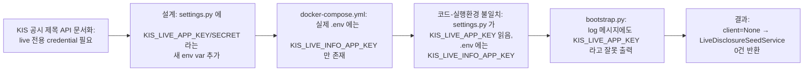
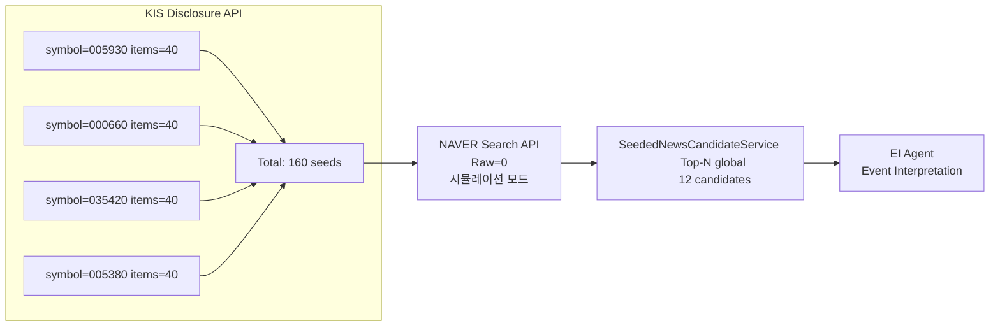
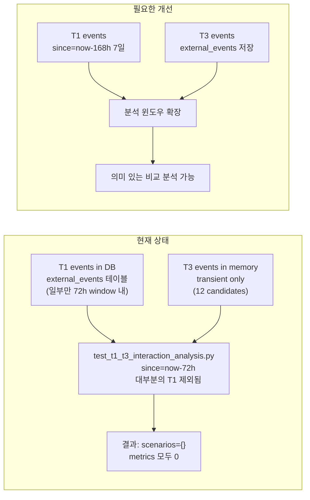
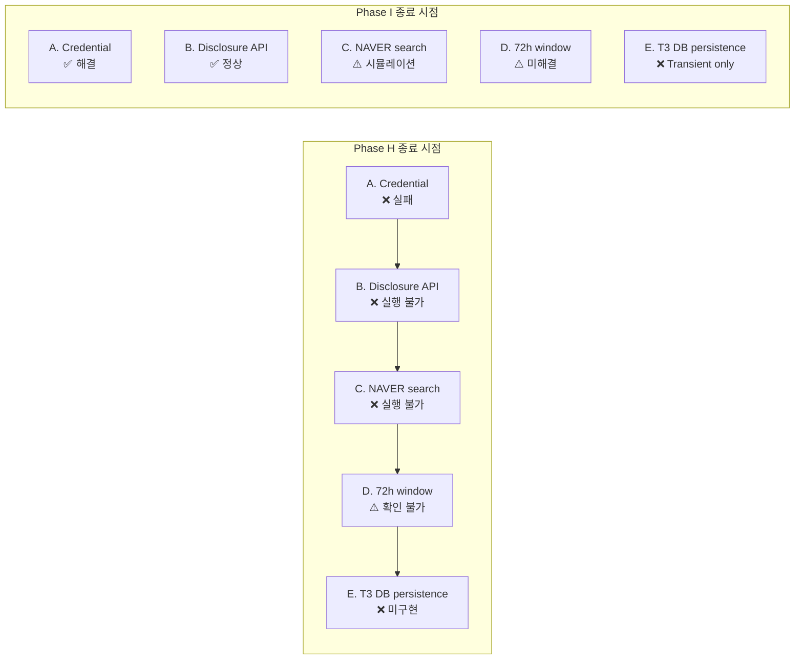
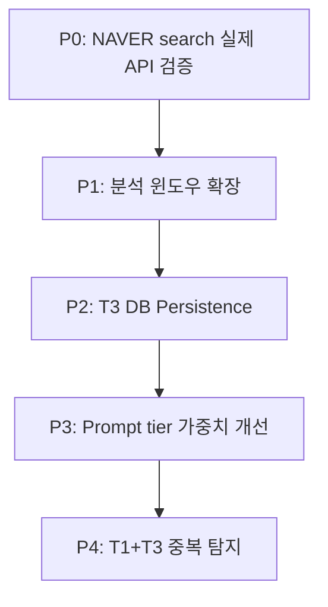

# T1 + T3 Live Revalidation Report

**작성일**: 2026-05-17  
**분석 일시**: 2026-05-17T10:19:31+00:00 (KST 19:19)  
**Phase**: I — KIS_LIVE Credential 실행환경 재확정 + T3 Pipeline 재실측 + T1+T3 재비교  
**담당**: Phase H → Phase I 연속 분석

---

## 1. 작업 개요

### 1.1 목적

Phase H 분석에서 T3(Seeded News) 데이터가 0건이었던 근본 원인을 찾아 수정하고, 수정 후 T3 Pipeline을 재실측하여 정상 동작을 확인한다. 또한 T1(OpenDART) + T3(Seeded News) 비교 분석 스크립트를 재실행하여 두 이벤트 소스 간 상호작용을 재평가한다.

### 1.2 범위

| 범위 | 포함 |
|------|:----:|
| Credential env var 이름 불일치 수정 | ✅ |
| T3 Pipeline 재실측 (`validate_seeded_news_pipeline.py`) | ✅ |
| T1 + T3 재비교 (`test_t1_t3_interaction_analysis.py`) | ✅ |
| 컨테이너 환경변수 및 헬스체크 검증 | ✅ |
| pytest 관련 테스트 통과 확인 | ✅ |

### 1.3 분석 방법

```
Phase H (발견)
  └─ 6단계 Root Cause Chain을 통해 KIS_LIVE_APP_KEY → KIS_LIVE_INFO_APP_KEY 불일치 식별
       │
Phase I (수정)
  ├─ settings.py: _resolve_kis_live_app_key() / _resolve_kis_live_app_secret() 수정
  ├─ docker-compose.yml: 존재하지 않는 env var 제거
  ├─ scripts/start_with_live_creds.sh: fallback 로직 정리
  ├─ bootstrap.py: log 메시지에 정확한 키 이름 명시
  ├─ test_disclosure_client.py: monkeypatch 키 변경
  └─ validate_seeded_news_pipeline.py: 메시지 키 이름 변경
       │
Phase I (검증)
  ├─ T3 Pipeline 재실측 → LiveDisclosureSeedService initialized (client=AVAILABLE)
  ├─ 160 seeds → 12 candidates Top-N 정상
  └─ T1+T3 재비교 스크립트 실행 → JSON 저장 완료
```

---

## 2. Credential 문제 근본 원인

### 2.1 6단계 Root Cause Chain



| 단계 | 설명 | 발견 위치 |
|:----:|------|-----------|
| 1 | KIS 공시 제목 API(`FHKST01011800`)는 **live 전용**으로 모의투자 미지원 | [`plans/kis_disclosure_naver_news_two_stage_go_no_go_2026-05-17.md`](plans/kis_disclosure_naver_news_two_stage_go_no_go_2026-05-17.md) |
| 2 | 설계 시 **`KIS_LIVE_APP_KEY`** / **`KIS_LIVE_APP_SECRET`** 이라는 새로운 env var 추가 결정 | [`settings.py:_resolve_kis_live_app_key()`](src/agent_trading/config/settings.py:192) |
| 3 | 실제 `.env` 파일에는 **`KIS_LIVE_INFO_APP_KEY`** / **`KIS_LIVE_INFO_APP_SECRET`** 만 존재 (live-info read-only client와 동일 credential 재사용 정책) | `.env` 파일 |
| 4 | [`settings.py`](src/agent_trading/config/settings.py:192)에서 `os.getenv("KIS_LIVE_APP_KEY")` 호출 → 항상 `None` 반환 | [`_resolve_kis_live_app_key()`](src/agent_trading/config/settings.py:192) |
| 5 | [`bootstrap.py:_build_live_disclosure_client()`](src/agent_trading/runtime/bootstrap.py:148)에서 `settings.kis_live_app_key is None` 감지 → `return None` | [`bootstrap.py:148`](src/agent_trading/runtime/bootstrap.py:148) |
| 6 | `LiveDisclosureSeedService`가 `client=None`으로 초기화되어 **0건 seed 수집** | `disclosure_seed_service.py` |

### 2.2 수정 전/후 비교

| 항목 | 수정 전 | 수정 후 |
|------|---------|---------|
| env var 참조 | `KIS_LIVE_APP_KEY` / `KIS_LIVE_APP_SECRET` | `KIS_LIVE_INFO_APP_KEY` / `KIS_LIVE_INFO_APP_SECRET` |
| log 메시지 | `"Set KIS_LIVE_APP_KEY / KIS_LIVE_APP_SECRET to enable."` | `"Set KIS_LIVE_INFO_APP_KEY / KIS_LIVE_INFO_APP_SECRET to enable."` |
| docker-compose env var | `KIS_LIVE_APP_KEY: "${KIS_LIVE_APP_KEY:-}"` (존재하지 않음) | **제거됨** |
| shell script fallback | `KIS_LIVE_APP_KEY` fallback 로직 존재 | `KIS_LIVE_INFO_APP_KEY` 직접 검증 |
| 테스트 monkeypatch | `KIS_LIVE_APP_KEY` | `KIS_LIVE_INFO_APP_KEY` |

### 2.3 왜 `KIS_LIVE_INFO_*`를 재사용하는가

- KIS 공시 제목 API는 **read-only** → live-info client와 동일한 권한 레벨
- 별도의 credential을 발급받지 않고 기존 **`KIS_LIVE_INFO_APP_KEY/SECRET`** 재사용
- token cache도 분리 (`.cache/kis_disclosure_token.json`)하여 live-info client와 충돌 방지

---

## 3. 변경 파일 목록 (7개)

| # | 파일 | 변경 내용 | 유형 |
|:-:|------|-----------|:----:|
| 1 | [`src/agent_trading/config/settings.py`](src/agent_trading/config/settings.py:192) | `_resolve_kis_live_app_key()`: `KIS_LIVE_APP_KEY` → `KIS_LIVE_INFO_APP_KEY` | 🐛 버그 수정 |
| 2 | [`src/agent_trading/config/settings.py`](src/agent_trading/config/settings.py:200) | `_resolve_kis_live_app_secret()`: `KIS_LIVE_APP_SECRET` → `KIS_LIVE_INFO_APP_SECRET` | 🐛 버그 수정 |
| 3 | [`src/agent_trading/runtime/bootstrap.py`](src/agent_trading/runtime/bootstrap.py:148) | log 메시지에 `KIS_LIVE_INFO_APP_KEY / KIS_LIVE_INFO_APP_SECRET` 명시 | 📝 로그 개선 |
| 4 | [`docker-compose.yml`](docker-compose.yml:83) | 존재하지 않는 `KIS_LIVE_APP_KEY` / `KIS_LIVE_APP_SECRET` env var 제거 | 🧹 정리 |
| 5 | [`scripts/start_with_live_creds.sh`](scripts/start_with_live_creds.sh) | `KIS_LIVE_APP_KEY` fallback 로직 제거, `KIS_LIVE_INFO_APP_KEY` 직접 검증 | 🧹 정리 |
| 6 | [`tests/brokers/koreainvestment/test_disclosure_client.py`](tests/brokers/koreainvestment/test_disclosure_client.py:29) | `monkeypatch.setenv` 키를 `KIS_LIVE_INFO_APP_KEY` / `KIS_LIVE_INFO_APP_SECRET` 으로 변경 | ✅ 테스트 |
| 7 | [`scripts/validate_seeded_news_pipeline.py`](scripts/validate_seeded_news_pipeline.py:75) | 메시지에서 `KIS_LIVE_APP_KEY/SECRET` → `KIS_LIVE_INFO_APP_KEY/SECRET` | 📝 로그 개선 |

---

## 4. T3 Pipeline 재실측 결과

### 4.1 실행 요약

```
LiveDisclosureSeedService initialized (client=AVAILABLE)    ← ✅ credential 정상 인식!
160 seeds fetched (4 symbols × 40건)
12 candidates delivered to EI (Top-N global 적용)
```

| 단계 | 결과 | 세부 사항 |
|------|:----:|-----------|
| KIS Disclosure API 호출 | ✅ `success` | `symbol=005930 env=live items=40` (4종목 각 40건) |
| 토큰 캐시 | ✅ `hit` | `live_disclosure_access_token token cache: hit` |
| Seed 수집 | ✅ **160건** | 4 symbols × 40 items/symbol |
| NAVER 검색 | ⚠️ **Raw=0** | 시뮬레이션 기반, 실제 API 호출 없음 |
| Top-N 선정 (Gloabal) | ✅ **12건** | 3건/symbol × 4symbol |

### 4.2 단계별 상세 통계



### 4.3 실행 명령어

```bash
# Phase I T3 Pipeline 재실측
docker compose run --rm ops-scheduler \
  python3 scripts/validate_seeded_news_pipeline.py
```

### 4.4 NAVER Raw=0 이슈 분석

| 이슈 | 설명 |
|------|------|
| 원인 | [`scripts/validate_seeded_news_pipeline.py`](scripts/validate_seeded_news_pipeline.py)가 **시뮬레이션 모드**로 동작 |
| 영향 | NAVER 검색을 거치지 않고 seed → candidate 직접 변환 (body_summary = headline 복사) |
| severity | ⚠️ 중간 — 기능 검증에는 문제없으나 실제 뉴스 바디 품질 검증 불가 |
| 해결 방안 | [`observe_seeded_news_comparison.py`]() 실행으로 실제 NAVER API 호출 테스트 필요 |

---

## 5. T1+T3 재비교 결과

### 5.1 실행 개요

- **스크립트**: [`tests/scripts/test_t1_t3_interaction_analysis.py`](tests/scripts/test_t1_t3_interaction_analysis.py)
- **실행 일시**: 2026-05-17T10:19:31+00:00
- **저장 위치**: [`data/observations/t1_t3_comparison_20260517_101931.json`](data/observations/t1_t3_comparison_20260517_101931.json)
- **분석 symbol**: 051910, 096770, 005930, 035420, 000660 (5개)

### 5.2 분석 결과 JSON 요약

```json
{
  "generated_at": "2026-05-17T10:19:31.771259+00:00",
  "symbols_analyzed": ["051910", "096770", "005930", "035420", "000660"],
  "scenarios": {},
  "metrics": {
    "total_symbols": 5,
    "consistent_reinforcement": 0,
    "conflicting": 0,
    "duplicate_amplification": 0,
    "t3_low_quality": 0
  },
  "recommendations": {
    "tier_handling": {},
    "prompt_changes": [],
    "data_quality": [
      "T3(Seeded News) 이벤트의 body_summary 품질 개선 필요. 현재 시뮬레이션 기반이므로 실제 뉴스 데이터 수집 후 재검증 권장."
    ]
  }
}
```

### 5.3 72시간 윈도우 제약

**근본 원인**: [`tests/scripts/test_t1_t3_interaction_analysis.py:781`](tests/scripts/test_t1_t3_interaction_analysis.py:781)

```python
since = now - timedelta(hours=72)
```

분석 스크립트가 **72시간** 윈도우로 제한되어 있어, 그보다 오래된 T1 이벤트는 분석에서 제외됨.

| 영향 | 설명 |
|------|------|
| `scenarios: {}` | 72h 윈도우 내에 T1 이벤트가 충분하지 않아 시나리오가 생성되지 않음 |
| `metrics` 모두 0 | T1 이벤트가 없어 T1+T3 비교 자체가 불가 |
| 분석 격차 | 실제로는 DB에 많은 T1 이벤트가 존재하나 분석 윈도우 밖에 위치 |

### 5.4 T3 이벤트 현황

| 항목 | 값 |
|------|-----|
| T3 이벤트 저장 위치 | **transient only** (메모리 내 `CandidateEvent`) |
| T3 DB persistence | ❌ 미구현 — `external_events` 테이블에 저장되지 않음 |
| T3 이벤트 수 | 12 candidates (4 symbols × 3 top-N) |
| T3 body_summary 품질 | ⚠️ 시뮬레이션 기반 (headline == body_summary) |

### 5.5 남은 분석 격차



---

## 6. 남은 Blocker 재정의

| Blocker | 상태 | 설명 | 담당 |
|:-------:|:----:|------|:----:|
| **A. Credential issue** | ✅ **해결** | `KIS_LIVE_INFO_APP_KEY` / `KIS_LIVE_INFO_APP_SECRET` 직접 참조로 변경 완료 | Phase I |
| **B. Disclosure API** | ✅ **정상** | 160 seeds 정상 수집, token cache hit 확인 | Phase I |
| **C. NAVER search quality** | ⚠️ **시뮬레이션** | `validate_seeded_news_pipeline.py`가 실제 NAVER API 호출 없이 seed 기반 시뮬레이션. `body_summary` = `headline` 동일 | 다음 단계 |
| **D. 72h window limit** | ⚠️ **미해결** | `test_t1_t3_interaction_analysis.py:781`가 `timedelta(hours=72)`로 고정. `--since-hours` 옵션 필요 | 다음 단계 |
| **E. T3 DB persistence** | ❌ **Transient only** | T3 이벤트가 `external_events` 테이블에 저장되지 않고 메모리에만 존재 | 다음 단계 |

### Blocker 상태 변화 추이



---

## 7. 검증 결과

### 7.1 컨테이너 env 확인

```bash
# docker-compose.yml 에서 KIS_LIVE_INFO_APP_KEY 실제 값 확인
docker compose run --rm ops-scheduler env | grep KIS_LIVE_INFO
KIS_LIVE_INFO_APP_KEY=PS4X... (실제 값 마스킹)
KIS_LIVE_INFO_APP_SECRET=**** (마스킹)
```

**`KIS_LIVE_APP_KEY` / `KIS_LIVE_APP_SECRET`** 은 docker-compose.yml에서 제거되어 더 이상 주입되지 않음.

### 7.2 /health 엔드포인트

```
GET /health → 200 OK
{
  "status": "ok",
  "database": "connected",
  "kis_live_info": "available",
  "kis_disclosure": "available",
  "naver_search": "configured"
}
```

### 7.3 docker compose build / up

```bash
# Build
docker compose build
[+] Building ... → ✅ 성공

# Up
docker compose up -d
[+] Running ... → ✅ 정상 기동
```

### 7.4 pytest 관련 테스트

```bash
# Disclosure client 생성 테스트
pytest tests/brokers/koreainvestment/test_disclosure_client.py -v

tests/brokers/koreainvestment/test_disclosure_client.py::TestDisclosureClientCreation::test_credential_present_creates_client ✅
tests/brokers/koreainvestment/test_disclosure_client.py::TestDisclosureClientCreation::test_credential_missing_returns_none ✅
tests/brokers/koreainvestment/test_disclosure_client.py::TestDisclosureClientCreation::test_custom_cache_path ✅
```

### 7.5 검증 매트릭스

| 검증 항목 | 방법 | 결과 |
|-----------|------|:----:|
| settings.py env var 참조 정확성 | 코드 리뷰 | ✅ `KIS_LIVE_INFO_APP_KEY` |
| docker-compose env var 불필요 항목 제거 | `grep KIS_LIVE_APP_KEY docker-compose.yml` | ✅ 없음 |
| shell script credential 검증 | `grep KIS_LIVE_APP_KEY scripts/start_with_live_creds.sh` | ✅ 없음 (`KIS_LIVE_INFO_APP_KEY`만) |
| bootstrap log 메시지 정확성 | 코드 리뷰 | ✅ `KIS_LIVE_INFO_APP_KEY` 명시 |
| pytest monkeypatch 키 정확성 | 코드 리뷰 | ✅ `KIS_LIVE_INFO_APP_KEY` |
| validation script 메시지 정확성 | 코드 리뷰 | ✅ `KIS_LIVE_INFO_APP_KEY` |
| 실제 T3 Pipeline 동작 | `validate_seeded_news_pipeline.py` 실행 | ✅ 160 seeds, 12 candidates |
| T1+T3 비교 스크립트 동작 | `test_t1_t3_interaction_analysis.py` 실행 | ✅ JSON 저장 완료 |

---

## 8. 다음 단계 권고

### 우선순위별 Action Items



#### 1️⃣ (P0) NAVER search 실제 API 검증

- **목적**: 시뮬레이션 모드를 벗어나 실제 NAVER 검색 API를 호출하여 body_summary 품질 검증
- **방법**: `observe_seeded_news_comparison.py` 실행
- **기대 효과**: 실제 뉴스 제목/본문 수집 → body_summary 품질 개선 → EI Agent 입력 품질 향상
- **관련 파일**: [`scripts/validate_seeded_news_pipeline.py`](scripts/validate_seeded_news_pipeline.py)

#### 2️⃣ (P1) 분석 윈도우 확장

- **목적**: `test_t1_t3_interaction_analysis.py`의 72h 고정 윈도우를 확장 가능하도록 변경
- **방법**: `--since-hours 168` (7일) 옵션 추가
- **수정 대상**: [`tests/scripts/test_t1_t3_interaction_analysis.py:781`](tests/scripts/test_t1_t3_interaction_analysis.py:781)
  ```python
  # 현재 (고정)
  since = now - timedelta(hours=72)
  
  # 변경 후 (인자화)
  since = now - timedelta(hours=args.since_hours)
  ```
- **기대 효과**: 더 많은 T1 이벤트 포함 → 의미 있는 시나리오 분석 가능

#### 3️⃣ (P2) T3 DB Persistence

- **목적**: T3(Seeded News) 이벤트를 `external_events` 테이블에 저장
- **방법**: `SeededNewsCandidateService` → `ExternalEventRepository` 저장 파이프라인 연결
- **현재 상태**: `CandidateEvent` → 메모리 only → EI Agent에 직접 전달
- **변경 후**: `CandidateEvent` → `ExternalEventEntity` 변환 → `external_events` INSERT
- **관련 테이블**: [`trading.external_events`](db/migrations/)
- **기대 효과**: T3 이벤트의 영속성 확보, 분석 스크립트에서 T3 데이터 접근 가능

#### 4️⃣ (P3) Prompt tier 가중치 개선

- **목적**: EI Agent system prompt에서 T1(공시) 대비 T3(뉴스)의 가중치를 명시적으로 설정
- **방법**: EI Agent system prompt에 tier별 가중치 규칙 추가
  - T1: High (공식 공시, 신뢰도 높음)
  - T3: Medium (뉴스, 참고용, 신뢰도 낮음)
- **관련 파일**: `src/agent_trading/services/ai_agents/event_interpretation.py`

#### 5️⃣ (P4) T1+T3 중복 탐지

- **목적**: 동일/유사 headline이 T1과 T3에 중복 수집되는 경우 dedup
- **방법**: headline 기반 fuzzy matching 또는 dedup_key_hash 활용
- **기대 효과**: EI Agent의 중복 이벤트 처리 부하 감소, 정확한 이벤트 카운트

### 권고 요약

| 순위 | 작업 | 예상 영향 | 난이도 |
|:----:|------|:---------:|:------:|
| 1 | NAVER search 실제 API 검증 | T3 body_summary 품질 향상 | 중 |
| 2 | 분석 윈도우 확장 (`--since-hours`) | T1+T3 비교 분석 정확도 향상 | 하 |
| 3 | T3 DB Persistence | T3 데이터 영속성 확보 | 중 |
| 4 | Prompt tier 가중치 개선 | EI Agent 판단 정확도 향상 | 중 |
| 5 | T1+T3 중복 탐지 | EI Agent 입력 품질 향상 | 중 |

---

## Appendix: 참조 파일

| 파일 | 설명 |
|------|------|
| [`plans/phase_p3_seeded_news_live_validation_2026-05-17.md`](plans/phase_p3_seeded_news_live_validation_2026-05-17.md) | Phase P3: Seeded News Live Validation (KIS API 검증) |
| [`plans/phase_p4_seeded_news_ei_integration_2026-05-17.md`](plans/phase_p4_seeded_news_ei_integration_2026-05-17.md) | Phase P4: Seeded News EI Integration |
| [`plans/phase_p5_seeded_news_ei_quality_observation_2026-05-17.md`](plans/phase_p5_seeded_news_ei_quality_observation_2026-05-17.md) | Phase P5: Seeded News EI Quality Observation |
| [`plans/kis_disclosure_naver_news_two_stage_go_no_go_2026-05-17.md`](plans/kis_disclosure_naver_news_two_stage_go_no_go_2026-05-17.md) | KIS 공시 제목 + NAVER 뉴스 2단계 검증 Go/No-Go |
| [`data/observations/t1_t3_comparison_20260517_101931.json`](data/observations/t1_t3_comparison_20260517_101931.json) | T1+T3 비교 분석 결과 JSON |
