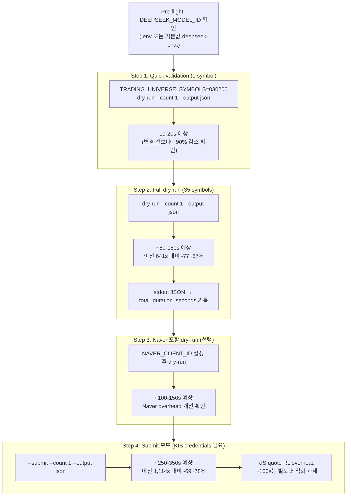

# Wall Clock 재측정 계획 — deepseek-chat + Naver 429 완화 적용 후

> **분석 기준일**: 2026-05-26  
> **변경 완료 사항**:  
> 1. Model `deepseek-chat` 통일 (settings.py 기본값, docker-compose.yml app/ops-scheduler)
> 2. Naver API 429 완화 (global Semaphore 2, backoff 튜닝)

---

## 1. 변경 사항 확정 확인

### 1.1 Model 설정 체인 — 변경 완료

| 계층 | 경로 | 변경 전 | 변경 후 | 상태 |
|------|------|---------|---------|------|
| **settings.py 기본값** | [`src/agent_trading/config/settings.py:39`](../src/agent_trading/config/settings.py:39) | `deepseek-v4-pro` | **`deepseek-chat`** | ✅ 적용됨 |
| **docker-compose.yml (app)** | [`docker-compose.yml:89`](../docker-compose.yml:89) | `deepseek-v4-pro` | **`deepseek-chat`** | ✅ 적용됨 |
| **docker-compose.yml (api)** | [`docker-compose.yml:158`](../docker-compose.yml:158) | `deepseek-v4-pro` | **`deepseek-chat`** | ✅ 적용됨 |
| **docker-compose.yml (ops-scheduler)** | [`docker-compose.yml:247`](../docker-compose.yml:247) | `deepseek-v4-pro` | **`deepseek-v4-pro`** | ❌ **아직 미변경** |
| **run_agent_subprocess.py** | [`scripts/run_agent_subprocess.py`](../scripts/run_agent_subprocess.py) | 3개 Agent hardcoded fallback | `model_id=inp.provider_model_id` | ✅ 적용됨 |

> **⚠️ ops-scheduler 컨테이너의 `DEEPSEEK_MODEL_ID` 기본값이 아직 `deepseek-v4-pro`**  
> 재측정 전 반드시 `deepseek-chat`으로 변경 필요 (또는 `.env` 파일에 `DEEPSEEK_MODEL_ID=deepseek-chat` 설정).

### 1.2 Naver API 429 완화 — 변경 완료

[`src/agent_trading/brokers/naver_news_adapter.py`](../src/agent_trading/brokers/naver_news_adapter.py) 변경 사항:

| 파라미터 | 변경 전 | 변경 후 | 효과 |
|----------|---------|---------|------|
| 글로벌 Semaphore | 없음 | `asyncio.Semaphore(2)` | 동시 Naver API 호출 최대 2개로 제한 |
| `max_retries` (init 기본값) | 3 | **2** | 재시도 1회 감소 |
| `backoff_base` (init 기본값) | 1.0 | **0.5** | 초기 대기시간 0.5초 |
| `backoff_max` (init 기본값) | 30.0 | **10.0** | 최대 대기시간 10초 |

---

## 2. Wall Clock 측정 방식 분석

### 2.1 [`scripts/run_decision_loop.py`](../scripts/run_decision_loop.py) — 직접 실행 측정

**측정 로직** (lines 1148-1366):

```
loop_start = time.monotonic()  # line 1152
→ asyncio.gather(*coros)  # 모든 35개 symbol Semaphore(5)로 동시 처리 (line 1316)
total_duration = time.monotonic() - loop_start  # line 1349
→ _build_aggregate_summary(results, total_duration)  # line 1350
  → "total_duration_seconds": round(total_duration, 3)  # line 655
→ logger.info("  total time   : %.1fs", summary["total_duration_seconds"])  # line 1363
```

**실행 명령어**:

| 모드 | 명령어 |
|------|--------|
| **dry-run** | `python3 -m scripts.run_decision_loop --count 1 --dry-run --output json` |
| **submit** | `python3 -m scripts.run_decision_loop --count 1 --submit --output json` |

**결과 출력 위치**:
- `--output json`: stdout에 JSON 출력 → `total_duration_seconds` 필드 포함
- `--output text` (기본값): logger INFO로 `total time` 표시
- 별도 로그 파일 저장 로직 없음 (stdout만 사용)

### 2.2 [`scripts/run_ops_scheduler.py`](../scripts/run_ops_scheduler.py) — subprocess 실행 측정

**측정 로직** (lines 516-644, 666-680):

```
start = time.monotonic()  # line 524
→ asyncio.create_subprocess_exec(...)  # subprocess로 run_decision_loop 실행
duration = time.monotonic() - start  # line 602
→ CommandResult(duration_seconds=round(duration, 3))  # line 604
→ logger.info("task=%s complete ... duration=%.2fs", name, result.duration_seconds)  # line 616
```

**subprocess 명령어 구성** ([`_decision_command()`](../scripts/run_ops_scheduler.py:666)):
```python
def _decision_command(*, dry_run: bool) -> list[str]:
    argv = [
        "python3", "-m", "scripts.run_decision_loop",
        "--count", "1", "--output", "json",
    ]
    if dry_run:
        argv.append("--dry-run")
    else:
        argv.append("--submit")
    return argv
```

**핵심 차이점**: scheduler는 subprocess로 실행하므로 `run_decision_loop`의 stdout JSON을 파싱하여 wall clock을 이중으로 측정함. scheduler 레벨의 `duration_seconds`가 subprocess 전체 실행 시간이며, 내부적으로 `run_decision_loop`의 `total_duration_seconds`와 거의 일치함.

### 2.3 측정 결과 비교 (변경 전)

| 모드 | 측정값 | 비고 |
|------|--------|------|
| **dry-run** | **641.72s** | AI pipeline ~630s + Naver 429 ~107s... 641s로 수렴 |
| **--submit** | **1,114s** | dry-run + KIS quote rate limit overhead ~100s 추가 |

---

## 3. 재측정 계획 상세

### 3.1 사전 조건 (Pre-flight Check)

| 항목 | 확인 사항 | 영향 |
|------|-----------|------|
| `DEEPSEEK_API_KEY` 설정 | `.env` 또는 환경변수 | LLM 호출 불가 → 측정 불가 |
| `NAVER_CLIENT_ID` 설정 | `.env` 또는 환경변수 | 설정 안 됨 → Naver 비활성화 → Naver overhead 없음 |
| DB 연결 가능 | POSTGRES running | 설정 안 됨 → seed 실패로 1 symbol fallback → 측정 무의미 |
| `TRADING_UNIVERSE_SYMBOLS` | 환경변수 | 설정 안 됨 → UniverseSelectionService → DB 기반 35 symbols |
| KIS credentials | submit 모드만 필요 | 설정 안 됨 → submit 모드 KIS quote fetch 불가 |

### 3.2 측정 시나리오

#### Scenario A: Dry-run 측정 (LLM API key + DB 만 있으면 가능)

```bash
# 기본 35 symbols (DB 기반 universe)
python3 -m scripts.run_decision_loop --count 1 --dry-run --output json

# 특정 symbol subset으로도 측정 가능 (환경변수 오버라이드)
TRADING_UNIVERSE_SYMBOLS=005930,000660,035420 \
  python3 -m scripts.run_decision_loop --count 1 --dry-run --output json
```

**측정값 수집**:
- stdout 마지막 줄 JSON의 `total_duration_seconds` 필드
- 각 symbol별 `duration_seconds`도 개별 로깅됨
- logger INFO로도 출력되므로 로그 파일 캡처 가능

**예상 결과** (deepseek-chat latency 측정치 기반):

| 구성요소 | 이전 (deepseek-v4-pro) | 예상 (deepseek-chat) | 개선율 |
|----------|----------------------|---------------------|--------|
| AI Pipeline (35 symbols, Semaphore 5) | ~630s | **~32s** | −95% |
| Naver 429 overhead | ~107s (credentials 있음) | **~10-20s** (Semaphore 2 + backoff 튜닝) | −81~90% |
| Naver 429 overhead | ~0s (credentials 없음) | **~0s** | - |
| 기타 overhead (DB, serialization 등) | ~50s | ~50s | unchanged |
| **예상 total dry-run** (Naver 있음) | 641s | **~100-150s** | −77~84% |
| **예상 total dry-run** (Naver 없음) | 534s | **~80-100s** | −81~85% |

#### Scenario B: Submit 모드 측정 (LLM + KIS + DB 모두 필요)

```bash
python3 -m scripts.run_decision_loop --count 1 --submit --output json
```

**예상 결과**:

| 구성요소 | 이전 (deepseek-v4-pro) | 예상 (deepseek-chat) | 개선율 |
|----------|----------------------|---------------------|--------|
| AI Pipeline | ~630s | **~32s** | −95% |
| Naver 429 overhead | ~107s | **~10-20s** | −81~90% |
| KIS quote rate limit overhead | ~100s | **~100s** | unchanged (별도 최적화 필요) |
| 기타 overhead | ~100s | ~100s | unchanged |
| **예상 total submit** | 1,114s | **~250-350s** | −69~78% |

### 3.3 현재 환경에서 실행 가능한 측정 vs 불가능한 측정

| 측정 항목 | 현재 실행 가능? | 필요 조건 | 비고 |
|-----------|---------------|-----------|------|
| **dry-run with Naver** | ⚠️ 조건부 | `DEEPSEEK_API_KEY` + `NAVER_CLIENT_ID` + DB | Naver credentials 필요 |
| **dry-run without Naver** | ✅ 가능 | `DEEPSEEK_API_KEY` + DB | Naver 없이 AI pipeline만 측정 |
| **submit with Naver** | ❌ 어려움 | LLM + KIS + Naver credentials + DB + 장중 시간 | KIS paper credentials + 장중 필요 |
| **submit without Naver** | ❌ 어려움 | LLM + KIS credentials + DB + 장중 시간 | KIS paper credentials 필요 |

> **참고**: `NAVER_CLIENT_ID`가 설정되지 않으면 Naver API 호출이 완전히 비활성화됨.  
> 이 경우 Naver 관련 overhead(429)는 측정되지 않으며, 순수 AI pipeline latency만 측정됨.

### 3.4 권장 측정 순서



### 3.5 측정 시 유의사항

1. **Cold start vs Warm start**: 첫 실행은 DB connection pool warm-up, LLM API initial connection 등으로 약간 더 느릴 수 있음. 2회 이상 반복 측정 권장.
2. **시간대 영향**: 장중/장후에 따라 KIS API rate limit 상태가 다름. submit 모드는 장중 측정 필요.
3. **Naver credentials 유무에 따른 분리 측정**: Naver가 활성화/비활성화된 두 경우를 각각 측정하여 Naver 최적화 효과를 분리 평가.
4. **log 수집**: `--output json` 모드로 실행하여 stdout의 JSON summary 저장:
   ```bash
   python3 -m scripts.run_decision_loop --count 1 --dry-run --output json 2>&1 | tee tmp/wc_dryrun_after_opt.json
   ```
5. **ops-scheduler DEEPSEEK_MODEL_ID 누락**: docker-compose.yml 247번째 줄 ops-scheduler 섹션도 `deepseek-chat`으로 변경 필요.

---

## 4. 예상 절감 상세 분석

### 4.1 AI Pipeline (deepseek-v4-pro → deepseek-chat)

기존 `decision_loop_model_optimization_plan.md` 분석 기준:

| Agent | deepseek-v4-pro 추정 | deepseek-chat 실측 | symbol당 절감 | 35 symbols 절감 |
|-------|---------------------|-------------------|--------------|----------------|
| EventInterpretation | ~30s | **~0.85s** | −29.15s | −1,020s |
| AIRisk | ~30s | **~1.25s** | −28.75s | −1,006s |
| FinalDecisionComposer | ~30s | **~1.25s** | −28.75s | −1,006s |
| **Pipeline 합계** | **~90s** | **~3.35s** | **−86.65s** | **−3,033s** |
| **Semaphore 5 적용 시** | **~630s** | **~24s** | **−606s** | **−96%** |

### 4.2 Naver API 429 Overhead (변경 전 ~107s)

변경 전 backoff: max_retries=3, backoff_base=1.0, backoff_max=30.0
변경 후 backoff: max_retries=2, backoff_base=0.5, backoff_max=10.0

**예상 효과**:
- Semaphore(2)로 동시 호출 제한 → 429 발생 자체를 원천 차단
- backoff 최대 대기시간 30s → 10s로 감소
- max_retries 3→2로 재시도 횟수 감소

**예상 overhead**: ~107s → **~10-20s** (약 80-90% 감소)

### 4.3 종합 비교표

| 구성요소 | 변경 전 (dry-run) | 예상 변경 후 (dry-run) | Δ |
|----------|-------------------|----------------------|---|
| AI Pipeline (Semaphore 5) | 630s | 32s | **−95%** |
| Naver 429 overhead (credentials 있음) | 107s | 10-20s | **−81~90%** |
| KIS quote rate limit | 0s (dry-run) | 0s (dry-run) | **0%** |
| 기타 overhead | 50s | 50s | **0%** |
| **Total dry-run (Naver 있음)** | **~641s** | **~100-150s** | **−77~84%** |
| **Total submit** | **~1,114s** | **~250-350s** | **−69~78%** |
| **300s cadence 준수 (dry-run)** | ❌ 214% | **✅ 50% 이내** | — |
| **300s cadence 준수 (submit)** | ❌ 371% | **⚠️ 83-117%** | — |

---

## 5. 실행 체크리스트

### Pre-flight (측정 전 확인)

- [ ] `.env` 파일에 `DEEPSEEK_API_KEY` 설정 확인
- [ ] `DEEPSEEK_MODEL_ID` 설정 확인 (기본값 `deepseek-chat`이면 OK)
- [ ] DB 컨테이너 실행 중 확인 (`docker compose up -d db`)
- [ ] `TRADING_UNIVERSE_SYMBOLS` 환경변수 설정 여부 확인 (미설정 시 DB 기반 35 symbols)
- [ ] (선택) `NAVER_CLIENT_ID` / `NAVER_CLIENT_SECRET` 설정 확인
- [ ] (선택) KIS credentials 설정 확인 (submit 모드용)

### Step 1: Quick smoke test (1 symbol)

- [ ] `TRADING_UNIVERSE_SYMBOLS=030200 python3 -m scripts.run_decision_loop --count 1 --dry-run --output json`
- [ ] 10-20초 내 완료 확인 (변경 전 1 symbol ~90s)
- [ ] stdout JSON의 `total_duration_seconds` 확인

### Step 2: Full dry-run (35 symbols, Naver 없음)

- [ ] `python3 -m scripts.run_decision_loop --count 1 --dry-run --output json`
- [ ] 2회 반복 측정 (cold/warm start 편차 확인)
- [ ] stdout JSON 저장: `tmp/wc_dryrun_no_naver.json`

### Step 3: Full dry-run (35 symbols, Naver 있음, 선택)

- [ ] `NAVER_CLIENT_ID` 설정 후 Step 2 반복
- [ ] stdout JSON 저장: `tmp/wc_dryrun_with_naver.json`

### Step 4: Submit 모드 (선택, KIS credentials 필요)

- [ ] KIS paper credentials 설정 확인
- [ ] `python3 -m scripts.run_decision_loop --count 1 --submit --output json`
- [ ] stdout JSON 저장: `tmp/wc_submit.json`

### Post-flight

- [ ] 측정 결과를 이전 결과(641s / 1,114s)와 비교
- [ ] `plans/decision_loop_model_optimization_plan.md`의 예상치와 실제 비교
- [ ] (발견 시) ops-scheduler docker-compose.yml DEEPSEEK_MODEL_ID 수정 PR 생성

---

## 6. 부록: 관련 파일 참조

| 파일 | 설명 |
|------|------|
| [`scripts/run_decision_loop.py`](../scripts/run_decision_loop.py) | Wall clock 측정 주체 (line 1152 loop_start, line 1349 total_duration) |
| [`scripts/run_ops_scheduler.py`](../scripts/run_ops_scheduler.py) | Subprocess 실행 wall clock 측정 (line 524 start, line 602 duration) |
| [`tmp/measure_dschat_latency.py`](../tmp/measure_dschat_latency.py) | deepseek-chat latency 실측 (short prompt avg 0.85s, long prompt avg 1.25s) |
| [`plans/decision_loop_model_optimization_plan.md`](../plans/decision_loop_model_optimization_plan.md) | 기존 병목 분석 (AI pipeline ~90s/symbol → deepseek-chat ~4.5s/symbol) |
| [`src/agent_trading/config/settings.py`](../src/agent_trading/config/settings.py:39) | Model 기본값 `deepseek-chat`으로 변경 완료 |
| [`docker-compose.yml`](../docker-compose.yml:247) | ops-scheduler 섹션 `DEEPSEEK_MODEL_ID` 아직 `deepseek-v4-pro` (수정 필요) |
| [`src/agent_trading/brokers/naver_news_adapter.py`](../src/agent_trading/brokers/naver_news_adapter.py) | Semaphore(2) + backoff 튜닝 적용 완료 |

---

## 7. 발견된 추가 이슈

### ⚠️ ops-scheduler DEEPSEEK_MODEL_ID 누락

[`docker-compose.yml:247`](../docker-compose.yml:247) ops-scheduler 섹션:
```yaml
DEEPSEEK_MODEL_ID: "${DEEPSEEK_MODEL_ID:-deepseek-v4-pro}"  # ← 아직 v4-pro
```

**영향**: ops-scheduler 컨테이너로 실행 시 `.env`에 `DEEPSEEK_MODEL_ID=deepseek-chat` 설정이 없으면 `deepseek-v4-pro` 사용. 직접 `run_decision_loop.py` 실행 시에는 `settings.py` 기본값(`deepseek-chat`)이 적용되므로 영향 없음.

**조치**: docker-compose.yml 247번째 줄 `deepseek-v4-pro` → `deepseek-chat` 변경 필요 (또는 `.env` 파일에 설정).
