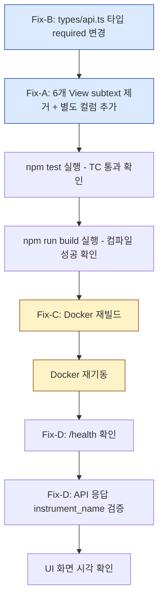

# 종목명 컬럼 미반영 / 런타임 API 미반영 Hotfix

**작성일**: 2026-05-16  
**상태**: 설계 완료 (구현 대기)

---

## 1. Root Cause

### RC-1: 프런트엔드 View들이 `종목명`을 별도 컬럼이 아닌 Symbol 셀 안의 보조 텍스트(subtext)로 표시

이전 작업에서 [`AccountsView`](admin_ui/src/components/AccountsView.tsx:219-237) 패턴(별도 `symbol` 컬럼 + 별도 `instrument_name` 컬럼)을 기준으로 구현되었어야 했으나, 나머지 6개 View는 `symbol` render 함수 내에 조건부 `instrument_name` subtext를 추가하는 방식으로 구현됨.

**결과**: `계좌(AccountsView)` 화면만 `종목명` 컬럼이 있고, 나머지 5개 화면에서는 `종목명`이 보이지 않음.

#### 현재 각 View의 symbol 컬럼 구현 상태

| View | 파일 | 현재 방식 | subtext 코드 위치 |
|------|------|----------|-------------------|
| **AccountsView (positions)** | [`AccountsView.tsx`](admin_ui/src/components/AccountsView.tsx:219-237) | ✅ 별도 컬럼 2개 (참조 패턴) | — |
| **OrdersView** | [`OrdersView.tsx`](admin_ui/src/components/OrdersView.tsx:63-70) | ❌ subtext 방식 | L66-68 |
| **OrderTrackingView** | [`OrderTrackingView.tsx`](admin_ui/src/components/OrderTrackingView.tsx:67-75) | ❌ subtext 방식 | L70-72 |
| **DecisionsView** | [`DecisionsView.tsx`](admin_ui/src/components/DecisionsView.tsx:116-123) | ❌ subtext 방식 | L119-121 |
| **ReconciliationView (orders)** | [`ReconciliationView.tsx`](admin_ui/src/components/ReconciliationView.tsx:230-237) | ❌ subtext 방식 (내부 table) | L233-235 |
| **ReconciliationView (locks)** | [`ReconciliationView.tsx`](admin_ui/src/components/ReconciliationView.tsx:506-509) | ❌ subtext 방식 (수동 table) | L507-509 |
| **OperationsDashboardView** | [`OperationsDashboardView.tsx`](admin_ui/src/components/OperationsDashboardView.tsx:882-888) | ❌ subtext 방식 | L885-887 |

#### AccountsView 참조 패턴 (별도 컬럼 방식 — 유지 대상)

[`AccountsView.tsx:219-237`](admin_ui/src/components/AccountsView.tsx:219-237):
```tsx
{ key: "symbol", header: "종목", render: (r) => (
  <span className="text-sm font-medium text-[#0f172a]">
    {r.symbol ?? truncateUuid(r.instrument_id)}
  </span>
)},
{ key: "instrument_name", header: "종목명", render: (r) => (
  <span className="text-xs text-[#64748b]">{r.instrument_name || "—"}</span>
)},
```

#### OrdersView subtext 방식 예시 (변경 대상)

[`OrdersView.tsx:63-70`](admin_ui/src/components/OrdersView.tsx:63-70):
```tsx
{ key: "symbol", header: "심볼", render: (r: OrderSummary) => (
  <div>
    <div className="text-sm font-medium text-[#0f172a]">{r.symbol ?? "—"}</div>
    {r.instrument_name && (
      <div className="text-xs text-[#64748b]">{r.instrument_name}</div>
    )}
  </div>
)},
```

---

### RC-2: Docker 재빌드/재기동 누락으로 실제 API 응답에 `instrument_name` 미포함

백엔드 enrichment 코드는 정상적으로 구현되어 있으나, API 컨테이너에 최신 코드가 반영되지 않아 런타임 응답에 `instrument_name` 필드가 없음.

#### 백엔드 enrichment 코드 상태 (모두 정상 — 수정 불필요)

| 파일 | 함수 | enrichment 방식 |
|------|------|----------------|
| [`routes/orders.py`](src/agent_trading/api/routes/orders.py:70-86) | `_enrich_order_summary()` | `instrument_id` → `instruments.get()` → `instrument_name` 설정 |
| [`routes/decisions.py`](src/agent_trading/api/routes/decisions.py:39-48) | `_enrich_decision_detail()` | `symbol` + `market` → `get_by_symbol()` → `instrument_name` 설정 |
| [`routes/reconciliation.py`](src/agent_trading/api/routes/reconciliation.py:24-37) | `_enrich_lock_status()` | `symbol` → `get_by_symbol_any_market()` → `instrument_name` 설정 |

---

## 2. 수정 사항

### Fix-A: 프런트엔드 — 별도 `종목명` 컬럼으로 변경 (6개 View)

각 View에서 다음 작업을 수행:

1. Symbol 컬럼 `render` 함수에서 `{r.instrument_name && (...)}` subtext 제거
2. Symbol 컬럼 바로 다음에 `종목명` 별도 컬럼 추가 (AccountsView 패턴과 동일)
3. `종목명` 컬럼 스타일: `text-xs text-[#64748b]`, 데이터 없으면 `—` 표시

#### 변경 대상 상세

##### ① OrdersView — [`OrdersView.tsx:63-70`](admin_ui/src/components/OrdersView.tsx:63)

**변경 전**:
```tsx
{ key: "symbol", header: "심볼", render: (r: OrderSummary) => (
  <div>
    <div className="text-sm font-medium text-[#0f172a]">{r.symbol ?? "—"}</div>
    {r.instrument_name && (
      <div className="text-xs text-[#64748b]">{r.instrument_name}</div>
    )}
  </div>
)},
```

**변경 후**:
```tsx
{ key: "symbol", header: "종목", render: (r: OrderSummary) => (
  <span className="text-sm font-medium text-[#0f172a]">{r.symbol ?? "—"}</span>
)},
{ key: "instrument_name", header: "종목명", render: (r: OrderSummary) => (
  <span className="text-xs text-[#64748b]">{r.instrument_name || "—"}</span>
)},
```

**변경 사항 요약**:
- `symbol` 컬럼: header `"심볼"` → `"종목"`, `<div>` → `<span>`, subtext 제거
- `instrument_name` 컬럼: 신규 추가 (symbol 바로 다음 위치)

---

##### ② OrderTrackingView — [`OrderTrackingView.tsx:67-75`](admin_ui/src/components/OrderTrackingView.tsx:67)

**변경 전**:
```tsx
{
  key: "symbol",
  header: "종목",
  render: (row: OrderSummary) => (
    <div>
      <div className="font-semibold text-[#0f172a]">{row.symbol ?? "-"}</div>
      {row.instrument_name && (
        <div className="text-xs text-[#64748b]">{row.instrument_name}</div>
      )}
    </div>
  ),
},
```

**변경 후**:
```tsx
{
  key: "symbol",
  header: "종목",
  render: (row: OrderSummary) => (
    <span className="font-semibold text-[#0f172a]">{row.symbol ?? "-"}</span>
  ),
},
{
  key: "instrument_name",
  header: "종목명",
  render: (row: OrderSummary) => (
    <span className="text-xs text-[#64748b]">{row.instrument_name || "—"}</span>
  ),
},
```

**변경 사항 요약**:
- `symbol` 컬럼: `<div>` → `<span>`, subtext 제거
- `instrument_name` 컬럼: 신규 추가

---

##### ③ DecisionsView — [`DecisionsView.tsx:116-123`](admin_ui/src/components/DecisionsView.tsx:116)

**변경 전**:
```tsx
{ key: "symbol", header: "심볼", render: (r) => (
  <div>
    <div className="text-sm font-medium text-[#0f172a]">{r.symbol ?? "—"}</div>
    {r.instrument_name && (
      <div className="text-xs text-[#64748b]">{r.instrument_name}</div>
    )}
  </div>
)},
```

**변경 후**:
```tsx
{ key: "symbol", header: "종목", render: (r) => (
  <span className="text-sm font-medium text-[#0f172a]">{r.symbol ?? "—"}</span>
)},
{ key: "instrument_name", header: "종목명", render: (r) => (
  <span className="text-xs text-[#64748b]">{r.instrument_name || "—"}</span>
)},
```

**변경 사항 요약**:
- `symbol` 컬럼: header `"심볼"` → `"종목"`, `<div>` → `<span>`, subtext 제거
- `instrument_name` 컬럼: 신규 추가

---

##### ④ ReconciliationView (orders 섹션) — [`ReconciliationView.tsx:230-237`](admin_ui/src/components/ReconciliationView.tsx:230)

**변경 전**:
```tsx
{
  key: "order" as any,
  header: "심볼",
  render: (r: ReconcileRequiredCase) => (
    <div>
      <div className="font-medium text-[#0f172a]">{r.order.symbol ?? "—"}</div>
      {r.order.instrument_name && (
        <div className="text-xs text-[#64748b]">{r.order.instrument_name}</div>
      )}
    </div>
  ),
},
```

**변경 후**:
```tsx
{
  key: "order" as any,
  header: "종목",
  render: (r: ReconcileRequiredCase) => (
    <span className="font-medium text-[#0f172a]">{r.order.symbol ?? "—"}</span>
  ),
},
{
  key: "order" as any,
  header: "종목명",
  render: (r: ReconcileRequiredCase) => (
    <span className="text-xs text-[#64748b]">{r.order.instrument_name || "—"}</span>
  ),
},
```

**변경 사항 요약**:
- symbol 컬럼: header `"심볼"` → `"종목"`, `<div>` → `<span>`, subtext 제거
- `종목명` 컬럼: 신규 추가 (두 번째 컬럼)

---

##### ⑤ ReconciliationView (locks 섹션) — [`ReconciliationView.tsx:506-509`](admin_ui/src/components/ReconciliationView.tsx:506)

이 부분은 `DataTable`이 아닌 수동 `<table>` 이므로, locks 테이블의 첫 번째 `<td>` (symbol 셀)를 분리.

**변경 전** (L505-509):
```tsx
<td className="px-4 py-2.5">
  <div className="text-sm font-medium text-[#0f172a]">{lock.symbol}</div>
  {lock.instrument_name && (
    <div className="text-xs text-[#64748b]">{lock.instrument_name}</div>
  )}
</td>
```

**변경 후** — symbol 셀을 2개의 `<td>`로 분할:
```tsx
<td className="px-4 py-2.5">
  <span className="text-sm font-medium text-[#0f172a]">{lock.symbol}</span>
</td>
<td className="px-4 py-2.5">
  <span className="text-xs text-[#64748b]">{lock.instrument_name || "—"}</span>
</td>
```

thead도 동기화 필요: `["심볼", "유형", ...]` → `["심볼", "종목명", "유형", ...]`

**변경 사항 요약**:
- symbol `<td>`: `<div>` → `<span>`, subtext 제거
- `종목명` `<td>`: 신규 추가 (symbol 다음)
- thead: `"종목명"` 헤더 추가

---

##### ⑥ OperationsDashboardView — [`OperationsDashboardView.tsx:882-888`](admin_ui/src/components/OperationsDashboardView.tsx:882)

**변경 전**:
```tsx
{ key: "symbol", header: "종목", width: "80px", render: (row: CompactOrderItem) => (
  <div>
    <div className="text-sm font-medium text-[#0f172a]">{row.symbol}</div>
    {row.instrumentName && (
      <div className="text-xs text-[#64748b]">{row.instrumentName}</div>
    )}
  </div>
)},
```

**변경 후**:
```tsx
{ key: "symbol", header: "종목", width: "80px", render: (row: CompactOrderItem) => (
  <span className="text-sm font-medium text-[#0f172a]">{row.symbol}</span>
)},
{ key: "instrumentName", header: "종목명", render: (row: CompactOrderItem) => (
  <span className="text-xs text-[#64748b]">{row.instrumentName || "—"}</span>
)},
```

**변경 사항 요약**:
- `symbol` 컬럼: `<div>` → `<span>`, subtext 제거, `width: "80px"` 유지
- `instrumentName` 컬럼: 신규 추가

---

### Fix-B: 타입 정의 통일 (`instrument_name` required로 변경)

#### 변경 대상: [`types/api.ts`](admin_ui/src/types/api.ts)

| 타입 | 현재 (optional) | 변경 후 (required) |
|------|----------------|-------------------|
| `OrderSummary.instrument_name` | `?: string \| null` (L38) | `: string \| null` |
| `TradeDecisionDetail.instrument_name` | `?: string \| null` (L191) | `: string \| null` |
| `BlockingLockStatus.instrument_name` | `?: string \| null` (L99) | `: string \| null` |

#### 변경 대상: [`OperationsDashboardView.tsx`](admin_ui/src/components/OperationsDashboardView.tsx)

| 타입 | 현재 (optional) | 변경 후 (required) |
|------|----------------|-------------------|
| `CompactOrderItem.instrumentName` | `?: string` (L59) | `: string` |

**이유**: [`PositionSnapshotView.instrument_name`](admin_ui/src/types/api.ts:143)은 이미 `string | null` (required)로 선언되어 있음. 일관성 유지 및 별도 컬럼에서 `r.instrument_name` 직접 접근 시 타입 안전성 확보.

---

### Fix-C: Docker 재빌드 + 재기동 (런타임 반영)

```bash
# 1. 전체 이미지 재빌드
docker compose build

# 2. 컨테이너 강제 재생성 + 재기동
docker compose up -d --force-recreate

# 3. 헬스체크 확인
curl -s http://localhost:8000/health | python3 -m json.tool
```

---

### Fix-D: 런타임 API 응답 검증

각 엔드포인트에서 `instrument_name` 필드가 실제로 포함되었는지 확인.

```bash
# ① GET /orders — instrument_name 포함 확인
curl -s http://localhost:8000/orders | python3 -c "
import sys, json
data = json.load(sys.stdin)
for o in data[:5]:
    print(f'{o[\"symbol\"]}: {o.get(\"instrument_name\", \"MISSING\")}')
"

# ② GET /trade-decisions — instrument_name 포함 확인
curl -s http://localhost:8000/trade-decisions | python3 -c "
import sys, json
data = json.load(sys.stdin)
for d in data[:5]:
    print(f'{d.get(\"symbol\", \"?\"): {d.get(\"instrument_name\", \"MISSING\")}')
"

# ③ GET /reconciliation/locks — instrument_name 포함 확인
curl -s 'http://localhost:8000/reconciliation/locks?account_id=<ACCOUNT_ID>' | python3 -c "
import sys, json
data = json.load(sys.stdin)
for l in data[:5]:
    print(f'{l[\"symbol\"]}: {l.get(\"instrument_name\", \"MISSING\")}')
"
```

---

## 3. 수정이 필요 없는 부분

| 항목 | 파일 | 이유 |
|------|------|------|
| `AccountsView.tsx` | [`AccountsView.tsx`](admin_ui/src/components/AccountsView.tsx:219-237) | 이미 별도 컬럼 방식으로 구현 완료 |
| `schemas.py` (백엔드) | [`src/agent_trading/api/schemas.py`](src/agent_trading/api/schemas.py) | 이미 `instrument_name` 필드 정상 정의됨 |
| `routes/orders.py` | [`src/agent_trading/api/routes/orders.py`](src/agent_trading/api/routes/orders.py:70-86) | enrichment 코드 정상 |
| `routes/decisions.py` | [`src/agent_trading/api/routes/decisions.py`](src/agent_trading/api/routes/decisions.py:39-48) | enrichment 코드 정상 |
| `routes/reconciliation.py` | [`src/agent_trading/api/routes/reconciliation.py`](src/agent_trading/api/routes/reconciliation.py:24-37) | enrichment 코드 정상 |
| 매매 컬럼 width | 모든 View | 이전 작업에서 90px로 조정 완료, 유지 |

---

## 4. 테스트 계획

| ID | 테스트 | 내용 | 검증 방법 |
|----|--------|------|----------|
| TC-01 | `OrdersView` 별도 `종목명` 컬럼 렌더 | [`OrdersView.tsx`](admin_ui/src/components/OrdersView.tsx) columns 배열에 `종목명` 컬럼 포함 확인 | `npm test` 통과 + 시각 확인 |
| TC-02 | `OrderTrackingView` 별도 `종목명` 컬럼 렌더 | [`OrderTrackingView.tsx`](admin_ui/src/components/OrderTrackingView.tsx) columns 배열에 `종목명` 컬럼 포함 확인 | `npm test` 통과 + 시각 확인 |
| TC-03 | `DecisionsView` 별도 `종목명` 컬럼 렌더 | [`DecisionsView.tsx`](admin_ui/src/components/DecisionsView.tsx) columns 배열에 `종목명` 컬럼 포함 확인 | `npm test` 통과 + 시각 확인 |
| TC-04 | `OperationsDashboardView` 별도 `종목명` 컬럼 렌더 | [`OperationsDashboardView.tsx`](admin_ui/src/components/OperationsDashboardView.tsx) columns 배열에 `종목명` 컬럼 포함 확인 | `npm test` 통과 + 시각 확인 |
| TC-05 | `ReconciliationView` 별도 `종목명` 컬럼 렌더 | [`ReconciliationView.tsx`](admin_ui/src/components/ReconciliationView.tsx) orders/locks 섹션에 `종목명` 컬럼 포함 확인 | `npm test` 통과 + 시각 확인 |
| TC-06 | 종목명 데이터 없을 때 `—` 표시 | `instrument_name`이 null일 때 `—` 출력 확인 | 단위 테스트 |
| TC-07 | 기존 `매매` 컬럼 줄바꿈 회귀 없음 | side 컬럼 width 90px 유지 | 시각 확인 |
| TC-08 | `npm run build` 통과 | TypeScript 컴파일 + Vite 번들 성공 | `npm run build` exit code 0 |

---

## 5. 실행 순서



### 상세 실행 단계

| 단계 | 작업 | 담당 | 파일/명령어 |
|------|------|------|------------|
| 1 | `types/api.ts` — `instrument_name` required로 변경 | Code Mode | [`types/api.ts`](admin_ui/src/types/api.ts) |
| 2 | `OrdersView.tsx` — subtext 제거 + `종목명` 컬럼 추가 | Code Mode | [`OrdersView.tsx`](admin_ui/src/components/OrdersView.tsx:63-70) |
| 3 | `OrderTrackingView.tsx` — subtext 제거 + `종목명` 컬럼 추가 | Code Mode | [`OrderTrackingView.tsx`](admin_ui/src/components/OrderTrackingView.tsx:67-75) |
| 4 | `DecisionsView.tsx` — subtext 제거 + `종목명` 컬럼 추가 | Code Mode | [`DecisionsView.tsx`](admin_ui/src/components/DecisionsView.tsx:116-123) |
| 5 | `ReconciliationView.tsx` (orders) — subtext 제거 + `종목명` 컬럼 추가 | Code Mode | [`ReconciliationView.tsx`](admin_ui/src/components/ReconciliationView.tsx:230-237) |
| 6 | `ReconciliationView.tsx` (locks) — subtext 제거 + `종목명` 컬럼 + thead 추가 | Code Mode | [`ReconciliationView.tsx`](admin_ui/src/components/ReconciliationView.tsx:506-509) |
| 7 | `OperationsDashboardView.tsx` — subtext 제거 + `종목명` 컬럼 + `CompactOrderItem` type 변경 | Code Mode | [`OperationsDashboardView.tsx`](admin_ui/src/components/OperationsDashboardView.tsx:55) |
| 8 | `npm test` 실행 | Code Mode | `cd admin_ui && npm test` |
| 9 | `npm run build` 실행 | Code Mode | `cd admin_ui && npm run build` |
| 10 | Docker 재빌드 | Code Mode | `docker compose build` |
| 11 | Docker 재기동 | Code Mode | `docker compose up -d --force-recreate` |
| 12 | `/health` 확인 | Code Mode | `curl -s http://localhost:8000/health` |
| 13 | API 응답 `instrument_name` 포함 확인 | Code Mode | Fix-D curl 명령어 실행 |
| 14 | UI 화면 시각 확인 | Code Mode | 브라우저에서 각 View 확인 |

---

## 6. 기대 효과

- **UX 일관성 확보**: 모든 리스트 화면에서 `종목` / `종목명`이 별도 컬럼으로 표시되어 `계좌` 화면만 특별해 보이는 현상 해소
- **타입 안전성 향상**: `instrument_name`이 required가 되어 TypeScript 컴파일 타임에 누락 방지
- **런타임 정합성**: Docker 재빌드/재기동으로 실제 API 응답에 `instrument_name`이 포함됨
- **회귀 방지**: `매매` 컬럼 width(90px) 유지, 기존 테스트 통과 확인

---

## Appendix: 관련 파일 목록

### 수정 대상 (7개 파일)

| 파일 | 수정 내용 |
|------|----------|
| [`admin_ui/src/types/api.ts`](admin_ui/src/types/api.ts) | Fix-B: 3개 타입 `instrument_name` required로 변경 |
| [`admin_ui/src/components/OrdersView.tsx`](admin_ui/src/components/OrdersView.tsx:63-70) | Fix-A-①: subtext 제거 + 별도 컬럼 |
| [`admin_ui/src/components/OrderTrackingView.tsx`](admin_ui/src/components/OrderTrackingView.tsx:67-75) | Fix-A-②: subtext 제거 + 별도 컬럼 |
| [`admin_ui/src/components/DecisionsView.tsx`](admin_ui/src/components/DecisionsView.tsx:116-123) | Fix-A-③: subtext 제거 + 별도 컬럼 |
| [`admin_ui/src/components/ReconciliationView.tsx`](admin_ui/src/components/ReconciliationView.tsx:230-237,506-509) | Fix-A-④⑤: orders + locks subtext 제거 + 별도 컬럼 |
| [`admin_ui/src/components/OperationsDashboardView.tsx`](admin_ui/src/components/OperationsDashboardView.tsx:55-64,882-888) | Fix-A-⑥: subtext 제거 + 별도 컬럼 + `CompactOrderItem` 타입 변경 |

### 수정 불필요 (참조용)

| 파일 | 이유 |
|------|------|
| [`admin_ui/src/components/AccountsView.tsx`](admin_ui/src/components/AccountsView.tsx:219-237) | 이미 별도 컬럼 방식 — 변경 불필요 |
| [`src/agent_trading/api/schemas.py`](src/agent_trading/api/schemas.py) | `instrument_name` 필드 정상 정의 |
| [`src/agent_trading/api/routes/orders.py`](src/agent_trading/api/routes/orders.py:70-86) | enrichment 코드 정상 — Docker rebuild만 필요 |
| [`src/agent_trading/api/routes/decisions.py`](src/agent_trading/api/routes/decisions.py:39-48) | enrichment 코드 정상 — Docker rebuild만 필요 |
| [`src/agent_trading/api/routes/reconciliation.py`](src/agent_trading/api/routes/reconciliation.py:24-37) | enrichment 코드 정상 — Docker rebuild만 필요 |
