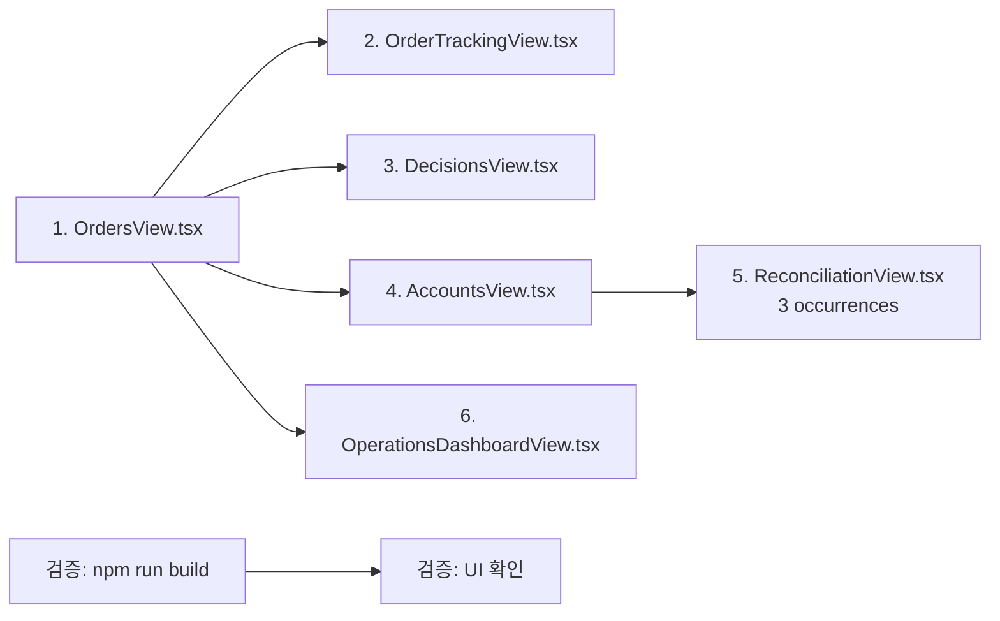

# admin_ui Instrument Name Typography 통일 설계

> **작성일:** 2026-05-17
> **Phase:** E (admin_ui_instrument_name_runtime_hotfix)
> **목적:** 종목명(`instrument_name`) 컬럼의 typography를 `text-xs text-[#64748b]`에서 `text-sm text-[#334155]`로 통일하여 정상 컬럼 텍스트로 가시성 확보

---

## 1. 현재 상태 분석

### 1.1 문제점

Phase E에서 종목명(`instrument_name`)이 별도 컬럼으로 분리되었으나, 모든 View에서 **서브텍스트 스타일** (`text-xs text-[#64748b]`)을 사용 중입니다. 이로 인해:

- Symbol 컬럼 (`text-sm font-medium text-[#0f172a]`)과 시각적 계층 차이가 과도함
- `instrument_name`이 부차적인 정보처럼 보여 정상 데이터 컬럼으로 인식되지 않음
- `text-xs`는 테이블 바디의 기본 `text-sm`보다 작아 가독성이 떨어짐

### 1.2 총 변경 대상

**6개 파일, 7개 occurrence** (ReconciliationView.tsx에 3개 존재)

| # | 파일 | 라인 | 현재 코드 | 변경 후 코드 | 비고 |
|---|------|------|-----------|-------------|------|
| 1 | `OrdersView.tsx` | 67 | `text-xs text-[#64748b]` | `text-sm text-[#334155]` | DataTable |
| 2 | `OrderTrackingView.tsx` | 75 | `text-xs text-[#64748b]` | `text-sm text-[#334155]` | DataTable |
| 3 | `DecisionsView.tsx` | 120 | `text-xs text-[#64748b]` | `text-sm text-[#334155]` | DataTable |
| 4 | `AccountsView.tsx` | 233-234 | `text-xs text-[#64748b]` | `text-sm text-[#334155]` | DataTable |
| 5 | `ReconciliationView.tsx` | 238 | `text-xs text-[#64748b]` | `text-sm text-[#334155]` | DataTable (reconcileColumns) |
| 6 | `ReconciliationView.tsx` | 415 | `text-xs text-[#64748b]` | `text-sm text-[#334155]` | raw HTML table (reconcile) |
| 7 | `ReconciliationView.tsx` | 514 | `text-xs text-[#64748b]` | `text-sm text-[#334155]` | raw HTML table (locks) |
| 8 | `OperationsDashboardView.tsx` | 886 | `text-xs text-[#64748b]` | `text-sm text-[#334155]` | DataTable (compactOrders) |

---

## 2. 변경 대상 상세 (변경 전/후 코드)

### 2.1 OrdersView.tsx (line 67)

```tsx
// BEFORE
{
  key: "instrument_name",
  header: "종목명",
  render: (r: OrderSummary) => (
    <span className="text-xs text-[#64748b]">{r.instrument_name || "—"}</span>
  ),
}

// AFTER
{
  key: "instrument_name",
  header: "종목명",
  render: (r: OrderSummary) => (
    <span className="text-sm text-[#334155]">{r.instrument_name || "—"}</span>
  ),
}
```

### 2.2 OrderTrackingView.tsx (line 75)

```tsx
// BEFORE
{
  key: "instrument_name",
  header: "종목명",
  render: (row: OrderSummary) => (
    <span className="text-xs text-[#64748b]">{row.instrument_name || "—"}</span>
  ),
}

// AFTER
{
  key: "instrument_name",
  header: "종목명",
  render: (row: OrderSummary) => (
    <span className="text-sm text-[#334155]">{row.instrument_name || "—"}</span>
  ),
}
```

### 2.3 DecisionsView.tsx (line 120)

```tsx
// BEFORE
{
  key: "instrument_name",
  header: "종목명",
  render: (r) => (
    <span className="text-xs text-[#64748b]">{r.instrument_name || "—"}</span>
  ),
}

// AFTER
{
  key: "instrument_name",
  header: "종목명",
  render: (r) => (
    <span className="text-sm text-[#334155]">{r.instrument_name || "—"}</span>
  ),
}
```

### 2.4 AccountsView.tsx (line 233-234)

```tsx
// BEFORE
{
  key: "instrument_name",
  header: "종목명",
  render: (r) => (
    <span className="text-xs text-[#64748b]">
      {r.instrument_name || "—"}
    </span>
  ),
}

// AFTER
{
  key: "instrument_name",
  header: "종목명",
  render: (r) => (
    <span className="text-sm text-[#334155]">
      {r.instrument_name || "—"}
    </span>
  ),
}
```

### 2.5 ReconciliationView.tsx — DataTable (line 238)

```tsx
// BEFORE
{
  key: "instrument_name" as any,
  header: "종목명",
  render: (r: ReconcileRequiredCase) => (
    <span className="text-xs text-[#64748b]">{r.order.instrument_name || "—"}</span>
  ),
}

// AFTER
{
  key: "instrument_name" as any,
  header: "종목명",
  render: (r: ReconcileRequiredCase) => (
    <span className="text-sm text-[#334155]">{r.order.instrument_name || "—"}</span>
  ),
}
```

### 2.6 ReconciliationView.tsx — raw HTML table (line 415)

```tsx
// BEFORE
<td className="px-4 py-2.5">
  <span className="text-xs text-[#64748b]">{rc.order.instrument_name || "—"}</span>
</td>

// AFTER
<td className="px-4 py-2.5">
  <span className="text-sm text-[#334155]">{rc.order.instrument_name || "—"}</span>
</td>
```

### 2.7 ReconciliationView.tsx — Locks raw HTML table (line 514)

```tsx
// BEFORE
<td className="px-4 py-2.5">
  <span className="text-xs text-[#64748b]">{lock.instrument_name || "—"}</span>
</td>

// AFTER
<td className="px-4 py-2.5">
  <span className="text-sm text-[#334155]">{lock.instrument_name || "—"}</span>
</td>
```

### 2.8 OperationsDashboardView.tsx (line 886)

```tsx
// BEFORE
{
  key: "instrumentName",
  header: "종목명",
  width: "80px",
  render: (row: CompactOrderItem) => (
    <span className="text-xs text-[#64748b]">{row.instrumentName || "—"}</span>
  ),
}

// AFTER
{
  key: "instrumentName",
  header: "종목명",
  width: "80px",
  render: (row: CompactOrderItem) => (
    <span className="text-sm text-[#334155]">{row.instrumentName || "—"}</span>
  ),
}
```

---

## 3. Typography 계층 구조

admin_ui 테이블 컬럼의 typography 계층은 다음과 같이 정리됩니다.

```mermaid
graph TD
    A[Symbol 컬럼] -->|text-sm font-medium text-[#0f172a]| B[Primary 식별자]
    C[Instrument Name 컬럼] -->|text-sm text-[#334155]| D[Secondary 식별자]
    E[일반 데이터 컬럼] -->|text-sm text-[#0f172a] DataTable 기본값| F[데이터 값]
    G[서브텍스트 / 라벨] -->|text-xs text-[#64748b]| H[부가 정보]

    B -->|bold + dark| I[가장 강조]
    D -->|regular + 중간톤| J[중간 강조]
    F -->|regular + dark| K[일반 텍스트]
    H -->|small + 회색| L[최하위]
```

| 계층 | 예시 | 클래스 | 용도 |
|------|------|--------|------|
| **Symbol** | `AAPL` | `text-sm font-medium text-[#0f172a]` | 종목의 **Primary 식별자**, 굵은 bold로 강조 |
| **Instrument Name** | `Apple Inc.` | `text-sm text-[#334155]` | 종목의 **Secondary 식별자**, 일반 텍스트로 식별 가능 |
| 일반 데이터 | `10,000`, `2026-05-17` | `text-sm text-[#0f172a]` (DataTable 기본) | 일반 데이터 값 |
| 서브텍스트 | 라벨, 부가 설명 | `text-xs text-[#64748b]` | 부차적 정보, 헤더 설명 |

**변경 rationale:** Instrument Name은 Symbol과 함께 종목을 식별하는 핵심 컬럼이므로 `text-xs`(subtext 수준)가 아닌 `text-sm`(정상 컬럼 수준)을 사용해야 합니다. 색상을 `#334155`(slate-700)로 지정하여 Symbol의 `#0f172a`(slate-900)보다 한 단계 아래 두되, 일반 데이터와 동등한 시각적 무게를 유지합니다.

---

## 4. 리스크 분석

| 리스크 | 영향 | 확률 | 대응 방안 |
|--------|------|------|----------|
| **DataTable의 `compact` prop과 충돌** | `compact` 모드에서 DataTable이 `text-xs`를 강제 적용함 | 낮음 | DataTable의 `compact` 모드(line 52: `cn("w-full", compact && "text-xs")`)는 테이블 전체에 적용되므로, 개별 `td`의 `text-sm`이 우선 적용됨 (CSS specificity) |
| **placeholder `—` 미적용** | `—` (em dash)가 변경된 typography를 따르지 않을 가능성 | 없음 | 모든 render 함수에서 `|| "—"` 동일하게 사용 중이며, 동일 `<span>` 내부에서 처리됨 |
| **다른 `text-xs text-[#64748b]` 용례와 혼동** | Instrument Name 외 다른 subtext까지 의도치 않게 변경될 위험 | 낮음 | 이 설계는 **정확히 instrument_name을 감싸는 span만** 변경 대상임. Regex 검색으로 확인 완료 |
| **재사용성 / 유지보수** | 향후 typography 변경 시 여러 파일 수정 필요 | 중간 | 향후 Refactor 시 공통 `formatCell` 유틸 또는 상수 도입 검토 |
| **CSS cascading 충돌** | DataTable `td` 기본 클래스와 충돌 | 낮음 | `<td className="px-4 py-3 text-sm text-[#0f172a]">`가 DataTable(line 85)에서 적용되지만, 개별 `render`의 `<span>`이 더 높은 specificity로 우선함 |

---

## 5. 실행 순서

변경 순서는 **파일 간 의존성이 없으므로** 어떤 순서로 적용해도 무방합니다. 아래는 추천 실행 순서입니다.



### Step-by-Step

| 단계 | 작업 | 대상 파일 | 예상 시간 |
|------|------|-----------|-----------|
| 1 | `instrument_name` span class 변경 | `OrdersView.tsx:67` | 1분 |
| 2 | `instrument_name` span class 변경 | `OrderTrackingView.tsx:75` | 1분 |
| 3 | `instrument_name` span class 변경 | `DecisionsView.tsx:120` | 1분 |
| 4 | `instrument_name` span class 변경 | `AccountsView.tsx:233` | 1분 |
| 5a | `instrument_name` span class 변경 (DataTable) | `ReconciliationView.tsx:238` | 1분 |
| 5b | `instrument_name` span class 변경 (raw HTML reconcile) | `ReconciliationView.tsx:415` | 1분 |
| 5c | `instrument_name` span class 변경 (raw HTML locks) | `ReconciliationView.tsx:514` | 1분 |
| 6 | `instrumentName` span class 변경 (compactOrders) | `OperationsDashboardView.tsx:886` | 1분 |
| 7 | TypeScript 컴파일 및 빌드 검증 | `npm run build` | 2분 |
| 8 | 브라우저에서 각 View 시각 확인 | N/A | 5분 |

> **Note:** 각 변경은 단순 클래스 문자열 치환 (exact match)이므로 `sed` 또는 IDE 일괄 치환으로 처리 가능합니다. 단, `ReconciliationView.tsx`는 3개 occurrence가 모두 `text-xs text-[#64748b]` 패턴이므로 정확한 라인 확인 후 변경해야 합니다.

---

## 6. 변경 후 예상 화면

변경 적용 시 각 View에서:

- **Symbol 컬럼:** `text-sm font-medium text-[#0f172a]` — 굵은 dark text (변경 없음)
- **Instrument Name 컬럼:** `text-sm text-[#334155]` — 일반 중간톤 text (변경됨)
- **기존 subtext 스타일** (label, 설명 등): `text-xs text-[#64748b]` — 유지

Symbol과 Instrument Name이 **동일한 `text-sm` 크기**를 가지게 되어 두 컬럼이 동등한 시각적 계층으로 보이며, Instrument Name이 더 이상 subtext처럼 보이지 않습니다.

---

## 7. 참고 사항

- **No backend changes** — 순수 프론트엔드 Tailwind CSS 변경만 필요
- **No API contract changes** — 데이터 구조 변경 없음
- **No test changes** — 컴포넌트 동작 변경 없음, 시각적 스타일만 변경
- `text-xs`는 Instrument Name 외의 다른 subtext 요소(예: 서머리 카드 라벨, 설명 텍스트)에서는 **계속 사용되므로 제거되지 않음**
