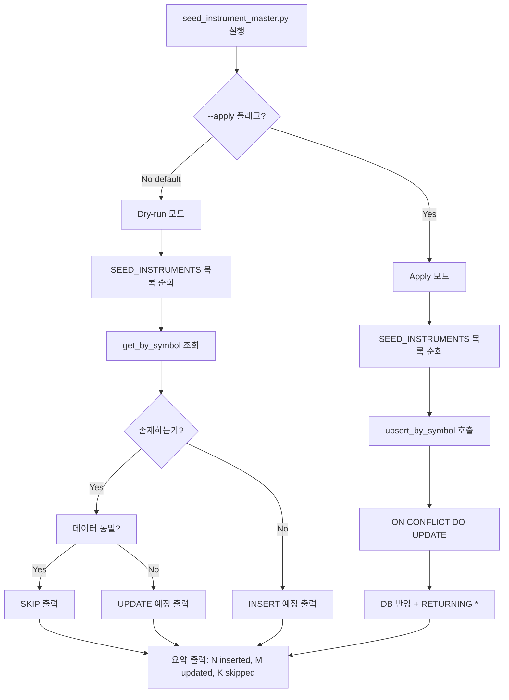

# KRX Instrument Master Seed Plan

> **Priority**: P0 — 내일(2026-05-15) 운영 전 반드시 완료
> **착수 시점**: 즉시 (장 종료 후)
> **장중 작업 금지**: DB 스키마 변경을 수반하지 않으나, DB write 전 dry-run 검증 필수

---

## 1. 현재 문제

### 1.1 `trading.instruments` 테이블 현황

| symbol | market_code | asset_class | currency | name | 상태 |
|--------|-------------|-------------|----------|------|------|
| 005930 | KRX | kr_stock | KRW | Samsung Electronics Co., Ltd. | ✅ 존재 |
| AAPL | NASDAQ | us_stock | USD | Apple Inc. | ✅ 존재 |
| (기타 KRX 종목) | — | — | — | — | ❌ 없음 |

### 1.2 영향

[`decision_orchestrator.py`](src/agent_trading/services/decision_orchestrator.py:472)에서 [`InstrumentRepository.get_by_symbol()`](src/agent_trading/repositories/contracts.py:186)로 instrument lookup 수행:

```python
instrument = await self._repos.instruments.get_by_symbol(
    symbol=request.symbol,
    market_code=request.market,
)
```

- lookup 실패 시 `instrument = None` → position snapshot symbol 필터링 불가
- dry-run에는 영향 없으나, 실제 submit 시 `instrument_id` 참조 실패로 안전하지 않음
- Trading Universe에 005930 외 다른 KRX 종목을 넣어도 instrument lookup이 실패하면 position 기반 판단 불가

---

## 2. 수집 현황

### 2.1 instruments 테이블 DDL

[`db/migrations/0001_initial_schema.sql:111-125`](db/migrations/0001_initial_schema.sql:111)

```sql
CREATE TABLE IF NOT EXISTS trading.instruments (
    instrument_id UUID PRIMARY KEY DEFAULT gen_random_uuid(),
    symbol VARCHAR(64) NOT NULL,
    market_code VARCHAR(32) NOT NULL,
    asset_class VARCHAR(32) NOT NULL,
    currency CHAR(3) NOT NULL DEFAULT 'KRW',
    name VARCHAR(255) NOT NULL,
    tick_size NUMERIC(20, 8),
    lot_size NUMERIC(20, 8),
    is_active BOOLEAN NOT NULL DEFAULT TRUE,
    metadata JSONB NOT NULL DEFAULT '{}'::jsonb,
    created_at TIMESTAMPTZ NOT NULL DEFAULT NOW(),
    updated_at TIMESTAMPTZ NOT NULL DEFAULT NOW(),
    CONSTRAINT uq_instruments UNIQUE (symbol, market_code)
);
```

### 2.2 InstrumentEntity

[`src/agent_trading/domain/entities.py:101-114`](src/agent_trading/domain/entities.py:101)

```python
@dataclass(slots=True, frozen=True)
class InstrumentEntity:
    instrument_id: UUID
    symbol: str
    market_code: str
    asset_class: str
    currency: str
    name: str
    tick_size: Decimal | None = None
    lot_size: Decimal | None = None
    is_active: bool = True
    metadata: dict[str, object] = field(default_factory=dict)
    created_at: datetime | None = None
    updated_at: datetime | None = None
```

### 2.3 InstrumentRepository Protocol

[`src/agent_trading/repositories/contracts.py:179-187`](src/agent_trading/repositories/contracts.py:179)

| 메서드 | 설명 | 현재 구현 |
|--------|------|-----------|
| `add(instrument)` | 단일 INSERT | ✅ Postgres, Memory |
| `get(instrument_id)` | PK 조회 | ✅ Postgres, Memory |
| `get_by_symbol(symbol, market_code)` | UK 조회 | ✅ Postgres, Memory |
| `upsert_by_symbol(...)` | ON CONFLICT upsert | ❌ 없음 — **신규 필요** |
| `list_all()` | 전체 조회 | ❌ 없음 |

### 2.4 PostgresInstrumentRepository (INSERT only, no upsert)

[`src/agent_trading/repositories/postgres/instruments.py:22-42`](src/agent_trading/repositories/postgres/instruments.py:22)

```python
async def add(self, instrument: InstrumentEntity) -> InstrumentEntity:
    row = await self._tx.connection.fetchrow(
        """
        INSERT INTO trading.instruments
            (instrument_id, symbol, market_code, asset_class, currency,
             name, tick_size, lot_size, is_active, metadata)
        VALUES ($1, $2, $3, $4, $5, $6, $7, $8, $9, $10::jsonb)
        RETURNING *
        """,
        ...
    )
```

### 2.5 KIS Rest Client — 기본종목정보 API

현재 [`KISRestClient`](src/agent_trading/brokers/koreainvestment/rest_client.py:219)가 정의한 엔드포인트:

| endpoint_key | KIS URL | 용도 |
|---|---|---|
| `inquire_price` | `/uapi/domestic-stock/v1/quotations/inquire-price` | 주식현재가 시세 |
| `inquire_asking_price_exp_ccn` | `/uapi/domestic-stock/v1/quotations/inquire-asking-price-exp-ccn` | 호가 |

**KIS 기본종목정보 API (`/uapi/domestic-stock/v1/quotations/search-stock-info` 또는 유사)**: **구현되지 않음**.

`inquire-price` 응답에는 `iscd_stat_cls_code`(종목상태), `marg_rate`(증거금율) 등이 포함되나, 종목명/액면가/lot_size 등 기본정보는 별도 API 필요.

### 2.6 External Events — 최근 72시간 KRX Symbol 현황

| symbol | event_count | 비고 |
|--------|-------------|------|
| 018670 | 6 | SK가스 |
| 140430 | 6 | 신성이엔지 |
| 402340 | 6 | SK바이오팜 |
| 000720 | 5 | 현대건설 |
| 020560 | 4 | 아시아나항공 |
| 030200 | 4 | KT |
| 123010 | 4 | 아이원바이오 |
| 188260 | 4 | 상상인 |
| 381970 | 4 | 케이카 |
| 003070 | 3 | 코오롱글로벌 |
| 003490 | 3 | 대한항공 |
| 003530 | 3 | 한화투자증권 |
| 003540 | 3 | 대신증권 |
| 008670 | 3 | (기타) |
| 065650 | 3 | 메타랩스 |
| 005930 | — | 삼성전자 (이미 존재) |

> **참고**: external_events의 `market` 컬럼은 현재 모두 `NULL`. 모든 symbol은 OpenDART source이며, KRX 6-digit 코드로 식별.

---

## 3. 접근법 비교: Static Seed vs KIS API Master Sync

| 항목 | P0: Static KRX Watchlist Seed | P1: KIS API 기반 Master Sync |
|------|-------------------------------|-------------------------------|
| **방식** | 하드코딩된 symbol 목록을 instruments에 upsert | KIS 기본종목정보 API 호출 → 검증 → 적재 |
| **KIS API 의존성** | 없음 ✅ | 필요 ❌ (paper mode에서 API 동작 불확실) |
| **장중 실패 위험** | 없음 (오프라인 스크립트) | KIS API 장애 시 실패 |
| **내일 운영 적용** | 즉시 가능 ✅ | API 검증/에러처리 필요, 장중엔 부적합 |
| **Paper mode 호환** | 완벽 ✅ | KIS paper mode API 지원 불확실 |
| **데이터 정확도** | 수동 관리, 고정 | KIS 원천 데이터, 자동 갱신 |
| **유지보수** | symbol 추가 시 스크립트 수정 필요 | KIS master 변경 시 자동 반영 |
| **개발 시간** | 1-2시간 | 4-8시간 (API 분석, 엔드포인트 추가, 테스트) |

### 결론

**P0 = Static Seed 방식으로 즉시 구현** (내일 운영 안전성 최우선)

**P1 = KIS API 기반 Master Sync**는 BACKLOG Medium-term #11 또는 #8(adaptive scheduling)과 통합하여 추후 구현.

---

## 4. P0 상세 설계: Static Seed Script

### 4.1 신규 스크립트: [`scripts/seed_instrument_master.py`](scripts/seed_instrument_master.py)

```
python3 scripts/seed_instrument_master.py          # dry-run 모드 (default)
python3 scripts/seed_instrument_master.py --dry-run  # 명시적 dry-run
python3 scripts/seed_instrument_master.py --apply    # 실제 DB upsert
```

### 4.2 후보 Symbol 목록 (10개)

선정 기준:
1. **external_events 최근 72h 이벤트 존재** → decision loop이 판단할 근거 있음
2. **KRX 주요 대형주** → 유동성 충분, 실제 trading universe 후보
3. **005930(삼성전자) 포함** — 이미 존재, UPSERT 시 update/skip 처리

| # | symbol | name | market | asset_class | currency | event_count | 선정 이유 |
|---|--------|------|--------|-------------|----------|-------------|-----------|
| 1 | 005930 | 삼성전자 | KRX | kr_stock | KRW | — | 이미 존재, 유지 |
| 2 | 000660 | SK하이닉스 | KRX | kr_stock | KRW | — | 대형주, universe 핵심 |
| 3 | 035420 | NAVER | KRX | kr_stock | KRW | — | 대형주, universe 핵심 |
| 4 | 005380 | 현대차 | KRX | kr_stock | KRW | — | 대형주 |
| 5 | 051910 | LG화학 | KRX | kr_stock | KRW | — | 대형주 |
| 6 | 207940 | 삼성바이오로직스 | KRX | kr_stock | KRW | — | 대형주 |
| 7 | 000720 | 현대건설 | KRX | kr_stock | KRW | 5 | 이벤트 존재 |
| 8 | 030200 | KT | KRX | kr_stock | KRW | 4 | 이벤트 존재 |
| 9 | 018670 | SK가스 | KRX | kr_stock | KRW | 6 | 이벤트 1위 |
| 10 | 402340 | SK바이오팜 | KRX | kr_stock | KRW | 6 | 이벤트 존재 |

### 4.3 Repository 변경: `upsert_by_symbol` 메서드 추가

**Protocol** [`src/agent_trading/repositories/contracts.py`](src/agent_trading/repositories/contracts.py):

```python
class InstrumentRepository(Protocol):
    async def add(self, instrument: InstrumentEntity) -> InstrumentEntity: ...
    async def get(self, instrument_id: UUID) -> InstrumentEntity | None: ...
    async def get_by_symbol(self, symbol: str, market_code: str) -> InstrumentEntity | None: ...
    
    async def upsert_by_symbol(
        self, instrument: InstrumentEntity
    ) -> InstrumentEntity:
        """INSERT … ON CONFLICT (symbol, market_code) DO UPDATE … RETURNING *"""
        ...
```

**Postgres 구현** [`src/agent_trading/repositories/postgres/instruments.py`](src/agent_trading/repositories/postgres/instruments.py):

```python
async def upsert_by_symbol(self, instrument: InstrumentEntity) -> InstrumentEntity:
    row = await self._tx.connection.fetchrow(
        """
        INSERT INTO trading.instruments
            (instrument_id, symbol, market_code, asset_class, currency,
             name, tick_size, lot_size, is_active, metadata)
        VALUES ($1, $2, $3, $4, $5, $6, $7, $8, $9, $10::jsonb)
        ON CONFLICT (symbol, market_code) DO UPDATE
            SET name = EXCLUDED.name,
                asset_class = EXCLUDED.asset_class,
                currency = EXCLUDED.currency,
                tick_size = EXCLUDED.tick_size,
                lot_size = EXCLUDED.lot_size,
                is_active = EXCLUDED.is_active,
                metadata = EXCLUDED.metadata,
                updated_at = NOW()
        RETURNING *
        """,
        ...
    )
    return row_to_entity(row, InstrumentEntity)
```

**Memory 구현** [`src/agent_trading/repositories/memory.py`](src/agent_trading/repositories/memory.py):

```python
async def upsert_by_symbol(self, instrument: InstrumentEntity) -> InstrumentEntity:
    existing = await self.get_by_symbol(instrument.symbol, instrument.market_code)
    if existing is not None:
        # In-memory: replace with new instrument (frozen dataclass, so replace)
        import datetime
        updated = InstrumentEntity(
            instrument_id=existing.instrument_id,  # preserve original ID
            symbol=instrument.symbol,
            market_code=instrument.market_code,
            asset_class=instrument.asset_class,
            currency=instrument.currency,
            name=instrument.name,
            tick_size=instrument.tick_size,
            lot_size=instrument.lot_size,
            is_active=instrument.is_active,
            metadata=instrument.metadata,
            created_at=existing.created_at,
            updated_at=datetime.datetime.now(datetime.timezone.utc),
        )
        self._items[existing.instrument_id] = updated
        return updated
    return await self.add(instrument)
```

### 4.4 Seed 스크립트 상세 로직

```python
# 1. argparse: --dry-run (default True), --apply (False)
# 2. Load DATABASE_URL from env (already in .env)
# 3. Define SEED_INSTRUMENTS list
# 4. For each instrument:
#    a. Generate deterministic UUID (UUID5) from symbol+market_code
#    b. Try get_by_symbol first
#    c. If dry-run: print diff (would-insert vs would-update vs skip)
#    d. If apply: call upsert_by_symbol
# 5. Print summary: N inserted, M updated, K skipped (already same)
# 6. AAPL/NASDAQ check: skip if encountered in seed list (not in our list anyway)
```

**UUID 결정성 생성**: `instrument_id = uuid5(NAMESPACE_DNS, f"krx/{symbol}")`
- 동일 symbol/market_code에 대해 항상 동일 UUID 생성
- 재실행 시 중복 문제 없음
- `get_by_symbol`으로도 중복 방지 가능하나 UUID 결정성은 부수 효과

### 4.5 --dry-run 출력 포맷

```
[DRY-RUN] === KRX Instrument Master Seed Preview ===
[DRY-RUN] Total candidates: 9 (005930 already exists)
[DRY-RUN]
[DRY-RUN]   INSERT 000660 | SK하이닉스 | KRX | kr_stock | KRW
[DRY-RUN]   INSERT 035420 | NAVER | KRX | kr_stock | KRW
[DRY-RUN]   INSERT 005380 | 현대차 | KRX | kr_stock | KRW
[DRY-RUN]   INSERT 051910 | LG화학 | KRX | kr_stock | KRW
[DRY-RUN]   INSERT 207940 | 삼성바이오로직스 | KRX | kr_stock | KRW
[DRY-RUN]   INSERT 000720 | 현대건설 | KRX | kr_stock | KRW
[DRY-RUN]   INSERT 030200 | KT | KRX | kr_stock | KRW
[DRY-RUN]   INSERT 018670 | SK가스 | KRX | kr_stock | KRW
[DRY-RUN]   INSERT 402340 | SK바이오팜 | KRX | kr_stock | KRW
[DRY-RUN]
[DRY-RUN]   SKIP  005930 | 삼성전자 | KRX | (already exists, identical data)
[DRY-RUN]
[DRY-RUN] === Summary: 9 to insert, 0 to update, 1 skip ===
[DRY-RUN] Pass --apply to persist these changes.
```

---

## 5. P1 (Future): KIS API 기반 Master Sync

### 5.1 필요한 작업

1. **KIS API 분석**: 한국투자증권 OpenAPI 엑셀에서 "기본종목정보" 또는 "종목검색" API 확인
   - 예상 TR ID: `CTPF1002R` 또는 `FHKST01010100`(inquire-price로 일부 대체 가능)
   - Endpoint: `/uapi/domestic-stock/v1/quotations/search-stock-info`
2. **`KISRestClient.search_stock_info(symbol)` 메서드 추가**
3. **정기 sync 스크립트**: `scripts/sync_instrument_master.py` (cronjob 용)
4. **Rate limit 고려**: MARKET_DATA bucket 사용
5. **Paper mode 호환성 확인**

### 5.2 KIS inquire-price로 대체 가능한 필드

[`inquire-price`](src/agent_trading/brokers/koreainvestment/rest_client.py:1091) 응답에는 다음 필드가 포함됨:
- `PRST_VRSS_SIGN` — 전일대비 부호
- `STCK_PRPR` — 현재가
- `iscd_stat_cls_code` — 종목상태코드 (관리종목/투자위험/투자경고/투자주의/거래정지)
- `marg_rate` — 증거금율

그러나 종목명(`name`), 액면가(`tick_size`), 호가단위 등은 별도 API 필요.

### 5.3 BACKLOG 업데이트

Medium-term #11 (또는 #8과 통합)로 등록:
- **P1 — KIS 기본종목정보 기반 instrument master sync**
- 착수 시점: P0 static seed 적용 후, 장기적 자동 갱신 파이프라인 필요 시

---

## 6. 변경 대상 파일

| 파일 | 변경 유형 | 설명 |
|------|-----------|------|
| [`src/agent_trading/repositories/contracts.py`](src/agent_trading/repositories/contracts.py) | 수정 | `InstrumentRepository`에 `upsert_by_symbol` 메서드 추가 |
| [`src/agent_trading/repositories/postgres/instruments.py`](src/agent_trading/repositories/postgres/instruments.py) | 수정 | `upsert_by_symbol` PostgreSQL 구현 (ON CONFLICT DO UPDATE) |
| [`src/agent_trading/repositories/memory.py`](src/agent_trading/repositories/memory.py) | 수정 | `upsert_by_symbol` In-Memory 구현 |
| [`scripts/seed_instrument_master.py`](scripts/seed_instrument_master.py) | **신규** | Static seed 스크립트 (--dry-run / --apply) |
| [`tests/scripts/test_seed_instrument_master.py`](tests/scripts/test_seed_instrument_master.py) | **신규** | Seed 스크립트 테스트 |
| [`plans/krx_instrument_master_seed_plan.md`](plans/krx_instrument_master_seed_plan.md) | **신규** | 본 문서 |
| [`plans/[BACKLOG] backlog.md`](plans/[BACKLOG]%20backlog.md) | 수정 | P1 KIS master sync 항목 추가 (선택) |

---

## 7. 테스트 계획

### 7.1 Repository 단위 테스트

| 테스트 | 설명 |
|--------|------|
| `test_upsert_inserts_new` | 존재하지 않는 symbol/market → INSERT |
| `test_upsert_updates_existing` | 동일 symbol/market → UPDATE (name 등 변경) |
| `test_upsert_preserves_instrument_id` | UPDATE 시에도 기존 PK 유지 |
| `test_upsert_updates_updated_at` | UPDATE 시 `updated_at` 갱신 확인 |

### 7.2 Seed 스크립트 테스트

| 테스트 | 설명 |
|--------|------|
| `test_dry_run_no_db_write` | `--dry-run` 모드에서 DB 변경 없음 |
| `test_apply_inserts_seed` | `--apply` 모드에서 seed 데이터 INSERT |
| `test_apply_idempotent` | 2회 실행 시 중복 INSERT 없음 (upsert) |
| `test_aapl_not_in_seed` | AAPL/NASDAQ이 seed 목록에 없음 |
| `test_005930_skip_or_update` | 기존 005930 처리 (동일 데이터면 skip, 변경 시 update) |
| `test_parse_args_default_dry_run` | 인자 없이 → `--dry-run` 기본값 확인 |

### 7.3 검증 명령어

```bash
# 1. Parser 테스트
cd /workspace/agent_trading && python3 -m pytest tests/scripts/test_seed_instrument_master.py -v

# 2. Repository upsert 테스트
cd /workspace/agent_trading && python3 -m pytest tests/repositories/test_postgres_instruments.py -v

# 3. Dry-run 실행
cd /workspace/agent_trading && python3 scripts/seed_instrument_master.py --dry-run

# 4. 최종 DB 상태 확인 (apply 후)
psql "$DATABASE_URL" -c "SELECT symbol, name, market_code, asset_class, is_active FROM trading.instruments ORDER BY symbol;"
```

---

## 8. Mermaid: 데이터 흐름



---

## 9. 운영 적용 절차

### Step 1: 코드 구현 및 단위 테스트
```bash
python3 -m pytest tests/scripts/test_seed_instrument_master.py -v
python3 -m pytest tests/repositories/ -k "instrument" -v
```

### Step 2: Dry-run 검증
```bash
python3 scripts/seed_instrument_master.py --dry-run
```
출력 결과를 사용자에게 보고 → 승인 대기

### Step 3: 실제 DB 적용
```bash
python3 scripts/seed_instrument_master.py --apply
```

### Step 4: DB 상태 확인
```bash
psql "$DATABASE_URL" -c "SELECT symbol, name, market_code, asset_class, is_active FROM trading.instruments ORDER BY symbol;"
```

### Step 5: decision loop 영향 확인
- 기존 005930은 그대로 유지 (동일 데이터면 skip)
- 신규 종목에 대해 dry-run decision loop 테스트 (실제 submit 없이)
- Trading Universe configuration에 신규 symbol 반영

---

## 10. 위험 및 주의사항

| 위험 | 영향 | 완화 |
|------|------|------|
| 결정론적 UUID가 기존 005930 UUID와 다름 | 005930이 다른 ID로 upsert될 수 있음 | get_by_symbol으로 기존 조회 후 있으면 기존 ID 사용 |
| Apple InstrumentEntity 생성 시 market_code='NASDAQ' 포함 | NASDAQ 종목이 seed에 포함되지 않음 | seed 목록에서 AAPL 제외, NASDAQ 종목 추가 시 별도 검토 |
| `--apply` 실행 중 스크립트 중단 | 일부만 INSERT됨 | UPSERT이므로 재실행 가능 (멱등성 보장) |
| instrument lookup 성공 시 position snapshot 연결 필요 | P0 범위 밖, 별도 작업 필요 | decision_orchestrator는 instrument=None에서도 정상 동작 (position 필터링만 불가) |
| KIS inquire-price로 종목명 확인 불가 | 종목명은 seed에 하드코딩 | 수기 검증 완료된 데이터만 사용 |

---

## 11. 변경 요약 (구현 완료 시 보고 템플릿)

```
## 변경 파일 목록
- contracts.py: +upsert_by_symbol (Protocol)
- postgres/instruments.py: +upsert_by_symbol (PostgreSQL impl)
- memory.py: +upsert_by_symbol (InMemory impl)
- scripts/seed_instrument_master.py: 신규 생성
- tests/scripts/test_seed_instrument_master.py: 신규 생성

## Dry-run 결과
- INSERT 9건 (000660, 035420, 005380, 051910, 207940, 000720, 030200, 018670, 402340)
- SKIP 1건 (005930, already exists)
- AAPL/NASDAQ: 제외됨 (seed 목록에 없음, market_code != KRX)

## KIS API 기반 sync 미구현 사유
- KISRestClient에 기본종목정보 API(search-stock-info) 메서드 없음
- paper mode API 지원 불확실
- P0로는 static seed가 내일 운영에 가장 안전함
- P1 KIS master sync는 추후 BACKLOG 등록 예정

## 다음 운영 전 필요 사항
- [ ] seed script --apply 실행 (사용자 승인 후)
- [ ] Trading Universe configuration에 신규 symbol 반영
- [ ] dry-run decision loop으로 instrument lookup 정상 확인
```
