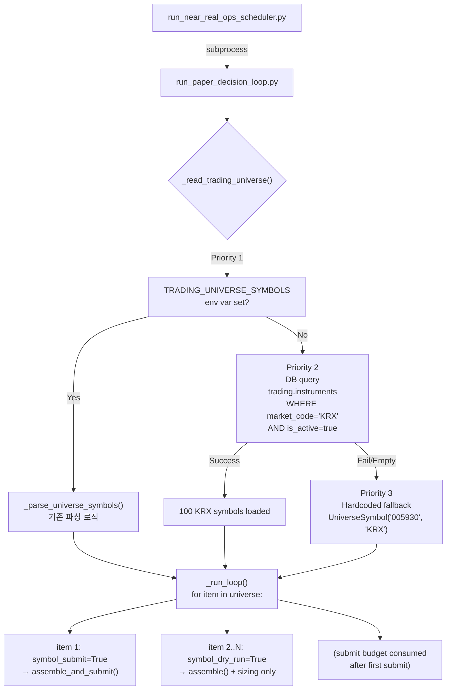

# Root Cause Analysis: Decision Loop Single-Symbol Problem

## 1. Current State: 왜 005930만 사용되는가?

### Universe Source Chain (추적 완료)

```
run_near_real_ops_scheduler.py
  │  _decision_command() → argv = ["python3", "-m", "scripts.run_paper_decision_loop",
  │                                   "--count", "1", "--output", "json", "--dry-run"]
  │  ※ TRADING_UNIVERSE_SYMBOLS env var를 subprocess env에 추가하지 않음
  │  ※ _build_base_env() = os.environ.copy() — 부모 env를 그대로 상속
  ▼
run_paper_decision_loop.py
  │  line 70: from scripts.run_orchestrator_once import SYMBOL, MARKET
  │           → SYMBOL = "005930" (hardcoded at run_orchestrator_once.py:71)
  │  line 189-191: _read_trading_universe()
  │     → _parse_universe_symbols(os.getenv("TRADING_UNIVERSE_SYMBOLS"))
  │     → env var가 설정되어 있지 않음 (None)
  │     → line 150-151: if raw is None → return (UniverseSymbol(symbol=SYMBOL, market=MARKET),)
  │     → 즉 (UniverseSymbol("005930", "KRX"),) — 단일 종목
  ▼
_run_loop() line 508: universe = _read_trading_universe()
  │  line 534: for item in universe:  ← 1개 아이템만 반복
  ▼
_run_one_cycle(symbol=item.symbol, market=item.market)
  │  → symbol="005930", market="KRX"
  ▼
orchestrator.assemble(request)
  │  → request.symbol = "005930"
```

### 결정적 발견: 루프 구조는 이미 Multi-Symbol 지원

| 코드 위치 | 현재 상태 | 멀티심볼 지원 |
|-----------|----------|--------------|
| `_parse_universe_symbols()` | env var → 005930 fallback | ✅ `005930,000660:KRX` 파싱 지원 |
| `_run_loop()` line 534 | `for item in universe:` | ✅ 이미 iteration 구조 |
| `_run_one_cycle()` | `symbol, market` 파라미터 | ✅ 이미 parameterized |
| Submit budget line 537 | `symbol_submit = submit and not dry_run and not submit_budget_consumed` | ✅ 첫 번째만 submit, 나머지 dry-run |
| `_serialize_cycle_result()` | `symbol, market` 파라미터 | ✅ 이미 parameterized |
| `_build_aggregate_summary()` | multiple results | ✅ 이미 multi-result 지원 |

**즉, 멀티심볼을 막는 코드는 없다. Universe가 1개만 공급될 뿐이다.**

## 2. DB Instrument Master와의 괴리

- `trading.instruments` 테이블: 100개 KRX `kr_stock` active + 1개 NASDAQ
- CSV seed (`kospi200_instruments.csv`): 성공적으로 시딩 완료
- **그러나 어떤 코드도 이 테이블을 읽어서 universe를 구성하지 않음**
- `InstrumentRepository.get_by_symbol()`은 `assemble()` 내부에서 **이미 결정된 symbol의 메타데이터 조회용**으로만 사용됨

## 3. 수정 범위 (Minimal)

### 대상 파일: `scripts/run_paper_decision_loop.py` (1개 파일)

**변경 사항:**

#### 3.1 `_read_trading_universe()`를 async로 변경 + DB fallback 추가

현재 (sync):
```python
def _read_trading_universe() -> tuple[UniverseSymbol, ...]:
    return _parse_universe_symbols(os.getenv(ENV_TRADING_UNIVERSE))
```

변경 (async):
```python
async def _read_trading_universe() -> tuple[UniverseSymbol, ...]:
    """Read trading universe: env var → DB → hardcoded fallback."""
    # Priority 1: TRADING_UNIVERSE_SYMBOLS env var
    raw = os.getenv(ENV_TRADING_UNIVERSE)
    if raw and raw.strip():
        return _parse_universe_symbols(raw)
    
    # Priority 2: DB (seeded KRX instruments)
    try:
        from agent_trading.db.connection import connection
        async with connection() as conn:
            rows = await conn.fetch(
                "SELECT symbol, market_code FROM trading.instruments "
                "WHERE market_code = 'KRX' AND is_active = true "
                "ORDER BY symbol"
            )
        if rows:
            logger.info("Trading universe from DB: %d KRX symbols loaded.", len(rows))
            return tuple(
                UniverseSymbol(symbol=row["symbol"], market=row["market_code"])
                for row in rows
            )
    except Exception as exc:
        logger.warning("DB universe query failed, using fallback: %s", exc)
    
    # Priority 3: Hardcoded fallback (005930 single smoke)
    logger.info("No TRADING_UNIVERSE_SYMBOLS set and DB unavailable — using 005930 fallback.")
    return (UniverseSymbol(symbol=SYMBOL, market=MARKET),)
```

#### 3.2 `_run_loop()`에서 `await`로 호출 변경

```python
# line 508: universe = _read_trading_universe()
universe = await _read_trading_universe()
```

#### 3.3 기존 `_parse_universe_symbols()`는 변경 없음

- env var 기반 파싱은 그대로 유지
- `SYMBOL` import는 fallback에서만 사용 (변경 없음)

### 변경 안 하는 것들

| 항목 | 이유 |
|------|------|
| `run_orchestrator_once.py` | SYMBOL hardcoded는 fallback으로 유지 |
| `run_near_real_ops_scheduler.py` | scheduler는 subprocess env를 상속. env var 미설정시 DB fallback이 동작 |
| `contracts.py` / repositories | 별도 메서드 추가 없이 raw connection 사용 |
| `.env` | 수정 금지 (user 명시) |
| `decision_orchestrator.py` | 이미 symbol 파라미터로 동작 — 수정 불필요 |
| 기존 테스트 | `test_default_universe`는 005930 fallback 검증 — 변경된 동작과 호환 |

## 4. 영향도 분석

### 정상 케이스 (DB 정상, env var 미설정)
1. `_read_trading_universe()` → DB에서 100개 KRX symbol 로드
2. `_run_loop()` → 100개 symbol에 대해 `for item in universe:` 반복
3. Submit budget → 첫 번째 symbol만 submit, 99개는 dry-run
4. 기존 `--count 1`이면 1 cycle = 100번의 `_run_one_cycle()` 호출
5. 각 cycle은 별도의 `postgres_runtime()` context 진입

### env var 설정 케이스
- `TRADING_UNIVERSE_SYMBOLS=005930,000660`: 해당 2개만 처리
- 기존과 동일한 우선순위 동작

### DB 장애 케이스
- connection 실패 → logger.warning + 005930 fallback
- 기존 동작과 동일

### Submit Budget (1회/일)
- line 537: `symbol_submit = submit and not dry_run and not submit_budget_consumed`
- 첫 번째 symbol만 submit, 나머지 99개는 `symbol_dry_run=True` → dry-run assemble only
- `RECONCILE_REQUIRED`도 budget 소모 (line 556)
- Daily 예산 정책 완전히 보존

### AAPL/NASDAQ 필터링
- DB query에서 `WHERE market_code = 'KRX'`로 KRX만 로드
- NASDAQ 종목은 universe에 포함되지 않음
- env var로 명시적 설정 시에는 모든 market 허용 (기존 동작 유지)

## 5. Implementation Plan

```
Step 1: run_paper_decision_loop.py — _read_trading_universe() async 변경
  └─ import logging → logger
  └─ agent_trading.db.connection.connection 추가 (async with connection())
  └─ env var → DB query → hardcoded fallback chain

Step 2: _run_loop() — await _read_trading_universe() 호출

Step 3: test_run_paper_decision_loop.py — 새 테스트 추가
  └─ test_read_trading_universe_from_db() — monkeypatch connection
  └─ test_db_fallback_when_env_not_set()
  └─ 기존 테스트는 수정하지 않음

Step 4: pytest 실행

Step 5: Dry-run 검증
  └─ python3 -m scripts.run_paper_decision_loop --count 1 --dry-run --output json
  └─ 100개 symbol 출력 확인

Step 6: 필요시 plans/에 보고서 저장
```

## 6. Mermaid: 변경 후 Data Flow



## 7. 파일별 변경 요약

| File | Status | Change |
|------|--------|--------|
| `scripts/run_paper_decision_loop.py` | **MODIFY** | `_read_trading_universe()` async + DB fallback; `_run_loop()` await |
| `tests/scripts/test_run_paper_decision_loop.py` | **MODIFY** | 새 테스트 추가 (기존 테스트 호환) |
| `scripts/run_orchestrator_once.py` | NO CHANGE | SYMBOL fallback 유지 |
| `scripts/run_near_real_ops_scheduler.py` | NO CHANGE | subprocess env 상속 |
| `src/agent_trading/services/decision_orchestrator.py` | NO CHANGE | 이미 symbol 파라미터화 |
| `src/agent_trading/repositories/contracts.py` | NO CHANGE | raw connection 사용 |
| `.env` | NO CHANGE | 수정 금지 |
