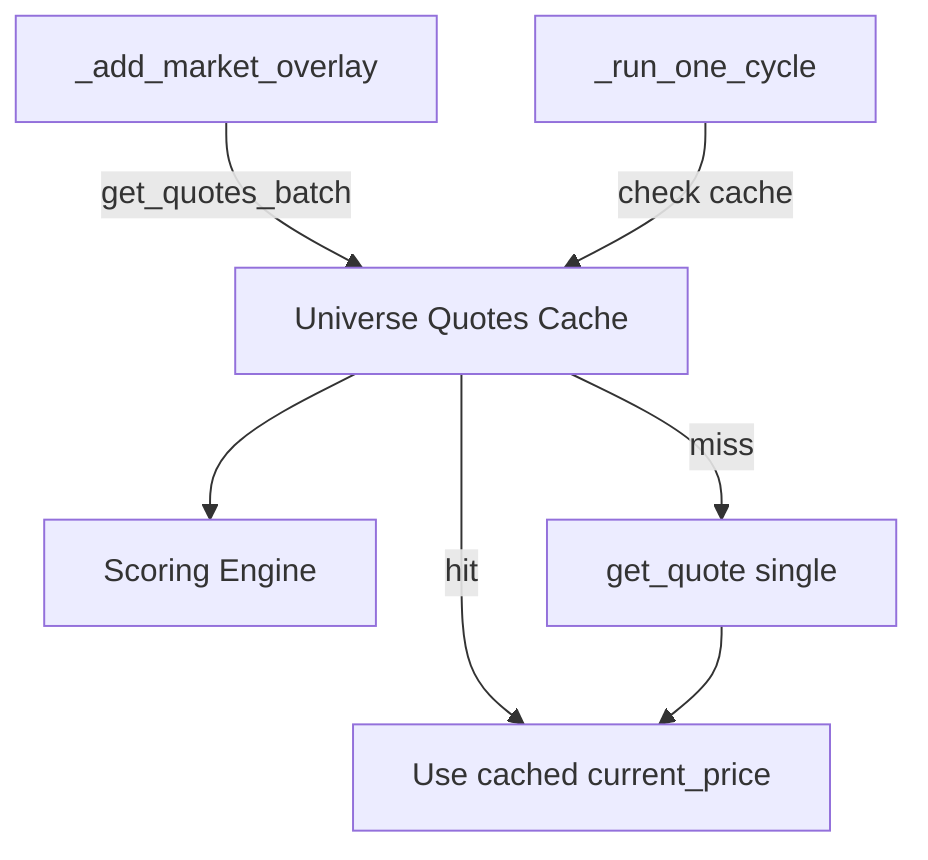
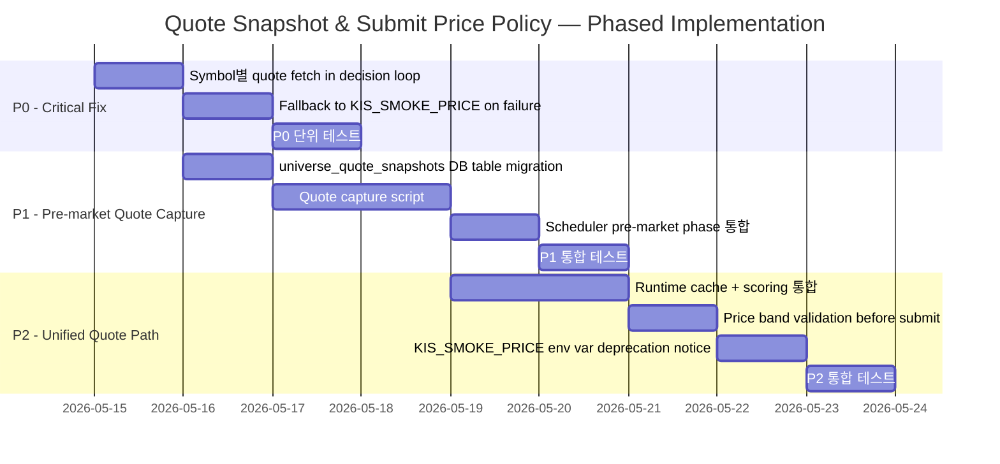
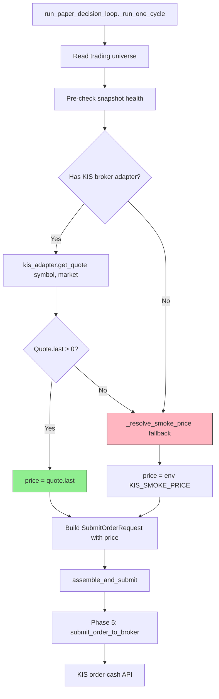
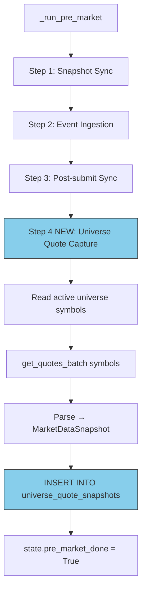
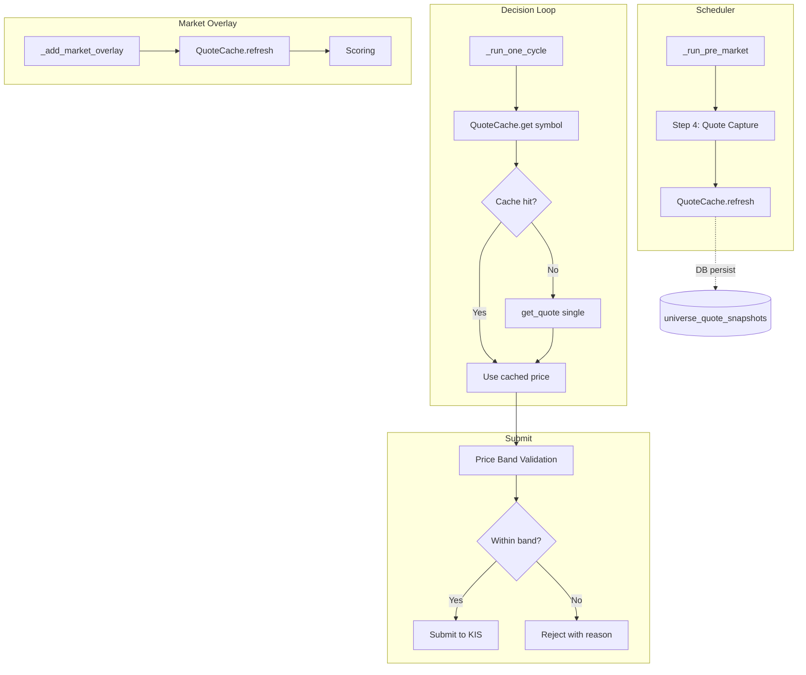

# Universe Quote Snapshot & Submit Price Policy

> **목적**: 전역 `KIS_SMOKE_PRICE` 의존성을 제거하고, Universe 종목별 실시간 quote 기반 가격 결정으로 `모의투자 상/하한가 오류 (msg_cd=40270000)`를 해결한다.
>
> **상태**: 설계/분석 문서 — 구현 전 검토 단계
>
> **관련 파일**:
> - [`scripts/run_paper_decision_loop.py`](../scripts/run_paper_decision_loop.py) — P0 수정 대상, `_resolve_smoke_price()` 호출 지점
> - [`scripts/run_orchestrator_once.py`](../scripts/run_orchestrator_once.py) — `_resolve_smoke_price()` 정의 (P0에서 대체 또는 축소)
> - [`scripts/run_near_real_ops_scheduler.py`](../scripts/run_near_real_ops_scheduler.py) — `_run_pre_market()`에 P1 quote capture phase 추가
> - [`src/agent_trading/brokers/koreainvestment/rest_client.py`](../src/agent_trading/brokers/koreainvestment/rest_client.py) — `get_quote()` (L1091), `get_quotes_batch()` (L1114) 재사용
> - [`src/agent_trading/services/universe_selection_types.py`](../src/agent_trading/services/universe_selection_types.py) — `MarketDataSnapshot` (L127) 재사용
> - [`src/agent_trading/services/universe_selection.py`](../src/agent_trading/services/universe_selection.py) — `_parse_quote_to_snapshot()` (L142) 재사용
> - [`src/agent_trading/services/decision_orchestrator.py`](../src/agent_trading/services/decision_orchestrator.py) — `build_submit_order_request_from_decision()` (L1886), `assemble_and_submit()` (L662)
> - [`src/agent_trading/domain/models.py`](../src/agent_trading/domain/models.py) — `SubmitOrderRequest.price` (L104), `Quote` (L58)
> - [`src/agent_trading/brokers/koreainvestment/adapter.py`](../src/agent_trading/brokers/koreainvestment/adapter.py) — `get_quote()` (L132), `submit_order()` (L176)

---

## 1. 문제 정의

### 1.1 현재 구조

```
[env var] KIS_SMOKE_PRICE=280500
       │
       ▼
_run_one_cycle()  [run_paper_decision_loop.py:537]
  resolved_price = _resolve_smoke_price()
       │
       ▼
SubmitOrderRequest(price=resolved_price, ...)  [line 548]
       │
       ▼
assemble_and_submit() → build_submit_order_request_from_decision()
       │                    [decision_orchestrator.py:1886]
       │                    preserves intent.request.price
       ▼
submit_order_to_broker() → adapter.submit_order()
       │                    [adapter.py:176]
       ▼
rest_client.submit_order()  [rest_client.py:765]
  ORD_UNPR = str(request.price)   # line 780
       │
       ▼
POST /uapi/domestic-stock/v1/trading/order-cash
  → msg_cd=40270000 "모의투자 상/하한가 오류"
```

### 1.2 근본 원인

| 항목 | 값 |
|------|-----|
| 전역 smoke price | `280500` (모든 symbol 동일) |
| Symbol 000880 현재가 (2026-05-15) | ~17,000원 |
| 일일 가격 제한 폭 (한국 시장) | ±30% |
| 허용 범위 (000880) | ~11,900원 ~ ~22,100원 |
| `ORD_UNPR` = 280500 | **범위 밖 → KIS reject** |

**핵심**: 하나의 고정 가격으로 모든 symbol의 submit 가격을 결정할 수 없음. 한국 주식시장의 일일 가격 제한 폭(±30%)을 고려하면, symbol별 현재가 기반 가격 결정이 필수적.

### 1.3 영향 범위

- 실행 환경: `scripts/run_paper_decision_loop.py` (decision loop)
- 장애 증상: Phase 5 submit 시 KIS API reject → `order_requests.status = REJECTED` → submit budget 소진
- 단일 smoke price가 모든 symbol에 동일하게 적용되어, 가격대가 다른 symbol들이 동시에 실패

---

## 2. 요구사항

### 2.1 기능 요구사항

| ID | 요구사항 | 우선순위 | 비고 |
|----|---------|---------|------|
| FR1 | 각 symbol별 submit 가격을 해당 symbol의 **실시간 현재가**(`stck_prpr`)로 결정 | P0 | 기존 `_resolve_smoke_price()` 대체 |
| FR2 | quote fetch 실패 시 fallback 가격 유지 | P0 | `KIS_SMOKE_PRICE` env var를 fallback으로 |
| FR3 | submit 직전에 **가장 신선한** quote 사용 | P0 | submit-time refresh |
| FR4 | pre-market에 Universe 전체 symbol의 quote snapshot 수집 | P1 | monitoring, observability |
| FR5 | 수집된 quote snapshot을 DB에 저장하여 이력 추적 | P1 | 별도 table 또는 기존 구조 확장 |
| FR6 | market_overlay scoring용 quote와 submit price용 quote를 **하나의 path**로 통합 | P2 | 중복 API 호출 제거 |
| FR7 | Submit 전 price band validation (`[low_price, high_price]`) | P2 | 안전장치 |
| FR8 | 기존 env var `KIS_SMOKE_PRICE` 하위 호환성 유지 | P0 | 삭제하지 않고 fallback 전환 |

### 2.2 비기능 요구사항

| ID | 요구사항 | 설명 |
|----|---------|------|
| NFR1 | quote fetch timeout < 3s | `get_quotes_batch()` 기본 timeout 3.0s 준수 |
| NFR2 | KIS API budget 제한 준수 | `BucketType.MARKET_DATA` 사용, semaphore=10 |
| NFR3 | 기존 `SubmitOrderRequest` 인터페이스 변경 없음 | `price` 필드에만 영향 |
| NFR4 | market hours에만 quote fetch | pre-market quote는 08:00-08:50 KST 수집 |
| NFR5 | 테스트 가능한 구조 | `KISBrokerAdapter` mock으로 단위 테스트 |

---

## 3. 핵심 질문에 대한 답변 (Q1-Q7)

### Q1: Pre-market에 Universe symbol별 어떤 quote 데이터를 수집해야 하는가?

`inquire-price` API 응답 중 **아래 필드**를 수집:

| KIS 필드 | 의미 | 용도 |
|----------|------|------|
| `stck_prpr` | 현재가 | **submit price 기본값** |
| `prdy_vrss` | 전일대비가 | 가격 방향성 참고 |
| `prdy_ctrt` | 등락률 | market_overlay scoring |
| `stck_oprc` | 시가 | 가격 안정성 검증 |
| `stck_hgpr` | 고가 | **price band 상한** |
| `stck_lwpr` | 저가 | **price band 하한** |
| `acml_tr_pbmn` | 누적거래대금 | 유동성 평가 |
| `iscd_stat_cls_code` | 종목상태코드 | 거래정지/관리종목 필터 |
| `temp_stop_yn` | 거래정지여부 | 추가 안전장치 |

이 모든 필드는 이미 [`MarketDataSnapshot`](../src/agent_trading/services/universe_selection_types.py:127)에 정의되어 있고, [`_parse_quote_to_snapshot()`](../src/agent_trading/services/universe_selection.py:142)에서 파싱 로직이 구현되어 있음.

**→ `MarketDataSnapshot`을 재사용하며, 새로 추가할 필드는 없음.**

### Q2: Pre-market quote snapshot과 intraday submit-time quote refresh의 역할 분리는?

| 구분 | Pre-market Quote Snapshot | Intraday Submit-time Quote Refresh |
|------|---------------------------|-------------------------------------|
| **시점** | 08:00-08:50 KST (market open 전) | Submit 직전 (09:00-15:20 KST) |
| **범위** | Universe 전체 symbol (수십~수백 개) | Submit 대상 단일 symbol |
| **용도** | Monitoring, 가격 이상 탐지, 사전 필터링 | **실제 submit 가격 결정** |
| **저장** | DB table에 persist | Runtime only (memory) |
| **실패 처리** | Logging만, pipeline blocking 안 함 | Fallback price 사용, alert |
| **API 호출** | `get_quotes_batch()` (batch) | `get_quote()` (single) |
| **신선도** | 최대 60분 경과 가능 | **초 단위 fresh** |

**원칙**: Submit 가격은 **항상 submit 직전에 refresh**한다. Pre-market snapshot은 절대 submit 가격으로 사용하지 않음. 이는 pre-market snapshot이 08:50 KST에 수집된 가격이고, 14:30 KST에 submit할 때는 전혀 다른 가격일 수 있기 때문.

### Q3: 실제 order price는 어떤 단계에서, 어떤 출처로 결정되어야 하는가?

**결정 단계**: [`run_paper_decision_loop.py:_run_one_cycle()`](../scripts/run_paper_decision_loop.py:536) — `SubmitOrderRequest` 생성 직전.

**출처**: `KISRestClient.get_quote(symbol)`의 `stck_prpr` 필드.

**이유**:
1. `assemble_and_submit()` 은 price 결정 책임을 가지지 않음 — assemble은 AI 의사결정, submit은 broker 전송
2. `_run_one_cycle()` 은 이미 `runtime`을 통해 모든 서비스에 접근 가능 (broker adapter 포함)
3. price는 `SubmitOrderRequest`의 필드일 뿐, orchestrator 내부 로직에 영향을 주지 않음

### Q4: `KIS_SMOKE_PRICE`를 완전히 제거해야 하는가, 아니면 per-symbol fallback/debug 용도로 축소해야 하는가?

**완전 제거는 위험 → fallback/debug 용도로 축소 권장**.

```python
def _resolve_symbol_price(symbol: str, market: str, kis_adapter: KoreaInvestmentAdapter) -> Decimal:
    """Per-symbol quote-based price resolution.
    
    Falls back to KIS_SMOKE_PRICE env var when quote fetch fails.
    """
    try:
        quote = await kis_adapter.get_quote(symbol, market)
        if quote.last is not None and quote.last > 0:
            logger.info("Resolved price for %s: %s from live quote", symbol, quote.last)
            return quote.last
    except Exception:
        logger.warning("Quote fetch failed for %s, falling back to KIS_SMOKE_PRICE", symbol)
    
    # Fallback
    return _resolve_smoke_price()
```

**env var 정책**:
- `KIS_SMOKE_PRICE=280500` → quote 실패 시에만 사용 (현재와 동일한 값 유지)
- 추후 smoke test용 debug flag 추가 가능 (`--use-smoke-price`)

### Q5: Market_overlay scoring용 quote와 submit price safety용 quote를 하나의 path로 통합할 수 있는가?

**P2에서 통합 가능**.

현재 [`_add_market_overlay()`](../src/agent_trading/services/universe_selection.py:431)는 `get_quotes_batch()`로 quote를 수집하여 scoring에 사용. P2에서는:

1. `_add_market_overlay()`에서 수집한 quote를 runtime cache에 저장
2. `_run_one_cycle()`에서 같은 cache 확인 → cache hit 시 API 호출 절약
3. cache miss 시에만 `get_quote()` 개별 호출



**단, P0에서는 통합하지 않음** — P0의 목표는 최소 변경으로 버그를 수정하는 것.

### Q6: Quote snapshot을 어디에 저장해야 하는가? (DB, snapshot 구조 통합, runtime cache)

| 옵션 | 장점 | 단점 | 권장 |
|------|------|------|------|
| **A. 신규 DB table** (`universe_quote_snapshots`) | 명확한 ownership, migration 독립, 이력 추적 가능 | migration 필요, I/O 오버헤드 | **P1** |
| **B. 기존 snapshot 구조 통합** (`cash_balance_snapshots`/`position_snapshots`와 동일 테이블) | 인프라 재사용 | snapshot sync와 quote capture의 목적이 다름, coupling 증가 | ❌ |
| **C. Runtime cache only** (in-memory dict) | 구현 단순, P0에 적합 | 재시작 시 소멸, observability 부족 | **P0** |
| **D. MarketDataSnapshot에 통합** | 기존 타입 재사용, _parse_quote_to_snapshot 재사용 | 저장소 계층 없음 | **P1+P2** |

**최종 권장**:
- **P0**: **Runtime cache (Option C)** — DB 변경 없음, in-memory dict로 충분
- **P1**: **신규 DB table `universe_quote_snapshots` (Option A)** — 이력 추적 및 observability
- **P2**: **Runtime cache + DB 이중 저장 + Market_overlay 통합 (A+C+D)**

### Q7: 가장 안전한 P0/P1/P2 순서는?



---

## 4. 상세 설계

### 4.1 P0: Symbol별 Quote 기반 가격 결정 (Critical Fix)

#### 4.1.1 변경 사항 요약

| 파일 | 변경 내용 |
|------|----------|
| [`scripts/run_paper_decision_loop.py`](../scripts/run_paper_decision_loop.py) | `_resolve_smoke_price()` → `_resolve_symbol_price(symbol, market, kis_adapter)` 대체. `_run_one_cycle()`에 broker adapter 주입 |
| [`scripts/run_orchestrator_once.py`](../scripts/run_orchestrator_once.py) | `_resolve_smoke_price()` 유지 (fallback 함수로 사용) |
| `run_paper_decision_loop.py` | `runtime["primary_broker_adapter"]`에서 KIS adapter 획득 |

#### 4.1.2 상세 변경안

**`run_paper_decision_loop.py` — _run_one_cycle()** (L536-L549 현재 코드):

```python
# 현재 (변경 전):
resolved_price = _resolve_smoke_price()
request = SubmitOrderRequest(
    ...
    price=resolved_price,
    ...
)
```

```python
# 변경 후:
# ── 2.5 Resolve symbol-specific price ──────────────────────────
kis_adapter = runtime.get("primary_broker_adapter")
if kis_adapter is not None and hasattr(kis_adapter, "get_quote"):
    resolved_price = await _resolve_symbol_price(
        symbol=symbol,
        market=market,
        kis_adapter=kis_adapter,
    )
else:
    logger.warning("No KIS broker adapter available, using smoke price fallback.")
    resolved_price = _resolve_smoke_price()

# ── 3. Build request ────────────────────────────────────────────
request = SubmitOrderRequest(
    ...
    price=resolved_price,
    ...
)
```

**신규 함수 `_resolve_symbol_price()`**:

```python
async def _resolve_symbol_price(
    symbol: str,
    market: str,
    kis_adapter: KoreaInvestmentAdapter,
) -> Decimal:
    """Resolve a per-symbol price from live quote.
    
    Falls back to KIS_SMOKE_PRICE env var on any failure.
    """
    try:
        quote = await kis_adapter.get_quote(symbol, market)
        if quote.last is not None and quote.last > 0:
            logger.info(
                "Resolved price symbol=%s price=%s source=live_quote",
                symbol,
                quote.last,
            )
            return quote.last
        
        logger.warning(
            "Quote for %s returned invalid price=%s, falling back to smoke price",
            symbol,
            quote.last,
        )
    except Exception as exc:
        logger.warning(
            "Quote fetch failed symbol=%s error=%s, falling back to smoke price",
            symbol,
            exc,
        )
    
    return _resolve_smoke_price()
```

#### 4.1.3 P0 테스트 전략

| 테스트 | 파일 | 설명 |
|--------|------|------|
| `test_resolve_symbol_price_uses_quote` | [`tests/scripts/test_run_paper_decision_loop.py`](../tests/scripts/test_run_paper_decision_loop.py) | Mock `KISBrokerAdapter.get_quote()` → `Quote(last=Decimal("15000"))` → price=15000 |
| `test_resolve_symbol_price_fallback_on_failure` | 동일 | Mock `get_quote()` raise Exception → `_resolve_smoke_price()` 호출 확인 |
| `test_resolve_symbol_price_none_price` | 동일 | Mock `get_quote()` → `Quote(last=None)` → fallback |
| `test_resolve_symbol_price_integration` | 동일 | 실제 `postgres_runtime` 사용, mock broker adapter |

### 4.2 P1: Pre-market Universe Quote Capture

#### 4.2.1 신규 DB Table: `universe_quote_snapshots`

```sql
CREATE TABLE market_data.universe_quote_snapshots (
    id              UUID PRIMARY KEY DEFAULT gen_random_uuid(),
    symbol          VARCHAR(12) NOT NULL,
    market          VARCHAR(4) NOT NULL DEFAULT 'KRX',
    
    -- KIS inquire-price response fields
    current_price   NUMERIC(18, 4),       -- stck_prpr
    change_rate     NUMERIC(10, 4),       -- prdy_ctrt
    acc_trade_amount NUMERIC(20, 4),      -- acml_tr_pbmn
    high_price      NUMERIC(18, 4),       -- stck_hgpr
    low_price       NUMERIC(18, 4),       -- stck_lwpr
    open_price      NUMERIC(18, 4),       -- stck_oprc
    iscd_stat_cls_code VARCHAR(8),        -- 종목 상태 코드
    
    snapshot_as_of  TIMESTAMPTZ NOT NULL, -- quote 수집 시각
    captured_at     TIMESTAMPTZ NOT NULL DEFAULT now(),
    
    -- Pre-market batch ID (같은 batch 수집 식별)
    batch_id        UUID NOT NULL,
    
    CONSTRAINT fk_symbol FOREIGN KEY (symbol) REFERENCES market_data.instruments(symbol)
);

CREATE INDEX idx_uqs_snapshot_as_of ON market_data.universe_quote_snapshots(snapshot_as_of DESC);
CREATE INDEX idx_uqs_symbol_as_of ON market_data.universe_quote_snapshots(symbol, snapshot_as_of DESC);
CREATE INDEX idx_uqs_batch_id ON market_data.universe_quote_snapshots(batch_id);
```

#### 4.2.2 Quote Capture Script: `scripts/capture_universe_quotes.py`

```python
#!/usr/bin/env python3
"""Pre-market universe quote capture script.

Reads all active universe symbols, fetches quotes via KIS inquire-price batch API,
and stores results in market_data.universe_quote_snapshots.

Usage:
    python3 -m scripts.capture_universe_quotes [--dry-run] [--symbols SYM1,SYM2]
"""

async def _capture_one_batch(
    kis_client: KISRestClient,
    symbols: list[str],
    batch_id: UUID,
    repos: RepositoryContainer,
) -> int:
    """Fetch quotes for a batch of symbols and store in DB."""
    raw_quotes = await kis_client.get_quotes_batch(symbols)
    
    count = 0
    for sym in symbols:
        raw = raw_quotes.get(sym)
        if raw is None:
            continue
        snapshot = _parse_quote_to_snapshot(sym, "KRX", raw)
        # Store to DB...
        count += 1
    
    return count
```

#### 4.2.3 Scheduler 통합

[`_run_pre_market()`](../scripts/run_near_real_ops_scheduler.py:391)에 Step 4 추가:

```python
async def _run_pre_market(state, *, timeout_seconds, env):
    # Step 1: Snapshot sync (기존)
    # Step 2: Event ingestion (기존)
    # Step 3: Post-submit sync (기존)
    
    # ── Step 4: Universe quote capture ──────────────────────────
    await _run_and_record(
        state,
        "pre_universe_quote_capture",
        _quote_capture_command(),
        timeout_seconds=timeout_seconds,
        env=env,
    )
    
    state.pre_market_done = True
```

신규 command builder:
```python
def _quote_capture_command() -> list[str]:
    return [
        PYTHON_BIN,
        "-m",
        "scripts.capture_universe_quotes",
        "--output",
        "json",
    ]
```

#### 4.2.4 P1 테스트 전략

| 테스트 | 설명 |
|--------|------|
| `test_capture_universe_quotes_happy_path` | Mock `get_quotes_batch()`, DB insert 확인 |
| `test_capture_universe_quotes_empty_universe` | Universe empty → no-op |
| `test_capture_universe_quotes_partial_failure` | 일부 symbol quote 실패 → 나머지는 저장 |
| `test_scheduler_pre_market_quote_capture` | Scheduler `_run_pre_market()`에 quote capture step 포함 확인 |

### 4.3 P2: Unified Quote Path + Price Band Validation

#### 4.3.1 Runtime Quote Cache

```python
# 새로운 클래스: QuoteCache (src/agent_trading/services/quote_cache.py)

@dataclass(slots=True)
class QuoteCache:
    """In-memory cache for universe quotes.
    
    Used by both market_overlay scoring and submit price resolution.
    """
    _cache: dict[str, MarketDataSnapshot] = field(default_factory=dict)
    _last_refresh: datetime | None = None
    
    async def refresh(
        self,
        kis_client: KISRestClient,
        symbols: Sequence[str],
    ) -> int:
        """Fetch and cache quotes for a set of symbols."""
        raw_batch = await kis_client.get_quotes_batch(symbols)
        count = 0
        for sym, raw in raw_batch.items():
            self._cache[sym] = _parse_quote_to_snapshot(sym, "KRX", raw)
            count += 1
        self._last_refresh = datetime.now(timezone.utc)
        return count
    
    def get(self, symbol: str) -> MarketDataSnapshot | None:
        return self._cache.get(symbol)
```

#### 4.3.2 Price Band Validation

`SubmitOrderRequest`의 기존 필드(`price_band_lower`, `price_band_upper`, `max_slippage_bps`) 활용:

```python
# decision_orchestrator.py assemble_and_submit() Phase 5 진입 전 validation 추가

def _validate_price_band(submit_request: SubmitOrderRequest) -> list[str]:
    """Validate submit price is within safe bounds.
    
    Returns list of violation messages (empty = pass).
    """
    violations: list[str] = []
    price = submit_request.price
    
    if submit_request.price_band_lower is not None and price < submit_request.price_band_lower:
        violations.append(
            f"price={price} below lower_band={submit_request.price_band_lower}"
        )
    if submit_request.price_band_upper is not None and price > submit_request.price_band_upper:
        violations.append(
            f"price={price} above upper_band={submit_request.price_band_upper}"
        )
    
    return violations
```

#### 4.3.3 Market_overlay 통합

- `_add_market_overlay()` → `QuoteCache.refresh()` 사용
- `_run_one_cycle()` → `QuoteCache.get(symbol)` 먼저 확인 → miss 시 `get_quote()` 개별 호출
- 동일 `get_quotes_batch()` 호출을 두 번 하지 않음

#### 4.3.4 KIS_SMOKE_PRICE Deprecation

```python
def _resolve_smoke_price() -> Decimal:
    # Deprecated: retained as fallback for P0/P1 compatibility.
    # Will emit warning when used.
    raw = os.environ.get("KIS_SMOKE_PRICE")
    if raw is not None:
        logger.warning(
            "KIS_SMOKE_PRICE is deprecated and used as fallback only. "
            "price=%s symbol=symbol",  # symbol will be logged by caller
            raw,
        )
        ...
```

---

## 5. Data Flow Diagram

### 5.1 P0 Flow (Submit-time Quote Refresh)



### 5.2 P1 Flow (Pre-market Quote Capture)



### 5.3 P2 Flow (Unified Quote Path)



---

## 6. 변경 영향 분석

### 6.1 P0 변경 영향

| 영역 | 영향 | 위험도 |
|------|------|--------|
| [`run_paper_decision_loop.py`](../scripts/run_paper_decision_loop.py) | `_run_one_cycle()`에 broker adapter 접근 추가 | **Low** — `runtime["primary_broker_adapter"]`는 이미 존재 |
| [`run_orchestrator_once.py`](../scripts/run_orchestrator_once.py) | `_resolve_smoke_price()` 변경 없음 (fallback 유지) | 없음 |
| [Submit Order Flow](../src/agent_trading/services/decision_orchestrator.py) | 변경 없음 — price만 달라짐 | 없음 |
| [KIS Rest Client](../src/agent_trading/brokers/koreainvestment/rest_client.py) | 변경 없음 — `get_quote()` 재사용 | 없음 |
| [`tests/scripts/test_run_paper_decision_loop.py`](../tests/scripts/test_run_paper_decision_loop.py) | 신규 테스트 케이스 추가 | Low |

### 6.2 P1 변경 영향

| 영역 | 영향 | 위험도 |
|------|------|--------|
| [`run_near_real_ops_scheduler.py`](../scripts/run_near_real_ops_scheduler.py) | `_run_pre_market()`에 Step 4 추가, `_quote_capture_command()` 추가 | Low |
| 신규 파일 `scripts/capture_universe_quotes.py` | 신규 스크립트 | Low |
| 신규 DB migration | `market_data.universe_quote_snapshots` table 생성 | Medium |
| [Bootstrap](../src/agent_trading/runtime/bootstrap.py) | quote capture script에서 KIS client 접근 필요 (runtime pattern) | Low |

### 6.3 P2 변경 영향

| 영역 | 영향 | 위험도 |
|------|------|--------|
| `src/agent_trading/services/quote_cache.py` (신규) | 신규 모듈 | Medium |
| [`universe_selection.py`](../src/agent_trading/services/universe_selection.py) | `_add_market_overlay()` → `QuoteCache` 사용 | Medium |
| [`run_paper_decision_loop.py`](../scripts/run_paper_decision_loop.py) | `QuoteCache` 통합 | Medium |
| [`decision_orchestrator.py`](../src/agent_trading/services/decision_orchestrator.py) | `_validate_price_band()` 추가 | Low |

---

## 7. 위험 및 완화 전략

| 위험 | 설명 | 가능성 | 영향 | 완화 |
|------|------|--------|------|------|
| **KIS API rate limit 초과** | quote fetch가 많을 경우 API budget 소진 | Medium | High | `get_quotes_batch()` semaphore=10 사용, MARKET_DATA bucket 사용 |
| **Market open 전 quote unavailable** | 08:00 KST에 `inquire-price`가 장 시작 전 데이터 반환 | High | Low | `stck_prpr` = 전일 종가일 수 있음, fallback 처리 |
| **Quote fetch timeout** | 개별 quote 3s timeout, batch 전체 지연 | Low | Medium | `get_quotes_batch()`에 per-call timeout 내장 (3.0s) |
| **Symbol not found in KIS** | universe에 있지만 KIS에서 조회 불가능한 symbol | Low | Low | `raw_batch.get(sym)` None → skip, fallback price |
| **P0 변경으로 기존 smoke test 불가** | `KIS_SMOKE_PRICE`가 fallback으로만 동작 | Medium | Low | `--use-smoke-price` CLI flag 추가 검토 |
| **DB migration 실패** | P1에서 새 table 생성 실패 | Low | High | 별도 migration script, dry-run 모드 |

---

## 8. 검증 계획

### 8.1 P0 검증

```bash
# 1. Unit tests
python3 -m pytest tests/scripts/test_run_paper_decision_loop.py -v -k "resolve_symbol_price"

# 2. Dry-run with real KIS adapter (TZ=Asia/Seoul, market hours only)
TZ=Asia/Seoul python3 -m scripts.run_paper_decision_loop \
    --count 1 --dry-run --output json \
    --symbol 005930 --market KRX

# 3. 실제 submit (P0 적용 후, market hours)
TZ=Asia/Seoul python3 -m scripts.run_paper_decision_loop \
    --count 1 --submit --output json \
    --symbol 005930 --market KRX

# 4. 이전에 실패했던 symbol 검증 (000880, 001230)
TZ=Asia/Seoul python3 -m scripts.run_paper_decision_loop \
    --count 1 --submit --output json \
    --symbol 000880 --market KRX
```

### 8.2 P1 검증

```bash
# 1. Unit tests
python3 -m pytest tests/scripts/test_capture_universe_quotes.py -v

# 2. Dry-run quote capture
TZ=Asia/Seoul python3 -m scripts.capture_universe_quotes --dry-run --output json

# 3. 실제 capture (market hours)
TZ=Asia/Seoul python3 -m scripts.capture_universe_quotes --output json

# 4. DB 확인
python3 -c "
import asyncpg
import asyncio
async def check():
    conn = await asyncpg.connect(dsn='...')
    rows = await conn.fetch(
        'SELECT symbol, current_price, snapshot_as_of FROM market_data.universe_quote_snapshots ORDER BY snapshot_as_of DESC LIMIT 10'
    )
    for r in rows:
        print(r['symbol'], r['current_price'], r['snapshot_as_of'])
    await conn.close()
asyncio.run(check())
"
```

### 8.3 P2 검증

```bash
# 1. Unit tests
python3 -m pytest tests/services/test_quote_cache.py -v

# 2. Price band validation test
python3 -m pytest tests/services/test_decision_submit_pipeline.py -v -k "price_band"

# 3. Full integration test
python3 -m pytest tests/services/test_decision_submit_pipeline.py -v -k "happy_path"
```

---

## 9. 구현 체크리스트

### P0 (Critical, 1일)
- [ ] `_resolve_symbol_price()` 함수 구현 (`run_paper_decision_loop.py`)
- [ ] `_run_one_cycle()`에 broker adapter 획득 로직 추가
- [ ] `_resolve_smoke_price()` 호출을 `_resolve_symbol_price()`로 대체
- [ ] P0 단위 테스트 4개 작성
- [ ] Dry-run 검증 (실제 KIS adapter, market hours)
- [ ] 이전 실패 symbol (000880, 001230) submit 검증

### P1 (2-3일)
- [ ] DB migration: `market_data.universe_quote_snapshots` table 생성
- [ ] `scripts/capture_universe_quotes.py` 스크립트 구현
- [ ] `_parse_quote_to_snapshot()` 재사용하여 quote 파싱 및 DB 저장
- [ ] `run_near_real_ops_scheduler.py` `_run_pre_market()`에 Step 4 추가
- [ ] P1 단위 테스트 4개 작성
- [ ] Scheduler dry-run 검증

### P2 (2-3일)
- [ ] `src/agent_trading/services/quote_cache.py` 구현
- [ ] `_add_market_overlay()` → `QuoteCache` 마이그레이션
- [ ] `_validate_price_band()` 구현
- [ ] `decision_orchestrator.py` assemble_and_submit()에 price band validation 통합
- [ ] `KIS_SMOKE_PRICE` deprecation warning 추가
- [ ] P2 단위 테스트 + 통합 테스트

---

## 부록: 관련 코드 경로 참조

### A. Price Flow (현재)

| 단계 | 파일 | 라인 | 설명 |
|------|------|------|------|
| 1 | [`run_paper_decision_loop.py`](../scripts/run_paper_decision_loop.py) | 537 | `_resolve_smoke_price()` 호출 |
| 2 | [`run_orchestrator_once.py`](../scripts/run_orchestrator_once.py) | 80-100 | `_resolve_smoke_price()` 정의 |
| 3 | [`run_paper_decision_loop.py`](../scripts/run_paper_decision_loop.py) | 538-550 | `SubmitOrderRequest(price=resolved_price, ...)` |
| 4 | [`decision_orchestrator.py`](../src/agent_trading/services/decision_orchestrator.py) | 1886-1970 | `build_submit_order_request_from_decision()` — price 보존 |
| 5 | [`order_manager.py`](../src/agent_trading/services/order_manager.py) | 337-492 | `submit_order_to_broker()` |
| 6 | [`adapter.py`](../src/agent_trading/brokers/koreainvestment/adapter.py) | 176-231 | `submit_order()` — request 전달 |
| 7 | [`rest_client.py`](../src/agent_trading/brokers/koreainvestment/rest_client.py) | 765-812 | `submit_order()` → `ORD_UNPR = str(request.price)` (L780) |

### B. Quote Infrastructure (기존, 재사용)

| 컴포넌트 | 파일 | 라인 | 설명 |
|----------|------|------|------|
| `KISRestClient.get_quote()` | [`rest_client.py`](../src/agent_trading/brokers/koreainvestment/rest_client.py) | 1091-1112 | 단일 symbol quote |
| `KISRestClient.get_quotes_batch()` | [`rest_client.py`](../src/agent_trading/brokers/koreainvestment/rest_client.py) | 1114-1174 | 다중 symbol concurrent quote (semaphore=10, timeout=3.0s) |
| `KISBrokerAdapter.get_quote()` | [`adapter.py`](../src/agent_trading/brokers/koreainvestment/adapter.py) | 132-141 | `Quote` domain model 반환 |
| `MarketDataSnapshot` | [`universe_selection_types.py`](../src/agent_trading/services/universe_selection_types.py) | 127-169 | 파싱된 quote 구조체 |
| `_parse_quote_to_snapshot()` | [`universe_selection.py`](../src/agent_trading/services/universe_selection.py) | 142-180 | raw KIS response → `MarketDataSnapshot` |
| `_add_market_overlay()` | [`universe_selection.py`](../src/agent_trading/services/universe_selection.py) | 431-533 | `get_quotes_batch()` 사용 패턴 참조 |
| `Quote` domain model | [`domain/models.py`](../src/agent_trading/domain/models.py) | 58-66 | `symbol, market, bid, ask, last, as_of` |
| `SubmitOrderRequest` | [`domain/models.py`](../src/agent_trading/domain/models.py) | 103-132 | `price, price_band_lower, price_band_upper, max_slippage_bps` |
