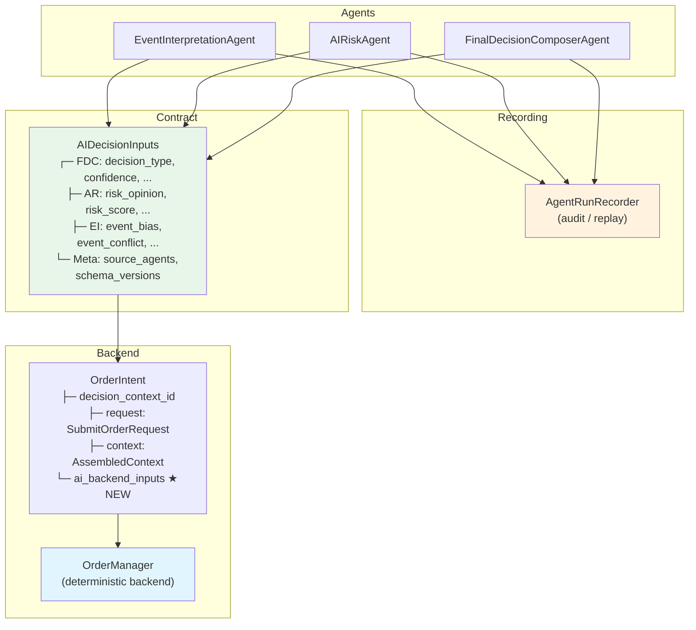

# Priority A: AI Decision Backend Contract — AIDecisionInputs

## Revision History

| Rev | Status | Description |
|-----|--------|-------------|
| 1 | **REJECTED** | Raw `FinalDecisionComposerOutput` → `OrderIntent` coupling. 거부 사유: FDC 단일 agent에만 의존, 정규화된 backend contract 부재, `reason_codes` 의미 혼동, `SubmitOrderRequest` 우회 경로 우려 |
| 2 | **IMPLEMENTED** | `AIDecisionInputs` 정규화된 backend contract dataclass 채택. EI/AR/FDC 3개 agent 출력을 집계하여 `OrderIntent.ai_backend_inputs`로 전달. 모든 테스트 통과 (406/406) |
| 3 | **PENDING** | `size_adjustment_factor` 기본값 보정 (`1.0` → `0.0`), `schema_versions` immutable 구조 변경 (`dict` → `tuple[tuple[str, str], ...]`), 테스트 보강 |

---

## 1. 문제 정의

3개 v1 Provider AI Agent (EI, AR, FDC)의 출력이 `AgentRunRecorder`에만 기록되고, deterministic backend (`OrderIntent` → `OrderManager`)에는 전혀 전달되지 않는다.

**현재 흐름**:
```
EI → recorder
AR → recorder
FDC → recorder
                     ← AI 출력이 이 경로로 전달되지 않음
OrderIntent → OrderManager → BrokerAdapter
```

**목표 흐름**:
```
EI ─→ recorder
AR ─→ recorder
FDC ─→ recorder
       │
       └──→ AIDecisionInputs (정규화된 backend 계약)
                 │
                 ▼
            OrderIntent.ai_backend_inputs
                 │
                 ▼
            OrderManager (deterministic backend)
```

---

## 2. 설계 원칙

1. **AI는 판단 계층** — 결정론적 계산/실행은 Backend 책임
2. **Hard guardrail, threshold, scoring, 최종 sizing 계산** — Backend가 주도
3. **`SubmitOrderRequest` 변경 금지** — AI가 broker submit payload를 직접 수정 불가
4. **`OrderManager`, `BrokerAdapter`, `ReconciliationService` 경계 변경 금지**
5. **Recorder/audit/replay 경로 약화 금지** — 기존 저장 로직 유지
6. **항상 deterministic한 기본 contract 반환** — fallback 시에도 `AIDecisionInputs`는 존재
7. **`reason_codes` 이중 관리** — `ScoreResult.reason_codes` (결정론적 점수 기반)와 `AIDecisionInputs.reason_codes` (FDC agent 판단 기반)는 별도로 유지, 병합 금지
8. **모든 필드는 불변** — frozen dataclass + `tuple` 사용으로 사후 mutation 차단

---

## 3. 변경 파일 목록

| 파일 | 변경 유형 | 설명 |
|------|-----------|------|
| `src/agent_trading/services/decision_orchestrator.py` | 수정 | `AIDecisionInputs` dataclass 추가, `_run_agents()` return type 변경, `OrderIntent` 필드 추가, `assemble()` 전달 |
| `tests/services/test_decision_orchestrator.py` | 수정 | `OrderIntent.ai_backend_inputs` 필드 검증 테스트 추가 (기본값, 불변성, 직접 생성) |
| `tests/services/ai_agents/test_orchestrator_agents.py` | 수정 | real agent 통합 테스트에 `ai_backend_inputs` 검증 추가, tuple 조회 방식 변경 |

**미변경 파일**: `SubmitOrderRequest`, `OrderManager`, `BrokerAdapter`, `ReconciliationService`, `schemas.py`, 모든 agent 구현체 (`event_interpretation.py`, `ai_risk.py`, `final_decision_composer.py`), `bootstrap.py`, repository 계층

---

## 4. 상세 변경 사항

### 4.1 `AIDecisionInputs` dataclass 추가

**파일**: [`src/agent_trading/services/decision_orchestrator.py`](src/agent_trading/services/decision_orchestrator.py:58) (`ScoreResult` 다음, `AssembledContext` 이전)

```python
@dataclass(slots=True, frozen=True)
class AIDecisionInputs:
    """Normalised backend contract carrying AI agent outputs.

    This is the **only** channel through which v1 Provider AI Agent outputs
    reach the deterministic backend (``OrderIntent`` → ``OrderManager``).
    It aggregates normalised fields from all three agents (EI, AR, FDC).

    Design rules
    ------------
    1. Raw agent outputs are **not** carried — only normalised fields.
    2. Every field has a deterministic default — safe fallback guaranteed.
    3. This contract does **not** modify ``SubmitOrderRequest``.
    4. ``OrderManager``, ``BrokerAdapter``, ``ReconciliationService``
       boundaries are unchanged.
    """

    # ── FDC-derived ──────────────────────────────────────────────────
    decision_type: str = "HOLD"
    confidence: float = 0.0
    conviction: float = 0.0
    reason_codes: tuple[str, ...] = ()
    opposing_evidence: tuple[str, ...] = ()
    execution_preferences: ExecutionPreferences = field(
        default_factory=ExecutionPreferences
    )
    sizing_hint: SizingHint = field(default_factory=SizingHint)

    # ── AR-derived ───────────────────────────────────────────────────
    risk_opinion: str = "allow"
    risk_score: float = 0.0
    risk_confidence: float = 0.0
    size_adjustment_factor: float = 0.0  # 0.0 = no reduction (AIRiskOutput 기본값과 일관)
    risk_reason_codes: tuple[str, ...] = ()
    risk_flags: tuple[str, ...] = ()

    # ── EI-derived ───────────────────────────────────────────────────
    event_bias: str = "neutral"
    event_conflict: bool = False
    event_reason_codes: tuple[str, ...] = ()

    # ── Metadata ─────────────────────────────────────────────────────
    source_agent_names: tuple[str, ...] = ()
    schema_versions: tuple[tuple[str, str], ...] = ()  # deeply immutable
```

**import 추가 필요**:
```python
from agent_trading.services.ai_agents.schemas import (
    ExecutionPreferences,
    SizingHint,
)
```

`ExecutionPreferences`와 `SizingHint`는 [`schemas.py`](src/agent_trading/services/ai_agents/schemas.py:306)에 이미 정의되어 있음.

### 4.2 `OrderIntent`에 `ai_backend_inputs` 필드 추가

**파일**: [`src/agent_trading/services/decision_orchestrator.py`](src/agent_trading/services/decision_orchestrator.py:158)

```python
@dataclass(slots=True, frozen=True)
class OrderIntent:
    decision_context_id: UUID | None
    order_intent_id: UUID | None
    request: SubmitOrderRequest
    context: AssembledContext
    config_version_id: UUID | None
    reason_codes: tuple[str, ...] = ()
    # --- NEW: Normalised AI backend contract (Priority A coupling) ---
    ai_backend_inputs: AIDecisionInputs = field(default_factory=AIDecisionInputs)
```

### 4.3 `_run_agents()` return type 변경 — `AIDecisionInputs` 반환

**파일**: [`src/agent_trading/services/decision_orchestrator.py`](src/agent_trading/services/decision_orchestrator.py:432)

**변경 전**:
```python
async def _run_agents(
    self,
    *,
    assembled_context: AssembledContext,
    decision_context_id: UUID | None,
    correlation_id: str,
) -> None:
```

**변경 후**:
```python
async def _run_agents(
    self,
    *,
    assembled_context: AssembledContext,
    decision_context_id: UUID | None,
    correlation_id: str,
) -> AIDecisionInputs:
```

#### 4.3.1 함수 마지막에 `AIDecisionInputs` 조립 및 return

기존 코드 유지 + 마지막에 추가:

```python
        # ... (기존 EI/AR/FDC 실행 및 recorder 저장 코드 유지) ...

        # --- Assemble AIDecisionInputs from all three agent outputs ---
        ai_inputs = AIDecisionInputs(
            # FDC-derived
            decision_type=composer_output.decision_type,
            confidence=composer_output.confidence,
            conviction=composer_output.conviction,
            reason_codes=composer_output.reason_codes,
            opposing_evidence=composer_output.opposing_evidence,
            execution_preferences=composer_output.execution_preferences,
            sizing_hint=composer_output.sizing_hint,
            # AR-derived
            risk_opinion=risk_output.risk_opinion,
            risk_score=risk_output.risk_score,
            risk_confidence=risk_output.confidence,
            size_adjustment_factor=risk_output.size_adjustment_factor,
            risk_reason_codes=risk_output.reason_codes,
            risk_flags=risk_output.risk_flags,
            # EI-derived
            event_bias=event_output.aggregate_view.overall_bias,
            event_conflict=event_output.aggregate_view.event_conflict,
            event_reason_codes=event_output.aggregate_view.top_reason_codes,
            # Metadata
            source_agent_names=(
                event_output.agent_name,
                risk_output.agent_name,
                composer_output.agent_name,
            ),
            schema_versions=(
                ("event_interpretation", event_output.schema_version),
                ("ai_risk", risk_output.schema_version),
                ("final_decision_composer", composer_output.schema_version),
            ),
        )

        logger.info(
            "AI agents executed: decision_context_id=%s "
            "event=%s risk=%s composer=%s",
            decision_context_id,
            event_output.agent_name,
            risk_output.risk_opinion,
            composer_output.decision_type,
        )
        return ai_inputs
```

### 4.4 `assemble()`에서 `_run_agents()` 반환값 처리

**파일**: [`src/agent_trading/services/decision_orchestrator.py`](src/agent_trading/services/decision_orchestrator.py:262)

**변경 전**:
```python
        # --- Run AI agents (stub — no actual Provider calls) ---
        await self._run_agents(
            assembled_context=assembled_context,
            decision_context_id=resolved_context_id,
            correlation_id=correlation_id,
        )
```

**변경 후**:
```python
        # --- Run AI agents → AIDecisionInputs ---
        ai_inputs = await self._run_agents(
            assembled_context=assembled_context,
            decision_context_id=resolved_context_id,
            correlation_id=correlation_id,
        )
```

**OrderIntent 생성 부분**:
```python
        return OrderIntent(
            decision_context_id=resolved_context_id,
            order_intent_id=resolved_intent_id,
            request=assembled_request,
            context=assembled_context,
            config_version_id=config_version_id,
            reason_codes=score_result.reason_codes,
            # --- NEW: Normalised AI backend contract ---
            ai_backend_inputs=ai_inputs,
        )
```

---

## 5. 변경하지 않는 것 (Scope Boundaries)

| 항목 | 미변경 이유 |
|------|------------|
| `SubmitOrderRequest` | AI가 직접 주문 필드를 수정하는 구조 방지 — **최우선 보호** |
| `OrderManager` | 인터페이스/경계 변경 없음 |
| `BrokerAdapter` | 인터페이스/경계 변경 없음 |
| `ReconciliationService` | 인터페이스/경계 변경 없음 |
| `ScoreCalculator` / `StubScoreCalculator` | 결정론적 스코어링은 Backend 책임 유지 |
| Agent 구현체 (`event_interpretation.py`, `ai_risk.py`, `final_decision_composer.py`) | 변경 없음 |
| `schemas.py`의 출력 dataclass | 변경 없음 |
| `AgentRunRecorder` | 기존 저장 로직 유지 — recorder 경로 약화 금지 |
| Bootstrap wiring (`bootstrap.py`) | 변경 불필요 |
| Repository 계층 | 변경 불필요 |
| `TradeDecisionEntity` 영속화 | 후속 작업으로 분리 |

---

## 6. Safe Fallback 정책

각 agent 실패 시 `AIDecisionInputs`의 해당 필드가 갖는 기본값.

| Agent 실패 | 영향 필드 | Fallback 값 |
|------------|-----------|-------------|
| EI 실패 | `event_bias` | `"neutral"` |
| EI 실패 | `event_conflict` | `False` |
| EI 실패 | `event_reason_codes` | `()` |
| AR 실패 | `risk_opinion` | `"allow"` |
| AR 실패 | `risk_score` | `0.0` |
| AR 실패 | `risk_confidence` | `0.0` |
| AR 실패 | `size_adjustment_factor` | `0.0` (no reduction — `AIRiskOutput` 기본값과 일관) |
| AR 실패 | `risk_reason_codes` | `()` |
| AR 실패 | `risk_flags` | `()` |
| FDC 실패 | `decision_type` | `"HOLD"` |
| FDC 실패 | `confidence` / `conviction` | `0.0` |
| 모든 agent 실패 | `source_agent_names` | `()` |
| 모든 agent 실패 | `schema_versions` | `()` |

**`AIDecisionInputs` 자체는 항상 존재** — fallback 시에도 기본 생성자로 생성됨.
`OrderIntent.ai_backend_inputs`는 `field(default_factory=AIDecisionInputs)`이므로 절대 `None`이 아님.

### 6.1 설계 판단 근거

**`size_adjustment_factor=0.0` 기본값**:
- `AIRiskOutput.size_adjustment_factor` 기본값이 `0.0` (no reduction)이므로 일관성 유지
- `AIDecisionInputs()` 직접 생성 시와 fallback 경로가 동일한 의미를 가져야 함
- `0.0` = "크기 조정 없음", `1.0` = "100% reduction" (의미 혼란 방지)

**`schema_versions: tuple[tuple[str, str], ...]`**:
- `@dataclass(frozen=True)`는 **shallow freeze** — `dict` 필드의 내부 값은 변경 가능
- `ai.schema_versions["new_key"] = "v2"` 가 가능 → audit trail 오염
- `tuple[tuple[str, str], ...]`은 **deeply immutable** — 사후 mutation이 언어 차원에서 차단
- audit/replay 경로에서 불변성은 의도치 않은 데이터 변질 방지

---

## 7. 테스트 전략

### 7.1 신규/수정 테스트

#### `test_decision_orchestrator.py` — `TestOrderIntentExtensions` 클래스

| 테스트명 | 설명 |
|----------|------|
| `test_intent_contains_ai_backend_inputs` | `OrderIntent`에 `ai_backend_inputs` 필드가 존재하고 기본값이 `AIDecisionInputs()`인지 검증 |
| `test_ai_backend_inputs_defaults_on_stub` | Stub agent 실행 시 `AIDecisionInputs`의 모든 필드가 safe fallback 기본값을 갖는지 검증 (`decision_type="HOLD"`, `risk_opinion="allow"`, `event_bias="neutral"` 등). `schema_versions`가 `tuple` 타입이고 `dict`가 아님을 확인 |
| `test_ai_backend_inputs_different_from_reason_codes` | `ScoreResult.reason_codes`와 `AIDecisionInputs.reason_codes`가 별도로 유지됨을 검증 (병합 금지) |
| `test_ai_backend_inputs_direct_defaults` | `AIDecisionInputs()` 직접 생성 시 `size_adjustment_factor == 0.0`, `schema_versions == ()`, 타입이 tuple인지 확인 |
| `test_ai_backend_inputs_schema_versions_immutable` | tuple 구조 검증: `AIDecisionInputs(schema_versions=(("a", "b"),))` 생성 및 불변성 확인 |

#### `test_orchestrator_agents.py` — `TestExistingBehaviourPreserved` 클래스

| 테스트명 | 설명 |
|----------|------|
| `test_intent_contains_ai_backend_inputs` | `assemble()` 호출 후 `OrderIntent.ai_backend_inputs`가 `AIDecisionInputs` 인스턴스인지 검증 |

#### `test_orchestrator_agents.py` — `TestRealAgentsIntegration` 클래스

| 테스트명 | 설명 |
|----------|------|
| `test_real_ei_real_ar_real_fdc_ai_backend_inputs` | Real EI + real AR + real FDC 사용 시 `AIDecisionInputs`가 의도대로 채워지는지 검증. `dict(ai.schema_versions)` 변환 후 조회 |

#### `test_orchestrator_agents.py` — `TestAgentSafeFallback` 클래스

| 테스트명 | 설명 |
|----------|------|
| `test_all_agents_fail_ai_backend_inputs_defaults` | 모든 agent 실패 시 `AIDecisionInputs`가 deterministic한 기본값을 갖는지 검증. `dict(ai.schema_versions)` 변환 후 조회 |

### 7.2 기존 테스트 영향도

| 테스트 | 영향 | 이유 |
|--------|------|------|
| `test_assemble_returns_order_intent` | 없음 | `OrderIntent` 반환 유지 |
| `test_assemble_preserves_request_fields` | 없음 | `SubmitOrderRequest` 변경 없음 |
| `test_default_agents_used_when_none_injected` | 없음 | stub agent 기본 동작 유지 |
| `test_agents_called_in_correct_order` | 없음 | 호출 순서 변경 없음 |
| `test_agent_failure_returns_default_output` | 없음 | recorder 동작 유지 |
| `test_recorder_accessible_after_assemble` | 없음 | recorder 저장 로직 유지 |
| 모든 `TestSchemaAlignment` 테스트 | 없음 | recorder 저장 로직 유지 |

**기존 테스트 100% 통과 보장** (회귀 없음) — 검증 완료 (406/406 통과)

---

## 8. Mermaid: 변경 후 데이터 흐름



---

## 9. 실행 순서

1. [`decision_orchestrator.py`](src/agent_trading/services/decision_orchestrator.py): Import `ExecutionPreferences`, `SizingHint` 추가
2. [`decision_orchestrator.py`](src/agent_trading/services/decision_orchestrator.py): `AIDecisionInputs` dataclass 추가
3. [`decision_orchestrator.py`](src/agent_trading/services/decision_orchestrator.py): `OrderIntent`에 `ai_backend_inputs` 필드 추가
4. [`decision_orchestrator.py`](src/agent_trading/services/decision_orchestrator.py): `_run_agents()` return type 변경 + `AIDecisionInputs` 조립 + return
5. [`decision_orchestrator.py`](src/agent_trading/services/decision_orchestrator.py): `assemble()`에서 return 값 capture → `OrderIntent` 전달
6. [`decision_orchestrator.py`](src/agent_trading/services/decision_orchestrator.py): Rev 3 — `size_adjustment_factor` 기본값 `0.0`으로 변경, `schema_versions` 타입 `tuple[tuple[str, str], ...]`으로 변경
7. [`test_decision_orchestrator.py`](tests/services/test_decision_orchestrator.py): 기본 필드 존재 + 기본값 + 직접 생성 + 불변성 검증 테스트
8. [`test_orchestrator_agents.py`](tests/services/ai_agents/test_orchestrator_agents.py): stub + real agent + safe fallback 테스트, tuple 조회 방식 변경
9. 전체 테스트 실행 및 통과 확인
10. Lint 실행 및 통과 확인

---

## 10. 완료 기준 (Completion Criteria)

- [x] `AIDecisionInputs` dataclass가 `decision_orchestrator.py`에 추가됨
- [x] `OrderIntent.ai_backend_inputs: AIDecisionInputs` 필드가 추가됨
- [x] `_run_agents()`가 `AIDecisionInputs`를 반환함
- [x] `assemble()`이 `AIDecisionInputs`를 `OrderIntent`에 전달함
- [x] 모든 stub/fallback 경로에서 `AIDecisionInputs`가 deterministic한 기본값을 가짐
- [x] `SubmitOrderRequest` 수정 없음
- [x] `OrderManager`/`BrokerAdapter`/`ReconciliationService` 경계 변경 없음
- [x] Recorder 저장 로직 유지됨 (기존 audit/replay 경로 약화 없음)
- [x] 신규 테스트 6개 이상 추가 및 통과
- [x] 기존 테스트 100% 통과 (406/406 — 회귀 없음)
- [x] Lint 통과 (`ruff check src/`)
- [ ] Rev 3: `size_adjustment_factor` 기본값 `0.0` 확인
- [ ] Rev 3: `schema_versions` 타입 `tuple[tuple[str, str], ...]` 확인
- [ ] Rev 3: `_run_agents()` assembly가 tuple 구조로 변경됨
- [ ] Rev 3: `test_ai_backend_inputs_direct_defaults` — 직접 생성 시 기본값 검증
- [ ] Rev 3: `test_ai_backend_inputs_schema_versions_immutable` — 불변성 검증

---

## 11. 부록: Rev 1 (REJECTED) — Raw FDC → OrderIntent 접근법

### 11.1 접근법

```python
# REJECTED APPROACH — for reference only
@dataclass(slots=True, frozen=True)
class OrderIntent:
    ...
    final_decision_composer_output: FinalDecisionComposerOutput | None = None
```

`_run_agents()`가 `FinalDecisionComposerOutput`을 직접 반환하고, `OrderIntent`가 raw FDC output을 그대로 보관하는 방식.

### 11.2 거부 사유

1. **FDC 단일 agent에만 의존** — EI, AR 출력이 backend에 전달되지 않음
2. **정규화 부재** — downstream consumer가 `FinalDecisionComposerOutput`의 내부 구조에 직접 의존
3. **`reason_codes` 의미 혼동** — `ScoreResult.reason_codes` (deterministic)와 raw FDC 출력의 `reason_codes` 구분 불명확
4. **`SubmitOrderRequest` 우회 위험** — `FinalDecisionComposerOutput`이 raw 형태로 전달되면, backend가 이를 무분별하게 `SubmitOrderRequest`에 반영할 가능성
5. **frozen 일관성** — `FinalDecisionComposerOutput`의 inner dataclass가 `None` 허용 vs `slots=True` 충돌 가능

---

## 12. 후속 작업 (이번 범위 밖)

1. **Hard Guardrail이 `AIDecisionInputs` 소비** — guardrail engine이 AI 결정 평가
2. **`AIDecisionInputs` 기반 TradeDecisionEntity 영속화** — DB 저장 경로 추가
3. **실시간 Provider Smoke Test 확장** — AR/FDC agent에 대한 runtime smoke test (현재 EI만 존재)
