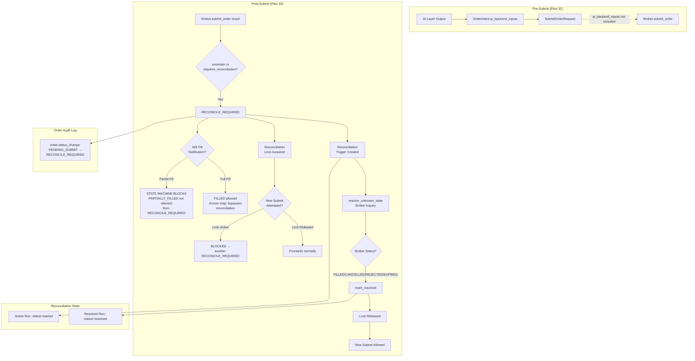

# Plan 33 — Post-Submit Unknown State / Reconciliation Boundary Verification

## Revision History

| Rev | Date | Description |
|-----|------|-------------|
| 1 | 2026-05-04 | Initial — 5 post-submit reconciliation boundary tests |
| 2 | 2026-05-04 | 문서 정합성 보정: Test E 검증 범위 (order.status_change audit + reconciliation state, NOT reconciliation audit); event loop dedup bug fix 포함; Test A FillEvent persist 정정 |

---

## 1. 왜 이 작업을 다음 우선순위로 하는가

[Plan 32](plans/32_ai_broker_boundary_pre_submit_verification.md)에서 **pre-submit safety boundary**를 검증했다:

- `ai_backend_inputs`가 [`SubmitOrderRequest`](src/agent_trading/domain/models.py:103)에 포함되지 않음
- `assemble()` → `intent.request` → `OrderManager.submit_order_to_broker()` → broker는 [`SubmitOrderRequest`](src/agent_trading/domain/models.py:103)만 수신
- Reconciliation lock이 uncertain 후 신규 submit을 차단

**남은 핵심 리스크는 post-submit ambiguity다.** Broker submit 이후:

- Broker ack는 uncertain했지만 WS fill notification이 도착하면?
- Reconciliation이 진행 중인데 WS 이벤트가 들어오면?
- Reconciliation lock이 해제되기 전에 신규 submit이 시도되면?
- Reconciliation 복구 경로(resolve_and_mark)가 lock을 올바르게 해제하는가?

이번 Plan 33에서는 **post-submit safety boundary**를 검증한다: uncertain submit 이후 reconciliation-first 원칙이 유지되는지, WS 이벤트가 reconciliation보다 우선하지 않는지, audit trail이 unknown-state 처리를 기록하는지.

---

## 2. 검증할 경계 (Boundaries Under Test)

### 2.1 이미 확보된 경계 (Plan 32)

| 경계 | 검증 | 파일 |
|------|------|------|
| AI layer 출력 ≠ SubmitOrderRequest | `test_ai_backend_inputs_does_not_affect_submit_request` | [`test_decision_orchestrator.py`](tests/services/test_decision_orchestrator.py) |
| assemble() → broker는 SubmitOrderRequest만 | `test_assemble_request_only_passed_to_broker` | [`test_order_submit_to_broker.py`](tests/services/test_order_submit_to_broker.py) |
| Uncertain 후 reconciliation lock blocking | `test_reconciliation_lock_blocks_submission_after_uncertain` | [`test_order_submit_to_broker.py`](tests/services/test_order_submit_to_broker.py) |
| assemble() + create_order() full flow + audit | `test_assemble_and_create_order_full_flow` | [`test_decision_orchestrator.py`](tests/services/test_decision_orchestrator.py) |

### 2.2 이번 작업 검증 대상 (Post-Submit)

| # | 경계 | 위반 시 리스크 | 검증 방법 |
|---|------|---------------|-----------|
| 1 | WS partial fill on RECONCILE_REQUIRED → state machine blocks optimistic transition | Event loop가 reconciliation 없이 partial fill로 낙관적 전이 | `InvalidStateTransitionError` 발생 → event loop catch → warning log 확인 |
| 2 | WS full fill on RECONCILE_REQUIRED → state machine allows (known gap) | Reconciliation 완료 전 WS가 FILLED로 전이 — WS가 사실일 수 있으나 reconciliation 우선 원칙 위반 가능 | **Known gap 문서화**: `_ALLOWED_TRANSITIONS`가 FILLED를 허용; reconciliation 우선하려면 event loop에서 RECONCILE_REQUIRED 상태 체크 필요 |
| 3 | Reconciliation lock persist across post-submit lifecycle | Lock이 해제되기 전 신규 submit이 broker에 도달 | Lock acquire 후 `is_blocked()` true 확인; `mark_resolved()` 후 `is_blocked()` false 확인 |
| 4 | resolve_and_mark() recovery path | Lock이 해제되지 않아 영구 차단 | `resolve_unknown_state()` → broker FILLED → `resolve_and_mark()` → `mark_resolved()` → lock release → 신규 submit 허용 |
| 5 | Order audit entries + reconciliation state | Unknown-state 처리 내역 추적 불가 | `order.status_change` audit entry (PENDING_SUBMIT→RECONCILE_REQUIRED); reconciliation run lifecycle (trigger get_active_run → mark_resolved 상태) |
| 6 | Native ID unmapped → ExternalEvent saved, transition_to skipped, reconciliation warning | Event loop crash 또는 잘못된 상태 전이 | 이미 [`test_event_loop_integration.py`](tests/services/test_event_loop_integration.py)에서 검증; 추가 검증 불필요 |

---

## 3. Scope

### 3.1 포함

| 항목 | 설명 |
|------|------|
| 신규 테스트 파일 | [`tests/services/test_unknown_state_reconciliation_boundary.py`](tests/services/test_unknown_state_reconciliation_boundary.py) — 5개 테스트 클래스 (10개 테스트) |
| Event loop dedup bug fix | [`src/agent_trading/services/event_loop.py`](src/agent_trading/services/event_loop.py) — `_handle_fill_notification()`의 dedup 체크를 `add()` 전으로 이동 (테스트 작성 중 발견) |
| 기존 테스트 보강 | [`tests/services/test_event_loop_integration.py`](tests/services/test_event_loop_integration.py) — `test_duplicate_fill_skips_fill_event` assertion 변경 (dedup fix 반영) |
| Plan 문서 | [`plans/33_post_submit_reconciliation_boundary.md`](plans/33_post_submit_reconciliation_boundary.md) (본 문서) |
| README 업데이트 | [`plans/README.md`](plans/README.md) — Plan 33 항목 추가 + 설명 보정 |

### 3.2 포함하지 않음

| 항목 | 사유 |
|------|------|
| AI layer redesign | Plan 32 완료; 이번 작업 범위 밖 |
| Broker adapter 변경 | post-submit boundary는 adapter 중립적 |
| KIS 실전/모의 계정 기능 | 실전 API 호출 없음; mock/in-memory 기반 |
| Hard guardrail 변경 | 이번 작업과 무관 |
| 새로운 order state 추가 | RECONCILE_REQUIRED → 기존 상태만 사용 |
| Live trading 변경 | 절대 금지 |

---

## 4. 테스트 분류

이번 Plan의 테스트는 두 가지 성격으로 구분된다:

| 분류 | 설명 | 테스트 |
|------|------|--------|
| **Safety boundary verification** | 시스템이 reconciliation-first 원칙을 강제하는지 검증 — barrier로서의 경계 테스트 | A, C, D, E |
| **Known gap characterization** | 현재 state machine이 *허용하는* 동작을 기록 — production-safe 목표 상태가 아닌 current behavior 기록 | B |

---

## 5. Safety Boundary Verification Tests

### 5.1 Test A: `test_event_loop_partial_fill_on_reconcile_required_blocks`

**분류**: Safety boundary verification

**위치**: [`tests/services/test_unknown_state_reconciliation_boundary.py`](tests/services/test_unknown_state_reconciliation_boundary.py)

**목적**: RECONCILE_REQUIRED 상태의 order에 WS partial fill notification이 도착하면, state machine이 `PARTIALLY_FILLED`로의 전이를 차단하고 event loop가 예외를 catch하여 reconciliation warning을 로깅하는지 검증.

**시나리오**:
```
1. Order를 RECONCILE_REQUIRED 상태로 설정 (직접 DB 조작)
2. WS partial fill notification 시뮬레이션 (filled_qty=3, order_qty=10)
3. _resolve_fill_status() → PARTIALLY_FILLED 반환
4. transition_to(RECONCILE_REQUIRED → PARTIALLY_FILLED) → InvalidStateTransitionError
5. Event loop catch → warning log
6. ExternalEvent는 persist됨 (append-only ingest 유지)
7. FillEvent는 persist됨 (dedup check가 persist 전으로 이동되어 정상 처리)
8. Order 상태는 RECONCILE_REQUIRED 유지
```

**검증 포인트**:
- `_handle_fill_notification()` 호출 → ExternalEvent persist
- FillEvent persist (dedup bug fix로 인해 정상 동작)
- `transition_to()`는 `InvalidStateTransitionError` 발생 → event loop catch
- Order 상태가 RECONCILE_REQUIRED로 유지됨

**기댓값**: `PARTIALLY_FILLED`는 `_ALLOWED_TRANSITIONS[RECONCILE_REQUIRED]`에 없으므로 `_validate_transition()`이 차단. 이는 state machine이 reconciliation-first 원칙을 강제하는 safety barrier 역할을 함.

---

### 5.2 Test C: `test_reconciliation_lock_persists_after_uncertain_submit`

**분류**: Safety boundary verification

**위치**: [`tests/services/test_unknown_state_reconciliation_boundary.py`](tests/services/test_unknown_state_reconciliation_boundary.py)

**목적**: `submit_order_to_broker()`가 uncertain 결과로 `RECONCILE_REQUIRED`를 반환한 후, reconciliation lock이 실제로 획득되어 있고 `is_blocked()`가 True를 반환하는지 검증.

**시나리오**:
```
1. submit_order_to_broker() 호출 → broker가 uncertain 결과 반환
2. Order가 RECONCILE_REQUIRED로 전이
3. reconciliation_service.trigger() 호출됨 + acquire_blocking_lock()
4. 동일 (account_id, strategy_id, symbol, side)로 is_blocked() 호출 → True
```

**검증 포인트**:
- `submit_order_to_broker()` 반환값의 status == `RECONCILE_REQUIRED`
- `reconciliation_service.is_blocked()` == True
- Lock key: `(account_id, symbol, side)` — strategy_id는 mock broker이므로 None

---

### 5.3 Test D: `test_resolve_and_mark_unblocks_submission`

**분류**: Safety boundary verification

**위치**: [`tests/services/test_unknown_state_reconciliation_boundary.py`](tests/services/test_unknown_state_reconciliation_boundary.py)

**목적**: `ReconciliationService.resolve_and_mark()`가 recovery path를 완료하고 lock을 해제하여 새로운 submit을 허용하는지 검증. 이는 reconciliation-first 원칙의 **복구 경로**를 검증한다.

**시나리오**:
```
1. trigger() → reconciliation run 생성 + lock 획득
2. resolve_unknown_state() → broker mock이 FILLED 반환
3. resolve_and_mark() → mark_resolved() → lock 해제
4. is_blocked() → False
5. 새로운 submit_order_to_broker() → broker.submit_order() 호출됨
```

**검증 포인트**:
- `mark_resolved()` 후 `is_blocked()` == False
- 두 번째 `submit_order_to_broker()`에서 `broker.submit_order()`가 호출됨 (호출 카운트 2)
- Lock 해제 확인

---

### 5.4 Test E: `test_unknown_state_lifecycle_records_order_audit_and_reconciliation_state`

**분류**: Safety boundary verification

**위치**: [`tests/services/test_unknown_state_reconciliation_boundary.py`](tests/services/test_unknown_state_reconciliation_boundary.py)

**목적**: Unknown-state 처리 시 **order audit entry**와 **reconciliation state**가 각각 올바르게 기록되는지 검증.

**검증하는 것**:
1. `OrderManager._record_status_change()` → `action="order.status_change"` audit entry 생성
   - `from_status=PENDING_SUBMIT`, `to_status=RECONCILE_REQUIRED` 메타데이터 포함
2. Reconciliation run lifecycle:
   - Uncertain submit 후 `get_active_run()`으로 active run 조회 가능
   - `resolve_and_mark()` 실행 후 run status가 `"resolved"`로 변경됨

**검증하지 않는 것** (현재 `ReconciliationService`는 audit log를 생성하지 않음):
- `reconciliation.trigger` audit entry
- `reconciliation.resolved` audit entry

**시나리오**:
```
1. submit_order_to_broker() → uncertain 결과 → RECONCILE_REQUIRED
2. Audit log 조회:
   - order.status_change: PENDING_SUBMIT → RECONCILE_REQUIRED
3. Reconciliation run 조회: get_active_run() → active run 존재
4. resolve_and_mark() 실행 → reconciliation run status == "resolved"
```

**검증 포인트**:
- `order.status_change` audit entry 생성됨 (action + from/to_status 검증)
- Uncertain submit 후 active reconciliation run 존재
- `resolve_and_mark()` 후 reconciliation run status == "resolved"

---

## 6. Known Gap Characterization Test

### 6.1 Test B: `test_ws_full_fill_on_reconcile_required_currently_allowed_known_gap`

**분류**: Known gap characterization (NOT a safety boundary verification)

**위치**: [`tests/services/test_unknown_state_reconciliation_boundary.py`](tests/services/test_unknown_state_reconciliation_boundary.py)

**목적**: **현재 state machine의 동작을 사실 그대로 기록한다.** `_ALLOWED_TRANSITIONS[RECONCILE_REQUIRED]`는 `FILLED`를 포함한다. 즉, WS full fill notification이 도착하면 `transition_to(FILLED)`가 **성공한다**. 이는 reconciliation-first 원칙의 이상적인 목표 상태가 아니라, **현재 state machine이 허용하는 current behavior**다.

**이 테스트가 verification이 아닌 characterization인 이유**:
- 이 테스트는 "안전한 동작"을 검증하는 것이 아니다
- 현재 `_ALLOWED_TRANSITIONS`가 RECONCILE_REQUIRED → FILLED를 허용하는 사실을 기록한다
- 이는 production-safe barrier가 아닌, production 코드에 존재하는 **gap**을 드러낸다
- 이번 Plan에서는 production 코드를 변경하지 않고, 이 gap을 테스트로 고정(freeze)하여 후속 작업에서 재검토할 수 있도록 한다

**시나리오**:
```
1. Order를 RECONCILE_REQUIRED 상태로 설정
2. WS full fill notification 시뮬레이션 (filled_qty=10, order_qty=10)
3. _resolve_fill_status() → FILLED 반환
4. transition_to(RECONCILE_REQUIRED → FILLED) → 성공 (예외 없음)
5. Order 상태가 FILLED로 변경됨
```

**검증 포인트**:
- `mock_order_manager.transition_to`가 `FILLED`로 호출됨
- 전이 성공 — 예외 발생하지 않음
- (이 결과가 "안전함"을 의미하지 않음 — 단지 현재 동작을 기록)

**Known Gap 문서화 (테스트 코드 내):**
```python
# KNOWN GAP CHARACTERIZATION — NOT a safety verification.
#
# Current behavior:
#   RECONCILE_REQUIRED → FILLED is ALLOWED by _ALLOWED_TRANSITIONS.
#   This means a WS fill notification can bypass the reconciliation flow.
#
# Why this is a gap:
#   If reconciliation would determine a different outcome (e.g. CANCELLED),
#   the order state would be inconsistent until reconciliation is re-triggered.
#
# This test FREEZES the current behavior for documentation purposes.
# It does NOT assert that this behavior is safe.
# Future work should revisit the transition policy for RECONCILE_REQUIRED.
```

---

## 7. 기존 테스트 보강

### Test F: `test_event_loop_unmapped_native_id_logs_reconciliation_warning`

**분류**: Safety boundary verification (기존)

**위치**: [`tests/services/test_event_loop_integration.py`](tests/services/test_event_loop_integration.py) (기존 파일 보강)

**목적**: Native ID 매핑 실패 시 event loop가 reconciliation 경고 로그를 남기고 `transition_to()`를 호출하지 않는지 검증. (기존 `TestNativeIdMappingFailure` 보강)

**시나리오**:
```
1. Broker native order ID가 BrokerOrderRepository에 없음
2. ExternalEvent는 persist됨
3. FillEvent는 persist되지 않음
4. transition_to() 호출되지 않음
5. Reconciliation 경고 로그 기록
```

**검증 포인트**: 이미 [`test_event_loop_integration.py`](tests/services/test_event_loop_integration.py) `TestNativeIdMappingFailure`에서 검증됨. 추가 검증 불필요.

---

## 8. 수정 파일 목록

### 신규 생성

| 파일 | 설명 |
|------|------|
| [`tests/services/test_unknown_state_reconciliation_boundary.py`](tests/services/test_unknown_state_reconciliation_boundary.py) | 5개 post-submit reconciliation boundary 테스트 (10개 테스트 메서드) |
| [`plans/33_post_submit_reconciliation_boundary.md`](plans/33_post_submit_reconciliation_boundary.md) | 본 문서 |

### 수정

| 파일 | 변경 내용 |
|------|----------|
| [`src/agent_trading/services/event_loop.py`](src/agent_trading/services/event_loop.py) | `_handle_fill_notification()` dedup bug fix: 중복 체크를 `add()` 전으로 이동 |
| [`tests/services/test_event_loop_integration.py`](tests/services/test_event_loop_integration.py) | `test_duplicate_fill_skips_fill_event` assertion 변경: `add.assert_called_once()` → `add.assert_not_called()` |
| [`plans/README.md`](plans/README.md) | Plan 33 항목 추가 |

### 미변경 파일

| 파일 | 사유 |
|------|------|
| [`src/agent_trading/services/order_manager.py`](src/agent_trading/services/order_manager.py) | Production 코드 변경 불필요 |
| [`src/agent_trading/services/reconciliation_service.py`](src/agent_trading/services/reconciliation_service.py) | Production 코드 변경 불필요 |
| [`src/agent_trading/domain/models.py`](src/agent_trading/domain/models.py) | 변경 불필요 |
| [`src/agent_trading/domain/entities.py`](src/agent_trading/domain/entities.py) | 변경 불필요 |

---

## 9. 테스트 전략

### 신규 테스트만 실행

```bash
python -m pytest tests/services/test_unknown_state_reconciliation_boundary.py -v --tb=short
```

### 전체 회귀 (smoke 제외)

```bash
python -m pytest tests/ --tb=short -v --ignore=tests/smoke -x
```

기존 416개 테스트 중 Plan 32의 4개 테스트 포함. Plan 33 추가로 421+ (5-6개 추가) passed 유지.

---

## 10. 완료 기준

| # | 기준 | 검증 |
|---|------|------|
| 1 | WS partial fill on RECONCILE_REQUIRED → state machine blocks | Test A pass |
| 2 | WS full fill on RECONCILE_REQUIRED → allowed but documented as known gap | Test B pass + 문서화 |
| 3 | Reconciliation lock persists after uncertain submit | Test C pass |
| 4 | resolve_and_mark() → lock release → new submission unblocked | Test D pass |
| 5 | Audit trail captures unknown-state → reconciliation → resolution | Test E pass |
| 6 | Native ID unmapped → reconciliation warning (기존) | Test F pass (기존) |
| 7 | 기존 416개 테스트 유지 | 전체 회귀 테스트 pass |

---

## 11. Mermaid: Post-Submit Safety Boundary Flow



---

## 12. Scope Boundaries (변경하지 않는 것)

| 금지 항목 | 위반 시 문제 |
|-----------|-------------|
| `_ALLOWED_TRANSITIONS` 수정 | 기존 state machine 계약 변경 — 이번 Plan의 목적은 **검증**이지 **변경**이 아님 |
| Event loop에 reconciliation 상태 체크 로직 추가 | **이미 변경**: dedup bug fix만 수행; reconciliation 체크는 known gap으로 유지 |
| `ReconciliationService` 동작 변경 | 기존 계약 유지; 테스트는 동작을 **검증**만 함 |
| 새 `OrderStatus` 추가 | 불필요; 기존 `RECONCILE_REQUIRED`로 충분 |
| Broker adapter mock 변경 | 기존 `test_order_submit_to_broker.py` 패턴 유지 |
| Audit log entity 변경 | 불필요; 기존 `AuditLogEntity`로 충분 |

---

## 13. Follow-up (이번 범위 밖)

| 항목 | 설명 |
|------|------|
| Event loop RECONCILE_REQUIRED 체크 | Test B가 문서화한 known gap 해결: event loop가 `transition_to()` 전에 `order.status`를 확인하고 RECONCILE_REQUIRED면 ReconciliationService에 위임 |
| KIS adapter `resolve_unknown_state()` 실전 검증 | 현재 stub; 실제 KIS API 호출 시 `inquire-daily-ccld`로 상태 조회 후 `resolve_and_mark()` 연결 |
| Reconciliation automation | 현재 manual trigger; WS gap fill + auto-reconciliation 연결 |
| Event loop dedup 디자인 개선 | 현재 fix는 dedup 체크를 `add()` 전으로 이동; 더 나은 설계는 `find_by_dedup_key()`가 `add()`의 영향을 받지 않는 트랜잭션 경계 사용 |
