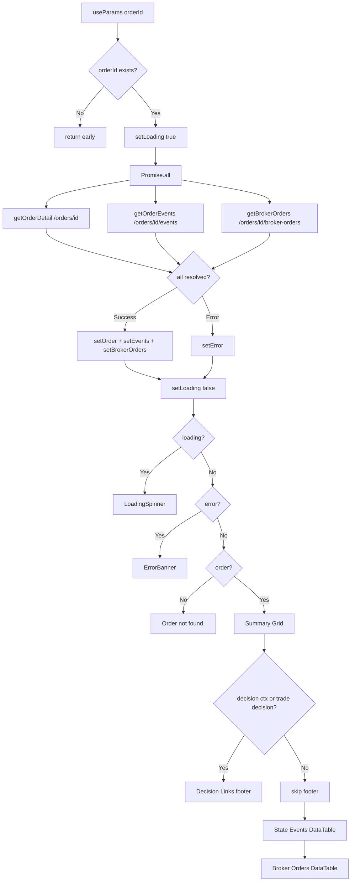
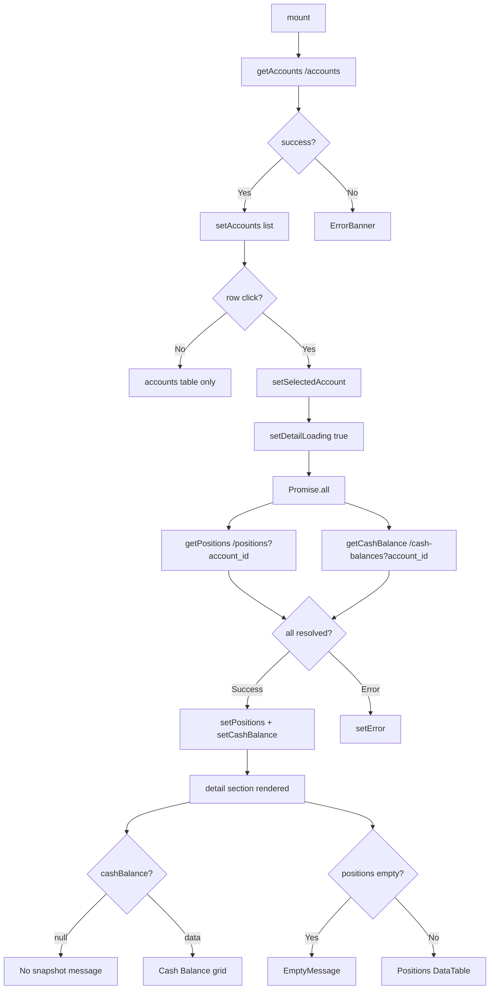
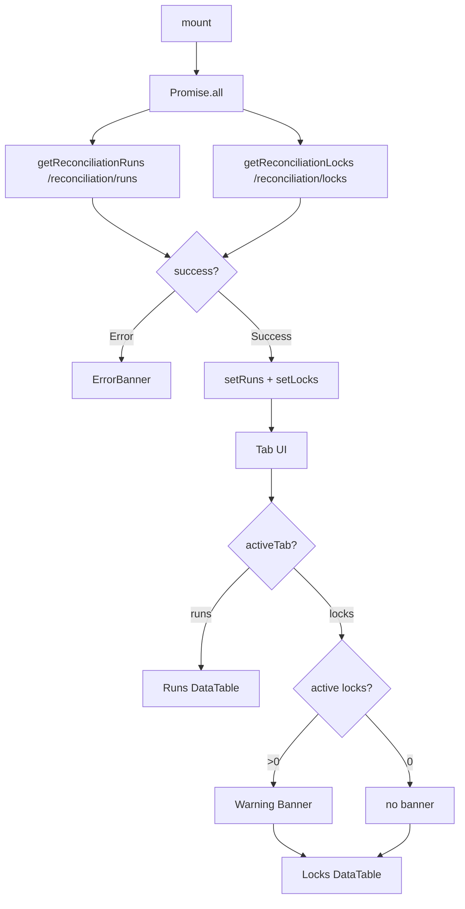

# Plan 50 — Admin UI Test Coverage Phase 2

> **회귀 방지망 확대**: 이미 구현된 Admin UI의 핵심 화면(OrderDetail, AccountsView, ReconciliationView, Layout, DecisionsView)을 자동 테스트로 고정한다. 새로운 기능을 추가하지 않고, 기존 운영 UI의 안정성을 강화하는 것이 목적이다.

---

## Revision History

| 버전 | 날짜 | 변경 내용 |
|------|------|-----------|
| v1.0 | 2026-05-05 | 최초 작성 |

---

## 목차

1. [Why Now](#1-why-now)
2. [현재 상태 분석](#2-현재-상태-분석)
3. [컴포넌트 복잡도 평가](#3-컴포넌트-복잡도-평가)
4. [P0/P1/P2 분류](#4-p0p1p2-분류)
   - [P0 — OrderDetail](#41-p0--orderdetail)
   - [P0 — AccountsView](#42-p0--accountsview)
   - [P0 — ReconciliationView](#43-p0--reconciliationview)
   - [P1 — Layout](#44-p1--layout)
   - [P1 — DecisionsView](#45-p1--decisionsview)
5. [테스트 전략](#5-테스트-전략)
6. [Mock 전략](#6-mock-전략)
7. [변경 파일 목록](#7-변경-파일-목록)
8. [실행 순서](#8-실행-순서)
9. [검증 포인트](#9-검증-포인트)
10. [Risk Assessment](#10-risk-assessment)

---

## 1. Why Now

현재 Admin UI Phase 1이 구현 완료되었고, Plan 49에서 Auth/Dashboard/OrdersView/공통 컴포넌트에 대한 기본 테스트(24개)가 확보되었다.

그러나 아직 다음 화면들은 테스트로 고정되지 않았다:

- **OrderDetail** — 3개 병렬 API, route param 의존성, 조건부 Decision Links. 운영자가 주문 상세를 볼 수 없는 장애 발생 가능.
- **AccountsView** — 2-phase async loading (accounts 목록 → positions + cash balance). cash balance null 처리, empty positions 등 edge case.
- **ReconciliationView** — Tab 전환 상태 관리, active lock 경고 표시 logic.
- **DecisionsView** — Trade decision confidence color code 로직.
- **Layout** — Logout 동작, nav link 정합성.

**왜 지금인가:**
- 지금은 기능 확장이 아니라 안정화 시점
- 테스트가 없으면 이후 Admin UI Phase 2 (write UI, 디자인 변경)에서 회귀를 감지할 방법이 없음
- 기존 24개 테스트 인프라(fixtures, mockFetch, renderWithProviders)를 그대로 재사용 가능 — 추가 설정 비용 0

---

## 2. 현재 상태 분석

### 2.1 이미 테스트된 화면 (Plan 49)

| 화면 | API Calls | 시나리오 수 | 상태 |
|------|-----------|:-----------:|:----:|
| LoginForm | fetch POST `/verify-token` | 8 | ✅ |
| ProtectedRoute | context 전용 | 일부 | ✅ |
| Dashboard | 4 parallel (`/health` + `/orders` + `/runs` + `/locks`) | 4 | ✅ |
| OrdersView | 1 (`/orders`) | 4 | ✅ |
| DataTable / StatusBadge / ErrorBanner / LoadingSpinner | — | 8 | ✅ |
| **소계** | | **24** | ✅ |

### 2.2 아직 테스트되지 않은 화면 (Plan 50 대상)

| 화면 | API Calls | 상태 수 | Route Dep | 시나리오 수 (계획) |
|------|-----------|:-------:|:---------:|:------------------:|
| [`OrderDetail`](admin_ui/src/components/OrderDetail.tsx) | 3 parallel | 4 | ✅ `useParams` | **6** (P0) |
| [`AccountsView`](admin_ui/src/components/AccountsView.tsx) | 1→2 chain | 6 | 없음 | **6** (P0) |
| [`ReconciliationView`](admin_ui/src/components/ReconciliationView.tsx) | 2 parallel | 5 | 없음 | **5** (P0) |
| [`Layout`](admin_ui/src/components/Layout.tsx) | 0 | 1 | NavLink | **4** (P1) |
| [`DecisionsView`](admin_ui/src/components/DecisionsView.tsx) | 1 | 3 | 없음 | **3** (P1) |
| **소계** | | | | **~24개 신규** |

> 기존 24개 + 신규 24개 = **총 ~48개 테스트**로 Admin UI 전 화면 커버리지 확보

---

## 3. 컴포넌트 복잡도 평가

### OrderDetail (🔴 High)



- **3개 병렬 API 호출**: 하나라도 실패하면 전체 error 상태
- **Route param 의존성**: `orderId`가 없으면 early return (렌더링 없음)
- **조건부 렌더링 2개**: `error_message` 표시, Decision Links footer
- **3개 DataTable 각각 독립 렌더링**: Summary, Events, BrokerOrders

### AccountsView (🔴 High)



- **2-phase async loading**: 목록 로드 → 사용자 클릭 → 상세 로드
- **`cashBalance` null 처리**: API가 `null` 반환 시 "No cash balance snapshot available." 메시지
- **`positions` empty 처리**: DataTable emptyMessage
- **detailLoading 중복 상태**: accounts는 보이지만 detail 영역만 LoadingSpinner

### ReconciliationView (🟡 Medium)



- **Tab state 관리**: `activeTab`이 "runs" | "locks"
- **Active lock 경고**: `locks.filter(l => !l.is_expired).length > 0` → 빨간 경고 박스
- **두 탭 모두 같은 데이터 사용**: runs/locks 모두 mount 시점에 한 번에 로드

---

## 4. P0/P1/P2 분류

### 4.1 P0 — OrderDetail

**파일**: [`admin_ui/src/__tests__/orderDetail.test.tsx`](admin_ui/src/__tests__/orderDetail.test.tsx)

**근거**: 운영 리스크 최상. 3개 병렬 API + route param + 조건부 렌더링. write UI 추가 시 가장 깨지기 쉬움.

| # | 시나리오 | 검증 포인트 | API Mock |
|---|----------|-------------|----------|
| 1 | **로딩 상태** | `LoadingSpinner` ("Loading...") | fetch 미처리 |
| 2 | **정상 데이터** | Symbol, Side, StatusBadge, Qty, 3개 섹션 모두 렌더 | 3회 `mockFetchOnce` |
| 3 | **State Events 테이블** | from_status → StatusBadge, to_status → StatusBadge, timestamp | events fixture |
| 4 | **Broker Orders 섹션** | broker_id, native_order_id, submitted_at | brokerOrders fixture |
| 5 | **Decision Links 조건부 표시** | `decision_context_id` + `trade_decision_id` 모두 있을 때 footer 렌더, 둘 다 null일 때 footer 미표시 | 2회 실행 (with / without) |
| 6 | **API 실패** | ErrorBanner 메시지 | 1회 `mockFetchError` (첫 번째 API) |
| 7 | **Order not found** | `null` order → "Order not found." 메시지 | `mockFetchOnce(null)` → empty response trick |

**총 7개 시나리오** (Decision Links 조건부는 2회 실행으로 1개 시나리오 안에서 처리 가능)

### 4.2 P0 — AccountsView

**파일**: [`admin_ui/src/__tests__/accounts.test.tsx`](admin_ui/src/__tests__/accounts.test.tsx)

**근거**: 2-phase async + cash balance null + empty positions. 가장 복잡한 상태 관리.

| # | 시나리오 | 검증 포인트 | API Mock |
|---|----------|-------------|----------|
| 1 | **로딩 상태** | LoadingSpinner | fetch 미처리 |
| 2 | **계정 목록 렌더** | Account Code, Client Code, Type, StatusBadge, Currency | 1회 `mockFetchOnce(accounts)` |
| 3 | **Row click → positions + cash** | Row click 후 detail section 렌더, Symbol, Quantity, Avg Price, Available, Total | 1회 accounts + 2회 detail |
| 4 | **Cash balance null** | "No cash balance snapshot available." 메시지 | `mockFetchOnce(null)` for cash-balance |
| 5 | **Empty positions** | EmptyMessage "No positions for this account." | `mockFetchOnce([])` for positions |
| 6 | **API 실패 (accounts)** | ErrorBanner | `mockFetchError` |

**총 6개 시나리오**

### 4.3 P0 — ReconciliationView

**파일**: [`admin_ui/src/__tests__/reconciliation.test.tsx`](admin_ui/src/__tests__/reconciliation.test.tsx)

**근거**: Tab 전환 + active lock 경고. 운영자가 blocking lock을 놓치면 거래 차질.

| # | 시나리오 | 검증 포인트 | API Mock |
|---|----------|-------------|----------|
| 1 | **로딩 상태** | LoadingSpinner | fetch 미처리 |
| 2 | **Runs 탭 렌더** | status → StatusBadge, started_at, order_mismatches | 2회 `mockFetchOnce` |
| 3 | **Locks 탭 전환** | lock button click → lockColumns, symbol, lock_type | 동일 fixture |
| 4 | **Active lock 경고 표시** | ⚠️ "active lock(s) exist." 배너 | mockLocks (is_expired: false) |
| 5 | **API 실패** | ErrorBanner | `mockFetchError` |

**총 5개 시나리오**

### 4.4 P1 — Layout

**파일**: [`admin_ui/src/__tests__/layout.test.tsx`](admin_ui/src/__tests__/layout.test.tsx)

**근거**: Logout + nav link 정합성. core UX지만 ProtectedRoute가 auth를 검증하므로 P1.

| # | 시나리오 | 검증 포인트 |
|---|----------|-------------|
| 1 | **Nav links 렌더** | 5개 항목 (Dashboard/Orders/Reconciliation/Accounts/Decisions) |
| 2 | **Token display** | 첫 8자리 + "..." 표시 |
| 3 | **Logout 버튼** | click → sessionStorage token 제거 + auth state 변경 |
| 4 | **Token 없음** | "—" 표시 |

**총 4개 시나리오**

### 4.5 P1 — DecisionsView

**파일**: [`admin_ui/src/__tests__/decisions.test.tsx`](admin_ui/src/__tests__/decisions.test.tsx)

**근거**: 단순 list. confidence color 코드 로직이 유일한 복잡도.

| # | 시나리오 | 검증 포인트 | API Mock |
|---|----------|-------------|----------|
| 1 | **Decision list 렌더** | ticker, side, confidence%, agent_label, context ID |
| 2 | **Confidence 색상** | 70%+ green, 40-70% warning, <40% red |
| 3 | **Empty list** | EmptyMessage "No trade decisions found." | `mockFetchOnce([])` |

**총 3개 시나리오**

---

## 5. 테스트 전략

### 5.1 공통 원칙

| 항목 | 결정 |
|------|------|
| Test runner | Vitest (기존 유지) |
| DOM testing | React Testing Library (기존 유지) |
| Environment | jsdom (기존 유지) |
| Fetch mock | `vi.spyOn(globalThis, "fetch")` (기존 유지) |
| Render wrapper | `renderWithProviders` (기존 유지) |
| Provider | MemoryRouter + AuthProvider (기존 유지) |

### 5.2 화면별 테스트 전략

**OrderDetail** — route param이 필요하므로 `MemoryRouter`의 `initialEntries` 사용:

```tsx
// 초기 route를 /orders/:orderId로 설정
render(
  <MemoryRouter initialEntries={["/orders/aaaaaaaa-bbbb-cccc-dddd-eeeeeeee0001"]}>
    <Routes>
      <Route path="/orders/:orderId" element={<OrderDetail />} />
    </Routes>
  </MemoryRouter>
);
```

**AccountsView** — 2-phase mock이 필요. accounts 목록 API가 먼저 호출되고, row click 후 positions + cash-balance가 호출됨:

```tsx
// Phase 1: accounts 목록
mockFetchOnce(mockAccounts);
render(<AccountsView />);
await waitFor(() => screen.getByText("Account Code"));

// Phase 2: row click → positions + cash
mockFetchOnce(mockPositions);
mockFetchOnce(mockCashBalance);
await user.click(screen.getByText("ACC-001"));
await waitFor(() => screen.getByText("AAPL"));
```

**ReconciliationView** — tab 전환은 State 기반이므로 탭 버튼 click으로 전환:

```tsx
// Runs tab (default)
mockFetchOnce(mockReconciliationRuns);
mockFetchOnce(mockLocks);

// Switch to locks tab
await user.click(screen.getByRole("tab", { name: /locks/i }));
```

**Layout** — AuthProvider 내부에서 token이 설정된 상태로 렌더:

```tsx
beforeEach(() => setStoredToken(VALID_TOKEN));

// Render Layout directly inside AuthProvider
render(
  <MemoryRouter>
    <AuthProvider>
      <Layout />
    </AuthProvider>
  </MemoryRouter>
);
```

### 5.3 `renderWithProviders` 확장 — `initialEntries` 지원

기존 [`renderWithProviders`](admin_ui/src/__tests__/test-utils/render.tsx)는 `MemoryRouter`의 `initialEntries`를 설정할 수 없다. OrderDetail 테스트를 위해 옵션을 추가하거나, 테스트 파일에서 직접 `MemoryRouter` + `Routes` 구성.

**권장**: 테스트 파일에서 직접 MemoryRouter + Routes 구성 (`renderWithProviders`를 통과하면 AuthProvider가 중복 적용되므로 주의). OrderDetail은 AuthProvider가 필수이므로 직접 구성하는 것이 안전함.

---

## 6. Mock 전략

### 6.1 신규 Fixture 데이터

[`fixtures.ts`](admin_ui/src/__tests__/test-utils/fixtures.ts)에 다음 fixture 7개 추가:

| Fixture | Type | 비고 |
|---------|------|------|
| `mockOrderDetail` | `OrderDetail` | AAPL fill 상세 + decision_context_id + trade_decision_id 포함 |
| `mockOrderDetailNoDecision` | `OrderDetail` | decision_context_id/trade_decision_id 모두 null variant |
| `mockOrderEvents` | `OrderEvent[]` | 2개 event (pending → filled) |
| `mockBrokerOrders` | `BrokerOrderView[]` | 1개 broker order |
| `mockAccounts` | `AccountSummary[]` | 2개 account (ACC-001, ACC-002) |
| `mockPositions` | `PositionSnapshotView[]` | 2개 position (AAPL long, TSLA short) |
| `mockCashBalance` | `CashBalanceSnapshotView` | 정상 cash balance |
| `mockTradeDecisions` | `TradeDecisionDetail[]` | 3개 decision (high/medium/low confidence) |

### 6.2 URL+Method 분기 명확화

각 `mockFetchOnce` 호출 시 주석으로 endpoint 명시:

```tsx
// GET /orders/{orderId}
mockFetchOnce(mockOrderDetail);

// GET /orders/{orderId}/events
mockFetchOnce(mockOrderEvents);

// GET /orders/{orderId}/broker-orders
mockFetchOnce(mockBrokerOrders);
```

### 6.3 2-Phase Mock (AccountsView)

AccountsView는 **accounts → (row click) → positions + cash** 순서로 API 호출. mock 등록 시점이 중요:

```tsx
// Phase 1 mock — mount 시 즉시 호출
mockFetchOnce(mockAccounts);       // GET /accounts
render(<AccountsView />);

// Phase 2 mock — row click 후 호출
// ⚠️ click 전에 등록해야 함 (Promise.all이 fetch를 즉시 호출)
mockFetchOnce(mockPositions);      // GET /positions?account_id=...
mockFetchOnce(mockCashBalance);    // GET /cash-balances?account_id=...
await user.click(row);
```

---

## 7. 변경 파일 목록

| 파일 | 변경 유형 | 설명 |
|------|-----------|------|
| [`admin_ui/src/__tests__/orderDetail.test.tsx`](admin_ui/src/__tests__/orderDetail.test.tsx) | **생성** | OrderDetail 7개 시나리오 (P0) |
| [`admin_ui/src/__tests__/accounts.test.tsx`](admin_ui/src/__tests__/accounts.test.tsx) | **생성** | AccountsView 6개 시나리오 (P0) |
| [`admin_ui/src/__tests__/reconciliation.test.tsx`](admin_ui/src/__tests__/reconciliation.test.tsx) | **생성** | ReconciliationView 5개 시나리오 (P0) |
| [`admin_ui/src/__tests__/layout.test.tsx`](admin_ui/src/__tests__/layout.test.tsx) | **생성** | Layout 4개 시나리오 (P1) |
| [`admin_ui/src/__tests__/decisions.test.tsx`](admin_ui/src/__tests__/decisions.test.tsx) | **생성** | DecisionsView 3개 시나리오 (P1) |
| [`admin_ui/src/__tests__/test-utils/fixtures.ts`](admin_ui/src/__tests__/test-utils/fixtures.ts) | **수정** | 신규 fixture 7개 추가 (mockOrderDetail, mockOrderEvents, mockBrokerOrders, mockAccounts, mockPositions, mockCashBalance, mockTradeDecisions) |
| [`plans/50_admin_ui_test_coverage_phase2.md`](plans/50_admin_ui_test_coverage_phase2.md) | **생성** | 본 문서 |
| [`plans/README.md`](plans/README.md) | **수정** | Plan 50 목록 추가 |
| [`plans/BACKLOG.md`](plans/BACKLOG.md) | **수정** | 승격 기록 추가 |

---

## 8. 실행 순서

### Step 1: Fixture 데이터 확장

[`fixtures.ts`](admin_ui/src/__tests__/test-utils/fixtures.ts)에 신규 fixture 7개 추가. `OrderDetail`의 두 variant(Decision Links 있음/없음) 포함.

### Step 2: OrderDetail 테스트 (`orderDetail.test.tsx`)

P0 7개 시나리오. `MemoryRouter` + `Routes` 직접 구성 필요 (`initialEntries`로 route param 설정).

### Step 3: AccountsView 테스트 (`accounts.test.tsx`)

P0 6개 시나리오. 2-phase mock (accounts → positions + cash). cash null variant 별도 fixture.

### Step 4: ReconciliationView 테스트 (`reconciliation.test.tsx`)

P0 5개 시나리오. Tab 전환 + active lock 경고.

### Step 5: Layout 테스트 (`layout.test.tsx`)

P1 4개 시나리오. AuthProvider 내에서 token 설정/미설정 상태 렌더.

### Step 6: DecisionsView 테스트 (`decisions.test.tsx`)

P1 3개 시나리오. Confidence color code 검증.

### Step 7: 테스트 실행 확인

```bash
cd admin_ui && npm run test:run
```

- 기존 24개 테스트 회귀 없음 확인
- 신규 ~25개 테스트 통과 확인

### Step 8: 문서 업데이트

- [`plans/README.md`](plans/README.md) — Plan 50 목록 추가
- [`plans/BACKLOG.md`](plans/BACKLOG.md) — 승격 기록 추가

---

## 9. 검증 포인트

| # | 검증 항목 | 기준 |
|---|-----------|------|
| 1 | OrderDetail 시나리오 통과 | 7/7 ✅ |
| 2 | AccountsView 시나리오 통과 | 6/6 ✅ |
| 3 | ReconciliationView 시나리오 통과 | 5/5 ✅ |
| 4 | Layout 시나리오 통과 | 4/4 ✅ (P1) |
| 5 | DecisionsView 시나리오 통과 | 3/3 ✅ (P1) |
| 6 | 기존 24개 테스트 회귀 없음 | 24/24 ✅ |
| 7 | `npm run test:run` 반복 가능 | Exit code 0 |
| 8 | cash balance null → "No cash balance snapshot available." | accounts.test.tsx |
| 9 | Decision Links 조건부 미표시 | orderDetail.test.tsx |

### 예상 최종 테스트 현황

| 파일 | 시나리오 | 우선순위 |
|------|:--------:|:--------:|
| `auth.test.tsx` | 8 | — |
| `dashboard.test.tsx` | 4 | — |
| `orders.test.tsx` | 4 | — |
| `components.test.tsx` | 8 | — |
| `orderDetail.test.tsx` | **7 (신규)** | **P0** |
| `accounts.test.tsx` | **6 (신규)** | **P0** |
| `reconciliation.test.tsx` | **5 (신규)** | **P0** |
| `layout.test.tsx` | **4 (신규)** | P1 |
| `decisions.test.tsx` | **3 (신규)** | P1 |
| **총계** | **~49개** | |

---

## 10. Risk Assessment

| 위험 | 영향 | 확률 | 대비 |
|------|------|:----:|------|
| `OrderDetail`의 3개 병렬 API 중 일부만 실패하는 케이스 | ErrorBanner로 전체 실패 처리 (현재 설계). 부분 실패 시 운영자 혼란 | 낮음 | 현재 설계는 `Promise.all` reject 시 전체 error. 이 자체가 설계 결정이므로 테스트는 현재 동작 검증 |
| `AccountsView`의 2-phase mock에서 fetch 호출 순서 Race Condition | 잘못된 mock이 잘못된 API에 매칭되어 테스트 불안정 | 중간 | Phase 2 mock 등록을 `user.click()` **전**에 수행 (fetch는 click handler에서 동기적으로 호출되므로 안전) |
| `Layout` 테스트에서 `ProtectedRoute` wrapping 문제 | Layout은 ProtectedRoute 내부에서만 렌더되지만, 직접 AuthProvider로 감싸면 ProtectedRoute 없이도 테스트 가능 | 낮음 | `renderWithProviders`가 이미 AuthProvider를 제공하므로 Layout 단독 테스트 가능 |
| jsdom에서 `<span>` adjacent text node 미발견 (Plan 49에서 경험) | `getByText("text")`가 실패 | 중간 | `waitFor`로 감싸거나 `<code>`/`<strong>` 내부 텍스트로 우회 (Plan 49 교훈 활용) |
