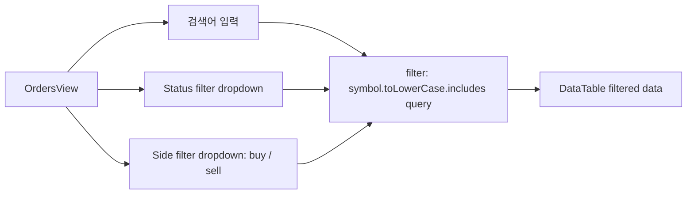
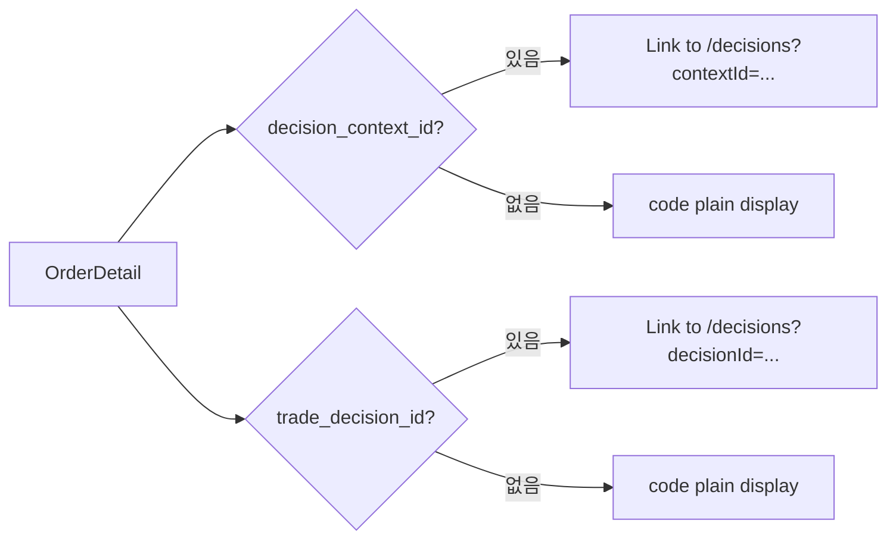
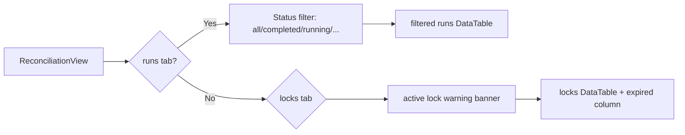
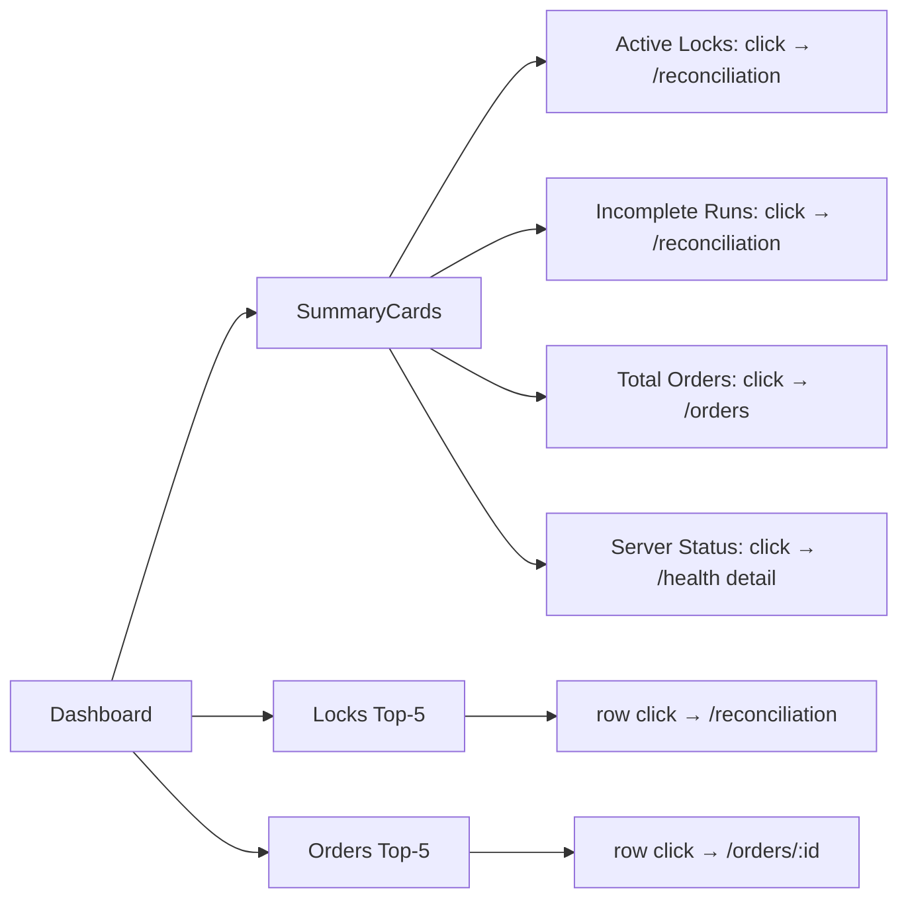
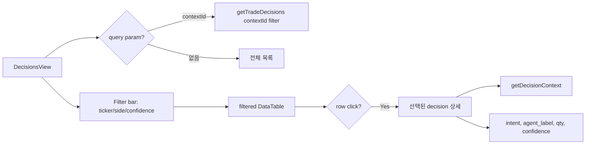
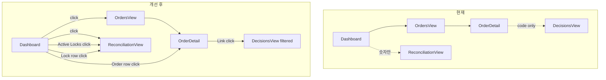

# Plan 51 — Admin UI Operations Workflow Enhancements

> **목표**: Admin UI를 "볼 수 있는 대시보드"에서 "운영자가 빠르게 탐색하고 교차 참조할 수 있는 운영 도구"로 향상시킨다. 새로운 write 기능 없이 **read-only UX 강화**에 집중한다.

---

## Revision History

| 버전 | 날짜 | 변경 내용 |
|------|------|-----------|
| v1.0 | 2026-05-05 | 최초 작성 |

---

## 목차

1. [Why Now](#1-why-now)
2. [현재 상태 분석](#2-현재-상태-분석)
3. [4가지 핵심 질문에 대한 분석](#3-4가지-핵심-질문에-대한-분석)
4. [P0/P1/P2 분류](#4-p0p1p2-분류)
5. [개선 시나리오 상세](#5-개선-시나리오-상세)
   - [P0 — OrdersView filter/search](#51-p0--ordersview-filtersearch)
   - [P0 — OrderDetail drill-down navigation](#52-p0--orderdetail-drill-down-navigation)
   - [P0 — ReconciliationView quick-filter + lock 강조](#53-p0--reconciliationview-quick-filter--lock-강조)
   - [P0 — Dashboard signal visibility + drill-down links](#54-p0--dashboard-signal-visibility--drill-down-links)
   - [P1 — DecisionsView filter + detail panel](#55-p1--decisionsview-filter--detail-panel)
   - [P1 — AccountsView filter + selection UX](#56-p1--accountsview-filter--selection-ux)
6. [변경 파일 목록](#6-변경-파일-목록)
7. [실행 순서](#7-실행-순서)
8. [테스트 전략](#8-테스트-전략)
9. [검증 포인트](#9-검증-포인트)
10. [Risk Assessment](#10-risk-assessment)

---

## 1. Why Now

### 현재 상태

Admin UI Phase 1 (Plan 48)이 구현 완료되었고, Plan 49/50을 통해 **50개 테스트**로 전 화면의 회귀 방지망이 확보되었다. 모든 화면이 데이터를 표시하지만, **운영자 워크플로우 관점**에서 개선이 필요한 부분이 명확하다:

| 화면 | 현재 상태 | 운영자 경험 |
|------|-----------|------------|
| OrdersView | 단순 목록, filter 없음 | 100개 주문에서 원하는 항목 찾기 어려움 |
| OrderDetail | decision ID를 `<code>`로 표시 | ID 복사 → URL 붙여넣기 필요 |
| ReconciliationView | 기본 tab, lock 경고만 | run 상세, filter 없음 |
| AccountsView | 계정 목록 + 클릭 시 detail | filter, 선택 시각화 없음 |
| DecisionsView | 단순 목록, filter 없음 | decision 상세 조회 불가 |
| Dashboard | 숫자 카드, top-5 테이블 | 링크 없음, 상태 추적 제한적 |

### 왜 지금인가

- **Inspection API Phase 1/2 + Auth/RBAC**가 모두 완료되어 backend가 안정적
- **50개 테스트**로 회귀 방지망이 확보되어 있어 UI 변경의 리스크가 낮음
- **새로운 backend API가 필요하지 않음** — 기존 API로 충분히 개선 가능
- **운영자 경험**은 지금 개선하지 않으면 계속 불편한 상태로 유지됨

---

## 2. 현재 상태 분석

### 2.1 라우팅 구조

```
/                     → Dashboard
/orders               → OrdersView
/orders/:orderId      → OrderDetail
/reconciliation       → ReconciliationView
/accounts             → AccountsView
/decisions            → DecisionsView
```

모든 경로는 `ProtectedRoute` + `Layout` 내부에 있음.

### 2.2 사용 가능한 API (모두 GET, 변경 불필요)

| 함수 | 시그니처 | 현재 사용 | Plan 51 활용 |
|------|---------|-----------|-------------|
| `getOrders()` | → `OrderSummary[]` | OrdersView, Dashboard | — |
| `getOrderDetail(id)` | → `OrderDetail` | OrderDetail | — |
| `getOrderEvents(id)` | → `OrderEvent[]` | OrderDetail | — |
| `getBrokerOrders(id)` | → `BrokerOrderView[]` | OrderDetail | — |
| `getReconciliationRuns(accountId?)` | → `ReconciliationRunSummary[]` | ReconciliationView, Dashboard | 추후 account filter |
| `getReconciliationLocks(accountId?)` | → `BlockingLockStatus[]` | ReconciliationView, Dashboard | 추후 account filter |
| `getAccounts(clientCode?)` | → `AccountSummary[]` | AccountsView | **신규**: clientCode filter |
| `getPositions(id)` | → `PositionSnapshotView[]` | AccountsView | — |
| `getCashBalance(id)` | → `CashBalanceSnapshotView \| null` | AccountsView | — |
| `getTradeDecisions(decisionContextId?)` | → `TradeDecisionDetail[]` | DecisionsView | **신규**: contextId filter, drill-down |
| `getDecisionContext(contextId)` | → `DecisionContextDetail` | **아무도 사용 안 함** | **신규**: DecisionsView detail panel |
| `getHealth()` | → `HealthResponse` | Dashboard | — |
| `getAuditLogs(correlationId)` | → `AuditLogEntry[]` | — | — |

**핵심 발견**: `getTradeDecisions(decisionContextId?)`와 `getAccounts(clientCode?)`는 이미 optional query param을 지원하지만, UI에서 **전혀 사용되지 않고 있다**. `getDecisionContext(contextId)`는 **아무 컴포넌트도 호출하지 않는다**.

### 2.3 컴포넌트 복잡도 분석

| 컴포넌트 | 라인 수 | API Calls | 상태(state) | 복잡도 |
|---------|:-------:|:---------:|:-----------:|:------:|
| [`Dashboard.tsx`](admin_ui/src/components/Dashboard.tsx) | 228 | 4 parallel | locks, orders, health, reconRuns | 🟡 Medium |
| [`OrdersView.tsx`](admin_ui/src/components/OrdersView.tsx) | 80 | 1 | orders | 🟢 Low |
| [`OrderDetail.tsx`](admin_ui/src/components/OrderDetail.tsx) | 146 | 3 parallel | order, events, brokerOrders, loading, error | 🔴 High |
| [`ReconciliationView.tsx`](admin_ui/src/components/ReconciliationView.tsx) | 123 | 2 parallel | runs, locks, activeTab | 🟡 Medium |
| [`AccountsView.tsx`](admin_ui/src/components/AccountsView.tsx) | 160 | 1→2 chain | accounts, selectedAccount, positions, cashBalance, detailLoading | 🔴 High |
| [`DecisionsView.tsx`](admin_ui/src/components/DecisionsView.tsx) | 95 | 1 | decisions | 🟢 Low |
| [`DataTable.tsx`](admin_ui/src/components/common/DataTable.tsx) | 63 | 0 | props only | 🟢 Low |

### 2.4 현재 UX 갭 매트릭스

| 화면 | Filter/Search | Row Selection | Drill-down Link | Detail Expand |
|------|:-------------:|:-------------:|:---------------:|:-------------:|
| OrdersView | ❌ | ❌ (click만) | ✅ (→ OrderDetail) | ❌ |
| OrderDetail | ❌ | ❌ | ❌ (code only) | ❌ |
| ReconciliationView | ❌ | ❌ | ❌ | ❌ |
| AccountsView | ❌ | ⚠️ (state만) | ❌ | ✅ (positions+cash) |
| DecisionsView | ❌ | ❌ | ❌ | ❌ |
| Dashboard | ❌ | ❌ | ❌ | ❌ |

---

## 3. 4가지 핵심 질문에 대한 분석

### Q1: 어떤 화면이 운영자 효율이 가장 낮은가?

**1순위: DecisionsView** — filter도 없고, row click도 없고, detail도 볼 수 없다. 운영자가 특정 decision을 조사하려면 ID를 복사해서 다른 도구로 조회해야 한다.

**2순위: OrderDetail** — decision_context_id와 trade_decision_id를 확인할 수 있지만, 클릭하면 해당 decision으로 이동할 방법이 없다. 운영자가 직접 URL을 구성해야 한다.

**3순위: Dashboard** — "Active Locks: 3"이라는 숫자는 보이지만, 클릭해서 Reconciliation 화면으로 이동할 수 없다. "Incomplete Runs: 2"도 마찬가지.

**4순위: OrdersView** — filter가 없어서 많은 주문 중에서 특정 심볼/상태를 찾기 어렵다. 단 navigate-on-click은 이미 구현되어 있다.

### Q2: 기존 API로 어떤 UX 개선이 가능한가?

| 개선 | 필요 API | Backend 변경 |
|------|---------|:-----------:|
| drill-down: decision_context_id → /decisions 필터 | `getTradeDecisions(ctxId)` | **없음** (이미 존재) |
| drill-down: trade_decision_id → decision detail | `getDecisionContext(ctxId)` | **없음** (이미 존재, 미사용) |
| OrdersView client-side filter | in-memory `filter()` | **없음** |
| AccountsView client-side search | in-memory `filter()` | **없음** |
| AccountsView clientCode filter | `getAccounts(clientCode?)` | **없음** (이미 존재) |
| Dashboard links to detail | `navigate()` | **없음** |
| DecisionsView detail panel | `getDecisionContext(ctxId)` | **없음** (이미 존재, 미사용) |

**결론**: 모든 개선이 **backend 변경 없이** 가능하다.

### Q3: Client-side vs Server-side filter?

**Client-side filter 채택** (5/6개 화면):

| 근거 | 내용 |
|------|------|
| 데이터셋 크기 | 현재 모든 API가 pagination 없이 전체 데이터를 반환 |
| in-memory 상태 | 모든 화면이 `useState`로 전체 데이터를 보관 |
| filter 연산 | 수백 개 이하의 항목에서 `array.filter()`는 즉각적 |
| 구현 복잡도 | `useState` + `<input>`만 추가하면 됨 |

**유일한 Server-side 예외**: `getTradeDecisions(decisionContextId?)`는 이미 backend에서 decision_context_id로 필터링을 지원한다. OrdersDetail → Decisions drill-down에서 활용.

### Q4: 어떤 drill-down linkage가 가장 가치 있는가?

| Priority | From | To | 가치 |
|:--------:|------|----|:----:|
| P0 | OrderDetail (decision ID) | DecisionsView (context filter) | 🏆 운영자가 decision을 추적할 수 있게 됨 |
| P0 | Dashboard (lock row) | Reconciliation (locks tab) | 🏆 lock 발견 → 즉시 상세 확인 |
| P0 | Dashboard (order row) | OrderDetail | 🏆 최근 주문 → 즉시 상세 확인 |
| P1 | Dashboard (Active Locks count) | Reconciliation | 운영자가 "왜 3개인가" 확인 가능 |
| P1 | Dashboard (Incomplete Runs) | Reconciliation (runs tab, filtered) | 운영자가 실패한 run 확인 가능 |

---

## 4. P0/P1/P2 분류

### P0 (필수 — 이번 구현)

| # | 영역 | 영향도 | 복잡도 | 근거 |
|---|------|:------:|:------:|------|
| 1 | OrdersView filter/search | High | 🟢 Low | 운영자가 특정 주문을 빠르게 찾을 수 없음 |
| 2 | OrderDetail drill-down | High | 🟢 Low | decision 참조 탐색 불가 |
| 3 | ReconciliationView quick-filter + lock 강조 | Medium | 🟢 Low | 운영자가 blocking lock을 놓칠 위험 |
| 4 | Dashboard signal + drill-down links | Medium | 🟢 Low | 숫자만 보고 링크가 없어 탐색 불편 |

### P1 (차순위 — 가능하면 포함)

| # | 영역 | 영향도 | 복잡도 | 근거 |
|---|------|:------:|:------:|------|
| 5 | DecisionsView filter + detail panel | Medium | 🟡 Medium | decision 탐색이 개선되지만 P0에 비해 사용 빈도 낮음 |
| 6 | AccountsView filter + selection UX | Medium | 🟡 Medium | 계정 수가 적으면 불편함이 덜함 |

### P2 (Defer — 이번 범위 밖)

| # | 영역 | 근거 |
|---|------|------|
| 7 | DataTable sort 기능 구현 | `sortable` prop이 interface에만 있고 구현 없음. 기능 자체는 유용하지만 현재 화면에서 정렬보다 filter가 우선 |
| 8 | URL query string 기반 filter persistence | browser history/refresh 시 filter 상태 유지. 복잡도 대비 사용 빈도 낮음 |
| 9 | Reconciliation run detail expand panel | run 상세가 필요하려면 backend에 detail API가 먼저 필요 |
| 10 | Virtualized table (large dataset) | 현재 데이터셋 크기로는 over-engineering |

---

## 5. 개선 시나리오 상세

### 5.1 P0 — OrdersView Filter/Search

**현재**: 80라인, 단순 DataTable, filter/search 상태 없음, `onRowClick`으로 navigate만 있음.

**목표**: 운영자가 status, symbol, side로 주문을 필터링할 수 있어야 한다.

**변경 사항**:



**구현 상세**:

| 항목 | 값 |
|------|-----|
| 신규 상태 | `searchText: string`, `statusFilter: string \| null`, `sideFilter: string \| null` |
| filter 로직 | `useMemo`로 메모이제이션 |
| DataTable 변경 | **없음** (filter된 데이터를 전달만 하면 됨) |
| 신규 컴포넌트 | Pico CSS `<input>`, `<select>` 3개 in `<header>` or filter bar |
| 예시 코드 | `const filtered = useMemo(() => orders.filter(o => (!statusFilter \|\| o.status === statusFilter) && ...), [orders, statusFilter, sideFilter, searchText])` |

**UX**: DataTable 위에 filter bar. Pico CSS의 `<fieldset>` + `<input>` + `<select>` 사용.

**UI 배치**:
```
Orders
[Search: _______] [Status: all ▾] [Side: all ▾]
┌──────────────────────────────────────┐
│ DataTable (filtered)                  │
└──────────────────────────────────────┘
Total: N orders
```

### 5.2 P0 — OrderDetail Drill-down Navigation

**현재**: `decision_context_id`와 `trade_decision_id`를 `<code>`로만 표시. 클릭 불가.

**목표**: decision ID를 클릭하면 `/decisions` 페이지로 이동하고, 해당 context의 decision만 필터링되어 보여야 한다.

**변경 사항**:



**구현 상세**:

| 항목 | 값 |
|------|-----|
| 변경 파일 | [`OrderDetail.tsx`](admin_ui/src/components/OrderDetail.tsx) 108-122 line |
| 변경 전 | `<code>{order.decision_context_id}</code>` |
| 변경 후 | `<Link to="/decisions"><code>{...}</code></Link>` |
| navigation target | `/decisions` 페이지 (DecisionsView에서 query param 읽음) |
| DecisionsView 수신 | `useSearchParams()`로 `contextId` 읽어서 `getTradeDecisions(contextId)` 호출 |

**중요**: DecisionsView에 contextId query param 지원이 필요하다 (P1 항목과 연결). 만약 P1 DecisionsView가 이번에 구현되지 않는다면, OrderDetail의 drill-down은 단순히 `/decisions`로만 navigate하고, DecisionsView가 추후 query param을 지원할 때까지 기다린다. **단, P1 DecisionsView가 구현된다면 seamless하게 연결된다.**

**fallback 전략**: OrderDetail의 link는 항상 `<Link to={/decisions?contextId=${id}}>`로 만들고, DecisionsView가 아직 query param을 읽지 않더라도 단순히 `/decisions`로 이동만 하면 된다. 추후 DecisionsView가 query param을 읽도록 확장되면 자동으로 연결된다.

### 5.3 P0 — ReconciliationView Quick-filter + Lock 강조

**현재**: Tab 전환, active lock 경고 배너 있음. runs filter 없음. lock 경고가 배너로만 표시됨.

**목표**:
1. Runs 탭에 status quick-filter (all / completed / running / reconcile_required)
2. Active lock 경고를 더 눈에 띄게 (색상, 굵은 테두리)
3. Locks 탭에 expired 여부 표시 추가

**변경 사항**:



**구현 상세**:

| 항목 | 값 |
|------|-----|
| 신규 상태 | `runStatusFilter: string` |
| filter 로직 | `runs.filter(r => runStatusFilter === 'all' \|\| r.status === runStatusFilter)` |
| UI 위치 | Runs tab content 상단, `<select>` |
| Lock 강조 | 경고 배너에 `style={{border: "2px solid red", background: "var(--pico-del-background)"}}` |
| DataTable 변경 | **없음** |

**Lock 경고 강화 전/후**:

| 현재 | 개선 후 |
|------|---------|
| `<article style={{borderColor: "var(--pico-del-color)"}}>` | `<article style={{border: "2px solid red", backgroundColor: "var(--pico-del-background)", fontWeight: "bold"}}>` |
| ⚠️ N active lock(s) exist. | 🚫 **N Active Blocking Locks** — These block trading operations. [View Locks Tab] (클릭 시 locks tab으로 전환) |

### 5.4 P0 — Dashboard Signal Visibility + Drill-down Links

**현재**: 요약 카드, locks top-5, orders top-5. 링크 없음.

**목표**:
1. SummaryCard 클릭 시 관련 페이지로 이동
2. Locks 테이블 각 row 클릭 시 Reconciliation (locks tab)으로 이동
3. Orders 테이블 각 row 클릭 시 OrderDetail로 이동
4. `reflection_failed` 상태나 health 상태 이상을 시각적으로 더 명확히 표시 (서버 상태가 degraded면 구체적 메시지)

**변경 사항**:



**구현 상세**:

| 항목 | 값 |
|------|-----|
| SummaryCard 변경 | `onClick` prop 추가, 카드에 `cursor: pointer` + hover 효과 |
| Locks table 변경 | rows에 `onClick={() => navigate('/reconciliation')}` |
| Orders table 변경 | rows에 `onClick={(row) => navigate(`/orders/${row.order_request_id}`)}` |
| Health signal 강화 | 서버 상태가 "degraded"면 빨간 배지 + "Database disconnected" 상세 메시지 |
| 신규 의존성 | `useNavigate()` (Dashboard에서 현재 사용 안 함) |
| DataTable 변경 | **없음** (onRowClick prop 사용, 하지만 현재 Dashboard는 DataTable을 사용하지 않고 직접 `<table>` 사용) |

**Dashboard가 DataTable을 사용하지 않음**: [`Dashboard.tsx`](admin_ui/src/components/Dashboard.tsx)는 현재 DataTable 컴포넌트를 사용하지 않고 직접 `<table>`을 렌더링한다 (lines 157-176, 189-212). 따라서 각 row에 `onClick` 핸들러를 직접 추가해야 한다.

### 5.5 P1 — DecisionsView Filter + Detail Panel

**현재**: 단순 목록, filter 없음, row click 없음, detail 없음. `getTradeDecisions(decisionContextId?)` 미사용.

**목표**:
1. Ticker/side/confidence range filter 추가
2. Row click 시 detail panel 표시 (decision_context_id로 상세 로드)
3. URL query param `?contextId=...` 지원 (OrderDetail drill-down과 연결)

**변경 사항**:



**구현 상세**:

| 항목 | 값 |
|------|-----|
| 신규 상태 | `searchTicker`, `sideFilter`, `selectedDecision`, `decisionContext: DecisionContextDetail \| null`, `contextLoading` |
| filter 로직 | `useMemo` |
| URL query param | `useSearchParams()`로 `contextId` 읽기 |
| API optimization | `contextId`가 있으면 `getTradeDecisions(contextId)`로 server-side filter |
| Detail panel | 조건부 `<article>` — intent text, agent, confidence bar, qty |
| DataTable 변경 | **없음** |

**UI 구조**:
```
Trade Decisions
Filter: [Ticker: ____] [Side: all ▾]
┌──────────────────────┐  ┌────────────────────┐
│ DataTable            │  │ Selected Detail     │
│ - Ticker, Side, Conf │→│ - Intent: ...       │
│ - Agent, Context ID  │  │ - Agent: AIRiskAgent│
│ (row click → detail) │  │ - Confidence: 85%   │
└──────────────────────┘  │ - Qty: 100          │
                          │ - Context: ...       │
                          └────────────────────┘
```

**중요**: DecisionsView의 detail panel은 `getDecisionContext(contextId)`를 사용한다. 이 API는 현재 **어떤 컴포넌트도 호출하지 않는다**. 이 작업에서 최초로 사용하게 된다.

### 5.6 P1 — AccountsView Filter + Selection UX

**현재**: 2-phase async, filter 없음, visual row selection 없음.

**목표**:
1. Client code filter (기존 `getAccounts(clientCode?)` 활용)
2. Ticker search for positions
3. Visual row selection highlight in DataTable

**변경 사항**:

| 항목 | 값 |
|------|-----|
| 신규 상태 | `clientCodeFilter: string`, `selectedAccountId: string \| null` |
| filter 로직 | `getAccounts(clientCodeFilter || undefined)` — **server-side filter** |
| Selection UX | 선택된 row에 `style={{backgroundColor: "var(--pico-primary-background)"}}` |
| DataTable 변경 | **필요**: `selectedKey` prop 추가하여 선택된 row 하이라이트 |

**DataTable 변경**: 현재 DataTable은 `onRowClick`만 있고, 선택된 row를 시각적으로 표시하는 기능이 없다. 다음과 같은 확장이 필요:

```tsx
interface DataTableProps<T> {
  columns: Column<T>[];
  data: T[];
  keyField: keyof T;
  onRowClick?: (row: T) => void;
  isLoading?: boolean;
  emptyMessage?: string;
  selectedKey?: string;        // ← 신규: 현재 선택된 row의 key 값
  selectedColor?: string;      // ← 신규: 선택된 row의 배경색 (선택 사항)
}
```

---

## 6. 변경 파일 목록

| 파일 | 변경 유형 | 설명 |
|------|-----------|------|
| [`admin_ui/src/components/OrdersView.tsx`](admin_ui/src/components/OrdersView.tsx) | **수정** | filter bar (search, status, side) + useMemo filter |
| [`admin_ui/src/components/OrderDetail.tsx`](admin_ui/src/components/OrderDetail.tsx) | **수정** | decision ID를 `<Link>`로 변경 |
| [`admin_ui/src/components/ReconciliationView.tsx`](admin_ui/src/components/ReconciliationView.tsx) | **수정** | runs status filter, lock 경고 강화 |
| [`admin_ui/src/components/Dashboard.tsx`](admin_ui/src/components/Dashboard.tsx) | **수정** | SummaryCard + table rows에 navigate 추가, health signal 강화 |
| [`admin_ui/src/components/DecisionsView.tsx`](admin_ui/src/components/DecisionsView.tsx) | **수정** | filter bar + detail panel + query param 지원 (P1) |
| [`admin_ui/src/components/AccountsView.tsx`](admin_ui/src/components/AccountsView.tsx) | **수정** | clientCode filter + visual selection (P1) |
| [`admin_ui/src/components/common/DataTable.tsx`](admin_ui/src/components/common/DataTable.tsx) | **수정** | `selectedKey` prop 추가 (선택 row 하이라이트) |
| [`admin_ui/src/__tests__/orders.test.tsx`](admin_ui/src/__tests__/orders.test.tsx) | **수정** | filter 동작 테스트 추가 |
| [`admin_ui/src/__tests__/orderDetail.test.tsx`](admin_ui/src/__tests__/orderDetail.test.tsx) | **수정** | drill-down link 테스트 추가 |
| [`admin_ui/src/__tests__/reconciliation.test.tsx`](admin_ui/src/__tests__/reconciliation.test.tsx) | **수정** | run filter + lock 경고 테스트 추가 |
| [`admin_ui/src/__tests__/dashboard.test.tsx`](admin_ui/src/__tests__/dashboard.test.tsx) | **수정** | navigate + signal 테스트 추가 |
| [`admin_ui/src/__tests__/decisions.test.tsx`](admin_ui/src/__tests__/decisions.test.tsx) | **수정** | filter + detail panel 테스트 추가 (P1) |
| [`admin_ui/src/__tests__/accounts.test.tsx`](admin_ui/src/__tests__/accounts.test.tsx) | **수정** | filter + selection 테스트 추가 (P1) |
| [`admin_ui/src/__tests__/components.test.tsx`](admin_ui/src/__tests__/components.test.tsx) | **수정** | DataTable selectedKey 테스트 추가 |
| [`admin_ui/src/__tests__/test-utils/fixtures.ts`](admin_ui/src/__tests__/test-utils/fixtures.ts) | **수정** | 필요 시 신규 fixture 추가 |
| [`plans/51_admin_ui_operations_workflow_enhancements.md`](plans/51_admin_ui_operations_workflow_enhancements.md) | **생성** | 본 문서 |
| [`plans/README.md`](plans/README.md) | **수정** | Plan 51 항목 추가 |
| [`plans/BACKLOG.md`](plans/BACKLOG.md) | **수정** | 승격/변경 기록 |

---

## 7. 실행 순서

### Step 1: DataTable 확장 (선택적 — P1 AccountsView에서만 필요)

`selectedKey` prop 추가. P1 AccountsView가 이번 범위에 포함될 경우에만 실행.

### Step 2: Dashboard signal + drill-down (P0)

[`Dashboard.tsx`](admin_ui/src/components/Dashboard.tsx) 변경:

1. `useNavigate()` import
2. SummaryCard에 `onClick` prop 추가
3. Locks table rows에 `onClick={() => navigate('/reconciliation')}` 추가
4. Orders table rows에 `onClick={(o) => navigate('/orders/' + o.order_request_id)}` 추가
5. Health degraded 상태일 때 상세 메시지 표시
6. `npm run test:run`으로 기존 테스트 회귀 확인

### Step 3: OrdersView filter/search (P0)

[`OrdersView.tsx`](admin_ui/src/components/OrdersView.tsx) 변경:

1. `useState` 3개 추가: `searchText`, `statusFilter`, `sideFilter`
2. `useMemo`로 filtered data 계산
3. Filter bar UI 추가 (Pico CSS `<input>` + `<select>` × 3)
4. DataTable에 filtered data 전달
5. 테스트: orders.test.tsx에 filter 시나리오 추가

### Step 4: OrderDetail drill-down (P0)

[`OrderDetail.tsx`](admin_ui/src/components/OrderDetail.tsx) 변경:

1. `Link` from `react-router-dom` import
2. Decision Links footer에서 `<code>` → `<Link to={/decisions?contextId=...}>` 변경
3. 테스트: orderDetail.test.tsx에 link 존재/부재 시나리오 추가

### Step 5: ReconciliationView quick-filter + lock 강조 (P0)

[`ReconciliationView.tsx`](admin_ui/src/components/ReconciliationView.tsx) 변경:

1. `runStatusFilter` state 추가
2. Runs tab 상단에 `<select>` filter 추가
3. Active lock 경고 배너 스타일 강화 (굵은 테두리, 빨간 배경)
4. Lock 경고에 "View Locks Tab" 버튼 추가 (클릭 시 locks tab 전환)
5. 테스트: reconciliation.test.tsx에 filter + 경고 강화 테스트 추가

### Step 6: DecisionsView filter + detail (P1 — 선택)

[`DecisionsView.tsx`](admin_ui/src/components/DecisionsView.tsx) 변경:

1. `useSearchParams()`로 `contextId` 읽기
2. `contextId`가 있으면 `getTradeDecisions(contextId)` 호출
3. Filter bar 추가 (ticker search, side dropdown)
4. Row click → `getDecisionContext(contextId)` 호출
5. Detail panel 조건부 렌더링

### Step 7: AccountsView filter + selection (P1 — 선택)

[`AccountsView.tsx`](admin_ui/src/components/AccountsView.tsx) 변경:

1. `clientCodeFilter` state 추가
2. `getAccounts(clientCodeFilter || undefined)` 호출 (server-side filter)
3. DataTable에 `selectedKey` prop 전달
4. Row click 시 highlight

### Step 8: 문서 업데이트

- [`plans/README.md`](plans/README.md) — Plan 51 목록 추가
- [`plans/BACKLOG.md`](plans/BACKLOG.md) — Plan 51 완료 기록, 이번에 defer한 항목 승격

---

## 8. 테스트 전략

### 8.1 기존 테스트 보호

50개 기존 테스트가 회귀하지 않아야 한다. 모든 변경 후 `npm run test:run` 실행.

### 8.2 신규 테스트 시나리오

| 화면 | 신규 시나리오 | 개수 |
|------|-------------|:----:|
| OrdersView | filter by status, filter by side, search text, filter + search 조합 | 4 |
| OrderDetail | decision link 존재 시 렌더, link 부재 시 미표시, link click 시 navigate | 3 |
| ReconciliationView | run status filter 동작, lock 경고 강화 확인 | 2 |
| Dashboard | SummaryCard click navigate, lock row click navigate, order row click navigate, health degraded signal | 4 |
| DecisionsView (P1) | filter 동작, detail panel 렌더, query param drill-down | 3 |
| AccountsView (P1) | clientCode filter, row selection highlight | 2 |
| DataTable | selectedKey prop 동작 | 1 |
| **총계** | | **~19** |

### 8.3 Mock 전략

기존 `mockFetchOnce` + `fixtures.ts` 재사용. 신규 fixture는 최소한으로 유지 (필요한 경우만 추가).

---

## 9. 검증 포인트

| # | 검증 항목 | 기준 |
|---|-----------|------|
| 1 | OrdersView filter: status | "pending" 선택 시 pending 주문만 표시 |
| 2 | OrdersView filter: side | "buy" 선택 시 buy 주문만 표시 |
| 3 | OrdersView search: symbol | "AAPL" 입력 시 AAPL 주문만 표시 |
| 4 | OrderDetail: decision link 존재 | decision_context_id/trade_decision_id 있을 때 `<Link>` 렌더 |
| 5 | OrderDetail: decision link 부재 | 두 ID 모두 null일 때 footer 미표시 |
| 6 | ReconciliationView: run status filter | "completed" 선택 시 completed만 표시 |
| 7 | ReconciliationView: lock 경고 강화 | 빨간 배경 + 굵은 테두리 + locks tab 전환 버튼 |
| 8 | Dashboard: SummaryCard click | navigate to target page |
| 9 | Dashboard: lock row click | navigate to /reconciliation |
| 10 | Dashboard: order row click | navigate to /orders/:id |
| 11 | 기존 50개 테스트 회귀 없음 | `npm run test:run` exit code 0 |
| 12 | P1: DecisionsView filter | ticker/side filter 동작 |
| 13 | P1: DecisionsView detail panel | row click 시 detail 렌더 |
| 14 | P1: DecisionsView query param | `?contextId=...`로 필터링된 목록 |
| 15 | P1: AccountsView clientCode filter | filter 입력 시 API 호출 |
| 16 | P1: DataTable selectedKey | 선택된 row 하이라이트 |

---

## 10. Risk Assessment

| 위험 | 영향 | 확률 | 대비 |
|------|------|:----:|------|
| filter bar 추가로 OrdersView가 너무 좁아짐 | UI 밀집 | 낮음 | Pico CSS `<fieldset>`으로 가로 배치, 필요시 세로 배치 |
| Dashboard에 navigate 추가로 기존 테스트 불안정 | 테스트 실패 | 중간 | `vi.mock('react-router-dom', ...)`로 navigate mock, 또는 `MemoryRouter`로 감싸서 테스트 |
| DecisionsView detail panel에서 `getDecisionContext` API가 느림 | UX 저하 | 낮음 | LoadingSpinner로 처리 (기존 패턴) |
| P1 항목을 P0과 함께 구현 시 범위 증가 | 일정 지연 | 중간 | P1은 선택 사항으로 유지. P0 완료 후 시간이 남을 때만 포함 |
| DataTable `selectedKey` prop 추가로 기존 props interface 변경 | 기존 컴포넌트 호환성 | 낮음 | `selectedKey`를 optional로 유지, 기존 사용처는 변경 없음 |

---

## Appendix: Drill-down Linkage Matrix

현재 vs 개선 후의 화면 간 연결 관계:



**핵심 변화**: 단방향(조회만 가능) → 양방향(탐색 가능). Dashboard가 hub 역할을 하여 모든 화면으로의 접근점을 제공한다.
