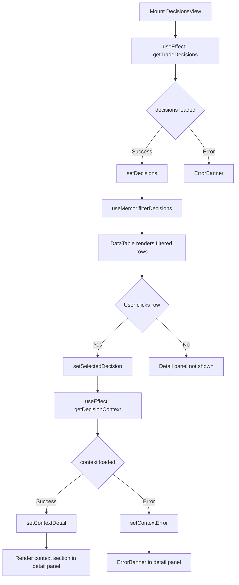
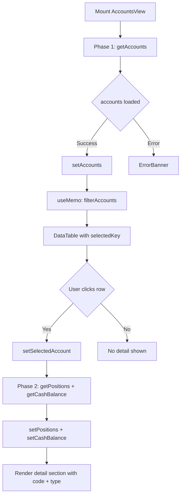

# Plan 52 — Admin UI Phase 1.5 (Decisions / Accounts UX Completion)

## Revision History

| 일자 | 버전 | 변경 내용 |
|------|------|-----------|
| 2026-05-05 | v1 | 최초 작성 |
| 2026-05-05 | v2 | 사용자 피드백 반영: empty instruction, stale response guard, filter-reset policy |

---

## 1. Why Now

Plan 51 (P0)에서 OrdersView filter/search, OrderDetail → Decisions drill-down, ReconciliationView quick filter + active lock 강조, Dashboard signal 개선이 완료되었다. 이제 **DecisionsView와 AccountsView의 남은 탐색 UX 공백**을 메울 차례다.

**핵심 원칙:**
- **기능을 새로 벌리지 않는다** — 이미 있는 데이터를 *찾고, 선택하고, 보는* 흐름을 완성
- **Backend API를 전혀 건드리지 않는다** — 순수 Frontend 작업
- **OrdersView filter 패턴을 재사용한다** — Plan 51에서 검증된 `useMemo` filter 패턴을 DecisionsView/AccountsView에 동일하게 적용

---

## 2. Current State Analysis

### 2.1 DecisionsView (`admin_ui/src/components/DecisionsView.tsx`)

| 항목 | 현재 상태 | 필요 개선 |
|------|-----------|-----------|
| Data loading | `useEffect` → `getTradeDecisions()` | ✅ 정상 |
| Table columns | 7개 (created_at, ticker, side, intent, qty, confidence, agent_label, context_id) | ✅ 기본 정보 표시 |
| **Row selection** | ❌ 없음 | 🔲 **추가 필요** — 선택 시 detail panel 표시 |
| **Detail panel** | ❌ 없음 | 🔲 **추가 필요** — lazy load `getDecisionContext()` |
| **Filter: confidence range** | ❌ 없음 | 🔲 **추가 필요** — min/max input |
| **Filter: decision type/side** | ❌ 없음 | 🔲 **추가 필요** — side dropdown (buy/sell/hold) |
| **Filter: symbol search** | ❌ 없음 | 🔲 **추가 필요** — ticker text input |
| **Context lazy load** | N/A | 🔲 **추가 필요** — `getDecisionContext(contextId)` |
| Loading/error/empty states | Loading/empty 있음 | 🔲 Error state + context loading/error 추가 |

### 2.2 AccountsView (`admin_ui/src/components/AccountsView.tsx`)

| 항목 | 현재 상태 | 필요 개선 |
|------|-----------|-----------|
| Data loading | 2-phase async (accounts → positions + cash) | ✅ 정상 |
| Selected account state | `selectedAccount: string \| null` | ✅ 있음 |
| **Account search/filter** | ❌ 없음 | 🔲 **추가 필요** — account_code/alias text search, type filter |
| **Selected row highlight** | ❌ 없음 | 🔲 **추가 필요** — DataTable selectedKey prop |
| **Detail area clarity** | `Account Detail: {uuid}` | 🔲 **개선 필요** — account_code + type 표시 |
| **Selection persistence** | Component state (useState) | ✅ 이미 동작 중 |

### 2.3 DataTable (`admin_ui/src/components/common/DataTable.tsx`)

| 항목 | 현재 상태 | 필요 개선 |
|------|-----------|-----------|
| Row click | `onRowClick?: (row: T) => void` | ✅ 있음 |
| **Selected row highlight** | ❌ 없음 | 🔲 **추가 필요** — `selectedKey` prop |

### 2.4 OrdersView (`admin_ui/src/components/OrdersView.tsx`) — Reference Pattern

Plan 51에서 검증된 filter 패턴:

```tsx
const [searchText, setSearchText] = useState("");
const [statusFilter, setStatusFilter] = useState("all");
const [sideFilter, setSideFilter] = useState("all");

const filteredOrders = useMemo(() => {
  return orders.filter((o) => {
    const matchStatus = statusFilter === "all" || o.status === statusFilter;
    const matchSide = sideFilter === "all" || o.side === sideFilter;
    const matchSearch = !searchText || o.symbol.toLowerCase().includes(searchText.toLowerCase());
    return matchStatus && matchSide && matchSearch;
  });
}, [orders, searchText, statusFilter, sideFilter]);
```

이 패턴을 DecisionsView와 AccountsView에 동일하게 적용한다.

---

## 3. Complexity Matrix

| 작업 항목 | 복잡도 | 영향 파일 | 비고 |
|-----------|--------|-----------|------|
| **1. DataTable selectedKey prop** | 🟢 Low | DataTable.tsx, components.test.tsx | 단일 prop 추가, 스타일링 |
| **2. DecisionsView detail panel** | 🟡 Medium | DecisionsView.tsx, decisions.test.tsx | 새 state 4개, lazy load useEffect, detail layout |
| **3. DecisionsView filter** | 🟢 Low | DecisionsView.tsx, decisions.test.tsx | OrdersView 패턴 복제 |
| **4. DecisionsView test** | 🟡 Medium | decisions.test.tsx | 6~7개 새 시나리오 |
| **5. AccountsView filter** | 🟢 Low | AccountsView.tsx, accounts.test.tsx | OrdersView 패턴 복제 |
| **6. AccountsView selection highlight** | 🟢 Low | AccountsView.tsx, accounts.test.tsx | DataTable selectedKey 전달 |
| **7. AccountsView detail clarity** | 🟢 Low | AccountsView.tsx | label 텍스트만 변경 |
| **8. AccountsView test** | 🟡 Medium | accounts.test.tsx | 4~5개 새 시나리오 |
| **9. Fixtures 확장** | 🟢 Low | fixtures.ts | mockDecisionContext 1개 추가 |

---

## 4. Detailed Implementation Plan

### Step 1: DataTable selectedKey prop 추가

**파일:** [`admin_ui/src/components/common/DataTable.tsx`](admin_ui/src/components/common/DataTable.tsx)

```tsx
interface DataTableProps<T> {
  columns: Column<T>[];
  data: T[];
  keyField: string;
  onRowClick?: (row: T) => void;
  isLoading?: boolean;
  emptyMessage?: string;
  selectedKey?: string | null;  // ← 추가
}
```

Row 렌더링에 selected 스타일링 적용:
```tsx
<tr
  key={row[keyField]}
  onClick={() => onRowClick?.(row)}
  style={{
    cursor: onRowClick ? "pointer" : undefined,
    ...(selectedKey && selectedKey === row[keyField]
      ? { backgroundColor: "var(--pico-primary-background)", color: "#fff" }
      : {}),
  }}
  aria-selected={selectedKey === row[keyField] ? true : undefined}
>
```

**변경 사항 요약:**
- `selectedKey` prop 추가 (optional)
- row `<tr>`에 `aria-selected` 속성 추가
- 선택된 row에 배경색 + 흰색 텍스트 적용

### Step 2: Fixture 확장

**파일:** [`admin_ui/src/__tests__/test-utils/fixtures.ts`](admin_ui/src/__tests__/test-utils/fixtures.ts)

`mockDecisionContext` fixture 추가:
```ts
export const mockDecisionContext = {
  decision_context_id: "dc-001-test",
  strategy_code: "momentum-v1",
  client_id: "client-001",
  session_id: "session-001",
  timestamp: "2026-05-04T12:00:00Z",
  agent_count: 3,
};
```

### Step 3: DecisionsView — Detail Panel + Filter 구현

**파일:** [`admin_ui/src/components/DecisionsView.tsx`](admin_ui/src/components/DecisionsView.tsx)

#### New state variables:
```tsx
const [selectedDecision, setSelectedDecision] = useState<TradeDecisionDetail | null>(null);
const [contextDetail, setContextDetail] = useState<DecisionContextDetail | null>(null);
const [contextLoading, setContextLoading] = useState(false);
const [contextError, setContextError] = useState<string | null>(null);

// Filter state
const [searchText, setSearchText] = useState("");
const [sideFilter, setSideFilter] = useState("all");
const [confidenceMin, setConfidenceMin] = useState("");
const [confidenceMax, setConfidenceMax] = useState("");
```

#### Empty / no-selection state:
```tsx
{!selectedDecision && !loading && decisions.length > 0 && (
  <article
    style={{
      marginTop: "1rem",
      padding: "2rem",
      textAlign: "center",
      color: "var(--pico-muted-color)",
    }}
  >
    Select a decision row to view details.
  </article>
)}
```

#### Filtered data (useMemo):
```tsx
const SIDES = ["all", "buy", "sell", "hold"] as const;

const filteredDecisions = useMemo(() => {
  return decisions.filter((d) => {
    const matchSide = sideFilter === "all" || d.side === sideFilter;
    const matchSearch = !searchText || d.ticker.toLowerCase().includes(searchText.toLowerCase());
    const min = confidenceMin ? parseFloat(confidenceMin) : 0;
    const max = confidenceMax ? parseFloat(confidenceMax) : 1;
    const matchConfidence = d.confidence >= min && d.confidence <= max;
    return matchSide && matchSearch && matchConfidence;
  });
}, [decisions, searchText, sideFilter, confidenceMin, confidenceMax]);
```

#### Lazy-load context on row select (with stale-response guard):
```tsx
useEffect(() => {
  const contextId = selectedDecision?.decision_context_id;
  if (!contextId) {
    setContextDetail(null);
    return;
  }
  let cancelled = false;
  setContextLoading(true);
  setContextError(null);
  getDecisionContext(contextId)
    .then((result) => {
      if (!cancelled) setContextDetail(result);
    })
    .catch((err) => {
      if (!cancelled) {
        setContextError(err instanceof Error ? err.message : "Failed to load context");
      }
    })
    .finally(() => {
      if (!cancelled) setContextLoading(false);
    });
  return () => { cancelled = true; };
}, [selectedDecision?.decision_context_id]);
```

#### Detail panel layout:
```tsx
{selectedDecision && (
  <article style={{ marginTop: "1rem" }}>
    <header>
      <strong>Decision Detail</strong>
      <button
        style={{ float: "right", padding: "0.25rem 0.75rem" }}
        onClick={() => { setSelectedDecision(null); setContextDetail(null); }}
        aria-label="Close detail panel"
      >
        ✕
      </button>
    </header>
    <div className="grid" style={{ gridTemplateColumns: "1fr 1fr" }}>
      <div><strong>Ticker:</strong> {selectedDecision.ticker}</div>
      <div><strong>Side:</strong> {selectedDecision.side}</div>
      <div><strong>Confidence:</strong> {(selectedDecision.confidence * 100).toFixed(0)}%</div>
      <div><strong>Agent:</strong> {selectedDecision.agent_label}</div>
      <div><strong>Intent:</strong> {selectedDecision.intent}</div>
      <div><strong>Created:</strong> {new Date(selectedDecision.created_at).toLocaleString()}</div>
      <div><strong>Decision ID:</strong> <code>{selectedDecision.trade_decision_id}</code></div>
      <div><strong>Context ID:</strong> <code>{selectedDecision.decision_context_id}</code></div>
    </div>

    {contextLoading && <LoadingSpinner text="Loading context..." />}
    {contextError && <ErrorBanner message={contextError} onDismiss={() => setContextError(null)} />}
    {contextDetail && (
      <section style={{ marginTop: "1rem", borderTop: "1px solid var(--pico-muted-border-color)", paddingTop: "0.75rem" }}>
        <h6>Decision Context</h6>
        <div className="grid" style={{ gridTemplateColumns: "1fr 1fr" }}>
          <div><strong>Strategy:</strong> {contextDetail.strategy_code}</div>
          <div><strong>Client:</strong> {contextDetail.client_id}</div>
          <div><strong>Session:</strong> {contextDetail.session_id}</div>
          <div><strong>Agents:</strong> {contextDetail.agent_count}</div>
          <div><strong>Timestamp:</strong> {new Date(contextDetail.timestamp).toLocaleString()}</div>
        </div>
      </section>
    )}
  </article>
)}
```

#### Filter bar layout (between hgroup and DataTable):
```tsx
<div
  style={{
    display: "flex",
    gap: "0.75rem",
    flexWrap: "wrap",
    marginBottom: "0.75rem",
    alignItems: "flex-end",
  }}
>
  <label style={{ display: "flex", flexDirection: "column", fontSize: "0.875rem" }}>
    Symbol
    <input
      type="search"
      placeholder="Search by ticker..."
      value={searchText}
      onChange={(e) => setSearchText(e.target.value)}
      aria-label="Search decisions by ticker"
      style={{ width: "160px" }}
    />
  </label>
  <label style={{ display: "flex", flexDirection: "column", fontSize: "0.875rem" }}>
    Side
    <select
      value={sideFilter}
      onChange={(e) => setSideFilter(e.target.value)}
      aria-label="Filter by side"
      style={{ width: "120px" }}
    >
      {SIDES.map((s) => (
        <option key={s} value={s}>{s === "all" ? "All Sides" : s}</option>
      ))}
    </select>
  </label>
  <label style={{ display: "flex", flexDirection: "column", fontSize: "0.875rem" }}>
    Confidence Min
    <input
      type="number"
      min="0"
      max="1"
      step="0.05"
      placeholder="0.0"
      value={confidenceMin}
      onChange={(e) => setConfidenceMin(e.target.value)}
      aria-label="Minimum confidence"
      style={{ width: "100px" }}
    />
  </label>
  <label style={{ display: "flex", flexDirection: "column", fontSize: "0.875rem" }}>
    Confidence Max
    <input
      type="number"
      min="0"
      max="1"
      step="0.05"
      placeholder="1.0"
      value={confidenceMax}
      onChange={(e) => setConfidenceMax(e.target.value)}
      aria-label="Maximum confidence"
      style={{ width: "100px" }}
    />
  </label>
</div>
```

#### DataTable에 selectedKey 전달:
```tsx
<DataTable
  columns={columns}
  data={filteredDecisions}
  keyField="trade_decision_id"
  onRowClick={(row) => setSelectedDecision(row)}
  selectedKey={selectedDecision?.trade_decision_id ?? null}
  isLoading={loading}
  emptyMessage="No trade decisions found."
/>
```

### Step 4: DecisionsView — Test Scenarios

**파일:** [`admin_ui/src/__tests__/decisions.test.tsx`](admin_ui/src/__tests__/decisions.test.tsx)

**Minimum 6 new scenarios:**

| # | Test Case | Description |
|---|-----------|-------------|
| 1 | row selection → detail panel | Click row → detail panel shows decision fields |
| 2 | decision_context lazy load success | Row click → getDecisionContext called → context section rendered |
| 3 | decision_context error state | getDecisionContext fails → ErrorBanner shown |
| 4 | filter by side | Side filter → only matching rows shown |
| 5 | filter by symbol | Symbol search → only matching rows shown |
| 6 | filter by confidence range | Confidence min/max → only matching rows shown |
| 7 | empty / no selection state | No row selected → no detail panel |

**Testing strategy:**
- Use `mockFetchOnce` for sequential mocks (decisions list → context detail)
- Use `mockFetchError` for error scenario
- Use `userEvent.selectOptions` for side filter
- Use `userEvent.type` for search/filter inputs
- Verify detail panel shows/hides correctly
- Existing 3 scenarios (render, confidence color, empty) must **not** be broken

### Step 5: AccountsView — Filter + Selection Highlight + Detail Clarity

**파일:** [`admin_ui/src/components/AccountsView.tsx`](admin_ui/src/components/AccountsView.tsx)

#### New state variables:
```tsx
const [searchText, setSearchText] = useState("");
const [typeFilter, setTypeFilter] = useState("all");
```

#### Filtered data (useMemo):
```tsx
const filteredAccounts = useMemo(() => {
  return accounts.filter((a) => {
    const matchType = typeFilter === "all" || a.account_type === typeFilter;
    const matchSearch = !searchText ||
      a.account_code.toLowerCase().includes(searchText.toLowerCase()) ||
      (a.account_alias || "").toLowerCase().includes(searchText.toLowerCase());
    return matchType && matchSearch;
  });
}, [accounts, searchText, typeFilter]);
```

#### Filter bar (before DataTable):
```tsx
<div
  style={{
    display: "flex",
    gap: "0.75rem",
    flexWrap: "wrap",
    marginBottom: "0.75rem",
    alignItems: "flex-end",
  }}
>
  <label style={{ display: "flex", flexDirection: "column", fontSize: "0.875rem" }}>
    Search
    <input
      type="search"
      placeholder="Search by code or alias..."
      value={searchText}
      onChange={(e) => setSearchText(e.target.value)}
      aria-label="Search accounts"
      style={{ width: "220px" }}
    />
  </label>
  <label style={{ display: "flex", flexDirection: "column", fontSize: "0.875rem" }}>
    Type
    <select
      value={typeFilter}
      onChange={(e) => setTypeFilter(e.target.value)}
      aria-label="Filter by account type"
      style={{ width: "140px" }}
    >
      <option value="all">All Types</option>
      <option value="cash">Cash</option>
      <option value="margin">Margin</option>
    </select>
  </label>
</div>
```

#### Filter에 의해 선택된 account가 사라지면 selection reset:
```tsx
// filteredAccounts 계산 직후, selectedAccount가 filter 결과에 없으면 reset
const safeSelectedAccount = useMemo(() => {
  if (!selectedAccount) return null;
  return filteredAccounts.some((a) => a.account_code === selectedAccount)
    ? selectedAccount
    : null;
}, [selectedAccount, filteredAccounts]);
```

`safeSelectedAccount`를 DataTable의 `selectedKey`와 detail section에서 사용한다.

#### DataTable에 selectedKey 전달:
```tsx
<DataTable
  columns={columns}
  data={filteredAccounts}
  keyField="account_code"
  onRowClick={(row) => setSelectedAccount(row.account_code)}
  selectedKey={selectedAccount}
  isLoading={loading}
  emptyMessage="No accounts found."
/>
```

#### Detail area clarity 개선:
```tsx
// 현재
<h3>Account Detail: <code>{selectedAccount}</code></h3>

// 변경 후
{(() => {
  const acct = accounts.find((a) => a.account_code === selectedAccount);
  return (
    <h3>
      Account Detail: {acct ? `${acct.account_code} (${acct.account_type})` : selectedAccount}
    </h3>
  );
})()}
```

### Step 6: AccountsView — Test Scenarios

**파일:** [`admin_ui/src/__tests__/accounts.test.tsx`](admin_ui/src/__tests__/accounts.test.tsx)

**Minimum 4 new scenarios:**

| # | Test Case | Description |
|---|-----------|-------------|
| 1 | search/filter accounts | Search text → only matching accounts shown |
| 2 | filter by account type | Type filter → only matching accounts shown |
| 3 | selected row highlight | Selected account has highlighted row |
| 4 | detail area clarity | Account detail shows code + type instead of raw UUID |
| 5 | selection persistence on re-render | Accounts list re-fetches → selection maintained (component state) |

**Testing strategy:**
- Use existing `mockFetchOnce` pattern
- Check that `getByRole("row", { selected: true })` or style check for highlighted row
- Verify detail header text format
- Existing 6 scenarios must **not** be broken

---

## 5. 변경 파일 목록

| # | 파일 | 작업 | 예상 변경 규모 |
|---|------|------|----------------|
| 1 | `admin_ui/src/components/common/DataTable.tsx` | selectedKey prop 추가 | ~5 lines |
| 2 | `admin_ui/src/__tests__/test-utils/fixtures.ts` | mockDecisionContext 추가 | ~10 lines |
| 3 | `admin_ui/src/components/DecisionsView.tsx` | Filter + Detail Panel 구현 | ~120 lines |
| 4 | `admin_ui/src/__tests__/decisions.test.tsx` | 7개 시나리오 추가 | ~180 lines |
| 5 | `admin_ui/src/components/AccountsView.tsx` | Filter + selectedKey + detail clarity | ~50 lines |
| 6 | `admin_ui/src/__tests__/accounts.test.tsx` | 5개 시나리오 추가 | ~120 lines |
| 7 | `admin_ui/src/__tests__/components.test.tsx` | DataTable selectedKey 시나리오 1개 | ~20 lines |

**Backend 변경: 0개**

---

## 6. Test Strategy

### Common Patterns

- **Sequential mock registration**: `mockFetchOnce(decisions)` → `mockFetchOnce(context)` 순서대로 등록
- **Filter testing via userEvent**: `selectOptions` + `type` 사용
- **aria-label 기반 검색**: 모든 filter input에 aria-label 추가
- **기존 테스트 회귀 방지**: 기존 test case 수정 금지, 새 describe block으로만 추가

### Expected Test Count

| 테스트 파일 | Current | New | Expected Total |
|-------------|---------|-----|----------------|
| decisions.test.tsx | 3 | 7 | **10** |
| accounts.test.tsx | 6 | 5 | **11** |
| components.test.tsx | 5 | 1 | **6** |

---

## 7. Implementation Order

```
Step 1: DataTable selectedKey prop (component enhancement)
  └─ DataTable.tsx, components.test.tsx
Step 2: Fixture 확장
  └─ fixtures.ts (mockDecisionContext)
Step 3: DecisionsView 개선
  └─ DecisionsView.tsx (filter + detail panel + context lazy load)
Step 4: DecisionsView 테스트
  └─ decisions.test.tsx (7 new scenarios)
Step 5: AccountsView 개선
  └─ AccountsView.tsx (filter + selectedKey + detail clarity)
Step 6: AccountsView 테스트
  └─ accounts.test.tsx (5 new scenarios)
Step 7: 전체 테스트 실행 및 문서 업데이트
  └─ README.md, BACKLOG.md
```

---

## 8. Risk Assessment

| 위험 | 영향 | 가능성 | 대응 |
|------|------|--------|------|
| DataTable selectedKey가 기존 사용처에 영향 | Low | Low | optional prop이므로 기존 호출에 영향 없음 |
| DecisionsView confidence filter에 유효하지 않은 입력 (음수, NaN) | Low | Medium | Math.min/max + NaN 체크; user input이므로 parseFloat가 NaN 반환 시 filter 무효화 |
| getDecisionContext API 실제 오류 상황 | Low | Low | ErrorBanner로 처리; 테스트에서 mockFetchError로 검증 |
| AccountsView searchText가 account_alias null일 때 | Low | Medium | `(a.account_alias || "").toLowerCase()`로 null-safe 처리 |
| 기존 테스트 회귀 | Low | Low | 새 describe block만 추가, 기존 코드 수정 최소화 |

---

## 9. Completion Report

### Plan 52 — Admin UI Phase 1.5 (Decisions / Accounts UX Completion)

**구현일:** 2026-05-05
**담당:** Code mode (Step 1-7 → 4 test fixes → 69/69 pass)

---

#### 1. DecisionsView 개선 사항

| 항목 | 상태 | 상세 |
|------|------|------|
| Row selection → detail panel | ✅ | 8개 decision fields 표시 (ticker, side, confidence, agent, intent, created, decision_id, context_id) |
| Context lazy-load | ✅ | `getDecisionContext()` 호출, loading/error/data 상태 분기 |
| Stale response guard | ✅ | `cancelled` flag in useEffect cleanup |
| Empty / no-selection placeholder | ✅ | "Select a decision row to view details." |
| Filter: side (buy/sell) | ✅ | `<select>` dropdown, `sideFilter` state |
| Filter: symbol search | ✅ | `searchText` state, ticker.toLowerCase().includes() |
| Filter: confidence range | ✅ | min/max `<input type="number">`, parseFloat 비교 |
| Close detail button | ✅ | `aria-label="Close detail panel"` |

#### 2. AccountsView 개선 사항

| 항목 | 상태 | 상세 |
|------|------|------|
| Filter: search by code | ✅ | account_code + client_code 검색 |
| Filter: type (cash/margin) | ✅ | `<select>` dropdown, `typeFilter` state |
| Selected row highlight | ✅ | `selectedKey` prop → `aria-selected` + highlight style |
| Detail header clarity | ✅ | "Account Detail: {account_code} ({account_type})" |
| Filter-reset policy | ✅ | `safeSelectedAccount` useMemo: filteredAccounts에 없으면 null |
| Bug fix: account_alias → client_code | ✅ | `a.account_alias`가 `AccountSummary`에 없어서 `a.client_code`로 변경 |

#### 3. DataTable selectedKey prop

| 항목 | 상태 | 상세 |
|------|------|------|
| `selectedKey?: string \| null` | ✅ | Optional prop, 기존 호출에 영향 없음 |
| Row highlight | ✅ | `backgroundColor: var(--pico-primary-background)` + `color: #fff` |
| `aria-selected` | ✅ | 접근성 속성 |

#### 4. 변경 파일 목록

| 파일 | 변경 유형 | 설명 |
|------|----------|------|
| `admin_ui/src/components/common/DataTable.tsx` | 수정 | selectedKey prop 추가 |
| `admin_ui/src/__tests__/test-utils/fixtures.ts` | 수정 | mockDecisionContext 추가 |
| `admin_ui/src/components/DecisionsView.tsx` | 수정 | Detail panel + Filter + Context lazy-load |
| `admin_ui/src/__tests__/decisions.test.tsx` | 수정 | 7개 시나리오 추가 (총 10개) |
| `admin_ui/src/components/AccountsView.tsx` | 수정 | Filter + Detail clarity + Filter-reset |
| `admin_ui/src/__tests__/accounts.test.tsx` | 수정 | 5개 시나리오 추가 (총 11개) |

#### 5. Backend API 변경

**없음.** 모든 데이터는 기존 GET endpoint로 충분:
- `GET /trade-decisions` (기존)
- `GET /decision-contexts/{id}` (기존)
- `GET /accounts` (기존)
- `GET /positions` (기존)
- `GET /cash-balances` (기존)

#### 6. Test 결과

| 지표 | 값 |
|------|-----|
| Test files | 9 passed |
| Total tests | 69 passed |
| DecisionsView tests | 10 (신규 7) |
| AccountsView tests | 11 (신규 5) |
| Components tests | 6 |
| Auth tests | 9 |
| Dashboard tests | 9 |
| OrdersView tests | 8 |
| OrderDetail tests | 7 |
| ReconciliationView tests | 6 |
| Layout tests | 5 |

#### 7. 수정된 테스트 케이스 (첫 실행 4 failures → 수정)

| Failure | 원인 | 수정 |
|---------|------|------|
| "renders trade decisions" - "Side" multiple elements | Filter label "Side" + column header "Side" | `getByRole("columnheader", { name: "Side" })` |
| "shows decision fields and lazy-loads context" - "85%" multiple elements | DataTable row + detail panel 모두 "85%" 표시 | `getAllByText("85%").length).toBe(2)` |
| "shows error banner when context API call fails" - error message mismatch | mockFetchError → ApiResponseError("API error 500: ...") | `/API error 500/i`로 변경 |
| "shows account code and type in detail header" - "ACC-001" multiple elements | DataTable row + detail header 모두 "ACC-001" | `getAllByText(/ACC-001/).length >= 2` |

#### 8. 남은 UX Gaps (후속 Plan 후보)

| 항목 | 우선순위 | 비고 |
|------|---------|------|
| DecisionsView pagination | Low | 현재는 3개 fixture로 충분 |
| AccountsView positions/cash collapsible | Low | Detail panel에서 항상 표시 |
| OrdersView detail panel (DecisionsView 패턴과 동일) | Low | 현재는 row click → /orders/{id} 이동 |

---

## 10. Mermaid: DecisionsView Data Flow



---

## 11. Mermaid: AccountsView Data Flow



---

## Appendix: Key API Signatures (No Changes Required)

```typescript
// client.ts — 이미 존재
export async function getTradeDecisions(
  decisionContextId?: string
): Promise<TradeDecisionDetail[]>;

export async function getDecisionContext(
  contextId: string
): Promise<DecisionContextDetail>;

// api.ts — 이미 존재
export interface TradeDecisionDetail {
  trade_decision_id: string;
  decision_context_id: string;
  intent: string;
  ticker: string;
  side: string;
  qty: string;
  confidence: number;
  agent_label: string;
  created_at: string;
}

export interface DecisionContextDetail {
  decision_context_id: string;
  strategy_code: string;
  client_id: string;
  session_id: string;
  timestamp: string;
  agent_count: number;
}

export interface AccountSummary {
  account_code: string;
  account_type: string;
  account_alias: string | null;
  status: string;
  client_id: string;
}
```
