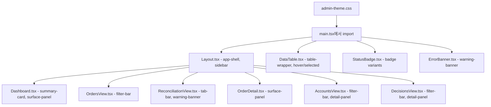

# Plan 54 — Admin UI Visual Refinement: Design Template Port

## 목적

현재 `admin_ui/`가 가진 기능 구조는 모두 유지한 채, `design/design_template/`의 visual system (dark neutral enterprise palette, surface layering, refined table/badge/card)을 **점진 이식**한다.

## 핵심 원칙

1. Backend / Auth / Routing / API contract 변경 금지
2. `design_template` 전체 복사 금지 (Keep/Adapt/Ignore 분류 준수)
3. Pico CSS를 제거하지 않음 — 그 위에 **custom theme CSS를 overlay**
4. Read-only 운영 콘솔 성격 유지
5. 기존 69개+ UI 테스트 회귀 금지
6. 기능 추가 없음 — 오직 visual refinement

## 현재 분석 (As-Is)

### 현재 스타일 구조
- [`admin_ui/src/main.tsx`](admin_ui/src/main.tsx:3) → `@picocss/pico/css/pico.min.css` 1줄만 import
- 모든 컴포넌트가 inline style로 Pico CSS 변수 참조 (`var(--pico-primary)`, `var(--pico-ins-color)`, `var(--pico-muted-color)`, `var(--pico-del-color)`, `var(--pico-warning)`)
- [`Layout.tsx`](admin_ui/src/components/Layout.tsx:16) — flex sidebar, 전부 inline style
- [`DataTable.tsx`](admin_ui/src/components/common/DataTable.tsx:38) — raw `<figure><table>`, selected row만 inline bg
- [`StatusBadge.tsx`](admin_ui/src/components/common/StatusBadge.tsx:29) — inline style badge with Pico color vars
- [`ErrorBanner.tsx`](admin_ui/src/components/common/ErrorBanner.tsx:8) — inline style banner
- [`Dashboard.tsx`](admin_ui/src/components/Dashboard.tsx:28) — SummaryCard, warning banner, table hover 전부 inline style
- [`OrdersView.tsx`](admin_ui/src/components/OrdersView.tsx:102) — filter bar inline style
- [`ReconciliationView.tsx`](admin_ui/src/components/ReconciliationView.tsx:120) — tab / active lock warning inline style
- [`OrderDetail.tsx`](admin_ui/src/components/OrderDetail.tsx:81) — summary article / detail grid inline style
- [`AccountsView.tsx`](admin_ui/src/components/AccountsView.tsx:142) — filter bar / detail section inline style
- [`DecisionsView.tsx`](admin_ui/src/components/DecisionsView.tsx:146) — filter bar / detail panel inline style

### 디자인 템플릿 CSS 분석 ([`index.css`](design/design_template/src/index.css))
- OKLCH 기반 dark neutral palette
  - `--background: oklch(0.13 0.008 240)` — deep charcoal
  - `--card: oklch(0.16 0.009 240)` — surface-1
  - `--surface-1/2/3` — layered surfaces
  - `--border: oklch(0.24 0.009 240)` — subtle border
- Status colors: `--status-success`, `--status-warning`, `--status-error`, `--status-info`, `--status-amber`
- Radius/shadow tokens
- Custom scrollbar styling
- Tailwind 잔재 (`@tailwind`, `@apply`) — 이식 시 제거 필요

## 구현 계획

### Step 1: 글로벌 CSS 토큰 파일 추가

**파일 생성:** [`admin_ui/src/styles/admin-theme.css`](admin_ui/src/styles/admin-theme.css)

디자인 템플릿의 CSS 커스텀 프로퍼티를 추출하여 Pico CSS 위에 overlay할 테마 파일을 만든다.

**포함할 토큰:**
- `--app-background` (deep charcoal)
- `--surface-1`, `--surface-2`, `--surface-3` (panel layering)
- `--border-color`, `--border-subtle`
- `--text-primary`, `--text-secondary`, `--text-muted`
- `--status-success`, `--status-warning`, `--status-error`, `--status-info`, `--status-amber`
- `--radius-sm`, `--radius-md`, `--radius-lg`
- `--shadow-sm`, `--shadow-md`
- `--sidebar-bg`, `--sidebar-hover`, `--sidebar-active`

**포함할 유틸리티 클래스:**
- `.app-shell` — min-height: 100vh, display: flex, background: var(--app-background)
- `.sidebar` — width: 220px, surface, border-right
- `.page-header` — hgroup 스타일링
- `.section-header` — section 제목 스타일링
- `.summary-card` — card surface, border-top accent, hover
- `.surface-panel` — article 대체 클래스
- `.filter-bar` — filter 컨트롤 그룹 flex 레이아웃
- `.detail-panel` — detail 섹션 surface
- `.warning-banner` — 경고 배너 (error/warning variant)
- `.table-wrapper` — DataTable용 wrapper
- `.badge` — StatusBadge용 클래스 (버전별 variant)
- `.scrollbar-thin` — 커스텀 스크롤바

**변경 파일:** [`admin_ui/src/main.tsx`](admin_ui/src/main.tsx)
- Pico CSS import **다음에** `./styles/admin-theme.css` import 추가

### Step 2: Layout 리파인

**변경 파일:** [`admin_ui/src/components/Layout.tsx`](admin_ui/src/components/Layout.tsx)

**변경 사항:**
- `<div style={{display: "flex", minHeight: "100vh"}}>` → `<div className="app-shell">`
- `<nav>` sidebar → `<aside className="sidebar">` (시맨틱 HTML)
- Brand 영역 정리 (README-ONLY badge 스타일 개선)
- NavLink active 상태에 sidebar-accent 클래스 적용
- Token display 영역 정리
- `<main>` 에 `.main-content` 클래스 추가

**테스트 영향:** `layout.test.tsx`
- `🛡️ Admin UI`, `READ-ONLY`, 네비게이션 링크, Token 표시, Logout 버튼 — 모두 text content라 변경 없음
- class 변경만 일어나므로 selector 영향 없음

### Step 3: DataTable 리파인

**변경 파일:** [`admin_ui/src/components/common/DataTable.tsx`](admin_ui/src/components/common/DataTable.tsx)

**변경 사항:**
- `<figure>` → `<div className="table-wrapper">`
- `<table>`에 클래스 추가
- `<thead>`에 header 스타일링
- `<th>`에 텍스트 위계 반영
- `<tr>` hover 스타일 — CSS 클래스로 위임 (기존 inline mouse enter/leave 제거)
- selected row — `aria-selected` 속성 활용한 CSS 스타일링
- cell padding/spacing 정리 (dense enterprise spacing)

**테스트 영향:** `components.test.tsx`
- `screen.getByText("Name")`, `getByText("Alpha")` 등 — text content라 변경 없음
- row click 테스트 — DOM 구조 유지되어 영향 없음
- loading/empty 상태 — 유지

### Step 4: StatusBadge 리파인

**변경 파일:** [`admin_ui/src/components/common/StatusBadge.tsx`](admin_ui/src/components/common/StatusBadge.tsx)

**변경 사항:**
- inline style 제거 → `<span className="badge badge--{status}">` 패턴으로 변경
- STATUS_COLORS 맵은 유지하되 CSS 변수로 위임
- 디자인 템플릿 badge variant (default/secondary/destructive/outline) 개념 반영
  - `filled`, `completed`, `ok`, `healthy`, `resolved` → success 계열
  - `pending`, `submitted`, `running`, `partial` → info/amber 계열
  - `cancelled`, `expired` → muted/secondary 계열
  - `rejected`, `error`, `reflection_failed` → destructive 계열
  - `reconcile_required`, `degraded`, `active` → warning 계열

**테스트 영향:** `components.test.tsx`
- `screen.getByText("filled")` — text content라 변경 없음
- 다른 screen 테스트들도 StatusBadge text content만 검증

### Step 5: ErrorBanner 리파인

**변경 파일:** [`admin_ui/src/components/common/ErrorBanner.tsx`](admin_ui/src/components/common/ErrorBanner.tsx)

**변경 사항:**
- inline style → `warning-banner warning-banner--error` 클래스
- layout: flex + gap → CSS 클래스
- Dismiss button 스타일 정리

**테스트 영향:** `components.test.tsx`
- `screen.getByText(/Something went wrong/)` — text 유지
- Dismiss button role/name 유지

### Step 6: Dashboard 리파인

**변경 파일:** [`admin_ui/src/components/Dashboard.tsx`](admin_ui/src/components/Dashboard.tsx)

**변경 사항:**
- `SummaryCard` — `summary-card` 클래스 적용, inline `borderTop`/`padding` 제거
- Card variant (`ok`/`warn`/`error`) → `summary-card--ok`, `summary-card--warn`, `summary-card--error`
- Health warning banner → `warning-banner` 클래스
- Summary cards grid → `summary-cards-grid` 클래스
- Locks/Orders 테이블 wrapper → `surface-panel` + `table-wrapper` 조합
- Table row hover (inline mouse enter/leave) → CSS `:hover`로 위임
- Refresh button → `page-footer` 영역 정리

**테스트 영향:** `dashboard.test.tsx`
- `screen.getByText("Dashboard")`, `screen.getByText("Server Status")`, `screen.getByText("ok")` — text 유지
- Navigation links (`screen.getByRole("link", { name: /2.*Total Orders/ })`) — Link 구조 유지되므로 영향 없음
- Health degraded warning — text content 유지
- `toHaveStyle("color: var(--pico-ins-color)")` — **주의!** Pico CSS 변수명 유지하거나 테스트 업데이트 필요
  - 결정: **Pico 변수 참조 유지** (배경은 theme CSS, 텍스트 색상은 Pico 변수 사용 가능)

### Step 7: OrdersView 리파인

**변경 파일:** [`admin_ui/src/components/OrdersView.tsx`](admin_ui/src/components/OrdersView.tsx)

**변경 사항:**
- Filter bar container → `filter-bar` 클래스
- Search input / select 스타일 정리
- 페이지 섹션 구조 정리

**테스트 영향:** `orders.test.tsx`
- `screen.getByText("Orders")`, `screen.getByText("Symbol")` — text 유지
- `screen.getByRole("combobox", { name: /filter by status/i })` — aria-label 유지
- `screen.getByRole("searchbox", { name: /search by symbol/i })` — aria-label 유지

### Step 8: ReconciliationView 리파인

**변경 파일:** [`admin_ui/src/components/ReconciliationView.tsx`](admin_ui/src/components/ReconciliationView.tsx)

**변경 사항:**
- Tab container → `filter-bar` 혹은 `tab-bar` 클래스
- Active lock 경고 배너 → `warning-banner warning-banner--error` 클래스 (강조 스타일)
- Status filter → `filter-bar` 스타일 적용
- Tab 버튼 aria-selected 스타일 정리

**테스트 영향:** `reconciliation.test.tsx`
- `screen.getByText("Reconciliation")` — text 유지
- Tab switching — role="tab" 유지
- Active lock warning — text content 유지

### Step 9: OrderDetail, AccountsView, DecisionsView 리파인

**변경 파일:** 각 screen 컴포넌트

**공통 변경 사항:**
- `<article>` → `surface-panel` 클래스 적용
- Detail grid → `detail-grid` 혹은 기존 inline grid 유지 (범위 외)
- `<hgroup>` → `page-header` 클래스
- Filter bar → `filter-bar` 클래스
- Decision detail panel → `detail-panel` 클래스

**테스트 영향:** 각 test 파일
- text content 기반 assertion은 모두 유지
- `toHaveStyle` assertion만 확인 필요

### Step 10: 테스트 실행 및 검증

```bash
cd admin_ui && npm run test:run
cd admin_ui && npm run build
```

### Step 11: 수동 확인

- `/admin#/` — login → dashboard → orders → reconciliation → accounts → decisions

## 변경 파일 요약

### 신규 파일
1. `admin_ui/src/styles/admin-theme.css` — 글로벌 CSS 토큰 + 유틸리티 클래스

### 수정 파일 (P0 — 공통 계층)
2. `admin_ui/src/main.tsx` — custom theme CSS import 추가
3. `admin_ui/src/components/Layout.tsx` — CSS 클래스 기반 shell
4. `admin_ui/src/components/common/DataTable.tsx` — table wrapper, hover/selected CSS
5. `admin_ui/src/components/common/StatusBadge.tsx` — CSS 클래스 기반 badge
6. `admin_ui/src/components/common/ErrorBanner.tsx` — CSS 클래스 기반 banner

### 수정 파일 (P1 — 화면 적용)
7. `admin_ui/src/components/Dashboard.tsx` — SummaryCard, warning banner, table wrapper
8. `admin_ui/src/components/OrdersView.tsx` — filter bar
9. `admin_ui/src/components/ReconciliationView.tsx` — tab, warning banner, filter
10. `admin_ui/src/components/OrderDetail.tsx` — surface panel, detail grid
11. `admin_ui/src/components/AccountsView.tsx` — filter bar, detail section
12. `admin_ui/src/components/DecisionsView.tsx` — filter bar, detail panel

## 테스트 보존 전략

| 테스트 파일 | 위험 요소 | 대응 |
|---|---|---|
| `layout.test.tsx` | 클래스 기반 레이아웃 변경 | text content 유지, role 유지 |
| `components.test.tsx` | DataTable/StatusBadge/ErrorBanner DOM 변경 | text content 유지, click handler 유지 |
| `dashboard.test.tsx` | SummaryCard 구조 변경 | Link 구조 유지, text 유지 |
| `orders.test.tsx` | Filter bar DOM 변경 | aria-label 유지 |
| `reconciliation.test.tsx` | Tab/warning DOM 변경 | role="tab" 유지, text 유지 |
| `accounts.test.tsx` | Detail section 변경 | text 유지 |
| `decisions.test.tsx` | Detail panel 변경 | `toHaveStyle`만 확인 (변수명 유지) |
| `orderDetail.test.tsx` | Surface panel 변경 | text 유지, link 유지 |
| `auth.test.tsx` | 변경 없음 | 영향 없음 |

## Mermaid: 변경 흐름



## 완료 기준

1. 모든 P0 공통 컴포넌트가 CSS 클래스 기반으로 리파인됨
2. 모든 P1 화면이 공통 시각 시스템 적용됨
3. 기존 69개+ UI 테스트 통과
4. `npm run build` 성공
5. 수동 확인: 주요 5개 화면 visual consistency 확인

## 미완료 공백 (After Day 4)

1. **Transition/animation**: row hover fade, panel 등장 transition — 이번 범위에서는 제외
2. **Icon system**: lucide 아이콘 도입 — 이번에는 제외 (P2로 분류)
3. **Responsive sidebar**: 모바일/태블릿 대응 — 운영 콘솔 특성상 낮은 우선순위
