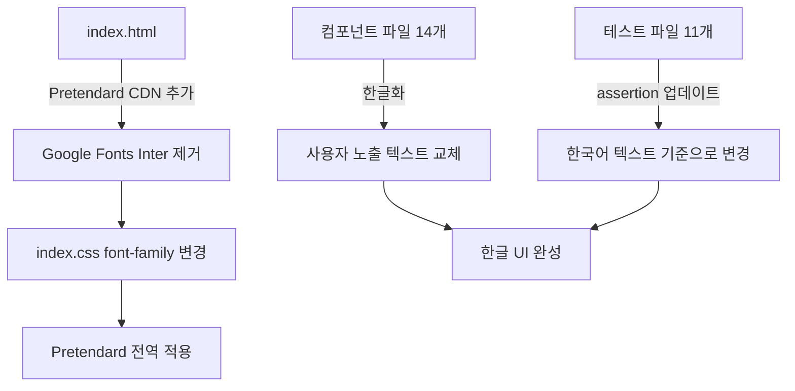
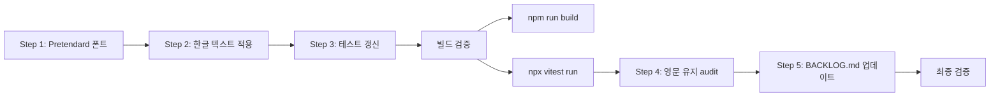

# Plan 66: Admin UI 전면 한글화 + Pretendard 폰트 적용

> **보정사항 반영** (사용자 검토 후)
> 1. `Reconciliation` → `정합성 점검` (정산→정합성 점검)
> 2. `ACTIVE` → `활성` (서비스→활성)
> 3. `YES/NO` → `허용/차단`은 문맥별 적용, 기계적 적용 금지
> 4. Pretendard fallback + mono 영역 유지 확인
> 5. 남은 개발 항목은 `plans/admin_ui_remaining_work.md` 대신 `BACKLOG.md`에 정리

## 목표

Admin UI의 모든 사용자 노출 텍스트를 한국어로 통일하고, 한글 UI 폰트를 Pretendard로 변경한다. 코드성 식별자(account_code, UUID, ticker/symbol, API field name 등)는 영문을 유지한다. Admin UI 관련 마지막 작업으로, 기능 추가나 리디자인은 포함하지 않는다.

---

## 변경 금지 사항

- **Backend contract 변경 금지**: Pydantic schema, route signature, API response field명은 절대 변경하지 않음
- **전체 리디자인 금지**: Tailwind 클래스, 레이아웃 구조, 색상 테마는 변경하지 않음
- **Write 기능 추가 금지**: Read-only 상태 유지

---

## 아키텍처 개요



---

## Step 1: Pretendard 폰트 적용

### 1-1. `index.html` — Google Fonts Inter 제거 + Pretendard CDN 추가

**현재** ([`admin_ui/index.html:9`](../admin_ui/index.html:9)):
```html
<link href="https://fonts.googleapis.com/css2?family=Inter:wght@400;500;600;700&display=swap" rel="stylesheet" />
```

**변경**:
```html
<link rel="stylesheet" as="style" crossorigin href="https://cdn.jsdelivr.net/gh/orioncactus/pretendard@v1.3.9/dist/web/variable/pretendardvariable-dynamic-subset.css" />
```

### 1-2. `index.css` — font-family 변경

**현재** ([`admin_ui/src/index.css:38`](../admin_ui/src/index.css:38)):
```css
--font-sans: 'Inter', system-ui, sans-serif;
```

**변경**:
```css
--font-sans: 'Pretendard', system-ui, sans-serif;
```

### 1-3. Pretendard fallback + mono 영역 확인

- `--font-sans`에 `system-ui, sans-serif` fallback이 이미 존재하므로 유지
- `font-mono` 클래스 사용 영역은 tailwind 기본 `mono` 스택 유지 (Pretendard 영향 없음)
- `<code>`, `<pre>`, `font-mono`를 사용하는 코드 식별자 영역은 Pretendard 적용 안 됨 (의도적)

---

## Step 2: 번역 대상 전체 스캔 결과 — 변경 매트릭스

### 2-1. `Layout.tsx` — 네비게이션 메뉴

| 파일 | 대상 (원본) | 변경 후 | 비고 |
|------|------------|---------|------|
| [`Layout.tsx:128`](../admin_ui/src/components/Layout.tsx:128) | `"ACTIVE"` | `"활성"` | 섹션 제목 (상태 의미 유지) |
| [`Layout.tsx:129`](../admin_ui/src/components/Layout.tsx:129) | `"RESERVED"` | `"예정"` | 섹션 제목 |
| [`Layout.tsx:130`](../admin_ui/src/components/Layout.tsx:130) | `"Overview"` | `"개요"` | 네비게이션 항목 |
| [`Layout.tsx:131`](../admin_ui/src/components/Layout.tsx:131) | `"Orders"` | `"주문"` | 네비게이션 항목 |
| [`Layout.tsx:132`](../admin_ui/src/components/Layout.tsx:132) | `"Reconciliation"` | `"정합성 점검"` | 네비게이션 항목 |
| [`Layout.tsx:133`](../admin_ui/src/components/Layout.tsx:133) | `"Accounts"` | `"계좌"` | 네비게이션 항목 |
| [`Layout.tsx:134`](../admin_ui/src/components/Layout.tsx:134) | `"Decisions"` | `"의사결정"` | 네비게이션 항목 |
| [`Layout.tsx:135`](../admin_ui/src/components/Layout.tsx:135) | `"Agent Runs"` | `"에이전트 실행"` | 네비게이션 항목 |
| [`Layout.tsx:137`](../admin_ui/src/components/Layout.tsx:137) | `"Broker"` | `"브로커"` | 네비게이션 항목 |
| [`Layout.tsx:138`](../admin_ui/src/components/Layout.tsx:138) | `"System"` | `"시스템"` | 네비게이션 항목 |
| [`Layout.tsx:139`](../admin_ui/src/components/Layout.tsx:139) | `"Admin"` | `"관리자"` | 네비게이션 항목 |

### 2-2. `LoginForm.tsx` — 로그인 페이지

| 대상 (원본) | 변경 후 | 라인 |
|------------|---------|------|
| `"Admin Console"` | `"관리자 콘솔"` | 64 |
| `"Inspection Dashboard"` | `"운영 대시보드"` | 65 |
| multi-line description | `"INSPECTION_API_TOKEN을 입력하여 대시보드에 접속하세요. 이 토큰은 세션에만 저장되며 로그아웃 또는 탭 종료 시 제거됩니다."` | 69-72 |
| `"Bearer Token"` | `"인증 토큰"` | 84 |
| `"Paste your token here..."` | `"토큰을 입력하세요..."` | 89 |
| `"Enter Dashboard"` | `"대시보드 진입"` | 102 |
| `"Verifying..."` | `"확인 중..."` | 102 |
| `"Token cannot be empty."` | `"토큰이 비어 있습니다."` | 18 |
| `"Invalid token. The server rejected the authorization."` | `"유효하지 않은 토큰입니다. 서버가 인증을 거부했습니다."` | 44 |
| `"Cannot connect to server. Is the API running?"` | `"서버에 연결할 수 없습니다. API가 실행 중인지 확인하세요."` | 48 |

### 2-3. `Dashboard.tsx` — 대시보드

| 대상 (원본) | 변경 후 | 비고 |
|------------|---------|------|
| `"Overview"` | `"개요"` | page title |
| `"Total Accounts"` | `"전체 계좌"` | metric card |
| `"Total Positions"` | `"전체 포지션"` | metric card |
| `"Total Cash Balance"` | `"전체 현금 잔고"` | metric card |
| `"Total Orders"` | `"전체 주문"` | metric card |
| `"Avg Confidence"` | `"평균 신뢰도"` | metric card |
| `"Account"` | `"계좌"` | table header |
| `"Positions"` | `"포지션"` | table header |
| `"Cash Balance"` | `"현금 잔고"` | table header |
| `"Orders"` | `"주문"` | table header |
| `"Status"` | `"상태"` | table header |
| `"Recent Orders"` | `"최근 주문"` | section title |
| `"Order ID"` | `"주문 ID"` | table header |
| `"Symbol"` | `"종목"` | table header |
| `"Side"` | `"매매방향"` | table header |
| `"Qty"` | `"수량"` | table header |
| `"Created"` | `"생성일"` | table header |
| `"Active Account Locks"` | `"계좌 잠금"` | section title |
| `"Type"` | `"유형"` | table header |
| `"Strategy"` | `"전략"` | table header |
| `"Acquired"` | `"획득 시각"` | table header |
| `"Expires"` | `"만료 시각"` | table header |
| `"No orders found."` | `"주문이 없습니다."` | empty state |
| `"No active locks."` | `"활성 잠금이 없습니다."` | empty state |
| `"Go to Accounts"` | `"계좌로 이동"` | button |
| `"Updated at"` | `"업데이트"` | freshness ("업데이트 HH:mm:ss") |

### 2-4. `OrdersView.tsx` — 주문 목록

| 대상 (원본) | 변경 후 | 라인 |
|------------|---------|------|
| `"Orders"` | `"주문"` | 75 |
| `"View order lifecycle, broker mapping, and decision lineage"` | `"주문 생애주기, 브로커 매핑, 의사결정 이력을 확인합니다."` | 76 |
| `"Search symbol or order ID..."` | `"종목 또는 주문 ID 검색..."` | 83 |
| `"Status"` | `"상태"` | 89 (filter label) |
| `"Filled"` | `"체결"` | 91 (filter option) |
| `"Pending"` | `"대기"` | 92 |
| `"Rejected"` | `"거부"` | 93 |
| `"Partial"` | `"부분체결"` | 94 |
| `"Submitted"` | `"제출"` | 95 |
| `"Cancelled"` | `"취소"` | 96 |
| `"Side"` | `"매매방향"` | 102 (filter label) |
| `"Buy"` | `"매수"` | 105 |
| `"Sell"` | `"매도"` | 106 |
| `"Order Detail"` | `"주문 상세"` | 139 |
| `"Symbol"` | `"종목"` | 153 |
| `"Quantity"` | `"수량"` | 161 |
| `"Client Order ID"` | `"클라이언트 주문 ID"` | 169 |
| `"Created"` | `"생성일"` | 173 |
| `"View full details →"` | `"전체 상세 보기 →"` | 182 |
| `"No orders found."` | `"주문이 없습니다."` | 130 |

**영문 유지**: filter option value `buy`/`sell` (API 필드값), `filled`/`pending`/`rejected` 등 status enum 값

### 2-5. `OrderDetail.tsx` — 주문 상세

| 대상 (원본) | 변경 후 | 라인 |
|------------|---------|------|
| `"Back to Orders"` | `"주문 목록으로"` | 79 |
| `"Order Detail"` | `"주문 상세"` | 86 |
| `"Order Type"` | `"주문 유형"` | 112 |
| `"Qty"` | `"수량"` | 116 |
| `"Filled Qty"` | `"체결 수량"` | 120 |
| `"Avg Fill Price"` | `"평균 체결가"` | 124 |
| `"Updated"` | `"수정일"` | 136 |
| `"Error:"` | `"오류:"` | 143 |
| `"Decision Links"` | `"의사결정 연결"` | 150 |
| `"Context:"` | `"컨텍스트:"` | 154 |
| `"Decision:"` | `"의사결정:"` | 165 |
| `"State Events ({n})"` | `"상태 이벤트 ({n}건)"` | 181 |
| `"Broker Orders ({n})"` | `"브로커 주문 ({n}건)"` | 193 |
| `"No state events recorded."` | `"기록된 상태 이벤트가 없습니다."` | 186 |
| `"No broker orders."` | `"브로커 주문이 없습니다."` | 198 |
| `"Order not found."` | `"주문을 찾을 수 없습니다."` | 43 |

### 2-6. `AccountsView.tsx` — 계좌 목록

| 대상 (원본) | 변경 후 | 비고 |
|------------|---------|------|
| `"Accounts"` | `"계좌"` | page title |
| `"Monitor account positions, cash balances, and trading status"` | `"계좌 포지션, 현금 잔고, 거래 상태를 모니터링합니다."` | description |
| `"Search by account code or ID..."` | `"계좌 코드 또는 ID로 검색..."` | search placeholder |
| `"Type"` | `"유형"` | filter label |
| `"Margin"` | `"신용"` | filter option |
| `"Cash"` | `"현금"` | filter option |
| `"Account Code"` | `"계좌 코드"` | table header |
| `"Type"` | `"유형"` | table header |
| `"Strategy"` | `"전략"` | table header |
| `"Value"` | `"평가액"` | table header |
| `"Positions"` | `"포지션"` | table header |
| `"Account ID"` | `"계좌 ID"` | detail label |
| `"Cash Balance"` | `"현금 잔고"` | section header |
| `"Snapshot:"` | `"스냅샷:"` | snapshot text |
| `"Qty"` | `"수량"` | position table header |
| `"Entry"` | `"매입가"` | position table header |
| `"P&L"` | `"손익"` | position table header |
| `"No accounts found."` | `"계좌가 없습니다."` | empty state |
| `"Select an account to view details"` | `"계좌를 선택하면 상세 정보를 볼 수 있습니다."` | empty detail |
| `"This account is currently locked. ..."` | `"이 계좌는 현재 잠겨 있습니다. 거래 작업이 제한될 수 있습니다."` | locked warning |

**영문 유지**: `account_code` 값 (API 필드값), UUID, `type` 값 (`margin`/`cash`), `status` 값

### 2-7. `DecisionsView.tsx` — 의사결정 목록

| 대상 (원본) | 변경 후 | 라인 |
|------------|---------|------|
| `"Decisions"` | `"의사결정"` | 148 |
| `"View AI trade decisions and related context"` | `"AI 트레이딩 의사결정 및 관련 컨텍스트를 확인합니다."` | 149 |
| `"Filtered by context:"` | `"컨텍스트 필터:"` | 155 |
| `"Clear context filter"` | `"컨텍스트 필터 해제"` | 164 (aria-label) |
| `"Search symbol or decision ID..."` | `"종목 또는 의사결정 ID 검색..."` | 176 |
| `"Side"` | `"매매방향"` | 182 (filter) |
| `"Buy"` | `"매수"` | 184 |
| `"Sell"` | `"매도"` | 185 |
| `"Hold"` | `"보유"` | 186 |
| `"Decision ID"` | `"의사결정 ID"` | 110 (table header) |
| `"Symbol"` | `"종목"` | 113 (table header) |
| `"Confidence"` | `"신뢰도"` | 125 (table header) |
| `"Reasoning"` | `"근거"` | 130 (table header) |
| `"Timestamp"` | `"시각"` | 135 (table header) |
| `"Decision Detail"` | `"의사결정 상세"` | 215 |
| `"Decision Type"` | `"의사결정 유형"` | 248 |
| `"Strategy ID"` | `"전략 ID"` | 252 |
| `"Qty"` | `"수량"` | 256 |
| `"Created"` | `"생성일"` | 260 |
| `"Context ID"` | `"컨텍스트 ID"` | 264 |
| `"Reason"` | `"사유"` | 277 |
| `"No reason provided."` | `"제공된 사유가 없습니다."` | 279 |
| `"Signals"` | `"시그널"` | 286 |
| `"Side Signal"` | `"매매방향 시그널"` | 293 |
| `"Confidence Score"` | `"신뢰도 점수"` | 301 |
| `"Quantity"` | `"수량"` | 305 |
| `"Market Context"` | `"시장 컨텍스트"` | 313 |
| `"Account ID"` | `"계좌 ID"` | 330 |
| `"Session ID"` | `"세션 ID"` | 334 |
| `"Config Version"` | `"설정 버전"` | 338 |
| `"Correlation ID"` | `"상관관계 ID"` | 342 |
| `"Market Timestamp"` | `"시장 시각"` | 346 |
| `"Loading context..."` | `"컨텍스트 로딩 중..."` | 316 |
| `"No trade decisions found."` | `"트레이딩 의사결정이 없습니다."` | 205 |
| `"Select a decision with context to view market data."` | `"컨텍스트가 있는 의사결정을 선택하면 시장 데이터를 볼 수 있습니다."` | 353 |

### 2-8. `AgentRunsView.tsx` + 하위 컴포넌트

| 대상 (원본) | 변경 후 | 파일:라인 |
|------------|---------|----------|
| `"Agent Runs"` | `"에이전트 실행"` | AgentRunsView.tsx:89 |
| `"Review AI execution traces for trading decisions"` | `"트레이딩 의사결정을 위한 AI 실행 내역을 확인합니다."` | AgentRunsView.tsx:90-92 |
| `"Search by Decision Context ID or Agent Run ID..."` | `"의사결정 컨텍스트 ID 또는 에이전트 실행 ID 검색..."` | AgentRunsView.tsx:102 |
| `"Agent Type"` | `"에이전트 유형"` | AgentRunsView.tsx:112 |
| `"All"` | `"전체"` | AgentRunsView.tsx:121 |
| `"Event Interpretation (EI)"` | `"이벤트 해석 (EI)"` | AgentRunsView.tsx:122 |
| `"AI Risk (AR)"` | `"AI 리스크 (AR)"` | AgentRunsView.tsx:123 |
| `"Final Decision Composer (FDC)"` | `"최종 의사결정 구성 (FDC)"` | AgentRunsView.tsx:124 |
| `"Status"` | `"상태"` | AgentRunsView.tsx:129 |
| `"Completed"` | `"완료"` | AgentRunsView.tsx:139 |
| `"Running"` | `"실행 중"` | AgentRunsView.tsx:140 |
| `"Failed"` | `"실패"` | AgentRunsView.tsx:141 |
| `"{n} result{s}"` | `"{n}개 결과"` | AgentRunsView.tsx:147 |
| `"Loading agent runs..."` | `"에이전트 실행 내역 로딩 중..."` | AgentRunsView.tsx:70 |
| `"No agent runs found"` | `"에이전트 실행 내역이 없습니다."` | AgentRunsTable.tsx:41 |
| `"Decision Context"` | `"의사결정 컨텍스트"` | AgentRunsTable.tsx:59 |
| `"Started"` | `"시작 시각"` | AgentRunsTable.tsx:62 |
| `"Summary"` | `"요약"` | AgentRunsTable.tsx:65 |
| `"Select an agent run to view details"` | `"에이전트 실행을 선택하면 상세 정보를 볼 수 있습니다."` | AgentRunDetailPanel.tsx:41 |
| `"Metadata"` | `"메타데이터"` | AgentRunDetailPanel.tsx:88 |
| `"Agent Run ID"` | `"에이전트 실행 ID"` | AgentRunDetailPanel.tsx:90 |
| `"Agent Type"` | `"에이전트 유형"` | AgentRunDetailPanel.tsx:92 |
| `"Started At"` | `"시작 시각"` | AgentRunDetailPanel.tsx:94 |
| `"Completed At"` | `"완료 시각"` | AgentRunDetailPanel.tsx:96 |
| `"Model ID"` | `"모델 ID"` | AgentRunDetailPanel.tsx:99 |
| `"Prompt ID"` | `"프롬프트 ID"` | AgentRunDetailPanel.tsx:100 |
| `"Temperature"` | `"온도"` | AgentRunDetailPanel.tsx:101 |
| `"Seed"` | `"시드"` | AgentRunDetailPanel.tsx:102 |
| `"Structured Output"` | `"구조화된 출력"` | AgentRunDetailPanel.tsx:109 |
| `"Raw Output"` | `"원시 출력"` | AgentRunDetailPanel.tsx:159 |
| `"No structured output available"` | `"구조화된 출력이 없습니다."` | AgentRunDetailPanel.tsx:168 |
| `"Copy to clipboard"` | `"클립보드에 복사"` | AgentRunDetailPanel.tsx:69 (title) |

### 2-9. `AgentRunsPanel.tsx` (DecisionsView 내부)

| 대상 (원본) | 변경 후 | 라인 |
|------------|---------|------|
| `"Agent Runs"` | `"에이전트 실행"` | 91, 103, 112, 123, 134 |
| `"Select a decision to view AI agent execution details."` | `"의사결정을 선택하면 AI 에이전트 실행 내역을 볼 수 있습니다."` | 93-94 |
| `"No agent runs recorded for this decision context."` | `"이 의사결정 컨텍스트에 대한 에이전트 실행이 없습니다."` | 125-126 |
| `"Hide raw output"` | `"원시 출력 숨기기"` | 183 |
| `"Show raw output"` | `"원시 출력 보기"` | 183 |

### 2-10. `BrokerCapacityPanel.tsx`

| 대상 (원본) | 변경 후 | 라인 |
|------------|---------|------|
| `"Broker Capacity"` | `"브로커 용량"` | implied section title |
| `"Broker"` | `"브로커"` | display label |
| `"Environment"` | `"환경"` | display label |
| `"REST Budget"` | `"REST 할당량"` | display label |
| `"Snapshot at"` | `"스냅샷"` | freshness ("스냅샷 HH:mm:ss") |
| `"Retry"` | `"재시도"` | button |
| 503 title | `"브로커 어댑터가 구성되지 않음"` | 125 |
| 503 message | `"브로커 어댑터가 구성되지 않아 브로커 용량 정보를 사용할 수 없습니다."` | 126-127 |

**YES/NO 문맥별 적용**: `can_accept_new_entries` true/false에 해당하는 표시는 기존 `StatusBadge`의 variant 컨텍스트에 따라 처리. `StatusBadge` 자체는 variant prop만 받고 children을 외부에서 주입하므로, BrokerCapacityPanel 내부에서 `"YES"`/`"NO"`를 `"허용"`/`"차단"`으로 변경하되 badge의 색상(variant)는 유지.

**영문 유지**: `rest_budget` 키 이름, `max_rest_rps`, `ws_connected` 필드명

### 2-11. `ReconciliationView.tsx`

| 대상 (원본) | 변경 후 | 라인 |
|------------|---------|------|
| `"Reconciliation"` | `"정합성 점검"` | 96 |
| `"Monitor uncertain states, reconciliation runs, and active locks"` | `"불확실 상태, 정합성 점검 실행, 활성 잠금을 모니터링합니다."` | 97 |
| `"Active Locks"` | `"활성 잠금"` | 111 |
| `"Reconciliation Runs"` | `"정합성 점검 실행"` | 158 |
| `"Run ID"` | `"실행 ID"` | 65 (table header) |
| `"Date"` | `"날짜"` | 72 (table header) |
| `"Time"` | `"시각"` | 77 (table header) |
| `"Order Mismatches"` | `"주문 불일치"` | 85 (table header) |
| `"Position Mismatches"` | `"포지션 불일치"` | 86 (table header) |
| `"Run Detail"` | `"실행 상세"` | 203 |
| `"All positions matched successfully."` | `"모든 포지션이 성공적으로 일치했습니다."` | 250 |
| `"Mismatches require review."` | `"불일치 항목 검토가 필요합니다."` | 257 |
| `"No blocking locks found."` | `"차단 잠금이 없습니다."` | 114 |
| `"No reconciliation runs found."` | `"정합성 점검 실행이 없습니다."` | 194 |
| `"{n} Active Blocking Lock{s}"` | `"활성 차단 잠금 {n}개"` | 104 |
| `"These may block trading operations. ..."` | `"거래 작업을 차단할 수 있습니다. 새 주문을 제출하기 전에 잠금을 해결하세요."` | 105 |

### 2-12. 공통 컴포넌트

| 컴포넌트 | 대상 (원본) | 변경 후 |
|---------|------------|---------|
| `FilterBar.tsx` | `"Clear"` | `"초기화"` |
| `FilterBar.tsx` | default `"Search..."` | `"검색..."` |
| `DataTable.tsx` | `"Loading..."` | `"로딩 중..."` |
| `DataTable.tsx` | default `"No data available."` | `"데이터가 없습니다."` |
| `LoadingSpinner.tsx` | default `"Loading..."` | `"로딩 중..."` |

---

## Step 3: 테스트 파일 갱신 (11개 파일)

모든 `getByText`, `getAllByText`, `toHaveTextContent` assertion을 한국어 기준으로 변경. 정규식 패턴도 한국어로 변경 (예: `/Updated at/` → `/업데이트/`).

| 테스트 파일 | 주요 변경 사항 |
|------------|--------------|
| [`dashboard.test.tsx`](../admin_ui/src/__tests__/dashboard.test.tsx) | `getByText(/Updated at/)` → `getByText(/업데이트/)`, `"No orders found."` → `"주문이 없습니다."`, `"Go to Accounts"` → `"계좌로 이동"` |
| [`BrokerCapacityPanel.test.tsx`](../admin_ui/src/__tests__/BrokerCapacityPanel.test.tsx) | `getByText(/Snapshot at/)` → `getByText(/스냅샷/)`, `"YES"` → `"허용"`, `"NO"` → `"차단"` |
| [`accounts.test.tsx`](../admin_ui/src/__tests__/accounts.test.tsx) | `getAllByText(/^Snapshot:/)` → `getAllByText(/^스냅샷:/)`, `"Margin"` → `"신용"`, `"Cash"` → `"현금"` |
| [`decisions.test.tsx`](../admin_ui/src/__tests__/decisions.test.tsx) | `"Decisions"` → `"의사결정"`, `"Decision Detail"` → `"의사결정 상세"`, `"No trade decisions found."` → `"트레이딩 의사결정이 없습니다."` |
| [`orders.test.tsx`](../admin_ui/src/__tests__/orders.test.tsx) | `"Orders"` → `"주문"`, `"No orders found."` → `"주문이 없습니다."` |
| [`reconciliation.test.tsx`](../admin_ui/src/__tests__/reconciliation.test.tsx) | `"Reconciliation"` → `"정합성 점검"`, `"Active Locks"` → `"활성 잠금"` |
| [`agentRuns.test.tsx`](../admin_ui/src/__tests__/agentRuns.test.tsx) | `"Agent Runs"` → `"에이전트 실행"`, `"No agent runs found"` → `"에이전트 실행 내역이 없습니다."` |
| [`layout.test.tsx`](../admin_ui/src/__tests__/layout.test.tsx) | `"Overview"` → `"개요"`, `"Orders"` → `"주문"`, `"Reconciliation"` → `"정합성 점검"` |
| [`auth.test.tsx`](../admin_ui/src/__tests__/auth.test.tsx) | `"Admin Console"` → `"관리자 콘솔"`, `"Enter Dashboard"` → `"대시보드 진입"`, `"Bearer Token"` → `"인증 토큰"` |
| [`orderDetail.test.tsx`](../admin_ui/src/__tests__/orderDetail.test.tsx) | `"Order Detail"` → `"주문 상세"`, `"Back to Orders"` → `"주문 목록으로"` |
| [`components.test.tsx`](../admin_ui/src/__tests__/components.test.tsx) | `"Loading..."` → `"로딩 중..."`, `"No data available."` → `"데이터가 없습니다."`, `"Clear"` → `"초기화"` |

---

## Step 4: 영문 유지 확인 리스트

변경 과정에서 실수로 한글화하면 안 되는 항목들을 반드시 확인한다.

| 항목 | 예시 | 이유 |
|------|------|------|
| API field명 | `trade_decision_id`, `order_request_id`, `symbol`, `side` | Backend contract |
| UUID | `"a1b2c3d4-..."` | 기술 식별자 |
| API enum 값 | `"buy"`, `"sell"`, `"hold"`, `"filled"`, `"pending"` | API enum |
| 계좌 코드 | `account_code` 값 | 시스템 식별자 |
| ticker/symbol | `"AAPL"`, `"005930"` | 시장 식별자 |
| badge 약어 | `"EI"`, `"AR"`, `"FDC"` | 약어 유지 |
| HTML/CSS 클래스 | `className` 값들 | Tailwind 유지 |
| `font-mono` 영역 | `<code>`, `<pre>` 블록 | Pretendard 비적용 (의도적) |
| `StatusDot` label | `"API"`, `"WS"` | 시스템 식별자 |

---

## Step 5: `BACKLOG.md` 업데이트

[`plans/BACKLOG.md`](../plans/BACKLOG.md) 파일에 Admin UI 작업 완료 후 남은 개발 항목을 정리한다.

### 추가할 내용
1. Admin UI Phase 2 — write/patch 작업 (주문 상태 변경, 잠금 해제 등)
2. API 확장 (Plan 40 Phase 2)
3. Postgres-backed API mode
4. KIS 실통신 + combined submit smoke
5. E2E 테스트 고도화
6. Admin UI 비기능 개선 후보
7. Observability / 운영 도구

---

## 실행 순서 (Code 모드)



1. **Step 1**: [`index.html`](../admin_ui/index.html:9) + [`index.css`](../admin_ui/src/index.css:38) — Pretendard CDN 추가, font-family 변경
2. **Step 2**: 모든 컴포넌트 파일 한국어 번역 적용 (위 매트릭스 기준, 보정사항 반영)
3. **Step 3**: 모든 테스트 파일 assertion 한국어로 변경
4. **Build 검증**: `cd admin_ui && npm run build && npx vitest run`
5. **Step 4**: 영문 유지 감사 — 코드 식별자가 모두 영문으로 남았는지 확인
6. **Step 5**: [`BACKLOG.md`](../plans/BACKLOG.md) 업데이트

---

## 최종 검증 기준

1. `npm run build` (tsc -b && vite build) 통과
2. `npx vitest run` 80개 전 테스트 통과
3. 브라우저 렌더링 시 모든 사용자 노출 텍스트가 한국어로 표시
4. 코드 식별자(account_code, UUID, symbol/ticker, API field명)는 영문 유지
5. 폰트가 Pretendard로 적용됨 (mono 영역은 `font-mono` 스택 유지)
6. Backend pytest (`cd /workspace/agent_trading && python -m pytest tests/api/ -v`) 통과
