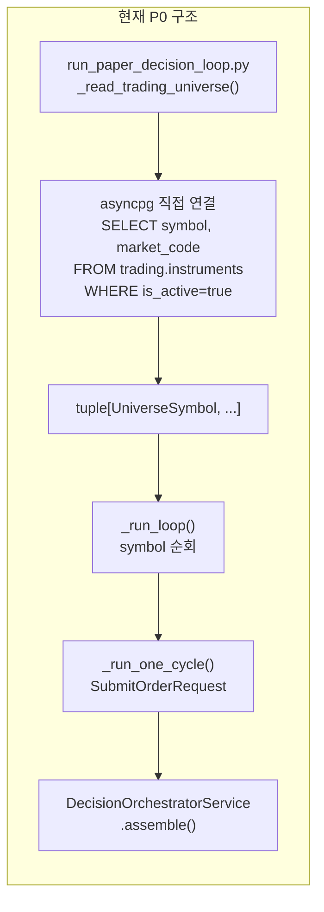
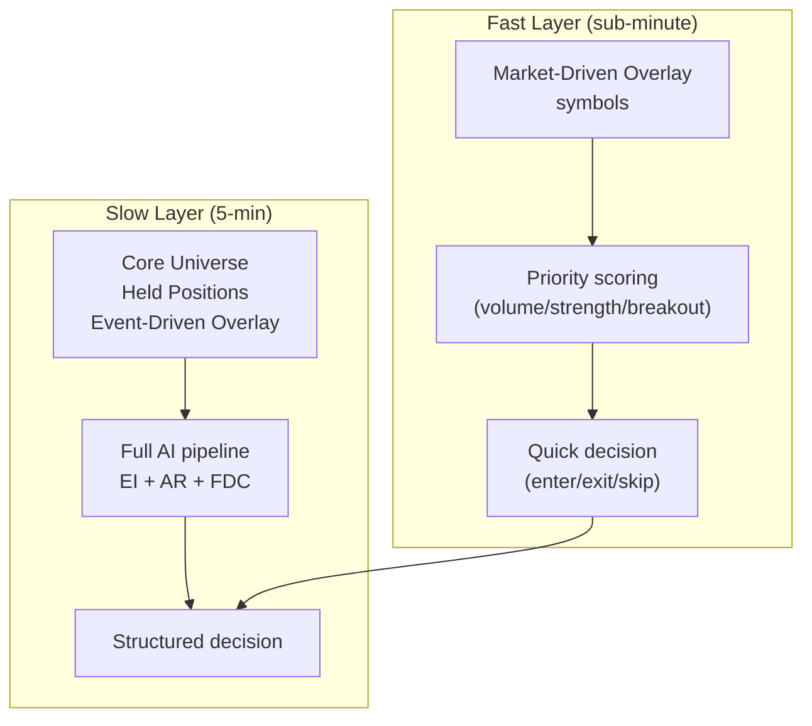
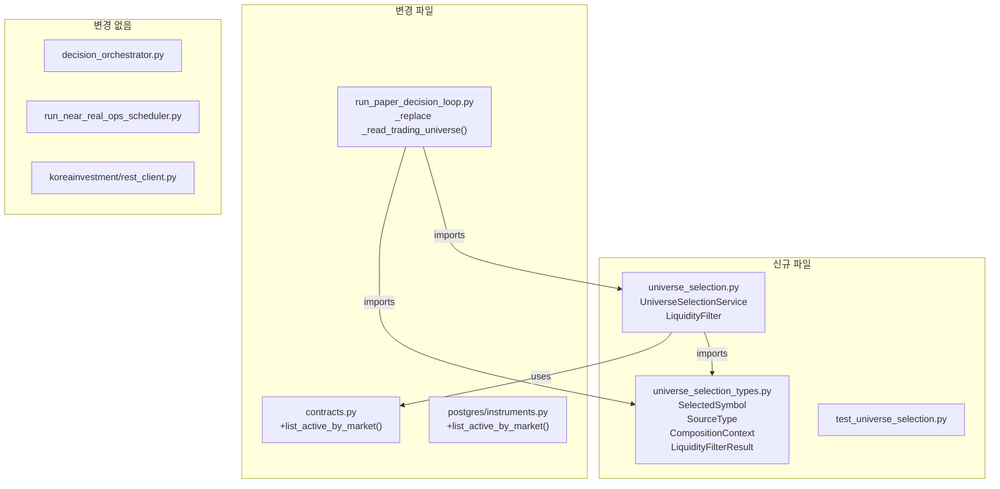
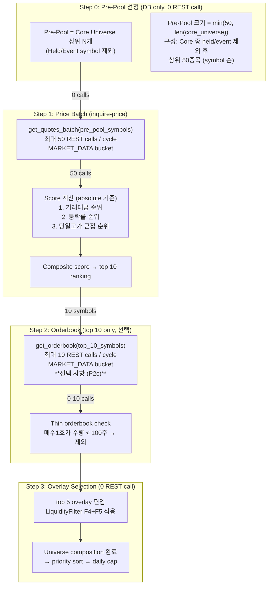
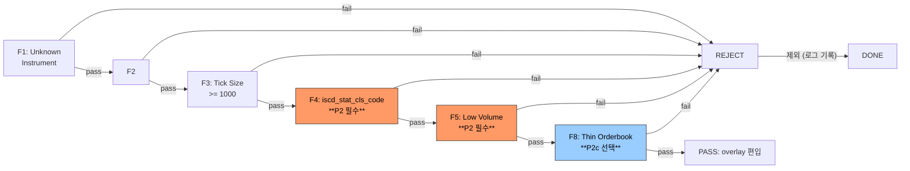
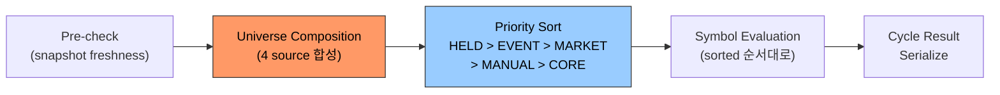
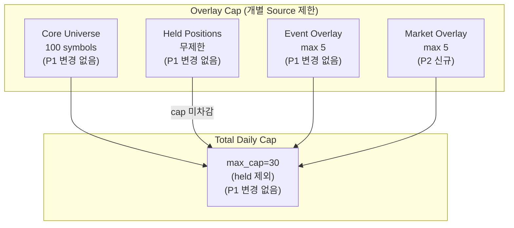

# Universe Selection Service 설계

> 이 문서는 Universe Selection Service의 P1/P2 설계를 통합한 기준 문서다.
> 
> 구성:
> - Part 1: P1 설계
> - Part 2: P2 Market-Driven Overlay 확장 설계

---

## Part 1. P1 설계

> **목적**: `plans/[POLICY] trading_universe_policy_v1.md` V1.1 정책과 `plans/[BACKLOG] backlog.md` #28, #30을 코드로 옮기기 위한 설계.  
> **상태**: ❌ 미구현 — 이 문서는 설계 및 변경 범위 고정이 목적  
> **참조**: [`[POLICY] trading_universe_policy_v1.md`](plans/[POLICY]%20trading_universe_policy_v1.md), [`[BACKLOG] backlog.md` #28](plans/[BACKLOG] backlog.md#L90), [`[BACKLOG] backlog.md` #30](plans/[BACKLOG] backlog.md#L92)  
> **기준 코드**: [`run_paper_decision_loop.py`](scripts/run_paper_decision_loop.py), [`contracts.py`](src/agent_trading/repositories/contracts.py), [`decision_orchestrator.py`](src/agent_trading/services/decision_orchestrator.py), [`rest_client.py`](src/agent_trading/brokers/koreainvestment/rest_client.py)

---

## 목차

1. [목표 및 비목표](#1-목표-및-비목표)
2. [현재 구조의 한계](#2-현재-구조의-한계)
3. [입력 소스 정의](#3-입력-소스-정의)
4. [합성 규칙](#4-합성-규칙)
5. [Liquidity Filter 설계](#5-liquidity-filter-설계)
6. [Inclusion Reason / source_type 데이터 모델](#6-inclusion-reason--source_type-데이터-모델)
7. [Fast Layer / Slow Layer 정책](#7-fast-layer--slow-layer-정책)
8. [권장 코드 변경 사항](#8-권장-코드-변경-사항)
9. [P1 최소 구현 범위](#9-p1-최소-구현-범위)
10. [P2+ 확장 방향](#10-p2-확장-방향)
11. [위험 및 검증 계획](#11-위험-및-검증-계획)

---

## 1. 목표 및 비목표

### 목표 (P1 Scope)

| # | 목표 | 세부 |
|---|------|------|
| G1 | `Instrument Master` ↔ `Trading Universe` 명시적 분리 | 현재 `_read_trading_universe()`가 직접 DB 조회 + 단순 fallback. 이를 전용 Service 계층으로 분리 |
| G2 | 4개 입력 소스 합성 | Core Universe + Held Positions + Event-Driven Overlay + Market-Driven Overlay |
| G3 | Market-Driven Overlay 기반 설계 | KIS ranking API 인터페이스 정의 (실제 API 연동은 P2) |
| G4 | Liquidity Filter 구현 | Tick size / volume / market cap / micro-cap / 이상체결 deterministic pre-gate |
| G5 | Inclusion Reason / source_type 기록 | 최종 Universe 심볼별 `source_type`과 `inclusion_reason`을 `UniverseSymbol`에 반영 |
| G6 | Fast Layer / Slow Layer Policy 정의 | Market-driven 종목은 Fast Layer 우선 scoring. Core/Event-driven 종목은 Slow Layer |
| G7 | Daily Cap + Budget Preservation 유지 | 기존 예산 정책 변경 없음 |

### 비목표 (P1에서 하지 않을 것)

- ❌ 실제 KIS ranking API HTTP 연동 (인터페이스 정의만, stub 구현)
- ❌ AI 기반 universe scoring (P2)
- ❌ Strategy Relevance Filter (Layer 3) 알고리즘 구현
- ❌ `ExternalEventRepository` polling worker 구현 (기존 foundation 그대로 사용)
- ❌ 신규 DB migration (code-level selector로 P1 구현, P2에서 DB 스키마 검토)
- ❌ Admin UI universe 상태 표시

---

## 2. 현재 구조의 한계

### 2.1 실행 경로 분석



### 2.2 구체적 한계점

| # | 한계 | 영향 | 관련 코드 |
|---|------|------|-----------|
| L1 | `_read_trading_universe()`가 DB의 **모든** active KRX 종목을 무조건 로드 | 선택/필터링 없이 100종목 전량 투입 | [`_read_trading_universe()`](scripts/run_paper_decision_loop.py:189) |
| L2 | inclusion reason / source_type 미존재 | 어떤 종목이 왜 universe에 포함됐는지 추적 불가 | [`UniverseSymbol`](scripts/run_paper_decision_loop.py:86) (symbol, market만 있음) |
| L3 | KIS ranking API 미연동 | Market-Driven Overlay (거래량 급증, 체결강도, 신고가 등) 구현 불가 | [`KIS_ENDPOINTS`](src/agent_trading/brokers/koreainvestment/rest_client.py:51) |
| L4 | Liquidity Filter 부재 | 저유동성/이상체결 종목이 그대로 decision loop 진입 | [`InstrumentRepository`](src/agent_trading/repositories/contracts.py:179) |
| L5 | Fast/Slow Layer 미분리 | 모든 종목이 동일한 5분 주기로 평가 | [`_run_loop()`](scripts/run_paper_decision_loop.py:572) |
| L6 | `InstrumentRepository.list_active_by_market()` 미구현 | `_read_trading_universe()`가 raw asyncpg로 우회 | [`PostgresInstrumentRepository`](src/agent_trading/repositories/postgres/instruments.py:11) |
| L7 | `_read_trading_universe()`가 script 레벨 함수 | 재사용 불가. Scheduler/API에서 universe 조회 불가 | [`_read_trading_universe()`](scripts/run_paper_decision_loop.py:189) |

---

## 3. 입력 소스 정의

### 3.1 Core Universe

| 항목 | 값 |
|------|-----|
| **정의** | 전략이 항상 평가해야 하는 기준 종목 집합 |
| **P1 데이터** | `trading.instruments` + metadata / 후속 정식 컬럼 (`exchange_code`, `market_segment`, `index_memberships`) |
| **조건** | `exchange_code='KRX'`, `market_segment='KOSPI'|'KOSDAQ'`, `index_memberships` 또는 explicit core flag |
| **갱신 주기** | Slow Layer (매 cycle 5분) |
| **출처** | `InstrumentRepository` + canonical instrument metadata |

추가 설계 원칙:

- Universe Selection은 `instrument master`를 authoritative source로 사용한다.
- master에 없는 종목은 `unknown_instrument`로 제외하며 decision loop까지 올리지 않는다.
- 따라서 KOSDAQ 종목 편입은 universe 예외 처리로 풀지 않고,
  먼저 KIS 종목정보파일 기반 sync로 `trading.instruments`를 채운 뒤 진행한다.
- `KRX`는 제거 대상이 아니라 `exchange_code` 의미로 유지한다.
- `KOSPI/KOSDAQ`는 `market_segment`로 분리해 사용한다.
- `KOSPI100`, `KOSPI200`, `KOSDAQ50`, `KOSDAQ150`는
  bool 컬럼 난립보다 `index_memberships` authoritative source로 관리한다.
- instrument master sync는 국내주식 입력을 저장 시
  `market_code='KRX'` canonical row로 수렴시키고,
  `KOSPI/KOSDAQ`는 `market_segment` 및 metadata로만 유지한다.
  따라서 Universe Selection은 `market_code`가 아니라
  `exchange_code + market_segment + index_memberships`를 기준으로 해석해야 한다.
- `index_memberships`는
  `trading.instrument_index_memberships` 시계열 테이블에 authoritative source를 두고,
  이행 기간에는 `metadata.index_memberships`를 read fallback으로 유지한다.
- 현재 이행 상태:
  - UniverseSelectionService는 core/discovery seed 판정 시
    `instrument_index_memberships`를 먼저 조회한다.
  - membership row가 없을 때만 `metadata.index_memberships` fallback을 사용한다.
  - `sell_guard`, `snapshot sync` 등 다른 read path는
    아직 canonical instrument lookup 중심이며, membership table 직접 참조는 후속 범위다.

### 3.2 Held Positions

| 항목 | 값 |
|------|-----|
| **정의** | 현재 계좌가 보유 중인 포지션. 매도/증분/관리 목적으로 반드시 universe에 포함 |
| **P1 데이터** | `PositionSnapshotRepository.list_latest_by_account()` |
| **조건** | quantity > 0인 모든 포지션 |
| **갱신 주기** | 매 cycle (snapshot sync 이후) |
| **비고** | 보유 종목은 `inclusion_reason='held_position'`으로 별도 표시. Cap에서 제외 (mandatory) |

### 3.3 Event-Driven Overlay

| 항목 | 값 |
|------|-----|
| **정의** | 외부 이벤트(OpenDART 공시, 뉴스, macro)가 발생한 종목. 중요 이벤트 발생 시 즉시 평가 대상 |
| **P1 데이터** | `ExternalEventRepository.list_by_symbol()` / `list_by_type()` |
| **조건** | `severity='high'` 또는 `direction != 'neutral'` 이벤트 발생 종목. P1에서는 단순 시간 기준 최근 N시간 |
| **갱신 주기** | Event ingestion loop 완료 후 (현재 5분). 향후 event-driven trigger |
| **비고** | P1에서는 `ExternalEventRepository` foundation protocol 사용. 실제 polling worker는 기존 그대로 |

### 3.4 Market-Driven Overlay

| 항목 | 값 |
|------|-----|
| **정의** | KIS ranking/분석 API 기반 시장 동향 (거래량 급증, 체결강도 상위, 신고가 근접, 가격/거래대금 돌파) |
| **P1 데이터** | **Stub 구현** — 실제 KIS API는 P2. P1에서는 Mock/stub data로 인터페이스만 검증 |
| **조건** | P1에서는 Core Universe 내에서 ranking 상위 N% |
| **갱신 주기** | Fast Layer (매 cycle 1분 이내). P1에서는 5분 유지 |
| **비고** | 이 소스가 Fast Layer의 핵심 트리거 |

### 3.5 소스 우선순위

```
Core Universe (base) 
  → Held Positions (mandatory override) 
  → Event-Driven Overlay (additive, severity 기준) 
  → Market-Driven Overlay (additive, ranking 기준)
  → Exclusion Rules (제외)
  → Priority Sort
  → Daily Cap
```

---

## 4. 합성 규칙

### 4.1 단계별 합성 절차

```
Step 1: Core Universe 로드 (DB canonical instrument: exchange_code + market_segment + index_memberships)
Step 2: Held Positions 로드 (account_id 기준)
Step 3: Event-Driven Overlay 로드 (since=last_event_ingestion, severity=high)
Step 4: Market-Driven Overlay 로드 (ranking API → top N)
Step 5: Exclusion Rules 적용 (is_active=false, 거래정지, 관리종목, micro-cap)
Step 6: Priority 정렬 (held > event > market > core)
Step 7: Daily Cap 적용 (cap=20-30, held 제외)
```

### 4.2 중복 처리 규칙

| 상황 | 처리 |
|------|------|
| 동일 symbol이 core + held | `source_type='held_position'` 우선. inclusion_reason 병합 |
| 동일 symbol이 core + event | `source_type='event_overlay'` 우선 (event가 override) |
| 동일 symbol이 core + market | `source_type='market_overlay'` 우선 |
| 동일 symbol이 event + market | `source_type='event_overlay'` 우선 (event 중요도 우선) |
| 동일 symbol이 held + anything | `source_type='held_position'` 최우선 (mandatory) |

### 4.3 Decision Loop 진입 규칙

```python
# Pseudo-code for universe composition
async def compose_universe(
    repos: RepositoryContainer,
    account_id: UUID,
    since: datetime,
    market_ranking_stub: list[str] | None = None,  # P2: actual KIS ranking
) -> list[SelectedSymbol]:
    seen: dict[str, SelectedSymbol] = {}
    
    # Step 1: Core Universe
    for inst in await repos.instruments.list_active_by_market("KRX"):
        seen[inst.symbol] = SelectedSymbol(
            symbol=inst.symbol,
            market=inst.market_code,
            source_type="core",
            inclusion_reason="kospi200_core",
        )
    
    # Step 2: Held Positions (mandatory override)
    for pos in await repos.positions.list_latest_by_account(account_id):
        if pos.quantity > 0:
            seen[pos.symbol] = SelectedSymbol(
                symbol=pos.symbol,
                market=pos.market_code,
                source_type="held_position",
                inclusion_reason="held_position_mandatory",
            )
    
    # Step 3: Event-Driven Overlay
    for event in await repos.external_events.list_by_type("disclosure", since):
        if event.symbol and event.symbol in seen:
            seen[event.symbol] = seen[event.symbol]._replace(
                source_type="event_overlay",
                inclusion_reason=f"high_importance_event:{event.event_type}",
            )
    
    # Step 4: Market-Driven Overlay (P1: stub, P2: KIS ranking)
    if market_ranking_stub:
        for sym in market_ranking_stub:
            if sym not in seen:
                seen[sym] = SelectedSymbol(
                    symbol=sym, market="KRX",
                    source_type="market_overlay",
                    inclusion_reason="volume_surge_ranking",
                )
    
    # Step 5: Exclusion Rules
    result = [s for s in seen.values() if await _pass_liquidity_filter(s, repos)]
    
    # Step 6: Priority Sort
    result.sort(key=_priority_key)
    
    # Step 7: Daily Cap (held excluded from cap count)
    capped = _apply_daily_cap(result, cap=30)
    return capped
```

---

## 5. Liquidity Filter 설계

### 5.1 필터 규칙 (Deterministic Pre-Gate)

| 규칙 | 조건 | 판정 |
|------|------|------|
| Instrument Master 등록 여부 | `(symbol, market_code)` 또는 한국주식 alias lookup 실패 | ❌ EXCLUDE |
| Tick Size Filter | `tick_size > (price * 0.001)` → 호가 단위가 가격 대비 너무 큼 | ❌ EXCLUDE |
| Accumulated Volume Filter | 최근 N일 평균 거래량 < threshold | ❌ EXCLUDE |
| Market Cap Floor | 시가총액 < threshold (KRX: 500억) | ❌ EXCLUDE |
| Micro-Cap Exclusion | 자본금 < threshold 또는 가격 < 1,000원 | ❌ EXCLUDE |
| Abnormal Execution Filter | 당일 거래량이 평균 대비 100배 초과 (이상체결 의심) | ❌ EXCLUDE |
| 거래정지/관리종목 | inquire-price 응답의 `iscd_stat_cls_code` 확인 | ❌ EXCLUDE |

### 5.2 P1 구현 범위

| 규칙 | P1 구현 | 데이터 출처 |
|------|---------|-------------|
| Instrument Master 등록 여부 | **구현** — 미등록 종목 hard exclude | `trading.instruments` |
| Tick Size Filter | **구현** — `InstrumentEntity.tick_size` 사용 | `trading.instruments` |
| Micro-Cap Exclusion | **구현** — 가격 < 1,000원 (최소 가격 기준) | KIS inquire-price (또는 stub) |
| 거래정지/관리종목 | **구현** — KIS inquire-price 응답 확인 (stub 가능) | KIS inquire-price |
| Accumulated Volume | **P2** — 거래량 이력 필요 | KIS ranking API |
| Market Cap Floor | **P2** — 시가총액 데이터 필요 | KIS 기본종목정보 |
| Abnormal Execution | **P2** — 이상체결 탐지 로직 | KIS 실시간/조회 |

### 5.3 인터페이스

```python
@dataclass(slots=True, frozen=True)
class LiquidityFilterResult:
    passed: bool
    fail_reason: str | None = None  # "tick_size_too_large" | "micro_cap" | "suspended" | ...

class LiquidityFilter(Protocol):
    async def check(self, symbol: str, market: str) -> LiquidityFilterResult:
        ...
```

---

## 6. Inclusion Reason / source_type 데이터 모델

### 6.1 `UniverseSymbol` 확장 (P1)

현재 [`UniverseSymbol`](scripts/run_paper_decision_loop.py:86)은 `symbol`, `market` 필드만 존재.  
P1에서 `source_type`과 `inclusion_reason`을 추가:

```python
@dataclass(slots=True, frozen=True)
class UniverseSymbol:
    symbol: str
    market: str = "KRX"
    source_type: str = "core"        # core | held_position | event_overlay | market_overlay | manual
    inclusion_reason: str = ""       # "kospi200_core" | "held_position_mandatory" | 
                                     # "high_importance_event:disclosure" | 
                                     # "volume_surge_top10" | "manual_watchlist"
    priority: int = 0                # Lower = higher priority (0=held, 1=event, 2=market, 3=manual, 4=core)
```

### 6.2 source_type enum 정의

```python
class SourceType(str, Enum):
    CORE = "core"                    # Core Universe (KOSPI200 등 기준)
    HELD_POSITION = "held_position"  # 보유 포지션 (mandatory)
    EVENT_OVERLAY = "event_overlay"  # Event-Driven (OpenDART 등)
    MARKET_OVERLAY = "market_overlay"  # Market-Driven (KIS ranking)
    MANUAL = "manual"                # 수동 watchlist (향후)
```

### 6.3 inclusion_reason 값 목록

| Reason 값 | source_type | 설명 |
|-----------|-------------|------|
| `kospi200_core` | core | KOSPI200 구성 종목 (P1: 전체 active KRX) |
| `held_position_mandatory` | held_position | 보유 포지션 (매도/증분 필요) |
| `high_importance_event:{event_type}` | event_overlay | 중요 공시/뉴스 발생 |
| `volume_surge_top10` | market_overlay | 거래량 급증 상위 |
| `trade_strength_top10` | market_overlay | 체결강도 상위 |
| `near_high_breakout` | market_overlay | 신고가 근접 |
| `price_volume_breakout` | market_overlay | 가격/거래대금 돌파 |
| `manual_watchlist` | manual | 운영자 수동 지정 |

---

## 7. Fast Layer / Slow Layer 정책

### 7.1 Layer 구분



### 7.2 P1 정책

| Layer | 대상 | 평가 주기 | AI Agent 호출 |
|-------|------|-----------|---------------|
| Fast Layer | `source_type='market_overlay'` | 매 cycle 우선 평가 (1분 목표) | Stub (지금과 동일) |
| Slow Layer | `source_type` in `core, held_position, event_overlay` | 5분 주기 | Full EI + AR + FDC |

### 7.3 Fast Layer 평가 규칙 (P1)

1. Market-Driven Overlay 편입 종목은 universe list에서 **앞쪽**에 배치 (`priority` 필드로 정렬)
2. Fast Layer 종목은 동일한 5분 cycle 내에서 먼저 평가
3. Fast Layer 종목이 Slow Layer 종목보다 **먼저** decision loop 진입
4. P1에서는 동일한 stub agent로 평가하지만, 실행 순서만 조정
5. P2에서 Fast Layer 전용 lightweight scoring 도입 검토

---

## 8. 권장 코드 변경 사항

### 8.1 파일별 변경 요약

```
신규 파일:
  src/agent_trading/services/universe_selection.py   (핵심)
  src/agent_trading/services/universe_selection_types.py  (dataclass)
  tests/services/test_universe_selection.py           (테스트)

변경 파일:
  src/agent_trading/repositories/contracts.py         (+ list_active_by_market, LiquidityFilter protocol)
  src/agent_trading/repositories/postgres/instruments.py  (+ list_active_by_market 구현)
  scripts/run_paper_decision_loop.py                  (_read_trading_universe → service 호출)
  src/agent_trading/domain/entities.py                (+ SourceType enum, optional)
  
참고만 (변경 불필요):
  src/agent_trading/services/decision_orchestrator.py   (변경 없음)
  scripts/run_near_real_ops_scheduler.py                (변경 없음)
  src/agent_trading/brokers/koreainvestment/rest_client.py (P2에서 ranking API 추가)
```

### 8.2 상세 변경 명세

#### 8.2.1 신규: `src/agent_trading/services/universe_selection_types.py`

```python
"""Universe Selection Service type definitions."""

from __future__ import annotations
from dataclasses import dataclass
from datetime import datetime
from decimal import Decimal
from enum import Enum
from uuid import UUID


class SourceType(str, Enum):
    CORE = "core"
    HELD_POSITION = "held_position"
    EVENT_OVERLAY = "event_overlay"
    MARKET_OVERLAY = "market_overlay"
    MANUAL = "manual"


@dataclass(slots=True, frozen=True)
class SelectedSymbol:
    symbol: str
    market: str
    source_type: SourceType
    inclusion_reason: str
    priority: int = 3  # 0=held(최우선) ~ 3=core(기본)


@dataclass(slots=True, frozen=True)
class CompositionContext:
    account_id: UUID
    since: datetime
    max_cap: int = 30
    exclude_held_from_cap: bool = True


@dataclass(slots=True, frozen=True)
class LiquidityFilterResult:
    passed: bool
    fail_reason: str | None = None
```

#### 8.2.2 신규: `src/agent_trading/services/universe_selection.py`

```python
"""Universe Selection Service — P1 implementation.

Separates instrument master → trading universe into a dedicated service layer.
Composes 4 input sources, applies Liquidity Filter, records inclusion reason/source_type.
"""

from __future__ import annotations

from agent_trading.repositories.container import RepositoryContainer
from agent_trading.services.universe_selection_types import (
    CompositionContext,
    LiquidityFilterResult,
    SelectedSymbol,
    SourceType,
)


class LiquidityFilter:
    """Deterministic pre-gate for universe candidates.
    
    P1 implements: tick_size filter, micro-cap exclusion, suspended/managed exclusion.
    P2 adds: accumulated volume, market cap floor, abnormal execution detection.
    """
    
    def __init__(self, repos: RepositoryContainer) -> None:
        self._repos = repos
    
    async def check(self, symbol: str, market: str) -> LiquidityFilterResult:
        instrument = await self._repos.instruments.get_by_symbol(symbol, market)
        if instrument is None:
            return LiquidityFilterResult(False, "unknown_instrument")
        if not instrument.is_active:
            return LiquidityFilterResult(False, "inactive_instrument")
        # P1 tick_size heuristic: exclude if tick_size > 1000 (micro-cap indicator)
        if instrument.tick_size is not None and instrument.tick_size >= Decimal("1000"):
            return LiquidityFilterResult(False, "tick_size_too_large")
        return LiquidityFilterResult(True)


class UniverseSelectionService:
    """Compose the trading universe from 4 input sources.
    
    Flow
    ----
    1. Core Universe (DB active KRX instruments)
    2. Held Positions (account positions, mandatory override)
    3. Event-Driven Overlay (ExternalEventRepository, severity=high)
    4. Market-Driven Overlay (KIS ranking stub, P2)
    5. Exclusion Rules (LiquidityFilter)
    6. Priority Sort
    7. Daily Cap
    """
    
    def __init__(
        self,
        repos: RepositoryContainer,
        liquidity_filter: LiquidityFilter | None = None,
    ) -> None:
        self._repos = repos
        self._liquidity_filter = liquidity_filter or LiquidityFilter(repos)
    
    async def compose(self, ctx: CompositionContext) -> list[SelectedSymbol]:
        """Compose the final trading universe for a single decision cycle."""
        seen: dict[str, SelectedSymbol] = {}
        
        # Step 1: Core Universe
        await self._add_core_universe(seen)
        
        # Step 2: Held Positions
        await self._add_held_positions(seen, ctx)
        
        # Step 3: Event-Driven Overlay
        await self._add_event_overlay(seen, ctx)
        
        # Step 4: Market-Driven Overlay (P1: stub)
        await self._add_market_overlay(seen, ctx)
        
        # Step 5: Exclusion Rules (Liquidity Filter)
        candidates = await self._apply_exclusions(seen)
        
        # Step 6: Priority Sort
        candidates.sort(key=lambda s: s.priority)
        
        # Step 7: Daily Cap
        return self._apply_cap(candidates, ctx)
    
    async def _add_core_universe(
        self, seen: dict[str, SelectedSymbol]
    ) -> None:
        instruments = await self._repos.instruments.list_active_by_market("KRX")
        for inst in instruments:
            if inst.symbol not in seen:
                seen[inst.symbol] = SelectedSymbol(
                    symbol=inst.symbol,
                    market=inst.market_code,
                    source_type=SourceType.CORE,
                    inclusion_reason="kospi200_core",
                    priority=3,
                )
    
    async def _add_held_positions(
        self, seen: dict[str, SelectedSymbol], ctx: CompositionContext
    ) -> None:
        positions = await self._repos.positions.list_latest_by_account(ctx.account_id)
        for pos in positions:
            if pos.quantity > 0:
                seen[pos.symbol] = SelectedSymbol(
                    symbol=pos.symbol,
                    market=pos.market_code or "KRX",
                    source_type=SourceType.HELD_POSITION,
                    inclusion_reason="held_position_mandatory",
                    priority=0,
                )
    
    async def _add_event_overlay(
        self, seen: dict[str, SelectedSymbol], ctx: CompositionContext
    ) -> None:
        events = await self._repos.external_events.list_by_type(
            "disclosure", ctx.since
        )
        for event in events:
            if event.symbol and event.severity == "high":
                seen[event.symbol] = SelectedSymbol(
                    symbol=event.symbol,
                    market=event.market or "KRX",
                    source_type=SourceType.EVENT_OVERLAY,
                    inclusion_reason=f"high_importance_event:{event.event_type}",
                    priority=1,
                )
    
    async def _add_market_overlay(
        self, seen: dict[str, SelectedSymbol], ctx: CompositionContext
    ) -> None:
        """P1 stub: no-op. P2 will call KIS ranking API here."""
        _ = ctx  # unused in P1
        pass
    
    async def _apply_exclusions(
        self, seen: dict[str, SelectedSymbol]
    ) -> list[SelectedSymbol]:
        result: list[SelectedSymbol] = []
        for sym in seen.values():
            lf = await self._liquidity_filter.check(sym.symbol, sym.market)
            if lf.passed:
                result.append(sym)
            else:
                logger.debug("Excluded %s/%s: %s", sym.symbol, sym.market, lf.fail_reason)
        return result
    
    @staticmethod
    def _apply_cap(
        candidates: list[SelectedSymbol], ctx: CompositionContext
    ) -> list[SelectedSymbol]:
        if not ctx.exclude_held_from_cap:
            return candidates[:ctx.max_cap]
        
        capped: list[SelectedSymbol] = []
        held_count = 0
        for sym in candidates:
            if sym.source_type == SourceType.HELD_POSITION:
                capped.append(sym)
                held_count += 1
            elif len(capped) - held_count < ctx.max_cap:
                capped.append(sym)
            else:
                break
        return capped
```

#### 8.2.3 변경: `src/agent_trading/repositories/contracts.py`

`InstrumentRepository` protocol에 메서드 추가:

```python
class InstrumentRepository(Protocol):
    # ... existing methods ...
    
    async def list_active_by_market(
        self, market_code: str
    ) -> Sequence[InstrumentEntity]:
        """List all active instruments for a given market code.
        
        This is the primary method used by UniverseSelectionService
        to build the Core Universe. Returns only is_active=true instruments.
        """
        ...
```

`LiquidityFilter` protocol 추가 (선택 사항 — P1에서는 class로 직접 구현):

```python
class LiquidityFilter(Protocol):
    async def check(self, symbol: str, market: str) -> LiquidityFilterResult:
        ...
```

#### 8.2.4 변경: `src/agent_trading/repositories/postgres/instruments.py`

```python
class PostgresInstrumentRepository:
    # ... existing methods ...
    
    async def list_active_by_market(
        self, market_code: str
    ) -> Sequence[InstrumentEntity]:
        rows = await self._tx.connection.fetch(
            """
            SELECT * FROM trading.instruments
            WHERE market_code = $1 AND is_active = true
            ORDER BY symbol
            """,
            market_code,
        )
        return [row_to_entity(row, InstrumentEntity) for row in rows]
```

#### 8.2.5 변경: `scripts/run_paper_decision_loop.py`

- `_read_trading_universe()` → `UniverseSelectionService.compose()` 호출로 대체
- `_run_loop()`에서 universe 획득 방식을 service 호출로 변경
- `UniverseSymbol` dataclass 확장 (source_type, inclusion_reason, priority 추가)
- 기존 `_parse_universe_symbols()`는 env var override용으로 유지 (env var가 가장 높은 우선순위)

변경 후 `_run_loop()`:

```python
async def _run_loop(
    *,
    interval: int,
    max_cycles: int,
    submit: bool,
    dry_run: bool,
    output: str,
) -> int:
    # ... 기존 로깅 ...
    
    # Priority 1: env var override
    raw = os.getenv(ENV_TRADING_UNIVERSE)
    if raw is not None and raw.strip():
        universe = _parse_universe_symbols(raw)
    else:
        # Priority 2: UniverseSelectionService
        async with postgres_runtime(run_migrations=False) as runtime:
            repos: RepositoryContainer = runtime["repositories"]
            selector = UniverseSelectionService(repos)
            # P1: account_id는 runtime에서 resolve하거나 default 사용
            account = await repos.accounts.find_one(...)
            ctx = CompositionContext(
                account_id=account.account_id if account else FALLBACK_ACCOUNT_ID,
                since=datetime.now(timezone.utc) - timedelta(hours=24),
            )
            selected = await selector.compose(ctx)
            universe = tuple(
                UniverseSymbol(
                    symbol=s.symbol,
                    market=s.market,
                    source_type=s.source_type.value,
                    inclusion_reason=s.inclusion_reason,
                    priority=s.priority,
                )
                for s in selected
            )
    
    # ... 나머지 로직 동일 ...
```

### 8.3 파일 매핑 다이어그램



---

## 9. P1 최소 구현 범위

### 9.1 우선순위별 구현 단위

| 우선순위 | 항목 | 파일 | 예상 변경량 |
|----------|------|------|-------------|
| **P0a** | `list_active_by_market()` protocol + Postgres 구현 | `contracts.py`, `instruments.py` | ~15줄 |
| **P0b** | `UniverseSymbol` 확장 (source_type, inclusion_reason, priority) | `run_paper_decision_loop.py` | ~10줄 |
| **P1a** | `universe_selection_types.py` 신규 | 신규 파일 | ~60줄 |
| **P1b** | `LiquidityFilter` class (tick_size + micro-cap heuristic) | `universe_selection.py` | ~30줄 |
| **P1c** | `UniverseSelectionService.compose()` core + held 구현 | `universe_selection.py` | ~80줄 |
| **P1d** | `_read_trading_universe()` → service 호출 교체 | `run_paper_decision_loop.py` | ~30줄 |
| **P1e** | Event-driven overlay (ExternalEventRepository 연결) | `universe_selection.py` | ~25줄 |
| **P1f** | Market-driven overlay stub (no-op, 인터페이스만) | `universe_selection.py` | ~10줄 |
| **P1g** | Daily Cap + priority sort | `universe_selection.py` | ~20줄 |
| **P1h** | 단위 테스트 | `test_universe_selection.py` | ~200줄 |

### 9.2 P1에서 하지 않을 것 (명시적 제외)

- ❌ KIS ranking API 실제 HTTP 연동 (인터페이스만 stub)
- ❌ 누적 거래량/시가총액 필터 (tick_size heuristic만)
- ❌ AI 기반 scoring (P2)
- ❌ 신규 DB migration (code-level selector)
- ❌ Fast Layer 전용 평가 로직 (실행 순서만 조정)

### 9.3 P1 완료 조건

```
[] list_active_by_market() 추가되어 InstrumentRepository protocol과 Postgres 구현 완료
[] UniverseSymbol에 source_type, inclusion_reason, priority 필드 추가
[] UniverseSelectionService.compose()가 4 source 합성 가능 (market_overlay는 stub)
[] LiquidityFilter가 tick_size 기반 제외 가능
[] Daily Cap 적용 (held_position 제외)
[] _read_trading_universe() 대체 (env var override 유지)
[] 기존 24개 테스트 모두 통과
[] 신규 UniverseSelectionService 테스트 10+ 통과
[] 100 symbols dry-run이 P0와 동일한 결과 출력
```

---

## 10. P2+ 확장 방향

### 10.1 P2 확장 항목

| 항목 | 설명 | 우선순위 |
|------|------|---------|
| KIS Ranking API 실제 연동 | `inquire-ranking` 또는 `inquire-volume-surge` 등 KIS API 추가. `_add_market_overlay()` stub 구현체 교체 | P2a |
| 누적 거래량 필터 | 최근 N일 평균 거래량 < threshold 제외 | P2b |
| 시가총액 필터 | 시가총액 < 500억 제외 (KIS 기본종목정보 필요) | P2b |
| 이상체결 탐지 | 당일 거래량 / 평균 거래량 > 100배 제외 | P2c |
| Fast Layer 전용 평가 | sub-minute lightweight scoring (volume/strength/breakout only) | P2c |
| 상대 활동성 feature 승격 | `relative volume`, `relative turnover`를 WATCH/BUY ranking 핵심 입력으로 승격 | P2c |
| 탐색 풀과 주문 가능 풀 분리 | KOSDAQ/거래대금 상위 후보는 우선 탐색 풀에서 관찰 후 주문 가능 풀로 승격 | P2d |
| DB migration | `universe_selection_runs` 또는 `daily_universe` 테이블 신규 검토 | P2d |
| Universe Selection Config | 전략별 core universe 목록, cap size, filter threshold를 env/config로 주입 | P2d |

### 10.2 P3+ 확장 후보

| 항목 | 설명 |
|------|------|
| AI 기반 universe scoring | LLM이 macro/sentiment 기반으로 universe 가중치 조정 |
| Replay 가능한 universe history | 과거 시점의 universe 구성 재현 |
| Admin UI universe 상태 표시 | 현재 universe 구성, inclusion reason, filter 통과 현황 |

---

## 11. 위험 및 검증 계획

### 11.1 위험 목록

| # | 위험 | 영향 | 완화 |
|---|------|------|------|
| R1 | Universe composition latency 증가 | 100 symbols 기준 5.4s → 증가 가능 | P1 composition은 cache-friendly. Core Universe는 매 cycle 재조회 불필요 |
| R2 | `SourceType` enum 추가로 기존 `UniverseSymbol` 하위 호환성 깨짐 | 기존 consumer 코드 | `source_type` 기본값 `"core"`, `inclusion_reason` 기본값 `""`, `priority` 기본값 `3` |
| R3 | Held Positions repository에 `market_code` 누락 | `SelectedSymbol.market` 기본값으로 KRX | `PositionSnapshotEntity`에 `market_code` 필드 확인 필요 |
| R4 | `_add_market_overlay()`가 stub으로 남아 실제 효과 검증 불가 | P1에서 market overlay 효과 없음 | P1에서는 core + held + event만으로도 현재보다 개선. Market overlay는 P2 |
| R5 | `list_active_by_market()`가 `postgres_runtime()` 내부에서만 호출 가능 | script 레벨 `_read_trading_universe()` 대체 시 connection 이슈 | `CompositionContext`를 `postgres_runtime()` context 내에서 생성 |
| R6 | `_parse_universe_symbols()` env var override와 service composition 충돌 | 혼란 | Env var는 최우선순위 유지. 설정 시 service bypass |

### 11.2 검증 계획

| 검증 | 방법 |
|------|------|
| P0 회귀 테스트 | 기존 24개 `test_run_paper_decision_loop.py` 테스트 전면 통과 |
| Universe composition 단위 테스트 | 4 source별 합성, 중복 처리, priority sort, cap 적용을 각각 검증 |
| Liquidity Filter 단위 테스트 | tick_size 필터, micro-cap heuristic, is_active=false 케이스 |
| 100-symbol dry-run 회귀 | P0와 동일한 `--count 1 --dry-run --output json` 결과 확인 |
| Env var override 동작 | `TRADING_UNIVERSE_SYMBOLS=005930,000660` 설정 시 service bypass 확인 |

### 11.3 질문에 대한 답변

**Q1. 신규 DB table vs code-level selector?**  
→ **P1: Code-level selector.** 신규 table 없이 `UniverseSelectionService`가 runtime에 composition.  
→ P2에서 `daily_universe` 테이블 검토 (replay/history 목적).

**Q2. P1에서 스키마 없이 가능?**  
→ **가능.** `InstrumentRepository.list_active_by_market()`, `PositionSnapshotRepository`, `ExternalEventRepository`는 모두 기존 protocol. 새 필드는 `UniverseSymbol` dataclass에만 추가.

**Q3. Input/Output contract?**  
→ **Input**: `CompositionContext(account_id, since, max_cap, exclude_held_from_cap)`  
→ **Output**: `list[SelectedSymbol]` (symbol, market, source_type, inclusion_reason, priority)

**Q4. Decision loop / scheduler 연결?**  
→ `_read_trading_universe()` 내부에서 service 호출. Scheduler는 `TRADING_UNIVERSE_SYMBOLS` env var를 설정하지 않으므로, decision loop이 자동으로 service composition 사용. Scheduler 변경 불필요.

**Q5. KIS API interface?**  
→ P1: stub (`_add_market_overlay()`는 no-op). P2: `KISRestClient`에 ranking API 메서드 추가 (`get_volume_ranking()`, `get_trade_strength_ranking()` 등). `KIS_ENDPOINTS`에 신규 endpoint 등록.

**Q6. Deterministic liquidity filter?**  
→ **가능.** P1은 `tick_size > 1000` heuristic + `is_active` + KIS `iscd_stat_cls_code` (inquire-price 활용, stub 가능). 모든 조건은 deterministic.

**Q7. Fast/Slow Layer 통합?**  
→ P1: `SelectedSymbol.priority` 필드로 정렬 순서만 조정. Market-driven 종목이 먼저 평가됨. P2에서 Fast Layer 전용 lightweight 평가 도입.

---

## 부록 A: `[POLICY] trading_universe_policy_v1.md`와의 정합성

| 정책 항목 | P1 구현 여부 | 비고 |
|-----------|-------------|------|
| Layer 1: Base Market Pool | ✅ Core Universe로 구현 | 초기 구현은 `list_active_by_market('KRX')`, 후속은 canonical instrument model |
| Layer 2: Operational Eligibility | ✅ Liquidity Filter (일부) | tick_size + micro-cap heuristic |
| Layer 3: Strategy Relevance | ❌ P2 | 전략별 universe 분기 필요 |
| Layer 4: Market-Driven Overlay | ⚠️ P1 stub | 실제 KIS 연동은 P2 |
| Layer 4.1: Liquidity Filter | ✅ P1 기본 | tick_size, micro-cap, 거래정지 |
| Layer 4.2: Inclusion Reason | ✅ P1 구현 | source_type + inclusion_reason |
| Layer 5: Daily Execution Cap | ✅ P1 구현 | held_position 제외 cap |
| Step 1-7 구성 절차 | ✅ P1 구현 | 7-step composition |
| Fast Layer / Slow Layer | ⚠️ 실행 순서만 | 전용 평가는 P2 |
| 3-Layer 코드 분리 | ✅ P1 구현 | Instrument Master ↔ Universe Selection ↔ Decision Loop |

## 부록 B: 구현 후보 파일 요약

```
신규 (2개 파일):
  src/agent_trading/services/universe_selection.py         ~160줄
  src/agent_trading/services/universe_selection_types.py   ~60줄

변경 (3개 파일):
  src/agent_trading/repositories/contracts.py              +15줄
  src/agent_trading/repositories/postgres/instruments.py   +15줄
  scripts/run_paper_decision_loop.py                       +30줄 ~ -20줄

신규 테스트 (1개 파일):
  tests/services/test_universe_selection.py                ~200줄

총계: 신규 3파일, 변경 3파일, 약 460줄
```

---

## Part 2. P2 Market-Driven Overlay 확장 설계

> **목적**: P1에서 stub으로 남긴 `_add_market_overlay()`를 KIS `inquire-price` 기반 **budget-safe deterministic overlay**로 교체하고, `LiquidityFilter`를 확장한다.
>
> **중요**: 이 문서는 **구현 착수 가능한 상태**로 설계를 고정하는 것이 목적이다. 추정(assumed)과 확정(verified) 사항을 명확히 구분하며, 모든 미확인 항목은 대체 경로(fallback)를 함께 명시한다.
>
> **기준 문서**:
> - [`[POLICY] trading_universe_policy_v1.md`](plans/[POLICY]%20trading_universe_policy_v1.md) — Layer 4 Market-Driven Overlay, Layer 4.1 Liquidity Filter
> - [`[DESIGN] universe_selection_service.md`](./[DESIGN]%20universe_selection_service.md) — P1 완료 상태, 섹션 10.1 P2 확장 방향
> - [`[BACKLOG] backlog.md`](plans/[BACKLOG]%20backlog.md) #28 (Universe Selection Agent), #30 (Signal Agent)
> - [`trading_universe_decision_loop_p0_report.md`](plans/trading_universe_decision_loop_p0_report.md) — 100-symbol latency 측정 결과

---

## 목차

1. [목표 / 비목표](#1-목표--비목표)
2. [P1 현재 상태 요약](#2-p1-현재-상태-요약)
3. [P2 Minimum vs P3 Deferred 비교표](#3-p2-minimum-vs-p3-deferred-비교표)
4. [KIS API 호출 단계도 + 예산](#4-kis-api-호출-단계도--예산)
5. [Candidate Pre-Pool → Price Ranking → Top-K Orderbook → Overlay Selection 흐름도](#5-candidate-pre-pool--price-ranking--top-k-orderbook--overlay-selection-흐름도)
6. [Market-Driven Score 계산 규칙 (P2 Minimum)](#6-market-driven-score-계산-규칙-p2-minimum)
7. [Liquidity Filter 확장 규칙 (필수/검증필요/P3)](#7-liquidity-filter-확장-규칙-필수검증필요p3)
8. [Verified / Assumed / Fallback 필드 표](#8-verified--assumed--fallback-필드-표)
9. [Fast Layer 정책](#9-fast-layer-정책)
10. [Cap 정책 (Overlay Cap + Total Cap)](#10-cap-정책-overlay-cap--total-cap)
11. [추천 코드 변경 파일](#11-추천-코드-변경-파일)
12. [P2 최소 구현안](#12-p2-최소-구현안)
13. [구현 착수 전 체크리스트](#13-구현-착수-전-체크리스트)
14. [리스크 및 검증 계획](#14-리스크-및-검증-계획)
15. [7개 설계 질문 답변](#15-7개-설계-질문-답변)

---

## 1. 목표 / 비목표

### 목표 (P2 Scope) — "Budget-Safe Deterministic Overlay"

| # | 항목 | 상세 | P/M (Priority) |
|---|------|------|---------------|
| G1 | **Market-Driven Overlay 실 구현** | P1 stub을 KIS `inquire-price` batch 호출 + **absolute intraday turnover ranking** 기반 구현으로 교체. N일 baseline 불필요 | **P2a** |
| G2 | **Score = absolute ranking 기반** | 거래대금(turnover) 절대 순위 + 등락률 순위의 합성 score. **historical baseline 비교 없음** | **P2a** |
| G3 | **Candidate pre-pool 축소** | Core Universe 100종목 전체가 아니라, 사전 정의된 pre-pool에만 `inquire-price` 호출 | **P2a** |
| G4 | **Liquidity Filter P2 확장** | iscd_stat_cls_code 필터(F4) + 누적 거래량 필터(F5) 추가. **F6~F8은 검증 또는 P3** | **P2b** |
| G5 | **API 호출 예산 한도 명시** | 각 단계별 최대 REST 호출 수를 표로 고정. Budget-safe 보장 | **P2a** |
| G6 | **Fast Layer = 동일 5분 loop 내 priority 조정** | 별도 sub-minute loop 없음. Priority sort로만 구현 | **P2b** |

### 비목표 (P2에서 하지 않을 것)

| # | 항목 | 이유 | 이관 |
|---|------|------|------|
| N1 | **N일 평균 대비 true volume surge** | P2에는 historical baseline 데이터 없음 | **P3** |
| N2 | **시가총액 추정 필터 (F6)** | 상장주식수 데이터 미확인 | **P3 또는 검증 후** |
| N3 | **이상체결 탐지 필터 (F7)** | 당일/평균 비율 계산에 baseline 필요 | **P3** |
| N4 | **호가 얇음 필터 (F8)** | top-K에만 적용 가능. orderbook API 호출 비용 추가 | **P2c (선택) 또는 P3** |
| N5 | **AI 기반 universe scoring** | P3+ 항목 | **P3+** |
| N6 | **DB migration** | code-level selector 유지 | **P2d 또는 P3** |
| N7 | **전략별 universe 분기** | Layer 3. P2는 전 계좌 공통 | **P3** |
| N8 | **WebSocket 실시간 overlay** | REST batch polling 기반 | **P3** |
| N9 | **52주 최고가 기반 신고가 근접** | `stck_52w_hgpr` 필드 미확인. 당일 고가로 대체 | **P3 (검증 후)** |

---

## 2. P1 현재 상태 요약

### 2.1 구현 완료 항목

| 모듈 | 상태 | 설명 |
|------|------|------|
| [`universe_selection_types.py`](src/agent_trading/services/universe_selection_types.py) | ✅ 완료 | `SourceType` enum (5종), `SelectedSymbol`, `CompositionContext`, `LiquidityFilterResult` |
| [`universe_selection.py`](src/agent_trading/services/universe_selection.py) | ✅ 완료 | `UniverseSelectionService` 7-step composition, `LiquidityFilter` (3 checks) |
| [`contracts.py`](src/agent_trading/repositories/contracts.py) | ✅ 완료 | `InstrumentRepository.list_active_by_market()` protocol |
| [`instruments.py`](src/agent_trading/repositories/postgres/instruments.py) | ✅ 완료 | Postgres `list_active_by_market()` SQL 구현 |
| [`memory.py`](src/agent_trading/repositories/memory.py) | ✅ 완료 | InMemory `list_active_by_market()` 구현 |
| [`run_paper_decision_loop.py`](scripts/run_paper_decision_loop.py) | ✅ 완료 | `_read_trading_universe()` 3-priority fallback chain |
| [`test_universe_selection.py`](tests/services/test_universe_selection.py) | ✅ 완료 | 25개 단위 테스트 |
| [`test_run_paper_decision_loop.py`](tests/scripts/test_run_paper_decision_loop.py) | ✅ 완료 | 3개 DB fallback 테스트 |

### 2.2 P2에서 확장할 지점

| P1 지점 | P2 확장 방향 |
|---------|-------------|
| [`_add_market_overlay()`](src/agent_trading/services/universe_selection.py:210) — stub no-op | KIS `inquire-price` batch → **absolute turnover ranking** → top K overlay |
| [`LiquidityFilter.check()`](src/agent_trading/services/universe_selection.py:57) — 3 checks | + F4 (iscd_stat_cls_code), F5 (low volume). **F6~F8은 검증 또는 P3** |
| `UniverseSelectionService.__init__()` — repos + liquidity_filter | P2에서 `KISRestClient` optional injection |

---

## 3. P2 Minimum vs P3 Deferred 비교표

| 기능 | P2 Minimum | P3 Deferred | 근거 |
|------|-----------|-------------|------|
| **Volume surge 감지** | **Absolute intraday turnover ranking** — 당일 누적 거래대금 절대값 순위 (top 5) | **True volume surge** — 당일 / N일 평균 거래대금 비율 | P2에는 N일 baseline 데이터 없음 |
| **체결강도** | **등락률(prdy_ctrt) 순위** — 상승률 높은 종목 top 5 | 등락률 + 거래량 동반 증가 가중치 | P2는 단순 등락률 ranking |
| **신고가 근접** | **당일 고가(stck_hgpr) 대비 근접** — 현재가/당일고가 비율 상위 | 52주 최고가 대비 근접 (별도 데이터 필요) | 52주 최고가 필드 미확인 |
| **시가총액 필터** | ❌ 제외 | 상장주식수 확인 후 추가 | 상장주식수 필드 미확인 |
| **iscd_stat_cls_code 필터** | ✅ **P2 필수** — 관리종목/투자위험 등 제외 | — | `inquire-price` 응답에서 즉시 사용 가능 |
| **누적 거래량 필터** | ✅ **P2 필수** — 당일 누적 거래대금 < threshold 제외 | — | `acml_tr_pbmn`으로 즉시 사용 가능 |
| **이상체결 탐지** | ❌ 제외 | 당일/평균 거래량 비율 > 100x 감지 | baseline 데이터 부재 |
| **호가 얇음 필터** | ⚠️ **P2c 선택** (top-K 후보만) | 전체 종목 대상 | orderbook API 호출 비용 |
| **Fast Layer** | **5분 loop 내 priority 조정** | 별도 1분 sub-cycle loop | P2는 구조 변경 불필요 |
| **KIS REST batch** | `get_quotes_batch()` — inquire-price ONLY | + orderbook batch | 호출 예산 최소화 |
| **DB migration** | ❌ 제외 | universe_selection_runs 테이블 | P2는 code-level |
| **전략별 분기** | ❌ 제외 | Layer 3 Strategy Relevance Filter | P2는 전 계좌 공통 |

---

## 4. KIS API 호출 단계도 + 예산

### 4.1 API 호출 단계 (5분 cycle 내)



### 4.2 API별 호출량 상한 (1 cycle = 5분)

| 단계 | API | TR ID | 최대 호출 수 | Bucket | 비고 |
|------|-----|-------|------------|--------|------|
| Step 0 | 없음 (DB only) | — | **0** | — | Pre-pool은 `list_active_by_market()` 결과에서 slicing |
| Step 1 | `inquire-price` | FHKST01010100 | **최대 50** | MARKET_DATA | Pre-pool 크기만큼. 실제로는 50 미만 |
| Step 2 (선택) | `inquire-asking-price-exp-ccn` | FHKST01010200 | **최대 10** | MARKET_DATA | top-K ranking 결과에만. P2c에서만 활성화 |
| **총합** | | | **최대 60** | MARKET_DATA | 기존 P1은 0 calls (stub). P2 추가분 |

### 4.3 Budget-Safe 보장 규칙

1. **Pre-pool 사이즈는 env config로 조정 가능**: `MARKET_OVERLAY_PRE_POOL_SIZE` (기본값 50)
2. **Step 2 (orderbook)는 기본 OFF**: P2 minimum에서는 호출하지 않음. P2c에서 ON
3. **REST call 실패 시 skip**: 특정 symbol의 `inquire-price`가 timeout/error면 해당 symbol score=0으로 처리, 재시도 없음
4. **5분 cycle 내 latency 예상**:
   - Step 1 (50 calls, async concurrent): **2-5초** (100ms-300ms per call, semaphore=10)
   - Step 2 (10 calls, 선택): **1-2초**
   - 기존 P1 composition: **~1초** (DB only)
   - **P2 total 예상: 3-8초** (기존 5.355s 대비 +3초, 5분 주기 내 여유 충분)

---

## 5. Candidate Pre-Pool → Price Ranking → Top-K Orderbook → Overlay Selection 흐름도

### 5.1 전체 흐름

```mermaid
flowchart TB
    START["_add_market_overlay() called"] --> PRE_POOL
    
    subgraph PRE_POOL["Pre-Pool Construction (0 REST call)"]
        CORE["Core Universe\n100 symbols (list_active_by_market)"]
        EXCLUDE["Exclude already-seen\n(Held/Event symbols)"]
        SLICE["Take top N = pre_pool_size\n(default 50)"]
    end
    
    PRE_POOL --> PRICE
    
    subgraph PRICE["Price Batch (REST calls)"]
        BATCH["inquire-price batch\n50 calls async concurrent"]
        PARSE["Parse 응답 → MarketDataSnapshot"]
        FILTER_F4["F4: iscd_stat_cls_code\n관리종목/투자위험 등 → 제외\n(verified: assumed)"]
        FILTER_F5["F5: acml_tr_pbmn < threshold\n→ 제외\n(verified: confirm)"]
    end
    
    PRICE --> SCORE_CALC
    
    subgraph SCORE_CALC["Score Calculation (0 REST call)"]
        TURNOVER["Score 1: Turnover ranking\ndesc(acml_tr_pbmn) 순위\nP2: absolute 기준"]
        CHANGE["Score 2: 등락률 ranking\ndesc(prdy_ctrt) 순위\nP2: 절대 등락률 기준"]
        HIGH["Score 3: 당일고가 근접\nratio = stck_prpr / stck_hgpr\nP2: 당일 기준 (52주 아님)"]
        COMPOSITE["Composite = avg(turnover_rank,\nchange_rank, high_ratio)\n→ top 10"]
    end
    
    SCORE_CALC --> ORDERBOOK
    
    subgraph ORDERBOOK["Orderbook Check (top 10 only, 선택)"]
        OB_CALL["get_orderbook(top_10)\n최대 10 calls\nP2c: 활성화"]
        THIN["F8: 매수1호가 < 100주 → 제외\nP2c에서만"]
    end
    
    ORDERBOOK --> SELECT
    
    subgraph SELECT["Overlay Selection (0 REST call)"]
        TOP5["top 5 overlay 편입\n(overlay_cap = 5)"]
        REASON["inclusion_reason 결정\nvolume_top / strength_top / high_near"]
        MERGE2["seen dict에 추가"]
    end
    
    PRE_POOL -->|"pre_pool_size=50"| PRICE
    PRICE -->|"남은 후보"| SCORE_CALC
    SCORE_CALC -->|"top 10"| ORDERBOOK
    ORDERBOOK -->|"최종 후보"| SELECT
```



### 5.2 Pre-Pool 구성 상세

```
Pre-Pool 선정 규칙 (우선순위 순):

1. Core Universe = list_active_by_market('KRX')   ≈ 100 symbols
2. 이미 seen에 있는 symbol 제외                    (held/event 중복 방지)
3. 남은 symbol 중 pre_pool_size만큼 채택           (기본값 50, 첫 N개)
   - sorting 기준: symbol 순 (deterministic)
   - 향후 P3: 거래대금/변동성 기반 pre-pool ranking

→ 실제 inquire-price 호출 대상: 최대 50 symbols
```

### 5.3 단계별 후보 수 변화

```
Step 0: Core Universe      → 100 symbols  (DB)
Step 0: - seen 제외         → ~95 symbols  (DB, held 3-5개 제외)
Step 0: pre-pool (top 50)  → 50 symbols   (DB slicing, 0 REST call)
Step 1: inquire-price      → 50 calls     (최대)
Step 1: - F4 필터 제외      → ~48 symbols  (관리종목 등 거의 없음)
Step 1: - F5 필터 제외      → ~40 symbols  (저거래량 종목 제외)
Step 1: score ranking      → top 10       (score 계산)
Step 2: orderbook (선택)    → 0-10 calls   (P2c)
Step 3: overlay cap=5      → 5 symbols    (최종 편입)
```

---

## 6. Market-Driven Score 계산 규칙 (P2 Minimum)

### 6.1 핵심 원칙

> **P2 Minimum은 "과한 알파 추구"가 아니라 "budget-safe deterministic overlay"다.**
>
> - N일 평균 거래대금 baseline ❌ (P3)
> - 52주 최고가 ❌ (P3)
> - True volume surge ❌ (P3)
> - **Absolute intraday turnover ranking** ✅ (P2)
> - **등락률 ranking** ✅ (P2)
> - **당일 고가 근접 ranking** ✅ (P2)

### 6.2 Score 정의

```python
def _calc_market_score(snapshot: MarketDataSnapshot) -> float:
    """P2 Minimum composite score (0.0 ~ 1.0).
    
    P2는 absolute 기준만 사용. historical baseline 비교 없음.
    """
    scores: list[float] = []
    
    # Score 1: Turnover ranking proxy (0.0 ~ 1.0)
    # acml_tr_pbmn의 절대값이 클수록 high score
    # P2: cross-sectional ranking이므로 normalize by max in batch
    if snapshot.acc_trade_amount is not None and snapshot.max_trade_amount_in_batch > 0:
        ratio = snapshot.acc_trade_amount / snapshot.max_trade_amount_in_batch
        scores.append(min(ratio, 1.0))
    
    # Score 2: 등락률 ranking proxy (0.0 ~ 1.0)
    # prdy_ctrt가 클수록 high score (상승 중)
    if snapshot.change_rate is not None:
        # 등락률 -5% ~ +10% 구간을 0.0 ~ 1.0으로 normalize
        normalized = (snapshot.change_rate + 5.0) / 15.0
        scores.append(max(0.0, min(normalized, 1.0)))
    
    # Score 3: 당일 고가 근접 (0.0 ~ 1.0)
    # P2: stck_hgpr 기준 (52주 최고가 아님)
    if snapshot.current_price and snapshot.high_price and snapshot.high_price > 0:
        near_high = snapshot.current_price / snapshot.high_price
        # 80% 미만은 0점, 80%~100% 구간 0.0~1.0
        near_high_score = max(0.0, (near_high - 0.8) / 0.2)
        scores.append(min(near_high_score, 1.0))
    
    if not scores:
        return 0.0
    return sum(scores) / len(scores)
```

### 6.3 Inclusion Reason 결정

```python
def _categorize_market_reason(
    snapshot: MarketDataSnapshot,
    score: float,
) -> str:
    """P2: score 구성 요소 기반 inclusion_reason 결정.
    
    우선순위: volume_top > strength_top > high_near
    """
    # 하나의 symbol에 여러 reason이 중복될 수 있지만,
    # inclusion_reason은 단일 값만 기록 (대표 reason)
    if snapshot.acc_trade_amount and snapshot.max_trade_amount_in_batch:
        turnover_ratio = snapshot.acc_trade_amount / snapshot.max_trade_amount_in_batch
        if turnover_ratio > 0.8:
            return INCLUSION_REASON_VOLUME_SURGE  # "volume_surge_top10"
    
    if snapshot.change_rate is not None and snapshot.change_rate > 3.0:
        return INCLUSION_REASON_TRADE_STRENGTH  # "trade_strength_top10"
    
    if snapshot.current_price and snapshot.high_price and snapshot.high_price > 0:
        high_ratio = snapshot.current_price / snapshot.high_price
        if high_ratio > 0.95:
            return INCLUSION_REASON_NEAR_HIGH  # "near_high_breakout"
    
    return INCLUSION_REASON_PRICE_VOLUME_BREAKOUT  # "price_volume_breakout"
```

---

## 7. Liquidity Filter 확장 규칙 (필수/검증필요/P3)

### 7.1 필터 전체 분류

| # | 필터 | P2 Priority | 데이터 소스 | 상태 |
|---|------|------------|-----------|------|
| F1 | Unknown Instrument | **P1 (유지)** | `InstrumentRepository` | ✅ 완료 |
| F2 | Inactive Instrument | **P1 (유지)** | `instrument.is_active` | ✅ 완료 |
| F3 | Tick Size >= 1000 | **P1 (유지)** | `instrument.tick_size` | ✅ 완료 |
| **F4** | **iscd_stat_cls_code** | **P2 필수** | `inquire-price` 응답 | 🔶 검증 필요 (코드 매핑) |
| **F5** | **누적 거래량 저조** | **P2 필수** | `inquire-price` → `acml_tr_pbmn` | 🔶 검증 필요 (threshold) |
| F6 | 시가총액 추정 | **P3 이관** | 상장주식수 데이터 부재 | ❌ P3 |
| F7 | 이상체결 탐지 | **P3 이관** | baseline 데이터 부재 | ❌ P3 |
| F8 | 호가 얇음 | **P2c (선택)** | `inquire-asking-price-exp-ccn` | 🔶 P2c |

### 7.2 P2 필수 필터 (F4, F5) 상세

#### F4: iscd_stat_cls_code 필터

```python
# KIS inquire-price 응답의 iscd_stat_cls_code
# ⚠️ verification required: 실제 코드 값과 의미는 KIS Excel 시트 확인 필요
# 아래는 가정(assumed) 값. 구현 시 KIS 문서 재확인 필수.

SUSPENDED_STATUS_CODES: frozenset[str] = frozenset({
    "01",  # assumed: 관리종목
    "02",  # assumed: 투자위험
    "03",  # assumed: 투자경고
    "04",  # assumed: 투자주의
    "05",  # assumed: 거래정지
    # 빈 문자열 "" 또는 None: 정상 (통과)
})

async def _check_iscd_stat_cls_code(
    status_code: str | None,
) -> LiquidityFilterResult:
    """F4: iscd_stat_cls_code 기반 종목 상태 필터.
    
    P2 필수. 단, 코드 매핑은 KIS Excel 확인 필요 (assumed).
    Fallback: status_code가 None이거나 empty면 PASS (보수적 허용).
    """
    if not status_code:  # None or empty → assume normal
        return LiquidityFilterResult(True)
    if status_code in SUSPENDED_STATUS_CODES:
        return LiquidityFilterResult(False, f"suspended_status:{status_code}")
    # 알 수 없는 코드 → PASS (보수적)
    return LiquidityFilterResult(True)
```

#### F5: 누적 거래량 필터

```python
# P2 필수. threshold는 env config로 조정 가능.
# 기본값: 10억원 (당일 누적 거래대금 10억 미만 → 제외)
# ⚠️ assumed: threshold는 실제 KIS 데이터 기반 튜닝 필요

ACC_VOLUME_THRESHOLD: Decimal = Decimal("1_000_000_000")  # 10억원

async def _check_acc_trade_amount(
    acc_trade_amount: Decimal | None,
    *,
    threshold: Decimal = ACC_VOLUME_THRESHOLD,
) -> LiquidityFilterResult:
    """F5: 당일 누적 거래대금 필터.
    
    P2 필수. acml_tr_pbmn이 threshold 미만 → 제외.
    Fallback: acc_trade_amount가 None이면 PASS (데이터 없으면 보수적 허용).
    """
    if acc_trade_amount is None:
        return LiquidityFilterResult(True)
    if acc_trade_amount < threshold:
        return LiquidityFilterResult(False, f"low_volume:{acc_trade_amount}")
    return LiquidityFilterResult(True)
```

### 7.3 P2 선택 필터 (F8) — P2c

```python
# P2c 선택 사항. 활성화 시 top-K 후보(최대 10)에만 호출.

THIN_ORDERBOOK_THRESHOLD: int = 100  # 매수1호가 수량 < 100주 → 제외

async def _check_thin_orderbook(
    bid_vol_1: str | None,  # KIS 응답은 문자열
) -> LiquidityFilterResult:
    """F8: 호가 얇음 필터.
    
    P2c 선택. inquire-asking-price-exp-ccn 응답 필요.
    Fallback: bid_vol_1이 None이면 PASS.
    """
    if bid_vol_1 is None:
        return LiquidityFilterResult(True)
    try:
        volume = int(bid_vol_1)
    except (ValueError, TypeError):
        return LiquidityFilterResult(True)
    if volume < THIN_ORDERBOOK_THRESHOLD:
        return LiquidityFilterResult(False, f"thin_orderbook:{volume}")
    return LiquidityFilterResult(True)
```

### 7.4 필터 적용 순서



---

## 8. Verified / Assumed / Fallback 필드 표

### 8.1 KIS inquire-price 응답 필드

| 필드명 | 용도 | 상태 | Fallback / 대체 |
|--------|------|------|----------------|
| `stck_prpr` (현재가) | Score 3: 당일고가 근접 계산 | **verified** (현재 `get_quote()`에서 사용 중) | None → score=0, filter PASS |
| `prdy_ctrt` (등락률) | Score 2: 등락률 ranking | **verified** (현재 `get_quote()` 응답에 포함) | None → score=0 |
| `acml_tr_pbmn` (누적 거래대금) | Score 1: Turnover ranking, F5: volume filter | **assumed** (KIS 문서에 필드 존재 확인. 현재 코드에서 미사용) | None → score=0, F5 PASS |
| `acml_vol` (누적 거래량) | 향후 F7 이상체결 탐지용 | **assumed** (P3에서 사용. P2에서는 미사용) | — |
| `stck_hgpr` (당일 고가) | Score 3: 당일고가 근접 | **verified** (KIS 문서에 필드 존재) | None → 당일고가 score=0 |
| `stck_lwpr` (당일 저가) | 향후 daily range 계산 | **verified** | P2에서는 미사용 |
| `stck_oprc` (시가) | 향후 gap 분석 | **verified** | P2에서는 미사용 |
| `iscd_stat_cls_code` (종목상태코드) | F4: 관리종목/투자위험 등 제외 | **verification required** (코드 값 매핑은 KIS Excel 시트 Layout 시트에서 확인 필요) | None/empty → PASS. 알 수 없는 코드 → PASS |
| `temp_stop_yn` (임시정지 여부) | F4 보조 | **assumed** (KIS 요약 문서에 필드명 언급) | P2에서는 미사용 (iscd_stat_cls_code로 충분) |
| `marg_rate` (증거금률) | 향후 리스크 평가 | **assumed** | P2에서는 미사용 |

### 8.2 KIS inquire-asking-price-exp-ccn 응답 필드 (P2c 선택)

| 필드명 | 용도 | 상태 | Fallback |
|--------|------|------|----------|
| `ASKP1` (매도1호가) | F8: 호가 스프레드 계산 | **verified** (현재 `get_orderbook()`에서 사용 중) | P2c에서만 사용 |
| `BIDP1` (매수1호가) | F8: thin orderbook 체크 | **verified** | P2c에서만 사용 |
| `ASKP_RSQN1` (매도1호가 잔량) | F8: 호가 얇음 판단 | **assumed** (필드명 추정. KIS Excel 확인 필요) | None → PASS |

### 8.3 Instrument Entity 필드 (DB)

| 필드명 | 용도 | 상태 | Fallback |
|--------|------|------|----------|
| `tick_size` | F3: tick_size >= 1000 | **verified** (P1에서 사용 중) | None → PASS |
| `is_active` | F2: 거래정지/상장폐지 | **verified** (P1에서 사용 중) | None → FAIL (보수적) |
| `market_code` | Core universe 필터 | **verified** (P1에서 사용 중) | — |

### 8.4 Summary: 구현자가 알아야 할 것

| 분류 | 개수 | 리스트 |
|------|------|--------|
| **verified** (확정, 구현 가능) | 8 | `stck_prpr`, `prdy_ctrt`, `stck_hgpr`, `stck_lwpr`, `stck_oprc`, `ASKP1`, `BIDP1`, entity 필드 전부 |
| **assumed** (추정, 구현 가능하나 확인 권장) | 4 | `acml_tr_pbmn`, `acml_vol`, `temp_stop_yn`, `marg_rate` |
| **verification required** (구현 전 KIS Excel 확인 필수) | 1 | `iscd_stat_cls_code` (코드 값 매핑) |
| **fallback metric available** (검증 실패 시 대체 가능) | 모든 필드 | None → score=0, filter PASS. 보수적 기본값 |

---

## 9. Fast Layer 정책

### 9.1 P2: 동일 5분 loop 내 priority 조정

```
Fast Layer = 별도 sub-minute loop가 아니다.
             5분 decision loop 내에서 market-driven overlay 종목의
             평가 순서를 SourceType 우선순위에 따라 앞당기는 것.
```

### 9.2 실행 순서 (within `_run_one_cycle()`)



**P2 변화**: `Universe composition` 단계 내에서 `_add_market_overlay()`가 실제 KIS 데이터를 가져오고, 결과적으로 `MARKET_OVERLAY` type symbol이 `seen` dict에 추가됨. 이후 `SourceType.priority`에 따라 HELD(0) > EVENT(1) > MARKET(2) > MANUAL(3) > CORE(4) 순서로 정렬됨.

### 9.3 P2 vs P3 Fast Layer 비교

| 항목 | P2 | P3 |
|------|-----|-----|
| 구조 | **5분 loop 내 priority 조정** | 별도 1분 sub-cycle loop |
| Market-driven 평가 | 매 5분마다 inquire-price batch | 매 1분마다 경량 score refresh |
| Core Universe 평가 | 매 5분 (변경 없음) | 매 5분 (Slow Layer) |
| 구현 변경량 | **~10줄** (기존 sort 로직 재사용) | 신규 scheduler task |
| RPS 영향 | **0** (기존 5분 cycle 내에서만 호출) | +50 calls/min |

---

## 10. Cap 정책 (Overlay Cap + Total Cap)

### 10.1 2단계 Cap 구조



### 10.2 Cap 상호작용 예시

| 시나리오 | Held | Core | Event | Market | Total (held 제외) |
|---------|------|------|-------|--------|-------------------|
| 일반 | 3 | 20 | 2 | 5 | **30** (20+2+5=27, cap=30 여유) |
| Event 과다 | 5 | 15 | 5 | 5 | **30** (15+5+5=25, cap=30 여유) |
| Core 과다 | 2 | 28 | 3 | 5 | **30** (28+3+5=36 → priority sort 후 28 유지) |
| 모든 source 가득 | 5 | 20 | 5 | 5 | **30** (held 5는 면제. 20 non-held = cap=30 이내) |

---

## 11. 추천 코드 변경 파일

### 11.1 변경 파일 목록

| 파일 | 변경 유형 | 변경 내용 | 예상 변경량 |
|------|----------|----------|------------|
| [`universe_selection_types.py`](src/agent_trading/services/universe_selection_types.py) | **수정** | `CompositionContext`에 `market_overlay_cap`, `pre_pool_size` 필드 추가. `MarketDataSnapshot` dataclass 신규 | +40줄 |
| [`universe_selection.py`](src/agent_trading/services/universe_selection.py) | **수정** | `_add_market_overlay()` stub → 실제 구현 (pre-pool → batch → score → select). `LiquidityFilter`에 F4+F5 추가. `KISRestClient` optional injection | +140줄 |
| [`rest_client.py`](src/agent_trading/brokers/koreainvestment/rest_client.py) | **수정** | `get_quotes_batch()` 신규 메서드 (async concurrent, semaphore, timeout) | +50줄 |
| [`run_paper_decision_loop.py`](scripts/run_paper_decision_loop.py) | **수정** | `postgres_runtime()` 내 `KISRestClient` 생성 + `UniverseSelectionService`에 주입. `CompositionContext` P2 필드 전달 | +15줄 |
| [`test_universe_selection.py`](tests/services/test_universe_selection.py) | **수정** | Market overlay score 계산 테스트. Pre-pool 구성 테스트. Overlay cap 테스트. F4+F5 필터 테스트. P2c 선택 테스트 | +100줄 |

### 11.2 변경 없는 파일

| 파일 | 이유 |
|------|------|
| [`contracts.py`](src/agent_trading/repositories/contracts.py) | P2는 기존 protocol만 사용 |
| [`instruments.py`](src/agent_trading/repositories/postgres/instruments.py) | P2 변경 불필요 |
| [`memory.py`](src/agent_trading/repositories/memory.py) | P2 변경 불필요 |
| [`decision_orchestrator.py`](src/agent_trading/services/decision_orchestrator.py) | Universe composition 결과만 소비 |
| [`run_near_real_ops_scheduler.py`](scripts/run_near_real_ops_scheduler.py) | Env var 미설정 → 자동 service 사용 |
| [`run_orchestrator_once.py`](scripts/run_orchestrator_once.py) | 단일 005930 smoke 전용 |
| [`bootstrap.py`](src/agent_trading/runtime/bootstrap.py) | P2는 script 수준 wiring |
| migration/*.sql | P2는 code-level selector 유지 |

---

## 12. P2 최소 구현안

### 12.1 구현 우선순위

| 우선순위 | 항목 | 파일 | 비고 |
|---------|------|------|------|
| **P2a-1** | `MarketDataSnapshot` dataclass | `universe_selection_types.py` | 선행 조건 |
| **P2a-2** | `CompositionContext` P2 필드 추가 | `universe_selection_types.py` | market_overlay_cap, pre_pool_size |
| **P2a-3** | `get_quotes_batch()` in KISRestClient | `rest_client.py` | async concurrent + semaphore |
| **P2a-4** | `_add_market_overlay()` 실제 구현 | `universe_selection.py` | pre-pool → batch → score → top K |
| **P2a-5** | Score 계산 pure function | `universe_selection.py` | `_calc_market_score()`, `_categorize_reason()` |
| **P2b-1** | F4: iscd_stat_cls_code 필터 | `universe_selection.py` | LiquidityFilter 확장 |
| **P2b-2** | F5: 누적 거래량 필터 | `universe_selection.py` | LiquidityFilter 확장 |
| **P2b-3** | `run_paper_decision_loop.py` wiring | `run_paper_decision_loop.py` | KIS client 생성 + 주입 |
| **P2c-1** | F8: 호가 얇음 필터 (선택) | `universe_selection.py` | top-K 후보에만 적용 |
| **P2d-1** | 단위 테스트 (P2a+b) | `test_universe_selection.py` | score, cap, filter, pre-pool |
| **P2d-2** | pytest 검증 | 전 테스트 | 기존 49개 + 신규 통과 |

### 12.2 P2 Minimum으로 확정된 범위 (Must-Have)

```
P2a (필수, overlay core):
  [x] _add_market_overlay(): pre-pool(50) → inquire-price batch(50 calls) → score ranking → top 5
  [x] get_quotes_batch(): async concurrent, semaphore, timeout
  [x] MarketDataSnapshot dataclass
  [x] CompositionContext: market_overlay_cap=5, pre_pool_size=50
  [x] Score 1: absolute turnover ranking (acml_tr_pbmn)
  [x] Score 2: 등락률 ranking (prdy_ctrt)
  [x] Score 3: 당일 고가 근접 (stck_prpr / stck_hgpr)
  [x] Composite score = avg(3 scores)

P2b (필수, liquidity filter):
  [x] F4: iscd_stat_cls_code — 관리종목/투자위험 등 제외 (코드 매핑은 KIS Excel 확인)
  [x] F5: acml_tr_pbmn < threshold(10억) → 제외

P2c (선택, orderbook filter):
  [ ] F8: thin orderbook — top 10 후보에만 inquire-asking-price-exp-ccn 호출
  [ ] 매수1호가 < 100주 → 제외

P2d (필수, 검증):
  [x] 단위 테스트: market score, overlay cap, F4, F5, pre-pool 구성
  [x] 기존 49개 테스트 전면 통과
  [x] 100-symbol dry-run 정상 종료 (latency 3-8초 예상)
```

### 12.3 P3로 내린 범위 (명시적 제외)

```
P3 (deferred):
  [ ] True volume surge: N일 평균 거래대금 대비 비율
  [ ] 52주 최고가 대비 신고가 근접
  [ ] F6: 시가총액 추정 필터
  [ ] F7: 이상체결 탐지 필터
  [ ] 별도 1분 sub-cycle Fast Layer loop
  [ ] DB migration (universe_selection_runs 테이블)
  [ ] 전략별 universe 분기
  [ ] AI 기반 scoring
```

---

## 13. 구현 착수 전 체크리스트

### 13.1 KIS Excel 확인 항목 (구현 전 필수)

- [ ] `iscd_stat_cls_code` 실제 코드 값과 의미 확인
  - [ ] 관리종목 코드
  - [ ] 투자위험 코드
  - [ ] 투자경고 코드
  - [ ] 투자주의 코드
  - [ ] 거래정지 코드
- [ ] `acml_tr_pbmn` 필드 타입 (문자열/숫자) 확인
- [ ] `stck_hgpr` 필드 존재 및 타입 확인
- [ ] `inquire-price` 응답에서 `temp_stop_yn` 필드 존재 확인

### 13.2 코드 구현 전 확인

- [ ] `KISRestClient.get_quote()`가 반환하는 dict에 `acml_tr_pbmn`, `prdy_ctrt`, `stck_hgpr` 키가 실제로 있는지
- [ ] `KISRestClient.get_orderbook()`가 반환하는 dict에 `ASKP1`, `BIDP1`, `ASKP_RSQN1` 키가 실제로 있는지
- [ ] Budget manager (`BucketType.MARKET_DATA`)의 RPS limit 확인
- [ ] `asyncio.gather()` + semaphore pattern이 KIS rate limit과 충돌하지 않는지

### 13.3 구현 순서

```
Step 1: MarketDataSnapshot + CompositionContext 필드 추가 (타입만)
Step 2: get_quotes_batch() 구현 (REST client)
Step 3: _add_market_overlay() 구현 (pre-pool → batch → score → select)
Step 4: F4 + F5 LiquidityFilter 추가
Step 5: run_paper_decision_loop.py wiring
Step 6: 단위 테스트
Step 7: pytest + dry-run 회귀
```

---

## 14. 리스크 및 검증 계획

### 14.1 위험 목록

| # | 위험 | 영향 | 완화 |
|---|------|------|------|
| R1 | **inquire-price batch latency (50 calls)** | 2-5초 추가. 전체 loop 8-10초 | `asyncio.gather` + semaphore=10. timeout=3s per call. 실패 symbol은 score=0 |
| R2 | **RPS budget 소진** | MARKET_DATA bucket limit 초과 | pre-pool=50으로 고정. 5분 cycle이므로 50/300s = 0.17 RPS. KIS paper RPS(기본 10) 대비 충분 |
| R3 | **iscd_stat_cls_code 매핑 불확실** | F4 필터 오작동 | 코드 값은 KIS Excel 확인. fallback: None/empty → PASS |
| R4 | **acml_tr_pbmn 타입 불일치** | F5 필터 오작동 | `Decimal` 변환 시 예외 처리. 실패 시 PASS |
| R5 | **Paper mode 제약** | inquire-price paper 미지원 | `FHKST01010100`은 paper/live 동일 TR ID. 단, paper mode 응답에 일부 필드 누락 가능 |
| R6 | **P2 overlay 효과 미미** | 5 symbols가 전체 universe에 영향 적음 | P2 목적은 "budget-safe deterministic overlay". 효과 증폭은 P3 |

### 14.2 검증 계획

| 검증 | 방법 | 통과 기준 |
|------|------|----------|
| Market score 계산 | 단위 테스트: turnover/등락률/고가근접 각각 0.0~1.0 | 3개 score 함수 각각 3개 이상 케이스 |
| Pre-pool 구성 | 단위 테스트: 100 symbols → exclude seen → top 50 | 정확히 50개 |
| Overlay cap | 단위 테스트: score top 10 → cap 5 → 5개 편입 | 5개만 편입 |
| F4 필터 | 단위 테스트: 각 status code별 fail/pass | 6개 케이스 (5 fail + 1 pass) |
| F5 필터 | 단위 테스트: threshold 미만/이상 | 2개 케이스 |
| P1 회귀 | 기존 25+24개 테스트 | 49/49 통과 |
| Dry-run latency | `--count 1 --dry-run --output json` | P2 total < 10초 |
| Budget 정합성 | 로그 기반 REST call count 확인 | Step 1 ≤ 50 calls, Step 2 ≤ 10 calls |

---

## 15. 7개 설계 질문 답변

### Q1. 어떤 KIS API로 거래량 급증/체결강도/신고가 근접 정보를 가져올 수 있는가?

**답변**: KIS Public API에는 전용 ranking API가 **없다** (확인 완료). 대신 `inquire-price` (FHKST01010100)를 pre-pool(최대 50 symbols)에 batch 호출하여 다음 필드를 추출한다:

| 지표 | P2 방식 | KIS 필드 | 비고 |
|------|---------|---------|------|
| 거래량 급증 | **Absolute turnover ranking** (P2) | `acml_tr_pbmn` | N일 평균 비교는 P3 |
| 체결강도 | **등락률 ranking** (P2) | `prdy_ctrt` | 단순 등락률 순위 |
| 신고가 근접 | **당일 고가 근접** (P2) | `stck_prpr` / `stck_hgpr` | 52주 최고가는 P3 |

### Q2. ranking API가 없다면 대체 가능한 시세/호가/현재가 API 조합?

**답변**: 4단계 접근법:

```
Step 0: Pre-pool 구성 (DB only, 0 REST call)
  Core Universe 100 → seen 제외 → top 50 slicing

Step 1: inquire-price batch (50 REST calls)
  50 symbols → acml_tr_pbmn, prdy_ctrt, stck_hgpr 수집 → composite score → top 10

Step 2: inquire-asking-price-exp-ccn (0-10 REST calls, 선택)
  top 10 → orderbook → thin filter (P2c)

Step 3: overlay selection (0 REST call)
  top 5 편입 + LiquidityFilter F4+F5
```

### Q3. Market-Driven Overlay를 전 계좌 공통 vs 계좌/전략별?

**답변**: **P2: 전 계좌 공통.** `CompositionContext.account_id`는 이미 존재하나, 동일 pre-pool + 동일 score 기준 사용. 전략별 분기는 Layer 3 (P3)에서 도입.

### Q4. Liquidity Filter는 selector 내부 vs 별도 service/protocol?

**답변**: **P2: selector 내부 유지** (현재 class 방식 유지). F4+F5만 추가. Protocol 분리와 Filter Chain 패턴은 P3.

### Q5. 가격/거래량/호가/시가총액 데이터 freshness 기준?

| 데이터 | 출처 | Freshness | P2 정책 |
|--------|------|-----------|---------|
| 현재가 (`stck_prpr`) | `inquire-price` | REST call 시점 | 5분마다 batch refresh |
| 누적 거래대금 (`acml_tr_pbmn`) | `inquire-price` | REST call 시점 | 5분마다 batch refresh |
| 등락률 (`prdy_ctrt`) | `inquire-price` | REST call 시점 | 5분마다 batch refresh |
| 호가 (1단계) | `inquire-asking-price-exp-ccn` | REST call 시점 | P2c: top 10에만 |
| 시가총액 | 현재가 * 상장주식수 | P2 미사용 | P3 |
| 52주 최고가 | 별도 필요 | P2 미사용 | P3 |

### Q6. Fast Layer: 5분 loop 우선순위 조정 vs 별도 interval loop?

**답변**: **P2: 5분 loop 내 priority 조정.** 별도 loop 불필요. Market-driven overlay 종목은 `SourceType.priority=2`로 HELD(0) > EVENT(1) 다음, CORE(4)보다 먼저 평가됨.

### Q7. P2 구현 시 어떤 파일이 바뀌고 어떤 것은 그대로?

| 파일 | 변경 | 변경량 | 사유 |
|------|------|--------|------|
| `universe_selection_types.py` | ✅ 수정 | +40줄 | `MarketDataSnapshot`, `CompositionContext` 확장 |
| `universe_selection.py` | ✅ 수정 | +140줄 | `_add_market_overlay()` 실 구현, F4+F5 |
| `rest_client.py` | ✅ 수정 | +50줄 | `get_quotes_batch()` |
| `run_paper_decision_loop.py` | ✅ 수정 | +15줄 | KIS client wiring |
| `test_universe_selection.py` | ✅ 수정 | +100줄 | P2 테스트 |
| `contracts.py` | ❌ 변경 없음 | — | P2는 기존 protocol |
| `instruments.py` | ❌ 변경 없음 | — | — |
| `memory.py` | ❌ 변경 없음 | — | — |
| `decision_orchestrator.py` | ❌ 변경 없음 | — | Universe consumer |

---

## 부록 A: 용어 정리

| 용어 | 설명 |
|------|------|
| **Absolute Intraday Turnover Ranking** | P2 Volume Surge 방식. N일 평균 비교 없이 당일 누적 거래대금 절대값 기준 순위 |
| **Pre-Pool** | Market-Driven overlay 평가 전, Core Universe 중 실제 `inquire-price`를 호출할 후보군 (기본 50개) |
| **Composite Score** | 3축(turnover ranking, 등락률 ranking, 당일고가 근접) unweighted average |
| **Budget-Safe** | 각 cycle 내 REST 호출 수가 정해진 상한을 초과하지 않도록 통제 |
| **Verified** | KIS 문서/현재 구현에서 필드 존재가 확인된 상태 |
| **Assumed** | 문서상 추정되나 현재 코드에서 미사용. 구현 시 재확인 권장 |
| **Verification Required** | 구현 전 KIS Excel 시트 확인이 필수인 항목 |
