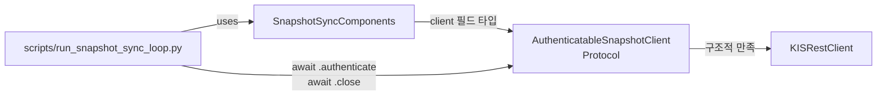

# Authenticatable Snapshot Client Protocol

## 목표

`SnapshotSyncComponents.client: Any`를 명시적 Protocol 타입으로 승격하여, scheduler/CLI가 의존하는 암묵적 계약(`.authenticate()` / `.close()`)을 코드 차원에서 드러낸다.

## 현재 상태

| 항목 | 현재 | 문제 |
|------|------|------|
| `SnapshotSyncComponents.client` | `Any` | 타입 안전성 없음, 문서성만 있음 |
| `scripts/run_snapshot_sync_loop.py` | `rest_client: object \| None` + `# type: ignore[union-attr]` | 타입 검사 무시, `\| None`은 불필요 |
| `scripts/sync_snapshots.py` | `.provider`만 사용, `.client` 미사용 | 영향 없음 |

## 변경 설계

### Step 1: Protocol 추가

[`src/agent_trading/brokers/snapshot_factory.py`](src/agent_trading/brokers/snapshot_factory.py)에 추가:

```python
from typing import Protocol


class AuthenticatableSnapshotClient(Protocol):
    """Minimal client contract required by the snapshot sync scheduler.

    A broker-specific REST client must provide these two methods for
    the scheduler lifecycle: authentication before use and clean
    teardown after.
    """

    async def authenticate(self) -> object:
        """Obtain or refresh an access token / session.

        Returns the current valid token or session identifier.
        """
        ...

    async def close(self) -> None:
        """Explicitly close the underlying HTTP client."""
        ...
```

**설계 결정:**
- **이름**: `AuthenticatableSnapshotClient` — "snapshot sync에서 authenticate 가능한 client"라는 의도가 명확히 드러남
- **위치**: `snapshot_factory.py` — `SnapshotSyncComponents`와 동일 파일. snapshot sync 범위를 넘지 않음
- **`authenticate() -> object`**: KIS는 `str`을 반환하지만, 다른 broker는 다른 타입을 반환할 수 있으므로 `object`로 추상화. `str`은 `object`의 subtype이므로 KIS는 구조적으로 만족
- **`@runtime_checkable` 미사용**: async Protocol의 runtime isinstance 검사는 신뢰성이 낮음. 기존 `hasattr` + `callable` 테스트로 충분

### Step 2: `SnapshotSyncComponents.client` 타입 변경

[`src/agent_trading/brokers/snapshot_factory.py`](src/agent_trading/brokers/snapshot_factory.py):

```python
# 변경 전
client: Any = field(repr=False)

# 변경 후
client: AuthenticatableSnapshotClient = field(repr=False)
```

`KISRestClient`는 구조적으로 Protocol을 만족하므로 `_build_kis_components()`의 구현 변경 불필요.

`typing.Any` import는 더 이상 `client`에 사용되지 않지만, Module docstring에서 `Any` 참조가 있을 수 있음. 필요하면 `Any` import 유지 또는 `object`로 대체.

### Step 3: Scheduler 타입 정리

[`scripts/run_snapshot_sync_loop.py`](scripts/run_snapshot_sync_loop.py):

```python
# 변경 전
components = build_snapshot_sync_components(broker, settings)
rest_client: object | None = components.client
provider = components.provider
...
await rest_client.authenticate()  # type: ignore[union-attr]
...
if rest_client is not None:
    await rest_client.close()

# 변경 후
components = build_snapshot_sync_components(broker, settings)
rest_client = components.client
provider = components.provider
...
await rest_client.authenticate()  # type safe, no ignore needed
...
await rest_client.close()  # type safe, no None check needed
```

`finally` 블록에서 `rest_client`는 항상 not-None이므로 `if rest_client is not None` 제거. `close()` 실패에 대한 `try/except`는 유지.

**참고**: [`scripts/sync_snapshots.py`](scripts/sync_snapshots.py)는 `.provider`만 사용하므로 변경 불필요.

### Step 4: 테스트 보강

[`tests/brokers/test_snapshot_factory.py`](tests/brokers/test_snapshot_factory.py):

기존 테스트(`TestBuildKISComponents` 6개 + `TestUnsupportedBroker` 2개 = 8개) 유지하며 1개 추가:

1. **`test_client_is_authenticatable_snapshot_client`**: `components.client`가 `AuthenticatableSnapshotClient`를 구조적으로 만족하는지 검증 (기존 `hasattr` + `callable` 테스트는 유지 — Protocol 검증과 runtime 존재 검증은 다른 목적)

```python
def test_client_is_authenticatable_snapshot_client(self) -> None:
    """Client structurally conforms to AuthenticatableSnapshotClient."""
    settings = AppSettings()
    components = build_snapshot_sync_components("koreainvestment", settings)
    from agent_trading.brokers.snapshot_factory import (
        AuthenticatableSnapshotClient,
    )
    client: AuthenticatableSnapshotClient = components.client
    assert client is not None
```

### Step 5: 문서 정리

[`plans/BACKLOG.md`](plans/BACKLOG.md)에 승격 기록 추가.

## 변경 파일 요약

| 파일 | 변경 유형 | 설명 |
|------|-----------|------|
| `src/agent_trading/brokers/snapshot_factory.py` | 수정 | `AuthenticatableSnapshotClient` Protocol 추가, `client: Any` → `client: AuthenticatableSnapshotClient` |
| `scripts/run_snapshot_sync_loop.py` | 수정 | `type: ignore[union-attr]` 제거, `\| None` 제거, `if rest_client is not None` 제거 |
| `tests/brokers/test_snapshot_factory.py` | 수정 | Protocol 구조적 만족 테스트 1개 추가 |
| `plans/BACKLOG.md` | 수정 | 승격 기록 추가 |

변경 불필요:
- `scripts/sync_snapshots.py` — `.client` 미사용
- `src/agent_trading/services/snapshot_sync.py` — runner는 `SnapshotFetchProvider`만 사용
- `src/agent_trading/brokers/koreainvestment/rest_client.py` — 이미 Protocol 만족
- `scripts/sync_kis_snapshots.py` — deprecated wrapper, 자체 KIS wiring 유지

## 테스트 계획

1. 신규: `test_client_is_authenticatable_snapshot_client` — Protocol 구조적 만족 검증
2. 기존: `test_client_has_authenticate_method` — runtime 존재 검증 (유지)
3. 기존: `test_client_has_close_method` — runtime 존재 검증 (유지)
4. 기존: `test_unsupported_raises_value_error` — 회귀 검증 (유지)
5. 전체: 113개 기존 테스트 회귀 없음 확인

## Mermaid: 변경 후 타입 관계



## 리스크

- **없음**: Protocol 추가만 있고 기존 동작 변경 없음. KISRestClient는 이미 `async authenticate() -> str`과 `async close() -> None`을 구현 중. 타입만 명시적으로 바뀔 뿐.
