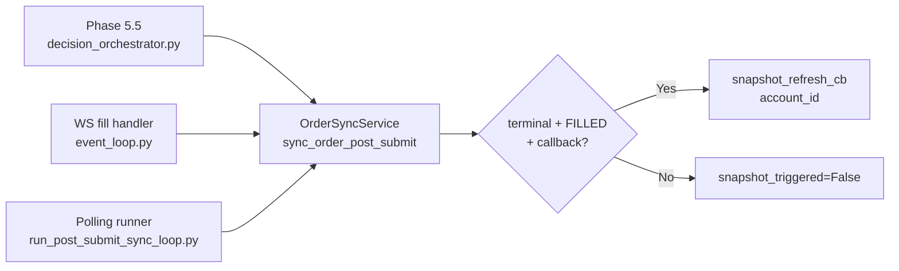

# BACKLOG #21: Snapshot Refresh 직접 통합

## Step 1 — 현재 refresh 호출 규칙 Inventory

### 1.1 세 경로 개요

모든 refresh 호출은 [`OrderSyncService.sync_order_post_submit()`](src/agent_trading/services/order_sync_service.py:237) 내부에서 처리된다.



### 1.2 현재 refresh 조건 ([`order_sync_service.py:237-249`](src/agent_trading/services/order_sync_service.py:237))

```python
if terminal and current_status == OrderStatus.FILLED and snapshot_refresh_cb is not None:
    await snapshot_refresh_cb(order.account_id)
    snapshot_triggered = True
```

**조건**: `terminal + current_status == FILLED + callback != None`
**확인하지 않는 것**: 
- status_changed (새로운 FILLED 전이인지)
- fills_synced (fill 증가 확인)

### 1.3 중복 방지 (implicit)

[`sync_order_post_submit()` lines 155-168](src/agent_trading/services/order_sync_service.py:155) — 이미 terminal 상태면 early return:
```python
if order.status in _TERMINAL_STATUSES:
    return SyncOrderResult(..., snapshot_triggered=False, ...)
```

이미 FILLED인 주문이 다시 sync 호출되면 early return → refresh 재호출 없음.

### 1.4 경로별 분석

#### 경로 A: Phase 5.5 ([`decision_orchestrator.py:911-951`](src/agent_trading/services/decision_orchestrator.py:911))
- `sync_order_post_submit()` 호출 직후 broker 상태가 FILLED면 refresh 발생
- Timeout 5초, 예외 안전
- ✅ refresh 정상 동작

#### 경로 B: WS-triggered sync ([`event_loop.py:345-415`](src/agent_trading/services/event_loop.py:345))
- **Flow**: Fill notification → `OrderManager.transition_to(FILLED)` → `sync_order_post_submit()` (fire-and-forget)
- **문제**: transition_to가 먼저 실행되어 order가 DB에서 이미 FILLED가 됨 → sync 호출 시 early return → **refresh dead code**
- `snapshot_refresh_cb`는 sync에 전달되지만(407번 줄) 실제로 호출되지 않음
- ⚠️ **WS 경로의 refresh는 현재 dead code**

#### 경로 C: Polling runner ([`run_post_submit_sync_loop.py:194-264`](src/agent_trading/services/run_post_submit_sync_loop.py:229))
- `PostSubmitSyncRunner`가 `snapshot_refresh_cb`를 각 `sync_order_post_submit()` 호출에 전달
- ✅ refresh 정상 동작

### 1.5 `SyncCycleResult` ([`order_sync_service.py:445-468`](src/agent_trading/services/order_sync_service.py:445))

현재 필드: `total_orders`, `updated`, `filled`, `partial`, `errors`

**⚠️ snapshots_refreshed 카운터 없음** → runner가 refresh 호출 횟수를 집계하지 않음

### 1.6 `_log_cycle_summary()` ([`run_post_submit_sync_loop.py:151-170`](src/agent_trading/services/run_post_submit_sync_loop.py:151))

현재 로그: `orders=10 (updated=2 filled=1 partial=7) errors=0 elapsed=1.23s`

**⚠️ snapshot refresh 횟수 로그 없음**

---

## Step 2 — Refresh 실행 규칙 명확화

### 2.1 최종 규칙

```
order가 이번 sync call에서:
  (a) 새롭게 FILLED terminal로 전이되었고 (status_changed == True)
  (b) fill 수량 증가가 확인되면 (fills_synced > 0)
  (c) callback이 제공되면 (snapshot_refresh_cb is not None)
→ snapshot refresh를 1회 트리거
```

### 2.2 수정: `sync_order_post_submit()` refresh 조건

[`order_sync_service.py:237-249`](src/agent_trading/services/order_sync_service.py:237):

```python
# ── 8. Snapshot refresh if newly FILLED with fills ──
snapshot_triggered = False
if (
    status_changed
    and order.status == OrderStatus.FILLED
    and fills_synced > 0
    and snapshot_refresh_cb is not None
):
    try:
        await snapshot_refresh_cb(order.account_id)
        snapshot_triggered = True
        logger.info(
            "Snapshot refresh triggered for account=%s "
            "broker_order=%s fills_synced=%d",
            order.account_id, broker_order_id, fills_synced,
        )
    except Exception as exc:
        logger.warning(
            "Snapshot refresh callback failed for account=%s: %s",
            order.account_id, exc,
        )
```

변경 사항:
| 항목 | 이전 | 이후 |
|------|------|------|
| FILLED 전이 확인 | ❌ 없음 | ✅ `status_changed and order.status == FILLED` |
| fill 증가 확인 | ❌ 없음 | ✅ `fills_synced > 0` |
| 로깅 | 없음 | ✅ structured log |

### 2.3 수정: WS fill handler 직접 refresh 호출

[`event_loop.py:_handle_fill_notification()`](src/agent_trading/services/event_loop.py:238) — `transition_to()` 직후, FILLED 도달 시 직접 refresh 호출 추가.

```python
# ── Route order state change through OrderManager ──
order_qty = _safe_decimal(order_qty_str)
target_status = _resolve_fill_status(fill_qty, order_qty)

try:
    await self._order_manager.transition_to(...)
except Exception as e:
    ...

# ── NEW: Direct snapshot refresh if FILLED reached ──
if (
    target_status == OrderStatus.FILLED
    and self._snapshot_refresh_cb is not None
    and broker_order_id not in self._filled_refresh_fired
):
    self._filled_refresh_fired.add(broker_order_id)
    try:
        await self._snapshot_refresh_cb(order_entity.account_id)
        logger.info(
            "WS fill → snapshot refresh triggered for account=%s "
            "order=%s broker_order=%s",
            order_entity.account_id,
            order_entity.order_request_id,
            broker_order_id,
        )
    except Exception as e:
        logger.warning(
            "WS fill → snapshot refresh failed for account=%s: %s",
            order_entity.account_id, e,
        )
```

---

## Step 3 — Refresh 중복 방지

### 3.1 Sync 경로 (Phase 5.5 / Polling)

**이미 implicit dedup 있음** (early return at line 155) + 새 조건 (`status_changed and fills_synced > 0`)으로 추가 보호.

| 시나리오 | Early return | 새 조건 | 결과 |
|---------|-------------|---------|------|
| 이미 FILLED인 주문 재호출 | ✅ return | - | refresh 안 함 |
| 새 FILLED 전이 + fill 증가 | - | ✅ 통과 | refresh 함 |
| 새 FILLED 전이 + fill 없음 | - | ❌ 차단 | refresh 안 함 |
| PARTIAL fill만 있고 FILLED 아님 | - | ❌ 차단 | refresh 안 함 |

### 3.2 WS 경로

**`_filled_refresh_fired: set[str]`** dedup set 추가 — broker native order ID 기준:
- 동일 주문에 대해 여러 fill notification이 와도 최초 1회만 refresh
- FILLED는 terminal이므로 clear할 필요 없음

[`RealTimeEventLoop.__init__()`](src/agent_trading/services/event_loop.py:105):
```python
self._filled_refresh_fired: set[str] = set()
```

---

## Step 4 — Trace / Observability 추가

### 4.1 `SyncCycleResult`에 `snapshots_refreshed` 필드 추가

[`order_sync_service.py:445-468`](src/agent_trading/services/order_sync_service.py:445):
```python
@dataclass(slots=True, frozen=True)
class SyncCycleResult:
    total_orders: int
    updated: int
    filled: int
    partial: int
    snapshots_refreshed: int = 0  # NEW
    errors: list[str]
```

### 4.2 `PostSubmitSyncRunner.run_sync_cycle()` 누적 로직

[`order_sync_service.py:560-583`](src/agent_trading/services/order_sync_service.py:560):
```python
for broker_order in broker_orders:
    try:
        result = await self.sync_service.sync_order_post_submit(...)
    except Exception as exc:
        ...
        continue
    
    if result.error is not None:
        errors.append(...)
    if result.status_changed:
        updated += 1
    if result.terminal and result.current_status == OrderStatus.FILLED:
        filled += 1
        if result.snapshot_triggered:       # NEW
            snapshots_refreshed += 1         # NEW
    elif not result.terminal:
        partial += 1
```

### 4.3 `_log_cycle_summary()`에 snapshots_refreshed 추가

[`run_post_submit_sync_loop.py:151-170`](src/agent_trading/services/run_post_submit_sync_loop.py:151):
```python
logger.info(
    "sync-cycle  "
    "orders=%d (updated=%d filled=%d partial=%d)  "
    "snapshots=%d  "     # NEW
    "errors=%d  "
    "elapsed=%.2fs",
    result.total_orders,
    result.updated,
    result.filled,
    result.partial,
    result.snapshots_refreshed,  # NEW
    len(result.errors),
    elapsed,
)
```

### 4.4 WS handler refresh 시 로깅

위 2.3 참조 — structured log 추가.

---

## Step 5 — 변경 파일 목록

| 파일 | 변경 사항 |
|------|----------|
| `src/agent_trading/services/order_sync_service.py` | (1) `SyncCycleResult.snapshots_refreshed` 필드 추가 (2) `sync_order_post_submit()` refresh 조건 강화 + structured log (3) `PostSubmitSyncRunner.run_sync_cycle()` 누적 로직 |
| `src/agent_trading/services/event_loop.py` | (1) `_filled_refresh_fired: set[str]` dedup set 추가 (2) `_handle_fill_notification()` FILLED 도달 시 직접 refresh 호출 |
| `scripts/run_post_submit_sync_loop.py` | `_log_cycle_summary()`에 `snapshots_refreshed` 카운트 추가 |
| `tests/services/test_order_sync_service.py` | 신규 테스트 (아래 참조) |
| `tests/services/test_event_loop_integration.py` | 신규 테스트 (아래 참조) |
| `plans/BACKLOG.md` | Item 21 → ✅ 승격됨 |

---

## Step 6 — 테스트 계획 (5개 케이스 + 회귀)

### 6.1 [`tests/services/test_order_sync_service.py`](tests/services/test_order_sync_service.py)

| # | 테스트 | 검증 내용 | 상태 |
|---|--------|-----------|------|
| 1 | `test_partially_filled_to_filled_terminal` (기존) | FILLED + fills_synced > 0 → refresh 호출 | ✅ 기존 유지 |
| 2 | `test_filled_without_new_fills_no_refresh` (신규) | FILLED 도달 but fills_synced == 0 → refresh 미호출 | 신규 |
| 3 | `test_partial_fill_no_refresh` (신규) | PARTIALLY_FILLED + fills > 0 → refresh 미호출 | 신규 |
| 4 | `test_runner_snapshots_refreshed_counted` (신규) | Runner가 SyncCycleResult.snapshots_refreshed 누적 | 신규 |
| 5 | `test_already_filled_no_op` (기존) | 이미 terminal → early return + refresh 안 함 | ✅ 기존 유지 |

### 6.2 [`tests/services/test_event_loop_integration.py`](tests/services/test_event_loop_integration.py)

| # | 테스트 | 검증 내용 | 상태 |
|---|--------|-----------|------|
| 6 | `test_ws_fill_triggers_snapshot_refresh_directly` (신규) | WS fill → FILLED → snapshot_refresh_cb 직접 호출 | 신규 |
| 7 | `test_ws_fill_snapshot_refresh_dedup` (신규) | 동일 주문 2번 fill → refresh는 1회만 | 신규 |
| 8 | 기존 7개 WS sync 테스트 | 회귀 없음 | ✅ 기존 유지 |

---

## Step 7 — submit → filled → snapshot refresh 경로 변화

### 변경 전
```
Phase 5.5:  submit → sync → FILLED 감지 → refresh ✅
WS:         fill → transition_to(FILLED) → sync (early return) → refresh ❌ (dead code)
Polling:    sync → FILLED 감지 → refresh ✅
```

### 변경 후
```
Phase 5.5:  submit → sync → FILLED + fills>0 → refresh ✅ (조건 강화)
WS:         fill → transition_to(FILLED) → refresh 직접 호출 ✅ (신규)
Polling:    sync → FILLED + fills>0 → refresh ✅ (조건 강화)
```

### Observability 변화
- `SyncCycleResult.snapshots_refreshed` 카운터 → polling cycle 로그에 표시
- sync refresh 시 structured log 추가
- WS refresh 시 structured log 추가
- 중복 방지 로그 (디버깅 용이)

---

## 실행 순서 (Code Mode)

1. `order_sync_service.py` — `SyncCycleResult.snapshots_refreshed` 필드 추가
2. `order_sync_service.py` — `sync_order_post_submit()` refresh 조건 변경 + structured log
3. `order_sync_service.py` — `PostSubmitSyncRunner.run_sync_cycle()` snapshots_refreshed 누적
4. `event_loop.py` — `_filled_refresh_fired` set + `__init__` 초기화
5. `event_loop.py` — `_handle_fill_notification()` FILLED refresh 호출 추가
6. `run_post_submit_sync_loop.py` — `_log_cycle_summary()` snapshots_refreshed 추가
7. `test_order_sync_service.py` — 3개 신규 테스트
8. `test_event_loop_integration.py` — 2개 신규 테스트
9. 전체 테스트 실행 (회귀 확인)
10. `plans/BACKLOG.md` — Item 21 승격
