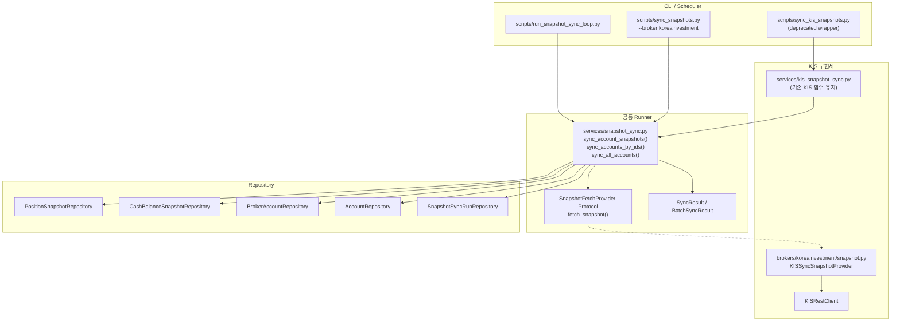

# Broker-Agnostic Operations Runner

## 목표

KIS 전용 운영 작업(snapshot sync / sync scheduler / sync health / capacity)을 **공통 운영 프레임워크 + KIS 구현체** 구조로 일반화한다.

---

## Step 1. 현재 KIS 전용 운영 요소 분해

### 분류표

| 운영 요소 | 현재 위치 | 공통 여부 | KIS 전용 여부 | 비고 |
|-----------|----------|-----------|---------------|------|
| **broker account discovery** | `sync_all_kis_accounts()`가 `broker_account_repo.list_by_broker("koreainvestment")` 호출 | **공통 가능** | broker name hardcode | `list_by_broker()`는 이미 범용 |
| **snapshot fetch (positions)** | `sync_kis_account_snapshots()` → `KISRestClient.get_positions()` raw dict 처리 | **KIS 전용** | KIS field name 상수, KIS pdno→instrument 매핑 | `BrokerAdapter.get_positions()`는 `Position` domain model 반환 — 스냅샷 저장용으로 재사용 가능 |
| **snapshot fetch (cash)** | `sync_kis_account_snapshots()` → `KISRestClient.get_cash_balance()` raw dict 처리 | **KIS 전용** | KIS field name 상수, KIS 화폐/금액 처리 | `BrokerAdapter.get_cash_balance()`는 `CashBalance` domain model 반환 — 재사용 가능 |
| **snapshot persistence** | `PositionSnapshotRepository.add()`, `CashBalanceSnapshotRepository.add()` | **공통** | 없음 | 이미 공통 repository contracts |
| **single-account sync runner** | `sync_kis_account_snapshots()` | **공통 가능** | fetch 부분만 KIS 전용 | `BrokerAdapter` 호출로 대체 가능 |
| **batch sync runner** | `sync_kis_accounts_by_ids()` | **공통 가능** | 없음 | account_id list만 있으면 모든 broker 동일 |
| **auto-discover + batch sync** | `sync_all_kis_accounts()` | **공통 가능** | broker name hardcode + KIS account number filter | broker name을 parameter로 |
| **run result dataclass** | `SyncResult`, `BatchSyncResult` | **공통 가능** | 없음 | 이미 broker-agnostic |
| **run entity builder** | `build_sync_run_entity()` | **공통 가능** | 없음 | `BatchSyncResult` 기반 — broker 무관 |
| **scheduler loop** | `run_snapshot_sync_loop.py` | **공통 가능** | KISRestClient 직접 생성 | adapter 기반으로 변경 가능 |
| **manual CLI** | `sync_kis_snapshots.py` | **공통 가능** | KIS import + KIS 함수 호출 | `--broker` 옵션 추가로 일반화 |
| **run history repository** | `SnapshotSyncRunRepository` | **공통 가능** | 이름에 "SnapshotSync" | 이름만 일반화 (테이블/엔티티 재사용) |
| **freshness/health summary** | `SnapshotSyncHealthSummary` + `get_sync_health_summary()` | **공통 가능** | stale threshold config만 KIS 관점 | aggregate query는 broker 무관 |
| **health/readiness 연결** | `/health`, `/health/readyz` | **공통** | 없음 | 이미 app.state.repos 기반 |
| **capacity inspection** | `/broker-capacity` | **공통** | 없음 | adapter.getattr 기반 — 이미 broker-agnostic |

### 핵심 인사이트

1. **Snapshot fetch가 유일한 KIS 전용 요소** — KIS field name 파싱, pdno→instrument 매핑, KIS REST client 호출
2. **`BrokerAdapter`는 이미 `get_positions()`/`get_cash_balance()`를 제공**하지만 domain model(`Position`, `CashBalance`)과 snapshot entity(`PositionSnapshotEntity`, `CashBalanceSnapshotEntity`)가 다름
3. **나머지 모든 요소**(account discovery, batch runner, run history, scheduler loop, health)는 이미 공통이거나 쉽게 일반화 가능
4. **CLI와 scheduler는 KIS import에 직접 의존** — `from agent_trading.services.kis_snapshot_sync import ...`

---

## Step 2. 공통 운영 추상화 설계

### 2.1 제안 구조 (최소 변경)

```
services/
  snapshot_sync.py              # [신규] broker-agnostic runner service
  kis_snapshot_sync.py           # [유지] KIS-specific fetch helpers, 기존 함수 deprecate

scripts/
  sync_snapshots.py              # [신규] broker-agnostic CLI
  sync_kis_snapshots.py          # [유지] backward-compat wrapper
  run_snapshot_sync_loop.py      # [변경] adapter 기반으로 전환

brokers/
  base.py                        # [변경] SnapshotFetchProvider protocol 추가
  koreainvestment/
    snapshot.py                  # [신규] KIS SnapshotFetchProvider 구현체
    adapter.py                   # [변경 없음]
```

### 2.2 SnapshotFetchProvider Protocol

`BrokerAdapter`에 snapshot fetch를 추가하지 않고 **별도 Protocol**을 정의한다. 이유:
- `BrokerAdapter`는 주문/시세 중심 — snapshot sync는 운영 작업
- 모든 broker가 snapshot sync를 지원하지 않을 수 있음
- SRP 유지

```python
# src/agent_trading/services/snapshot_sync.py

@dataclass(slots=True, frozen=True)
class FetchedSnapshot:
    """Broker-agnostic snapshot fetch result."""
    positions: Sequence[PositionSnapshotEntity]
    cash_balance: CashBalanceSnapshotEntity | None
    errors: list[str]


class SnapshotFetchProvider(Protocol):
    """Fetch positions and cash balance for snapshot persistence."""

    async def fetch_snapshot(
        self,
        account_id: UUID,
        instrument_repo: InstrumentRepository,
    ) -> FetchedSnapshot:
        ...
```

### 2.3 Broker-agnostic Runner

```python
# src/agent_trading/services/snapshot_sync.py

async def sync_account_snapshots(
    fetch_provider: SnapshotFetchProvider,
    instrument_repo: InstrumentRepository,
    position_snapshot_repo: PositionSnapshotRepository,
    cash_balance_snapshot_repo: CashBalanceSnapshotRepository,
    account_id: UUID,
) -> SyncResult:
    """Broker-agnostic single-account snapshot sync.

    Uses SnapshotFetchProvider instead of KISRestClient directly.
    SyncResult is reused from kis_snapshot_sync.py (already broker-agnostic).
    """
    ...


async def sync_accounts_by_ids(
    fetch_provider: SnapshotFetchProvider,
    instrument_repo: InstrumentRepository,
    position_snapshot_repo: PositionSnapshotRepository,
    cash_balance_snapshot_repo: CashBalanceSnapshotRepository,
    account_ids: Sequence[UUID],
) -> BatchSyncResult:
    """Broker-agnostic batch snapshot sync."""
    ...


async def sync_all_accounts(
    fetch_provider: SnapshotFetchProvider,
    instrument_repo: InstrumentRepository,
    position_snapshot_repo: PositionSnapshotRepository,
    cash_balance_snapshot_repo: CashBalanceSnapshotRepository,
    broker_account_repo: BrokerAccountRepository,
    account_repo: AccountRepository,
    *,
    broker_name: str = "koreainvestment",
    account_number: str | None = None,
    env: Environment | None = None,
    account_status: str | None = None,
) -> BatchSyncResult:
    """Broker-agnostic auto-discover + batch sync."""
    ...
```

### 2.4 KIS SnapshotFetchProvider 구현

```python
# src/agent_trading/brokers/koreainvestment/snapshot.py

class KISSyncSnapshotProvider:
    """KIS implementation of SnapshotFetchProvider.

    Wraps KISRestClient and handles KIS-specific field mapping.
    """

    def __init__(self, rest_client: KISRestClient) -> None:
        self._rest = rest_client

    async def fetch_snapshot(
        self,
        account_id: UUID,
        instrument_repo: InstrumentRepository,
    ) -> FetchedSnapshot:
        # 기존 sync_kis_account_snapshots()의 fetch + mapping 로직
        # KIS field name 상수, pdno→instrument 매핑, cash balance 매핑
        ...
```

### 2.5 SyncResult / BatchSyncResult 이동

`SyncResult`와 `BatchSyncResult`는 이미 broker-agnostic이다. 이름과 위치를 공통으로 옮긴다:

- `kis_snapshot_sync.py` → `snapshot_sync.py` 로 re-export (backward compat)
- 새 코드는 `from agent_trading.services.snapshot_sync import SyncResult, BatchSyncResult`

**단, 파일 이동으로 인한 변경 범위가 크므로, 현재는 re-export 방식 채택**

---

## Step 3. Naming / Module 정리

### 변경 매트릭스

| 현재 | 변경 후 | 방식 |
|------|---------|------|
| `services/kis_snapshot_sync.py` | `services/snapshot_sync.py` [신규] + `services/kis_snapshot_sync.py` [deprecated wrapper] | 신규 파일 생성, 기존 파일은 re-export |
| `SyncResult` | `SyncResult` (동일, `snapshot_sync`로 이전) | re-export |
| `BatchSyncResult` | `BatchSyncResult` (동일, `snapshot_sync`로 이전) | re-export |
| `build_sync_run_entity()` | `build_sync_run_entity()` (동일) | re-export |
| `sync_kis_account_snapshots()` | `sync_account_snapshots()` [신규] + `sync_kis_account_snapshots()` [KIS 전용 유지] | 신규 함수 |
| `sync_kis_accounts_by_ids()` | `sync_accounts_by_ids()` [신규] | 신규 함수 |
| `sync_all_kis_accounts()` | `sync_all_accounts()` [신규] + `sync_all_kis_accounts()` [KIS wrapper] | 신규 함수 |
| `scripts/sync_kis_snapshots.py` | `scripts/sync_snapshots.py` [신규] + KIS CLI 유지 | `--broker` 옵션 |
| `SnapshotSyncRunRepository` | 이름 유지 (테이블/엔티티 재사용, broker 식별 컬럼 불필요) | 변경 없음 |
| `SnapshotSyncRunEntity` | 이름 유지 (run-level summary는 broker 무관) | 변경 없음 |

### 파일 이동 전략

**⚠️ 중요: 실제 파일 이동/이름 변경은 하지 않는다.** 대신:
1. `services/snapshot_sync.py`를 신규 생성 — broker-agnostic runner + re-export
2. `services/kis_snapshot_sync.py`는 유지 — 기존 KIS-specific fetch 함수 + `sync_kis_account_snapshots()` 등
3. 신규 코드는 `snapshot_sync.py`를 import
4. 기존 `kis_snapshot_sync.py` import는 계속 동작 (re-export)

---

## Step 4. Scheduler / CLI 일반화

### 4.1 CLI: `scripts/sync_snapshots.py`

```python
# scripts/sync_snapshots.py
# --broker 옵션 추가 (기본값: koreainvestment)

def _parse_args():
    parser.add_argument(
        "--broker",
        type=str,
        default="koreainvestment",
        help="Broker name (default: koreainvestment). "
             "Only koreainvestment is currently supported.",
    )
    ...

async def _run():
    if args.broker == "koreainvestment":
        # KISRestClient 생성 + KISSyncSnapshotProvider
        provider = KISSyncSnapshotProvider(rest_client)
    else:
        sys.exit(f"Unsupported broker: {args.broker}")
    
    if args.all:
        result = await sync_all_accounts(
            fetch_provider=provider,
            broker_name=args.broker,
            ...
        )
```

### 4.2 Scheduler: `scripts/run_snapshot_sync_loop.py`

변경 사항:
- `KISRestClient` 직접 생성 → `SnapshotFetchProvider` 기반
- env 명: `SNAPSHOT_SYNC_INTERVAL_SECONDS` (기존 `KIS_SNAPSHOT_SYNC_INTERVAL_SECONDS` fallback)
- `--broker` CLI arg 추가  
- `sync_all_kis_accounts()` → `sync_all_accounts()` 호출

```python
# run_snapshot_sync_loop.py 변경 후 구조
async def _run_one_cycle(settings: AppSettings, broker: str) -> None:
    if broker == "koreainvestment":
        rest_client = KISRestClient(...)
        await rest_client.authenticate()
        provider = KISSyncSnapshotProvider(rest_client)
    else:
        raise ValueError(f"Unsupported broker: {broker}")
    
    batch = await sync_all_accounts(
        fetch_provider=provider,
        broker_name=broker,
        ...
    )
```

### 4.3 `scripts/sync_kis_snapshots.py` (기존)

변경 없음 — 기존 사용자/스크립트 호환성 유지. 내부적으로 `services/snapshot_sync.py`의 새 함수를 호출하도록 리팩터 가능.

---

## Step 5. Health / Capacity 문맥 정리

### 현재 상태 (이미 양호)

| 요소 | 상태 | 이유 |
|------|------|------|
| `/health` snapshot sync 필드 | **공통** | `request.app.state.repos.snapshot_sync_runs` 사용, broker 무관 |
| `/health/readyz` degraded 정책 | **공통** | repository aggregate query 기반, broker 무관 |
| `/broker-capacity` | **공통** | `request.app.state.broker_adapter` 사용, adapter type 무관 |
| `stale_threshold_seconds` | **KIS 전제** | env var name에 `KIS_` prefix |
| `startup_grace_seconds` | **KIS 전제** | env var name에 `KIS_` prefix |

### 변경 사항

1. **설정 env var alias 추가**: `SNAPSHOT_STALE_THRESHOLD_SECONDS` (with `KIS_SNAPSHOT_STALE_THRESHOLD_SECONDS` fallback)
2. **설정 env var alias 추가**: `SNAPSHOT_STARTUP_GRACE_SECONDS` (with `KIS_SNAPSHOT_STARTUP_GRACE_SECONDS` fallback)
3. **코드 내 변수명은 그대로** — settings field name은 backward compat 유지

---

## Step 6. 테스트 보강

### 신규 테스트

| 테스트 | 위치 | 내용 |
|--------|------|------|
| `test_snapshot_fetch_provider_protocol` | `tests/services/test_snapshot_sync.py` | Protocol이 기대하는 메서드 시그니처 검증 |
| `test_kis_snapshot_provider_implements_protocol` | `tests/brokers/koreainvestment/test_snapshot.py` | `KISSyncSnapshotProvider`가 Protocol 준수 |
| `test_sync_account_snapshots_with_provider` | `tests/services/test_snapshot_sync.py` | broker-agnostic runner가 provider로 동작 |
| `test_sync_all_accounts_broker_param` | `tests/services/test_snapshot_sync.py` | `broker_name` parameter 전달 검증 |
| `test_cli_broker_option` | `tests/scripts/test_sync_snapshots.py` | `--broker` 옵션 파싱 |
| `test_regression_kis_path_unchanged` | `tests/services/test_kis_snapshot_sync.py` | 기존 KIS 함수가 계속 동작 |

### 기존 테스트 유지

- `tests/services/test_kis_snapshot_sync.py` (1475 lines) — 전면 유지, 회귀 방지

---

## Step 7. 변경 파일 목록 (최종)

### 신규 파일

| 파일 | 설명 |
|------|------|
| `src/agent_trading/services/snapshot_sync.py` | Broker-agnostic snapshot sync runner + `SnapshotFetchProvider` protocol + `FetchedSnapshot` dataclass + re-export |
| `src/agent_trading/brokers/koreainvestment/snapshot.py` | `KISSyncSnapshotProvider` — KIS 구현체 |
| `scripts/sync_snapshots.py` | Broker-agnostic CLI (`--broker`, `--account-id`, `--all` 등) |
| `plans/broker_agnostic_operations_runner.md` | 본 Plan 문서 |

### 수정 파일

| 파일 | 변경 내용 |
|------|----------|
| `src/agent_trading/services/kis_snapshot_sync.py` | `SyncResult`/`BatchSyncResult`/`build_sync_run_entity()` → `snapshot_sync.py`로 re-export 추가. `sync_all_kis_accounts()` → 내부적으로 `sync_all_accounts()` 호출하도록 리팩터 (선택). |
| `scripts/run_snapshot_sync_loop.py` | `SnapshotFetchProvider` 기반으로 전환. env var alias 지원. `--broker` 옵션 추가. |
| `src/agent_trading/config/settings.py` | env var alias (`SNAPSHOT_STALE_THRESHOLD_SECONDS`, `SNAPSHOT_STARTUP_GRACE_SECONDS`) 추가. `SNAPSHOT_SYNC_INTERVAL_SECONDS` alias. |
| `plans/BACKLOG.md` | 승격 기록 + 잔여 KIS 전용 항목 정리 |

### 변경 불필요 (이미 공통)

- `src/agent_trading/brokers/base.py` — `BrokerAdapter` protocol
- `src/agent_trading/brokers/koreainvestment/adapter.py` — `KoreaInvestmentAdapter`
- `src/agent_trading/api/routes/health.py` — 이미 repos 기반
- `src/agent_trading/api/routes/broker_capacity.py` — 이미 adapter 기반
- `src/agent_trading/api/routes/snapshot_sync_runs.py` — 이미 repository 기반
- `src/agent_trading/domain/entities.py` — `SnapshotSyncRunEntity`는 broker 무관
- `src/agent_trading/repositories/contracts.py` — `SnapshotSyncRunRepository`는 broker 무관

---

## 아직 KIS 전용으로 남겨둔 항목

1. **KIS REST client 인증/생성 로직** — CLI와 scheduler에서 `KISRestClient` 생성 + `authenticate()` 호출은 KIS-specific. 향후 `BrokerAdapter.authenticate()`로 대체 가능하지만 이번 범위에서는 유지.
2. **KIS field name 매핑 상수** (`_KIS_PDNO`, `_KIS_HLDG_QTY` 등) — `KISSyncSnapshotProvider` 내부에 캡슐화하여 공개 인터페이스로는 노출되지 않음.
3. **env var prefix (`KIS_`)** — 설정 alias를 추가하지만 기존 `KIS_` prefix env var는 계속 유효. 향후 다른 broker 추가 시 해당 broker prefix로 확장.

---

## Mermaid: 제안 구조



---

## 구현 순서

1. `src/agent_trading/services/snapshot_sync.py` — `SnapshotFetchProvider` protocol + `FetchedSnapshot` dataclass + 신규 broker-agnostic runner 함수 + re-export
2. `src/agent_trading/brokers/koreainvestment/snapshot.py` — `KISSyncSnapshotProvider` (기존 sync_kis_account_snapshots fetch 로직 이전)
3. `scripts/sync_snapshots.py` — 신규 CLI (`--broker` 옵션)
4. `scripts/run_snapshot_sync_loop.py` — `SnapshotFetchProvider` 기반 전환
5. `src/agent_trading/config/settings.py` — env var alias 추가
6. 테스트: 신규 테스트 파일 + 기존 테스트 회귀 확인
7. BACKLOG.md 업데이트
