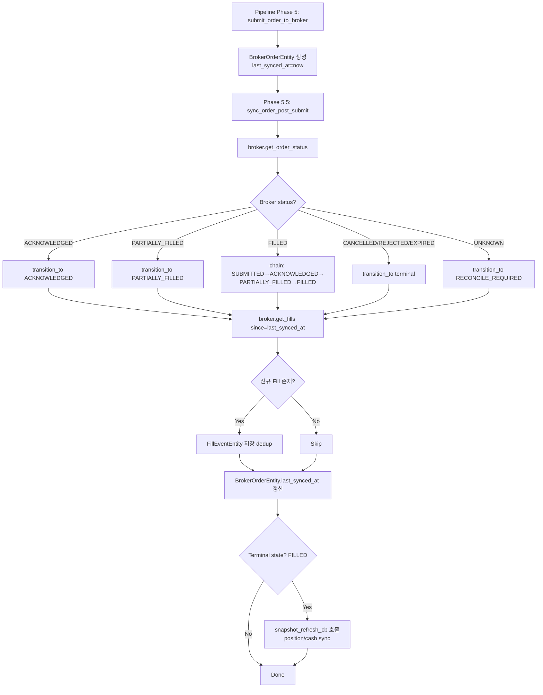
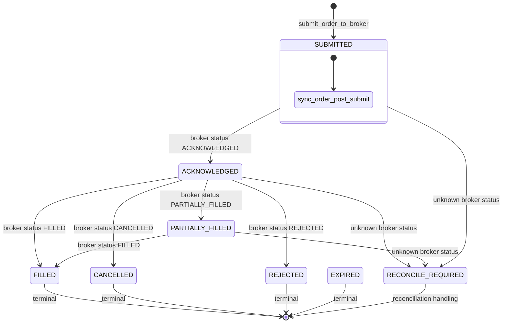

# Fill Sync / Post-Submit Update 구현 계획

> 주문 제출 이후 broker 상태/체결 정보를 시스템 내부 상태로 반영하는 경로를 강화한다.
> Polling/Inquiry 기반 deterministic 경로를 우선 완성하며, 실시간 WS는 후속 작업으로 남긴다.

## 목차

1. [현재 Post-Submit 경로 Inventory](#1-현재-post-submit-경로-inventory)
2. [변경 요약](#2-변경-요약)
3. [Post-Submit Sync 서비스 설계](#3-post-submit-sync-서비스-설계)
4. [Broker Status → Internal OrderStatus Mapping](#4-broker-status--internal-orderstatus-mapping)
5. [Fill Event 반영](#5-fill-event-반영)
6. [State Transition 전략](#6-state-transition-전략)
7. [Snapshot Refresh 연계](#7-snapshot-refresh-연계)
8. [Repository 변경](#8-repository-변경)
9. [Pipeline 연동](#9-pipeline-연동)
10. [테스트 계획](#10-테스트-계획)
11. [변경 파일 목록](#11-변경-파일-목록)
12. [Mermaid 다이어그램](#12-mermaid-다이어그램)
13. [Backlog 정리](#13-backlog-정리)

---

## 1. 현재 Post-Submit 경로 Inventory

### 1.1 Broker Adapter 인터페이스 (재사용)

| 메서드 | 시그니처 | 반환타입 | 현재 사용처 |
|--------|----------|----------|------------|
| [`get_order_status(account_ref, client_order_id, broker_order_id)`](src/agent_trading/brokers/base.py:181) | `str, str, str → OrderStatusResult` | `OrderStatusResult` | Reconciliation 전용 |
| [`get_fills(account_ref, broker_order_id, from_ts)`](src/agent_trading/brokers/base.py:189) | `str, str, datetime → Sequence[FillEvent]` | `Sequence[FillEvent]` | Reconciliation 전용 |
| [`resolve_unknown_state(account_ref, client_order_id, broker_order_id)`](src/agent_trading/brokers/base.py:206) | `str, str, str → OrderStatusResult` | `OrderStatusResult` | Reconciliation 전용 |

### 1.2 내부 저장 구조

| Entity | 필드 | 현재 상태 |
|--------|------|-----------|
| [`BrokerOrderEntity`](src/agent_trading/domain/entities.py:263) | `last_synced_at: datetime \| None` | **필드는 존재하나 `submit_order_to_broker()`에서 절대 설정되지 않음** |
| [`FillEventEntity`](src/agent_trading/domain/entities.py:277) | `broker_fill_id`, `fill_quantity`, `fill_price` 등 | 저장 구조는 완비, **저장 로직 부재** |
| [`OrderRequestEntity`](src/agent_trading/domain/entities.py:236) | `status: OrderStatus` | 상태 전이 경로는 완비 |

### 1.3 현재 Update Path

| 경로 | 위치 | 설명 |
|------|------|------|
| [`submit_order_to_broker()`](src/agent_trading/services/order_manager.py:334) | OrderManager | BrokerOrderEntity 생성 + SUBMITTED 전이. `last_synced_at` 미설정 |
| [`transition_to()`](src/agent_trading/services/order_manager.py:470) | OrderManager | 표준 상태 전이 + audit/state event 기록 |
| [`transition_to_authoritative()`](src/agent_trading/services/order_manager.py:523) | OrderManager | Reconciliation 경로 전용 (RECONCILE_REQUIRED → resolved) |
| [`resolve_and_mark()`](src/agent_trading/services/reconciliation_service.py:373) | ReconciliationService | Broker inquiry + authoritative reflection. **RECONCILE_REQUIRED 상태에서만 진입** |
| [`assemble_and_submit()`](src/agent_trading/services/decision_orchestrator.py:870) | DecisionOrchestratorService | Phase 5 submit 후 return. **Post-submit sync step 부재** |

### 1.4 Missing Pieces 요약

| 항목 | 상태 | 비고 |
|------|------|------|
| `BrokerOrderEntity.last_synced_at` 설정 | ❌ 미구현 | `submit_order_to_broker()`에서 초기값 미설정, sync시 업데이트 안 됨 |
| Broker status 조회 → Internal 상태 전이 | ❌ 미구현 | Reconciliation 외 경로 부재 |
| Fill event 조회 → FillEventEntity 저장 | ❌ 미구현 | broker_fill_id 기준 dedup 로직 없음 |
| Snapshot refresh trigger | ❌ 미구현 | Terminal state 도달시 snapshot sync 호출 없음 |
| Pipeline post-submit step | ❌ 미구현 | Phase 5 이후 sync 호출 없음 |
| `BrokerOrderRepository.update()` | ❌ 미구현 | `add()`만 존재, `last_synced_at` 갱신 불가 |

---

## 2. 변경 요약

| # | 변경 | 파일 | 영향 |
|---|------|------|------|
| 1 | **신규**: `OrderSyncService` 클래스 | `src/agent_trading/services/order_sync_service.py` | 신규 생성 |
| 2 | **변경**: `BrokerOrderRepository.update()` 추가 | `src/agent_trading/repositories/contracts.py` | Protocol 메서드 추가 |
| 3 | **변경**: `InMemoryBrokerOrderRepository.update()` 구현 | `src/agent_trading/repositories/memory.py` | 메모리 구현 |
| 4 | **변경**: (향후) Postgres 구현체 update 추가 | `src/agent_trading/repositories/postgres/broker_orders.py` | 후순위 |
| 5 | **변경**: `submit_order_to_broker()`에서 `last_synced_at` 초기값 설정 | `src/agent_trading/services/order_manager.py` | 1줄 변경 |
| 6 | **변경**: (선택) Pipeline Phase 5 이후 sync 호출 추가 | `src/agent_trading/services/decision_orchestrator.py` | 옵셔널 |
| 7 | **신규**: 테스트 파일 | `tests/services/test_order_sync_service.py` | 신규 생성 |

---

## 3. Post-Submit Sync 서비스 설계

### 3.1 클래스: `OrderSyncService`

```python
@dataclass(slots=True)
class OrderSyncService:
    """Post-submit order status/fill sync service.

    Broker에 제출된 주문의 상태와 체결 내역을 주기적으로 조회하여
    시스템 내부 상태에 반영한다. Reconciliation 경로와 충돌하지 않도록
    설계되며, 오직 SUBMITTED / ACKNOWLEDGED / PARTIALLY_FILLED 상태의
    주문에 대해서만 동작한다.
    """

    repos: RepositoryContainer
    order_manager: OrderManager

    async def sync_order_post_submit(
        self,
        account_ref: str,
        broker: BrokerAdapter,
        broker_order_id: UUID,
        *,
        snapshot_refresh_cb: Callable[[UUID], Awaitable[None]] | None = None,
    ) -> SyncOrderResult:
        """Post-submit sync의 단일 진입점.

        1. broker_order_id → BrokerOrderEntity 조회
        2. broker.get_order_status() → OrderStatusResult
        3. broker status → Internal OrderStatus 매핑
        4. 상태 변경 필요시 OrderManager.transition_to() 호출
        5. broker.get_fills() → FillEventEntity 저장 (dedup)
        6. BrokerOrderEntity.last_synced_at 갱신
        7. Terminal state 도달시 snapshot_refresh_cb 호출
        """
        ...
```

### 3.2 반환타입: `SyncOrderResult`

```python
@dataclass(slots=True, frozen=True)
class SyncOrderResult:
    """Post-submit sync 1회 실행 결과."""
    broker_order_id: UUID
    previous_status: OrderStatus
    current_status: OrderStatus
    status_changed: bool
    fills_synced: int
    fills_skipped: int  # dedup으로 skip된 fill 개수
    terminal: bool      # terminal state 도달 여부
    snapshot_triggered: bool
    last_synced_at: datetime
    error: str | None = None
```

### 3.3 내부 메서드 구조

```python
class OrderSyncService:
    async def sync_order_post_submit(self, ...) -> SyncOrderResult:
        ...

    async def _sync_broker_status(
        self,
        broker_order: BrokerOrderEntity,
        broker: BrokerAdapter,
        account_ref: str,
    ) -> OrderStatus:
        """Broker 상태 조회 및 내부 상태 전이."""
        ...

    async def _sync_fills(
        self,
        broker_order: BrokerOrderEntity,
        broker: BrokerAdapter,
        account_ref: str,
        since: datetime | None,
    ) -> tuple[int, int]:
        """Broker 체결 내역 조회 및 저장 (dedup)."""
        ...

    async def _update_last_synced_at(
        self,
        broker_order_id: UUID,
        sync_time: datetime,
    ) -> None:
        """BrokerOrderEntity.last_synced_at 갱신."""
        ...

    async def _try_transition_path(
        self,
        order: OrderRequestEntity,
        target_status: OrderStatus,
    ) -> OrderRequestEntity | None:
        """가능한 상태 전이 경로를 순차적으로 시도.

        예: SUBMITTED → ACKNOWLEDGED → PARTIALLY_FILLED → FILLED
        의 체인 중 가능한 첫 단계만 수행하거나, target까지 도달.
        """
        ...
```

---

## 4. Broker Status → Internal OrderStatus Mapping

### 4.1 매핑 테이블

`sync_order_post_submit()`이 broker의 `get_order_status()` 결과 `OrderStatusResult.status`를 내부 [`OrderStatus`](src/agent_trading/domain/enums.py:43)로 변환한다.

| Broker Status (KIS 기준) | Internal OrderStatus | 비고 |
|--------------------------|---------------------|------|
| `RECEIVED` / `ACKNOWLEDGED` | [`ACKNOWLEDGED`](src/agent_trading/domain/enums.py:48) | 접수 완료 |
| `PARTIALLY_FILLED` / `PARTIAL` | [`PARTIALLY_FILLED`](src/agent_trading/domain/enums.py:49) | 부분 체결 |
| `FILLED` / `COMPLETE` | [`FILLED`](src/agent_trading/domain/enums.py:50) | 전량 체결 (terminal) |
| `CANCELLED` / `CANCELED` | [`CANCELLED`](src/agent_trading/domain/enums.py:52) | 취소 (terminal) |
| `REJECTED` | [`REJECTED`](src/agent_trading/domain/enums.py:53) | 거절 (terminal) |
| `EXPIRED` | [`EXPIRED`](src/agent_trading/domain/enums.py:54) | 만료 (terminal) |
| 그 외 / Unknown | [`RECONCILE_REQUIRED`](src/agent_trading/domain/enums.py:55) | 불확실 → Reconcilation 위임 |

매핑 로직은 `OrderSyncService._map_broker_status()` 정적 메서드로 분리한다.

### 4.2 상태 전이 유효성 검증

`_ALLOWED_TRANSITIONS`에 따라 전이가 허용되는 경우에만 `transition_to()` 호출:

```python
_ALLOWED_TRANSITIONS = {
    OrderStatus.SUBMITTED: {ACKNOWLEDGED, RECONCILE_REQUIRED},
    OrderStatus.ACKNOWLEDGED: {PARTIALLY_FILLED, FILLED, CANCELLED, REJECTED, RECONCILE_REQUIRED},
    OrderStatus.PARTIALLY_FILLED: {FILLED, CANCEL_PENDING, RECONCILE_REQUIRED},
}
```

**Chain 전이 전략**: broker status가 현재 status에서 직접 전이 불가능한 경우 (예: SUBMITTED → FILLED), 중간 상태를 순차적으로 거친다:
1. SUBMITTED → ACKNOWLEDGED (직접 전이 가능)
2. ACKNOWLEDGED → PARTIALLY_FILLED (직접 전이 가능)
3. PARTIALLY_FILLED → FILLED (직접 전이 가능)

각 단계는 독립적인 `transition_to()` 호출로 수행되며, optimistic locking이 적용된다.

---

## 5. Fill Event 반영

### 5.1 Fill Deduplication

[`FillEventEntity.broker_fill_id`](src/agent_trading/domain/entities.py:283)를 기준으로 중복 체크:

```python
async def _sync_fills(
    self,
    broker_order: BrokerOrderEntity,
    broker: BrokerAdapter,
    account_ref: str,
    since: datetime | None,
) -> tuple[int, int]:
    # 1. Broker에서 fill 목록 조회
    fill_events: Sequence[FillEvent] = await broker.get_fills(
        account_ref,
        broker_order.broker_native_order_id,  # broker_order_id 파라미터
        since or broker_order.created_at,
    )

    # 2. 기존 저장된 fill broker_fill_id 목록 조회
    existing_fills = await self.repos.fill_events.list_by_broker_order(
        broker_order.broker_order_id,
    )
    existing_ids = {f.broker_fill_id for f in existing_fills if f.broker_fill_id}

    # 3. 신규 fill만 저장
    synced = 0
    skipped = 0
    for fill in fill_events:
        # domain FillEvent → entity FillEventEntity 변환
        if fill.broker_fill_id and fill.broker_fill_id in existing_ids:
            skipped += 1
            continue
        entity = FillEventEntity(
            fill_event_id=uuid4(),
            broker_order_id=broker_order.broker_order_id,
            fill_timestamp=fill.fill_timestamp,
            fill_price=fill.fill_price,
            fill_quantity=fill.fill_quantity,
            source_channel="polling",
            broker_fill_id=fill.broker_fill_id or "",
            fill_fee=fill.fee,
            fill_tax=fill.tax,
        )
        await self.repos.fill_events.add(entity)
        synced += 1

    return synced, skipped
```

### 5.2 FillEvent → FillEventEntity 변환

[`FillEvent`](src/agent_trading/domain/models.py:215) (domain/broker format) → [`FillEventEntity`](src/agent_trading/domain/entities.py:277) (persistence format) 변환:

| FillEvent 필드 | FillEventEntity 필드 | 비고 |
|---------------|---------------------|------|
| `broker_name` | - | BrokerOrderEntity 통해 추적 |
| `broker_order_id` | `broker_order_id` | UUID (BrokerOrderEntity 참조) |
| `fill_quantity` | `fill_quantity` | 동일 |
| `fill_price` | `fill_price` | 동일 |
| `fill_timestamp` | `fill_timestamp` | 동일 |
| `fee` | `fill_fee` | 이름 변경 |
| `tax` | `fill_tax` | 이름 변경 |
| (`broker_fill_id` 없음) | `broker_fill_id` | 빈 문자열로 fallback |

**참고**: 현재 [`FillEvent`](src/agent_trading/domain/models.py:215) 모델에는 `broker_fill_id` 필드가 없다. 만약 broker API가 fill의 고유 ID를 제공한다면, 이 필드를 추가해야 dedup 정확도가 올라간다. 현재는 `broker_fill_id`가 없다면 시간/가격/수량 조합으로 dedup하거나, 모든 fill을 중복 저장하지 않도록 조회 시점(`since` 파라미터)으로 제어한다.

---

## 6. State Transition 전략

### 6.1 단일 단계 전이 (직접 허용)

| 현재 상태 | Broker 상태 | 전이 가능 | 방식 |
|-----------|-------------|-----------|------|
| SUBMITTED | ACKNOWLEDGED | ✅ 직접 | `transition_to(ACKNOWLEDGED)` |
| ACKNOWLEDGED | PARTIALLY_FILLED | ✅ 직접 | `transition_to(PARTIALLY_FILLED)` |
| ACKNOWLEDGED | FILLED | ✅ 직접 | `transition_to(FILLED)` |
| ACKNOWLEDGED | CANCELLED | ✅ 직접 | `transition_to(CANCELLED)` |
| ACKNOWLEDGED | REJECTED | ✅ 직접 | `transition_to(REJECTED)` |
| PARTIALLY_FILLED | FILLED | ✅ 직접 | `transition_to(FILLED)` |

### 6.2 체인 전이 (직접 불가능)

| 현재 상태 | Broker 상태 | 체인 | 방식 |
|-----------|-------------|------|------|
| SUBMITTED | PARTIALLY_FILLED | SUBMITTED→ACKNOWLEDGED→PARTIALLY_FILLED | 순차 2단계 |
| SUBMITTED | FILLED | SUBMITTED→ACKNOWLEDGED→PARTIALLY_FILLED→FILLED | 순차 3단계 |
| SUBMITTED | CANCELLED | 직접 불가 → **RECONCILE_REQUIRED** | 안전망 |

**중요**: 체인 전이 중간에 다른 worker가 상태를 변경했을 수 있으므로 각 단계는 독립적인 `transition_to()` 호출로 수행하며, optimistic locking retry가 적용된다. 중간 단계 실패 시 진행을 중단하고 현재까지 성공한 상태를 반환한다.

### 6.3 RECONCILE_REQUIRED 경계

`OrderSyncService`는 오직 다음 상태에 대해서만 동작한다:
- `SUBMITTED` → 정상 sync
- `ACKNOWLEDGED` → 정상 sync
- `PARTIALLY_FILLED` → 정상 sync

다음 상태의 주문은 sync하지 않는다:
- `RECONCILE_REQUIRED` → ReconciliationService가 담당 (authoritative reflection)
- `FILLED`, `CANCELLED`, `REJECTED`, `EXPIRED` → 이미 terminal, sync 불필요
- `DRAFT`, `VALIDATED`, `PENDING_SUBMIT`, `CANCEL_PENDING` → post-submit 범위 아님

---

## 7. Snapshot Refresh 연계

### 7.1 설계 원칙

- `OrderSyncService`는 snapshot sync를 직접 호출하지 않는다.
- 대신 `snapshot_refresh_cb: Callable[[UUID], Awaitable[None]] | None` 옵셔널 콜백을 받는다.
- Terminal state (FILLED) 도달시에만 콜백을 호출한다.
- 콜백 실패는 sync 실패로 간주하지 않는다 (log만 남김).

### 7.2 호출자 책임

Pipeline (`assemble_and_submit()`)이나 Scheduler가 `snapshot_refresh_cb`를 제공한다:

```python
# Pipeline에서의 사용 예
async def _refresh_snapshot(account_id: UUID) -> None:
    rest_client = await build_kis_rest_client(...)
    await sync_kis_account_snapshots(
        rest_client=rest_client,
        instrument_repo=repos.instruments,
        position_snapshot_repo=repos.position_snapshots,
        cash_balance_snapshot_repo=repos.cash_balance_snapshots,
        account_id=account_id,
    )

result = await sync_service.sync_order_post_submit(
    account_ref=account_ref,
    broker=broker,
    broker_order_id=broker_order_id,
    snapshot_refresh_cb=_refresh_snapshot,  # optional
)
```

### 7.3 Snapshot Refresh 조건

| Terminal 상태 | Snapshot Refresh | 비고 |
|--------------|-----------------|------|
| FILLED | ✅ Trigger | 포지션/현금 변동 확정 |
| CANCELLED | ❌ Skip | 포지션 변동 없음 |
| REJECTED | ❌ Skip | 미체결 |
| EXPIRED | ❌ Skip | 미체결 |

---

## 8. Repository 변경

### 8.1 BrokerOrderRepository.update() 추가

[`BrokerOrderRepository`](src/agent_trading/repositories/contracts.py:263) Protocol에 메서드 추가:

```python
class BrokerOrderRepository(Protocol):
    async def add(self, broker_order: BrokerOrderEntity) -> BrokerOrderEntity:
        ...

    async def get_by_native_order_id(
        self,
        broker_name: str,
        broker_native_order_id: str,
    ) -> BrokerOrderEntity | None:
        ...

    async def list_by_order_request(self, order_request_id: UUID) -> Sequence[BrokerOrderEntity]:
        ...

    async def update(
        self,
        broker_order_id: UUID,
        *,
        broker_status: str | None = None,
        last_synced_at: datetime | None = None,
        updated_at: datetime | None = None,
    ) -> None:
        """Update mutable fields on a BrokerOrderEntity.

        현재 mutable field: broker_status, last_synced_at, updated_at
        BrokerOrderEntity의 불변성(immutable dataclass)을 유지하기 위해
        replace가 아닌 필드 단위 업데이트로 설계.
        """
        ...
```

### 8.2 InMemoryBrokerOrderRepository.update() 구현

```python
class InMemoryBrokerOrderRepository:
    async def update(
        self,
        broker_order_id: UUID,
        *,
        broker_status: str | None = None,
        last_synced_at: datetime | None = None,
        updated_at: datetime | None = None,
    ) -> None:
        item = self._items.get(broker_order_id)
        if item is None:
            raise ValueError(f"BrokerOrder not found: {broker_order_id}")
        # Frozen dataclass → replace로 새 인스턴스 생성
        kwargs: dict[str, object] = {}
        if broker_status is not None:
            kwargs["broker_status"] = broker_status
        if last_synced_at is not None:
            kwargs["last_synced_at"] = last_synced_at
        if updated_at is not None:
            kwargs["updated_at"] = updated_at
        self._items[broker_order_id] = replace(item, **kwargs)
```

### 8.3 submit_order_to_broker()에 last_synced_at 초기값 설정

[`OrderManager.submit_order_to_broker()`](src/agent_trading/services/order_manager.py:439)에서 `BrokerOrderEntity` 생성 시 `last_synced_at` 설정:

```python
# 현재 (변경 전)
broker_order = BrokerOrderEntity(
    broker_order_id=uuid4(),
    order_request_id=order.order_request_id,
    broker_name=result.broker_name.value,
    broker_status=result.broker_status.value,
    broker_native_order_id=result.broker_order_id,
    created_at=datetime.now(timezone.utc),
    updated_at=datetime.now(timezone.utc),
    # last_synced_at 미설정 → None
)

# 변경 후
now = datetime.now(timezone.utc)
broker_order = BrokerOrderEntity(
    broker_order_id=uuid4(),
    order_request_id=order.order_request_id,
    broker_name=result.broker_name.value,
    broker_status=result.broker_status.value,
    broker_native_order_id=result.broker_order_id,
    created_at=now,
    updated_at=now,
    last_synced_at=now,  # 초기값 = 생성 시점
)
```

---

## 9. Pipeline 연동

### 9.1 Option A: Pipeline 내 직접 호출 (권장)

[`assemble_and_submit()`](src/agent_trading/services/decision_orchestrator.py:870) Phase 5 이후, return 전에 sync 호출:

```python
# Phase 5 직후, return SubmitResult 전에 추가
if submitted_order.status == OrderStatus.SUBMITTED:
    # 1회차 post-submit sync: 최소 broker acknowledgment 확인
    broker_order = (await repos.broker_orders.list_by_order_request(
        submitted_order.order_request_id,
    ))[0]

    sync_result = await sync_service.sync_order_post_submit(
        account_ref=...,     # account_ref resolve 필요
        broker=broker,
        broker_order_id=broker_order.broker_order_id,
    )
    logger.info("Initial post-submit sync: status=%s fills=%d",
                sync_result.current_status, sync_result.fills_synced)
```

**장점**: Submit 즉시 broker acknowledgment를 확인할 수 있다.
**단점**: Pipeline latency에 1 RTT 추가된다. 옵셔널로 구성하여 실패해도 SubmitResult에는 영향 없게 한다.

### 9.2 Option B: 별도 Scheduler/Task (후순위)

별도의 주기적 task가 `OrderSyncService.sync_order_post_submit()`을 호출:
- Pending broker orders (`last_synced_at < threshold`) 대상
- Pipeline과 분리되어 latency 영향 없음
- 실시간성은 떨어짐

### 9.3 결정: Option A 우선 + Option B는 Backlog

이번 작업에서는 **Option A (Pipeline 내 1회 sync)** 를 우선 구현한다.
Pipeline latency 증가를 최소화하기 위해:
1. sync 실패는 무시 (log만 남기고 return 진행)
2. timeout 5초 설정
3. Option B (scheduler)는 Backlog에 기록

---

## 10. 테스트 계획

### 10.1 테스트 파일: `tests/services/test_order_sync_service.py`

신규 테스트 클래스 `TestOrderSyncService`:

| # | 테스트 케이스 | Broker Mock | 기대 결과 |
|---|-------------|-------------|-----------|
| 1 | **SUBMITTED → ACKNOWLEDGED** | `get_order_status` → status=ACKNOWLEDGED, `get_fills` → [] | 상태 ACKNOWLEDGED 전이, fill 0건, last_synced_at 갱신 |
| 2 | **ACKNOWLEDGED → PARTIALLY_FILLED + fill** | `get_order_status` → status=PARTIALLY_FILLED, `get_fills` → [FillEvent*2] | 상태 PARTIALLY_FILLED 전이, fill 2건 저장 |
| 3 | **PARTIALLY_FILLED → FILLED + fill** | `get_order_status` → status=FILLED, `get_fills` → [FillEvent*1] | 상태 FILLED 전이, fill 1건 저장, terminal=True |
| 4 | **SUBMITTED → FILLED (chain)** | `get_order_status` → status=FILLED, `get_fills` → [FillEvent*3] | SUBMITTED→ACKNOWLEDGED→PARTIALLY_FILLED→FILLED 순차 전이 |
| 5 | **Fill dedup** | 1차: FILLED+[FillEvent*2], 2차: FILLED+[동일 FillEvent*2] | 2차 호출시 fills_skipped=2 |
| 6 | **이미 terminal state → no-op** | `get_order_status` 호출 안 함 | order.status=FILLEED여도 에러 없음, last_synced_at 갱신만 |
| 7 | **No status change** | `get_order_status` → status=ACKNOWLEDGED (현재와 동일) | 상태 변화 없음, fill만 sync |
| 8 | **Snapshot refresh trigger** | FILLED 도달 + `snapshot_refresh_cb` 전달 | Callback 1회 호출 확인 |
| 9 | **Unknown broker status → RECONCILE_REQUIRED** | `get_order_status` → status="UNKNOWN" | 상태 RECONCILE_REQUIRED 전이 |
| 10 | **CANCELLED from ACKNOWLEDGED** | `get_order_status` → status=CANCELLED | 상태 CANCELLED 전이, terminal=True |

### 10.2 기존 테스트 영향 없음 확인

기존 `test_paper_trading_scenarios.py`, `test_decision_submit_pipeline.py`, `test_safe_order_path_e2e.py`는 OrderSyncService를 사용하지 않으므로 영향 없음.

### 10.3 모의 객체 설계

```python
class _StubBrokerForSync:
    """Stub broker that returns canned get_order_status/get_fills results."""
    def __init__(self, status: OrderStatus, fills: list[FillEvent] | None = None):
        self._status = status
        self._fills = fills or []

    async def get_order_status(self, account_ref: str, client_order_id: str, broker_order_id: str) -> OrderStatusResult:
        return OrderStatusResult(
            broker_name=BrokerName.KOREA_INVESTMENT,
            client_order_id=client_order_id,
            broker_order_id=broker_order_id,
            status=self._status,
            filled_quantity=Decimal("0"),
            remaining_quantity=Decimal("0"),
            average_fill_price=Decimal("0"),
            last_updated_at=datetime.now(timezone.utc),
        )

    async def get_fills(self, account_ref: str, broker_order_id: str, from_ts: datetime | None = None) -> Sequence[FillEvent]:
        return self._fills
```

---

## 11. 변경 파일 목록

| 파일 | 변경 유형 | 예상 라인수 |
|------|-----------|------------|
| `src/agent_trading/services/order_sync_service.py` | **신규 생성** | ~250 |
| `src/agent_trading/repositories/contracts.py` | 수정 (Protocol 메서드 추가) | ~6 |
| `src/agent_trading/repositories/memory.py` | 수정 (InMemory 구현) | ~15 |
| `src/agent_trading/services/order_manager.py` | 수정 (last_synced_at 초기값) | ~2 |
| `src/agent_trading/services/decision_orchestrator.py` | 수정 (선택, pipeline 연동) | ~20 |
| `tests/services/test_order_sync_service.py` | **신규 생성** | ~350 |
| `plans/BACKLOG.md` | 수정 (후속 작업 기록) | ~5 |
| `plans/fill_sync_post_submit_update.md` | **신규 생성** (본 문서) | ~1 |

**Admin UI 변경**: 없음
**Broker submit semantics 변경**: 없음
**Hard guardrail / reconciliation 경계 변경**: 없음
**DB migration**: 없음 (기존 컬럼 `last_synced_at` 활용)

---

## 12. Mermaid 다이어그램

### 12.1 Post-Submit Sync Flow



### 12.2 상태 전이 다이어그램



---

## 13. Backlog 정리

### 13.1 이번 작업 범위

| 작업 | 상태 |
|------|------|
| `OrderSyncService` 신규 생성 | ✅ 이번 작업 |
| `BrokerOrderRepository.update()` Protocol 추가 | ✅ 이번 작업 |
| `InMemoryBrokerOrderRepository.update()` 구현 | ✅ 이번 작업 |
| `submit_order_to_broker()` `last_synced_at` 초기값 | ✅ 이번 작업 |
| Pipeline 1회 sync 연동 (옵셔널) | ✅ 이번 작업 |
| 테스트 10개 케이스 | ✅ 이번 작업 |

### 13.2 Backlog 등록 항목

다음 항목은 [`BACKLOG.md`](plans/BACKLOG.md)에 기록한다:

| 항목 | 우선순위 | 설명 |
|------|----------|------|
| Postgres BrokerOrderRepository.update() 구현 | Medium | `src/agent_trading/repositories/postgres/broker_orders.py`에 update SQL 추가 |
| Scheduler 기반 정기 Post-Submit Sync | Medium | `last_synced_at` 기준 미동기 주문 대상 주기적 sync, `asyncio.create_task` 또는 APScheduler |
| FillEvent에 broker_fill_id 필드 추가 | Low | Domain model `FillEvent`에 `broker_fill_id: str \| None` 추가, dedup 정확도 향상 |
| WebSocket 기반 실시간 order event 수신 | High (후속) | KIS 실시간 체결/주문 event를 WS로 수신하여 post-submit sync 대체/보강 |
| Snapshot refresh 직접 통합 | Low | `OrderSyncService`가 `KISRestClient`를 직접 받아 snapshot sync 호출 (callback 제거) |

---

## 실행 단계 (Code Mode 전환 후)

1. `BrokerOrderRepository.update()` Protocol + InMemory 구현
2. `OrderSyncService` 클래스 신규 생성
3. `submit_order_to_broker()`에 `last_synced_at` 초기값 설정
4. (선택) Pipeline Phase 5.5 연동
5. 테스트 파일 작성 및 실행
6. Backlog 정리

---

*생성일: 2026-05-09*
*상태: 설계 완료, Code Mode 전환 대기*
