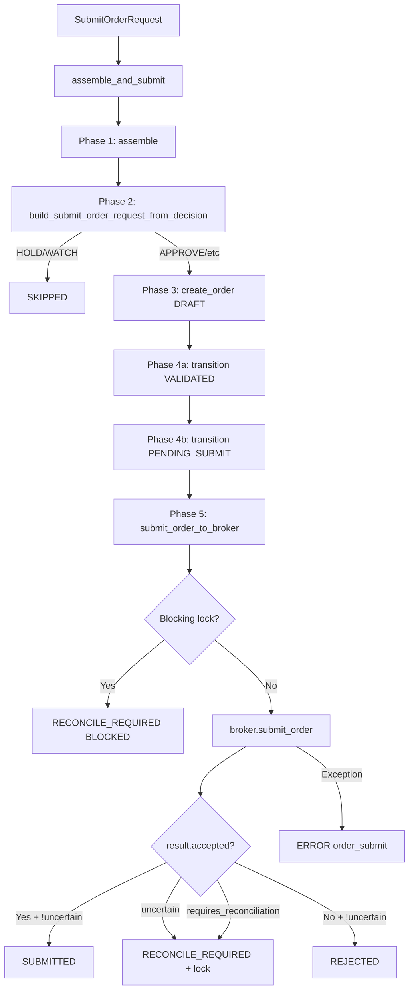

# Gap 3 — Safe Order Path E2E 검증 계획

## 목표

`assemble_and_submit()` 전 구간을 fake broker adapter로 검증하는 E2E 통합 테스트를 신규 작성한다. **새 기능 추가 없이** 시나리오 검증에 집중한다.

## 현황 분석

### 기존 커버리지 갭

| 시나리오 | 기존 테스트 | 커버리지 수준 |
|----------|-----------|--------------|
| ① Happy path accepted → SUBMITTED | `test_decision_submit_pipeline::test_happy_path_submitted` | Pipeline 수준에서 OrderManager.submit_order_to_broker 자체를 mock → broker adapter 수준 mock 아님 |
| ② Unknown state → RECONCILE_REQUIRED | `test_decision_submit_pipeline::test_reconcile_required` | 동일 - pipeline 수준 mock |
| ③ Blocking lock 차단 | `test_order_submit_to_broker::test_submit_blocked_by_reconciliation_lock` | submit_order_to_broker 단위 테스트 `ONLY`, pipeline 수준 E2E 없음 |
| ④ Unknown state resolution | `test_unknown_state_reconciliation_boundary` | ReconciliationService 단위/통합 `ONLY`, pipeline 수준 E2E 없음 |
| ⑤ Reject path → REJECTED | `test_decision_submit_pipeline::test_broker_reject` | Pipeline 수준 mock |
| ⑥ Idempotency/duplicate guard | `test_order_idempotency` | create_order() 단위 `ONLY`, pipeline 수준 E2E 없음 |
| Traceability (decision_context_id, trade_decision_id) | `test_decision_submit_pipeline` Gap 2 assertions | 5개 경로 검증, BUT broker adapter real call 시나리오는 미검증 |

### 핵심 차이

기존 `test_decision_submit_pipeline.py`는 **`patch.object(OrderManager, "submit_order_to_broker")`** 로 broker 호출 자체를 회피. 즉 `assemble_and_submit()`이 OrderManager의 `submit_order_to_broker()`까지의 오케스트레이션만 검증하고, 실제 broker adapter → SubmitOrderResult 처리 경로는 검증하지 않음.

Gap 3는 fake broker adapter(`MagicMock(spec=BrokerAdapter)`)를 주입하여 broker adapter 수준의 result 처리까지 포함한 진정한 E2E 검증이 필요.

## 제약 조건

1. ❌ Admin UI 변경 없음
2. ❌ Broker submit semantics 변경 없음
3. ❌ Guardrail/reconciliation boundary 변경 없음
4. ❌ Destructive schema 변경 없음
5. ❌ Live 계정 검증 없음
6. ✅ Fake/mock broker adapter로 KIS 호출 없이 제어

## 구현 전략

### 새 테스트 파일

`tests/services/test_safe_order_path_e2e.py`

기존 `test_decision_submit_pipeline.py`의 `TestAssembleAndSubmit` 패턴을 계승하되, 다음을 변경:

1. **`patch.object(OrderManager, "submit_order_to_broker")` 대신 `MagicMock(spec=BrokerAdapter)` 사용**
   - `mock_broker.submit_order.return_value`로 각 시나리오별 `SubmitOrderResult` 제어
   - broker 호출 여부를 `mock_broker.submit_order.assert_awaited_once()`로 검증

2. **기존 fixture 재사용**
   - `repos`, `service`, `hold_service`, `sample_request`, `order_manager` fixture는 `test_decision_submit_pipeline.py` 패턴 유지
   - `mock_broker` fixture 추가

3. **검증 대상**
   - 최종 `SubmitResult.status` (SUBMITTED / RECONCILE_REQUIRED / REJECTED / ERROR / SKIPPED)
   - 최종 order entity의 `OrderStatus`
   - Broker 호출 여부 (called / not called)
   - Blocking lock 존재 여부 (reconciliation repository 조회)
   - Traceability: `decision_context_id`, `trade_decision_id` 전파

### 아키텍처 흐름 다이어그램



## 상세 테스트 시나리오

### Step 1: Happy path — broker accepts, order submitted
```python
async def test_e2e_happy_path_submitted(
    service, order_manager, mock_broker, sample_request
)
```
- **Given**: FDC agent returns APPROVE, mock broker returns `SubmitOrderResult(accepted=True)`
- **When**: `assemble_and_submit(sample_request, order_manager, mock_broker)`
- **Then**: 
  - `result.status == "SUBMITTED"`
  - `result.order.status == OrderStatus.SUBMITTED`
  - `mock_broker.submit_order.assert_awaited_once()`
  - `result.decision_context_id is not None`
  - `result.trade_decision_id is not None`

### Step 2: Uncertain result → RECONCIRE_REQUIRED (unknown state)
```python
async def test_e2e_uncertain_reconcile_required(
    service, order_manager, mock_broker, sample_request
)
```
- **Given**: FDC returns APPROVE, mock broker returns `SubmitOrderResult(accepted=True, uncertain=True, broker_order_id=None)`
- **When**: `assemble_and_submit()`
- **Then**:
  - `result.status == "RECONCILE_REQUIRED"`
  - `result.order.status == OrderStatus.RECONCILE_REQUIRED`
  - `mock_broker.submit_order.assert_awaited_once()`
  - `result.decision_context_id is not None`

### Step 3: Blocking lock 차단 — broker 호출 없이 RECONCILE_REQUIRED
```python
async def test_e2e_blocking_lock_blocks_submission(
    repos, service, order_manager, mock_broker, sample_request
)
```
- **Given**: FDC returns APPROVE, `reconciliation_service.acquire_blocking_lock()` 선행 호출
- **When**: `assemble_and_submit()`
- **Then**:
  - `result.status == "RECONCILE_REQUIRED"`
  - `result.order.status == OrderStatus.RECONCILE_REQUIRED`
  - `result.order.status_reason_code == "BLOCKED"`
  - `mock_broker.submit_order.assert_not_called()` — broker는 절대 호출되지 않음
  - `result.decision_context_id is not None`

### Step 4: Lock 후 재시도 — uncertain → lock 생성 → 재시도 차단 → broker 1회만 호출
```python
async def test_e2e_blocking_lock_after_uncertain_resolution(
    repos, service, order_manager, mock_broker, sample_request, reconciliation_service
)
```
- **Given**: FDC returns APPROVE, first `assemble_and_submit()` with uncertain result → RECONCILE_REQUIRED + lock acquired
- **When**: second `assemble_and_submit()` with same account scope (different client_order_id)
- **Then**:
  - First call: `result.status == "RECONCILE_REQUIRED"`, broker called once
  - Second call: `result.status == "RECONCILE_REQUIRED"`, `status_reason_code == "BLOCKED"`
  - `mock_broker.submit_order.call_count == 1` (첫 번째만 호출, 두 번째는 0회)
  - `mock_broker.submit_order.assert_awaited_once()` — broker는 정확히 1회만 호출되어야 함
  - Reconciliation lock exists: `reconciliation_service.is_blocked() == True`

### Step 5: Reject path — broker 명시적 거절 → REJECTED (terminal)
```python
async def test_e2e_broker_reject(
    service, order_manager, mock_broker, sample_request
)
```
- **Given**: FDC returns APPROVE, mock broker returns `SubmitOrderResult(accepted=False, broker_status=REJECTED)`
- **When**: `assemble_and_submit()`
- **Then**:
  - `result.status == "REJECTED"`
  - `result.order.status == OrderStatus.REJECTED`
  - `mock_broker.submit_order.assert_awaited_once()`
  - `result.decision_context_id is not None`

### Step 6: Idempotency / duplicate guard — 동일 `client_order_id` 재시도 → ERROR
```python
async def test_e2e_duplicate_client_order_id_returns_error(
    service, order_manager, mock_broker, sample_request
)
```
- **Given**: FDC returns APPROVE, same `client_order_id` used twice
- **중복 기준**: `OrderManager.create_order()`가 `client_order_id` UNIQUE 위반 감지 (DB 레벨 아님)
- **Given**: First `assemble_and_submit()` succeeds → SUBMITTED
- **When**: Second `assemble_and_submit()` with the **exact same `sample_request`** (same client_order_id, same side/symbol/etc.)
- **Then**:
  - First call: `status == "SUBMITTED"`
  - Second call: `status == "ERROR"` (DuplicateOrderError from create_order)
  - `result.error_phase == "order_create"`
  - Broker called exactly once (only for first call)

### Step 7: requires_reconciliation path — broker 명시적 불확실 → RECONCILE_REQUIRED
```python
async def test_e2e_requires_reconciliation(
    service, order_manager, mock_broker, sample_request
)
```
- **Given**: FDC returns APPROVE, mock broker returns `SubmitOrderResult(accepted=False, requires_reconciliation=True)`
- **When**: `assemble_and_submit()`
- **Then**:
  - `result.status == "RECONCILE_REQUIRED"`
  - `mock_broker.submit_order.assert_awaited_once()`
  - Reconciliation lock acquired

## 공유 Fixture 구조

```python
class TestSafeOrderPathE2E:
    """E2E safe order path verification — fake broker adapter, real pipeline."""

    class _ApproveFDCAgent:
        # Same as test_decision_submit_pipeline.py

    @pytest.fixture
    def repos(self) -> RepositoryContainer:
        # Same as test_decision_submit_pipeline.py — seed account, config, instrument

    @pytest.fixture
    def service(self, repos) -> DecisionOrchestratorService:
        return DecisionOrchestratorService(repos=repos, final_decision_agent=self._ApproveFDCAgent())

    @pytest.fixture
    def sample_request(self) -> SubmitOrderRequest:
        return _make_request()

    @pytest.fixture
    def reconciliation_service(self, repos) -> ReconciliationService:
        return ReconciliationService(repos)

    @pytest.fixture
    def order_manager(self, repos, reconciliation_service) -> OrderManager:
        return OrderManager(repos=repos, reconciliation_service=reconciliation_service)

    @pytest.fixture
    def mock_broker(self) -> BrokerAdapter:
        broker = MagicMock(spec=BrokerAdapter)
        broker.submit_order = AsyncMock()
        return broker

    # --- 7 test methods ---
```

## 검증 매트릭스

## 의미 차이 설명

`uncertain=True`와 `requires_reconciliation=True`는 둘 다 `RECONCILE_REQUIRED` 상태로 이어지지만 의미가 다르다:

| 플래그 | broker submit 결과 | broker_order_id | 트리거 타입 | 의미 |
|--------|-------------------|----------------|------------|------|
| `uncertain=True` | accepted=True, but response incomplete | 보통 None | `"uncertain_result"` | 주문이 broker에 접수되었는지 불확실. timeout/network issue |
| `requires_reconciliation=True` | accepted=False, broker refused | None | `"requires_reconciliation"` | broker가 명시적으로 접수를 거부했으나 정확한 사유 불명. 재확인 필요 |

두 경우 모두 blocking lock이 생성되고 `RECONCILE_REQUIRED`로 전이되지만, **재확인 전략**이 다를 수 있다:
- `uncertain`: broker inquiry로 상태 확인 (order may have been accepted despite timeout)
- `requires_reconciliation`: broker inquiry로 거절 사유 확인

| 시나리오 | Status | Order Status | Broker 호출 | Lock | Traceability |
|---------|--------|-------------|-------------|------|-------------|
| Happy path | SUBMITTED | SUBMITTED | ✅ 1회 | 없음 | ✅ |
| Uncertain | RECONCILE_REQUIRED | RECONCILE_REQUIRED | ✅ 1회 | 생성됨 | ✅ |
| Blocking lock | RECONCILE_REQUIRED | RECONCILE_REQUIRED | ❌ 0회 | 선점됨 | ✅ |
| Lock 후 재시도 | RECONCILE_REQUIRED | RECONCILE_REQUIRED | 1회 (두 번째 0회) | 유지 | ✅ |
| Reject | REJECTED | REJECTED | ✅ 1회 | 없음 | ✅ |
| Duplicate | ERROR/order_create | (이전 DRAFT) | ✅ 1회 | 없음 | ✅ |
| requires_reconciliation | RECONCILE_REQUIRED | RECONCILE_REQUIRED | ✅ 1회 | 생성됨 | ✅ |

## 변경 파일

| 파일 | 변경 유형 | 설명 |
|------|----------|------|
| `tests/services/test_safe_order_path_e2e.py` | **신규 생성** | 7개 E2E 시나리오 통합 테스트 (~350 lines) |
| `plans/BACKLOG.md` | 수정 | Gap 3 상태 ✅ 완료로 업데이트 |

## 제외 사항 (명시적 범위 외)

- `test_decision_submit_pipeline.py` 내 submit_order_to_broker patch 테스트는 유지 (기존 회귀 방지)
- `test_order_submit_to_broker.py` 단위 테스트 유지
- Postgres 레벨 검증은 기존 smoke/integration 테스트에 위임
- KIS adapter 실제 호출 검증은 smoke 테스트에 위임
