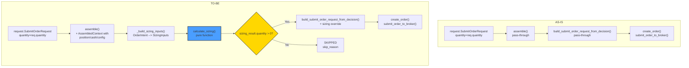

# Gap 4 — Backend Sizing Math 고도화

## 목표

AI 판단과 주문 수량/금액 산정을 분리하여, **backend가 position-aware / config-driven deterministic sizing을 책임지도록** 고도화한다.

---

## 1. 현재 Sizing 경로 Inventory

### 1.1 데이터 흐름 (AS-IS)

```text
request.SubmitOrderRequest (quantity, price)
  │
  ▼
assemble() ── line 548-549: quantity=request.quantity, price=request.price
  │                    (순수 pass-through, sizing math 없음)
  ▼
OrderIntent(request=assembled_request, context=AssembledContext, ai_backend_inputs)
  │
  ▼
build_submit_order_request_from_decision() ── line 1410-1412: quantity=intent.request.quantity
  │                                       (순수 pass-through, sizing math 없음)
  ▼
SubmitOrderRequest → create_order() → submit_order_to_broker()
```

### 1.2 핵심 발견

| 항목 | 상태 | 위치 |
|------|------|------|
| `request.quantity` pass-through | 순수 전달, 가공 없음 | [`assemble()`](src/agent_trading/services/decision_orchestrator.py:548) |
| `request.price` pass-through | 순수 전달, 가공 없음 | [`assemble()`](src/agent_trading/services/decision_orchestrator.py:549) |
| `build_submit_order_request_from_decision()` quantity/price | pass-through, 가공 없음 | [`decision_orchestrator.py:1410-1412`](src/agent_trading/services/decision_orchestrator.py:1410) |
| `SizingHint` (AI output) | `AIDecisionInputs.size_mode`/`size_adjustment_factor` 존재하나 **미사용** | [`decision_orchestrator.py:99`](src/agent_trading/services/decision_orchestrator.py:99) |
| `_calculate_max_order_value()` | 존재하나 **미사용** | [`decision_orchestrator.py:1325`](src/agent_trading/services/decision_orchestrator.py:1325) |
| `AssembledContext.position_snapshot` | assemble()에서 조회되나 sizing에 미사용 | [`decision_orchestrator.py:432-453`](src/agent_trading/services/decision_orchestrator.py:432) |
| `AssembledContext.cash_balance_snapshot` | assemble()에서 조회되나 sizing에 미사용 | [`decision_orchestrator.py:457-472`](src/agent_trading/services/decision_orchestrator.py:457) |
| `AssembledContext.risk_limit_snapshot` | assemble()에서 조회되나 sizing에 미사용 | [`decision_orchestrator.py:475-482`](src/agent_trading/services/decision_orchestrator.py:475) |
| `AssembledContext.config_version` | assemble()에서 조회되나 sizing에 미사용 | [`decision_orchestrator.py:394-404`](src/agent_trading/services/decision_orchestrator.py:394) |

---

## 2. 설계

### 2.1 새 모듈: `services/sizing_engine.py`

Pure function 기반, side-effect 없음. 별도 모듈로 분리하여 orchestrator와 독립적으로 테스트 가능.

#### 2.1.1 `SizingInputs`

```python
@dataclass(slots=True, frozen=True)
class SizingInputs:
    """Deterministic sizing engine inputs — all data resolved before sizing call.

    Attributes are the minimal set needed for position-aware + config-driven sizing.
    Every field is optional — engine falls back gracefully when data is unavailable.
    """

    # ── Decision context ──
    decision_type: str          # "BUY" / "SELL" / "EXIT" / "REDUCE" / "APPROVE"
    side: OrderSide             # OrderSide.BUY or OrderSide.SELL
    requested_quantity: Decimal # Original AI/request quantity (pass-through baseline)
    requested_price: Decimal | None  # Original AI/request price (or None for MARKET)

    # ── AI sizing hint (advisory only, non-binding) ──
    sizing_hint: SizingHint     # size_mode, size_adjustment_factor — advisory

    # ── Position (nullable, for position-aware sizing) ──
    current_position_qty: Decimal | None    # 현재 보유 수량 (null = 미조회)
    current_position_avg_price: Decimal | None  # 평균 매입가

    # ── Cash (nullable, for cash-aware constraint) ──
    available_cash: Decimal | None           # 출금 가능 현금

    # ── Risk / NAV (nullable, for concentration limit) ──
    nav: Decimal | None                      # 순자산가치

    # ── Config-driven limits (nullable, parsed from config_version.config_json) ──
    max_single_position_pct: Decimal | None  # risk.max_single_position_pct
    min_cash_buffer_pct: Decimal | None      # risk.min_cash_buffer_pct
    max_order_value: Decimal | None          # 하드 캡 (우선 적용)
    min_order_qty: Decimal | None            # 최소 주문 수량
    max_order_qty: Decimal | None            # 최대 주문 수량
    lot_size: Decimal | None                 # 호가 단위 / 거래 단위
```

#### 2.1.2 `SizingResult`

```python
@dataclass(slots=True, frozen=True)
class SizingResult:
    """Output of the deterministic sizing engine.

    Always contains a valid quantity (may be zero if constraints reject the order).
    """

    quantity: Decimal                     # 최종 산출 수량 (≥ 0)
    max_order_value: Decimal | None       # 최종 산출 주문 금액 (price × quantity 또는 별도 산출)
    applied_constraints: tuple[str, ...]  # 적용된 제약 조건 목록 (e.g., "cash_limit", "position_concentration")
    skip_reason: str | None               # quantity == 0인 경우 skip 사유 (None = 정상)
    # sizing_reason: str                  # (선택) 사람이 읽을 수 있는 설명 — Phase 2에서 추가 가능
```

#### 2.1.3 `calculate_sizing()` — 순수 함수

```python
def calculate_sizing(inputs: SizingInputs) -> SizingResult:
    """Deterministic sizing engine: position-aware + config-driven.

    Decision rules (in order of application):
    1. Decision type dispatch: BUY/APPROVE → new_entry, REDUCE → reduce, EXIT/SELL → exit
    2. Position-aware base quantity
    3. Config-driven constraint application (min/max/cash/concentration)
    4. Lot size rounding
    5. Zero-quantity guard → skip_reason
    """
```

### 2.2 Position-Aware Sizing 로직

#### 2.2.1 Decision Type Dispatch

| `decision_type` / `side` | 전략 | 기준 |
|--------------------------|------|------|
| `BUY` 또는 `APPROVE + BUY` | 신규 진입 | `requested_quantity`를 기준으로 시작, 현금/NAV 제약 적용 |
| `APPROVE + SELL` | 신규 매도 | `requested_quantity`를 기준으로 시작, 보유 포지션 한도 내로 제한 |
| `REDUCE` | 포지션 축소 | `current_position_qty × abs(size_adjustment_factor)` 또는 `min(current_position_qty, requested_quantity)` |
| `EXIT` | 전량 청산 | `current_position_qty` (전량) 또는 `requested_quantity` 중 작은 값 |
| `SELL` (without REDUCE/EXIT) | 전량 청산 | `current_position_qty` (전량) |

#### 2.2.2 세부 규칙

**신규 진입 (BUY / APPROVE):**
```
base_qty = requested_quantity
// position_unaware — 아직 포지션이 없으므로 requested_quantity가 baseline
```

**축소 (REDUCE):**
```
if current_position_qty is not None and current_position_qty > 0:
    reduction = current_position_qty * abs(size_adjustment_factor)  // AI hint
    // 또는 requested_quantity가 더 작은 경우 requested_quantity 사용
    base_qty = min(current_position_qty, max(reduction, requested_quantity, Decimal("0")))
else:
    // 포지션 데이터 없음 → requested_quantity 그대로 사용 (fallback)
    base_qty = requested_quantity
```

**청산 (EXIT / SELL with position):**
```
if current_position_qty is not None and current_position_qty > 0:
    base_qty = current_position_qty  // 전량 청산
else:
    base_qty = requested_quantity    // fallback
```

### 2.3 Config-Driven 제약 적용

제약은 **순서대로 적용**되며, 각 제약이 적용될 때마다 `applied_constraints`에 기록된다.

```
제약 1: max_order_value — price × base_qty > max_order_value → qty 축소
제약 2: max_order_qty — base_qty > max_order_qty → qty = max_order_qty
제약 3: min_order_qty — base_qty < min_order_qty → qty = 0, skip_reason = "below_min_qty"
제약 4: cash availability (BUY only)
         available_cash가 있고, price가 있을 때:
         if price × qty > available_cash × (1 - min_cash_buffer_pct):
             qty = floor(available_cash × (1 - min_cash_buffer_pct) / price)
             qty = max(qty, 0)
제약 5: position concentration (BUY + NAV)
         if nav > 0 and max_single_position_pct > 0 and price is not None:
             max_position_value = nav × max_single_position_pct / 100
             current_position_value = current_position_qty × current_position_avg_price
             remaining_capacity = max_position_value - current_position_value
             max_additional_qty = remaining_capacity / price if price > 0 else 0
             qty = min(qty, max(0, max_additional_qty))
제약 6: lot size rounding — qty = floor(qty / lot_size) × lot_size (lot_size > 0일 때)
```

**모든 제약은 nullable 필드에 대해 방어적으로 동작** — 값이 `None`이면 해당 제약을 건너뛴다.

### 2.4 Orchestrator 연결

#### 2.4.1 `assemble_and_submit()` 파이프라인 확장

Phase 1 (assemble)과 Phase 2 (build_submit_order_request_from_decision) 사이에 **sizing step**을 추가한다.

```python
async def assemble_and_submit(self, request, *, order_manager, broker, ...):
    # Phase 1: assemble()
    intent = await self.assemble(request, ...)

    # ── NEW: Phase 1.5 — sizing engine ──
    sizing_inputs = _build_sizing_inputs(intent)  # OrderIntent → SizingInputs
    sizing_result = calculate_sizing(sizing_inputs)

    # sizing_result.quantity == 0 → SKIPPED (조건 미달로 주문 불가)
    if sizing_result.quantity <= 0:
        return SubmitResult(
            status="SKIPPED",
            intent=intent,
            error_phase="sizing",
            error_message=sizing_result.skip_reason or "Sizing rejected order",
        )

    # Phase 2: validate intent — pass sized quantity
    submit_request = build_submit_order_request_from_decision(intent)
    if submit_request is None:
        return SubmitResult(status="SKIPPED", ...)

    # Override quantity with sizing result
    submit_request = SubmitOrderRequest(
        **{**submit_request.__dict__,
           "quantity": sizing_result.quantity}
    )

    # Phase 3: create_order(submit_request) ...
```

#### 2.4.2 `_build_sizing_inputs()` 헬퍼

`OrderIntent`의 `context` (AssembledContext)와 `ai_backend_inputs`에서 `SizingInputs`를 구성:

```python
def _build_sizing_inputs(intent: OrderIntent) -> SizingInputs:
    ctx = intent.context
    ai = intent.ai_backend_inputs
    req = intent.request

    # Parse config limits from config_version.config_json
    config = ctx.config_version.config_json if ctx.config_version else {}
    risk = config.get("risk", {})
    execution = config.get("execution", {})

    # Parse position data
    pos_qty = ctx.position_snapshot.quantity if ctx.position_snapshot else None
    pos_avg_price = ctx.position_snapshot.average_price if ctx.position_snapshot else None

    # Parse cash data
    available_cash = ctx.cash_balance_snapshot.available_cash if ctx.cash_balance_snapshot else None

    # Parse risk data
    nav = ctx.risk_limit_snapshot.nav if ctx.risk_limit_snapshot else None

    return SizingInputs(
        decision_type=ai.decision_type,
        side=req.side,
        requested_quantity=req.quantity,
        requested_price=req.price,
        sizing_hint=ai.sizing_hint,
        current_position_qty=pos_qty,
        current_position_avg_price=pos_avg_price,
        available_cash=available_cash,
        nav=nav,
        max_single_position_pct=_decimal_or_none(risk.get("max_single_position_pct")),
        min_cash_buffer_pct=_decimal_or_none(risk.get("min_cash_buffer_pct")),
        max_order_value=_decimal_or_none(execution.get("max_order_value")),
        min_order_qty=_decimal_or_none(execution.get("min_order_qty")),
        max_order_qty=_decimal_or_none(execution.get("max_order_qty")),
        lot_size=None,  # InstrumentEntity.lot_size에서 가져올 수 있으나 Phase 1에서는 None
    )
```

#### 2.4.3 변경이 필요한 파일

| 파일 | 변경 유형 | 설명 |
|------|----------|------|
| [`src/agent_trading/services/sizing_engine.py`](src/agent_trading/services/sizing_engine.py) | **생성** | `SizingInputs`, `SizingResult` dataclass, `calculate_sizing()` pure function |
| [`src/agent_trading/services/decision_orchestrator.py`](src/agent_trading/services/decision_orchestrator.py) | **수정** | Phase 1.5 sizing step 추가, `_build_sizing_inputs()` 헬퍼, `DateError`/`Decimal` import |
| [`tests/services/test_sizing_engine.py`](tests/services/test_sizing_engine.py) | **생성** | Sizing engine 단위 테스트 (6개 시나리오) |
| [`tests/services/test_decision_submit_pipeline.py`](tests/services/test_decision_submit_pipeline.py) | **수정** | 기존 pipeline에 sizing step 추가 검증, 회귀 방지 |
| [`tests/services/test_safe_order_path_e2e.py`](tests/services/test_safe_order_path_e2e.py) | **수정** | E2E에 sizing step이 끼어들어도 문제없는지 확인 |
| [`plans/BACKLOG.md`](plans/BACKLOG.md) | **수정** | Gap 4 row 추가 |

---

## 3. Decision Type Matcher (side-aware)

`decision_type`만으로 부족한 경우를 위해 `side`를 함께 고려:

| AI decision_type | request.side | sizing strategy | 설명 |
|-----------------|-------------|----------------|------|
| `APPROVE` | `BUY` | `new_entry` | AI가 매수 승인 |
| `APPROVE` | `SELL` | `new_entry` (sell) | AI가 매도 승인 (청산이 아닌 신규 공매도 등) |
| `BUY` | `BUY` | `new_entry` | 명시적 매수 |
| `SELL` | `SELL` | `exit` (전량 청산) | 명시적 매도 = 보유 전량 청산 |
| `REDUCE` | `SELL` | `reduce` | 포지션 축소 |
| `EXIT` | `SELL` | `exit` | 전량 청산 |
| `HOLD` / `WATCH` | — | `skip` | Phase 2에서 이미 처리 |

---

## 4. 변경 상세

### 4.1 `sizing_engine.py` (신규)

```python
"""Deterministic sizing engine — pure function, no side effects.

Responsibility: Given AI decision + account state + config limits,
calculate the final order quantity deterministically.

Design principles:
1. Pure function — no DB access, no I/O, no async
2. Every input is optional — graceful fallback when data is unavailable
3. Applied constraints are tracked in SizingResult.applied_constraints
4. Zero quantity → skip_reason explaining why
"""

from dataclasses import dataclass, field
from decimal import Decimal
from agent_trading.domain.enums import OrderSide
from agent_trading.services.ai_agents.schemas import SizingHint


@dataclass(slots=True, frozen=True)
class SizingInputs:
    ...


@dataclass(slots=True, frozen=True)
class SizingResult:
    ...


def calculate_sizing(inputs: SizingInputs) -> SizingResult:
    ...
```

### 4.2 `decision_orchestrator.py` 변경 사항

**추가될 import:**
```python
from agent_trading.services.sizing_engine import (
    SizingInputs,
    SizingResult,
    calculate_sizing,
    _build_sizing_inputs,  # 또는 인라인 구현
)
```

**Phase 1.5 추가 (`assemble_and_submit()` 메서드):**
- Phase 1 assemble() 호출 직후, Phase 2 이전에 sizing 수행
- `SizingInputs` 구성 → `calculate_sizing()` 호출
- `sizing_result.quantity <= 0` → SKIPPED
- `submit_request.quantity`를 `sizing_result.quantity`로 override

**변경되는 메서드 시그니처:** 없음 (내부 로직만 변경)

### 4.3 기존 코드 변경 없음

| 모듈 | 변경 사유 |
|------|---------|
| `OrderManager` | 변경 없음 — 이미 `create_order()`에서 quantity를 받아 처리 |
| `BrokerAdapter` | 변경 없음 |
| `ReconciliationService` | 변경 없음 |
| `AssembledContext` | 변경 없음 — 이미 모든 데이터 보유 |
| `OrderIntent` | 변경 없음 |
| `SubmitOrderRequest` | 변경 없음 |
| `Domain entities` | 변경 없음 |

---

## 5. 테스트 계획

### 5.1 Sizing Engine 단위 테스트 (`tests/services/test_sizing_engine.py`)

| # | 시나리오 | Input | Expected Output |
|---|---------|-------|----------------|
| 1 | **신규 진입 BUY — 기본** | BUY, qty=10, price=5000, cash=100000 | qty=10 (현금 충분) |
| 2 | **신규 진입 — 현금 부족** | BUY, qty=100, price=5000, cash=100000, min_cash_buffer_pct=5 | qty=19 (100000*0.95/5000=19) |
| 3 | **REDUCE — 포지션 기반** | REDUCE, current_pos=50, size_adjustment_factor=0.5 | qty=25 (50*0.5) |
| 4 | **REDUCE — 포지션 초과 요청** | REDUCE, current_pos=50, requested_qty=100 | qty=50 (min(50,100)) |
| 5 | **EXIT — 전량 청산** | EXIT/SELL, current_pos=50 | qty=50 (전량) |
| 6 | **EXIT — 포지션 없음** | EXIT/SELL, current_pos=None, requested_qty=10 | qty=10 (fallback) |
| 7 | **Config max_order_qty 초과** | BUY, qty=100, max_order_qty=50 | qty=50 |
| 8 | **Config min_order_qty 미달 → skip** | BUY, qty=5, min_order_qty=10 | qty=0, skip_reason="below_min_qty" |
| 9 | **Position concentration 제한** | BUY, qty=100, price=5000, nav=10000000, max_single_position_pct=10, current_pos_qty=100, current_pos_avg_price=4500 | max_position_value=1M, current=450K, remaining=550K, max_additional=110, qty=min(100,110)=100 (or constraint 적용) |
| 10 | **Lot size rounding** | BUY, qty=17, lot_size=10 | qty=10 (floor(17/10)*10) |
| 11 | **AI sizing_hint 적용 — increase** | BUY, qty=10, size_mode="increase", size_adjustment_factor=0.5 | qty=15 (10*1.5) |
| 12 | **AI sizing_hint 적용 — reduce** | BUY, qty=10, size_mode="reduce", size_adjustment_factor=0.3 | qty=7 (10*0.7) |
| 13 | **모든 입력 None → fallback** | BUY, qty=10, 모든 position/cash/config=None | qty=10 (fallback) |
| 14 | **APPROVE + BUY = 신규 진입** | APPROVE, side=BUY, qty=10 | qty=10 (new_entry) |
| 15 | **APPROVE + SELL = 신규 매도** | APPROVE, side=SELL, qty=10 | qty=10 (new_entry_sell) |

### 5.2 Pipeline 통합 테스트 (`test_decision_submit_pipeline.py`)

기존 `TestAssembleAndSubmit` 클래스에 2개 테스트 추가:
1. `test_sizing_applied_to_submitted_order` — sizing engine이 quantity를 override하는지 검증
2. `test_sizing_zero_quantity_skips` — sizing 결과 0 → SKIPPED 상태 검증

### 5.3 E2E 회귀 테스트 (`test_safe_order_path_e2e.py`)

기존 7개 E2E 테스트 수정 없이 실행 — sizing engine이 추가되어도 기존 시나리오가 깨지지 않는지 확인.

---

## 6. 변경 파일 목록

| # | 파일 | 작업 | 예상 줄 수 |
|---|------|------|-----------|
| 1 | `src/agent_trading/services/sizing_engine.py` | 생성 | ~200줄 (dataclass 2 + pure function 1 + 헬퍼) |
| 2 | `src/agent_trading/services/decision_orchestrator.py` | 수정 | ~40줄 (Phase 1.5 + _build_sizing_inputs + import) |
| 3 | `tests/services/test_sizing_engine.py` | 생성 | ~250줄 (15개 테스트) |
| 4 | `tests/services/test_decision_submit_pipeline.py` | 수정 | ~50줄 (2개 통합 테스트) |
| 5 | `tests/services/test_safe_order_path_e2e.py` | 수정 (최소) | ~5줄 (필요시 fixture 조정) |
| 6 | `plans/BACKLOG.md` | 수정 | ~2줄 (row 추가) |

---

## 7. 제외 사항 (명시적 범위 외)

| 항목 | 사유 |
|------|------|
| Multi-leg 분할 (partial fill 분할 제출) | Gap 4 범위 외, 후속 작업으로 남김 |
| Canary live gate 조건 정의 | Gap 5로 분리 |
| admin UI 변경 | 이번 작업 금지 (`admin_ui/` 변경 금지) |
| broker submit semantics 변경 | 변경 금지 |
| hard guardrail / reconciliation 경계 변경 | 변경 금지 |
| live 실계정 검증 | 변경 금지 |
| Config schema 자체 변경 (`config_json` 구조 변경) | 기존 schema 그대로 사용, 파싱만 추가 |
| Portfolio-level optimization (종목 간 상관관계, multi-asset) | Phase 2 이상 |

---

## 8. 아키텍처 다이어그램



---

## 9. 후속 작업 (Gap 4 완료 후 남는 항목)

1. **Multi-leg 분할**: 대량 주문을 여러 개의 소액 주문으로 분할 제출하는 로직. Position-aware sizing과 결합 필요.
2. **실시간 market price 피드**: 현재 `requested_price`는 snapshot 기준. 실시간 호가 기반 가격 조정 필요.
3. **Canary live gate 조건 정의** (Gap 5): Paper trading → Live 전환 기준.
4. **Portfolio-level optimization**: 여러 전략/종목 간 자본 배분 최적화.
