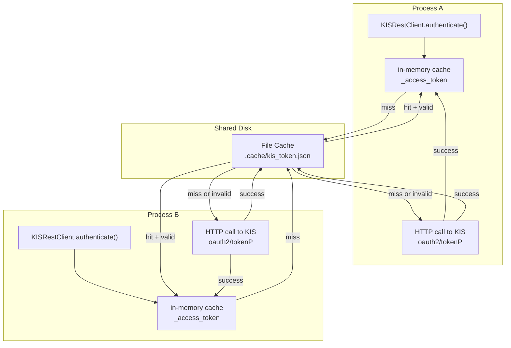
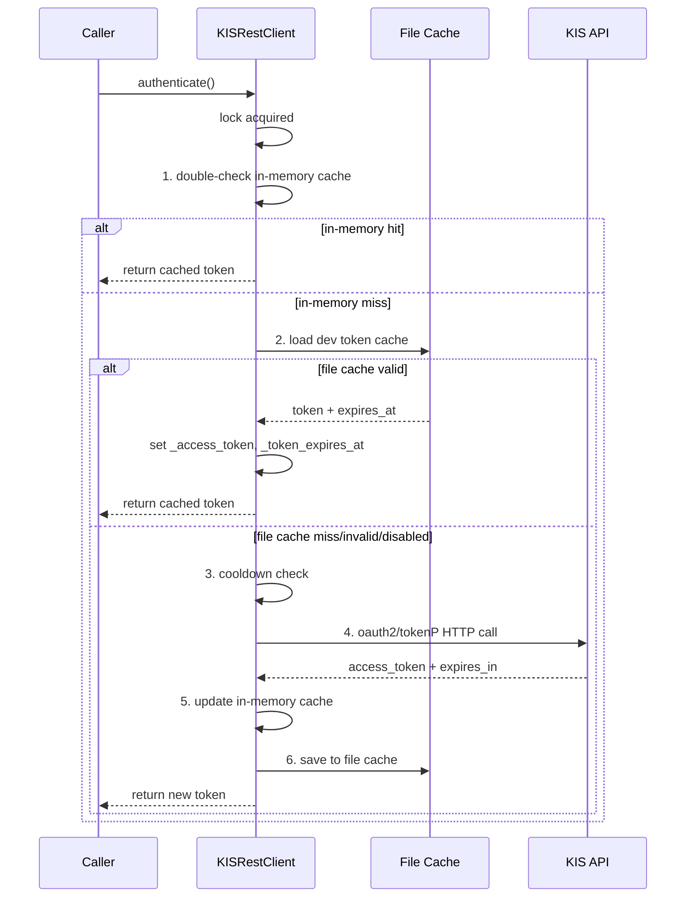

# KIS Dev Token Cache — 설계 문서

## 1. 목적

Roo Code가 테스트/스크립트를 별도 프로세스로 실행할 때마다 `oauth2/tokenP`가 재발급되어 KIS Paper의 1회/분 제한(EGW00133)에 걸리는 문제를 해결한다. 파일 기반 캐시를 두어 프로세스 간 access token을 공유한다.

## 2. 제약 조건

| 항목 | 내용 |
|------|------|
| `live` 환경 | 기본 **비활성화** — 실전 환경에서는 절대 파일 캐시를 사용하지 않음 |
| 보안 | app key fingerprint로 변조/교체 감지; base_url/env 변경 시 자동 무효화 |
| 기존 테스트 | 전혀 영향 없음 (`dev_token_cache_enabled=False` 기본값) |
| smoke 테스트 | 영향 없음 (module-scoped fixture로 이미 in-memory cache 사용) |
| Admin UI 변경 | 없음 |
| Broker submit 변경 | 없음 |
| Auth strict cap 제거 | 없음 — cooldown/lock은 그대로 유지 |

## 3. 아키텍처



### 캐시 무효화 조건

| 조건 | 처리 |
|------|------|
| `expires_at` < `now + 60s` | 만료 — HTTP call로 재발급 |
| `app_key_fingerprint` 불일치 | app key 변경 — 파일 무시 |
| `kis_env` 불일치 | env 변경 — 파일 무시 |
| `base_url` 불일치 | URL 변경 — 파일 무시 |
| cache disabled (`KIS_DEV_TOKEN_CACHE_ENABLED=false`) | 파일 읽지 않음 |

### Cache File 구조

```json
{
  "access_token": "eyJ0eXAiOiJKV1Qi...",
  "token_type": "bearer",
  "expires_at": 1712345678.0,
  "kis_env": "paper",
  "base_url": "https://openapivts.koreainvestment.com:29443",
  "app_key_fingerprint": "a1b2c3d4e5f6g7h8",
  "created_at": 1712345678.0
}
```

### authenticate() 흐름 (변경 후)



## 4. 변경 파일 목록

| 파일 | 변경 유형 | 설명 |
|------|----------|------|
| `src/agent_trading/config/settings.py` | 수정 | `KIS_DEV_TOKEN_CACHE_ENABLED`/`KIS_DEV_TOKEN_CACHE_PATH` resolver + AppSettings 필드 2개 추가 |
| `src/agent_trading/brokers/koreainvestment/rest_client.py` | 수정 | `_dev_token_cache_enabled`/`_dev_token_cache_path` 필드 + `_load_dev_token_cache()`/`_save_dev_token_cache()` 메서드 + authenticate() 통합 |
| `src/agent_trading/runtime/bootstrap.py` | 수정 | `_build_kis_adapter()`에서 `KISRestClient` 생성 시 dev cache 설정 전달 |
| `.env.example` | 수정 | `KIS_DEV_TOKEN_CACHE_ENABLED`/`KIS_DEV_TOKEN_CACHE_PATH` 문서화 |
| `tests/brokers/test_kis_dev_token_cache.py` | **신규** | 캐시 hit/expired/mismatch/disabled/손상 테스트 |

## 5. 상세 구현

### 5.1 `settings.py`

`_resolve_kis_api_key()` (line 107) 아래에 추가:

```python
def _resolve_kis_dev_token_cache_enabled() -> bool:
    """Resolve dev token cache enabled flag from KIS_DEV_TOKEN_CACHE_ENABLED.
    
    Disabled by default.  Must be explicitly set to \"true\" for paper/dev.
    When ``KIS_ENV=live``, this setting is **ignored** — the cache is
    always disabled in production.
    """
    raw = os.getenv("KIS_DEV_TOKEN_CACHE_ENABLED", "false")
    return raw.strip().lower() == "true"


def _resolve_kis_dev_token_cache_path() -> str:
    """Resolve dev token cache file path from KIS_DEV_TOKEN_CACHE_PATH.
    
    Default: ``.cache/kis_token.json`` (relative to project root or cwd).
    """
    return os.getenv("KIS_DEV_TOKEN_CACHE_PATH", ".cache/kis_token.json")
```

`AppSettings`에 필드 추가 (line 178, `kis_paper_rest_rps` 아래):

```python
    # ---- KIS dev token cache (paper/dev only; disabled in live) ---------------
    kis_dev_token_cache_enabled: bool = field(default_factory=_resolve_kis_dev_token_cache_enabled)
    kis_dev_token_cache_path: str = field(default_factory=_resolve_kis_dev_token_cache_path)
```

### 5.2 `rest_client.py`

`KISRestClient`에 필드 2개 추가 (line 234, `budget_manager` 아래):

```python
    # --- dev token cache (file-based, paper/dev only) --------------------------
    dev_token_cache_enabled: bool = False
    dev_token_cache_path: str = ".cache/kis_token.json"
```

메서드 2개 추가 (`authenticate()` 위, 약 line 308):

```python
    # ------------------------------------------------------------------
    # Dev token cache (file-based, paper/dev only)
    # ------------------------------------------------------------------

    async def _load_dev_token_cache(self) -> None:
        """Load access token from file cache if valid.

        Validates fingerprint, env, base_url, and expiry.
        Silent on any failure — falls back to HTTP call.
        """
        if not self.dev_token_cache_enabled:
            return
        path = Path(self.dev_token_cache_path)
        if not path.exists():
            return
        try:
            data = json.loads(path.read_text())
            expected_fp = hashlib.sha256(self.api_key.encode()).hexdigest()[:16]
            if data.get("app_key_fingerprint") != expected_fp:
                return
            if data.get("kis_env") != self.env:
                return
            if data.get("base_url") != self._base_url:
                return
            expires_at = float(data["expires_at"])
            if time.time() >= expires_at - 60:
                return
            self._access_token = data["access_token"]
            self._token_expires_at = expires_at
        except (OSError, json.JSONDecodeError, KeyError, ValueError, TypeError):
            return

    async def _save_dev_token_cache(self) -> None:
        """Save the current access token to file cache."""
        if not self.dev_token_cache_enabled:
            return
        if self._access_token is None:
            return
        path = Path(self.dev_token_cache_path)
        try:
            path.parent.mkdir(parents=True, exist_ok=True)
            fingerprint = hashlib.sha256(self.api_key.encode()).hexdigest()[:16]
            data: dict[str, object] = {
                "access_token": self._access_token,
                "token_type": "bearer",
                "expires_at": self._token_expires_at,
                "kis_env": self.env,
                "base_url": self._base_url,
                "app_key_fingerprint": fingerprint,
                "created_at": time.time(),
            }
            path.write_text(json.dumps(data, indent=2))
        except OSError:
            return
```

`authenticate()` 메서드 수정 (line 327-358):

```diff
         async with self._auth_lock:
             # 1. Double-check cache (standard lock pattern)
             now_wall = time.time()
             if self._access_token is not None and now_wall < self._token_expires_at:
                 return self._access_token
 
+            # 1b. Dev token cache: load from file if in-memory cache is empty
+            if self._access_token is None:
+                await self._load_dev_token_cache()
+                if self._access_token is not None and now_wall < self._token_expires_at:
+                    return self._access_token
+
             # 2. Strict 1 rps: enforce minimum 1s between actual HTTP calls
             ...
 
             # 4. Update cache + cooldown timestamp (only on success)
             self._access_token = data["access_token"]
             self._token_expires_at = now_wall + int(data.get("expires_in", 86400)) - 300
             self._last_auth_call_time = now_mono
+            # 4b. Dev token cache: persist to file
+            await self._save_dev_token_cache()
             return self._access_token
```

필요한 임포트 추가 (파일 상단):

```python
import hashlib
import json
from pathlib import Path
```

### 5.3 `bootstrap.py`

`_build_kis_adapter()`에서 `KISRestClient` 생성 시 dev cache 설정 전달:

```diff
     rest_client = KISRestClient(
         api_key=settings.kis_api_key,
         api_secret=settings.kis_api_secret,
         account_number=settings.kis_account_number,
         account_product_code=settings.kis_account_product_code,
         env=settings.kis_env,
         base_url=settings.kis_base_url,
         budget_manager=budget_manager,
+        dev_token_cache_enabled=settings.kis_dev_token_cache_enabled,
+        dev_token_cache_path=settings.kis_dev_token_cache_path,
     )
```

### 5.4 `.env.example`

`KIS_PAPER_REST_RPS=1` (line 29) 아래에 추가:

```ini
#
# Dev token cache (paper/dev only — live/real에서는 무시됨):
# 파일 기반 access token 캐시로 프로세스 간 토큰 재사용.
# Roo Code가 테스트/스크립트를 별도 프로세스로 실행할 때
# oauth2/tokenP 재발급 남용을 방지한다.
# KIS_DEV_TOKEN_CACHE_ENABLED=true   # "true"로 활성화; 기본값 false
# KIS_DEV_TOKEN_CACHE_PATH=.cache/kis_token.json  # 기본값
```

## 6. 테스트 계획

### 6.1 신규: `tests/brokers/test_kis_dev_token_cache.py`

| 테스트 | 설명 |
|--------|------|
| `test_cache_hit_loads_from_file` | File cache valid → `_access_token` 설정, HTTP call 없음 |
| `test_cache_expired_makes_http_call` | File cache expired → HTTP call, 새 토큰 저장 |
| `test_cache_app_key_mismatch_ignored` | Fingerprint mismatch → file cache ignored, HTTP call |
| `test_cache_env_mismatch_ignored` | `kis_env` mismatch → file cache ignored |
| `test_cache_disabled_does_not_read_file` | `dev_token_cache_enabled=False` → file 읽지 않음 |
| `test_cache_corrupted_file_graceful` | JSON decode error → graceful fallback, HTTP call |
| `test_cache_saves_after_successful_auth` | HTTP call 성공 후 file에 저장 확인 |

### 6.2 기존 테스트 영향도

| 테스트 파일 | 영향 | 이유 |
|------------|------|------|
| `test_kis_auth_strict_cap.py` | **무영향** | `dev_token_cache_enabled=False` 기본값, mock HTTP |
| `test_kis_adapter_validation.py` | **무영향** | 기본값 false, KISRestClient 생성 시 전달 안 함 |
| `test_kis_paper_smoke.py` | **무영향** | Module-scoped fixture로 in-memory cache 사용 |
| `test_budget_exhaustion.py` | **무영향** | 기본값 false |
| `test_kis_snapshot_sync.py` | **무영향** | FakeKISRestClient 사용 (KISRestClient 아님) |

### 6.3 테스트 패턴 (기존 test_kis_auth_strict_cap.py 참고)

`@dataclass(slots=True)` 제약으로 인해 class-level monkeypatch 필요. 새 테스트 파일은 `tmp_path` fixture를 사용하여 cache file을 격리.

```python
@pytest.fixture
def client(
    mock_http_client: AsyncMock,
    monkeypatch: pytest.MonkeyPatch,
    tmp_path: Path,
) -> KISRestClient:
    cache_path = tmp_path / "kis_token.json"
    c = KISRestClient(
        api_key="dummy-key",
        api_secret="dummy-secret",
        account_number="12345678",
        account_product_code="01",
        env="paper",
        dev_token_cache_enabled=True,
        dev_token_cache_path=str(cache_path),
    )
    async def _mock_get_client(self) -> AsyncMock:
        return mock_http_client
    monkeypatch.setattr(KISRestClient, "_get_client", _mock_get_client)
    return c
```

## 7. 리스크

| 리스크 | 완화 |
|--------|------|
| 파일 lock 경합 (동시 프로세스) | Only save on success; read는 atomic; write 실패 시 silent fallback |
| 민감한 토큰이 파일로 유출 | Paper/local 전용; live는 비활성화; `.gitignore` 확인 필요 |
| 캐시 파일 timestamp 오차 | Wall clock 기반 + 60s buffer |
| Fingerprint collision | SHA256 16자리 hex = 64bit; collision 확률 무시 가능 |
