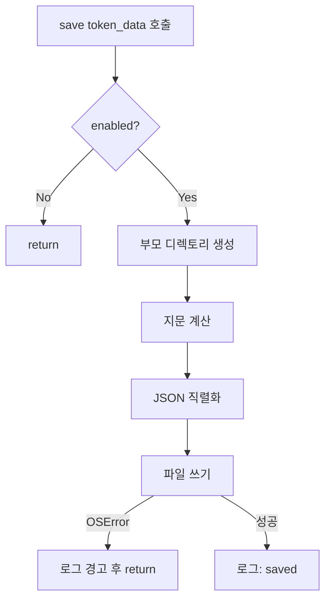
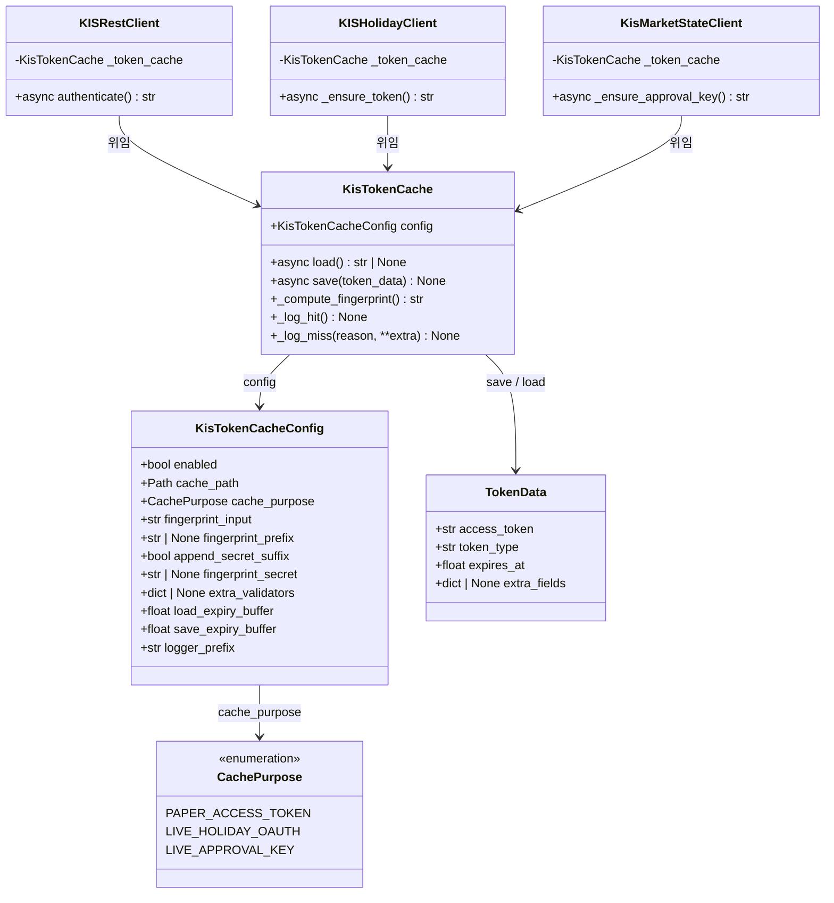
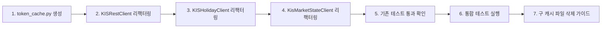

# KIS OAuth Token Cache 중앙화 설계

> 작성일: 2026-05-17
> 작성자: Roo Architect

---

## 1. 목적

KIS(Korea Investment & Securities) API와 통신하는 3개 클라이언트가 각각 독자적으로 구현한 OAuth 토큰/승인키 파일 캐시 로직을 **공통 `KisTokenCache` 모듈로 통합**하여 약 **219줄의 중복 코드를 제거**합니다.

---

## 2. 공통 모듈: `src/agent_trading/brokers/koreainvestment/token_cache.py`

### 2.1 `CachePurpose` Enum

```python
from enum import Enum

class CachePurpose(str, Enum):
    PAPER_ACCESS_TOKEN = "paper_access_token"
    LIVE_HOLIDAY_OAUTH = "live_holiday_oauth"
    LIVE_APPROVAL_KEY = "live_approval_key"
```

| 멤버 | 설명 | 사용처 |
|------|------|--------|
| `PAPER_ACCESS_TOKEN` | KISRestClient dev/paper access token | [`rest_client.py`](src/agent_trading/brokers/koreainvestment/rest_client.py) |
| `LIVE_HOLIDAY_OAUTH` | KISHolidayClient live holiday OAuth token | [`holiday_client.py`](src/agent_trading/brokers/koreainvestment/holiday_client.py) |
| `LIVE_APPROVAL_KEY` | KisMarketStateClient live WebSocket approval key | [`market_state_client.py`](src/agent_trading/brokers/koreainvestment/market_state_client.py) |

### 2.2 `KisTokenCacheConfig` Dataclass

```python
@dataclass
class KisTokenCacheConfig:
    enabled: bool                    # 캐시 사용 여부
    cache_path: Path                 # 캐시 파일 경로
    cache_purpose: CachePurpose      # 캐시 용도 식별자 (저장/검증)
    fingerprint_input: str           # 지문 계산 입력값 (일반적으로 api_key)
    fingerprint_prefix: str | None = None   # 지문 prefix (예: "holiday_oauth_")
    append_secret_suffix: bool = False       # secret[-4:] 지문에 포함 여부
    fingerprint_secret: str | None = None    # append_secret_suffix=True일 때 사용할 secret
    extra_validators: dict[str, str] | None = None  # 추가 검증 필드
    load_expiry_buffer: float = 60.0         # 로드시 만료 버퍼 (초)
    save_expiry_buffer: float = 300.0        # 저장시 만료 버퍼 (초)
    logger_prefix: str = "Token cache"       # 로그 출력 prefix
```

**기본값 설명:**

| 필드 | 기본값 | KISRestClient | KISHolidayClient | KisMarketStateClient |
|------|--------|---------------|------------------|---------------------|
| `load_expiry_buffer` | 60.0 | 60s | 0s → **60s** | 60s |
| `save_expiry_buffer` | 300.0 | 300s | 60s | 300s |
| `fingerprint_prefix` | `None` | `None` | `"holiday_oauth_"` | `"live_info_"` |
| `append_secret_suffix` | `False` | `False` | `True` | `False` |

### 2.3 `KisTokenCache` 클래스

```python
class KisTokenCache:
    def __init__(self, config: KisTokenCacheConfig) -> None: ...

    async def load(self) -> str | None: ...
    async def save(self, token_data: TokenData) -> None: ...

    def _compute_fingerprint(self) -> str: ...
    def _log_hit(self) -> None: ...
    def _log_miss(self, reason: str, **extra: object) -> None: ...
```

#### `TokenData` 데이터 포맷

```python
@dataclass
class TokenData:
    access_token: str               # access_token 또는 approval_key
    token_type: str = "Bearer"      # 토큰 타입
    expires_at: float               # 만료 시각 (Unix timestamp)
    extra_fields: dict[str, object] | None = None  # 추가 필드 (kis_env, base_url 등)
```

#### 저장 파일 JSON 스키마 (통합)

```json
{
  "access_token": "...",
  "token_type": "bearer",
  "expires_at": 1234567890.0,
  "credential_fingerprint": "a1b2c3d4e5f6g7h8",
  "cache_purpose": "paper_access_token",
  "created_at": 1234567890.0,

  "kis_env": "paper",
  "base_url": "https://...",
  "token_purpose": "holiday_oauth",
  "cache_type": "approval_key",
  "approval_key": "..."
}
```

**필드 설명:**

| 필드 | 타입 | 필수 | 설명 |
|------|------|------|------|
| `access_token` | `str` | ✅ | access_token 또는 approval_key |
| `expires_at` | `float` | ✅ | Unix timestamp 만료 시각 |
| `credential_fingerprint` | `str` | ✅ | 통일된 지문 필드명 (신규) |
| `cache_purpose` | `str` | ✅ | CachePurpose enum 값 (신규 표준) |
| `created_at` | `float` | ✅ | 저장 시각 |

**하위호환성 유지 필드** (extra_validators로 전달):

| 필드 | 원천 | 기존 필드명 |
|------|------|------------|
| `kis_env` | KISRestClient | `kis_env` |
| `base_url` | KISRestClient | `base_url` |
| `token_type` | 공통 (KISRestClient/Holiday) | `token_type` |
| `token_purpose` | KISHolidayClient | `token_purpose` |
| `fingerprint` | KISHolidayClient | `fingerprint` (구 필드명, 하위호환) |
| `app_key_fingerprint` | KISRestClient/MarketState | `app_key_fingerprint` (구 필드명, 하위호환) |
| `cache_type` | KisMarketStateClient | `cache_type` |
| `approval_key` | KisMarketStateClient | `approval_key` |

---

## 3. 캐시 로드 플로우 (7단계 시퀀스)

`KisTokenCache.load()`의 내부 동작:

```mermaid
flowchart TD
    A[load 호출] --> B{enabled?}
    B -->|No| C[return None]
    B -->|Yes| D{파일 존재?}
    D -->|No| E[return None]
    D -->|Yes| F[JSON 파싱]
    F -->|실패| G[return None]
    F -->|성공| H{fingerprint 일치?}
    H -->|No| I[return None]
    H -->|Yes| J{extra_validators 일치?}
    J -->|No| K[return None]
    J -->|Yes| L{expires_at - buffer < now?}
    L -->|Yes (만료)| M[return None]
    L -->|No (유효)| N[access_token 반환]

    C --> O[로그: miss reason=disabled]
    E --> P[로그: miss reason=file_missing]
    G --> Q[로그: miss reason=read_error]
    I --> R[로그: miss reason=fingerprint_mismatch]
    K --> S[로그: miss reason=validator_mismatch]
    M --> T[로그: miss reason=expired]
    N --> U[로그: hit]
```

### 지문 계산 (`_compute_fingerprint`)

```python
def _compute_fingerprint(self) -> str:
    parts = []
    if self.config.fingerprint_prefix:
        parts.append(self.config.fingerprint_prefix)
    parts.append(self.config.fingerprint_input)
    if self.config.append_secret_suffix and self.config.fingerprint_secret:
        secret = self.config.fingerprint_secret
        suffix = secret[-4:] if len(secret) >= 4 else secret
        parts.append(suffix)
    if self.config.extra_validators and "base_url" in self.config.extra_validators:
        parts.append(self.config.extra_validators["base_url"])
    raw = "_".join(parts)
    return hashlib.sha256(raw.encode()).hexdigest()[:16]
```

---

## 4. 저장 플로우



---

## 5. 각 클라이언트 리팩터링 계획

### 5.1 KISRestClient (`rest_client.py`)

**변경 사항:**

| 항목 | 현재 | 변경 후 |
|------|------|---------|
| 캐시 설정 | `dev_token_cache_enabled`, `dev_token_cache_path` 필드 | `_token_cache: KisTokenCache` 인스턴스 |
| 지문 계산 | `hashlib.sha256(self.api_key.encode()).hexdigest()[:16]` | `KisTokenCache._compute_fingerprint()` |
| 로드 메서드 | [`_load_dev_token_cache()`](src/agent_trading/brokers/koreainvestment/rest_client.py:326) (~74줄) | `await self._token_cache.load()` |
| 저장 메서드 | [`_save_dev_token_cache()`](src/agent_trading/brokers/koreainvestment/rest_client.py:401) (~22줄) | `await self._token_cache.save(...)` |
| 동기화 | `asyncio.Lock` (`_auth_lock`) | 유지 (기존 Lock 그대로) |

**제거되는 코드:**

| 위치 | 라인 | 내용 |
|------|------|------|
| L326-399 | ~74줄 | `_load_dev_token_cache()` 전체 |
| L401-422 | ~22줄 | `_save_dev_token_cache()` 전체 |
| 합계 | **~96줄 제거** | |

**유지되는 코드:**

- `authenticate()` 메서드의 HTTP 호출 로직
- `_auth_lock` asyncio.Lock (동시성 제어)
- `_access_token`, `_token_expires_at` 인메모리 캐시
- credential 필드 (`api_key`, `api_secret` 등)

**KisTokenCacheConfig 구성:**

```python
KisTokenCacheConfig(
    enabled=self.dev_token_cache_enabled,
    cache_path=Path(self.dev_token_cache_path),
    cache_purpose=CachePurpose.PAPER_ACCESS_TOKEN,
    fingerprint_input=self.api_key,
    extra_validators={
        "kis_env": self.env,
        "base_url": self._base_url,
    },
    load_expiry_buffer=60.0,
    save_expiry_buffer=300.0,
    logger_prefix="Dev token cache",
)
```

### 5.2 KISHolidayClient (`holiday_client.py`)

**변경 사항:**

| 항목 | 현재 | 변경 후 |
|------|------|---------|
| 캐시 설정 | `_cache_enabled`, `_cache_path`, `_fingerprint` 필드 | `_token_cache: KisTokenCache` 인스턴스 |
| Sync→Async | [`_load_cached_token()`](src/agent_trading/brokers/koreainvestment/holiday_client.py:220) (SYNC) | `await self._token_cache.load()` (async) |
| 저장 메서드 | [`_save_cached_token()`](src/agent_trading/brokers/koreainvestment/holiday_client.py:278) (SYNC, ~29줄) | `await self._token_cache.save(...)` (async) |
| 동기화 | `threading.Lock` → `asyncio.Lock` (_auth_lock 이미 존재) | `_auth_lock` (기존 asyncio.Lock 유지) |
| Expiry buffer | load 0s → **60s** (통일), save 60s 유지 | config로 설정 |

**주의: SYNC 메서드 → async 전환 필요**

현재 [`_load_cached_token()`](src/agent_trading/brokers/koreainvestment/holiday_client.py:220)와 [`_save_cached_token()`](src/agent_trading/brokers/koreainvestment/holiday_client.py:278)는 **SYNC** 메서드입니다. 호출자인 [`_ensure_token()`](src/agent_trading/brokers/koreainvestment/holiday_client.py:162)이 `async with self._auth_lock:` 내부에서 동기 호출하고 있습니다.

**리팩터링 방안:** `_ensure_token()` 내에서 `await self._token_cache.load()`로 변경. 이미 async 컨텍스트이므로 추가 변경 없음.

**제거되는 코드:**

| 위치 | 라인 | 내용 |
|------|------|------|
| L220-276 | ~57줄 | `_load_cached_token()` 전체 |
| L278-306 | ~29줄 | `_save_cached_token()` 전체 |
| L127-128 | ~2줄 | `_fingerprint` 계산 |
| 합계 | **~88줄 제거** | |

**KisTokenCacheConfig 구성:**

```python
KisTokenCacheConfig(
    enabled=self._cache_enabled,
    cache_path=Path(self._cache_path) if self._cache_path else Path(".cache/kis_live_oauth_token.json"),
    cache_purpose=CachePurpose.LIVE_HOLIDAY_OAUTH,
    fingerprint_input=self._app_key,
    fingerprint_prefix="holiday_oauth_",
    append_secret_suffix=True,
    fingerprint_secret=self._app_secret,
    extra_validators={
        "token_purpose": "holiday_oauth",
        "base_url": self._base_url,
    },
    load_expiry_buffer=60.0,
    save_expiry_buffer=60.0,
    logger_prefix="Holiday token cache",
)
```

### 5.3 KisMarketStateClient (`market_state_client.py`)

**변경 사항:**

| 항목 | 현재 | 변경 후 |
|------|------|---------|
| 함수 위치 | Module-level 함수 (별도) | `KisTokenCache` 인스턴스 메서드 |
| 로드 메서드 | [`_load_live_info_approval_key_cache()`](src/agent_trading/brokers/koreainvestment/market_state_client.py:200) (~56줄) | `await self._token_cache.load()` |
| 저장 메서드 | [`_save_live_info_approval_key_cache()`](src/agent_trading/brokers/koreainvestment/market_state_client.py:259) (~24줄) | `await self._token_cache.save(...)` |
| 지문 함수 | [`_live_info_cache_fingerprint()`](src/agent_trading/brokers/koreainvestment/market_state_client.py:191) (~8줄) | `KisTokenCache._compute_fingerprint()` |
| 동기화 | 없음 (호출자 관리) | `asyncio.Lock` 도입 (선택) |

**제거되는 코드:**

| 위치 | 라인 | 내용 |
|------|------|------|
| L191-197 | ~7줄 | `_live_info_cache_fingerprint()` |
| L200-256 | ~57줄 | `_load_live_info_approval_key_cache()` |
| L259-282 | ~24줄 | `_save_live_info_approval_key_cache()` |
| 합계 | **~88줄 제거** | |

**KisTokenCacheConfig 구성:**

```python
KisTokenCacheConfig(
    enabled=settings.kis_live_token_cache_enabled,
    cache_path=Path(settings.kis_live_token_cache_path),
    cache_purpose=CachePurpose.LIVE_APPROVAL_KEY,
    fingerprint_input=app_key,
    fingerprint_prefix="live_info_",
    fingerprint_secret=api_secret,
    extra_validators={
        "cache_type": "approval_key",
    },
    load_expiry_buffer=60.0,
    save_expiry_buffer=300.0,
    logger_prefix="Approval key cache",
)
```

---

## 6. 클래스 의존성 다이어그램



---

## 7. 마이그레이션 계획 및 하위호환성

### 7.1 하위호환성 전략

기존 캐시 파일이 새 포맷으로 읽힐 수 있어야 합니다. `KisTokenCache.load()`는 다음 규칙으로 처리:

1. **신규 필드 우선**: `credential_fingerprint`가 존재하면 그것으로 검증
2. **구 필드 fallback**: `credential_fingerprint`가 없으면 `app_key_fingerprint` → `fingerprint` 순서로 fallback
3. **cache_purpose 검증**: 신규 파일은 `cache_purpose`로 검증, 구 파일은 `extra_validators`에 정의된 개별 필드로 검증
4. **저장 시**: 항상 신규 포맷으로 저장 (구 필드도 `extra_fields`로 유지)

### 7.2 마이그레이션 순서



**Step 1**: `token_cache.py` 신규 생성
**Step 2**: `KISRestClient` — `_load_dev_token_cache` / `_save_dev_token_cache` 교체
**Step 3**: `KISHolidayClient` — `_load_cached_token` / `_save_cached_token` 교체 (sync→async)
**Step 4**: `KisMarketStateClient` — `_load_live_info_approval_key_cache` / `_save_live_info_approval_key_cache` 교체 + `_live_info_cache_fingerprint` 제거
**Step 5**: 모든 기존 테스트(`test_kis_dev_token_cache.py`, `test_holiday_client.py`, `test_market_state_client.py`) 실행 및 통과 확인
**Step 6**: 통합 테스트 스위트 실행
**Step 7**: 구 캐시 파일(`.cache/kis_token.json`, `.cache/kis_live_token.json`) 삭제 안내

### 7.3 구 파일 → 신규 파일 자동 변환

`KisTokenCache.load()`가 구 포맷 파일을 감지하면:
- 정상적으로 토큰 반환 (하위호환성 유지)
- 단, 저장 시 항상 신규 포맷으로 저장 (자동 업그레이드)

---

## 8. 중복 제거량 산출

| 클라이언트 | 현재 캐시 코드 라인 수 | 리팩터링 후 라인 수 | 제거 라인 |
|-----------|----------------------|-------------------|----------|
| KISRestClient | ~96 (로드 74 + 저장 22) | ~5 (KisTokenCache 호출) | **~91** |
| KISHolidayClient | ~88 (로드 57 + 저장 29 + 지문 2) | ~5 (KisTokenCache 호출) | **~83** |
| KisMarketStateClient | ~88 (로드 57 + 저장 24 + 지문 7) | ~5 (KisTokenCache 호출) | **~83** |
| **공통 모듈** | 0 (신규) | ~120 (token_cache.py) | **-120** |
| **순 제거** | **~272** | **~135** | **~137줄 감소** |

> 공통 모듈 `token_cache.py` 자체가 ~120줄이므로, **순 제거 약 137줄**. 중복 로직의 완전한 제거와 향후 유지보수 비용 감소 효과.

---

## 9. 테스트 전략

### 9.1 신규 테스트: `tests/brokers/koreainvestment/test_token_cache.py`

`KisTokenCache` 단위 테스트 (독립적으로 검증):

| 테스트 | 시나리오 | 예상 결과 |
|--------|---------|----------|
| `test_load_hit` | 유효한 캐시 파일 | 토큰 반환 |
| `test_load_disabled` | 캐시 비활성화 | `None` 반환 |
| `test_load_missing_file` | 파일 없음 | `None` 반환 |
| `test_load_corrupted` | 손상된 JSON | `None` 반환 |
| `test_load_fingerprint_mismatch` | 지문 불일치 | `None` 반환 |
| `test_load_expired` | 만료됨 | `None` 반환 |
| `test_load_extra_validator_mismatch` | 추가 검증 실패 | `None` 반환 |
| `test_save_creates_file` | 저장 성공 | 파일 생성 확인 |
| `test_save_creates_directory` | 부모 디렉토리 생성 | 디렉토리 생성 확인 |
| `test_save_oserror_handling` | 저장 권한 오류 | 조용히 실패 |
| `test_fingerprint_with_prefix` | prefix 포함 지문 | 올바른 지문 |
| `test_fingerprint_with_secret_suffix` | secret[-4:] 포함 지문 | 올바른 지문 |
| `test_fingerprint_wo_prefix` | prefix 없는 지문 | 올바른 지문 |
| `test_backward_compat_old_format` | 구 포맷 파일 로드 | 정상 로드 |

### 9.2 기존 테스트 변경 불필요 (회귀 방지)

기존 테스트는 내부 캐시 메서드를 mock/patch하고 있으므로, `KisTokenCache`로 위임 후에도 테스트 인터페이스가 동일하다면 mock 레벨에서 영향을 받지 않습니다.

**주의할 점:**
- [`test_holiday_client.py:TestOAuthFileCache`](tests/brokers/koreainvestment/test_holiday_client.py:621) — `_load_cached_token()`을 직접 호출하지 않고 `_ensure_token()`을 통해 간접 호출하므로, 내부 구현만 바뀌고 테스트는 유지됨
- [`test_market_state_client.py:TestApprovalKey`](tests/brokers/koreainvestment/test_market_state_client.py:153) — module-level 함수를 `patch`로 mock하므로, `KisTokenCache`로 변경 시 patch 경로만 업데이트
- [`test_kis_dev_token_cache.py`](tests/brokers/test_kis_dev_token_cache.py) — `client.authenticate()`를 통해 간접 호출하므로 인터페이스 변경 없음

---

## 10. 리스크 및 고려사항

| 리스크 | 영향 | 완화 방안 |
|--------|------|----------|
| **KISHolidayClient sync→async 전환** | 기존 동기 메서드 호출 시 문제 | 이미 `_ensure_token()`이 async 컨텍스트에서 호출 중이므로 영향 없음 |
| **KisMarketStateClient Lock 부재** | 동시성 이슈 | `_auth_lock` 도입 또는 호출자 책임 유지 (변경 최소화) |
| **구 캐시 파일 호환성** | 파일 포맷 변경으로 구 파일 무시 | `load()`에서 구 포맷 fallback 구현 |
| **테스트 patch 경로 변경** | 기존 테스트 mock 실패 | module-level 함수 mock에서 `KisTokenCache` mock으로 경로 변경 필요 |
| **회귀 (regression)** | 잘못된 토큰/키 반환 | 모든 기존 테스트 통과 확인 필요 |

---

## 11. 구현 순서 (Code Mode 전환 시)

1. [`token_cache.py`](src/agent_trading/brokers/koreainvestment/token_cache.py) 생성
   - `CachePurpose` enum
   - `KisTokenCacheConfig` dataclass
   - `TokenData` dataclass
   - `KisTokenCache` class (load, save, _compute_fingerprint, logging)

2. [`test_token_cache.py`](tests/brokers/koreainvestment/test_token_cache.py) 생성
   - 14개 단위 테스트

3. [`KISRestClient`](src/agent_trading/brokers/koreainvestment/rest_client.py) 리팩터링
   - `__post_init__` 또는 `authenticate()`에서 `_token_cache` 초기화
   - `_load_dev_token_cache()` → `await self._token_cache.load()`
   - `_save_dev_token_cache()` → `await self._token_cache.save(...)`

4. [`KISHolidayClient`](src/agent_trading/brokers/koreainvestment/holiday_client.py) 리팩터링
   - `__init__`에서 `_token_cache` 초기화
   - `_load_cached_token()` → `await self._token_cache.load()`
   - `_save_cached_token()` → `await self._token_cache.save(...)`
   - 불필요 필드(`_fingerprint`) 제거

5. [`KisMarketStateClient`](src/agent_trading/brokers/koreainvestment/market_state_client.py) 리팩터링
   - 클래스 생성자에서 `_token_cache` 초기화
   - module-level 함수 대신 인스턴스 메서드로 변경
   - `_load_live_info_approval_key_cache()` → `await self._token_cache.load()`
   - `_save_live_info_approval_key_cache()` → `await self._token_cache.save(...)`
   - `_live_info_cache_fingerprint()` → `self._token_cache._compute_fingerprint()`

6. 기존 테스트 patch 경로 업데이트
   - `test_market_state_client.py`: module-level 함수 patch → `client._token_cache.load/save` mock

7. 전체 테스트 스위트 실행 및 회귀 확인
