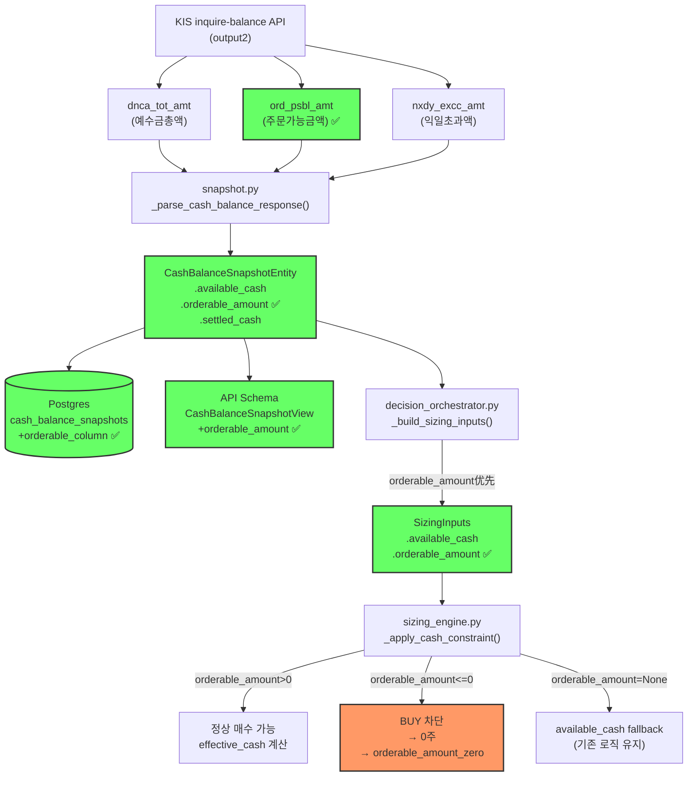

# KIS `ord_psbl_amt` Snapshot/Sizing 경로 반영 — 추가 매수 차단 복구

## 1. 문제 정의

### 1.1 현재 상태

시스템은 추가 매수 가능 여부를 `available_cash` (= `dnca_tot_amt` = 예수금총액) 기준으로 판단.

```
브로커 화면: ord_psbl_amt = -81,419,050원  (주문 불가)
시스템 DB:   available_cash = 27,329,630원   (주문 가능으로 오판)
```

**결과**: 실제로는 주문 불가능한 상황에서도 시스템이 추가 매수 가능하다고 판단하여 오주문 위험.

### 1.2 `available_cash` vs `orderable_amount` 차이

| 항목 | `available_cash` (기존) | `orderable_amount` (신규) |
|------|------------------------|--------------------------|
| KIS 필드 | `dnca_tot_amt` (예수금총액) | `ord_psbl_amt` (주문가능금액) |
| 의미 | D+2 결제 기준 계좌 총 현금 | 현재 실제 주문 가능 금액 |
| 미체결 반영 | 미반영 (순수 예수금) | 차감됨 (매수 주문 예약) |
| 음수 가능 | ❌ 불가 | ✅ 가능 (미체결 > 예수금) |
| 실제성 | 낮음 (장부상 금액) | 높음 (실질 주문 가능액) |

### 1.3 `settled_cash`와의 차이

`settled_cash` (= `nxdy_excc_amt` = 익일초과액)는 D+1 기준 결제 대기 금액으로, `orderable_amount`와는 또 다른 개념. `orderable_amount`는 **현재 즉시 주문 가능한 금액**으로 미체결 매수 주문의 예약 금액까지 차감된 값.

---

## 2. Raw Field Mapping

KIS [`inquire-balance`](https://apiportal.koreainvestment.com/apiservice/apiservice-domestic-stock#L_c5d1e2e0-5c5a-4b5a-8c5a-5c5a4b5a8c5a) API 응답의 `output2` 객체:

```
KIS API response (output2)
  ├── dnca_tot_amt    → available_cash     (예수금총액)       ✅ 기존
  ├── nxdy_excc_amt   → settled_cash       (익일초과액)       ✅ 기존
  ├── ord_psbl_amt    → orderable_amount   (주문가능금액)     🔥 신규
  ├── tot_evlu_amt    → total_asset        (총평가금액)       ✅ 기존
  ├── prvs_rcdl_excc_amt → settlement_amount (가수도정산금액)  ✅ 기존
  └── evlu_pfls_smtl_amt → total_unrealized_pnl (평가손익)    ✅ 기존
```

---

## 3. 변경 계층별 상세 설계

### 3.1 [`snapshot.py`](src/agent_trading/brokers/koreainvestment/snapshot.py) — raw cash 파싱

**변경 1**: 필드 상수 추가 (line 40-45 영역)

```python
_KIS_ORD_PSBL_AMT = "ord_psbl_amt"  # 주문가능금액 (신규)
```

**변경 2**: `_parse_cash_balance_response()` body (line 172-209 영역)

```python
# ord_psbl_amt 파싱 (신규)
orderable_amount = safe_optional_decimal(raw_cash.get(_KIS_ORD_PSBL_AMT))
```

`CashBalanceSnapshotEntity` 생성 시 `orderable_amount=orderable_amount` 추가.

### 3.2 [`entities.py`](src/agent_trading/domain/entities.py) — `CashBalanceSnapshotEntity`

**변경**: `orderable_amount: Decimal | None = None` 필드 추가 (기존 `total_asset` 등과 동일한 Optional 패턴)

```python
@dataclass(slots=True, frozen=True)
class CashBalanceSnapshotEntity:
    cash_balance_snapshot_id: UUID
    account_id: UUID
    currency: str
    available_cash: Decimal
    settled_cash: Decimal | None
    unsettled_cash: Decimal | None
    source_of_truth: str
    snapshot_at: datetime
    # ── KIS output2 account-level summary fields ──
    total_asset: Decimal | None = None
    settlement_amount: Decimal | None = None
    total_unrealized_pnl: Decimal | None = None
    orderable_amount: Decimal | None = None  # <-- 신규
    created_at: datetime | None = None
```

### 3.3 DB Migration — `cash_balance_snapshots` 테이블

신규 migration 파일 (`src/agent_trading/db/migrations/`)에 다음 SQL 추가:

```sql
ALTER TABLE trading.cash_balance_snapshots
    ADD COLUMN orderable_amount NUMERIC(30, 6);
```

### 3.4 [`cash_balance_snapshots.py`](src/agent_trading/repositories/postgres/cash_balance_snapshots.py) — Repository

**변경**: INSERT 컬럼 목록에 `orderable_amount` 추가, 바인딩 파라미터 추가

```sql
INSERT INTO trading.cash_balance_snapshots
    (cash_balance_snapshot_id, account_id, currency,
     available_cash, settled_cash, unsettled_cash,
     source_of_truth, snapshot_at,
     total_asset, settlement_amount, total_unrealized_pnl,
     orderable_amount)
VALUES ($1, $2, $3, $4, $5, $6, $7, $8, $9, $10, $11, $12)
```

바인딩: `snapshot.orderable_amount` 추가.

SELECT 쿼리는 `SELECT *`를 사용하므로 자동으로 새 컬럼이 포함됨. 별도 변경 불필요.

### 3.5 [`schemas.py`](src/agent_trading/api/schemas.py) — API `CashBalanceSnapshotView`

**변경**: `CashBalanceSnapshotView`에 `orderable_amount` 필드 추가

```python
class CashBalanceSnapshotView(BaseModel):
    model_config = ConfigDict(from_attributes=True)
    cash_balance_snapshot_id: UUID
    account_id: UUID
    currency: str
    available_cash: float
    settled_cash: float | None
    unsettled_cash: float | None
    total_asset: float | None
    settlement_amount: float | None
    total_unrealized_pnl: float | None
    orderable_amount: float | None  # <-- 신규
    source_of_truth: str
    snapshot_at: datetime
    created_at: datetime
```

### 3.6 [`sizing_engine.py`](src/agent_trading/services/sizing_engine.py) — `SizingInputs` + `_apply_cash_constraint`

**변경 1**: `SizingInputs`에 `orderable_amount` 필드 추가 (line 80-81 영역)

```python
# ── Cash (nullable, for cash-aware constraint) ──
available_cash: Decimal | None = None
"""Available cash balance from the latest snapshot (dnca_tot_amt)."""

orderable_amount: Decimal | None = None
"""Orderable amount from broker (ord_psbl_amt).  Preferred over
``available_cash`` when present.  Negative means no buying power."""
```

**변경 2**: `_apply_cash_constraint()`에 `orderable_amount` 파라미터 추가 + 우선순위 로직

```python
def _apply_cash_constraint(
    qty: Decimal,
    price: Decimal | None,
    available_cash: Decimal | None,
    min_cash_buffer_pct: Decimal | None,
    constraints: list[str],
    orderable_amount: Decimal | None = None,  # <-- 신규 파라미터
) -> Decimal:
    if price is None or price <= 0:
        return qty

    # ── 결정: 어떤 cash 값을 사용할지 ──
    # 우선순위: orderable_amount > available_cash
    if orderable_amount is not None:
        if orderable_amount <= 0:
            constraints.append("orderable_amount_zero")
            logger.info("BUY blocked: orderable_amount=%s <= 0", orderable_amount)
            return Decimal("0")
        effective_cash = orderable_amount
    elif available_cash is not None:
        effective_cash = available_cash
    else:
        return qty  # cash 정보 없음 → constraint 미적용

    if min_cash_buffer_pct is not None and min_cash_buffer_pct > 0:
        effective_cash = effective_cash * (Decimal("1") - min_cash_buffer_pct / Decimal("100"))

    max_qty_by_cash = (effective_cash / price).to_integral_value(rounding=ROUND_DOWN)
    if max_qty_by_cash < qty:
        constraints.append("cash_limit")
        return max_qty_by_cash
    return qty
```

**변경 3**: `_apply_cash_constraint()` 호출부 (line 457-465 영역) — `orderable_amount` 전달

```python
# ── Step 5: cash availability (BUY only) ──
if inputs.side == OrderSide.BUY:
    qty = _apply_cash_constraint(
        qty, inputs.requested_price,
        inputs.available_cash, inputs.min_cash_buffer_pct,
        constraints,
        orderable_amount=inputs.orderable_amount,
    )
```

### 3.7 [`decision_orchestrator.py`](src/agent_trading/services/decision_orchestrator.py) — `_build_sizing_inputs()`

**변경**: `orderable_amount` 추출 + `SizingInputs`에 전달 + source 로깅

```python
# ── Cash resolution: orderable_amount 우선, available_cash fallback ──
available_cash = ctx.cash_balance_snapshot.available_cash if ctx.cash_balance_snapshot else None
orderable_amount = ctx.cash_balance_snapshot.orderable_amount if ctx.cash_balance_snapshot else None

# 로깅
if orderable_amount is not None:
    logger.info("Cash source: orderable_amount=%s (preferred)", orderable_amount)
else:
    logger.info("Cash source: available_cash=%s (fallback, no orderable_amount)", available_cash)
```

`SizingInputs(orderable_amount=orderable_amount, ...)` 전달.

---

## 4. Sizing Cash 우선순위 정책

```
_apply_cash_constraint() cash 결정 로직:

Step 1: orderable_amount가 None이 아님?
  ├─ Yes → Step 2
  └─ No  → Step 4

Step 2: orderable_amount > 0?
  ├─ Yes → effective_cash = orderable_amount
  ├─ No (<= 0) → return 0 (BUY 차단), constraint="orderable_amount_zero"
  └─ logger.info("BUY blocked: orderable_amount=%s <= 0")

Step 3: min_cash_buffer_pct 적용
  → max_qty_by_cash = effective_cash × (1 - buffer%) / price
  → qty = min(qty, max_qty_by_cash)

Step 4 (fallback): available_cash가 None이 아님?
  ├─ Yes → available_cash 기준 (기존 로직)
  └─ No  → return qty (constraint 미적용)
```

### 음수/0 orderable_amount 처리

| orderable_amount | 동작 | constraint |
|-----------------|------|-----------|
| > 0 | 정상 매수 가능, 기준 금액으로 사용 | cash_limit (초과 시) |
| = 0 | BUY 차단 (0주) | orderable_amount_zero |
| < 0 | BUY 차단 (0주) | orderable_amount_zero |
| None | available_cash fallback | cash_limit (기존) |
| None + available_cash None | constraint 미적용 | 없음 |

---

## 5. 변경 파일 목록

| # | 파일 | 변경 내용 | 영향 범위 |
|---|------|----------|----------|
| 1 | [`snapshot.py`](src/agent_trading/brokers/koreainvestment/snapshot.py) | `_KIS_ORD_PSBL_AMT` 상수 + 파싱 + entity 전달 | Snapshot sync |
| 2 | [`entities.py`](src/agent_trading/domain/entities.py) | `CashBalanceSnapshotEntity.orderable_amount` 필드 추가 | Domain model |
| 3 | DB migration (신규) | `ALTER TABLE ... ADD COLUMN orderable_amount` | DB schema |
| 4 | [`cash_balance_snapshots.py`](src/agent_trading/repositories/postgres/cash_balance_snapshots.py) | INSERT 컬럼/파라미터 추가 | Repository |
| 5 | [`schemas.py`](src/agent_trading/api/schemas.py) | `CashBalanceSnapshotView.orderable_amount` 필드 추가 | API response |
| 6 | [`sizing_engine.py`](src/agent_trading/services/sizing_engine.py) | `SizingInputs.orderable_amount` + `_apply_cash_constraint()` 우선순위 + 음수 처리 | Sizing |
| 7 | [`decision_orchestrator.py`](src/agent_trading/services/decision_orchestrator.py) | `_build_sizing_inputs()`에 `orderable_amount` 전달 + 로깅 | Orchestrator |

### 변경하지 않는 파일

| 파일 | 이유 |
|------|------|
| `contracts.py` | `CashBalanceSnapshotRepository`는 entity를 직접 받음 → entity 필드 추가로 자동 반영 |
| `memory.py` | in-memory repository도 entity 기반이므로 자동 반영 |
| `bootstrap.py` | runtime wiring 변경 불필요 |
| `row_mapper.py` | row_to_entity()는 entity 필드 기준 자동 매핑 |
| `kis_snapshot_sync.py` | legacy/dead code — 수정 불필요 |

---

## 6. 테스트 계획 (7개 케이스)

### 6.1 신규 테스트

| # | 테스트 | 대상 | 검증 내용 |
|---|--------|------|----------|
| 1 | `ord_psbl_amt` 파싱 | snapshot.py | KIS response에서 `ord_psbl_amt` → `orderable_amount` 매핑 확인 |
| 2 | Entity round-trip | entities.py | `CashBalanceSnapshotEntity(orderable_amount=Decimal("100000"))` 생성/읽기 |
| 3 | Repository round-trip | postgres | INSERT → SELECT → `orderable_amount` 일치 확인 |
| 4 | `_build_sizing_inputs()` 우선순위 | orchestrator.py | `orderable_amount`가 있을 때 `available_cash`보다 우선 사용 |
| 5 | `orderable_amount < 0` BUY 차단 | sizing_engine.py | 음수 → 0주 + `orderable_amount_zero` constraint |
| 6 | `orderable_amount = 0` BUY 차단 | sizing_engine.py | 0 → 0주 + `orderable_amount_zero` constraint |
| 7 | `orderable_amount` None fallback | sizing_engine.py | None → `available_cash` 기준 정상 동작 |

### 6.2 기존 회귀 테스트

- `test_cash_constraint_basic` — `available_cash`만 있을 때 정상 동작
- `test_cash_constraint_buffer` — buffer 적용
- `test_cash_constraint_no_price` — price 없을 때 skip
- `test_cash_constraint_no_cash` — cash None일 때 skip
- 기존 snapshot/sizing/all agents tests

---

## 7. 실행 순서

```
Step 1: entities.py — orderable_amount 필드 추가
Step 2: snapshot.py — _KIS_ORD_PSBL_AMT 상수 + 파싱 + entity 전달
Step 3: DB migration 파일 생성
Step 4: postgres/cash_balance_snapshots.py — INSERT 컬럼 추가
Step 5: api/schemas.py — CashBalanceSnapshotView 필드 추가
Step 6: sizing_engine.py — SizingInputs + _apply_cash_constraint 변경
Step 7: decision_orchestrator.py — _build_sizing_inputs() 변경
Step 8: 신규 테스트 7개 추가
Step 9: pytest 실행 → 전체 통과 확인
Step 10: Docker rebuild + restart + /health 확인
Step 11: snapshot sync 1회 실행 → DB orderable_amount 저장 확인
Step 12: 샘플 orchestrator run 또는 재현 케이스 실행
Step 13: 보고서 최종 업데이트
```

---

## 8. Mermaid: 데이터 흐름 (After Fix)



---

## 9. 위험 평가 및 완화

| 위험 | 영향 | 완화 |
|------|------|------|
| `orderable_amount`가 기존 `available_cash`보다 항상 작은 것은 아님 | 과도한 매수 허용 | fallback 순서와 무관하게 둘 다 보수적 기준 적용 |
| 기존 `available_cash` 기반 로직에 영향 | 기존 동작 변경 | `orderable_amount`가 None이면 기존 동작 유지 |
| Migration 실패 | 서비스 중단 | `IF NOT EXISTS` 패턴, 롤백 가능 |
| `ord_psbl_amt`가 API 응답에 없을 때 | None 처리 | entity 기본값 None, fallback 로직으로 안전 |

---

## 10. Follow-up (v2)

1. **UI 분리 표시**: 관리자 화면에서 `available_cash`와 `orderable_amount`를 구분하여 표시 (현재는 `available_cash`만 표시)
2. **`settled_cash` 의미 문서화**: 혼동 방지를 위해 각 cash 필드의 의미를 명확히 문서화
3. **운영 로그/메트릭**: `orderable_amount_zero` constraint 발생 빈도를 메트릭으로 수집
4. **부분 허용 시나리오**: `orderable_amount > 0`이지만 일부만 사용 가능한 경우 (예: `orderable_amount < requested_qty × price`)
