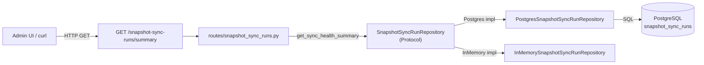

# Snapshot Sync Freshness / Health Summary

## 1. 목적

KIS snapshot sync가 최신 상태인지, 연속 실패 중인지, 마지막 성공 시점은 언제인지를
**단일 API 호출**로 판정 가능하게 만든다.

---

## 2. Freshness 판정 규칙

### 2.1 핵심 지표

| 지표 | 정의 | 출처 |
|------|------|------|
| `last_run_started_at` | 가장 최근 run의 `started_at` | `snapshot_sync_runs` 테이블 |
| `last_run_completed_at` | 가장 최근 run의 `completed_at` (nullable) | 동일 |
| `last_status` | 가장 최근 run의 `status` | 동일 |
| `last_successful_run_at` | 가장 최근 `status == 'completed'` run의 `started_at` | 동일 |
| `consecutive_failures` | 최근 run들을 역순으로 보며 `status == 'failed'`가 연속된 횟수 | 동일 |
| `is_stale` | `now - last_successful_run_at > stale_threshold_seconds` | 계산 |
| `stale_threshold_seconds` | 설정 가능한 임계값 (env: `KIS_SNAPSHOT_STALE_THRESHOLD_SECONDS`, default 900) | Config |

### 2.2 `consecutive_failures` 계산 알고리즘

```
items = snapshot_sync_runs ORDER BY started_at DESC LIMIT 100
count = 0
for each item in items:
    if item.status == 'failed':
        count += 1
    else:
        break
return count
```

- `completed` / `partial` / 기타 non-failed 상태를 만나면 중단
- run이 하나도 없으면 `0`

### 2.3 `is_stale` 판정

```
if last_successful_run_at is None:
    is_stale = True   # 단 한 번도 성공한 적 없음 → stale
else:
    elapsed = now - last_successful_run_at
    is_stale = elapsed.total_seconds() > stale_threshold_seconds
```

### 2.4 `partial` 상태 정책

- `partial`은 `completed`도 `failed`도 아님
- `consecutive_failures` 카운트에 포함되지 않음 (non-failed로 간주하여 중단)
- `is_stale` 계산에는 영향을 주지 않음 (직접 `last_successful_run_at` 기준)
- API 응답의 `last_status`에는 그대로 표시

---

## 3. 아키텍처



### 데이터 흐름

```
Request:  GET /snapshot-sync-runs/summary
            ↓
1. route는 repos.snapshot_sync_runs.get_sync_health_summary(
       stale_threshold_seconds=settings.kis_snapshot_stale_threshold_seconds
   ) 호출
            ↓
2. Repository가 SnapshotSyncHealthSummary dataclass 반환
            ↓
3. Route가 SnapshotSyncRunHealthSummary Pydantic schema로 변환
            ↓
Response: JSON
```

---

## 4. 변경 매트릭스

| # | 파일 | 변경 유형 | 설명 |
|---|------|-----------|------|
| 1 | `src/agent_trading/repositories/contracts.py` | 수정 | `SnapshotSyncHealthSummary` dataclass 추가, Protocol에 `get_sync_health_summary()` 추가 |
| 2 | `src/agent_trading/repositories/postgres/snapshot_sync_runs.py` | 수정 | Postgres `get_sync_health_summary()` 구현 (동적 SQL) |
| 3 | `src/agent_trading/repositories/memory.py` | 수정 | InMemory `get_sync_health_summary()` 구현 |
| 4 | `src/agent_trading/config/settings.py` | 수정 | `_resolve_kis_snapshot_stale_threshold_seconds()` + `AppSettings` field |
| 5 | `src/agent_trading/api/schemas.py` | 수정 | `SnapshotSyncRunHealthSummary` Pydantic model 추가 |
| 6 | `src/agent_trading/api/routes/snapshot_sync_runs.py` | 수정 | `GET /snapshot-sync-runs/summary` route 추가 (`/{run_id}`보다 먼저 등록) |
| 7 | `tests/api/test_snapshot_sync_runs.py` | 수정 | `TestSnapshotSyncRunHealthSummary` 클래스 추가 (4개 시나리오) |
| 8 | `plans/BACKLOG.md` | 수정 | 승격 기록 업데이트 |

---

## 5. 상세 설계

### 5.1 `SnapshotSyncHealthSummary` dataclass (contracts.py)

```python
@dataclass(slots=True, frozen=True)
class SnapshotSyncHealthSummary:
    last_run_started_at: datetime | None
    last_run_completed_at: datetime | None
    last_status: str | None
    last_successful_run_at: datetime | None
    consecutive_failures: int
    is_stale: bool
    stale_threshold_seconds: int
```

### 5.2 Protocol 메서드 (contracts.py)

```python
async def get_sync_health_summary(
    self,
    stale_threshold_seconds: int = 900,
) -> SnapshotSyncHealthSummary:
    """Compute a freshness/staleness summary for the most recent sync runs."""
    ...
```

### 5.3 Postgres 구현

```python
async def get_sync_health_summary(
    self, stale_threshold_seconds: int = 900
) -> SnapshotSyncHealthSummary:
    rows = await self._tx.connection.fetch(
        "SELECT * FROM trading.snapshot_sync_runs ORDER BY started_at DESC LIMIT 100"
    )
    if not rows:
        return SnapshotSyncHealthSummary(
            last_run_started_at=None, last_run_completed_at=None,
            last_status=None, last_successful_run_at=None,
            consecutive_failures=0, is_stale=True,
            stale_threshold_seconds=stale_threshold_seconds,
        )
    entities = [row_to_entity(row, SnapshotSyncRunEntity) for row in rows]
    last = entities[0]
    last_successful = next((e for e in entities if e.status == "completed"), None)
    consecutive_failures = 0
    for e in entities:
        if e.status == "failed":
            consecutive_failures += 1
        else:
            break
    now = datetime.now(timezone.utc)
    last_successful_at = last_successful.started_at if last_successful else None
    is_stale = True
    if last_successful_at is not None:
        is_stale = (now - last_successful_at).total_seconds() > stale_threshold_seconds
    return SnapshotSyncHealthSummary(
        last_run_started_at=last.started_at,
        last_run_completed_at=last.completed_at,
        last_status=last.status,
        last_successful_run_at=last_successful_at,
        consecutive_failures=consecutive_failures,
        is_stale=is_stale,
        stale_threshold_seconds=stale_threshold_seconds,
    )
```

### 5.4 InMemory 구현

동일 로직, `list(self._items.values())` 정렬 후 처리.

### 5.5 Config

```python
def _resolve_kis_snapshot_stale_threshold_seconds() -> int:
    raw = os.getenv("KIS_SNAPSHOT_STALE_THRESHOLD_SECONDS", "900")
    return max(1, int(raw))

# In AppSettings:
kis_snapshot_stale_threshold_seconds: int = field(
    default_factory=_resolve_kis_snapshot_stale_threshold_seconds
)
```

### 5.6 API Schema

```python
class SnapshotSyncRunHealthSummary(BaseModel):
    last_run_started_at: datetime | None = None
    last_run_completed_at: datetime | None = None
    last_status: str | None = None
    last_successful_run_at: datetime | None = None
    consecutive_failures: int = 0
    is_stale: bool = True
    stale_threshold_seconds: int = 900
```

### 5.7 Route (snapshot_sync_runs.py)

```python
@router.get("/summary", response_model=SnapshotSyncRunHealthSummary)
async def get_snapshot_sync_health_summary(
    repos: RepositoryContainer = Depends(get_repos),
    settings: AppSettings = Depends(lambda: get_settings()),
) -> SnapshotSyncRunHealthSummary:
    stale_threshold = settings.kis_snapshot_stale_threshold_seconds
    summary = await repos.snapshot_sync_runs.get_sync_health_summary(
        stale_threshold_seconds=stale_threshold,
    )
    return SnapshotSyncRunHealthSummary(
        last_run_started_at=summary.last_run_started_at,
        last_run_completed_at=summary.last_run_completed_at,
        last_status=summary.last_status,
        last_successful_run_at=summary.last_successful_run_at,
        consecutive_failures=summary.consecutive_failures,
        is_stale=summary.is_stale,
        stale_threshold_seconds=summary.stale_threshold_seconds,
    )
```

**중요**: `@router.get("/summary", ...)`는 `@router.get("/{run_id}", ...)`보다 **먼저** 등록되어야 함.
FastAPI는 등록 순서대로 route matching을 수행하므로, `summary`가 path parameter `{run_id}`로 해석되는 것을 방지.

### 5.8 settings DI

`get_settings()` 의존성은 `src/agent_trading/api/deps.py`에 정의되어 있어야 함.
FastAPI `Depends(get_settings)` 사용.

---

## 6. 테스트 시나리오

### 6.1 테스트 구조

`tests/api/test_snapshot_sync_runs.py`에 `TestSnapshotSyncRunHealthSummary` 클래스 추가.

### 6.2 시나리오

| # | 시나리오 | 설정 | 기대 결과 |
|---|----------|------|-----------|
| 1 | **Empty** (runs 없음) | runs 없음 | `last_status=None, last_successful_run_at=None, consecutive_failures=0, is_stale=True` |
| 2 | **Fresh** (최근 completed) | 10초 전 completed run 1개 | `last_status='completed', is_stale=False` (threshold 900 > 10) |
| 3 | **Stale** (오래된 completed) | 2000초 전 completed run 1개 | `last_status='completed', is_stale=True` (threshold 900 < 2000) |
| 4 | **Consecutive failures** | failed 3회 → completed 1회 | `last_status='failed', consecutive_failures=3, last_successful_run_at=completed.started_at` |

---

## 7. 변경 금지 확인

- [ ] Admin UI 변경 금지
- [ ] broker submit semantics 변경 금지
- [ ] hard guardrail/reconciliation 경계 변경 금지
- [ ] 기존 snapshot sync 실행 로직 (`sync_all_kis_accounts()`, scheduler) 변경 금지
- [ ] 기존 `list_runs()`, `get()` 메서드 시그니처 변경 금지

---

## 8. 실행 순서

1. **Plan 문서 작성** ← 본 문서
2. **Repository aggregate 메서드 추가**
   - `SnapshotSyncHealthSummary` dataclass (contracts.py)
   - `get_sync_health_summary()` Protocol (contracts.py)
   - Postgres 구현 (postgres/snapshot_sync_runs.py)
   - InMemory 구현 (memory.py)
3. **Config 추가** (settings.py)
4. **API Schema 추가** (schemas.py)
5. **Route 추가** (routes/snapshot_sync_runs.py)
6. **테스트 작성** (test_snapshot_sync_runs.py)
7. **문서 정리** (BACKLOG.md)
8. **최종 검증** — pytest full suite
