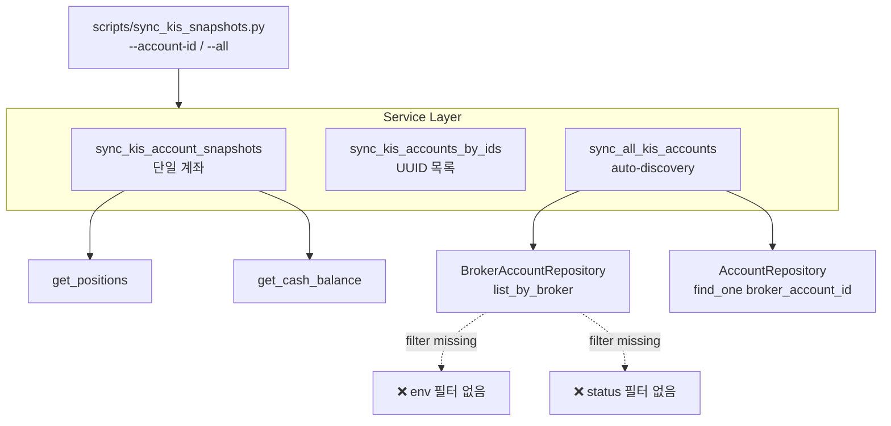
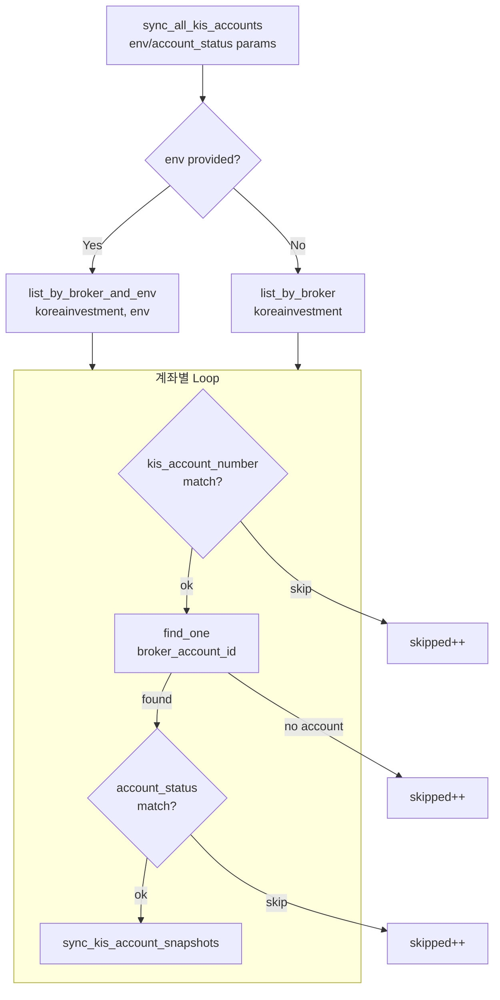

# KIS Snapshot Sync 운영화 — 수동 스크립트 → 반복 실행 가능한 백엔드 작업 단위로 승격

## 1. 현재 상태 분석

### 1.1 Service 계층 (`src/agent_trading/services/kis_snapshot_sync.py`)

| 함수 | 역할 | 필터 기능 | 문제점 |
|------|------|-----------|--------|
| `sync_kis_account_snapshots()` | 단일 계좌 snapshot 동기화 (positions + cash) | 없음 (account_id 필수) | ✅ 양호, 이름도 명확 |
| `sync_kis_accounts_by_ids()` | UUID 목록으로 배치 동기화 | 없음 (account_ids 필수) | ✅ 양호, per-account error isolation |
| `sync_all_kis_accounts()` | BrokerAccount 자동 탐색 → 동기화 | `kis_account_number` (account_ref)만 있음 | ❌ env 필터 없음, status 필터 없음 |

### 1.2 Repository Contract (`src/agent_trading/repositories/contracts.py`)

| Repository | 메서드 | 설명 |
|------------|--------|------|
| `BrokerAccountRepository` | `list_by_broker(broker_name)` | broker_name으로만 조회, env 필터 불가 |
| `AccountRepository` | `list_by_client(client_id)` | client_id로만 조회, `list_all()` 없음 |

### 1.3 CLI Script (`scripts/sync_kis_snapshots.py`)

| 옵션 | 현재 | 필요 |
|------|------|------|
| `--account-id` | ✅ UUID 단일/복수 | ✅ 유지 |
| `--all` | ✅ auto-discovery | ✅ 유지, 필터 옵션 확장 |
| `--env` | ❌ 없음 | 🔲 paper/live 환경 선택 |
| `--status` | ❌ 없음 | 🔲 active/inactive 계좌 선택 |
| `--account-ref` | ❌ 없음 | 🔲 account_ref 문자열로 lookup |
| `--dry-run` | ❌ 없음 | 🔲 실제 persist 없이 시뮬레이션 |
| `--format` | ❌ 없음 | 🔲 JSON 출력 (운영 자동화용) |
| `--account-number` | ❌ 없음 | 🔲 `kis_account_number` 필터 (기존 기능 CLI 노출) |

### 1.4 Test Coverage (`tests/services/test_kis_snapshot_sync.py`)

| Test Class | 테스트 수 | Coverage |
|------------|-----------|----------|
| `TestSyncPositions` | 6 | ✅ 단일/복수/unknown/missing/empty/error |
| `TestSyncCashBalance` | 4 | ✅ 정상/필드누락/empty/error |
| `TestSyncCombined` | 2 | ✅ full sync, append-only |
| `TestBatchSyncByIds` | 3 | ✅ 복수/부분실패/empty |
| `TestSyncAllKisAccounts` | 3 | ✅ discovery/account_number_filter/empty |
| **Missing** | **0** | **❌ env filter, status filter, dry-run, account-ref lookup** |

### 1.5 현재 아키텍처 (Mermaid)



---

## 2. 변경 계획

### Phase 1: Contract 확장 — Repository 메서드 추가

**파일**: [`src/agent_trading/repositories/contracts.py`](src/agent_trading/repositories/contracts.py:48)

`BrokerAccountRepository` Protocol에 새 메서드 추가 (기존 메서드 시그니처 변경 ❌):

```python
async def list_by_broker_and_env(
    self,
    broker_name: str,
    env: Environment,
) -> Sequence[BrokerAccountEntity]:
    """List broker accounts filtered by broker name and environment."""
    ...
```

**변경 영향**: 3개 파일
1. [`src/agent_trading/repositories/contracts.py`](src/agent_trading/repositories/contracts.py:48) — Protocol에 메서드 선언 추가
2. [`src/agent_trading/repositories/postgres/broker_accounts.py`](src/agent_trading/repositories/postgres/broker_accounts.py:67) — PostgreSQL 구현 추가
3. [`src/agent_trading/repositories/memory.py`](src/agent_trading/repositories/memory.py:684) — InMemory 구현 추가

**PostgreSQL query**:
```sql
SELECT * FROM trading.broker_accounts 
WHERE broker_name = $1 AND environment = $2 
ORDER BY account_ref
```

---

### Phase 2: Service 계층 개선 — 필터 파라미터 추가

**파일**: [`src/agent_trading/services/kis_snapshot_sync.py`](src/agent_trading/services/kis_snapshot_sync.py:302)

#### 2a. `sync_all_kis_accounts()` 에 env / account_status 파라미터 추가

```python
async def sync_all_kis_accounts(
    rest_client: KISRestClient,
    instrument_repo: InstrumentRepository,
    position_snapshot_repo: PositionSnapshotRepository,
    cash_balance_snapshot_repo: CashBalanceSnapshotRepository,
    broker_account_repo: BrokerAccountRepository,
    account_repo: AccountRepository,
    *,
    kis_account_number: str | None = None,
    env: Environment | None = None,          # ← NEW
    account_status: str | None = None,        # ← NEW
) -> BatchSyncResult:
```

**env 필터 로직**:
- `env`가 `None`이면 모든 환경 조회 (`list_by_broker`)
- `env`가 지정되면 해당 환경만 조회 (`list_by_broker_and_env`)

**account_status 필터 로직**:
- `account_status`가 `None`이면 통과
- `account_status`가 지정되면 `AccountEntity.status`와 비교, 불일치 시 skip

#### 2b. 실행 흐름 (Mermaid)



#### 2c. 필요한 import 추가

```python
from agent_trading.domain.enums import Environment
```

(현재 `Environment`가 import되어 있지 않음 — `sync_all_kis_accounts` 시그니처에 사용)

---

### Phase 3: CLI 진입점 개선

**파일**: [`scripts/sync_kis_snapshots.py`](scripts/sync_kis_snapshots.py:57)

#### 3a. 새 argparse 옵션

```python
parser.add_argument(
    "--env",
    choices=["paper", "live"],
    help="Filter by KIS environment (paper|live).",
)
parser.add_argument(
    "--status",
    type=str,
    default=None,
    help="Filter by AccountEntity.status value (e.g. active, inactive). "
         "Must match the exact status string stored in the DB.",
)
parser.add_argument(
    "--account-ref",
    type=str,
    help="Lookup by KIS account reference string (e.g. 50186448). "
         "Resolves broker_account via BrokerAccountRepository.get_by_ref, "
         "then syncs the linked AccountEntity. Mutually exclusive with --account-id and --all.",
)
parser.add_argument(
    "--dry-run",
    action="store_true",
    help="Perform KIS fetch but roll back the DB transaction. "
         "Useful for testing connectivity and data format without persisting.",
)
parser.add_argument(
    "--format",
    choices=["text", "json"],
    default="text",
    help="Output format. 'json' writes pure JSON to stdout "
         "(warnings/logs go to stderr); 'text' prints human-readable tables.",
)
```

#### 3b. `_run_all()` 변경 — env/status 파라미터 전달

```python
batch = await sync_all_kis_accounts(
    ...,
    env=Environment(args.env) if args.env else None,
    account_status=args.status,
    kis_account_number=args.kis_account_number or settings.kis_account_number,
)
```

#### 3c. `_run_single()` / `_run_multi()` / `_run_all()` — --format json 지원

`--format json` 모드에서는 stdout에 순수 JSON만 출력, 경고/로그는 모두 stderr로 분리:

```python
import json
import sys

def _emit_json(obj: object) -> None:
    """Write a JSON-serializable object to stdout and flush."""
    json.dump(obj, sys.stdout, indent=2, default=str)
    sys.stdout.write("\n")
    sys.stdout.flush()

def _print_sync_result(account_id: UUID, result: SyncResult, fmt: str = "text") -> None:
    if fmt == "json":
        _emit_json({
            "account_id": str(account_id),
            "positions_synced": result.positions_synced,
            "positions_skipped": result.positions_skipped,
            "cash_balance_synced": result.cash_balance_synced,
            "errors": result.errors,
        })
        return
    # ... 기존 text 출력
```

JSON 출력 구조:
```json
{
  "status": "success" | "partial" | "failure",
  "total_accounts": 2,
  "succeeded": 1,
  "partial": 1,
  "failed": 0,
  "skipped": 0,
  "total_positions_synced": 3,
  "total_cash_synced": 2,
  "account_results": [
    {"account_id": "uuid", "positions_synced": 2, "cash_balance_synced": true, "errors": []},
    {"account_id": "uuid", "positions_synced": 1, "cash_balance_synced": true, "errors": ["..."]}
  ],
  "errors": []
}
```

#### 3d. `--account-ref` 처리 — `--account-number` 제거, `--account-ref`로 통일

`_run()` 에서 `args.account_ref`가 주어지면:
1. `BrokerAccountRepository.get_by_ref("koreainvestment", account_ref, env)` 로 BrokerAccountEntity 조회
2. `AccountRepository.find_one(AccountLookup(broker_account_id=...))` 로 AccountEntity 조회
3. `sync_kis_account_snapshots()` 실행

`--account-ref`는 `--account-id` 및 `--all`과 상호 배타적(mutually exclusive).
`--account-number` 옵션은 제거 (중복 방지).

#### 3e. `--dry-run` 처리 (KIS fetch 수행, DB persist만 rollback)

**동작 정의**:
- ✅ KIS REST API (`get_positions()`, `get_cash_balance()`)는 **실제 호출** — 인증/네트워크/데이터 형식 검증
- ❌ snapshot entity 생성 및 DB persist는 수행되지만 **최종 rollback** — DB에 영향 없음
- ✅ 모든 중간 로그(stderr)는 정상 출력
- ✅ 최종 리포트(stdout)는 dry-run임을 명시

**구현**: CLI `_run()` 레벨에서만 처리:

```python
async def _run(args: argparse.Namespace) -> int:
    ...
    async with transaction() as tx:
        repos = build_postgres_repositories(tx)
        exit_code = await _route(args, rest_client, repos, settings)
        
        if args.dry_run:
            logger.info("DRY RUN — rolling back transaction (no data persisted)")
            await tx.rollback()
        else:
            await tx.commit()
    ...
```

리포트 출력 시 dry-run 표시:
```python
def _print_batch_summary(batch: BatchSyncResult, dry_run: bool = False) -> None:
    if dry_run:
        print("  🏁 DRY RUN — no data was persisted")
    ...
```

#### 3f. Exit code 정책 문서화

| Exit Code | 의미 |
|-----------|------|
| 0 | 모든 계좌 성공 (전체 succeeded, 0 failed) |
| 1 | 일부 실패 (partial success 포함, 1개 이상 fail) |
| 2 | 사용 오류 (인자 누락, 잘못된 값) |

---

### Phase 4: 테스트 보강

**파일**: [`tests/services/test_kis_snapshot_sync.py`](tests/services/test_kis_snapshot_sync.py)

#### 4a. 새 Test Class: `TestSyncAllWithEnvFilter`

```python
class TestSyncAllWithEnvFilter:
    """``sync_all_kis_accounts()`` — env filter tests."""

    async def test_filter_env_paper_only(
        self,
        instrument_repo: InMemoryInstrumentRepository,
        position_repo: InMemoryPositionSnapshotRepository,
        cash_repo: InMemoryCashBalanceSnapshotRepository,
    ) -> None:
        """When env=Environment.PAPER, only paper accounts are synced."""
        # Setup: 1 paper + 1 live broker account
        # Both have matching AccountEntity
        # Sync with env=Environment.PAPER
        # Assert: 1 succeeded (paper), 0 failed (live not even discovered)

    async def test_filter_env_live_only(
        self,
        ...
    ) -> None:
        """When env=Environment.LIVE, only live accounts are synced."""

    async def test_filter_env_none(
        self,
        ...
    ) -> None:
        """When env=None, all environments are synced (backward compat)."""
```

#### 4b. 새 Test Class: `TestSyncAllWithStatusFilter`

```python
class TestSyncAllWithStatusFilter:
    """``sync_all_kis_accounts()`` — account_status filter tests."""

    async def test_filter_status_active(
        self,
        ...
    ) -> None:
        """When account_status='active', inactive accounts are skipped."""

    async def test_filter_status_inactive(
        self,
        ...
    ) -> None:
        """When account_status='inactive', active accounts are skipped."""

    async def test_filter_status_none(
        self,
        ...
    ) -> None:
        """When account_status=None, all statuses are synced (backward compat)."""
```

#### 4c. 기존 테스트 수정

`TestSyncAllKisAccounts.test_sync_all_discovery` — `env=None`으로 명시적 호출하여 backward compat 확인 (선택사항)

#### 4d. 테스트 추가 요약

| 새 테스트 | 검증 내용 |
|-----------|-----------|
| `test_filter_env_paper_only` | paper 계좌만 동기화 |
| `test_filter_env_live_only` | live 계좌만 동기화 |
| `test_filter_env_none` | env 미지정 시 전체 동기화 |
| `test_filter_status_active` | active 계좌만 동기화 |
| `test_filter_status_inactive` | inactive 계좌만 동기화 |
| `test_filter_status_none` | status 미지정 시 전체 동기화 |
| `test_filter_combined_env_status` (optional) | env + status 동시 필터 |

---

### Phase 5: 운영 문서 정리

**파일**: [`plans/BACKLOG.md`](plans/BACKLOG.md)

#### 5a. BACKLOG.md 업데이트

기존 near-term 항목 "스케줄러가 동작 중인지 확인할 수 있는 Admin UI health indicator" 는 유지하되,
완료된 `snapshot-sync` scheduler 도입 Task 상태를 업데이트.

#### 5b. 실행 예시

```bash
# 모든 KIS 계좌 동기화 (기존 방식, 변경 없음)
python scripts/sync_kis_snapshots.py --all

# Paper 환경만 동기화
python scripts/sync_kis_snapshots.py --all --env paper

# Live 환경 + active 계좌만 동기화
python scripts/sync_kis_snapshots.py --all --env live --status active

# 특정 account_ref로 lookup
python scripts/sync_kis_snapshots.py --account-ref 50186448

# Dry-run 모드 (실제 저장 없음)
python scripts/sync_kis_snapshots.py --all --dry-run

# JSON 형식으로 출력 (CI/CD 파이프라인 연동용)
python scripts/sync_kis_snapshots.py --all --format json

# 복수 UUID 직접 지정
python scripts/sync_kis_snapshots.py \
  --account-id 301961b4-7f5a-5b41-a87e-2988c811cd09 \
  --account-id 4a24fb85-0c8d-51c5-8a2b-fe3cd9ae47e5
```

---

## 3. 변경 금지 확인

| 항목 | 상태 | 근거 |
|------|------|------|
| Admin UI 변경 | ✅ 금지 | Frontend 파일 수정 없음 |
| Broker submit semantics | ✅ 금지 | `submit_order()` 등 미접촉 |
| Guardrail/reconciliation 경계 | ✅ 금지 | 해당 도메인 미접촉 |
| UUID 정책 재작업 | ✅ 금지 | `entities.py` UUID 필드 미접촉 |
| Domain entity/enum 변경 | ✅ 금지 | 새 enum 추가 없음, `Environment`는 이미 존재 |
| 기존 메서드 시그니처 변경 | ✅ 금지 | 새 메서드만 추가 (Protocol 확장) |

---

## 4. 변경 요약

| Phase | 파일 | 변경 유형 | 라인 수 (estimated) |
|-------|------|-----------|---------------------|
| 1 | `contracts.py` | Protocol에 `list_by_broker_and_env` 추가 | +5 |
| 1 | `postgres/broker_accounts.py` | PostgreSQL 구현 추가 | +10 |
| 1 | `memory.py` | InMemory 구현 추가 | +5 |
| 2 | `kis_snapshot_sync.py` | `sync_all_kis_accounts()`에 env/status 파라미터 + import | +30 |
| 3 | `sync_kis_snapshots.py` | argparse 옵션 5개 + _run 로직 + dry-run/format | +80 |
| 4 | `test_kis_snapshot_sync.py` | 새 Test Class 2개 + 테스트 6-7개 | +150 |
| 5 | `BACKLOG.md` | 상태 업데이트 | +5 |

---

## 5. Todo List (실행 순서)

- [x] **Step 0**: 현재 코드 분석 완료
- [x] **Step 0b**: 계획 문서 작성 (본 문서)
- [ ] **Phase 1-1**: `contracts.py` — `BrokerAccountRepository`에 `list_by_broker_and_env` 메서드 선언 추가
- [ ] **Phase 1-2**: `postgres/broker_accounts.py` — PostgreSQL 구현 추가
- [ ] **Phase 1-3**: `memory.py` — InMemory 구현 추가
- [ ] **Phase 2**: `kis_snapshot_sync.py` — `sync_all_kis_accounts()`에 `env` / `account_status` 파라미터 추가
- [ ] **Phase 3-1**: `sync_kis_snapshots.py` — argparse에 `--env`, `--status`, `--account-ref`, `--dry-run`, `--format` 옵션 추가
- [ ] **Phase 3-2**: `sync_kis_snapshots.py` — `_run_all()`에 필터 파라미터 전달 로직 추가
- [ ] **Phase 3-3**: `sync_kis_snapshots.py` — `_run_single()`/`_run_multi()`에 `--format json` 지원
- [ ] **Phase 3-4**: `sync_kis_snapshots.py` — `_run()`에 `--dry-run` + `--account-ref` 분기 처리
- [ ] **Phase 4**: `test_kis_snapshot_sync.py` — env filter 테스트 3개 + status filter 테스트 3개 추가
- [ ] **Phase 5**: `BACKLOG.md` — near-term 항목 업데이트
- [ ] **Phase 6**: 전체 pytest 실행 (신규 테스트 6개 포함) + E2E 검증
