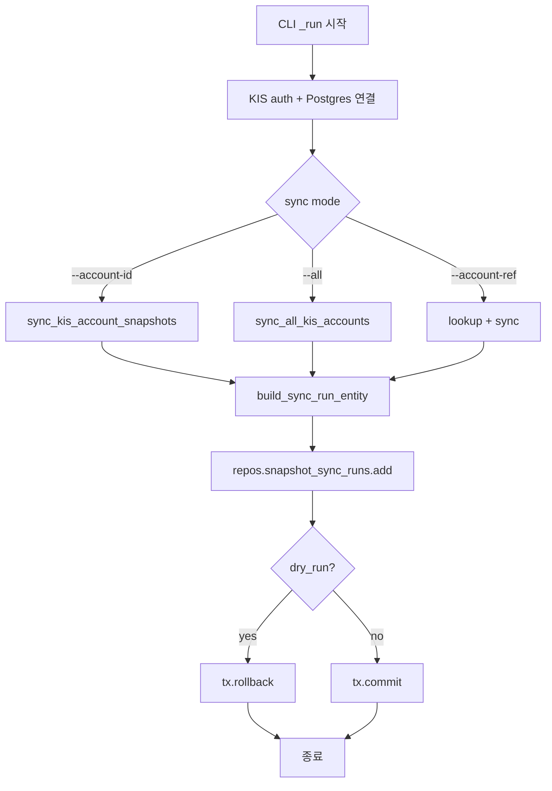
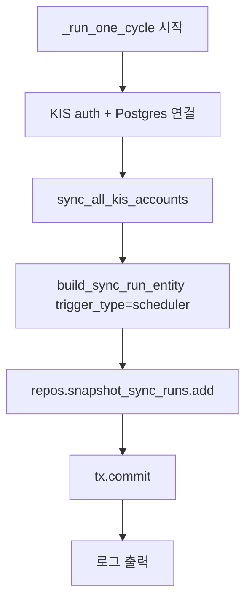

# KIS Snapshot Sync 실행 이력 저장 — 운영용 job history/observability 추가

## 1. 현재 상태 분석

### 1.1 실행 흐름 (변경 전)

```
CLI (sync_kis_snapshots.py) ──→ service ──→ snapshot tables
                                     ↕
Scheduler (run_snapshot_sync_loop.py) ──→ service ──→ snapshot tables
```

- 실행 결과는 `BatchSyncResult` 메모리 객체와 프로세스 로그로만 확인 가능
- DB에 구조화된 실행 이력 없음 → "언제 돌았고, 몇 계좌/몇 포지션/몇 실패가 있었는지" 추적 불가

### 1.2 기존 패턴 (참조: `ReconciliationRunEntity`)

```python
@dataclass(slots=True, frozen=True)
class ReconciliationRunEntity:
    reconciliation_run_id: UUID
    account_id: UUID
    trigger_type: str          # "manual" | "scheduler"
    status: str                # "completed" | "partial" | "failed"
    started_at: datetime
    mismatch_count: int = 0
    summary_json: dict[str, object] = field(default_factory=dict)
    completed_at: datetime | None = None
    created_at: datetime | None = None
```

`SnapshotSyncRunEntity`도 유사한 run-level summary 패턴을 따른다.

## 2. 설계

### 2.1 새 Entity: `SnapshotSyncRunEntity`

```python
@dataclass(slots=True, frozen=True)
class SnapshotSyncRunEntity:
    snapshot_sync_run_id: UUID
    trigger_type: str           # "manual" | "scheduler"
    scope: str                  # "single" | "batch" | "all"
    env_filter: str | None      # "paper" | "live" | None
    status_filter: str | None   # free-form status value or None
    dry_run: bool
    total_accounts: int
    succeeded_accounts: int
    partial_accounts: int
    failed_accounts: int
    skipped_accounts: int
    positions_synced_total: int
    positions_skipped_total: int
    cash_synced_count: int
    error_count: int
    status: str                 # "completed" | "partial" | "failed"
    started_at: datetime
    completed_at: datetime | None = None
    summary_json: dict[str, object] | None = None
    created_at: datetime | None = None
```

### 2.2 상태 분류 규칙

`BatchSyncResult`의 필드를 기준으로 `status` 결정:

| 조건 | status |
|------|--------|
| `failed == 0` and `errors == []` | `completed` |
| `failed > 0` or `errors` present, 하지만 `succeeded > 0` or `partial > 0` | `partial` |
| 그 외 (전체 실패) | `failed` |

기존 `_batch_result_to_dict()`의 로직과 동일:
```python
"status": "success" if batch.failed == 0 and not batch.errors else (
    "partial" if batch.partial > 0 else "failure"
)
```

### 2.3 DB Migration: `0011_add_snapshot_sync_runs.sql`

```sql
BEGIN;

CREATE TABLE IF NOT EXISTS trading.snapshot_sync_runs (
    snapshot_sync_run_id UUID PRIMARY KEY DEFAULT gen_random_uuid(),
    trigger_type VARCHAR(32) NOT NULL,
    scope VARCHAR(32) NOT NULL,
    env_filter VARCHAR(16),
    status_filter VARCHAR(64),
    dry_run BOOLEAN NOT NULL DEFAULT FALSE,
    total_accounts INTEGER NOT NULL DEFAULT 0,
    succeeded_accounts INTEGER NOT NULL DEFAULT 0,
    partial_accounts INTEGER NOT NULL DEFAULT 0,
    failed_accounts INTEGER NOT NULL DEFAULT 0,
    skipped_accounts INTEGER NOT NULL DEFAULT 0,
    positions_synced_total INTEGER NOT NULL DEFAULT 0,
    positions_skipped_total INTEGER NOT NULL DEFAULT 0,
    cash_synced_count INTEGER NOT NULL DEFAULT 0,
    error_count INTEGER NOT NULL DEFAULT 0,
    status VARCHAR(32) NOT NULL,
    started_at TIMESTAMPTZ NOT NULL,
    completed_at TIMESTAMPTZ,
    summary_json JSONB,
    created_at TIMESTAMPTZ NOT NULL DEFAULT NOW()
);

CREATE INDEX idx_snapshot_sync_runs_started_at
    ON trading.snapshot_sync_runs (started_at DESC);
CREATE INDEX idx_snapshot_sync_runs_status
    ON trading.snapshot_sync_runs (status);
CREATE INDEX idx_snapshot_sync_runs_trigger_type
    ON trading.snapshot_sync_runs (trigger_type);

COMMIT;
```

### 2.4 Repository Contract: `SnapshotSyncRunRepository`

```python
class SnapshotSyncRunRepository(Protocol):
    async def add(self, run: SnapshotSyncRunEntity) -> SnapshotSyncRunEntity:
        ...
```

최소 `add()`만 구현. 추후 `list_recent()`는 필요 시 추가.

### 2.5 PostgreSQL Repository

```python
class PostgresSnapshotSyncRunRepository:
    async def add(self, run: SnapshotSyncRunEntity) -> SnapshotSyncRunEntity:
        row = await self._tx.connection.fetchrow(
            """INSERT INTO trading.snapshot_sync_runs
               (snapshot_sync_run_id, trigger_type, scope,
                env_filter, status_filter, dry_run,
                total_accounts, succeeded_accounts, partial_accounts,
                failed_accounts, skipped_accounts,
                positions_synced_total, positions_skipped_total,
                cash_synced_count, error_count,
                status, started_at, completed_at, summary_json,
                created_at)
               VALUES ($1, $2, $3, $4, $5, $6, $7, $8, $9, $10,
                       $11, $12, $13, $14, $15, $16, $17, $18, $19, $20)
               RETURNING *""",
            ...
        )
        return row_to_entity(row, SnapshotSyncRunEntity)
```

### 2.6 InMemory Repository

```python
class InMemorySnapshotSyncRunRepository:
    def __init__(self):
        self._items: dict[UUID, SnapshotSyncRunEntity] = {}
    
    async def add(self, run: SnapshotSyncRunEntity) -> SnapshotSyncRunEntity:
        self._items[run.snapshot_sync_run_id] = run
        return run
```

## 3. 변경 사항

### 3.1 변경 파일 목록

| 파일 | 변경 내용 |
|------|----------|
| `src/agent_trading/domain/entities.py` | `SnapshotSyncRunEntity` dataclass 추가 |
| `db/migrations/0011_add_snapshot_sync_runs.sql` | **신규** — migration 파일 |
| `src/agent_trading/repositories/contracts.py` | `SnapshotSyncRunRepository` Protocol 추가 |
| `src/agent_trading/repositories/postgres/snapshot_sync_runs.py` | **신규** — PostgreSQL 구현 |
| `src/agent_trading/repositories/memory.py` | `InMemorySnapshotSyncRunRepository` 추가 |
| `src/agent_trading/repositories/container.py` | `snapshot_sync_runs` 필드 추가 |
| `src/agent_trading/repositories/bootstrap.py` | InMemory wiring 추가 |
| `src/agent_trading/repositories/postgres/bootstrap.py` | Postgres wiring 추가 |
| `src/agent_trading/services/kis_snapshot_sync.py` | `build_sync_run_entity()` helper 추가 |
| `scripts/sync_kis_snapshots.py` | `_run()` 함수에 history 기록 로직 추가 |
| `scripts/run_snapshot_sync_loop.py` | `_run_one_cycle()` 함수에 history 기록 로직 추가 |
| `tests/services/test_kis_snapshot_sync.py` | 신규 테스트 추가 |
| `plans/BACKLOG.md` | 운영 문서 업데이트 |

### 3.2 변경 금지 확인

- [x] Admin UI 변경 없음
- [x] 기존 snapshot API 변경 없음
- [x] broker submit semantics 변경 없음
- [x] hard guardrail / reconciliation 경계 변경 없음
- [x] 기존 snapshot sync 기능 의미 변경 없음

## 4. 실행 흐름 (변경 후)

### 4.1 CLI (`sync_kis_snapshots.py`)



### 4.2 Scheduler (`run_snapshot_sync_loop.py`)



## 5. History 기록 정책

| 시나리오 | trigger_type | scope | dry_run | 기록 여부 |
|----------|-------------|-------|---------|----------|
| `--account-id X` | `manual` | `single` | `false` | ✅ 저장 |
| `--account-id X --dry-run` | `manual` | `single` | `true` | ✅ 저장 |
| `--account-id X Y` | `manual` | `batch` | `false` | ✅ 저장 |
| `--all` | `manual` | `all` | `false` | ✅ 저장 |
| `--all --dry-run` | `manual` | `all` | `true` | ✅ 저장 |
| `--account-ref X` | `manual` | `single` | `false` | ✅ 저장 |
| Scheduler 주기 실행 | `scheduler` | `all` | `false` | ✅ 저장 |

dry-run도 기록하는 이유: 운영자가 시뮬레이션 실행도 추적 가능해야 함.

## 6. `build_sync_run_entity()` 함수 설계

```python
def build_sync_run_entity(
    batch: BatchSyncResult,
    *,
    trigger_type: str,
    scope: str,
    env_filter: str | None,
    status_filter: str | None,
    dry_run: bool,
    started_at: datetime | None = None,
) -> SnapshotSyncRunEntity:
    """Build a ``SnapshotSyncRunEntity`` from a ``BatchSyncResult`` + metadata.
    
    Parameters
    ----------
    batch : BatchSyncResult
        The result of a snapshot sync run.
    trigger_type : str
        ``"manual"`` or ``"scheduler"``.
    scope : str
        ``"single"``, ``"batch"``, or ``"all"``.
    env_filter : str | None
        The environment filter used (``"paper"`` / ``"live"`` / ``None``).
    status_filter : str | None
        The account status filter used, or ``None``.
    dry_run : bool
        Whether this was a dry run.
    started_at : datetime | None
        When the run started. Defaults to ``datetime.now(timezone.utc)``.
    """
    error_count = len(batch.errors)
    now = datetime.now(timezone.utc)
    
    # Determine run status
    if batch.failed == 0 and error_count == 0:
        status = "completed"
    elif batch.partial > 0 or batch.succeeded > 0:
        status = "partial"
    else:
        status = "failed"
    
    return SnapshotSyncRunEntity(
        snapshot_sync_run_id=uuid4(),
        trigger_type=trigger_type,
        scope=scope,
        env_filter=env_filter,
        status_filter=status_filter,
        dry_run=dry_run,
        total_accounts=batch.total_accounts,
        succeeded_accounts=batch.succeeded,
        partial_accounts=batch.partial,
        failed_accounts=batch.failed,
        skipped_accounts=batch.skipped,
        positions_synced_total=batch.total_positions_synced,
        positions_skipped_total=batch.total_positions_skipped,
        cash_synced_count=batch.total_cash_synced,
        error_count=error_count,
        status=status,
        started_at=started_at or now,
        completed_at=now,
    )
```

## 7. 테스트 계획

### 7.1 Entity/Repository round-trip 테스트

```python
class TestSnapshotSyncRunEntity:
    """``SnapshotSyncRunEntity`` construction and round-trip."""

class TestSnapshotSyncRunRepository:
    """InMemory round-trip: add + verify fields."""
```

### 7.2 `build_sync_run_entity()` 테스트

```python
class TestBuildSyncRunEntity:
    """``build_sync_run_entity()`` status classification."""
    - test_build_completed: 0 failed, 0 errors → "completed"
    - test_build_partial: some errors but partial success → "partial"
    - test_build_failed: all failed → "failed"
    - test_build_dry_run: dry_run=True preserved
    - test_build_metadata: trigger_type/scope/env_filter preserved
    - test_build_counts: all BatchSyncResult counts mapped correctly
```

### 7.3 History 저장 통합 테스트 (선택)

실제 CLI 실행 경로에서 history 저장 검증은 integration에 가까우므로, unit test는 entity/repository/helper 함수에 집중한다.

## 8. Todo List (실행 순서)

1. **Entity 추가** — `SnapshotSyncRunEntity` in `entities.py`
2. **Migration 작성** — `0011_add_snapshot_sync_runs.sql`
3. **Repository Contract** — `SnapshotSyncRunRepository` Protocol in `contracts.py`
4. **PostgreSQL Repository** — `PostgresSnapshotSyncRunRepository`
5. **InMemory Repository** — `InMemorySnapshotSyncRunRepository`
6. **Container + Bootstrap** — wiring in `container.py`, `bootstrap.py`, `postgres/bootstrap.py`
7. **Service Helper** — `build_sync_run_entity()` in `kis_snapshot_sync.py`
8. **CLI 연결** — `sync_kis_snapshots.py` `_run()`에 history 저장 로직
9. **Scheduler 연결** — `run_snapshot_sync_loop.py` `_run_one_cycle()`에 history 저장 로직
10. **테스트 보강** — entity/repository/helper unit tests
11. **운영 문서 정리** — BACKLOG.md 업데이트
12. **최종 검증** — pytest 전체 실행
