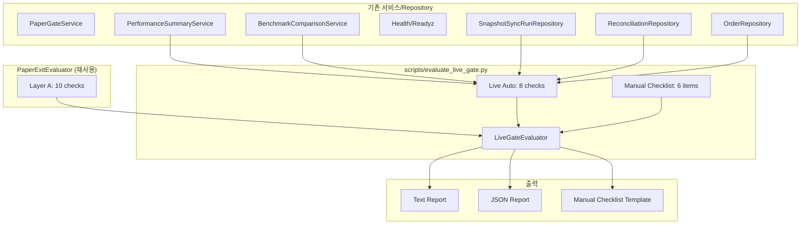
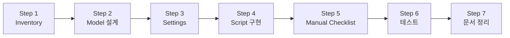

# Live Gate / Canary Readiness — 설계 문서

> **상위 원칙**: Paper Exit은 **paper 단계 합격 여부**를 판정하고, Live Gate는 그 위에서 **live 검토 자격 + canary 진입 가능성**을 평가한다.
> Live Gate는 Paper Exit을 **전제**하며, 더 엄격한 기준을 추가로 검증한다.
>
> Same-system different-mode 원칙 유지 — 모든 평가는 **읽기 전용(read-only)** 이며,
> live API key를 사용한 주문 실행은 절대 하지 않는다.

---

## 1. Live Gate Criteria Inventory — 3분류표

### 범례

| 분류 | 의미 | 비고 |
|------|------|------|
| **🔄 paper exit 재사용** | PaperExitEvaluator의 Layer A/B/C 항목 중 live gate에서도 동일하게 검증 | 변경 없이 재사용, semantics 변경 금지 |
| **🆕 live-specific 추가** | paper exit보다 엄격한 기준 또는 live 전용 신규 항목 | 신규 threshold/env var 필요 |
| **👤 manual-only** | 운영자 수동 판단 필요 항목 | 체크리스트 템플릿만 제공 |

### 1.1 Paper Exit 재사용 항목

Paper Exit Criteria의 Layer A (자동 판정) 10개 항목 중, **성과/안정성 축은 live-specific threshold로 재평가**하고, **운영 축은 동일하게 재사용**한다.

| Paper Exit Code | 재사용 방식 |
|----------------|-------------|
| `MIN_RETURN` | 동일 로직, live-specific threshold로 재평가 |
| `MAX_DRAWDOWN` | 동일 로직, live-specific threshold로 재평가 (더 엄격) |
| `MIN_EXCESS_RETURN` | 동일 로직, live-specific threshold로 재평가 (더 엄격) |
| `MIN_WIN_RATE` | 동일 로직, live-specific threshold로 재평가 |
| `MIN_FILLED_ORDERS` | 동일 로직, live-specific threshold로 재평가 (더 엄격) |
| `SNAPSHOT_FRESHNESS` | 동일 로직, 동일 threshold 재사용 |
| `SYNC_FAILURES` | 동일 로직, 동일 threshold 재사용 |
| `BLOCKING_LOCKS` | 동일 로직, 동일 threshold 재사용 |
| `HEALTH_ENDPOINT` | 동일 로직 재사용 |
| `READYZ_ENDPOINT` | 동일 로직 재사용 |

Paper Exit Layer B (부분 자동) 상태:
- Paper exit `B1~B5`는 paper-only 검증이므로 live gate에서 **재평가하지 않음**
- 단, paper exit 평가 당시 Layer B가 `OK`였는지 **이력으로 참조**

Paper Exit Layer C (수동 검증) 상태:
- Paper exit `C1~C5`가 완료(`DONE`)되었는지 **이력으로 참조**

### 1.2 Live-Specific Additional Checks

| # | Code | Layer | 설명 | 데이터 소스 | Threshold |
|---|------|-------|------|-----------|-----------|
| 1 | `LG_FILLED_ORDERS` | auto | paper 기간 내 최소 체결 건수 (stricter) | `PerformanceSummaryService.get_performance_metrics()` | `LIVE_GATE_MIN_FILLED_ORDERS` (default 10) |
| 2 | `LG_MAX_DRAWDOWN` | auto | 최대 손실 폭 제한 (stricter) | `PerformanceSummaryService.get_performance_metrics()` | `LIVE_GATE_MAX_DRAWDOWN_PCT` (default 10.0) |
| 3 | `LG_EXCESS_RETURN` | auto | 벤치마크 대비 초과수익 (stricter) | `BenchmarkComparisonService.get_benchmark_comparison()` | `LIVE_GATE_MIN_EXCESS_RETURN_PCT` (default 0.0) |
| 4 | `LG_WIN_RATE` | auto | 최소 승률 (stricter) | `PerformanceSummaryService.get_performance_metrics()` | paper gate threshold 재사용 |
| 5 | `LG_RECENT_RECONCILE` | auto | 최근 N회 decision cycle 중 `reconcile_required` 발생 횟수 | `ReconciliationRepository.list_recent_runs()` 또는 `OrderRepository.list()` + `RECONCILE_REQUIRED` 필터 | `LIVE_GATE_MAX_RECENT_RECONCILE_REQUIRED` (default 2) |
| 6 | `LG_RECENT_BLOCKING_LOCKS` | auto | 최근 N일 내 활성 차단 lock 존재 여부 | `ReconciliationRepository.list_all_active_locks()` | `LIVE_GATE_MAX_RECENT_BLOCKING_LOCKS` (default 1) |
| 7 | `LG_READYZ` | auto | `/health/readyz` 최근 응답 degraded 여부 | `SnapshotSyncRunRepository.get_sync_health_summary()` | `is_stale == False` |
| 8 | `LG_POST_SUBMIT_SYNC` | auto | post-submit sync 최근 N회 성공률 | `OrderSyncService` 또는 `BrokerOrderRepository.last_synced_at` 조회 | 신규: 최근 5회 중 80% 이상 성공 |

> **참고**: `LG_FILLED_ORDERS`, `LG_MAX_DRAWDOWN`, `LG_EXCESS_RETURN`, `LG_WIN_RATE`는
> [`PaperGateService`](src/agent_trading/services/paper_gate.py)와 동일한 `PerformanceSummaryService` / `BenchmarkComparisonService`를 호출하지만,
> live gate 전용 threshold로 판정한다. **Paper Gate의 semantics는 변경하지 않는다.**

### 1.3 Manual-Only Checks (운영자 체크리스트)

| # | Code | 항목 | 설명 |
|---|------|------|------|
| 1 | `LG_MANUAL_CREDENTIAL` | Live credential 확인 | KIS live API key/secret이 유효한지, 계좌번호가 올바른지 수동 확인 |
| 2 | `LG_MANUAL_ACCOUNT_MASKING` | 계좌 정보 마스킹 준비 | admin UI에서 live 계좌번호 노출 방지 조치 (마스킹) 확인 |
| 3 | `LG_MANUAL_OPERATOR_APPROVAL` | 운영자 승인 | 최종적으로 운영자가 live canary 진입을 승인했는지 |
| 4 | `LG_MANUAL_PAPER_LOG_REVIEW` | Paper 운영 로그 리뷰 | 최근 24-72시간 paper decision log를 검토하여 이상 징후 없는지 확인 |
| 5 | `LG_MANUAL_RATE_LIMIT_REVIEW` | Rate limit 설정 검토 | live 환경의 rate limit budget(`KIS_REAL_REST_RPS`)이 적절한지 확인 |
| 6 | `LG_MANUAL_FINAL_DECISION` | 최종 canary 진입 판단 | 위 모든 항목을 종합하여 live canary 진입 여부 최종 결정 |

---

## 2. Evaluation Model

### 2.1 Dataclasses

```python
@dataclass(slots=True, frozen=True)
class LiveGateCheck:
    """단일 Live Gate check 결과."""
    code: str                    # e.g. "LG_FILLED_ORDERS"
    label: str                   # 한글 라벨
    layer: str                   # "auto" | "manual"
    status: str                  # PASS | WARN | FAIL | PENDING
    measured_value: str | None   # 포맷팅된 측정값
    threshold: str | None        # 포맷팅된 임계값
    message: str                 # 설명/권장 조치


@dataclass(slots=True, frozen=True)
class LiveCanaryReadinessEvaluation:
    """완전한 Live Gate 평가 결과."""
    account_id: UUID
    strategy_id: UUID | None
    overall_status: str          # READY | HOLD | BLOCKED
    paper_exit_status: str       # PASS / HOLD / FAIL (paper exit 평가 결과)
    checks: Sequence[LiveGateCheck]
    generated_at: datetime
    summary_reason: str
```

### 2.2 Overall Status 정책

```
1. Paper Exit FAIL/HOLD → BLOCKED
   (paper 단계 자격 미달, live 검토 불가)
   
2. Paper Exit PASS + Live-specific FAIL 존재 → BLOCKED
   (paper은 통과했지만 live 안전 기준 미달)

3. Paper Exit PASS + Live-specific WARN 존재 → HOLD
   (주의 항목 해결 후 재평가)

4. Paper Exit PASS + Live-specific 모두 PASS + Manual 미완료 → HOLD
   (수동 체크리스트 완료 필요)

5. Paper Exit PASS + Live-specific 모두 PASS + Manual 모두 완료 → READY
   (live canary 진입 가능)
```

#### 상태 매트릭스

| Paper Exit | Live Auto | Live Manual | Overall | 설명 |
|------------|-----------|-------------|---------|------|
| FAIL | — | — | **BLOCKED** | paper 자격 미달 |
| HOLD | — | — | **BLOCKED** | paper 조건부, live 검토 불가 |
| PASS | FAIL 존재 | — | **BLOCKED** | live 안전 기준 미달 |
| PASS | WARN 존재 | — | **HOLD** | 주의 항목 해결 필요 |
| PASS | 모두 PASS | PENDING | **HOLD** | 수동 확인 필요 |
| PASS | 모두 PASS | 모두 DONE | **READY** | canary 진입 가능 |

---

## 3. Settings / Threshold 설계

### 3.1 신규 환경 변수 (5개)

[`AppSettings`](src/agent_trading/config/settings.py:205)에 아래 5개 필드를 추가한다:

| 환경 변수 | 필드명 | 기본값 | 설명 |
|-----------|--------|--------|------|
| `LIVE_GATE_MIN_FILLED_ORDERS` | `live_gate_min_filled_orders` | 10 | Paper 기간 최소 체결 건수 (paper gate 기본 3보다 엄격) |
| `LIVE_GATE_MAX_DRAWDOWN_PCT` | `live_gate_max_drawdown_pct` | `Decimal("10.0")` | 최대 허용 손실 폭 (paper gate 기본 20%보다 엄격) |
| `LIVE_GATE_MIN_EXCESS_RETURN_PCT` | `live_gate_min_excess_return_pct` | `Decimal("0.0")` | 벤치마크 대비 최소 초과수익 (paper gate 기본 -5%보다 엄격) |
| `LIVE_GATE_MAX_RECENT_RECONCILE_REQUIRED` | `live_gate_max_recent_reconcile_required` | 2 | 최근 N회 decision cycle 중 허용 reconcile_required 최대 횟수 |
| `LIVE_GATE_MAX_RECENT_BLOCKING_LOCKS` | `live_gate_max_recent_blocking_locks` | 1 | 최근 활성 차단 lock 최대 허용 수 |

### 3.2 settings.py 추가 위치

`paper_gate_*` threshold 블록 바로 아래에 `# ── Live Gate thresholds ──` 블록으로 추가한다.

---

## 4. Service/Script 구조

### 4.1 아키텍처

```
scripts/evaluate_live_gate.py
├── LiveGateCheck (dataclass)
├── LiveCanaryReadinessEvaluation (dataclass)
├── LiveGateEvaluator (class)
│   ├── __init__(repos, settings, benchmark_price_repo)
│   ├── evaluate_paper_exit() → PaperExitEvaluator 호출 (Layer A만)
│   ├── evaluate_live_auto() → live-specific 8개 check
│   ├── build_manual_template() → Layer C 체크리스트
│   ├── _determine_overall() → READY/HOLD/BLOCKED
│   ├── to_text() → 텍스트 보고서
│   ├── to_json() → JSON 보고서
│   └── to_manual_template() → 마크다운 체크리스트
├── _parse_args()
└── main()
```

### 4.2 CLI 스펙

```
usage: python -m scripts.evaluate_live_gate [options]

필수 인자:
  --account-id UUID     대상 계좌 UUID
  --start-date DATE     평가 기간 시작 (YYYY-MM-DD)
  --end-date DATE       평가 기간 종료 (YYYY-MM-DD)

옵션:
  --strategy-id UUID    전략 UUID (선택)
  --benchmark-code STR  벤치마크 코드 (e.g. KOSPI)
  --output {text,json}  출력 포맷 (기본: text)
  --manual-template     수동 체크리스트 템플릿 출력 (다른 출력과 함께 사용)

예시:
  # 기본 실행 (text 출력)
  python -m scripts.evaluate_live_gate \
      --account-id <UUID> \
      --start-date 2026-04-01 \
      --end-date 2026-05-01

  # JSON 출력 + 수동 체크리스트 템플릿
  python -m scripts.evaluate_live_gate \
      --account-id <UUID> \
      --start-date 2026-04-01 \
      --end-date 2026-05-01 \
      --benchmark-code KOSPI \
      --output json \
      --manual-template
```

### 4.3 내부 구조 상세

```python
class LiveGateEvaluator:
    """Live Gate / Canary Readiness 평가자."""

    def __init__(
        self,
        repos: RepositoryContainer,
        settings: AppSettings | None = None,
        benchmark_price_repo: InMemoryBenchmarkPriceRepository | None = None,
    ) -> None:
        self._repos = repos
        self._settings = settings or AppSettings()
        self._bench_price_repo = benchmark_price_repo
        self._perf_service = PerformanceSummaryService(repos)
        self._bench_service: BenchmarkComparisonService | None = (
            BenchmarkComparisonService(repos, benchmark_price_repo)
            if benchmark_price_repo is not None
            else None
        )

    async def evaluate_paper_exit(
        self,
        account_id: UUID,
        start_date: date,
        end_date: date,
        strategy_id: UUID | None = None,
        benchmark_code: str | None = None,
    ) -> tuple[str, LayerAResult]:
        """PaperExitEvaluator의 Layer A만 실행하여 paper exit 상태 확인.
        
        Returns
        -------
        (overall_status, layer_a_result)
            overall_status: "PASS" | "HOLD" | "FAIL"
        """
        evaluator = PaperExitEvaluator(
            repos=self._repos,
            settings=self._settings,
            benchmark_price_repo=self._bench_price_repo,
        )
        auto = await evaluator.evaluate_auto(
            account_id=account_id,
            start_date=start_date,
            end_date=end_date,
            strategy_id=strategy_id,
            benchmark_code=benchmark_code,
        )
        # Layer A 기준으로 paper exit 상태 결정
        if auto.status == "FAIL":
            return "FAIL", auto
        elif auto.status == "WARN":
            return "HOLD", auto
        else:
            return "PASS", auto

    async def evaluate_live_auto(
        self,
        account_id: UUID,
        start_date: date,
        end_date: date,
        strategy_id: UUID | None = None,
        benchmark_code: str | None = None,
    ) -> list[LiveGateCheck]:
        """Live-specific 8개 auto check 실행."""
        checks: list[LiveGateCheck] = []

        # LG_FILLED_ORDERS — paper보다 엄격한 최소 체결 건수
        metrics = await self._perf_service.get_performance_metrics(...)
        threshold = self._settings.live_gate_min_filled_orders
        if metrics.total_filled_orders < threshold:
            checks.append(LiveGateCheck(status="FAIL", ...))
        else:
            checks.append(LiveGateCheck(status="PASS", ...))

        # LG_MAX_DRAWDOWN — paper보다 엄격한 최대 손실 폭
        threshold = self._settings.live_gate_max_drawdown_pct
        if metrics.max_drawdown_pct is not None and metrics.max_drawdown_pct > threshold:
            checks.append(LiveGateCheck(status="FAIL", ...))
        else:
            checks.append(LiveGateCheck(status="PASS", ...))

        # LG_EXCESS_RETURN — paper보다 엄격한 초과수익
        # LG_WIN_RATE — 동일 threshold 재사용
        # LG_RECENT_RECONCILE — reconcile_required 발생 횟수
        # LG_RECENT_BLOCKING_LOCKS — 활성 lock 수
        # LG_READYZ — snapshot sync freshness
        # LG_POST_SUBMIT_SYNC — post-submit sync 성공률

        return checks

    @staticmethod
    def _determine_overall(
        paper_exit_status: str,
        live_checks: list[LiveGateCheck],
        manual_status: str,
    ) -> str:
        """READY / HOLD / BLOCKED 결정."""
        ...
```

### 4.4 데이터 흐름



---

## 5. 수동 체크리스트 템플릿

`--manual-template` 출력 시 생성되는 마크다운 형식:

```markdown
# Live Gate / Canary Readiness — Manual Checklist

Account ID: `...`
Period: 2026-04-01 ~ 2026-05-01
Generated: 2026-05-09T12:00:00+00:00

## Manual Checks

### LG_MANUAL_CREDENTIAL — Live credential 확인
- [ ] KIS live API key/secret이 유효한가?
- [ ] Live 계좌번호가 올바른가? (계좌번호: ...)
- [ ] KIS_ENV=live로 설정되었는가?

### LG_MANUAL_ACCOUNT_MASKING — 계좌 정보 마스킹 준비
- [ ] Admin UI에서 live 계좌번호가 마스킹 처리되었는가?
- [ ] 로그에 계좌번호 전체가 노출되지 않도록 조치되었는가?

### LG_MANUAL_OPERATOR_APPROVAL — 운영자 승인
- [ ] 운영자가 live canary 진입을 승인했는가?
- [ ] 승인 일시와 사유가 기록되었는가?

### LG_MANUAL_PAPER_LOG_REVIEW — Paper 운영 로그 리뷰
- [ ] 최근 24시간 paper decision cycle 로그에 이상 징후가 없는가?
- [ ] 최근 72시간 내 unresolved reconciliation mismatch가 없는가?
- [ ] 예상치 못한 ERROR/WARNING 로그가 없는가?

### LG_MANUAL_RATE_LIMIT_REVIEW — Rate limit 설정 검토
- [ ] KIS_REAL_REST_RPS 값이 live 환경에 적절한가? (기본 18)
- [ ] Rate limit budget이 paper 대비 충분히 확보되었는가?

### LG_MANUAL_FINAL_DECISION — 최종 canary 진입 판단
- [ ] 위 모든 항목을 종합하여 live canary 진입이 가능한가?
- [ ] Canary 진입 시 rollback 계획이 준비되었는가?
```

---

## 6. 테스트 계획

### 6.1 테스트 파일: [`tests/scripts/test_evaluate_live_gate.py`](tests/scripts/test_evaluate_live_gate.py)

### 6.2 테스트 시나리오 (최소 5개)

| # | 시나리오 | Paper Exit | Live Auto | Live Manual | Overall | 설명 |
|---|----------|-----------|-----------|-------------|---------|------|
| 1 | **BLOCKED** — Paper exit FAIL | FAIL | — | — | **BLOCKED** | paper 자격 미달, live gate 평가 불가 |
| 2 | **BLOCKED** — Live auto FAIL | PASS | FAIL 존재 | — | **BLOCKED** | paper 통과했지만 live 안전 기준 미달 |
| 3 | **HOLD** — Live auto WARN | PASS | WARN 존재 | — | **HOLD** | 주의 항목 해결 필요 |
| 4 | **HOLD** — Manual pending | PASS | 모두 PASS | PENDING | **HOLD** | 수동 확인 필요 |
| 5 | **READY** — All pass | PASS | 모두 PASS | 모두 DONE | **READY** | canary 진입 가능 |
| 6 | **JSON 출력 검증** | PASS | 모두 PASS | 모두 DONE | READY | JSON output schema 정합성 |
| 7 | **Text 출력 검증** | PASS | 모두 PASS | 모두 DONE | READY | Text output 형식 검증 |

### 6.3 모킹 전략

- [`build_in_memory_repositories()`](src/agent_trading/repositories/bootstrap.py:69) 재사용
- [`PaperExitEvaluator`](scripts/evaluate_paper_exit.py:157)를 직접 생성하지 않고, `LiveGateEvaluator`가 내부적으로 생성하도록 설계
- 단위 테스트에서는 `LiveGateEvaluator.evaluate_paper_exit()`를 mock하여 paper exit 결과를 제어
- Live auto check는 실제 `PerformanceSummaryService` + in-memory repositories로 검증

---

## 7. 제약 조건 점검

| 제약 조건 | 준수 여부 | 설명 |
|-----------|-----------|------|
| Admin UI 변경 금지 | ✅ | 스크립트 + 문서만 변경, UI touch 없음 |
| live 실계정 주문 실행 금지 | ✅ | 읽기 전용 평가, in-memory/postgres test DB로만 검증 |
| broker submit semantics 변경 금지 | ✅ | 기존 submit 로직 변경 없음 |
| hard guardrail/reconciliation 경계 변경 금지 | ✅ | guardrail/reconciliation 코드 변경 없음 |
| paper exit criteria semantics 변경 금지 | ✅ | PaperExitEvaluator 변경 없음, `evaluate_paper_exit()`만 호출 |
| same-system different-mode 원칙 유지 | ✅ | 동일 서비스 재사용, 설정 기반 분기 |

---

## 8. 변경 파일 목록

| 파일 | 변경 유형 | 설명 |
|------|-----------|------|
| `scripts/evaluate_live_gate.py` | **신규** | Live Gate 평가 CLI 스크립트 |
| `tests/scripts/test_evaluate_live_gate.py` | **신규** | 스크립트 단위/통합 테스트 (7개 시나리오) |
| `src/agent_trading/config/settings.py` | **수정** | Live gate threshold 5개 env var 추가 |
| `plans/live_gate_canary_readiness.md` | **신규** | 본 설계 문서 |
| `plans/BACKLOG.md` | **수정** | 승격 기록 추가 |

---

## 9. 실행 단계



| 단계 | 내용 | 담당 모드 | 변경 파일 |
|------|------|-----------|----------|
| **Step 1** | Live gate criteria inventory — paper exit 재사용 vs live-specific vs manual 구분 | ✅ 완료 (본 문서) | `plans/live_gate_canary_readiness.md` |
| **Step 2** | Evaluation model — dataclass + overall status 정책 | ✅ 완료 (본 문서) | `plans/live_gate_canary_readiness.md` |
| **Step 3** | Settings/threshold — env var 5개 + settings.py | `code` | `src/agent_trading/config/settings.py` |
| **Step 4** | Script 구현 — `evaluate_live_gate.py` | `code` | `scripts/evaluate_live_gate.py` |
| **Step 5** | Manual checklist — 6개 항목 템플릿 | ✅ 완료 (본 문서 5장) | `plans/live_gate_canary_readiness.md` |
| **Step 6** | 테스트 — 7개 시나리오 | `code` | `tests/scripts/test_evaluate_live_gate.py` |
| **Step 7** | 문서 정리 — `BACKLOG.md` 업데이트 | `code` | `plans/BACKLOG.md` |
