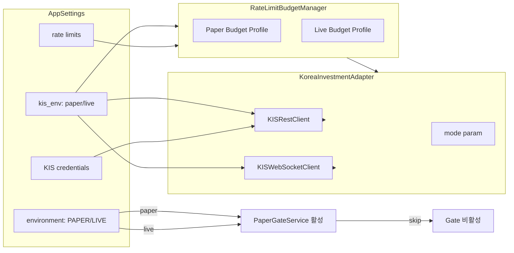

# Paper/Live Mode Boundary 정리

> **원칙**: Paper와 Live는 별도 시스템이 아니라 **동일 시스템의 실행 모드**다.
> 모든 차이는 **broker env 설정 스위치** 하나로 귀결된다.

---

## 1. Boundary Inventory — 4분류표

### 범례

| 분류 | 의미 | 액션 |
|------|------|------|
| **🟢 공통** | mode와 무관하게 동일하게 동작 | 변경 불필요, 문서에서만 표기 |
| **🔵 env-specific** | broker env/credentials/rate-limit만 다름 | 설정 스위치로 처리, 변경 불필요 |
| **🟡 paper-only validation** | paper→live 전환 검증 용도, live에서는 skip | naming/문서에서 paper 소속임을 명시 |
| **🔴 paper-named but common** | 이름만 paper, 실제로는 공통 runtime | **naming/doc 정리 대상** |
| **⚪ future live-only** | 현재 없음, 향후 추가 가능 | 문서에 placeholder만 |

### 1.1 AppSettings (`config/settings.py`)

| 필드 | 분류 | 비고 |
|------|------|------|
| `environment: Environment` | 🔵 env-specific | `PAPER` / `LIVE` — 최상위 모드 스위치 |
| `kis_env` | 🔵 env-specific | `paper` / `live` — KIS API endpoint 결정 |
| `kis_api_key`, `kis_api_secret` | 🔵 env-specific | broker credential |
| `kis_account_number`, `kis_account_product_code` | 🔵 env-specific | 계좌 식별자 |
| `kis_base_url`, `kis_ws_url` | 🔵 env-specific | REST/WS endpoint |
| `kis_real_rest_rps` (15) | 🔵 env-specific | live rate limit baseline |
| `kis_paper_rest_rps` (1) | 🔵 env-specific | paper rate limit baseline |
| `kis_dev_token_cache_enabled` | 🟢 공통 | 개발 편의 기능, mode 무관 |
| `kis_snapshot_stale_threshold_seconds` | 🟢 공통 | snapshot staleness 기준, mode 무관 |
| `kis_snapshot_startup_grace_seconds` | 🟢 공통 | grace period, mode 무관 |
| `paper_gate_*` thresholds | 🟡 paper-only | PaperGateService 전용 임계값 |

### 1.2 Scripts (`scripts/`)

| Script | 분류 | 비고 |
|--------|------|------|
| `run_paper_decision_loop.py` | 🔴 paper-named but common | 핵심 runtime loop, mode 무관. 이름만 paper |
| `run_snapshot_sync_loop.py` | 🟢 공통 | 이미 mode-neutral naming ✅ |
| `run_post_submit_sync_loop.py` | 🟢 공통 | 이미 mode-neutral naming ✅ |
| `run_orchestrator_once.py` | 🟢 공통 | 이미 mode-neutral naming ✅ |
| `run_event_ingestion_loop.py` | 🟢 공통 | 이미 mode-neutral naming ✅ |
| `evaluate_paper_exit.py` | 🟡 paper-only | Paper→Live 전환 평가 전용 |
| `verify_paper_loop.py` | 🟡 paper-only | Paper loop 검증 전용 |
| `sync_kis_snapshots.py` | 🔵 env-specific | KIS-specific snapshot sync (KIS=broker, not mode) |
| `sync_snapshots.py` | 🟢 공통 | broker-agnostic sync wrapper |
| `replay_verification.py` | 🟢 공통 | replay-style verification |
| `backfill_identifier_codes.py` | 🟢 공통 | data migration utility |

### 1.3 Services (`src/agent_trading/services/`)

| Service | 분류 | 비고 |
|---------|------|------|
| `decision_orchestrator.py` | 🟢 공통 | assemble → validate → submit pipeline |
| `order_manager.py` | 🟢 공통 | order lifecycle |
| `reconciliation_service.py` | 🟢 공통 | order/position reconciliation |
| `guardrail_service.py` | 🟢 공통 | guardrail rule evaluation |
| `sizing_engine.py` (likely) | 🟢 공통 | position sizing |
| `performance_summary.py` | 🟢 공통 | PnL/equity aggregation. docstring에 "Paper" 있으나 실제로는 공통 |
| `benchmark_comparison.py` | 🟢 공통 | portfolio vs benchmark. docstring에 "Paper" 있으나 공통 |
| `snapshot_sync.py` | 🟢 공통 | broker-agnostic snapshot sync runner ✅ |
| `kis_snapshot_sync.py` | 🔵 env-specific | KIS-specific 구현체 (KIS=broker, not mode) |
| `order_sync_service.py` | 🟢 공통 | post-submit order sync |
| `paper_gate.py` | 🟡 paper-only | Paper→Live Go/No-Go Gate |
| `ai_agents/` | 🟢 공통 | AI agent pipeline (provider/risk/final decision) |

### 1.4 Brokers (`src/agent_trading/brokers/`)

| Module | 분류 | 비고 |
|--------|------|------|
| `base.py` (BrokerAdapter protocol) | 🟢 공통 | common broker contract |
| `koreainvestment/adapter.py` | 🔵 env-specific | `mode="paper"` 파라미터로 paper/live 전환 |
| `koreainvestment/rest_client.py` | 🔵 env-specific | `env=settings.kis_env` 로 endpoint 결정 |
| `koreainvestment/websocket_client.py` | 🔵 env-specific | ws_url로 endpoint 결정 |
| `rate_limit.py` | 🔵 env-specific | `build_kis_budget_manager()` — paper/live 완전히 다른 budget profile |
| `snapshot_factory.py` | 🟢 공통 | broker-agnostic factory ✅ |
| `polling_worker.py` | 🟢 공통 | event polling |
| `source_adapter.py` | 🟢 공통 | external event source adapter |
| `dedup.py`, `errors.py`, `freshness.py`, `backoff.py` | 🟢 공통 | utility modules |

### 1.5 Runtime (`src/agent_trading/runtime/bootstrap.py`)

| 함수 | 분류 | 비고 |
|------|------|------|
| `build_default_runtime()` | 🟢 공통 | in-memory runtime, mode 무관 |
| `build_postgres_runtime()` | 🟢 공통 | postgres runtime, mode 무관 |
| `postgres_runtime()` context manager | 🟢 공통 | async context manager, mode 무관 |
| `build_api_broker_adapter()` | 🟢 공통 | API server용 adapter wrapper |
| `_build_kis_adapter()` | 🔵 env-specific | KIS adapter 생성 (env settings 사용) |
| `_build_orchestrator()` | 🟢 공통 | orchestrator factory |
| `_build_order_manager()` | 🟢 공통 | order manager factory |

### 1.6 API Routes (`src/agent_trading/api/routes/`)

| Endpoint | 분류 | 비고 |
|----------|------|------|
| `GET /health` | 🟢 공통 | server/DB/snapshot freshness |
| `GET /health/readyz` | 🟢 공통 | readiness probe |
| `GET /performance-summary` | 🟢 공통 | performance aggregation |
| `GET /performance-history` | 🟢 공통 | daily history |
| `GET /performance-metrics` | 🟢 공통 | period metrics |
| `GET /performance-benchmark` | 🟢 공통 | benchmark comparison |
| `GET /performance/paper-go-no-go` | 🟡 paper-only | PaperGate 평가 전용 |
| `GET /broker-capacity` | 🟢 공통 | broker capacity inspection |
| snapshot_sync_runs routes | 🟢 공통 | sync run inspection |
| Admin UI routes | 🟢 공통 | **변경 금지** |

### 1.7 설계 문서 (`plans/`)

| 문서 | 분류 | 비고 |
|------|------|------|
| `paper_exit_criteria.md` | 🟡 paper-only | Paper→Live 전환 기준 |
| `paper_go_no_go_gate.md` | 🟡 paper-only | PaperGate 설계 |
| `paper_benchmark_comparison.md` | 🟢 공통 | benchmark 비교 (mode 무관) |
| `paper_performance_metrics.md` | 🟢 공통 | performance metrics (mode 무관) |
| `paper_continuous_decision_loop.md` | 🔴 paper-named but common | decision loop 설계, mode 무관 |
| `paper_trading_loop_validation.md` | 🟡 paper-only | paper loop 검증 시나리오 |
| `post_submit_sync_scheduler_loop.md` | 🟢 공통 | 이미 mode-neutral ✅ |
| `broker_agnostic_snapshot_factory.md` | 🟢 공통 | 이미 mode-neutral ✅ |
| 기타 KIS 문서 (`kis_*.md`) | 🔵 env-specific | KIS broker-specific 문서 |

---

## 2. 공통 vs Env-Specific 원칙

### 2.1 핵심 원칙

1. **동일 시스템, 다른 설정**: runtime, decision pipeline, sizing, guardrail, reconciliation, observability, performance framework는 mode와 무관하게 동일하다.
2. **설정 스위치 하나로 전환**: `AppSettings.environment` (PAPER↔LIVE) 와 KIS credential/env 세트만 바꾸면 paper↔live 전환이 가능해야 한다.
3. **Paper-only validation은 명시적 별도 레이어**: `PaperGateService`, `PaperExitEvaluator`는 paper→live 전환 검증이므로 paper mode에서만 활성화된다. Live mode에서는 이 검증들이 skip된다.
4. **Live-only 기능은 향후 추가 시 동일 패턴**: live 전용 기능이 필요하면 paper-only와 동일하게 명시적 별도 레이어로 추가한다.

### 2.2 Mode 전환 시 변경해야 할 것 (Checklist)

Paper→Live 전환 시 변경이 **필요한** 것:

| # | 항목 | 환경변수 | 기본값(paper) |
|---|------|---------|--------------|
| 1 | `environment` | `APP_ENV` 또는 유사 | `paper` |
| 2 | KIS API key | `KIS_APP_KEY` / `KIS_API_KEY` | paper key |
| 3 | KIS API secret | `KIS_APP_SECRET` / `KIS_API_SECRET` | paper secret |
| 4 | KIS 계좌번호 | `KIS_ACCOUNT_NUMBER` | paper 계좌 |
| 5 | KIS 계좌상품코드 | `KIS_ACCOUNT_PRODUCT_CODE` | paper 상품코드 |
| 6 | KIS env | `KIS_ENV` | `paper` |
| 7 | REST endpoint | `KIS_BASE_URL` | paper URL |
| 8 | WS endpoint | `KIS_WS_URL` | paper WS URL |
| 9 | Rate limit RPS | `KIS_REAL_REST_RPS` (→live) / `KIS_PAPER_REST_RPS` (→paper) | 1 (paper) |

Paper→Live 전환 시 변경이 **불필요한** 것 (자동 적용):

| 항목 | 이유 |
|------|------|
| Decision pipeline (`assemble`→`validate`→`submit`) | 동일 로직 |
| Sizing engine | 동일 로직 |
| Guardrail rules | 동일 로직 |
| Reconciliation | 동일 로직 |
| Performance summary | read-only, mode 무관 |
| Benchmark comparison | read-only, mode 무관 |
| Snapshot sync runner | broker-agnostic, mode 무관 |
| Health/readyz endpoints | mode 무관 |
| 모든 Repository/DB | 동일 데이터 모델 |

### 2.3 Env-Specific Config Mapping



---

## 3. Naming / Script 경계 정리

### 3.1 변경 불필요 (최소 변경 원칙)

대규모 rename/refactor는 수행하지 않는다. 다음 항목들은 **현재 naming을 유지**한다:

| 대상 | 이유 |
|------|------|
| `run_paper_decision_loop.py` | 이미 모든 스크립트/서비스에서 import, 변경 시 영향도 큼. 문서에서만 "paper-named but common" 표기 |
| `PerformanceSummaryService` docstring의 "Paper" | 내부 docstring, 동작에 영향 없음 |
| `BenchmarkComparisonService` docstring의 "Paper" | 내부 docstring, 동작에 영향 없음 |
| `PaperGateService` 클래스명 | 의도적으로 paper-only validation이므로 적절한 naming |
| `paper_gate_*` env vars | Gate 전용 threshold, paper 소속 명확 |
| `GET /performance/paper-go-no-go` | Admin UI 변경 금지, endpoint명 유지 |

### 3.2 문서에서만 정리하는 항목

| 대상 | 문서 변경 |
|------|----------|
| `run_paper_decision_loop.py` | header docstring에 "공통 runtime loop (paper-named but mode-agnostic)" 명시 |
| `performance_summary.py` | module docstring에 "mode-agnostic" 추가 |
| `benchmark_comparison.py` | module docstring에 "mode-agnostic" 추가 |
| `paper_continuous_decision_loop.md` | 문서 제목에 "(mode-agnostic)" 표기 |

### 3.3 Script Naming 정책 (향후 신규 생성 시)

| 패턴 | 사용처 |
|------|--------|
| `run_*_loop.py` | continuous loop script (mode-neutral) |
| `evaluate_*_exit.py` | exit criteria (paper-only) |
| `verify_*_loop.py` | loop verification (paper-only) |

---

## 4. Config Switch 정리

### 4.1 현재 Config 구조

[`AppSettings`](src/agent_trading/config/settings.py:205) dataclass:

```python
@dataclass(slots=True, frozen=True)
class AppSettings:
    # ── Mode switch ──
    environment: Environment = Environment.PAPER

    # ── KIS env-specific ──
    kis_api_key: str = ""
    kis_api_secret: str = ""
    kis_account_number: str = ""
    kis_account_product_code: str = ""
    kis_env: str = "paper"
    kis_base_url: str = ""
    kis_ws_url: str = ""
    kis_real_rest_rps: int = 15
    kis_paper_rest_rps: int = 1

    # ── Common ──
    kis_dev_token_cache_enabled: bool = True
    kis_dev_token_cache_path: str = ""
    kis_snapshot_stale_threshold_seconds: int = 300
    kis_snapshot_startup_grace_seconds: int = 60

    # ── Paper-only validation thresholds ──
    paper_gate_min_return_pct: Decimal = Decimal("-5")
    paper_gate_min_excess_return_pct: Decimal = Decimal("-3")
    paper_gate_max_drawdown_pct: Decimal = Decimal("15")
    paper_gate_min_win_rate_pct: Decimal = Decimal("40")
    paper_gate_min_filled_orders: int = 20
    paper_gate_max_consecutive_failures: int = 3
```

### 4.2 적용 중인 분류

코드에서 실제로 env-specific config이 어떻게 사용되는지:

| 설정 | 사용 위치 | 동작 |
|------|----------|------|
| `kis_env` | [`rate_limit.py:461`](src/agent_trading/brokers/rate_limit.py:461) | `build_kis_budget_manager()`가 paper/live 분기 |
| `kis_env` | [`snapshot_factory.py:118`](src/agent_trading/brokers/snapshot_factory.py:118) | `build_kis_budget_manager()` 인자로 전달 |
| `kis_api_key/secret/number` | [`snapshot_factory.py:123-126`](src/agent_trading/brokers/snapshot_factory.py:123-126) | KISRestClient 생성자 |
| `kis_base_url` | [`snapshot_factory.py:128`](src/agent_trading/brokers/snapshot_factory.py:128) | REST endpoint |
| `kis_real_rest_rps`, `kis_paper_rest_rps` | [`rate_limit.py:462-464`](src/agent_trading/brokers/rate_limit.py:462-464) | rate limit budget 계산 |
| `paper_gate_*` | [`paper_gate.py`](src/agent_trading/services/paper_gate.py) | PaperGateService 전용 |

### 4.3 개선 제안 (Step 4 — 문서화만)

**실제 코드 변경 없이**, paper/live 전환 시 설정 스위치 지침을 `settings.py` 상단 주석에 추가:

```
# ── Mode Switch ──
# Paper↔Live 전환 시 아래 항목만 변경하면 됩니다:
#   1. environment → LIVE (또는 PAPER)
#   2. KIS API key/secret → live 환경 값
#   3. KIS_ACCOUNT_NUMBER → live 계좌
#   4. KIS_ENV → live
#   5. KIS_BASE_URL, KIS_WS_URL → live endpoint
#   6. KIS_REAL_REST_RPS → 적절한 live rate limit
# 나머지 설정(임계값, 캐시, staleness 등)은 변경 불필요.
```

---

## 5. 설계 문서 정리

### 5.1 현재 문서 분류

| 문서 | 현 상태 | 변경 |
|------|---------|------|
| `paper_exit_criteria.md` | 🟡 paper-only 적절 | header에 "Paper→Live 전환 전용" 명시 (기존) |
| `paper_go_no_go_gate.md` | 🟡 paper-only 적절 | header에 "Paper→Live 전환 전용" 명시 (기존) |
| `paper_continuous_decision_loop.md` | 🔴 paper-named but common | header에 "(mode-agnostic)" 추가 |
| `paper_trading_loop_validation.md` | 🟡 paper-only 적절 | live canary 섹션에서 "further enhancement"로 표기 |
| `paper_benchmark_comparison.md` | 🟢 공통 | header에 "mode-agnostic" 추가 |
| `paper_performance_metrics.md` | 🟢 공통 | header에 "mode-agnostic" 추가 |
| `paper_trading_loop_validation.md` §10 | 🟢 공통 | "Live Canary 이전 필수 항목" — 이미 mode 전환 체크리스트 역할 |

### 5.2 변경 사항 (최소 변경)

1. [`paper_continuous_decision_loop.md`](plans/paper_continuous_decision_loop.md): 제목 아래에 `> **참고**: 이 문서는 paper-named이지만 실제 runtime은 mode-agnostic입니다. 동일한 loop가 live mode에서도 동작합니다.` 추가
2. [`paper_benchmark_comparison.md`](plans/paper_benchmark_comparison.md): 상태줄에 `> **mode-agnostic**: paper/live 모두 동일` 추가
3. [`paper_performance_metrics.md`](plans/paper_performance_metrics.md): 상태줄에 `> **mode-agnostic**: paper/live 모두 동일` 추가

---

## 6. Action Plan

### Step 3: Naming / Script 경계 정리
- [`run_paper_decision_loop.py`](scripts/run_paper_decision_loop.py): `main()` docstring 보강 — "paper-named but mode-agnostic runtime loop" 명시
- [`performance_summary.py`](src/agent_trading/services/performance_summary.py): module docstring에 "mode-agnostic" 추가
- [`benchmark_comparison.py`](src/agent_trading/services/benchmark_comparison.py): module docstring에 "mode-agnostic" 추가

### Step 4: Config Switch 정리
- [`settings.py`](src/agent_trading/config/settings.py): `AppSettings` class docstring에 mode switch checklist 추가
- [`rate_limit.py`](src/agent_trading/brokers/rate_limit.py): `build_kis_budget_manager()` docstring에 paper/live budget profile 설명 추가

### Step 5: Backlog / Validation 문서 정리
- [`paper_trading_loop_validation.md`](plans/paper_trading_loop_validation.md): §10 "Live Canary 이전 필수 항목"을 mode switch checklist와 연결
- [`paper_exit_criteria.md`](plans/paper_exit_criteria.md): §7 "제약 조건 점검"에 mode boundary 관련 제약 추가
- [`BACKLOG.md`](plans/BACKLOG.md): mode boundary backlog 항목 업데이트

### Step 6: 테스트/검증
- 기존 테스트 전체 통과 확인
- script import 경로 변경 없음 확인
- 문서와 코드 구조 일치 검증
