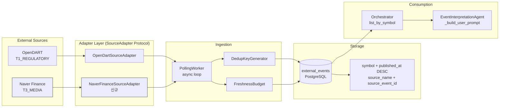

# News Source Adapter 1차 설계

> 작성일: 2026-05-12
> 상태: 설계/분석 전용 (구현 제외)

---

## 1. 현재 인프라 요약

### 1.1 Event Ingestion 파이프라인 (현재)

```
PollingWorker (async loop)
  ├── SourceAdapter.fetch() → RawEvent[]
  ├── DedupKeyGenerator → dedup_key_hash
  ├── ExternalEventRepository.find_by_dedup_key() → skip if exists
  ├── SourceAdapter.normalize() → ExternalEventEntity
  ├── FreshnessBudget → stale metadata
  └── ExternalEventRepository.add() → persisted
```

**현재 구현된 Source Adapter:**
- [`OpenDartSourceAdapter`](src/agent_trading/brokers/opendart_adapter.py) (T1_REGULATORY) — 공시 데이터만 수집

**현재 미구현:**
- 뉴스 source adapter — **이번 설계 대상**

### 1.2 EI Prompt에서 이벤트 표현 방식 (현재)

```python
# event_interpretation.py:_build_user_prompt()
# 각 이벤트는 아래 형식으로 표시
[src:opendart] [tier:T1_REGULATORY] [Y|분기보고서] [2026-05-12] [issuer:00126380] ⚠️STALE headline — body_summary
```

### 1.3 ExternalEventEntity 핵심 필드

| 필드 | 타입 | 설명 |
|------|------|------|
| `source_name` | str | `"opendart"`, `"naver_finance"` 등 |
| `source_reliability_tier` | str | `"T1_REGULATORY"`, `"T3_MEDIA"` |
| `symbol` | str? | 종목 코드 (`"005930"`) |
| `headline` | str? | 기사 제목 |
| `body_summary` | str? | 기사 본문 요약 |
| `event_type` | str | 이벤트 분류 |
| `dedup_key_hash` | str? | 중복 방지 키 |

### 1.4 DB Schema (`external_events` 테이블)

```sql
-- db/migrations/0006_add_external_event_data.sql
-- 이미 symbol + published_at DESC 인덱스 존재
-- 이미 source_name + source_event_id 인덱스 존재
-- 이미 source_reliability_tier 컬럼 존재 (DEFAULT 'T3')
```

**→ DB schema 변경 불필요.** 기존 `external_events` 테이블을 그대로 재사용.

---

## 2. 뉴스 Source 후보 비교

### 2.1 후보 목록

| # | Source | 타입 | API 필요 | Symbol 제공 | 법적 리스크 | 1순위 적합 |
|---|--------|------|---------|------------|-----------|-----------|
| 1 | **네이버 금융 종목별 뉴스 페이지** | HTML scraping | 없음 | ✅ **URL에 code 직접 내장** | ⚠️ 주의 | **⭐ 1순위** |
| 2 | **네이버 뉴스 검색 API** | REST API | Naver Client ID/Secret | ❌ 없음 (회사명 기반 검색 필요) | 낮음 (공식 API) | ❌ (Symbol 매핑 불가) |
| 3 | 한국경제 / 매일경제 / 서울경제 RSS | RSS | 없음 | ❌ 없음 | 낮음 (RSS) | ❌ |
| 4 | 연합인포맥스 | 유료 API | 유료 계약 | 부분적 | 낮음 | ❌ (유료) |
| 5 | Yahoo Finance RSS | RSS | 없음 | ✅ Symbol 존재 | 낮음 | ❌ (해외) |
| 6 | KRX API (KIND) | REST | 없음 | ✅ Symbol 존재 | 낮음 | ❌ (공시 위주) |

### 2.2 1순위 선정: **네이버 금융 종목별 뉴스 페이지**

**선정 이유:**

| 기준 | 평가 | 설명 |
|------|------|------|
| **Symbol 연결** | ✅ **직접 매핑** | `finance.naver.com/item/news_read.nhn?code=005930` — URL에 symbol 내장 |
| **Company name fuzzy matching 불필요** | ✅ **필요 없음** | URL에서 code 파라미터 직접 추출 |
| **한국 시장 coverage** | ✅ 최적 | 코스피/코스닥 전 종목 뉴스 |
| **실시간성** | ✅ 양호 | 속보 → 수 분 내 반영 |
| **Noise 수준** | ✅ 관리 가능 | 종목별 페이지는 해당 종목 뉴스만 — filtering 부담 낮음 |
| **API 키** | ✅ 불필요 | 추가 인증 불필요 |
| **법적 리스크** | ⚠️ 주의 | 크롤링 — but `robots.txt` 준수, rate limit 준수로 관리 가능 |
| **운영 안정성** | ⚠️ 중간 | HTML 구조 변경 가능 — but URL 패턴은 안정적 |

**Naver News Search API 배제 사유:**
- 검색 기반 (`query=삼성전자`) → Symbol 매핑 위해 회사명 → symbol 변환 필요
- 사용자가 명시적으로 "company name fuzzy matching이 필요한 source는 2차로 미루는 편이 좋음"
- 따라서 Naver News Search API는 2차 source 후보로 적합

### 2.3 Scraping 리스크 완화 방안

| 리스크 | 완화 방안 |
|--------|----------|
| `robots.txt` 제한 | `User-agent: * Disallow: /item/` 확인 필요. 종목별 뉴스 페이지(`news_read.nhn`)는 일반적으로 뉴스 소비용 페이지 |
| HTML 구조 변경 | CSS selector 기반 파싱 → 구조 변경 시 `headline`/`body` 추출 실패 = empty result → safe fail |
| Rate limit / 차단 | Polling 간격 300초(5분) 이상 유지 → 일반 사용자 트래픽 수준 |
| 법적 리스크 | 내부 연구/분석용 — 상업적 재배포 아님. Naver가 명시적으로 금지하는 경우 2순위로 fallback |

### 2.4 Fallback 전략

Naver Finance가 차단/구조변경 시 2순위 source:
- **네이버 뉴스 검색 API** → 회사명 기반 검색 → symbol 매핑 필요 (2차 구현)

---

## 3. Symbol 매핑 전략

### 3.1 전략 개요 (4-Level)

```
Level 1: 종목별 뉴스 페이지 URL → "code" 파라미터 직접 추출
Level 2: (현재 미구현, 향후) 뉴스 목록 "관련종목" 태그 → Symbol
Level 3: (현재 미구현, 향후) 회사명 → instruments.name 매칭
Level 4: 매핑 불가 → symbol=None (EI 전달 안 됨, 저장 시 skip)
```

### 3.2 Level 1: 종목별 URL 직접 매핑 (1차 구현 대상)

```python
# finance.naver.com/item/news_read.nhn?code=005930
# → URL query param "code" = "005930"
symbol = parsed_url.query_params.get("code")
```

**구현 방식:**
- [`InstrumentRepository.list_active()`](src/agent_trading/repositories/contracts.py)로 활성 종목 목록 조회
- 각 종목별로 `finance.naver.com/item/news_read.nhn?code={symbol}` URL 호출
- 응답 HTML에서 뉴스 목록 파싱
- Symbol은 호출 시 이미 알고 있음 → `RawEvent.symbol`에 직접 설정

**이 방식이 가능한 이유:**
- `ExternalEventRepository.list_by_symbol(symbol, since)`가 이미 존재
- Orchestrator `assemble()`에서 `list_by_symbol()`로 이벤트 로드
- DB 인덱스 `idx_external_events_symbol` (symbol, published_at DESC) 이미 존재

**현재 Instrument 활성 목록:**
```python
# contracts.py
class InstrumentRepository(Protocol):
    async def list_active(self) -> Sequence[InstrumentEntity]: ...
    async def get_by_symbol(self, symbol: str, market_code: str) -> InstrumentEntity | None: ...
```

---

## 4. Noise Filtering / Dedup 정책

### 4.1 Filtering 파이프라인 (Adapter 단계)

```
Naver Finance HTML response
  │
  ├── Filter 1: Symbol 매핑 확인
  │   symbol=None → skip (저장하지 않음)
  │
  ├── Filter 2: Market-wide Macro 뉴스
  │   headline에 "코스피", "코스닥", "환율", "금리", "국제유가" 등 포함
  │   AND 종목 특정 정보 없음 → skip
  │   (※ 단, 005930 종목 페이지에 "코스피" 뉴스는 거의 없음 — 종목별 페이지 특성)
  │
  ├── Filter 3: Opinion / Column / 광고성 기사
  │   headline에 "[기자 칼럼]", "[시황분석]", "프리미엄", "유료" 등 포함 → skip
  │
  ├── Filter 4: 중복 기사 (DedupKeyGenerator)
  │   dedup key = "naver_finance|{기사 URL}|{symbol}"
  │   ExternalEventRepository.find_by_dedup_key() → 존재하면 skip
  │
  └── Filter 5: 본문 품질 임계값
      headline 길이 < 5자 or headline=None → skip
```

### 4.2 Filtering 위치 결정

**Adapter `normalize()` 내부**에서 filtering 수행.

```python
# naver_finance_adapter.py (설계)
class NaverFinanceSourceAdapter:
    async def normalize(self, raw: RawEvent) -> ExternalEventEntity | None:
        """Return None when the event should be skipped (filtered out)."""
        # Filter 1: Symbol 필수
        if not raw.symbol:
            return None
        # Filter 2: Macro skip
        if self._is_market_wide(raw):
            return None
        # Filter 3: Opinion/Column skip
        if self._is_opinion_or_ad(raw):
            return None
        # ... dedup key generation, entity creation
```

단, `PollingWorker.poll_once()`는 `normalize()`가 `None`을 반환하면 skip하도록 수정 필요.
현재 `normalize()`는 항상 `ExternalEventEntity`를 반환하므로, `None` 반환을 허용하는 쪽으로 변경 검토.

### 4.3 Dedup Key Format

```
naver_finance|{article_url_hash}|{symbol}
```

- `article_url_hash`: 기사 고유 URL의 SHA256 해시 (Naver 뉴스는 `https://n.news.naver.com/mnews/article/...` 형태)
- Symbol까지 포함 → 동일 기사가 여러 종목 페이지에서 중복 수집되어도 동일 dedup key

### 4.4 Source Reliability Tier

| Tier | 값 | Source | 설명 |
|------|-----|--------|------|
| T1_REGULATORY | `"T1_REGULATORY"` | OpenDART | 공식 공시 — 최고 신뢰도 |
| T2_INSTITUTIONAL | `"T2_INSTITUTIONAL"` | (향후) 증권사 리포트 | 기관 발행 |
| **T3_MEDIA** | **`"T3_MEDIA"`** | **Naver Finance** | **뉴스/미디어 — 이번 설계 대상** |
| T4_LOW_CONFIDENCE | `"T4_LOW_CONFIDENCE"` | (향후) 미검증 소스 | 실험적 |

EI prompt에서 tier 정보가 함께 표시되므로, EI가 T3를 T1보다 낮은 가중치로 해석할 수 있음.

---

## 5. EI Prompt 공존 Format

### 5.1 현재 Format

```
Recent events (3):
  [src:opendart] [tier:T1_REGULATORY] [Y|분기보고서] [2026-05-12] [issuer:00126380] 삼성전자 분기보고서 제출
  [src:opendart] [tier:T1_REGULATORY] [Y|단일회사개별감사보고서] [2026-05-11] [issuer:00126380] 감사보고서 제출
  [src:opendart] [tier:T1_REGULATORY] [A|주주총회소집결의] [2026-05-10] [issuer:00126380] 주주총회 소집
```

### 5.2 News 추가 후 Format (변경 안 함 — 동일 format 유지)

```
Recent events (5):
  [src:opendart] [tier:T1_REGULATORY] [Y|분기보고서] [2026-05-12] [issuer:00126380] 삼성전자 분기보고서 제출
  [src:naver_finance] [tier:T3_MEDIA] [news] [2026-05-12] 삼성전자, HBM3E 6세대 양산 돌입 — 업계 최초
  [src:naver_finance] [tier:T3_MEDIA] [news] [2026-05-12] 삼성전자, 2분기 영업이익 시장전망치 상회 전망
  [src:opendart] [tier:T1_REGULATORY] [A|주주총회소집결의] [2026-05-10] [issuer:00126380] 주주총회 소집
  [src:naver_finance] [tier:T3_MEDIA] [news] [2026-05-11] TSMC 3nm 수율 90% 돌파... 삼성과 격차
```

**변경 사항:**
- `event_type`: OpenDART는 `"Y|분기보고서"` 형식, News는 `"news"` (단일 값)
- `source_name`: `"naver_finance"` (신규)
- `source_reliability_tier`: `"T3_MEDIA"` (OpenDART의 `T1_REGULATORY`와 구분)

**EI가 자연스럽게 T1 > T3 우선순위로 해석할 것으로 기대.**

### 5.3 변경 불필요한 항목

| 항목 | 이유 |
|------|------|
| [`EI._build_system_prompt()`](src/agent_trading/services/ai_agents/event_interpretation.py:201) | 변경 불필요 — JSON schema는 동일 |
| [`EI._build_user_prompt()`](src/agent_trading/services/ai_agents/event_interpretation.py:218) | **변경 불필요** — provenance tag format(`[src:...]`, `[tier:...]`)은 source에 무관하게 동일하게 적용됨 |
| `Orchestrator.assemble()` | 변경 불필요 — `list_by_symbol()`은 이미 `source_name`과 무관하게 모든 external event를 반환 |

---

## 6. 변경 파일 목록

### 6.1 신규 파일

| 파일 | 설명 | 비고 |
|------|------|------|
| `src/agent_trading/brokers/naver_finance_adapter.py` | Naver Finance 뉴스 source adapter | SourceAdapter protocol 구현. `fetch()` → HTML 파싱 → `RawEvent[]` 반환. `normalize()`에서 noise filtering 포함 |
| `tests/brokers/test_naver_finance_adapter.py` | Naver Finance adapter 단위 테스트 | HTTP 응답 Mock 기반 |

### 6.2 수정 파일

| 파일 | 변경 내용 | 변경 이유 |
|------|----------|----------|
| [`src/agent_trading/runtime/bootstrap.py`](src/agent_trading/runtime/bootstrap.py) | `_build_polling_workers()`에 Naver Finance PollingWorker 추가 | `settings.naver_finance_enabled` 플래그로 활성화 |
| [`src/agent_trading/config/settings.py`](src/agent_trading/config/settings.py) | `naver_finance_enabled: bool` 필드 추가 | env var `NAVER_FINANCE_ENABLED` (default: `False`) |
| [`src/agent_trading/brokers/polling_worker.py`](src/agent_trading/brokers/polling_worker.py) | `normalize()`가 `None` 반환 시 skip 처리 | Filtering 결과 skip 지원 |
| [`.env.example`](.env.example) | `NAVER_FINANCE_ENABLED=false` 추가 | 설정 문서화 |

### 6.3 변경 불필요 (재사용)

| 파일 | 이유 |
|------|------|
| `src/agent_trading/brokers/source_adapter.py` | `RawEvent`, `SourceAdapter` protocol — 변경 불필요 |
| `src/agent_trading/brokers/dedup.py` | `DedupKeyGenerator` — 변경 불필요 |
| `src/agent_trading/brokers/freshness.py` | `FreshnessBudget` — 변경 불필요 |
| `src/agent_trading/domain/entities.py` | `ExternalEventEntity` — 변경 불필요 |
| `src/agent_trading/domain/enums.py` | `SourceReliabilityTier` — `T3_MEDIA` 이미 존재 |
| `src/agent_trading/repositories/contracts.py` | `ExternalEventRepository` — 변경 불필요 |
| `db/migrations/*` | **DB schema 변경 불필요** — 기존 `external_events` 테이블 재사용 |
| `src/agent_trading/services/ai_agents/event_interpretation.py` | `_build_user_prompt()` — 변경 불필요 |
| `src/agent_trading/services/decision_orchestrator.py` | `assemble()` — 변경 불필요 |

---

## 7. NaverFinanceSourceAdapter 구현 설계

### 7.1 클래스 구조

```python
class NaverFinanceSourceAdapter:
    """Source adapter for Naver Finance (finance.naver.com) news.
    
    Fetches news articles per-symbol from the Naver Finance
    item-specific news page, parses headlines, and normalises
    into ExternalEventEntity.
    
    Source reliability: T3_MEDIA (news/media tier).
    """
    
    source_name = "naver_finance"
    reliability_tier = SourceReliabilityTier.T3_MEDIA
    
    def __init__(
        self,
        instruments: InstrumentRepository,
        request_timeout: int = 15,
        polling_interval: int = 300,
    ) -> None: ...
    
    async def fetch(self) -> Sequence[RawEvent]: ...
    async def normalize(self, raw: RawEvent) -> ExternalEventEntity | None: ...
    def generate_dedup_key(self, raw: RawEvent) -> str: ...
```

### 7.2 `fetch()` 동작

```python
async def fetch(self) -> Sequence[RawEvent]:
    """Fetch news for all active instruments since last poll."""
    active_instruments = await self._instruments.list_active()
    results: list[RawEvent] = []
    
    for instrument in active_instruments:
        symbol = instrument.symbol
        # URL: finance.naver.com/item/news_read.nhn?code={symbol}
        html = await self._fetch_news_page(symbol)
        articles = self._parse_articles(html, symbol)
        results.extend(articles)
    
    return results
```

### 7.3 `normalize()` filtering

```python
async def normalize(self, raw: RawEvent) -> ExternalEventEntity | None:
    """Normalize raw event → entity, return None if filtered out."""
    # Filter 1: Symbol must exist
    if not raw.symbol:
        return None
    
    # Filter 2: Market-wide macro article
    if self._is_market_wide(raw):
        return None
    
    # Filter 3: Opinion / Column / Advertisement
    if self._is_opinion_or_ad(raw):
        return None
    
    # Filter 5: Minimum headline length
    headline = (raw.headline or "").strip()
    if len(headline) < 5:
        return None
    
    dedup_key = self.generate_dedup_key(raw)
    return ExternalEventEntity(
        event_id=uuid4(),
        event_type="news",
        source_name=self.source_name,
        source_reliability_tier=self.reliability_tier.value,
        ...
        symbol=raw.symbol,
        headline=headline,
        body_summary=raw.body,
        dedup_key_hash=dedup_key,
    )
```

### 7.4 Polling Config

```python
config = PollingConfig(
    source_name="naver_finance",
    interval_seconds=300,        # 5분 — Naver rate limit 고려
    freshness_max_seconds=600,   # 10분 max lag
)
```

---

## 8. 전체 아키텍처 다이어그램



---

## 9. 테스트 / 검증 방법

### 9.1 단위 테스트

| 테스트 | 설명 |
|--------|------|
| `test_fetch_returns_raw_events` | Mock HTTP 응답 → Naver Finance HTML → RawEvent[] 정상 파싱 |
| `test_fetch_empty_page` | 뉴스 없는 종목 → empty list |
| `test_fetch_http_error` | HTTP 500/403 → graceful empty return |
| `test_normalize_symbol_mapped` | Symbol 있는 RawEvent → ExternalEventEntity 정상 |
| `test_normalize_symbol_none` | Symbol 없는 RawEvent → None (filtered) |
| `test_normalize_market_wide_filter` | "코스피, 2분기 전망" → None |
| `test_normalize_opinion_filter` | "[기자 칼럼]" → None |
| `test_normalize_short_headline` | headline < 5자 → None |
| `test_generate_dedup_key` | dedup key format = `naver_finance\|{url_hash}\|{symbol}` |
| `test_dedup_key_consistency` | 동일 URL → 동일 dedup key |

### 9.2 통합 테스트

- PollingWorker + NaverFinanceSourceAdapter 조합 검증
- Dedup → 중복 기사 skip 확인
- Freshness budget 정상 적용 확인
- `external_events` 테이블에 정상 저장 확인

### 9.3 EI Prompt 검증

Dry-run으로 뉴스 포함된 EI prompt 로그 확인:
```
Recent events (5):
  [src:opendart] [tier:T1_REGULATORY] [Y|분기보고서] [2026-05-12] [issuer:00126380] ...
  [src:naver_finance] [tier:T3_MEDIA] [news] [2026-05-12] 삼성전자, HBM3E 양산 돌입
```

---

## 10. 답변: 핵심 질문

### Q1. 뉴스 source 1순위?

**네이버 금융 종목별 뉴스 페이지 (`finance.naver.com/item/news_read.nhn?code={symbol}`)**

선정 사유:
- **Symbol이 URL에 직접 내장**되어 있어 fuzzy matching 불필요
- 한국 시장 coverage 가장 우수
- 별도 API 키 불필요
- 종목별 페이지는 해당 종목 뉴스만 노출 → noise 관리 용이

RSS / 벤더 API / 거래소 feed는 모두 Symbol 연결성이 부족하여 2차 후보.

### Q2. Symbol 매핑 위치?

**Adapter `fetch()` 단계에서 직접 매핑 (Level 1).**
- `InstrumentRepository.list_active()`로 활성 종목 목록 조회
- 각 종목별 URL 호출: `news_read.nhn?code={symbol}`
- Symbol은 호출 시 이미 알고 있음 → `RawEvent.symbol`에 직접 설정
- Company name 기반 매핑(Level 3)은 1차 구현에서 제외

### Q3. Noise filtering?

4단계 필터 (adapter `normalize()` 내부):
1. Symbol 매핑 실패 → skip
2. Market-wide macro 뉴스 → skip
3. Opinion/Column/광고 → skip
4. 중복 기사 → dedup (DedupKeyGenerator)

### Q4. Source reliability tier?

| Source | Tier | EI 해석 기대 |
|--------|------|-------------|
| OpenDART | T1_REGULATORY | 높은 신뢰도 — 정책/의사결정에 중요 |
| Naver Finance | T3_MEDIA | 중간 신뢰도 — 참고용, noise 가능성 인지 |

### Q5. `list_by_symbol()` 구조 유지 가능?

**가능.** 변경 불필요.
- `ExternalEventRepository.list_by_symbol(symbol, since)`는 `source_name`에 무관하게 동작
- Orchestrator `assemble()`에서 이미 이 메서드 사용 중
- DB 인덱스 `idx_external_events_symbol` (symbol, published_at DESC) 이미 존재

### Q6. EI prompt에서 공존 format?

**변경 불필요.** 현재 provenance tag format(`[src:...] [tier:...] [event_type] [date]`)이 source 무관하게 동일하게 적용됨.
EI가 tier 정보를 보고 자연스럽게 T1 > T3 우선순위로 해석.

---

## 11. 남은 리스크 1개

### **Naver Finance HTML 구조 변경**

Naver가 뉴스 페이지 HTML 구조를 변경하면 headline/body 추출 실패 가능.
현재 URL 패턴(`news_read.nhn?code={symbol}`)은 안정적이나, DOM 구조는 변경될 수 있음.

**완화 방안:**
- CSS selector를 별도 상수로 분리하여 변경 시 빠른 대응 가능
- 파싱 실패 시 `fetch()`가 empty list 반환 → safe fail (수집 중단, 기존 시스템 영향 없음)
- 정기적인 smoke test로 파싱 정상 동작 확인

---

## 12. 다음 직접 액션

### **Naver Finance HTML 구조 사전 조사**

`finance.naver.com/item/news_read.nhn?code=005930` URL에 접속하여:
1. 실제 HTML 구조 확인 (CSS selector)
2. 뉴스 목록 DOM 요소 식별
3. headline / link / timestamp 추출 가능 여부 확인
4. `robots.txt` 크롤링 허용 여부 재확인
5. 페이지네이션 필요 여부 확인 (1페이지에 몇 개 기사?)

→ 이 정보를 바탕으로 `NaverFinanceSourceAdapter` 구현 시작
