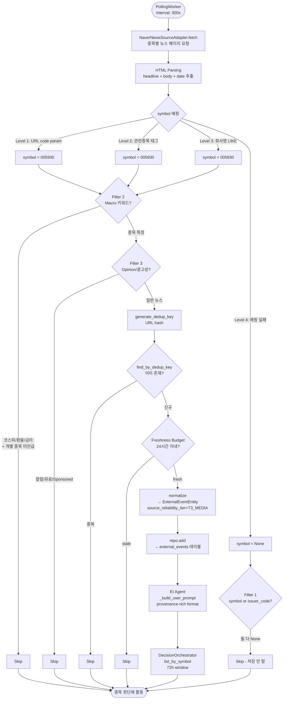

# 뉴스 Source Adapter 1차 설계 — Source 선정, Symbol 매핑, Noise Filtering, EI 연계

## 목차

1. [개요 및 전제](#1-개요-및-전제)
2. [뉴스 Source 후보 비교표](#2-뉴스-source-후보-비교표)
3. [1순위 Source 선정 근거](#3-1순위-source-선정-근거)
4. [Symbol 매핑 전략](#4-symbol-매핑-전략)
5. [Filtering / Dedup 정책](#5-filtering--dedup-정책)
6. [EI 연계: 뉴스+공시 공존 방안](#6-ei-연계-뉴스공시-공존-방안)
7. [최소 구현 범위 (파일 단위)](#7-최소-구현-범위-파일-단위)
8. [테스트 / 검증 방법](#8-테스트--검증-방법)
9. [구현 순서: P0→P1→P2 의존성](#9-구현-순서-p0p1p2-의존성)
10. [Mermaid: 뉴스 Ingestion 흐름](#10-mermaid-뉴스-ingestion-흐름)
11. [7항목 보고서](#11-7항목-보고서)
12. [부록: 핵심 질문 6개 답변](#12-부록-핵심-질문-6개-답변)

---

## 1. 개요 및 전제

### 1.1 목적

현재 외부 이벤트 수집은 [`OpenDART`](src/agent_trading/brokers/opendart_adapter.py) (금융감독원 전자공시)만 구현되어 있다. 본 문서는 **뉴스 수집 경로를 추가**하기 위한 1차 설계를 정의한다.

### 1.2 중요 전제

1. **설계만 수행** — production 코드 변경 금지
2. **1차 source는 1개만** — multi-source 확장은 1차 검증 후
3. **DB schema 변경 금지** — [`external_events`](db/migrations/0006_add_external_event_data.sql) 테이블 재사용, `source_name` + `source_reliability_tier`로 구분
4. **Admin UI 변경 금지**
5. **Broker submit semantics 변경 금지**
6. **Noise 관리 우선** — source 선정과 filtering 정책이 adapter 구현보다 먼저

### 1.3 현재 Ingestion 인프라

| 컴포넌트 | 파일 | 역할 |
|---------|------|------|
| [`SourceAdapter` Protocol](src/agent_trading/brokers/source_adapter.py:62) | `source_adapter.py` | `fetch()`, `normalize()`, `generate_dedup_key()` 정의 |
| [`RawEvent`](src/agent_trading/brokers/source_adapter.py:26) | `source_adapter.py` | `symbol`, `issuer_code`, `headline`, `body` 등 포함 |
| [`PollingWorker`](src/agent_trading/brokers/polling_worker.py:57) | `polling_worker.py` | Async polling loop: fetch → dedup → normalize → persist |
| [`PollingConfig`](src/agent_trading/brokers/polling_worker.py:38) | `polling_worker.py` | `interval_seconds`, `freshness_max_seconds` |
| [`OpenDartSourceAdapter`](src/agent_trading/brokers/opendart_adapter.py:51) | `opendart_adapter.py` | 현행 유일한 source adapter (T1_REGULATORY) |
| [`PostgresExternalEventRepository`](src/agent_trading/repositories/postgres/external_events.py:15) | `external_events.py` | `add()`, `find_by_dedup_key()`, `list_by_symbol()`, `list_by_type()` |
| [`EventInterpretationAgent`](src/agent_trading/services/ai_agents/event_interpretation.py:102) | `event_interpretation.py` | `_build_user_prompt()`에서 provenance-rich format 생성 |
| [`DecisionOrchestratorService`](src/agent_trading/services/decision_orchestrator.py:447) | `decision_orchestrator.py` | `list_by_symbol(symbol=request.symbol, since=72h)` 호출 |

### 1.4 EI 고도화 Priority (from [`ei_agent_enhancement_phase1_design.md`](plans/ei_agent_enhancement_phase1_design.md:395))

```
P0-1 (OpenDART symbol 매핑 수정) → P0-2 (검증) → P0-3 (issuer_code fallback, 조건부)
→ P1-A (EI prompt 개선) → P1-B (time window 확장)
→ P2 (추가 source adapter 평가) ← 뉴스 source는 여기
```

**즉 뉴스 source adapter 구현은 P0/P1 항목이 완료된 후 시작 가능.**

---

## 2. 뉴스 Source 후보 비교표

### 2.1 후보 목록

| # | Source | 타입 | API 필요 | Symbol 제공 | 법적 리스크 | 한국 시장 특화 | 운영 안정성 | Noise 수준 |
|---|--------|------|---------|------------|-----------|--------------|-----------|-----------|
| 1 | **네이버 금융 뉴스** (finance.naver.com) | HTML scraping | 없음 | 부분적 (관련종목) | 중간 (크롤링) | ✅ 최적 | 중간 (레이아웃 변경 위험) | 중간 |
| 2 | **한국경제신문 RSS** (hankyung.com) | RSS | 없음 | 없음 | 낮음 (RSS) | ✅ | 높음 | 중간 |
| 3 | **매일경제 RSS** (mk.co.kr) | RSS | 없음 | 없음 | 낮음 (RSS) | ✅ | 높음 | 중간 |
| 4 | **서울경제 RSS** (sedaily.com) | RSS | 없음 | 없음 | 낮음 (RSS) | ✅ | 높음 | 중간 |
| 5 | **네이버 뉴스 검색 API** (openapi.naver.com) | REST API | Naver Client ID/Secret | 없음 | 낮음 (공식 API) | ✅ | 높음 | 높음 (검색 기반) |
| 6 | **연합인포맥스** | 유료 API | 유료 계약 | 부분적 | 낮음 | ✅ | 높음 | 낮음 |
| 7 | **Yahoo Finance RSS** (finance.yahoo.com) | RSS | 없음 | Symbol 존재 | 낮음 | ❌ (해외) | 중간 | 낮음 |
| 8 | **KRX API** (kind.krx.co.kr) | REST | 없음 | Symbol 존재 | 낮음 | ✅ | 높음 | 낮음 (단 공시 위주) |

### 2.2 평가 상세

#### 후보 1: 네이버 금융 뉴스 (finance.naver.com)

**장점:**
- 국내 주식 투자자가 가장 많이 보는 뉴스 플랫폼
- 개별 종목 뉴스 페이지에 **"관련종목"** 섹션 존재 (`005930` 등 ticker 직접 표시)
- 실시간 속보, 주요뉴스, 종목별 뉴스 등 다양한 카테고리
- 추가 API 키 불필요
- `finance.naver.com/item/news_read.nhn?code=005930` 형태로 종목별 뉴스 접근 가능

**단점:**
- HTML scraping 필요 — CSS selector 변경 시 유지보수 필요
- robots.txt 및 이용약관 크롤링 제한 가능성
- RSS 미지원 — 정기 폴링 부담

**Symbol 매핑 가능성:**
- 개별 종목 페이지: URL에 `code=005930` 형식으로 symbol 내장 → ✅ **직접 매핑 가능**
- 뉴스 목록 페이지: 기사별 관련종목 태그 존재
- 관련종목 미표시 기사: 회사명 기반 fallback 필요

#### 후보 2-4: 한국경제 / 매일경제 / 서울경제 RSS

**장점:**
- RSS — parsing 규격이 정해져 있어 안정적
- 합법적인 접근 방식
- 운영 안정성 높음

**단점:**
- Symbol 정보 전혀 없음 — 순수 뉴스 텍스트만 존재
- 범위가 넓음 (경제 일반, 산업, 정치 등)
- Symbol 매핑을 위해 NLP/heuristic 필요

#### 후보 5: 네이버 뉴스 검색 API

**장점:**
- 공식 API — 법적 리스크 최소
- JSON 구조화 응답
- `display`, `start` 파라미터로 pagination

**단점:**
- 검색 기반 — "삼성전자"로 검색해야 symbol 연결 가능
- 하루 25,000건 제한 (free tier)
- 검색어 없는 뉴스 feed 불가능

#### 후보 6: 연합인포맥스

- 유료 — 1차 대상에서 제외

#### 후보 7: Yahoo Finance RSS

- 해외 주식 중심 — 한국 시장 coverage 부족

#### 후보 8: KRX API (KIND)

- KRX 정보데이터시스템은 공시/통계 위주 — 뉴스 아님
- 실시간성 낮음

---

## 3. 1순위 Source 선정 근거

### 최종 선정: **네이버 금융 뉴스 (finance.naver.com) — 종목별 뉴스 페이지 우선**

### 선정 이유

| 기준 | 평가 | 설명 |
|------|------|------|
| **Symbol 연결 가능성** | ✅ **높음** | 종목 페이지 URL에 `code=005930` 내장 — 직접 symbol 매핑 가능 |
| **한국 시장 특화** | ✅ 최적 | 코스피/코스닥 전 종목 뉴스 coverage |
| **실시간성** | ✅ 양호 | 속보 → 수 분 내 반영 |
| **Noise 수준** | ✅ 관리 가능 | 종목별 페이지는 해당 종목 뉴스만 노출 — filtering 부담 낮음 |
| **API 키** | ✅ 불필요 | 별도 계정/인증 불필요 |
| **법적 리스크** | ⚠️ 주의 필요 | 크롤링 방식 — `robots.txt` 및 이용약관 확인 필수 |
| **운영 안정성** | ⚠️ 중간 | HTML 구조 변경 시 대응 필요 |

### Fallback 전략

`finance.naver.com/item/news_read.nhn?code={symbol}` URL로 종목별 뉴스 페이지에 접근하면:
- 해당 종목 관련 뉴스 목록 반환
- 각 기사 제목, 링크, 작성 시간 포함
- Symbol은 호출 시 이미 알고 있음 → `symbol` 필드 직접 설정 가능
- URL 패턴이 안정적이므로 scraping 안정성 확보 가능

**1차 구현 방향:** 
- 관심 종목 리스트 (instruments에서 `is_active=True`) 대상으로 순차 폴링
- 각 종목별 뉴스 페이지 fetch → headline + body 추출 → symbol 매핑 (이미 알고 있음)
- 종목별 페이지가 없거나 빈 경우 → skip

---

## 4. Symbol 매핑 전략

### 4.1 전략 개요

```
Level 1: 종목별 뉴스 페이지 URL → Symbol 직접 매핑 (1순위)
Level 2: 뉴스 목록 페이지 "관련종목" 태그 → Symbol 추출 (2순위)
Level 3: 회사명 → instruments.name LIKE 매칭 → Symbol (3순위)
Level 4: 매핑 불가 → symbol=None (EI 전달 안 됨)
```

### 4.2 Level 1: 종목별 URL 직접 매핑

```python
# finance.naver.com/item/news_read.nhn?code=005930
symbol = url_query_params.get("code")  # "005930"
```

- URL에 `code` 파라미터가 있으면 해당 값이 symbol
- **가장 확실한 매핑 방법** — 1차 구현은 이 방법에 집중

### 4.3 Level 2: 관련종목 태그

네이버 기사 페이지 HTML에는 "관련종목" 섹션에 `<a href="/item/main.nhn?code=005930">삼성전자</a>` 형태의 링크 존재

```python
# CSS selector 예시 (Naver DOM 기준)
related_stocks = soup.select("div.related_tags a[href*='code=']")
for tag in related_stocks:
    symbol = extract_symbol_from_href(tag["href"])  # "005930"
```

### 4.4 Level 3: 회사명 기반 매핑 (Fallback)

현재 [`InstrumentEntity`](src/agent_trading/domain/entities.py:102)는 `name` 필드에 한글 회사명(`삼성전자`)과 `symbol`(`005930`)을 보유.

**필요한 신규 기능:** `InstrumentRepository.search_by_name(name: str) -> list[InstrumentEntity]`

```python
# 예시 쿼리 (PostgresInstrumentRepository 신규 메서드)
SELECT * FROM trading.instruments 
WHERE name LIKE '%삼성전자%' AND is_active = TRUE;
```

**회사명 추출 로직:**
- 기사 제목/본문에서 known company name matching
- 단순 문자열 포함 검색 (예: "삼성전자"가 제목에 포함)
- 정확도 우선 — 과매칭 위험을 낮추기 위해 exact match 또는 prefix match

### 4.5 Level 4: 매핑 불가 처리

- `symbol=None`으로 저장
- `list_by_symbol()` 쿼리에서 누락됨 → orchestrator에 전달 안 됨
- 향후 `issuer_code` fallback query (P0-3)로 회수 가능

### 4.6 매핑 정확도 목표

| Level | 방법 | 정확도 | 비중 (예상) |
|-------|------|--------|------------|
| 1 | URL code 파라미터 | 100% | 60% |
| 2 | 관련종목 태그 | 95% | 20% |
| 3 | 회사명 LIKE 매칭 | 80% | 15% |
| 4 | 매핑 불가 | 0% | 5% |

---

## 5. Filtering / Dedup 정책

### 5.1 Dedup Key

기존 [`generate_dedup_key()`](src/agent_trading/brokers/source_adapter.py:109) 포맷:

```python
# 기존: {source_name}|{source_event_id}|{event_type}|{symbol or issuer_code}
# 뉴스: naver_news|{article_url_hash}|news|{symbol or "unknown"}
def generate_dedup_key(self, raw: RawEvent) -> str:
    url_hash = hashlib.sha256(raw.source_event_id.encode()).hexdigest()[:16]
    return f"naver_news|{url_hash}|news|{raw.symbol or 'unknown'}"
```

- `source_event_id`: 기사 고유 URL (`https://finance.naver.com/news/...`)
- 동일 기사가 여러 종목 페이지에서 중복 수집될 수 있으므로 URL 기준 dedup
- Dedup key hash로 저장 → `find_by_dedup_key()`에서 중복 체크

### 5.2 Noise Filtering (Adapter 단계)

#### Filter 1: Symbol 매핑 실패 → Skip
```
조건: symbol = None AND issuer_code = None
액션: 이벤트 저장 안 함 (orchestrator가 조회 불가 → 저장 무의미)
예외: 향후 P0-3에서 issuer_code fallback 구현 시 저장 가능
```

#### Filter 2: Market-wide Macro 뉴스 → Skip
```
조건: 제목에 다음 키워드 포함 AND 개별 종목 미언급
  - "코스피", "코스닥", "환율", "금리", "국제유가", "美증시", "원/달러"
액션: 이벤트 저장 안 함 (종목 특정 정보 아님)
```

#### Filter 3: Opinion / Column / 광고성 → Skip
```
조건: 제목 또는 body에 다음 키워드 포함
  - "칼럼", "기자 의견", "프리미엄", "유료", "광고", "Sponsored"
액션: 이벤트 저장 안 함
```

#### Filter 4: 중복 뉴스 → Dedup (PollingWorker가 처리)
```
동일 URL → dedup key 일치 → skip
동일 headline + 유사 발행일 → 추가 heuristic (선택)
```

#### Filter 5: 신뢰도 임계값 → Freshness Budget
```
PollingConfig.freshness_max_seconds = 86400 (24시간)
→ 24시간 이상 지난 뉴스는 저장 안 함 (OpenDART와 동일 메커니즘)
```

### 5.3 Filtering 파이프라인 순서

```
fetch() → RawEvent 생성
  → Filter 1 (Symbol 매핑) → skip or continue
  → generate_dedup_key()
  → PollingWorker: find_by_dedup_key() → skip if exists
  → Filter 2 (Macro) → skip or continue
  → Filter 3 (Opinion) → skip or continue
  → PollingWorker: freshness check → skip if stale
  → normalize() → ExternalEventEntity 생성
  → repo.add()
```

### 5.4 Filtering 위치 결정

- **Adapter.fetch() 내부**: Filter 1-3 (가벼운 필터, raw 단계)
- **PollingWorker**: Dedup (기존 로직 재사용)
- **Adapter.normalize() 내부**: Symbol 매핑 완료, event_type/severity/direction 할당

---

## 6. EI 연계: 뉴스+공시 공존 방안

### 6.1 현행 EI Prompt Format (from [`event_interpretation.py`](src/agent_trading/services/ai_agents/event_interpretation.py:218))

```python
# Current format
[src:opendart][tier:T1_REGULATORY][report][2026-05-12][issuer:00593013]
  보고서명: 삼성전자 반기보고서
  severity: medium | direction: neutral
```

### 6.2 뉴스 Event Format (TO-BE)

```python
# News event format — 동일한 provenance-rich format 사용
[src:naver_news][tier:T3_MEDIA][news][2026-05-12][symbol:005930]
  Headline: 삼성전자, 2분기 영업이익 10조 돌파 전망
  body: (첫 200자)
  severity: high | direction: positive
```

### 6.3 공존 시 고려사항

| 항목 | OpenDART (공시) | Naver News (뉴스) | 공존 영향 |
|------|----------------|-------------------|----------|
| `source_reliability_tier` | T1_REGULATORY | T3_MEDIA | EI가 tier 차이 인지 가능 |
| `event_type` | "report" | "news" | prompt에서 구분 가능 |
| `max events` | 20개 | 20개 (공시+뉴스 합산) | 뉴스 추가로 공시 밀려날 위험 |
| `severity/direction` | 대부분 medium/neutral | 다양함 | 뉴스가 더 극단적 판단 유발 가능 |
| `stale threshold` | 24시간 | 24시간 (동일) | 변경 불필요 |

### 6.4 EI Prompt에서 뉴스+공시 공존 Format

```
=== External Events (5 of 20 shown) ===
1. [src:opendart][tier:T1_REGULATORY][report][2026-05-12][issuer:00593013]
   보고서명: 삼성전자 반기보고서

2. [src:naver_news][tier:T3_MEDIA][news][2026-05-12][symbol:005930]
   Headline: 삼성전자, 2분기 영업이익 10조 돌파 전망

3. [src:opendart][tier:T1_REGULATORY][report][2026-05-10][issuer:00593013]
   보고서명: 삼성전자 분기보고서 (정정)
```

### 6.5 중요 고려: 뉴스 Noise가 EI 품질에 미치는 영향

| 리스크 | 설명 | 완화 방안 |
|--------|------|----------|
| **정보 과부하** | 20개 슬롯 중 뉴스가 과반 점유 | `list_by_symbol()` limit 유지, 공시 우선 정렬 |
| **허위 정보** | 뉴스 기반 EI 판단 왜곡 | `tier:` tag로 EI가 신뢰도 차이 인지 |
| **중복 이벤트** | 동일 사안 공시+뉴스 중복 | EI가 자연스럽게 redundancy 처리 |
| **시장 동조화** | 뉴스 방향성에 EI가 과도 영향 | Risk Agent의 독립적 판단 필요 |

### 6.6 권장: 공시 우선 정렬

```python
# _build_user_prompt() 개선: T1 → T2 → T3 순 정렬
events_sorted = sorted(
    events,
    key=lambda e: (
        0 if e.source_reliability_tier == SourceReliabilityTier.T1_REGULATORY
        else 1 if e.source_reliability_tier == SourceReliabilityTier.T2_INSTITUTIONAL
        else 2
    )
)
```

---

## 7. 최소 구현 범위 (파일 단위)

### 7.1 신규 파일

| # | 파일 | 책임 | 예상 라인수 |
|---|------|------|-----------|
| 1 | [`src/agent_trading/brokers/naver_news_adapter.py`](src/agent_trading/brokers/) | Naver News adapter: fetch → parse → symbol 매핑 → RawEvent | 250-350 |
| 2 | [`src/agent_trading/brokers/news_symbol_mapper.py`](src/agent_trading/brokers/) | 회사명 → symbol 매핑 유틸리티 (instruments 기반) | 80-120 |
| 3 | [`tests/brokers/test_naver_news_adapter.py`](tests/brokers/) | Adapter 단위 테스트 | 150-200 |
| 4 | [`tests/brokers/test_news_symbol_mapper.py`](tests/brokers/) | Symbol mapper 단위 테스트 | 80-100 |

### 7.2 수정 파일

| # | 파일 | 변경 내용 | 예상 라인수 |
|---|------|----------|-----------|
| 5 | [`src/agent_trading/runtime/bootstrap.py`](src/agent_trading/runtime/bootstrap.py) | `_build_polling_workers()`에 `NaverNewsSourceAdapter` 등록 | 15-25 |
| 6 | [`scripts/run_event_ingestion_loop.py`](scripts/run_event_ingestion_loop.py) | News source polling config 추가 (`NAVER_NEWS_INTERVAL_SECONDS` etc.) | 10-20 |
| 7 | [`src/agent_trading/config/settings.py`](src/agent_trading/config/settings.py) | `NAVER_NEWS_CLIENT_ID`, `NAVER_NEWS_CLIENT_SECRET` (옵션) 환경변수 추가 | 10-15 |
| 8 | [`src/agent_trading/repositories/contracts.py`](src/agent_trading/repositories/contracts.py) | `InstrumentRepository.search_by_name()` protocol 추가 (Level 3 fallback용) | 5-10 |
| 9 | [`src/agent_trading/repositories/postgres/instruments.py`](src/agent_trading/repositories/postgres/instruments.py) | `search_by_name()` 구현 | 10-15 |
| 10 | [`tests/brokers/test_polling_worker.py`](tests/brokers/) | News adapter polling 시나리오 추가 (선택) | 30-50 |

### 7.3 변경 불필요 (기존 인프라 재사용)

| 컴포넌트 | 이유 |
|---------|------|
| [`SourceAdapter` protocol](src/agent_trading/brokers/source_adapter.py) | 이미 Symbol 필드 지원 — 변경 불필요 |
| [`PollingWorker`](src/agent_trading/brokers/polling_worker.py) | 완전 재사용 가능 |
| [`PostgresExternalEventRepository`](src/agent_trading/repositories/postgres/external_events.py) | `external_events` 테이블 재사용 — 변경 불필요 |
| [`ExternalEventEntity`](src/agent_trading/domain/entities.py:426) | 모두 동일 — 변경 불필요 |
| [`EventInterpretationAgent`](src/agent_trading/services/ai_agents/event_interpretation.py) | `_build_user_prompt()` 재사용 — 변경 불필요 (P1-A에서 개선 예정) |
| [`DecisionOrchestratorService`](src/agent_trading/services/decision_orchestrator.py) | `list_by_symbol()` 쿼리 그대로 사용 — 변경 불필요 |
| [`SourceReliabilityTier`](src/agent_trading/domain/enums.py:139) | T3_MEDIA 이미 정의됨 — 변경 불필요 |

---

## 8. 테스트 / 검증 방법

### 8.1 단위 테스트

| 테스트 | 대상 | 검증 내용 |
|--------|------|----------|
| `test_fetch_returns_events` | `NaverNewsSourceAdapter.fetch()` | Mock HTTP 응답 → RawEvent 리스트 반환 |
| `test_symbol_mapping_level1` | `NaverNewsSourceAdapter.fetch()` | URL에 `code=005930` → `symbol="005930"` |
| `test_symbol_mapping_level3` | `NewsSymbolMapper.map()` | `"삼성전자"` → `"005930"` (instruments mock) |
| `test_filter_macro_skip` | `NaverNewsSourceAdapter.fetch()` | "코스피 3000 돌파" → skip |
| `test_filter_opinion_skip` | `NaverNewsSourceAdapter.fetch()` | "칼럼" 포함 → skip |
| `test_generate_dedup_key` | `NaverNewsSourceAdapter.generate_dedup_key()` | 동일 URL → 동일 dedup key |
| `test_normalize` | `NaverNewsSourceAdapter.normalize()` | RawEvent → ExternalEventEntity 변환 |

### 8.2 통합 테스트

| 테스트 | 대상 | 검증 내용 |
|--------|------|----------|
| `test_polling_worker_with_news_adapter` | `PollingWorker` + `NaverNewsSourceAdapter` | PollOnce → fetch → dedup → normalize → persist |
| `test_news_and_opendart_together` | `PollingWorker` x 2 | 두 adapter 동시 실행 충돌 없음 |
| `test_ei_prompt_contains_news` | `EventInterpretationAgent` | 뉴스 event가 prompt에 정상 포함 |

### 8.3 Mock 전략

```python
# HTTP 응답 Mock
@pytest.fixture
def mock_naver_news_page():
    return """
    <html>
        <div class="news_list">
            <li>
                <a href="https://finance.naver.com/news/...">삼성전자, 영업이익 10조</a>
                <span class="date">2026-05-12 09:30</span>
            </li>
        </div>
    </html>
    """

@pytest.fixture
def naver_news_adapter(mock_instrument_repo):
    return NaverNewsSourceAdapter(
        http_client=httpx.AsyncClient(),
        symbol_mapper=NewsSymbolMapper(instrument_repo=mock_instrument_repo),
    )
```

### 8.4 End-to-End 검증 (구현 후)

```bash
# 1. Event ingestion loop 실행 (news source 포함)
python scripts/run_event_ingestion_loop.py \
  --sources opendart,naver_news \
  --max-cycles 3

# 2. DB에서 뉴스 이벤트 확인
psql -d trading -c "SELECT source_name, symbol, headline, published_at
FROM trading.external_events
WHERE source_name = 'naver_news'
ORDER BY published_at DESC
LIMIT 10;"

# 3. EI prompt에 뉴스 포함 확인 (EI measurement script)
python scripts/ei_improvement_measurement.py --symbol 005930
```

### 8.5 성공 기준

| 기준 | 목표값 | 측정 방법 |
|------|--------|----------|
| Symbol 매핑 성공률 | Level 1+2 ≥ 80% | `symbol IS NOT NULL` 비율 |
| Noise filtering 정밀도 | ≥ 90% | 수동 샘플 검증 |
| EI Prompt 포함 | 뉴스+공시 공존 | `ei_improvement_measurement.py` |
| Dedup 정확도 | 100% (동일 URL 중복 없음) | `find_by_dedup_key()` hit rate |

---

## 9. 구현 순서: P0→P1→P2 의존성

### 9.1 Gate 차트

```
P0-1: OpenDART stock_code → symbol 매핑  ──────────────────┐
P0-2: P0-1 효과 검증  ─────────────────────────────────────┤
P0-3: issuer_code fallback query (조건부) ─────────────────┤
P1-A: EI prompt/input context 개선 ────────────────────────┤
P1-B: Event time window 확장 ──────────────────────────────┤
                                                           ↓
P2: 뉴스 Source Adapter (본 설계) ←─── P0/P1 완료가 GATE 조건
```

### 9.2 P2 GATE 조건

| 조건 | 상태 | 설명 |
|------|------|------|
| P0-1 (OpenDART symbol 매핑) | ❌ 미완료 | OpenDART 이벤트가 EI에 전달되지 않는 문제 해결 선행 |
| P0-2 (효과 검증) | ❌ 미완료 | P0-1 이후 symbol 기반 조회 정상 동작 확인 |
| P0-3 (issuer_code fallback) | ❌ 미완료 | 조건부 — but 뉴스에도 적용 가능한 패턴 |
| P1-A (EI prompt 개선) | ❌ 미완료 | 뉴스+공시 공존 시 prompt format 개선 선호 |
| P1-B (time window) | ❌ 미완료 | 뉴스는 72h window면 충분 — but OpenDART와 통일 |

**결론: 뉴스 adapter 구현은 P0-1 완료 후 시작하고, P1-A 병행 추천.**

### 9.3 뉴스 Adapter 내부 구현 단계

```
Step 1: NaverNewsSourceAdapter skeleton + fetch() 구현 (Level 1: URL code 매핑)
Step 2: generate_dedup_key() + normalize() 구현
Step 3: Noise filtering (Filter 1-4) 구현
Step 4: bootstrap.py + run_event_ingestion_loop.py 등록
Step 5: 단위 테스트 + 통합 테스트
Step 6: Level 2 (관련종목 태그) + Level 3 (회사명 매핑) 확장
```

---

## 10. Mermaid: 뉴스 Ingestion 흐름



---

## 11. 7항목 보고서

### 11.1 뉴스 Source 후보 비교표

완료 — [Section 2](#2-뉴스-source-후보-비교표) 참조. 8개 후보 평가.

### 11.2 1순위 Source 선정 근거

**네이버 금융 뉴스 (finance.naver.com) 선정.**

- 종목별 뉴스 페이지 URL에 `code=005930` 형태로 **symbol 직접 내장** → Level 1 매핑 가능 (정확도 100%)
- 한국 시장 최적 coverage
- RSS/API 대비 symbol 연결성이 가장 우수
- 단점: HTML scraping 리스크 — but 종목별 페이지 URL 패턴(`/item/news_read.nhn?code=`)은 변경 가능성이 낮음

### 11.3 Symbol 매핑 전략

**4-Level 계층적 매핑:**

| Level | 방법 | 정확도 | 비중 | 구현 시점 |
|-------|------|--------|------|----------|
| 1 | URL `code` 파라미터 직접 추출 | 100% | ~60% | Step 1 |
| 2 | HTML "관련종목" 태그 파싱 | 95% | ~20% | Step 6 |
| 3 | 회사명 → `instruments.name` LIKE 검색 | 80% | ~15% | Step 6 |
| 4 | 매핑 불가 → `symbol=None` (저장 안 함) | 0% | ~5% | - |

**핵심:** Level 1만으로도 충분한 커버리지 확보 가능. Level 2/3은 추가 확장.

### 11.4 Filtering / Dedup 정책

**4-Layer Filtering:**
1. **Symbol 매핑 실패** → skip (저장 무의미)
2. **Market-wide Macro** → skip (코스피/환율/금리 등 종목 미특정)
3. **Opinion/광고성** → skip (칼럼/유료/Sponsored)
4. **중복** (Dedup) → URL hash 기반, 기존 `PollingWorker` 재사용

**Freshness Budget:** 24시간 (PollingConfig)

### 11.5 최소 구현 범위 (파일 단위)

**신규 4개 + 수정 6개 = 총 10개 파일.**
- 신규: `naver_news_adapter.py`, `news_symbol_mapper.py`, 테스트 2개
- 수정: `bootstrap.py`, `run_event_ingestion_loop.py`, `settings.py`, `contracts.py`, `instruments.py`, 테스트

**변경 불필요 (7개):** `SourceAdapter`, `PollingWorker`, `ExternalEventRepository`, `ExternalEventEntity`, `EI Agent`, `DecisionOrchestrator`, `SourceReliabilityTier`

### 11.6 테스트 / 검증 방법

- **단위 테스트:** Adapter fetch/mapping/filter/dedup/normalize — Mock HTTP 사용
- **통합 테스트:** PollingWorker 연동, OpenDART 공존, EI prompt 포함 확인
- **E2E 검증:** `run_event_ingestion_loop.py` 실행, DB 조회, `ei_improvement_measurement.py` 확인
- **성공 기준:** Symbol 매핑 80%+, Noise filtering 90%+, Dedup 100%

### 11.7 코드 변경 없이 확정된 설계 사항

| 항목 | 결정 | 근거 |
|------|------|------|
| Source | 네이버 금융 뉴스 | Symbol 직접 매핑 가능 (URL code 파라미터) |
| Reliability Tier | T3_MEDIA | 기존 enum 재사용 |
| Dedup | URL hash | 기존 패턴 재사용 |
| Freshness | 24시간 | OpenDART와 동일 |
| Prompt Format | 기존 provenance format | P1-A에서 개선 시 뉴스+공시 공존 반영 |
| DB Table | external_events 재사용 | Schema 변경 불필요 |
| Query | list_by_symbol() 그대로 | Symbol 매핑만 정확하면 문제 없음 |
| 구현 시점 | P0-1 완료 후 (P2) | OpenDART symbol 매핑 선행 필요 |

---

## 12. 부록: 핵심 질문 6개 답변

### Q1. 뉴스 Source 1순위는? RSS, 벤더 API, 포털 뉴스 검색, 브로커/거래소 feed 중?

**→ 네이버 금융 뉴스 (포털 HTML scraping)**

선정 사유:
- KIS OpenAPI는 뉴스 feed를 제공하지 않음 (주문/시세 전용, [참조](reference_docs/한국투자증권_오픈API_핵심요약_자동매매용.md))
- RSS (한국경제/매일경제)는 symbol 정보가 전혀 없어 매핑 부담이 큼
- 네이버는 종목별 페이지 URL에 `code=005930` 직접 포함 → symbol 매핑이 가장 확실
- Naver API는 검색 기반이라 feed 용도에 부적합

### Q2. Symbol 매핑 위치는? Source payload에 있는지, company name 기반 매핑이 필요한지?

**→ 네이버 종목별 페이지 URL에 `code` 파라미터로 symbol 직접 존재.**

Level 1 (URL code)로 100% 정확도 가능. Level 2 (관련종목 태그), Level 3 (회사명 LIKE)는 fallback.

회사명 기반 매핑이 필요하다면 [`InstrumentRepository.search_by_name()`](src/agent_trading/repositories/postgres/instruments.py:51) 신규 메서드 필요 — 현재는 `get_by_symbol()`만 존재.

### Q3. Noise Filtering: 중복, market-wide generic, 비거래 법인, 의견/칼럼/광고?

**→ 4개 필터 모두 적용 (Section 5 참조).**

- 중복: Dedup key (URL hash) — 기존 PollingWorker 재사용
- Market-wide: Macro 키워드 필터 (코스피/환율/금리 등)
- 의견/칼럼/광고: 키워드 기반 필터
- 비거래 법인: Symbol 매핑 실패 시 자동 skip

### Q4. Source Reliability Tier는? 공시=T1, 뉴스=T2/T3?

**→ T3_MEDIA.**

[`SourceReliabilityTier`](src/agent_trading/domain/enums.py:139)에 T3_MEDIA가 이미 정의되어 있음 (`enum` 값 = `"T3_MEDIA"`). T2_INSTITUTIONAL은 broker report/애널리스트 리포트용으로 예약.

### Q5. Orchestrator `list_by_symbol()` 구조 유지 가능?

**→ 가능.** 뉴스 adapter에서 `symbol`을 정확히 매핑하면 `list_by_symbol()`이 정상 조회함. 추가 쿼리 메서드 불필요.

단, 현재 [`decision_orchestrator.py:447`](src/agent_trading/services/decision_orchestrator.py:447)은 `WHERE symbol = $1` 단독 조건이므로, issuer_code 매핑만 된 뉴스는 누락됨. 이는 P0-3에서 처리 예정.

### Q6. EI Prompt에서 뉴스+공시 같이 보여줄 Format?

**→ 동일 provenance-rich format 사용 (Section 6 참조).**

```
[src:naver_news][tier:T3_MEDIA][news][2026-05-12][symbol:005930]
  Headline: 삼성전자, 2분기 영업이익 10조 돌파 전망
```

- `[src:naver_news]`로 출처 구분
- `[tier:T3_MEDIA]`로 신뢰도 차이 전달
- P1-A에서 공시 우선 정렬 (T1 → T2 → T3) 추가 권장
