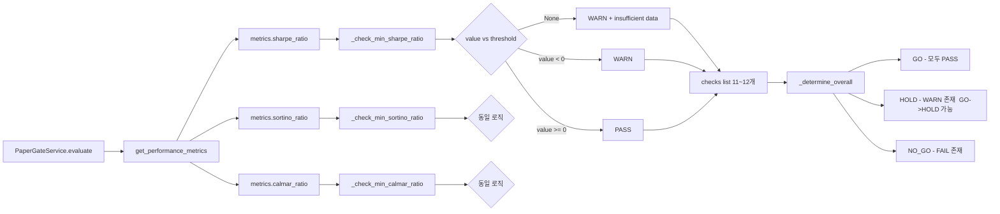

# Paper Gate / Exit Criteria — Sharpe/Sortino/Calmar 기반 평가 항목 추가

## 1. 설계 판단 (최종)

### 1.1 WARN-only 정책 (첫 턴)
- Risk-adjusted 3개 지표(Sharpe/Sortino/Calmar)는 **WARN 전용**으로 판정
- FAIL을 절대 반환하지 않음 → 기존 `NO_GO` 결정에 영향 없음
- 기존 `MIN_WIN_RATE` WARN과 동일한 수준 (HOLD 유도)
- **WARN→HOLD 영향**: 기존 `_determine_overall()` 로직에서 WARN 존재 시 overall = HOLD가 됨. 따라서 3개 신규 WARN check가 **GO→HOLD**로 바꿀 수 있음. 단, FAIL check가 하나라도 있으면 NO_GO가 우선이므로 WARN의 영향은 FAIL이 없을 때만 나타남.

### 1.2 Threshold env vars (Paper Gate 전용, 3개)
- Live Gate display-only는 threshold env var **불필요** (이번 턴)

| Field | Env Var | Default | 의미 |
|-------|---------|---------|------|
| `paper_gate_min_sharpe_ratio` | `PAPER_GATE_MIN_SHARPE_RATIO` | `"0.0"` | 음수만 WARN |
| `paper_gate_min_sortino_ratio` | `PAPER_GATE_MIN_SORTINO_RATIO` | `"0.0"` | 음수만 WARN |
| `paper_gate_min_calmar_ratio` | `PAPER_GATE_MIN_CALMAR_RATIO` | `"0.0"` | 음수만 WARN |

**Threshold 0.0 해석**: "metric 값이 0 미만(음수)일 때만 WARN. 0 또는 양수는 PASS."
- Sharpe 0.0 = 무위험 자산 수익률과 동일 → 통과
- Sortino 0.0 = 하방 변동성 대비 초과 수익 0 → 통과
- Calmar 0.0 = 최대 손실 대비 누적 수익 0 → 통과
- 음수 값만 위험 신호로 간주

### 1.3 Check 코드 및 라벨

| Code | Label | Source Field | None 원인 |
|------|-------|-------------|-----------|
| `MIN_SHARPE_RATIO` | "최소 Sharpe Ratio" | `metrics.sharpe_ratio` | 일별 수익률 2개 미만 |
| `MIN_SORTINO_RATIO` | "최소 Sortino Ratio" | `metrics.sortino_ratio` | 음수 수익률 2개 미만 |
| `MIN_CALMAR_RATIO` | "최소 Calmar Ratio" | `metrics.calmar_ratio` | 최대 손실 폭 0 |

### 1.4 None→WARN 메시지 구분 규칙
지표별로 None의 원인이 다르므로 메시지를 구분:

| 지표 | None 조건 | WARN 메시지 |
|------|-----------|-------------|
| Sharpe | valid daily returns < 2 | "일별 수익률 표본 부족으로 Sharpe Ratio를 계산할 수 없습니다 2일 이상 필요" |
| Sortino | downside samples < 2 | "음수 수익률 표본 부족으로 Sortino Ratio를 계산할 수 없습니다 2개 이상 필요" |
| Calmar | max_drawdown == 0 | "최대 손실 폭이 0이어서 Calmar Ratio를 계산할 수 없습니다" |

### 1.5 Live Gate: 보고/표시 전용 (always PASS)
- `evaluate_live_auto()`에 3개 check 추가하되 **항상 PASS 반환**
- measured_value에 실제 metric 값 표시 (시각적 정보 제공)
- threshold 필드는 `"N/A"`로 표시 (env var 없이 값만 표시)
- Overall decision logic에 **절대 영향 없음**
  - Live Gate `_determine_overall()`은 PASS인 check를 무시함
  - WARN/FAIL만 overall 계산에 반영
- Future turn에서 env var 추가 + WARN 활성화 예정

### 1.6 Additive Only 원칙
- 기존 check 8개(Paper Gate) / 8개(Live auto) **전혀 수정하지 않음**
- 신규 check만 `checks.append()`로 추가
- 기존 `_determine_overall()` 로직 변경 없음

### 1.7 Paper Exit Layer A 자동 확장
- `scripts/evaluate_paper_exit.py`의 `evaluate_auto()`는 `PaperGateService.evaluate()`를 호출
- `PaperGateService.evaluate()`가 반환하는 check list가 자동으로 확장됨
- **따라서 `evaluate_paper_exit.py` 코드 변경 불필요**
- `Layer A (10개 → 13개)`가 자동 반영됨

---

## 2. 변경 파일 목록

| # | 파일 | 변경 내용 | 비고 |
|---|------|-----------|------|
| 1 | `src/agent_trading/config/settings.py` | Paper Gate 3개 env var 필드 추가 | Live Gate env var 불필요 |
| 2 | `src/agent_trading/services/paper_gate.py` | 3개 check method + `evaluate()` 통합 | WARN-only 패턴 |
| 3 | `scripts/evaluate_live_gate.py` | 3개 display-only check | always PASS, threshold="N/A" |
| 4 | `tests/services/test_paper_gate.py` | 2개 신규 + 3개 기존 보정 | override env var |
| 5 | `tests/scripts/test_evaluate_paper_exit.py` | 1개 신규 테스트 | Layer A 자동 확장 검증 |
| 6 | `tests/scripts/test_evaluate_live_gate.py` | 2개 신규 테스트 | display-only 검증 |

**변경 불필요**:
- `scripts/evaluate_paper_exit.py` — PaperGateService 재사용으로 자동 반영
- `src/agent_trading/api/schemas.py` — `PaperGateCheckView`는 code/label/status/threshold/message를 동적으로 처리
- `src/agent_trading/api/routes/performance.py` — Gate endpoint 변경 없음
- `src/agent_trading/services/performance_summary.py` — 이미 Sharpe/Sortino/Calmar 계산 완료

---

## 3. 상세 구현 설계

### 3.1 `settings.py` — Paper Gate 3개 필드 추가

**Paper Gate 섹션末尾 (line 274 이전, 기존 6개 필드 뒤):**

```python
    # ---- Risk-Adjusted Gate thresholds (Paper) -------------------------
    # WARN-only.  음수 Sharpe/Sortino/Calmar만 WARN (기본값 0.0).
    paper_gate_min_sharpe_ratio: Decimal = field(
        default_factory=lambda: Decimal(os.getenv("PAPER_GATE_MIN_SHARPE_RATIO", "0.0")),
    )
    paper_gate_min_sortino_ratio: Decimal = field(
        default_factory=lambda: Decimal(os.getenv("PAPER_GATE_MIN_SORTINO_RATIO", "0.0")),
    )
    paper_gate_min_calmar_ratio: Decimal = field(
        default_factory=lambda: Decimal(os.getenv("PAPER_GATE_MIN_CALMAR_RATIO", "0.0")),
    )
```

※ Live Gate 섹션에는 이번 턴 추가 필드 없음 (display-only는 env var 불필요).

### 3.2 `paper_gate.py` — 신규 check methods (3개)

`_check_win_rate` (WARN-only) 패턴과 동일. None 메시지만 지표별로 구분.

```python
def _check_min_sharpe_ratio(self, value: Decimal | None) -> PaperGateCheck:
    threshold = self._settings.paper_gate_min_sharpe_ratio
    code = "MIN_SHARPE_RATIO"
    label = "최소 Sharpe Ratio"

    if value is None:
        return PaperGateCheck(
            code=code, label=label,
            status=GateStatus.WARN,
            measured_value=None, threshold=threshold,
            message="일별 수익률 표본 부족으로 Sharpe Ratio를 계산할 수 없습니다",
        )
    if value < threshold:
        return PaperGateCheck(
            code=code, label=label,
            status=GateStatus.WARN,
            measured_value=value, threshold=threshold,
            message=f"Sharpe Ratio {value}이(가) 최소 기준 {threshold}에 미달합니다",
        )
    return PaperGateCheck(
        code=code, label=label,
        status=GateStatus.PASS,
        measured_value=value, threshold=threshold,
        message=f"Sharpe Ratio {value} — 기준 통과",
    )
```

**`_check_min_sortino_ratio()`** — None 메시지:
```python
message="음수 수익률 표본 부족으로 Sortino Ratio를 계산할 수 없습니다",
```

**`_check_min_calmar_ratio()`** — None 메시지:
```python
message="최대 손실 폭이 0이어서 Calmar Ratio를 계산할 수 없습니다",
```

**`evaluate()` 통합 위치 (line 155 직후, `MIN_RETURN`/`MAX_DRAWDOWN` 다음):**

```python
        checks.append(self._check_min_return(metrics.cumulative_return_pct))
        checks.append(self._check_max_drawdown(metrics.max_drawdown_pct))

        # -- Risk-adjusted performance metrics (WARN-only) --
        checks.append(self._check_min_sharpe_ratio(metrics.sharpe_ratio))
        checks.append(self._check_min_sortino_ratio(metrics.sortino_ratio))
        checks.append(self._check_min_calmar_ratio(metrics.calmar_ratio))

        # -- Optional: benchmark comparison --
```

### 3.3 `evaluate_live_gate.py` — display-only 3개 check (always PASS)

`evaluate_live_auto()` 메서드末尾 (LG_POST_SUBMIT_SYNC 다음)에 추가.
env var 없이 metric 값만 표시, threshold는 `"N/A"`.

```python
        # -- 9. LG_SHARPE_RATIO: display only, always PASS (first turn) --
        sr = metrics.sharpe_ratio
        if sr is not None:
            checks.append(LiveGateCheck(
                code="LG_SHARPE_RATIO",
                label="Live Sharpe Ratio",
                layer="auto",
                status="PASS",
                measured_value=f"{sr:.4f}",
                threshold="N/A",
                message="Sharpe Ratio 정보 표시 (현재 gate 미적용)",
            ))
        else:
            checks.append(LiveGateCheck(
                code="LG_SHARPE_RATIO",
                label="Live Sharpe Ratio",
                layer="auto",
                status="PASS",
                measured_value="N/A",
                threshold="N/A",
                message="Sharpe Ratio 데이터 없음 — 정보 표시",
            ))

        # LG_SORTINO_RATIO, LG_CALMAR_RATIO 동일 패턴
```

---

## 4. Check Inventory 변화

### Paper Gate (8~9개 → 11~12개)

| # | Code | Status | 성격 |
|---|------|--------|------|
| 1 | `MIN_RETURN` | FAIL | 기존 |
| 2 | `MAX_DRAWDOWN` | FAIL | 기존 |
| **3** | **`MIN_SHARPE_RATIO`** | **WARN** | **신규** |
| **4** | **`MIN_SORTINO_RATIO`** | **WARN** | **신규** |
| **5** | **`MIN_CALMAR_RATIO`** | **WARN** | **신규** |
| 6 | `MIN_EXCESS_RETURN` | FAIL | 기존 (benchmark 시) |
| 7 | `MIN_WIN_RATE` | WARN | 기존 |
| 8 | `MIN_FILLED_ORDERS` | FAIL | 기존 |
| 9 | `SNAPSHOT_FRESHNESS` | FAIL | 기존 |
| 10 | `SYNC_FAILURES` | FAIL | 기존 |
| 11 | `BLOCKING_LOCKS` | FAIL | 기존 |

### Paper Exit Layer A (10개 → 13개)
- `PaperGateService.evaluate()` 반환 checks가 자동 확장
- `evaluate_auto()` 코드 변경 **불필요** (자동 반영)

### Live Gate Auto (8개 → 11개)
- 기존 8개 + LG_SHARPE_RATIO + LG_SORTINO_RATIO + LG_CALMAR_RATIO
- 신규 3개는 항상 PASS → overall decision 영향 없음

---

## 5. Mermaid: 데이터 흐름



---

## 6. 기존 테스트 영향 및 보정

### 영향 분석
3개 신규 WARN check 추가로 인해 기존 `all_pass_returns_go` 계열 테스트가 HOLD로 바뀔 수 있음.
- `test_all_pass_returns_go`: 3 BUY orders → negative sharpe ≈ -18.8 < 0.0 → WARN → HOLD
- `test_benchmark_code_included`: 동일 seed → risk metric WARN 발생
- `test_without_benchmark_code_skips_excess_return`: 동일 seed → risk metric WARN 발생

### 보정 방법
3개 테스트에서 env override로 risk metric threshold를 매우 낮게 설정 (`-99`).
```python
# Sharpe/Sortino/Calmar가 음수여도 WARN이 발생하지 않도록 threshold 완화
# 이유: 3 BUY order seed는 의도적으로 negative return을 만들기 때문
# 이 테스트는 GO/check 존재 여부 검증이 목적이므로 risk metric PASS가 필요
with _env(
    MIN_SHARPE_RATIO="-99",
    MIN_SORTINO_RATIO="-99",
    MIN_CALMAR_RATIO="-99",
):
    settings = AppSettings()
    ...
```

---

## 7. 테스트 계획 (신규 5개)

### 7.1 `test_paper_gate.py` — 2개 신규 테스트

**Test 1: `test_risk_metrics_warn_below_threshold`**
- Seed: 3 BUY orders (negative return → negative sharpe)
- Env: `MIN_RETURN_PCT=-99` (MIN_RETURN FAIL 방지), 나머지 threshold 기본값
- 검증:
  - `MIN_SHARPE_RATIO`, `MIN_SORTINO_RATIO`, `MIN_CALMAR_RATIO` 모두 WARN
  - overall = HOLD (WARN 존재, FAIL 없음)
  - 총 WARN count 3개

**Test 2: `test_risk_metrics_pass_when_above_threshold`**
- Seed: 3 BUY orders
- Env: `MIN_SHARPE_RATIO=-99, MIN_SORTINO_RATIO=-99, MIN_CALMAR_RATIO=-99`
- 검증:
  - 3개 risk check 모두 PASS
  - overall = GO (다른 조건 충족 시)

### 7.2 `test_evaluate_paper_exit.py` — 1개 신규 테스트

**Test 3: `test_auto_includes_risk_checks`**
- Seed: 3 BUY orders + fresh sync
- Env: threshold override (risk metric PASS)
- 검증:
  - `evaluate_auto()` Layer A checks에 `MIN_SHARPE_RATIO`, `MIN_SORTINO_RATIO`, `MIN_CALMAR_RATIO` 포함
  - Layer A status 반영 확인

### 7.3 `test_evaluate_live_gate.py` — 2개 신규 테스트

**Test 4: `test_live_auto_includes_risk_checks`**
- Seed: 12 BUY orders (Live Gate 최소 주문 수)
- 검증:
  - `evaluate_live_auto()` 결과에 `LG_SHARPE_RATIO`, `LG_SORTINO_RATIO`, `LG_CALMAR_RATIO` 포함
  - 3개 모두 status = `"PASS"`

**Test 5: `test_risk_checks_not_affect_overall`**
- Seed: 12 BUY orders + Paper PASS + Live auto all PASS
- 검증:
  - 신규 risk check 3개가 PASS여도 기존 overall logic 변화 없음
  - (existing `test_hold_manual_pending`와 동일한 overall 기대값)

### 7.4 기존 테스트 보정 (3개)

| 테스트 | 파일 | 보정 내용 |
|--------|------|----------|
| `test_all_pass_returns_go` | `test_paper_gate.py` | `_env(MIN_SHARPE_RATIO=-99, MIN_SORTINO_RATIO=-99, MIN_CALMAR_RATIO=-99)` |
| `test_benchmark_code_included` | `test_paper_gate.py` | 동일 override |
| `test_without_benchmark_code_skips_excess_return` | `test_paper_gate.py` | 동일 override |

---

## 8. 실행 단계

| Step | 작업 | 파일 |
|------|------|------|
| 1 | settings.py에 Paper Gate 3개 env var 필드 추가 | `config/settings.py` |
| 2 | paper_gate.py에 3개 check method 추가 | `services/paper_gate.py` |
| 3 | paper_gate.py evaluate()에 3개 check 통합 | `services/paper_gate.py` |
| 4 | evaluate_live_gate.py에 3개 display-only check 추가 | `scripts/evaluate_live_gate.py` |
| 5 | test_paper_gate.py: 2개 신규 + 3개 기존 보정 | `tests/services/test_paper_gate.py` |
| 6 | test_evaluate_paper_exit.py: 1개 신규 | `tests/scripts/test_evaluate_paper_exit.py` |
| 7 | test_evaluate_live_gate.py: 2개 신규 | `tests/scripts/test_evaluate_live_gate.py` |
| 8 | pytest 전체 suite 실행 + 회귀 검증 | - |
| 9 | BACKLOG.md 업데이트 | `plans/BACKLOG.md` |

---

## 9. 제약 조건 점검

| 제약 | 상태 | 설명 |
|------|------|------|
| Additive only | ✅ | 기존 check/로직 변경 없음 |
| No DB migration | ✅ | env var + in-memory 설정만 변경 |
| No admin UI 변경 | ✅ | API schema 변경 없음 |
| No broker submit 변경 | ✅ | Gate 평가 계층만 변경 |
| No hard guardrail | ✅ | WARN-only, FAIL 없음 |
| Paper/Live 동일 시스템 | ✅ | Paper Gate 주도, Live Gate는 display-only |
| Config expansion 최소화 | ✅ | 3개 env var만 추가 (Live Gate 불필요) |
| Display-only ≠ 판정 로직 | ✅ | Live Gate check는 항상 PASS, overall 무영향 |

---

## 10. 완료 조건

- [x] Paper Gate에 3개 risk-adjusted check 추가 (WARN-only)
- [x] Live Gate에 3개 display-only check 추가 (always PASS, threshold="N/A")
- [x] 기존 7개 Paper Gate 테스트 회귀 없이 통과 (3개 env override)
- [x] 신규 5개 테스트 통과
- [x] 전체 pytest suite 통과
- [x] Paper Exit Layer A 자동 확장 확인 (코드 변경 불필요)
- [x] Live Gate display-only가 overall decision에 영향 없음 확인
