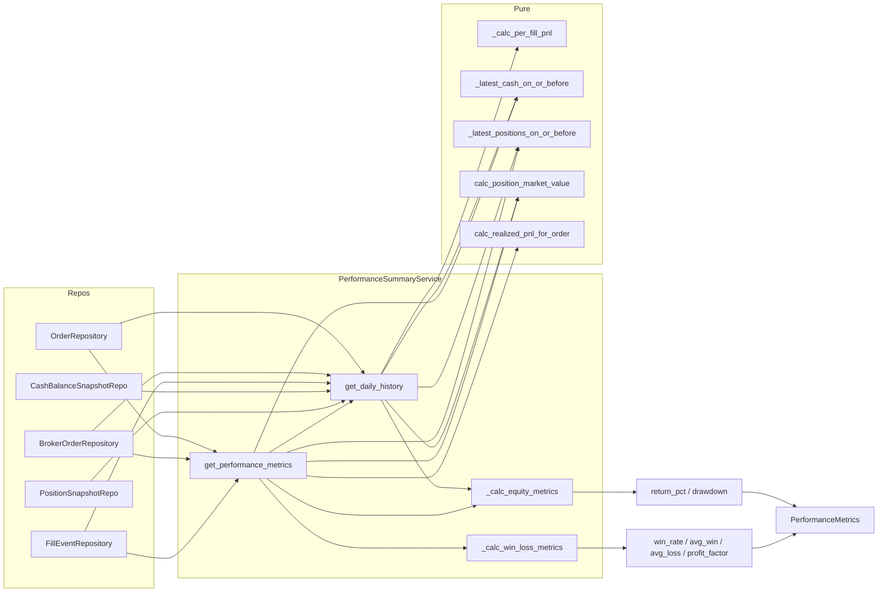

# Paper Performance Metrics — 설계 문서

> **상태**: ✅ 구현 완료 (2026-05-10) — **mode-agnostic**
> **변경 파일**: [`performance_summary.py`](src/agent_trading/services/performance_summary.py), [`schemas.py`](src/agent_trading/api/schemas.py), [`routes/performance.py`](src/agent_trading/api/routes/performance.py), [`test_performance_summary.py`](tests/services/test_performance_summary.py), [`BACKLOG.md`](plans/BACKLOG.md)
> **테스트 결과**: 53/53 (performance_summary) + 56/56 (inspection API) 통과
> **mode-agnostic**: 이 모듈은 paper/live 모두에서 동일하게 동작합니다. broker env와 무관하게 repository의 fill/position/cash 데이터만 읽어 성과 지표를 계산합니다.
> **⚠️ 후속 확장**: Sharpe/Sortino/Calmar ratio는 [`paper_performance_risk_adjusted_metrics.md`](plans/paper_performance_risk_adjusted_metrics.md) 참고

## 1. Metrics Source Inventory

| 지표 | Source | 정확도 |
|------|--------|--------|
| cumulative_return_pct | equity history (get_daily_history) | Exact |
| peak_equity | equity history rolling max | Exact |
| current_drawdown_pct | (peak - current) / peak | Exact |
| max_drawdown_pct | equity history rolling max drawdown | Exact |
| winning_trades | per-order realized PnL > 0 | Exact |
| losing_trades | per-order realized PnL < 0 | Exact |
| win_rate | winning / total_filled_orders | Exact |
| avg_win | sum(winning_pnl) / winning_trades | Exact |
| avg_loss | sum(losing_pnl) / losing_trades | Exact |
| profit_factor | sum(winning) / abs(sum(losing)) | Exact |
| sharpe_ratio | daily return std dev (rf=0, 비연율화) | Approximate (일수 부족 시 신뢰도 낮음) |
| sortino_ratio | daily downside deviation (rf=0, 비연율화) | Approximate (음수 수익률 2+ 필요) |
| calmar_ratio | cumulative_return_pct / max_drawdown_pct | Exact |

### Per-order vs Per-fill 정책

**선택: Per-order 기준**으로 통일합니다.

근거:
- 기존 [`AccountPerformanceSummary`](src/agent_trading/services/performance_summary.py:160) 의 `winning_trade_count` / `losing_trade_count`가 per-order realized PnL 기준 (`calc_realized_pnl_for_order()`)
- 신규 metrics도 동일한 per-order 기준을 사용해 일관성 유지
- per-fill 기준은 개별 fill 단위 PnL이 Real-world 거래에서 독립적 의미가 약함

### Starting Equity 정의

- `starting_equity` = `start_date - 1일` 시점의 `cash + position_market_value`
  - [`_latest_cash_on_or_before()`](src/agent_trading/services/performance_summary.py:107) + [`_latest_positions_on_or_before()`](src/agent_trading/services/performance_summary.py:122) + [`calc_position_market_value()`](src/agent_trading/services/performance_summary.py:139) 조합
- snapshot이 전혀 없으면 `starting_equity = Decimal("0")` (return 계산 불가 → 0%)

### No-Data 정책

- equity history에 `total_equity=None`인 날은 drawdown 계산에서 제외
- 체결 내역 없음 → winning/losing = 0, win_rate = 0, avg_win/avg_loss = None
- profit_factor: losing_trades=0이면 None 반환 (infinity 방지)

---

## 2. Data Model

### PerformanceMetrics (dataclass)

```python
@dataclass(slots=True, frozen=True)
class PerformanceMetrics:
    account_id: UUID
    strategy_id: UUID | None
    period_start: date
    period_end: date

    starting_equity: Decimal
    """기간 시작 시점 평가액 (period_start - 1일 기준 snapshot)."""

    current_equity: Decimal
    """기간 종료 시점 평가액 (period_end 기준 snapshot 또는 history 마지막 equity)."""

    cumulative_realized_pnl: Decimal
    """기간 내 realized PnL 합계 (per-order 기준)."""

    cumulative_return_pct: Decimal
    """기간 누적 수익률 = (current_equity - starting_equity) / starting_equity * 100.
    starting_equity가 0이면 0."""

    peak_equity: Decimal
    """기간 중 최고 equity."""

    current_drawdown_pct: Decimal
    """현재 drawdown = (peak_equity - current_equity) / peak_equity * 100."""

    max_drawdown_pct: Decimal
    """기간 중 최대 drawdown."""

    total_filled_orders: int
    """FILLED/PARTIALLY_FILLED 주문 수."""

    winning_trades: int
    """realized_pnl > 0인 주문 수."""

    losing_trades: int
    """realized_pnl < 0인 주문 수."""

    win_rate: Decimal
    """승률 = winning_trades / total_filled_orders * 100 (percentage).
    total_filled_orders가 0이면 0."""

    avg_win: Decimal | None
    """평균 승리 금액 = sum(winning_pnl) / winning_trades.
    winning_trades가 0이면 None."""

    avg_loss: Decimal | None
    """평균 손실 금액 = sum(losing_pnl) / losing_trades (양수).
    losing_trades가 0이면 None."""

    profit_factor: Decimal | None
    """Profit factor = sum(winning_pnl) / abs(sum(losing_pnl)).
    losing_trades가 0이면 None."""
```

---

## 3. Service 확장

### 신규 pure helper: `_calc_equity_metrics()`

```python
def _calc_equity_metrics(
    points: Sequence[DailyPerformancePoint],
    starting_equity: Decimal,
) -> tuple[Decimal, Decimal, Decimal, Decimal, Decimal]:
    """equity history에서 return/drawdown 지표를 계산합니다.
    
    Returns
    -------
    tuple[Decimal, Decimal, Decimal, Decimal, Decimal]
        (cumulative_return_pct, current_equity, peak_equity, current_drawdown_pct, max_drawdown_pct)
    """
```

### 신규 pure helper: `_calc_win_loss_metrics()`

```python
def _calc_win_loss_metrics(
    per_order_pnls: Sequence[Decimal],
) -> tuple[int, int, Decimal, Decimal | None, Decimal | None, Decimal | None]:
    """per-order PnL 목록에서 win/loss 지표를 계산합니다.
    
    Returns
    -------
    tuple[int, int, Decimal, Decimal | None, Decimal | None, Decimal | None]
        (total_filled_orders, winning_trades, losing_trades, win_rate, avg_win, avg_loss, profit_factor)
    """
```

### 신규 서비스 메서드: `get_performance_metrics()`

```python
async def get_performance_metrics(
    self,
    account_id: UUID,
    start_date: date,
    end_date: date,
    strategy_id: UUID | None = None,
) -> PerformanceMetrics:
    """기간 기반 성과 지표를 계산합니다.
    
    내부적으로:
    1. get_daily_history()를 호출해 equity history 획득
    2. per-order PnL 계산 (get_account_summary와 동일 패턴)
    3. _calc_equity_metrics()로 return/drawdown 계산
    4. _calc_win_loss_metrics()로 win/loss 계산
    5. PerformanceMetrics 조립
    """
```

**알고리즘**:

1. `get_daily_history(account_id, start_date, end_date, strategy_id)` 호출
2. equity history에서 non-None total_equity 추출 → `_calc_equity_metrics()`
3. `starting_equity` 계산: `_latest_cash_on_or_before(all_cash, start_date - 1일)` + `_latest_positions_on_or_before(all_positions, start_date - 1일)` → position_market_value
4. filled orders 쿼리 → per-order PnL 계산 (기존 `get_account_summary`와 동일 패턴)
5. `_calc_win_loss_metrics()`로 win/loss 계산
6. `PerformanceMetrics` 조립

---

## 4. API 설계

### 신규 Pydantic Models (schemas.py)

```python
class PerformanceMetricsView(BaseModel):
    model_config = ConfigDict(from_attributes=True)
    
    account_id: str
    strategy_id: str | None
    period_start: date
    period_end: date
    
    starting_equity: float
    current_equity: float
    cumulative_realized_pnl: float
    cumulative_return_pct: float
    
    peak_equity: float
    current_drawdown_pct: float
    max_drawdown_pct: float
    
    total_filled_orders: int
    winning_trades: int
    losing_trades: int
    win_rate: float
    avg_win: float | None
    avg_loss: float | None
    profit_factor: float | None


class PerformanceMetricsResponse(BaseModel):
    account_id: str
    strategy_id: str | None
    period_start: date
    period_end: date
    metrics: PerformanceMetricsView
```

Wait, if I use `from_attributes=True` on `PerformanceMetricsView` and validate the `PerformanceMetrics` dataclass directly, the response model can just be `PerformanceMetricsView` directly. The `PerformanceMetrics` dataclass already has all the fields. No need for a separate response wrapper.

Actually, let me simplify. The `PerformanceMetrics` dataclass = `PerformanceMetricsView` Pydantic model. Just validate and return.

### 신규 Endpoint (routes/performance.py)

```
GET /performance-metrics?account_id=<UUID>&start_date=YYYY-MM-DD&end_date=YYYY-MM-DD[&strategy_id=<UUID>]
```

Request:
- `account_id`: UUID (required)
- `start_date`: YYYY-MM-DD (required)
- `end_date`: YYYY-MM-DD (required)
- `strategy_id`: UUID (optional)

Response: `PerformanceMetricsView` (19 fields)

Validation:
- account_id UUID format (400 if invalid)
- start_date/end_date ISO format (400 if invalid)
- start_date <= end_date (400 if violated)

---

## 5. Mermaid: 데이터 흐름



---

## 6. 변경 파일 목록

| 파일 | 변경 내용 |
|------|----------|
| [`src/agent_trading/services/performance_summary.py`](src/agent_trading/services/performance_summary.py) | `PerformanceMetrics` dataclass 추가, `_calc_equity_metrics()` / `_calc_win_loss_metrics()` pure helpers 추가, `get_performance_metrics()` 메서드 추가 |
| [`src/agent_trading/api/schemas.py`](src/agent_trading/api/schemas.py) | `PerformanceMetricsView` Pydantic model 추가 (from_attributes, 19 fields) |
| [`src/agent_trading/api/routes/performance.py`](src/agent_trading/api/routes/performance.py) | `GET /performance-metrics` endpoint 추가 |
| [`tests/services/test_performance_summary.py`](tests/services/test_performance_summary.py) | 최소 6개 테스트 클래스/메서드 추가 |
| [`plans/BACKLOG.md`](plans/BACKLOG.md) | Backlog item #23 등록 |

---

## 7. 테스트 계획

### TestCalcEquityMetrics (3 tests) — Pure function 검증

1. **monotonic_increasing_equity** — equity가 계속 상승 → drawdown 0, return 양수
2. **peak_then_decline** — peak 이후 하락 → current_drawdown / max_drawdown 정확성
3. **empty_or_all_none** — equity history가 비었거나 전부 None → safe defaults

### TestCalcWinLossMetrics (3 tests) — Pure function 검증

4. **mixed_pnls** — 양수/음수 혼합 → win_rate/avg_win/avg_loss 정확성
5. **all_wins** — 전부 양수 PnL → profit_factor=None, avg_loss=None
6. **all_losses** — 전부 음수 PnL → profit_factor=None, avg_win=None

### TestGetPerformanceMetrics (4 tests) — 통합 검증

7. **basic_metrics** — 단순 시나리오: 1개 winning order + equity 변화 → 모든 지표 정확성
8. **drawdown_scenario** — equity peak → decline 구간 → max_drawdown 검증
9. **empty_account** — 데이터 없음 → zero-filled metrics
10. **strategy_filter** — 전략 필터 → 해당 전략 주문만 집계

---

## 8. 실행 단계

| 단계 | 내용 | 담당 |
|------|------|------|
| **Step 1** | Model: `PerformanceMetrics` dataclass + `_calc_equity_metrics()` + `_calc_win_loss_metrics()` | Code |
| **Step 2** | Service: `get_performance_metrics()` 구현 | Code |
| **Step 3** | API: `PerformanceMetricsView` Pydantic model + `GET /performance-metrics` | Code |
| **Step 4** | Tests: 6개 pure function + 4개 통합 = 10 tests | Code |
| **Step 5** | 회귀 검증: 전체 테스트 스위트 실행 | Code |
| **Step 6** | BACKLOG.md 업데이트 + 완료 보고 | Code |
