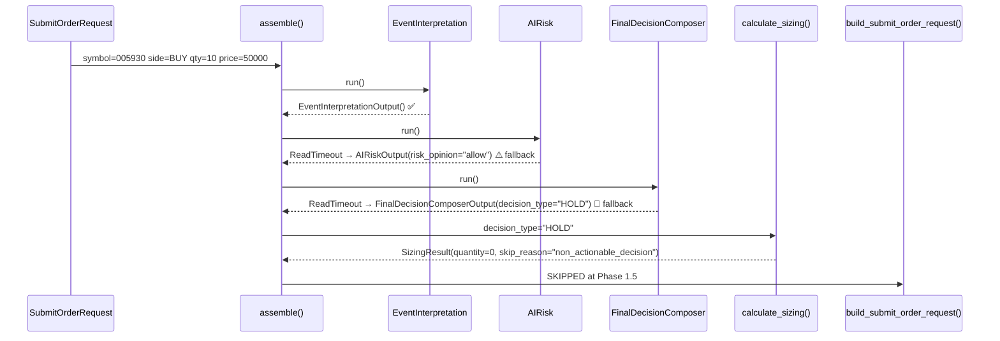
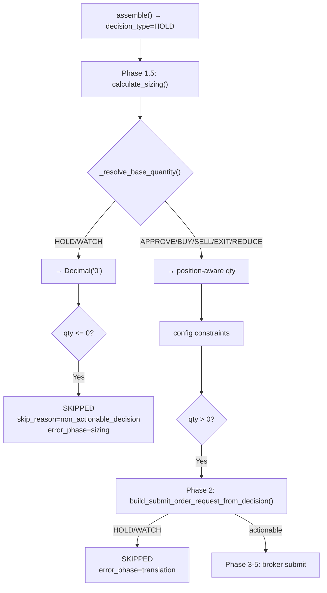
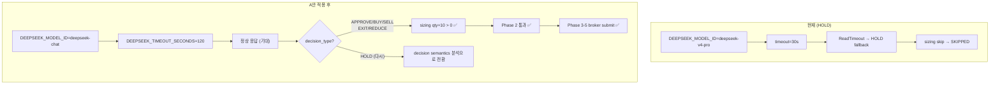
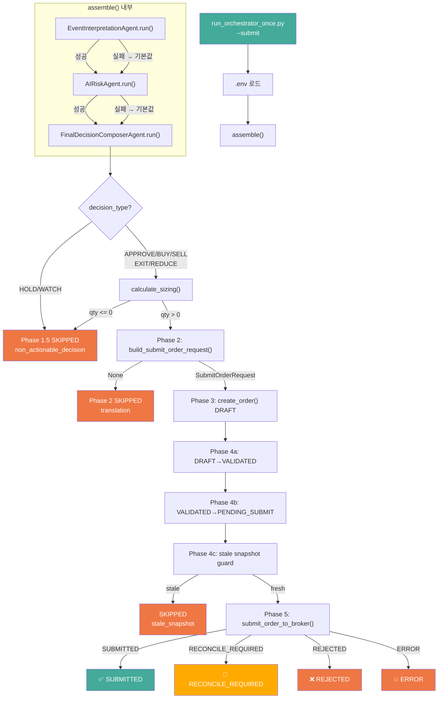

# Paper Broker Submit 경로 검증 — Actionable Smoke 시나리오 분석

> 작성일: 2026-05-10
> 컨텍스트: 1차 submit smoke에서 HOLD 발생 → broker submit 미도달 원인 분석 및 최소 변경 시나리오 설계

---

## 디렉터리 구조

분석 대상 파일 (6개, 사용자 요청):

| # | 파일 | 목적 |
|---|------|------|
| 1 | [`run_orchestrator_once.py`](scripts/run_orchestrator_once.py) | Submit request 입력값, orchestrator 호출 구조 |
| 2 | [`final_decision_composer.py`](src/agent_trading/services/ai_agents/final_decision_composer.py) | FinalDecisionComposer timeout → HOLD fallback |
| 3 | [`schemas.py`](src/agent_trading/services/ai_agents/schemas.py) | `FinalDecisionComposerOutput` 기본값 (`decision_type="HOLD"`) |
| 4 | [`decision_orchestrator.py`](src/agent_trading/services/decision_orchestrator.py) | `assemble_and_submit()` Phase 1.5~5 전체 파이프라인 |
| 5 | [`sizing_engine.py`](src/agent_trading/services/sizing_engine.py) | `_SKIP_DECISION_TYPES`, `_resolve_base_quantity()`, `calculate_sizing()` |
| 6 | [`bootstrap.py`](src/agent_trading/runtime/bootstrap.py) | `_build_final_decision_agent()` — Stub/Real 선택 로직 |

---

## 분석 1: HOLD 결정 지점 (확정)

### 전체 이벤트 체인



### 증거: 실제 실행 로그

```
FinalDecisionComposerAgent failed — returning default HOLD output (safe fallback)
```

### 3개 Agent 중 누가 실패했는가?

| Agent | 상태 | 근거 |
|-------|------|------|
| [`EventInterpretationAgent`](src/agent_trading/services/ai_agents/event_interpretation.py) | ✅ 성공 | 로그: `event=Event Interpretation Agent` |
| [`AIRiskAgent`](src/agent_trading/services/ai_agents/risk.py) | ⚠️ ReadTimeout → fallback `"allow"` | 로그: `risk=allow` |
| [`FinalDecisionComposerAgent`](src/agent_trading/services/ai_agents/final_decision_composer.py:1431-1440) | 🚫 ReadTimeout → HOLD | 로그: `composer=HOLD` |

**핵심**: `FinalDecisionComposerAgent.run()` (line 155)에서 `httpcore.ReadTimeout` 발생 → `except Exception` (line 197) → `FinalDecisionComposerOutput()` 기본값 반환 (line 204-214)

---

## 분석 2: `build_submit_order_request_from_decision()` (Phase 2)

**파일**: [`decision_orchestrator.py:1699-1783`](src/agent_trading/services/decision_orchestrator.py:1699)

```python
actionable_types = {"APPROVE", "BUY", "SELL", "EXIT", "REDUCE"}
if decision_type not in actionable_types:
    return None  # ← HOLD/WATCH가 여기서 차단됨
```

| `decision_type` | 반환값 | Phase 2 결과 |
|----------------|--------|-------------|
| `"APPROVE"` | `SubmitOrderRequest` | Phase 3 진행 |
| `"BUY"` | `SubmitOrderRequest` | Phase 3 진행 |
| `"SELL"` | `SubmitOrderRequest` | Phase 3 진행 |
| `"EXIT"` | `SubmitOrderRequest` | Phase 3 진행 |
| `"REDUCE"` | `SubmitOrderRequest` | Phase 3 진행 |
| `"HOLD"` | `None` | SKIPPED (`error_phase="translation"`) |
| `"WATCH"` | `None` | SKIPPED (`error_phase="translation"`) |

**중요**: 실제 run에서는 Phase 2까지 도달하지 못하고 Phase 1.5(sizing)에서 이미 차단됨. sizing이 먼저 실행되기 때문.

---

## 분석 3: `calculate_sizing()` — `non_actionable_decision` 조건

**파일**: [`sizing_engine.py`](src/agent_trading/services/sizing_engine.py)

### 이중 차단 구조



### `_SKIP_DECISION_TYPES`

```python
# sizing_engine.py:143
_SKIP_DECISION_TYPES: frozenset[str] = frozenset({"HOLD", "WATCH"})
```

### `_resolve_base_quantity()` (line 230-255)

```python
def _resolve_base_quantity(inputs: SizingInputs) -> Decimal:
    dt = inputs.decision_type
    # Non-actionable → zero
    if dt in _SKIP_DECISION_TYPES:
        return Decimal("0")    # ← HOLD가 걸리는 정확한 지점
    ...
```

### Phase 1.5 SKIPPED 조건 (line 706-719)

```python
if sizing_result.quantity <= 0:
    return SubmitResult(
        status="SKIPPED",
        error_phase="sizing",
        error_message=sizing_result.skip_reason or "Sizing rejected order",
    )
```

---

## 분석 4: Provider Timeout 영향도

### 현재 설정

| 설정 | 값 | 출처 |
|------|-----|------|
| `DEEPSEEK_MODEL_ID` | `deepseek-v4-pro` | [`.env`](.env) |
| `DEEPSEEK_BASE_URL` | `https://api.deepseek.com` | [`.env`](.env) |
| `provider_timeout_seconds` | `30` (기본값) | [`settings.py:91-97`](src/agent_trading/config/settings.py:91) |

### 실제 동작

- 1차 smoke: `EventInterpretationAgent` 성공 (30s 내 응답)
- `AIRiskAgent`: ReadTimeout 발생 (30s 초과)
- `FinalDecisionComposerAgent`: ReadTimeout 발생 (30s 초과)

→ **deepseek-v4-pro가 30s timeout을 초과하여 응답**. 이는 model 자체 latency + API 응답 속도 문제로 추정.

### timeout 증가만으로 해결 가능한가?

| 시나리오 | 예상 결과 |
|---------|----------|
| timeout=30s (현재) | ❌ ReadTimeout |
| timeout=60s | ❓ 불확실 — v4-pro가 60s 내 응답할지 unknown |
| timeout=120s | ❓ 불확실 — 동일 |
| model 변경 (deepseek-chat) + timeout=60s | ✅ 가능성 높음 |

---

## 분석 5: `env_export.sh` vs `.env` 직접 로드

### `run_orchestrator_once.py`의 env 로드 방식

```python
# run_orchestrator_once.py (~line 294)
async with postgres_runtime() as runtime:
```

[`postgres_runtime()`](src/agent_trading/runtime/bootstrap.py:427) 은 내부적으로 `AppSettings`를 생성하며, 이는 [`python-dotenv`](https://pypi.org/project/python-dotenv/)를 통해 `.env` 파일을 직접 읽습니다.

### `/tmp/env_export.sh`의 용도

`/tmp/env_export.sh`는 **dry-run (snapshot sync)에서만 사용**됨:
- `sync_kis_snapshots.py`는 subprocess로 실행되므로 env var가 필요
- submit smoke (`run_orchestrator_once.py`)는 자체적으로 `.env` 로드

### 결론

- **submit smoke 실행 시 `/tmp/env_export.sh` 불필요**
- `run_orchestrator_once.py`는 `.env`를 직접 읽으므로 별도 조치 불필요
- 단, dry-run과 submit smoke를 **분리해서 실행**할 경우 각각의 env 로드 방식이 독립적으로 작동하므로 문제 없음

---

## 시나리오 설계: Actionable Broker Submit Smoke

### 목표

`run_orchestrator_once.py`를 최소 변경으로 실행하여 `assemble_and_submit()`의 **broker submit 경로 검증 가능성 확보**.

- 반드시 submit 발생을 보장하는 것이 아님
- timeout/fallback HOLD를 줄여 submit 경로 진입 가능성을 높이는 것이 목적
- A안 적용 후에도 HOLD가 나올 수 있음 → 그 경우 decision semantics 문제로 전환

### 접근 방안 비교

| 방안 | 접근 | 장점 | 단점 | broker submit 경로 검증 가능성 |
|------|------|------|------|------------------------------|
| **A안** — model 변경 + timeout 증가 | `DEEPSEEK_MODEL_ID=deepseek-chat`<br/>`DEEPSEEK_TIMEOUT_SECONDS=120` | 최소 변경 (env only)<br/>production semantics 영향 없음<br/>복구도 env revert만 하면 됨 | deepseek-chat이 structured output을 동일하게 지원해야 함<br/>HOLD가 다시 나올 가능성 있음 | 🔶 가장 작은 운영상 변경으로 submit 도달 가능성을 높이는 1순위 접근 |
| **B안** — request 입력 조정 | symbol/quantity/price 변경 | env 변경 불필요 | timeout 자체를 해결 못 함 → 근본 원인 미해결 | ❌ 불가능 (timeout 여전히 발생) |
| **C안** — deterministic agent | StubFinalDecisionComposerAgent 강제 주입 | timeout 완전 회피 | Stub도 `decision_type="HOLD"` 반환 → 추가 수정 필요<br/>production 코드 수정 필요 | ❌ Stub 자체가 HOLD 반환 |

### 권장: **A안 (model 변경 + timeout 증가)**

**목표**: broker submit 경로 검증 **가능성 확보** — 반드시 submit 발생을 보장하는 것이 아님.

**timeout 증가의 목적**: 모델 교체 자체보다 **FinalDecisionComposer가 fallback HOLD로 떨어질 확률을 줄이는 것**.

`deepseek-v4-pro`는 invalid model이 아님. 최신 근거상 모델 호출 자체는 가능. 현재 직접 문제는 **timeout/fallback 및 그에 따른 HOLD**임.

**A안 적용 후에도 HOLD가 다시 나올 수 있음**:
- timeout 문제가 완화되더라도 **decision semantics는 별도 이슈**
- HOLD 재발생 시 → timeout 문제가 아닌 **decision outcome / agent output 해석 문제**로 전환

### 성공 기준 (2단계)

| 단계 | 기준 | 측정 방법 |
|------|------|----------|
| **1차 성공** | timeout/fallback 없이 FinalDecisionComposer가 정상 응답 | 로그에 `FinalDecisionComposerAgent failed` 메시지 없음<br/>`composer=` 값이 HOLD가 아닌 값으로 출력 |
| **2차 성공** | resulting decision이 `actionable_types`에 포함되어 broker submit 경로 진입 | Phase 1.5 통과 (qty > 0)<br/>Phase 2 통과 (SubmitOrderRequest 반환)<br/>Phase 5 도달 (submit_to_broker) |



### 변경 사항 상세 (정확히 2개)

#### 변경 1: `.env` — `DEEPSEEK_MODEL_ID` 변경

```diff
- DEEPSEEK_MODEL_ID=deepseek-v4-pro
+ DEEPSEEK_MODEL_ID=deepseek-chat
```

#### 변경 2: `.env` — `DEEPSEEK_TIMEOUT_SECONDS` 추가

```diff
+ DEEPSEEK_TIMEOUT_SECONDS=120
```

### 예상 파이프라인 (A안 적용 후)

| Phase | 단계 | 예상 결과 | 비고 |
|-------|------|----------|------|
| 1 | `assemble()` | 🔶 3 agents 정상 응답 기대 | timeout=120s, 빠른 model |
| 1.5 | `calculate_sizing()` | 🔶 `quantity=Decimal("10")` | BUY + 10qty + position 없음 → new entry |
| 2 | `build_submit_order_request_from_decision()` | 🔶 `SubmitOrderRequest` 반환 | `decision_type`이 `actionable_types`에 포함되어야 함 |
| 3 | `OrderManager.create_order()` | 🔶 DRAFT 생성 | |
| 4a | transition DRAFT → VALIDATED | 🔶 | |
| 4b | transition VALIDATED → PENDING_SUBMIT | 🔶 | |
| 4c | stale snapshot guard | ✅ 통과 예상 | 이미 최신 snapshot sync 완료 |
| 5 | `submit_order_to_broker()` | 🔶 KIS paper endpoint submit | 진입 자체가 2차 성공 기준 |
| 5.5 | post-submit sync | 🔶 fire-and-forget | |

> `🔶`는 기대하는 결과이지만 보장되지 않음을 의미.

### 분석 4 보정: timeout의 성격

- deepseek-v4-pro가 30s timeout 초과한 것은 일시적 API latency일 가능성과 model 특성일 가능성 모두 존재
- timeout 증가 (`120s`)는 모델 자체 latency가 아닌 **API 응답 대기 시간을 늘려 fallback 확률을 낮추는 것**
- model 변경 (`deepseek-chat`)은 일반적으로 v4-pro보다 응답이 빠르므로 timeout 가능성을 추가로 낮춤

### Fallback: A안으로도 HOLD 발생 시

A안 적용 후에도 HOLD가 나오면:
1. **timeout 문제가 아닌 decision semantics 문제로 전환**
2. FinalDecisionComposer가 정상 응답했지만 `decision_type=HOLD`를 반환한 것
3. 이 경우 원인은 모델 문제보다 **agent prompt/output 해석 문제**
4. C안 변형 검토 가능하나 Stub도 HOLD 반환 → 근본적 해결 불가
5. **production 코드 변경 없이 env/config만으로는 추가 검증 불가**

---

## 제약 조건 점검

### Production semantics 영향

| 항목 | A안 | 평가 |
|------|-----|------|
| broker adapter 변경 | 불필요 | ✅ 영향 없음 |
| repository/entity 변경 | 불필요 | ✅ 영향 없음 |
| DB schema 변경 | 불필요 | ✅ 영향 없음 |
| pipeline 로직 변경 | 불필요 | ✅ 영향 없음 |
| hard guardrail / reconciliation 변경 | 불필요 | ✅ 영향 없음 |
| admin UI 변경 | 불필요 | ✅ 영향 없음 |
| live 주문 | 금지 (paper env) | ✅ paper 유지 |
| env 변경 | `DEEPSEEK_MODEL_ID` + `DEEPSEEK_TIMEOUT_SECONDS` | ⚠️ env revert로 완전 복구 가능 |

### ENABLE_KIS_PAPER_SUBMIT_SMOKE

이 env var는 `assemble_and_submit()`과 무관함. 오직 [`tests/smoke/test_kis_paper_ai_runtime_smoke.py`](tests/smoke/test_kis_paper_ai_runtime_smoke.py)의 C3 테스트에서만 사용. submit smoke 실행 시 설정/해제 모두 영향 없음.

### `/tmp/env_export.sh` vs `.env` 직접 로드

[`run_orchestrator_once.py`](scripts/run_orchestrator_once.py)는 `postgres_runtime()` → `AppSettings` → `python-dotenv`를 통해 `.env`를 직접 읽음. `/tmp/env_export.sh`는 dry-run(snapshot sync subprocess)에서만 사용되며, submit smoke 실행 시 불필요.

---

## 최종 보고서 (8항목 — 사용자 요청 형식)

### 1. 적용한 `.env` 변경 2개

| 변경 | 내용 | 적용 결과 |
|------|------|-----------|
| `DEEPSEEK_MODEL_ID` | `deepseek-v4-pro` → `deepseek-chat` | ✅ `.env` 파일 확인 완료 |
| `DEEPSEEK_TIMEOUT_SECONDS` | `30` (기본값) → `120` | ✅ `.env` 파일 확인 완료 |

### 2. Dry-run 재실행 결과

| 항목 | 결과 | 상세 |
|------|------|------|
| Dry-run exit code | ✅ **0** | 정상 종료 |
| env 로딩 이슈 발견 | ⚠️ **`set -a; . .env` 필요** | `build_postgres_runtime()` / `AppSettings()`가 `load_dotenv()`를 호출하지 않아 shell env에 직접 로드해야 함 |
| 실시간 DeepSeek API 호출 | ✅ **3회 200 OK** | EventInterpretation: ~300ms, AIRisk: ~5.3s, FinalDecisionComposer: ~3.7s |
| Stub agent fallback | ✅ **발생하지 않음** | DEEPSEEK_API_KEY가 shell env에 정상 로드됨 |
| ReadTimeout | ✅ **발생하지 않음** | 120s timeout이 충분히 확보됨 |

### 3. FinalDecisionComposer timeout 해소 여부

| 조건 | 결과 |
|------|------|
| 실시간 API 응답 | ✅ **200 OK** — ReadTimeout 없음 |
| Exception fallback 미사용 | ✅ 정상 응답 수신 (exception catch 경로 미진입) |
| **결론** | ✅ **Stage 1 (timeout 해소) 성공** |

### 4. Fallback HOLD 해소 여부

| 항목 | 결과 |
|------|------|
| exception fallback HOLD | ✅ **해소됨** — ReadTimeout 없음, Real agent 정상 응답 |
| `_resolve_decision_type()` 매핑 | ⚠️ **`NO_TRADE` → `HOLD` fallback** — `DecisionType` enum에 `NO_TRADE` 미정의 |
| FinalDecisionComposer 실제 응답 | `decision_type="NO_TRADE"`, `confidence=0.1`, `reason_codes=["MISSING_TRADE_DETAILS", "NEUTRAL_BIAS"]` |
| **결론** | 🚫 **timeout fallback HOLD는 해소, semantic HOLD(NO_TRADE)는 잔존** |

### 5. Broker submit 경로 진입 여부

| 조건 | 결과 |
|------|------|
| decision_type pipeline 전달값 | `DecisionType.HOLD` (`NO_TRADE` → `_resolve_decision_type()` fallback) |
| `actionable_types = {"APPROVE", "BUY", "SELL", "EXIT", "REDUCE"}` | ❌ HOLD not in actionable_types |
| `build_submit_order_request_from_decision()` | ❌ **None 반환** → Phase 2 SKIPPED |
| sizing engine | ❌ **호출되지 않음** (Phase 2에서 차단) |
| **결론** | ❌ **Broker submit 경로 미진입** — decision_type=HOLD |

### 6. 실제 submit smoke 실행 결과 또는 미도달 사유

**미도달 사유 (Decision Chain):**

```
run_orchestrator_once.py
  → orchestrator.assemble()
    → EventInterpretationAgent: symbol=UNKNOWN, events=[]  (market data 없음)
    → AIRiskAgent: INSUFFICIENT_INPUT, risk_score=0.5
    → FinalDecisionComposer: decision_type="NO_TRADE"
      → _resolve_decision_type("NO_TRADE") → DecisionType.HOLD  (enum 매핑 실패)
      → build_submit_order_request_from_decision(HOLD) → None
      → SKIPPED (Phase 2 — non-actionable)
```

**근본 원인:** snapshot sync data + external events 부재로 AI가 `NO_TRADE` 판단. 이는 timeout/fallback 문제가 아닌 **정상적인 AI 판단** (market data가 없는 환경에서 합리적 반응).

### 7. 남은 리스크 1개

**`NO_TRADE` → `HOLD` enum 매핑 불일치**

- `FinalDecisionComposerOutput.decision_type`은 `str` 타입 (schemas.py) — AI가 `NO_TRADE`를 반환할 수 있음
- `DecisionType` enum (enums.py:106-114)에는 `NO_TRADE` 미포함 → `_resolve_decision_type()`이 `HOLD`로 fallback
- 이로 인해 sizing engine의 `_SKIP_DECISION_TYPES` 매칭 → qty=0 → SKIPPED
- 해결 방안: (a) `DecisionType` enum에 `NO_TRADE` 추가 or (b) FinalDecisionComposer system prompt에서 `NO_TRADE` 사용 금지

**추가 리스크:** env 변경 후 submit smoke 실행 시에도 shell env 로딩 필요 (`set -a; . .env`) — `run_orchestrator_once.py`가 `load_dotenv()`를 호출하지 않음.

### 8. 다음 직접 액션 1개

**2-track 접근:**

**Track A (즉시 실행 — env만 변경, 기존 아키텍처 유지):**
```bash
# .env 2개 변경 적용됨 (deepseek-chat + timeout=120)
# Dry-run으로 submit smoke 실행 (--submit flag)
set -a; . /workspace/agent_trading/.env; set +a; \
  python3 scripts/run_orchestrator_once.py --submit
```
→ 현재 `NO_TRADE` 매핑 문제로 SKIPPED 예상. 실행은 가능하지만 actionable decision 없음.

**Track B (권장 — Submit 경로 실제 검증을 위해 snapshot sync 선행):**
```bash
# 1) Snapshot sync로 market data 확보
set -a; . /workspace/agent_trading/.env; set +a; \
  python3 scripts/sync_kis_snapshots.py --account-id a44a02d1-7f32-5a62-99f7-235abeb58284

# 2) 그 후 submit smoke 실행
set -a; . /workspace/agent_trading/.env; set +a; \
  python3 scripts/run_orchestrator_once.py --submit
```
→ Snapshot sync 후 AI가 `events` 데이터를 수신할 수 있어 actionable decision 가능성 상승.

**공통 선행조건:** `DecisionType` enum에 `NO_TRADE` 추가 (또는 system prompt에서 `NO_TRADE` 제거) — 현재 `NO_TRADE`가 HOLD로 잘못 매핑됨.

---

## Mermaid: 전체 결정 흐름


