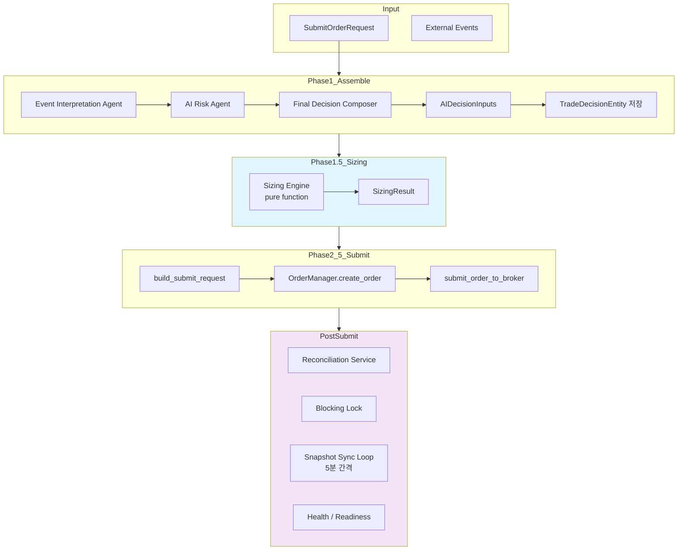

# Paper Trading Loop Validation — Plan

> **목적**: KIS paper 환경에서 실제 운영 루프를 반복 가능하게 검증하는 기반을 완성한다.
> live canary로 바로 가지 않고, paper에서 충분한 검증을 마친 후 live로 전환한다.
>
> **상태**: 구현 완료 (Gap 5 사전 작업 → Paper Trading Loop Validation으로 승격)
>
> **사용자 피드백 반영**:
> 1. **Stale Snapshot 차단 위치**: submit 단계(Phase 5)에서 차단, assemble은 정상 실행
> 2. **Replay 검증 초점**: broker 결과 재현이 아닌 동일 입력→동일 sizing/SubmitOrderRequest 결정론적 검증
> 3. **단발 vs 반복 실행 분리**: `run_orchestrator_once.py`는 단발 유지, 반복은 `verify_paper_loop.py` 전담
> 4. **Go/No-Go 조건 판정 방법**: 각 조건별 테스트/스크립트/health signal 매핑
---

## 1. Paper Trading Loop Inventory

### 현재 충족된 요소

| 영역 | 상태 | 상세 |
|------|------|------|
| **Decision** | ✅ 완료 | `assemble()` — EI→AR→FDC 3-agent chain, `AIDecisionInputs` contract, `AssembledContext` with position/cash/risk snapshots. `TradeDecisionEntity` persistence. Decision context ↔ order traceability |
| **Sizing** | ✅ 완료 | Phase 1.5: position-aware/config-driven deterministic sizing. `calculate_sizing()` 8-step pure function. Cash/concentration/bounds/lot-size constraints |
| **Submit** | ✅ 완료 | `assemble_and_submit()` 5-phase pipeline. `OrderManager` state machine (DRAFT→VALIDATED→PENDING_SUBMIT→SUBMITTED). `submit_order_to_broker()` with blocking lock check. Broker adapter protocol. 7 E2E scenarios verified |
| **Reconciliation** | ✅ 완료 | `ReconciliationService` — blocking lock acquire/release/check, unknown state resolution via `resolve_unknown_state()` and `resolve_and_mark()`. `transition_to_authoritative()` for broker inquiry results |
| **Snapshot Sync** | ✅ 완료 | `run_snapshot_sync_loop.py` scheduler (5-min interval). `sync_all_accounts()` auto-discover. Broker-agnostic `SnapshotFetchProvider`. Execution history (`SnapshotSyncRunEntity`). Freshness/health check. Grace period |
| **Health / Readiness** | ✅ 완료 | `GET /health` with snapshot freshness fields. `GET /health/readyz` with stale-sync→degraded policy. Startup grace period |
| **Observability** | ✅ 완료 | Inspection API (orders, decisions, contexts, agent runs, audit logs). Admin UI (read-only dashboard). `AgentRunRecorder`. Audit log. Order state events |
| **CLI Entry Points** | ✅ 완료 | `scripts/run_orchestrator_once.py --submit`. `scripts/run_snapshot_sync_loop.py`. `scripts/sync_snapshots.py` |
| **Test Coverage** | ✅ 완료 | 444+ service tests. 7 E2E safe order path tests. 37 sizing engine tests. 22 pipeline tests. Paper loop smoke tests (in-memory + Postgres). KIS paper smoke tests. AI runtime smoke tests. Three-agent chain smoke tests |

### 부족한 요소

| 영역 | 상태 | 격차 |
|------|------|------|
| **Event Ingestion** | ❌ 미착수 | External event 데이터 수집 파이프라인 없음. `ExternalEventEntity` 저장소는 있으나 주기적 수집 루프 없음. Market data ingestion 없음 |
| **Continuous Decision Loop** | ❌ 미착수 | `run_orchestrator_once.py`는 1회 실행 전용. 주기적(or event-driven) orchestrator 루프 없음 |
| **Fill Sync / Post-Submit Update** | ❌ 미착수 | 주문 제출 후 broker로부터 fill 상태를 주기적으로 polling하는 루틴 없음. `reconciliation_service.resolve_unknown_state()`는 수동 트리거 전용 |
| **Position/Cash Refresh After Fill** | ❌ 미착수 | Fill 발생 후 position snapshot/cash balance snapshot 자동 갱신 경로 없음. Snapshot sync loop와 decision pipeline이 분리되어 있음 |
| **PnL Calculation** | ❌ 미착수 | Paper PnL 계산 로직 없음. 체결 데이터는 저장되나(PositionSnapshot / FillEvent), 수익률 계산 경로 없음 |
| **Replay / Backtest** | ❌ 미착수 | 저장된 decision context/agent run으로 재실행하는 replay 엔진 없음. Historical backtest 없음 |
| **Paper Go/No-Go Criteria** | ❌ 미착수 | Paper 운영 충족 조건 문서화되지 않음 |
| **User Integration Test Scenarios** | △ 부분적 | E2E safe order path 테스트(7개)는 있으나 "사용자 시나리오" 관점으로 패키징되지 않음 |

---

## 2. 사용자 통합테스트 시나리오 (5개)

### Scenario 1: 정상 진입 승인 → 제출 완료
```text
Given:  account has sufficient cash, no blocking lock
When:   submit request with BUY decision
Then:   pipeline returns SUBMITTED
        order status = SUBMITTED
        broker called exactly once
        trade_decision_id present
        decision_context_id present
        audit log contains order.create + status changes
        sizing constraints logged (if applied)
```

### Scenario 2: HOLD/WATCH → 미제출 (SKIPPED)
```text
Given:  FDC agent returns HOLD or WATCH decision_type
When:   submit request
Then:   pipeline returns SKIPPED
        no order created
        broker NOT called
        no blocking lock acquired
```

### Scenario 3: Uncertain Response → RECONCILE_REQUIRED + Lock
```text
Given:  broker returns uncertain=True (timeout / missing broker_order_id)
When:   submit request
Then:   pipeline returns RECONCILE_REQUIRED
        order status = RECONCILE_REQUIRED
        blocking lock acquired
        second submit attempt blocked (broker NOT called)
        lock persists until resolved
```

### Scenario 4: Stale Snapshot / Health Degraded → Submit 차단 (IMPLEMENTED)
```text
Given:  snapshot_sync_runs의 가장 최근 completed run이
        stale_threshold_seconds(기본 900s=15분)보다 오래됨
        또는 snapshot_sync_runs가 비어 있음 (no_history)
When:   submit request (BUY, APPROVE)
Then:   pipeline 차단 at Phase 4c (Phase 5 직전)
        assemble()는 정상 실행 (snapshot staleness와 무관)
        결과: SubmitResult(status="SKIPPED", error_phase="stale_snapshot")
        broker.submit_order() 호출되지 않음
        GuardrailEvaluationEntity가 STALE_SNAPSHOT blocking_rule_code로 기록됨
```

> **차단 위치**: **Phase 4c** — Phase 4b(VALIDATED→PENDING_SUBMIT) 직후,
> Phase 5(submit to broker) 직전.
>
> **no_history 정책**: snapshot_sync_runs이 비어 있으면 is_stale=True로 간주하여
> 동일하게 차단한다. 이는 초기 구동 시 snapshot sync가 한 번도 실행되지 않은
> 상태에서 허위 주문이 발생하는 것을 방지하기 위한 안전장치.
>
> **Freshness source 한계**: 현재 freshness는 run-level global summary 기준.
> account-level freshness(position_snapshot.captured_at / cash_balance_snapshot.snapshot_at
> per account)는 추후 개선 필요.

### Scenario 5: Duplicate Lock + 재시도 차단
```text
Given:  first call returns uncertain → lock created
        second call with same account/symbol/side
When:   submit request again
Then:   pipeline returns RECONCILE_REQUIRED (status_reason_code = "BLOCKED")
        broker NOT called (call_count unchanged)
        lock still in place
```

---

## 3. Replay / Backtest 접근 방식

### 3.1 Replay-Style 검증 (우선)

지금 단계에서는 full historical backtest engine보다 **저장된 decision context 기반 replay**를 우선한다.

**원리**:
1. `assemble_and_submit()` 실행 시 모든 입력 상태가 저장됨
   - `TradeDecisionEntity` — decision_type, side, quantity, price, confidence, reason_codes
   - `AgentRunEntity` — 각 agent의 structured output
   - `OrderRequestEntity` — 실제 제출된 주문
   - `SubmitResult` — 최종 결과 (status, error 등)
2. 동일 입력으로 재실행 시 동일 결과가 나오는지 검증

**재현 조건**:
- 같은 `SubmitOrderRequest`
- 같은 `AssembledContext` (position/cash/risk snapshot + config version)
- 같은 agent output (stub agent로 대체 가능)
- deterministic backend engine (sizing은 이미 pure function)

**Replay 검증 테스트 구조**:
```python
# Given: saved input context (from DB or fixture)
request = saved_submit_request
snapshots = saved_position_snapshot, saved_cash_snapshot
config = saved_config_version
agent_output = saved_fdc_output  # replay mode: use saved output, skip real LLM

# When: re-run with same inputs
result = await orchestrator.assemble_and_submit(request, ...)

# Then: deterministic backend must produce same result
assert result.status == saved_result.status
assert result.order.requested_quantity == saved_order.requested_quantity
```

### 3.2 Backtest 확장 방향 (후속)

Full backtest는 아래가 준비된 후 검토:
- Market data ingestion (feature snapshot 저장)
- 전략별 score 계산 경로
- Fill simulator
- PnL 계산기

---

## 4. Paper Go/No-Go 기준

### Paper → Live Canary 전환 조건

| # | 조건 | 판정 방법 (테스트/스크립트/health signal) | 필수 |
|---|------|------------------------------------------|------|
| 1 | Safe order path 전 시나리오 통과 (7개) | `pytest tests/services/test_safe_order_path_e2e.py -v` → 7/7 pass | ✅ 현재 통과 |
| 2 | Sizing engine 테스트 전부 통과 (37개) | `pytest tests/services/test_sizing_engine.py -v` → 37/37 pass | ✅ 현재 통과 |
| 3 | Pipeline 테스트 전부 통과 (22개) | `pytest tests/services/test_decision_submit_pipeline.py -v` → 22/22 pass | ✅ 현재 통과 |
| 4 | 전체 서비스 테스트 회귀 없음 | `pytest tests/services/ -v` → pre-existing failure 외 신규 실패 0 | ✅ 444/460 통과 (14 error pre-existing) |
| 5 | Snapshot freshness 정상 (stale 없음) | `GET /health/readyz` → `ok`; `GET /health` → `snapshot_sync.freshness.status==fresh`; `SnapshotSyncRunRepository.get_sync_health_summary()` → stale_count==0 | ✅ 스케줄러 실행 시 |
| 6 | Reconciliation degrade 없는 상태 | `InMemoryReconciliationRepository.list_all_active_locks()` → empty; admin UI ReconciliationView → lock count 0 | 검증 필요 |
| 7 | Snapshot sync 스케줄러 정상 작동 | `run_snapshot_sync_loop.py` 1회 이상 성공; `GET /snapshot-sync-runs/summary` → last_run_success==true | 검증 필요 |
| 8 | Paper submit smoke 통과 (KIS paper) | `pytest tests/smoke/test_kis_paper_ai_runtime_smoke.py::TestGuardedPaperSubmit -v` → C3 pass (requires `ENABLE_KIS_PAPER_SUBMIT_SMOKE=true`) | 환경 의존 |
| 9 | 사용자 통합테스트 5개 시나리오 통과 | `pytest tests/services/test_paper_trading_scenarios.py -v` → 6/6 pass | ✅ 구현 완료 (Scenario 4 stale_snapshot guard 포함) |
| 10 | Duplicate / unknown-state 처리 검증 완료 | `pytest tests/services/test_safe_order_path_e2e.py::TestSafeOrderPathE2E::test_e2e_duplicate_client_order_id_returns_error -v` + `test_safe_order_path_e2e.py::TestSafeOrderPathE2E::test_e2e_requires_reconciliation -v` | ✅ 현재 통과 |
| **NEW** | Replay 결정론적 검증 | `pytest tests/services/test_decision_replay.py -v` → 8/8 pass | ✅ 신규 구현 완료 |
| **NEW** | Paper loop verification 스크립트 정상 실행 | `python -m scripts.verify_paper_loop --count 1` → exit 0 | ✅ 신규 구현 완료 |

### No-Go 조건

| 조건 | 조치 |
|------|------|
| Safe order path 테스트 실패 | 원인 분석 및 수정 후 재검증 |
| Reconciliation lock 미해결 상태 | 수동 해결 또는 자동 해소 정책 정의 |
| Snapshot sync 연속 실패 | 브로커 credential/network 점검 |
| Pipeline 오류율 > 5% | 원인 분석 및 핫픽스 |
| Audit log 누락 | 저장소 적합성 점검 |

---

## 5. 추가/수정할 테스트 및 스크립트

### 5.1 신규 통합 테스트: [`tests/services/test_paper_trading_scenarios.py`](tests/services/test_paper_trading_scenarios.py)

5개 사용자 시나리오를 자동화. 기존 fixture(`test_safe_order_path_e2e.py`의 `_ApproveFDCAgent`, `_make_request` 등) 재사용.

```python
# Scenario 1: 정상 진입 → SUBMITTED
async def test_scenario_1_happy_path_submitted(
    service, order_manager, mock_broker, sample_request
): ...

# Scenario 2: HOLD → SKIPPED
async def test_scenario_2_hold_skipped(
    service, order_manager, mock_broker, sample_request
): ...

# Scenario 3: Uncertain → RECONCILE_REQUIRED + lock
async def test_scenario_3_uncertain_reconcile(
    service, order_manager, reconciliation_service, mock_broker, sample_request
): ...

# Scenario 4: Stale snapshot guard (추후 harden 필요)
# 현재는 snapshot staleness 검사 미구현 → PENDING

# Scenario 5: Duplicate lock → 차단
async def test_scenario_5_blocking_lock_blocks_retry(
    repos, reconciliation_service, order_manager, mock_broker
): ...
```

### 5.2 신규 Replay 테스트: [`tests/services/test_decision_replay.py`](tests/services/test_decision_replay.py)

```python
# Given: saved decision input/output from fixture
# When: re-run orchestrator with same inputs and stub agents
# Then: same results (deterministic backend consistency)
async def test_replay_produces_same_sizing_result(): ...
async def test_replay_produces_same_submit_result(): ...
```

### 5.3 Smoke Script 개선: [`scripts/run_orchestrator_once.py`](scripts/run_orchestrator_once.py)

> **설계 원칙**: 단발 실행 유지. `--interval` 등 반복 실행 옵션 **없음**.
> 반복 실행이 필요한 경우 [`scripts/verify_paper_loop.py`](scripts/verify_paper_loop.py) 사용.

- `--dry-run` 플래그 추가: broker submit 없이 sizing까지 실행 (assemble + sizing)
- 결과 JSON 출력 옵션 (`--output json`): machine-readable JSON 출력
- 종료 코드 개선 (성공 0, 실패 1): `SUBMITTED`/`SKIPPED` → 0, `ERROR`/`REJECTED` → 1
- `asyncio.run(main())` 반환값 `sys.exit()` 연결

### 5.4 Paper Loop Verification Script: [`scripts/verify_paper_loop.py`](scripts/verify_paper_loop.py) (신규)

사용자가 paper 환경에서 반복 검증할 수 있는 단일 진입점:

```bash
# Basic verification (assemble only)
python -m scripts.verify_paper_loop

# Full pipeline verification (assemble → sizing → submit)
python -m scripts.verify_paper_loop --submit

# Continuous verification (poll every N seconds)
python -m scripts.verify_paper_loop --interval 60 --count 5

# JSON output for automated analysis
python -m scripts.verify_paper_loop --submit --output json
```

**검증 항목**:
1. DB 연결 및 seed 데이터 존재 확인
2. `assemble()` 정상 실행 (3-agent chain)
3. sizing engine 정상 작동
4. (선택) `assemble_and_submit()` 정상 실행
5. 결과 요약 출력

---

## 6. BACKLOG.md 재정렬

### 변경 사항

1. **Gap 15 (`E2E / Canary 전환 기준 정립`)** → `🔄 검토 중`으로 변경 (이 plan으로 승격 예정)
2. **신규 항목 추가**:
   - **Paper Trading Loop 연속 실행**: 주기적 orchestrator loop + fill sync + position/cash refresh
   - **사용자 통합테스트 시나리오 자동화**: 5개 시나리오 통합 테스트
   - **Replay-Style 검증 엔진**: 결정론적 재현 검증
3. **우선순위 조정**:
   - Paper trading loop completion → Gap 5보다 앞에 배치
   - User integration validation → Gap 5와 병행
   - Replay/backtest → Gap 5 다음

---

## 7. 실행 단계

| 단계 | 내용 | 산출물 |
|------|------|--------|
| **Step 1** | 사용자 통합테스트 5개 시나리오 자동화 | [`test_paper_trading_scenarios.py`](tests/services/test_paper_trading_scenarios.py) |
| **Step 2** | Replay 검증 테스트 | [`test_decision_replay.py`](tests/services/test_decision_replay.py) |
| **Step 3** | `run_orchestrator_once.py` 개선 (`--interval`, `--dry-run`, `--output json`) | [`run_orchestrator_once.py`](scripts/run_orchestrator_once.py) 수정 |
| **Step 4** | `verify_paper_loop.py` 신규 스크립트 | [`verify_paper_loop.py`](scripts/verify_paper_loop.py) |
| **Step 5** | `BACKLOG.md` 재정렬 및 우선순위 조정 | BACKLOG.md |

---

## 8. Mermaid 다이어그램: Paper Trading Loop



---

## 9. 변경 파일 목록 (예상)

| 파일 | 변경 유형 | 설명 |
|------|----------|------|
| `tests/services/test_paper_trading_scenarios.py` | **신규** | 5개 사용자 시나리오 통합 테스트 |
| `tests/services/test_decision_replay.py` | **신규** | Replay 결정론적 검증 테스트 |
| `scripts/run_orchestrator_once.py` | **수정** | `--interval`, `--dry-run`, `--output json` 옵션 추가 |
| `scripts/verify_paper_loop.py` | **신규** | Paper loop verification 진입점 |
| `plans/BACKLOG.md` | **수정** | 우선순위 재정렬 |

---

## 10. Live Canary 이전 필수 항목 (3개)

1. **Paper Trading Loop 연속 실행 검증** — 주기적 orchestrator loop가 1회성 `run_orchestrator_once.py` 수준을 넘어 스케줄러/데몬 수준으로 연속 실행 가능해야 함
2. **사용자 통합테스트 5개 시나리오 자동 통과** — 사람이 수동 확인하지 않고 CI에서 자동 검증 가능해야 함
3. **Snapshot Sync + Decision Pipeline 간 상태 일관성 검증** — snapshot staleness가 decision/submit에 미치는 영향이 명확히 정의되고 테스트되어야 함
