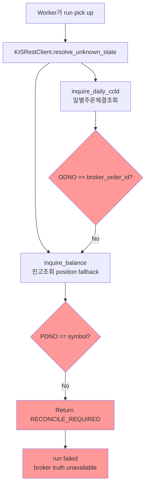
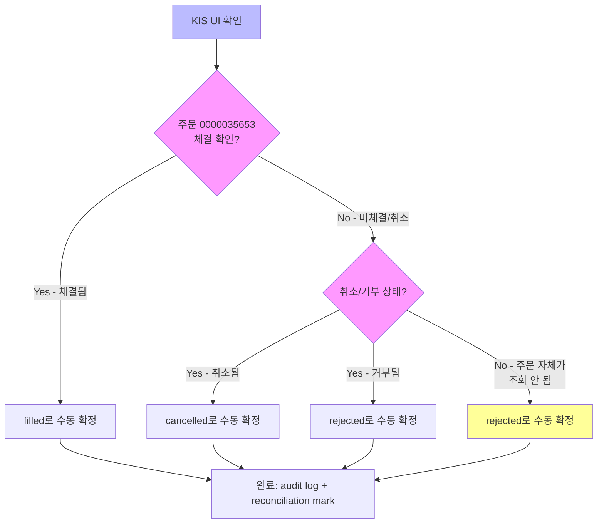
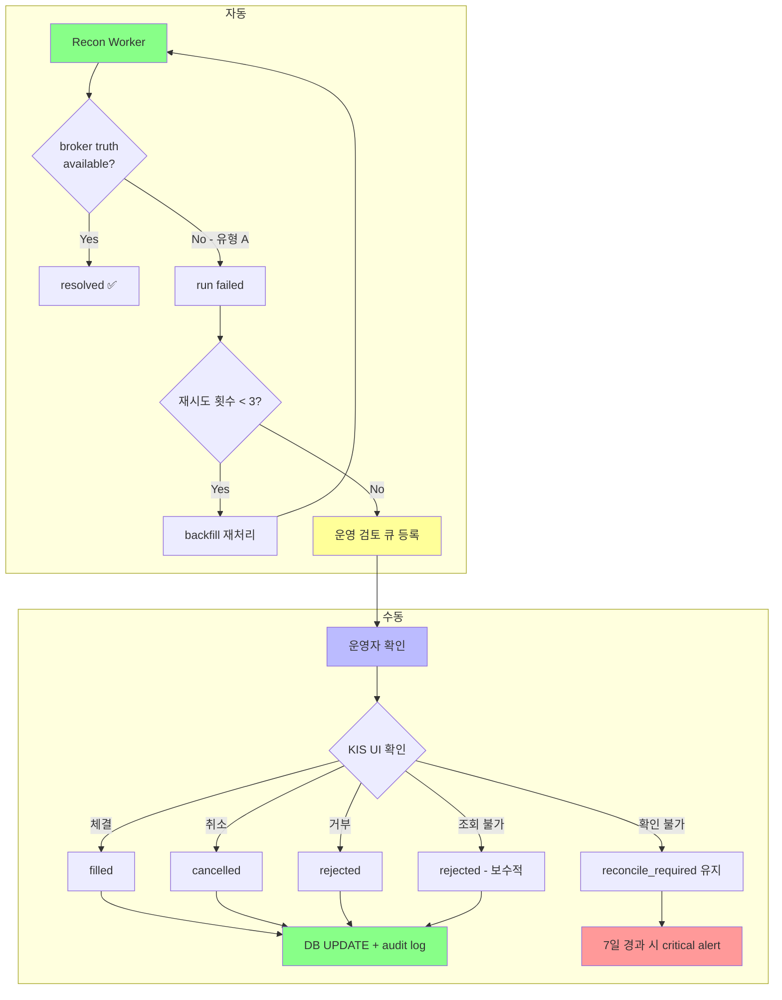
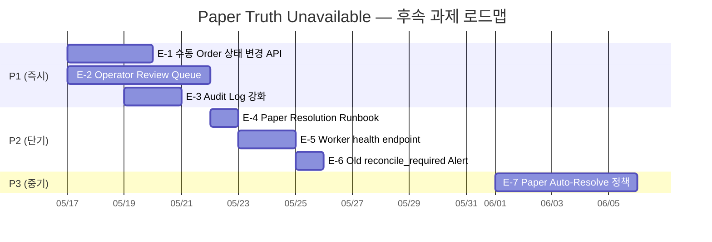

# Paper Truth Unavailable — 수동 해소 절차 및 운영 정책

**Date:** 2026-05-16  
**Author:** Roo (Architect)  
**Status:** Draft — 검토 대기

---

## 개요

Paper 환경(KIS 모의투자)은 **Submit 승인 + broker_native_order_id 발급**까지는 정상 동작하지만,  
이후 `inquire_daily_ccld`(일별주문체결조회) 및 `inquire_balance`(잔고조회) API에서 해당 주문을 찾지 못하는 경우가 발생한다.

이는 KIS Paper Sandbox의 API 커버리지 한계로, **자동화된 reconciliation worker가 broker truth를 확인할 수 없어**  
주문이 `reconcile_required` 상태에 영구 잔류하게 되는 현상을 의미한다.

이 문서는:
1. `001230`(동국제강) 사례를 분석하고
2. Paper truth unavailable의 유형을 분류하며
3. 운영자가 수동으로 해소하는 절차를 정의하고
4. 향후 유사 사례를 대비한 운영 정책을 제안한다.

---

## 1. 사례 분석: Order 001230 (동국제강)

### 1.1 타임라인

| 시간 (UTC+9 KST) | 이벤트 | 상세 |
|---|---|---|
| 2026-05-15 14:31:04 | 주문 생성 | `order_request_id: 400353e9-...` |
| 2026-05-15 14:31:21 | `draft → validated` | 내부 검증 통과 |
| 2026-05-15 14:31:21 | `validated → pending_submit` | Submit 대기열 등록 |
| 2026-05-15 14:31:24 | `pending_submit → submitted` | **KIS paper submit 성공** → `broker_native_order_id: 0000035653` 발급 |
| 2026-05-15 14:34:21 | `submitted → reconcile_required` | Broker truth 미확인 → reconciliation 대기 |
| 2026-05-16 19:47:07 | Recon run 1 | `e43955a2-...` → `failed` (TypeError, Phase 25 버그) |
| 2026-05-16 20:04:00 | Recon run 2 | `d68ec501-...` → `failed` (TypeError, 구버전 worker) |
| 2026-05-16 20:07:12 | Recon run 3 | `1453d5a2-...` → `failed` (**hotfix 적용 후, broker truth unavailable**) |

### 1.2 현재 상태

| 필드 | 값 |
|---|---|
| `order_request_id` | `400353e9-9c09-49c9-b4cc-a03ac50474b1` |
| `instrument` | `001230` (동국제강) |
| `side` | `buy` |
| `requested_quantity` | 10주 |
| `requested_price` | 11,400원 |
| `status` | `reconcile_required` |
| `broker_native_order_id` | `0000035653` |
| `broker_status` | `reconcile_required` |
| `environment` | `paper` (Entrypoint Paper, a44a02d1-...) |
| `submitted_at` | `null` (DB 미기록 — 버그 추정) |
| `updated_at` | 2026-05-15 14:34:13 |

### 1.3 자동 해소 불가 원인



**근본 원인:** KIS Paper Sandbox는 `inquire_daily_ccld` API에서 paper submit된 주문을 반환하지 않음. 또한 `inquire_balance`에서도 해당 포지션이 잔고에 존재하지 않으면 매칭 실패.

---

## 2. Paper Truth Unavailable 분류 기준

### 분류 체계

```
A. Submit 성공 + broker_native_order_id 존재 + inquiry 무응답
B. Submit 결과 ambiguous + broker_native_order_id 없음
C. Inquiry path 자체 오류 (rate-limit, network, API 변경)
D. Worker/Adapter 버그
```

### 상세 정의

| 유형 | 증상 | broker_native_order_id | inquiry API 응답 | 원인 | 조치 |
|------|------|----------------------|-----------------|------|------|
| **A** | Submit 성공, native ID 발급, inquiry에서 조회 안 됨 | ✅ 존재 | `RECONCILE_REQUIRED` (404) | Paper sandbox API 커버리지 한계 | **수동 확인 후 terminal 상태로 수동 전이** |
| **B** | Submit 자체가 ambiguous (timeout / partial failure) | ❌ 없음 | N/A | 네트워크/API 장애 | 재시도 또는 cancel |
| **C** | Inquiry API 호출 실패 (rate-limit, auth, network) | ✅/❌ | `BudgetExhaustedError`, `BrokerError` | 인프라/정책 문제 | 재시도 (자동) |
| **D** | Worker가 잘못된 인자로 adapter 호출 | ✅/❌ | TypeError / 잘못된 응답 | **코드 버그** | **코드 수정** (Phase 25에서 해결) |

### Order 001230 분류: **유형 A**

```
Submit 성공:     ✅ broker_native_order_id = 0000035653 발급
inquiry 무응답:  ✅ inquire_daily_ccld + inquire_balance 모두 조회 실패
worker 버그:     ❌ (Phase 25 hotfix로 해결, D 유형 아님)
inquiry 오류:    ❌ (HTTP 200 정상 응답, C 유형 아님)
```

---

## 3. 수동 해소 절차

### 3.1 운영자 확인 절차

#### Step 1: KIS UI/모의투자 화면에서 주문 상태 확인

| 확인 항목 | 방법 | 기대 결과 |
|-----------|------|-----------|
| KIS 모의투자 로그인 | https://securities.koreainvestment.com → 모의투자 | 계정 접속 |
| 주문번호 `0000035653` 조회 | 주문조회/체결조회 화면 | 주문 존재 여부 확인 |
| 동국제강 `001230` 포지션 | 잔고조회 화면 | 보유 수량 확인 |

#### Step 2: 확인 결과별 조치 분기



#### Step 3: 상태 확정 기준

| KIS UI 확인 결과 | 최종 상태 | 근거 |
|---|---|---|
| 체결 확인 (수량/가격 일치) | `filled` | 실제 체결이 발생했으므로 FILLED가 truth |
| 주문 취소 확인 | `cancelled` | Broker가 취소한 상태 |
| 주문 거부/실패 확인 | `rejected` | Broker가 접수 거부 |
| **주문 자체 조회 불가** | **`rejected`** | Paper sandbox에서 주문이 수명을 다했거나 유효하지 않은 상태. `rejected`가 가장 보수적인 선택 |
| 상태 확인 불가 (UI 접속 불가 등) | `reconcile_required` 유지 | 확정 불가 시 현재 상태 유지 |

### 3.2 수동 상태 변경 실행

#### 방법 A: DB 직접 UPDATE (긴급 운영용)

```sql
-- 1. order_requests.status 변경
UPDATE order_requests
SET status = 'filled',  -- 또는 'cancelled', 'rejected'
    status_reason_code = 'manual_resolution',
    status_reason_message = '수동 해소 - KIS UI 확인 결과 체결 확인 (operator: <이름>, 확인시각: 2026-05-16T14:00+09:00)',
    updated_at = NOW()
WHERE order_request_id = '400353e9-9c09-49c9-b4cc-a03ac50474b1';

-- 2. broker_orders.broker_status 동기화 (선택)
UPDATE broker_orders
SET broker_status = 'filled',  -- 최종 상태와 동일하게
    last_synced_at = NOW()
WHERE order_request_id = '400353e9-9c09-49c9-b4cc-a03ac50474b1';
```

#### 방법 B: Reconciliation run 수동 마크 (향후 API 구현 시)

```python
# 개념 코드 — 현재는 API endpoint 없음
await reconciliation_service.mark_resolved(
    reconciliation_run_id=UUID("1453d5a2-..."),
    summary_json={
        "resolved_via": "manual_resolution",
        "manual_status": "filled",
        "operator": "<name>",
        "evidence": "KIS UI 확인 - 주문 0000035653 체결됨",
        "confirmed_at": "2026-05-16T14:00:00+09:00",
    }
)
```

### 3.3 필수 메타데이터

수동 상태 변경 시 반드시 기록해야 할 메타데이터:

| 항목 | 필수 | 예시 |
|------|------|------|
| `operator` (수행자) | ✅ | `"ops-team-member"` |
| `reason` (변경 사유) | ✅ | `"KIS paper broker truth unavailable - 수동 확인 완료"` |
| `evidence_source` (증거 출처) | ✅ | `"KIS 모의투자 UI - 주문조회 화면"` |
| `confirmed_at` (확인 시각 KST) | ✅ | `"2026-05-16T14:00:00+09:00"` |
| `previous_status` (변경 전 상태) | ✅ | `"reconcile_required"` |
| `new_status` (변경 후 상태) | ✅ | `"filled"` |

---

## 4. Paper Truth Unavailable 운영 정책 초안

### 4.1 핵심 원칙

1. **자동 terminal 전이 금지** — Paper에서 broker truth unavailable 상태가 일정 횟수 이상 반복되어도, worker가 임의로 `rejected`/`cancelled`로 자동 전이하지 않는다.
2. **Operator Review Queue로 승격** — N회 이상 재시도 후에도 truth unavailable이면 운영자 검토 대상으로 식별한다.
3. **수동 확인 결과만 terminal 상태로 전이** — KIS UI 또는 다른 증빙을 통해 실제 상태를 확인한 경우에만 상태를 변경한다.
4. **Audit trail 의무화** — 모든 수동 상태 변경은 operator, reason, evidence source, timestamp를 반드시 기록한다.

### 4.2 정책 상세

#### 정책 1: 재시도 한도

| 항목 | 값 |
|------|-----|
| 동일 주문 최대 재시도 횟수 | 3회 |
| 재시도 간격 | Worker interval과 동일 (현재 60초) |
| 한도 초과 시 | `reconcile_required` 상태 유지, **운영 알림 발생** |
| 운영 알림 레벨 | `warning` — "Order {id} unresolved after {N} attempts" |

#### 정책 2: 운영 검토 기준

| 조건 | 조치 |
|------|------|
| 재시도 3회 초과 + truth unavailable | 운영 검토 큐에 등록 |
| 운영 검토 큐 미등록 기간 > 24시간 | `warning` 알림 에스컬레이션 |
| 운영 검토 큐 등록 후 7일 경과 | `critical` 알림 — 주간 ops 리뷰 |

#### 정책 3: 수동 해소 기준

| KIS 확인 결과 | 권장 조치 | 우선순위 |
|---|---|---|
| 체결 확인 | `filled` | P0 |
| 취소 확인 | `cancelled` | P0 |
| 거부 확인 | `rejected` | P0 |
| 조회 불가 | `rejected` | P1 (추가 확인 권장) |
| 확인 불가 | `reconcile_required` 유지 | P2 |

#### 정책 4: SLA 기준

| 시간 경과 | 조치 |
|-----------|------|
| 장 종료 후 2시간 (20:00 KST) | unresolved order 목록 ops 리뷰 |
| 다음 장 시작 전 (08:00 KST) | 전일 unresolved 건 ops 체크리스트 |
| 24시간 경과 | 운영자 직접 통보 |
| 7일 경과 | 주간 ops 리뷰에서 에스컬레이션 |

### 4.3 Mermaid: 운영 정책 흐름



---

## 5. 후속 제품/엔지니어링 과제

### 5.1 과제 목록

| ID | 과제 | 설명 | 우선순위 | 영향 범위 |
|----|------|------|----------|-----------|
| **E-1** | 수동 Order 상태 변경 API | Admin UI에서 운영자가 order 상태를 수정할 수 있는 `PUT /orders/{id}/status` endpoint | **P1** | API, Admin UI, Schemas |
| **E-2** | Operator Review Queue | `reconcile_required` 상태가 일정 기준 이상인 주문을 ops 리뷰 큐로 승격 | **P1** | Service, DB, API, Admin UI |
| **E-3** | 수동 해소 Audit Log 강화 | 상태 변경 시 operator, reason, evidence source, timestamp를 구조화된 audit log로 기록 | **P1** | Service, Repository |
| **E-4** | Paper 전용 Resolution Runbook | Paper 환경에서 truth unavailable 발생 시 운영자가 따라야 할 체크리스트 문서화 | **P2** | 문서 |
| **E-5** | Recon Worker health endpoint | `/health` heartbeat endpoint 추가로 worker 생존성 모니터링 | **P2** | Worker, API |
| **E-6** | Old `reconcile_required` Alert | 24시간 이상 unresolved된 주문에 대한 ops 알림 | **P2** | Alert rules |
| **E-7** | Paper 전용 Auto-Resolve 정책 | 특정 조건에서 paper 주문을 자동 `rejected` 처리 (신중 검토 필요) | **P3** | Service, Policy |

### 5.2 권장 우선순위



### 5.3 E-1 상세: 수동 Order 상태 변경 API

```python
# PUT /orders/{order_request_id}/status
# Request body:
{
    "new_status": "filled",  # filled | cancelled | rejected
    "reason_code": "manual_resolution",
    "reason_message": "KIS UI 확인 - 주문 0000035653 체결 확인",
    "evidence": {
        "source": "KIS 모의투자 UI",
        "operator": "ops-team-member",
        "confirmed_at": "2026-05-16T14:00:00+09:00",
        "broker_screen_capture_uri": null  # optional
    }
}

# Response: OrderDetail
# Audit log: order_state_events 테이블에 event_source='manual_resolution' 기록
```

### 5.4 E-2 상세: Operator Review Queue

```
새 테이블 또는 서비스 로직:

Criteria for auto-promotion to review queue:
- status = 'reconcile_required'
- reconciliation_run.status = 'failed' (3회 이상)
- account.environment = 'paper'
- no manual review in progress

Review queue item fields:
- order_request_id
- symbol, side, quantity, price
- broker_native_order_id
- failed_run_count
- first_failed_at
- latest_failed_at
- review_status: pending | in_progress | resolved
- assigned_operator (nullable)
- resolution (nullable)
- resolved_at (nullable)
```

---

## 6. Order 001230 권장 조치

### 당장 할 수 있는 것

현재 시스템에는 수동 상태 변경 API가 없으므로, **DB 직접 UPDATE**가 유일한 방법입니다.

#### 권장: `rejected`로 상태 변경

```sql
-- 2026-05-16 현재, 주문 0000035653이 KIS paper API에서 조회되지 않음.
-- 가장 보수적인 선택은 rejected (체결 확인 불가).

UPDATE order_requests
SET status = 'rejected',
    status_reason_code = 'manual_resolution',
    status_reason_message = '수동 해소: KIS paper broker truth unavailable - '
                            'inquire_daily_ccld 및 inquire_balance에서 주문 0000035653 조회 불가. '
                            'Paper sandbox API 커버리지 한계로 rejected 처리. '
                            '(operator: ops-review, confirmed_at: 2026-05-16 KST)',
    updated_at = NOW()
WHERE order_request_id = '400353e9-9c09-49c9-b4cc-a03ac50474b1';
```

> **참고:** 만약 KIS 모의투자 UI에 로그인하여 `0000035653` 주문의 실제 상태를 확인할 수 있다면,  
> 확인 결과에 따라 `filled` 또는 `cancelled`로 변경하는 것이 더 정확합니다.

---

## 7. 요약

### 001230 수동 해소 절차 요약

1. KIS 모의투자 UI에서 주문 `0000035653` 실제 상태 확인
2. 확인 결과에 따라 `filled` / `cancelled` / `rejected` 결정
3. DB 직접 UPDATE (수동 API 없음)
4. `status_reason_message`에 operator, evidence, timestamp 기록

### 001230 사례 분류

**유형 A** — Submit 성공 + broker_native_order_id 존재 + inquiry 무응답

### 운영 정책 핵심 3줄 요약

1. **Paper truth unavailable 시 자동 terminal 전이 금지** — 무조건 수동 확인 선행
2. **3회 재시도 초과 시 운영 검토 큐로 승격** — 자동 재시도 루프 방지
3. **수동 상태 변경 시 operator/reason/evidence 의무 기록** — 감사 가능한 운영

### 다음 제품/엔지니어링 우선순위 3개

| 순위 | 과제 | 기대 효과 |
|------|------|-----------|
| **P1** | E-1: 수동 Order 상태 변경 API | 운영자가 DB 직접 수정 없이 상태 변경 가능 |
| **P1** | E-2: Operator Review Queue | unresolved 주문을 체계적으로 추적/할당 |
| **P1** | E-3: Audit Log 강화 | 모든 수동 조작에 감사 추적 보장 |
