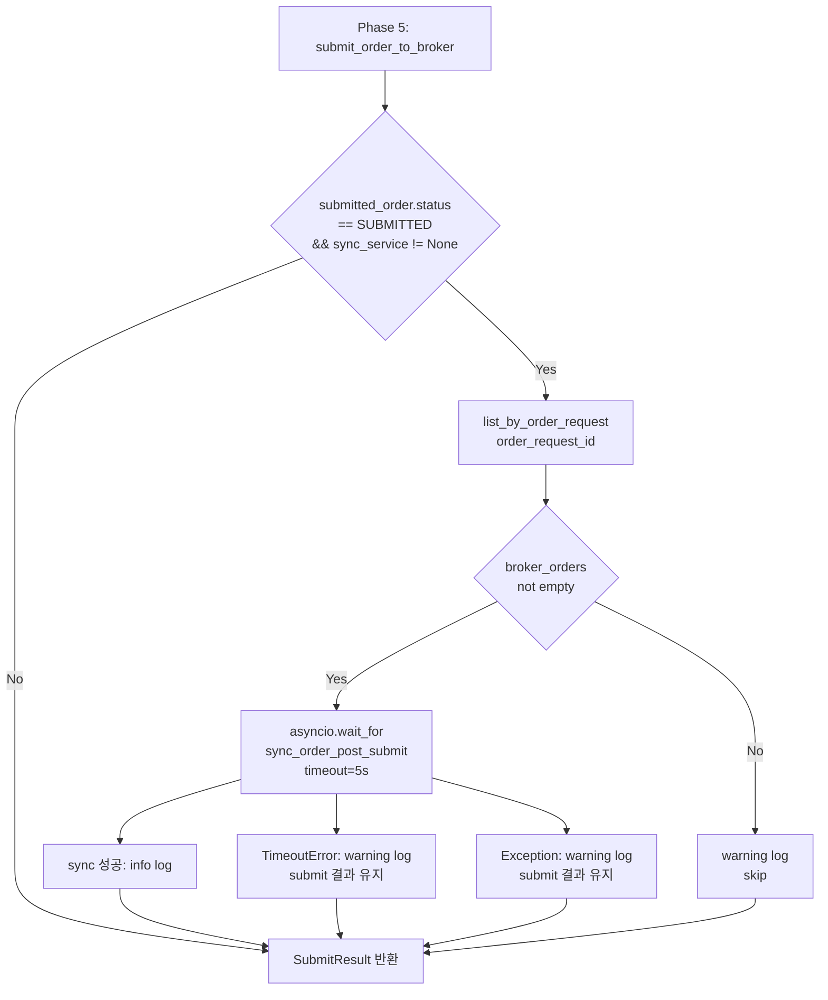

# Pipeline Phase 5.5 — Submit 직후 첫 1회 Post-Submit Sync

> **목적**: `assemble_and_submit()`의 Phase 5 broker submit 직후 `sync_order_post_submit()`를 1회 호출하여, WS event/polling 이전의 submit→first-sync gap을 줄인다.

---

## 1. 호출 조건 (Step 1)

| SubmitResult.status | Phase 5.5 호출? | 이유 |
|---------------------|-----------------|------|
| `SUBMITTED` | **✅ 호출** | broker가 수락했고, BrokerOrderEntity가 생성됨 |
| `RECONCILE_REQUIRED` | **❌ 미호출** | broker 응답 불확실 → ReconciliationService가 담당 |
| `REJECTED` | **❌ 미호출** | terminal state, sync 의미 없음 |
| `ERROR` | **❌ 미호출** | pipeline 자체 실패, sync할 주문 없음 |
| `SKIPPED` | **❌ 미호출** | HOLD/WATCH, order 생성 안 됨 |

**정책 근거:**
- `SUBMITTED`만 sync 대상 — broker가 주문을 정상 접수했고, 첫 상태 확인만 앞당기면 됨
- `RECONCILE_REQUIRED`는 `ReconciliationService`가 담당하므로 OrderSyncService가 관여하지 않음
- `REJECTED`/`ERROR`/`SKIPPED`는 sync가 무의미

---

## 2. Phase 5.5 구현 상세 (Step 2)

### 2.1 `DecisionOrchestratorService.__init__()` 변경

```python
def __init__(
    self,
    repos: RepositoryContainer,
    *,
    stale_threshold_seconds: int = 900,
    score_calculator: ScoreCalculator | None = None,
    event_interpretation_agent: ProviderAIAgent | None = None,
    ai_risk_agent: ProviderAIAgent | None = None,
    final_decision_agent: ProviderAIAgent | None = None,
    agent_recorder: AgentRunRecorder | None = None,
    # --- Phase 5.5 additions ---
    sync_service: OrderSyncService | None = None,
    snapshot_refresh_cb: Callable[[UUID], Awaitable[None]] | None = None,
) -> None:
    ...
    self._sync_service = sync_service
    self._snapshot_refresh_cb = snapshot_refresh_cb
```

- 모두 `None` default → backward compatible 기존 호출자에 영향 없음
- `OrderSyncService` import 추가

### 2.2 `assemble_and_submit()` Phase 5.5 위치

Phase 5 (`submit_order_to_broker()`) 직후, `SubmitResult` 반환 전에 삽입:

```python
# ── Phase 5: submit to broker ──
... (기존 코드, 변경 없음) ...

# ── Phase 5.5: post-submit sync (fire-and-forget with timeout) ──
if (
    final_status == OrderStatus.SUBMITTED
    and self._sync_service is not None
):
    try:
        # Look up the BrokerOrderEntity created by submit_order_to_broker()
        broker_orders = await self._repos.broker_orders.list_by_order_request(
            submitted_order.order_request_id,
        )
        if broker_orders:
            bo = broker_orders[0]  # 첫 번째 (유일한) BrokerOrderEntity
            await asyncio.wait_for(
                self._sync_service.sync_order_post_submit(
                    account_ref=submit_request.account_ref,
                    broker=broker,
                    broker_order_id=bo.broker_order_id,
                    snapshot_refresh_cb=self._snapshot_refresh_cb,
                ),
                timeout=_PHASE55_SYNC_TIMEOUT,
            )
            logger.info(
                "Phase 5.5 sync complete: order_id=%s broker_order_id=%s",
                submitted_order.order_request_id,
                bo.broker_order_id,
            )
    except asyncio.TimeoutError:
        logger.warning(
            "Phase 5.5 sync TIMEOUT (order_id=%s) — submit result preserved",
            submitted_order.order_request_id,
        )
    except Exception as exc:
        logger.warning(
            "Phase 5.5 sync FAILED (order_id=%s): %s — submit result preserved",
            submitted_order.order_request_id,
            exc,
        )

# ── Map final order status to SubmitResult.status ──
... (기존 return 코드, 변경 없음) ...
```

### 2.3 핵심 설계 포인트

| 속성 | 값 | 설명 |
|------|-----|------|
| Timeout | `_PHASE55_SYNC_TIMEOUT = 5` (초) | 무한 대기 방지 |
| 실패 정책 | warning log + continue | submit 결과에 영향 없음 |
| BrokerOrderEntity lookup | `list_by_order_request(order_request_id)` | `submit_order_to_broker()`가 저장한 것 조회 |
| Import 추가 | `asyncio`, `OrderSyncService`, `Callable`, `Awaitable` | |

---

## 3. 결과 Semantics 유지 (Step 3)

- **Phase 5.5 실패 시에도 `SubmitResult.status`는 `"SUBMITTED"` 유지**
- Phase 5.5는 `SubmitResult` 생성 전에 실행되지만, 예외가 발생해도 `SubmitResult` 반환에는 영향 없음
- `SubmitResult` 필드 변경 없음 — `broker_order_id` 추가 불필요

```python
# 기존 return 코드 (변경 없음)
return SubmitResult(
    status=result_status,  # "SUBMITTED" — Phase 5.5 실패와 무관
    intent=intent,
    order=submitted_order,
    trade_decision_id=trade_decision_id,
    decision_context_id=intent.decision_context_id,
)
```

---

## 4. WS/Polling과 공존 검증 (Step 4)

| 경로 | 시점 | Phase 5.5와 관계 |
|------|------|------------------|
| **Phase 5.5** (신규) | submit 직후, 동기 1회 | 첫 상태 확인 가속 |
| **WS-triggered** (BACKLOG #19) | sub-second ~ 수 초 후 | Phase 5.5가 dedup/debounce에 걸려 무시될 가능성 낮음 (시간차) |
| **Polling fallback** (BACKLOG #17) | 30s~60s 후 | Phase 5.5와 충분한 시간차 있음 |

**중복 위험:**
- `sync_order_post_submit()` 내부의 fill dedup / transition safety가 보호
- 동일 주문이 5초 내 Phase 5.5 + WS event로 2회 sync되어도 dedup이 중복 fill을 막음
- chain transition safety (`_ALLOWED_TRANSITIONS`)가 무효 전이 차단

---

## 5. 테스트 계획 (Step 5)

### 5.1 테스트 위치

`tests/services/test_decision_submit_pipeline.py`의 `TestAssembleAndSubmit` 클래스 내 신규 테스트 메서드 추가.
또는 `test_safe_order_path_e2e.py`에 추가 (real broker mock 경로).

**추천: test_safe_order_path_e2e.py에 추가** — Phase 5.5는 실제 `submit_order_to_broker()`를 통해 BrokerOrderEntity가 생성되어야 검증 가능.

### 5.2 테스트 케이스

| # | 테스트 | 방법 | 검증 |
|---|--------|------|------|
| 1 | submit 성공 후 Phase 5.5 sync 호출됨 | `mock_broker.submit_order` → accepted=True, `sync_service.sync_order_post_submit` mock | sync_service가 올바른 broker_order_id로 호출됨 |
| 2 | timeout 시 submit 결과 유지 | `sync_service.sync_order_post_submit` → sleep(10) mock | timeout 후 `SubmitResult.status == "SUBMITTED"` |
| 3 | sync exception 시 submit 결과 유지 | `sync_service.sync_order_post_submit` → raise Exception | 예외 후 `SubmitResult.status == "SUBMITTED"` |
| 4 | REJECTED에서 Phase 5.5 미호출 | broker가 reject 반환 | sync_service 호출되지 않음 |
| 5 | RECONCILE_REQUIRED에서 미호출 | broker가 uncertain 반환 | sync_service 호출되지 않음 |
| 6 | ERROR에서 미호출 | assemble() 실패 | sync_service 호출되지 않음 |
| 7 | sync_service=None에서 미호출 | 기본 service (sync_service=None) | Phase 5.5 skip, 기존 동작 유지 |

### 5.3 Fixture 추가

```python
@pytest.fixture
def mock_sync_service(self) -> MagicMock:
    svc = MagicMock(spec=OrderSyncService)
    svc.sync_order_post_submit = AsyncMock(
        return_value=SyncOrderResult(success=True)
    )
    return svc

@pytest.fixture
def service_with_sync(
    self,
    repos: RepositoryContainer,
    mock_sync_service: MagicMock,
) -> DecisionOrchestratorService:
    return DecisionOrchestratorService(
        repos=repos,
        final_decision_agent=self._ApproveFDCAgent(),
        sync_service=mock_sync_service,
    )
```

---

## 6. 변경 파일 목록

| 파일 | 변경 내용 |
|------|----------|
| `src/agent_trading/services/decision_orchestrator.py` | `__init__()`에 `sync_service`/`snapshot_refresh_cb` param 추가; `assemble_and_submit()`에 Phase 5.5 블록 추가; `_PHASE55_SYNC_TIMEOUT` 상수; `asyncio`/`OrderSyncService`/`Callable`/`Awaitable` import |
| `tests/services/test_safe_order_path_e2e.py` | `mock_sync_service`/`service_with_sync` fixture 추가; `TestPhase55` 또는 `TestSafeOrderPathE2E` 내 신규 7개 테스트 |
| `plans/BACKLOG.md` | Item 20 → 승격됨 |

---

## 7. 위험 및 완화

| 위험 | 완화 |
|------|------|
| Phase 5.5 timeout이 pipeline 전체를 지연 | `asyncio.wait_for(timeout=5)` — pipeline 자체는 blocking되지만 5초 제한 |
| BrokerOrderEntity lookup 실패 (list_by_order_request가 빈 리스트) | `if broker_orders:` 조건으로 skip → warning 로그 |
| sync 실패로 인한 잘못된 submit 결과 반환 | Phase 5.5 예외는 `SubmitResult` 반환 전에 catch → 결과 유지 |
| 기존 test_happy_path_submitted (mock submit)에서 BrokerOrderEntity 없음 | lookup 실패 → 자연스럽게 skip, test 통과 유지 |

---

## 8. Mermaid Diagram


