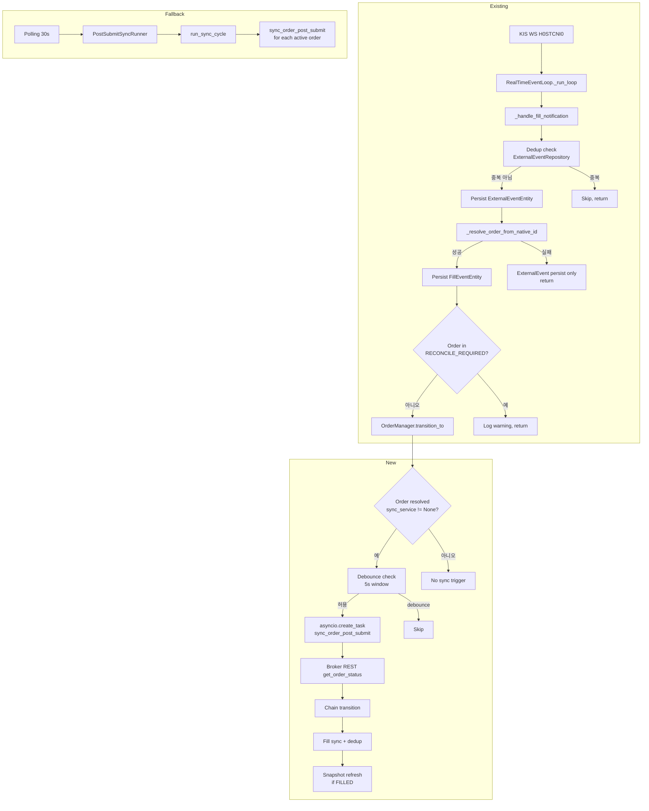

# WebSocket 기반 실시간 Post-Submit Sync — 설계 문서

## 1. 개요

현재 `PostSubmitSyncRunner`는 30초 간격 polling으로 동작하여 주문 상태 수렴 latency가 30~60s 수준이다.
KIS WebSocket H0STCNI0 (실시간체결통보) 채널을 활용해 event-driven post-submit sync trigger를 추가하여
이 latency를 sub-second 수준으로 낮춘다.

**핵심 원칙**: WS event는 `sync_order_post_submit()`를 호출하는 **trigger**로 사용한다.
직접 DB 상태를 변경하지 않고, 기존 chain transition / fill dedup / snapshot refresh 로직을 재사용한다.

**구조**: WS-triggered fast path + polling fallback (30s) 의 이중 구조.
- WS: 빠른 wake-up 및 sync trigger (sub-second)
- Polling: 최종 수렴 보장 (event 누락/실패 시 fallback)

## 2. 현재 상태 분석

### RealTimeEventLoop._handle_fill_notification() (event_loop.py:219-348)

```
H0STCNI0 WS event → _handle_fill_notification(data)
  ├─ broker_order_id (KIS native string, e.g. "KIS12345678")
  ├─ Parse filled_qty, filled_price, filled_time, order_qty, status
  ├─ Dedup check via ExternalEventRepository.find_by_dedup_key()
  ├─ Persist ExternalEventEntity
  ├─ _resolve_order_from_native_id() → OrderRequestEntity
  ├─ Persist FillEventEntity
  ├─ Guard: RECONCILE_REQUIRED 상태면 state progression hold
  ├─ OrderManager.transition_to() (PARTIALLY_FILLED / FILLED)
  └─ ** DOES NOT call sync_order_post_submit() ** ← GAP
```

### sync_order_post_submit() 시그니처 (order_sync_service.py:83-91)

```python
async def sync_order_post_submit(
    self,
    account_ref: str,           # Broker account reference string
    broker: BrokerAdapter,      # Broker adapter instance
    broker_order_id: UUID,      # Internal BrokerOrderEntity.broker_order_id (UUID)
    *,
    snapshot_refresh_cb: Callable[[UUID], Awaitable[None]] | None = None,
) -> SyncOrderResult:
```

**필요한 것들**:
- `account_ref` — 현재 `RealTimeEventLoop`에 없음
- `broker` — `self._adapter` 있음 (KoreaInvestmentAdapter)
- `broker_order_id` (UUID) — `_resolve_order_from_native_id()`가 `OrderRequestEntity`만 반환, `BrokerOrderEntity.broker_order_id` UUID는 유실됨
- `snapshot_refresh_cb` — 현재 `RealTimeEventLoop`에 없음

## 3. 설계 결정

### 3.1 RealTimeEventLoop 변경 사항

**`__init__()`에 다음 optional 파라미터 추가**:

```python
def __init__(
    self,
    adapter: KoreaInvestmentAdapter,
    order_manager: OrderManager,
    reconciliation_service: ReconciliationService,
    order_repo: OrderRepository,
    fill_repo: FillEventRepository,
    external_event_repo: ExternalEventRepository,
    broker_order_repo: BrokerOrderRepository,
    *,
    poll_interval: float = 0.1,
    # NEW: optional sync service dependencies
    sync_service: OrderSyncService | None = None,
    account_ref: str | None = None,
    snapshot_refresh_cb: Callable[[UUID], Awaitable[None]] | None = None,
) -> None:
```

- `sync_service` — `None`이면 sync trigger 동작 안함 (기존 동작과 100% 호환)
- `account_ref` — sync 호출 시 필요
- `snapshot_refresh_cb` — sync callback으로 전달 (FILLED 시 snapshot refresh)

### 3.2 Debounce 설계

```python
_WS_SYNC_DEBOUNCE_SECONDS = 5  # 동일 broker_order_id에 대한 중복 호출 방지 간격
```

`_debounce_last_sync: dict[UUID, datetime]` — broker_order_id (UUID) → 마지막 sync 호출 시각

같은 UUID에 대해 `_WS_SYNC_DEBOUNCE_SECONDS` 이내 재호출 시 skip.

**Debounce가 필요한 이유**:
- WS H0STCNI0는 체결 시마다 개별 이벤트 발생 → 동일 주문에 여러 번 trigger 가능
- `sync_order_post_submit()`은 REST API 호출 포함 → 과도한 호출 방지
- Polling fallback이 최종 수렴 보장하므로, WS trigger는 적당히 coarse해도 무방

### 3.3 _handle_fill_notification() sync trigger 로직

```python
async def _handle_fill_notification(self, data: dict[str, Any]) -> None:
    # ... existing code: dedup, persist ExternalEvent, resolve order, persist FillEvent, guard, transition_to ...
    
    # --- NEW: Fire sync trigger (fire-and-forget with debounce) ---
    if self._sync_service is not None and self._account_ref is not None:
        try:
            # Resolve BrokerOrderEntity to get UUID
            broker_order_entity = await self._broker_order_repo.get_by_native_order_id(
                broker_name=_BROKER_NAME,
                broker_native_order_id=broker_order_id,
            )
            if broker_order_entity is not None:
                bo_uuid = broker_order_entity.broker_order_id
                
                # Debounce check
                now = datetime.now(tz=timezone.utc)
                last = self._debounce_last_sync.get(bo_uuid)
                if last is not None and (now - last).total_seconds() < _WS_SYNC_DEBOUNCE_SECONDS:
                    logger.debug("Sync debounced for broker_order=%s", bo_uuid)
                else:
                    self._debounce_last_sync[bo_uuid] = now
                    # Fire-and-forget: do not block WS event handler
                    asyncio.create_task(
                        self._sync_service.sync_order_post_submit(
                            account_ref=self._account_ref,
                            broker=self._adapter,
                            broker_order_id=bo_uuid,
                            snapshot_refresh_cb=self._snapshot_refresh_cb,
                        )
                    )
        except Exception as e:
            logger.warning("Failed to trigger sync for %s: %s", broker_order_id, e)
```

**Fire-and-forget 이유**:
- `sync_order_post_submit()`은 REST API 호출 포함 (수백 ms ~ 수 초)
- WS event handler를 block하면 다른 WS 메시지 처리 지연
- `sync_order_post_submit()` 내부에 자체 error handling 있음
- 실패 시 polling fallback이 coverage

### 3.4 기존 _resolve_order_from_native_id() 변경 불필요

`_resolve_order_from_native_id()`는 `OrderRequestEntity`만 필요하던 기존 로직을 위해 유지.
sync trigger에서는 `_broker_order_repo.get_by_native_order_id()`를 직접 호출하여
`BrokerOrderEntity.broker_order_id` (UUID)를 획득.

## 4. 변경 파일 목록

| 파일 | 변경 유형 | 설명 |
|------|----------|------|
| [`src/agent_trading/services/event_loop.py`](src/agent_trading/services/event_loop.py) | 수정 | `__init__()`에 sync_service/account_ref/snapshot_refresh_cb 추가, `_handle_fill_notification()`에 sync trigger + debounce 추가 |
| [`tests/services/test_event_loop_integration.py`](tests/services/test_event_loop_integration.py) | 수정 | WS-triggered sync 신규 테스트 5개 추가 |
| [`plans/BACKLOG.md`](plans/BACKLOG.md) | 수정 | Item 19 상태 변경 (❌ → ✅) |

## 5. 테스트 계획 (5 tests)

| # | 테스트명 | 설명 |
|---|----------|------|
| 1 | `test_ws_fill_triggers_sync` | WS fill notification → `sync_order_post_submit()`가 올바른 `broker_order_id`(UUID)로 호출됨 |
| 2 | `test_ws_fill_triggers_sync_with_account_ref_and_broker` | sync 호출 시 `account_ref`와 `broker`(`_adapter`)가 전달됨 |
| 3 | `test_ws_fill_unknown_order_no_sync` | 알 수 없는 native order ID → sync 호출되지 않음 (graceful skip) |
| 4 | `test_ws_fill_sync_debounce` | 동일 broker_order_id에 대해 5초 이내 중복 WS event → sync는 1회만 호출됨 |
| 5 | `test_ws_fill_sync_no_service_noop` | `sync_service=None`이면 sync trigger 동작 안함 (기존 동작 보존) |

### 테스트 fixture 변경

기존 `event_loop_fixture` fixture에 optional `sync_service`, `account_ref` 파라미터 추가.
기본값 `None`으로 기존 테스트에 영향 없음.

```python
@pytest.fixture
def mock_sync_service() -> MagicMock:
    service = MagicMock()
    service.sync_order_post_submit = AsyncMock(return_value=SyncOrderResult(...))
    return service

@pytest.fixture
def event_loop_with_sync(
    mock_adapter, mock_order_manager, mock_reconciliation_service,
    mock_order_repo, mock_fill_repo, mock_external_event_repo,
    mock_broker_order_repo, mock_sync_service,
) -> RealTimeEventLoop:
    return RealTimeEventLoop(
        adapter=mock_adapter,
        order_manager=mock_order_manager,
        reconciliation_service=mock_reconciliation_service,
        order_repo=mock_order_repo,
        fill_repo=mock_fill_repo,
        external_event_repo=mock_external_event_repo,
        broker_order_repo=mock_broker_order_repo,
        sync_service=mock_sync_service,
        account_ref="test-account-01",
    )
```

## 6. Polling과의 역할 분리

| 특성 | WS-triggered sync (신규) | Polling sync (기존) |
|------|--------------------------|---------------------|
| Trigger | H0STCNI0 WS event | 30초定时 스케줄러 |
| Latency | Sub-second | 30~60s |
| Coverage | WS 연결 활성 시 | 항상 (WS 장애 시 fallback) |
| Debounce | 5초 (중복 호출 방지) | N/A (30초 간격) |
| Snapshot refresh | sync callback 통해 | sync callback 통해 |
| 실패 시 | Log + polling이 fallback | Log + 다음 cycle 재시도 |

**변경 없이 유지되는 것**:
- [`scripts/run_post_submit_sync_loop.py`](scripts/run_post_submit_sync_loop.py) — 변경 없음
- [`PostSubmitSyncRunner`](src/agent_trading/services/order_sync_service.py:480) — 변경 없음
- [`OrderSyncService.sync_order_post_submit()`](src/agent_trading/services/order_sync_service.py:83) — 변경 없음
- `runtime/bootstrap.py` — 변경 불필요 (`RealTimeEventLoop`은 bootstrap에서 wiring되지 않음)

## 7. 다이어그램



## 8. 안전성 분석

| 위험 | 완화 방안 |
|------|----------|
| WS event로 인한 REST API 과호출 | Debounce 5s + polling 대비 30s 간격보다 훨씬 낮은 호출 빈도 |
| sync 실패 시 상태 불일치 | Polling fallback이 최종 수렴 보장 |
| Fire-and-forget task 예외 | `sync_order_post_submit()` 내부 자체 error handling으로 예외 전파 안됨 |
| 기존 동작 회귀 | `sync_service=None` 기본값으로 기존 `RealTimeEventLoop` 동작 100% 보존 |
| 다중 account | `account_ref`를 `__init__` 파라미터로 명시적 전달; 단일 account 기준 |
