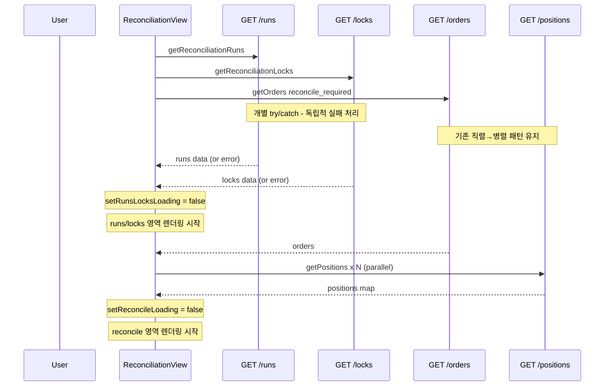

# 정합성 점검(ReconciliationView) 로딩 지연 진단 및 개선

> 작성일: 2026-05-17  
> 대상 파일: `admin_ui/src/components/ReconciliationView.tsx`, `admin_ui/src/__tests__/reconciliation.test.tsx`

---

## 1. 현재 로딩 구조 분석

### 1.1 useEffect 구성

```
[컴포넌트 마운트]
  │
  ├─ useEffect #1 (runs / locks) ── 72-94행
  │    ├── getReconciliationRuns()      ── 병렬 (Promise.all)
  │    └── getReconciliationLocks()     ── 병렬 (Promise.all)
  │    └── setLoading(false) (두 API 모두 완료 후)
  │    └── 실패 시 → setError() → 전체 화면 <ErrorBanner />
  │
  └─ useEffect #2 (reconcile_required) ── 97-144행
       ├── getOrders("reconcile_required")  ← Step 1: 직렬 선행 (106행)
       │    └── accountIds 추출 (111행)
       └── Promise.all(
             accountIds.map(id => getPositions(id))  ← Step 2: 병렬 후행 (114-119행)
           )
       └── setReconcileLoading(false) (모든 API 완료 후)
```

### 1.2 API 호출 수 (최악 시나리오)

| 단계 | 호출 | 수 | 비고 |
|------|------|------|------|
| useEffect #1 | runs + locks | 2 | 병렬, 1회 왕복 |
| useEffect #2 | orders + positions × N | 1 + N | 직렬 선행 후 병렬 |
| lazy (on click) | brokerOrders × M | M | 개별 lazy load |
| **합계** | | **3 + N + M** | N=계정 수, M=확장 행 수 |

### 1.3 상태 관리 분석

| 상태 변수 | 타입 | 초기값 | 해제 시점 | 영향 범위 |
|-----------|------|--------|-----------|-----------|
| `loading` | boolean | true | useEffect #1 완료 | 화면 전체 LoadingSpinner |
| `error` | string\|null | null | useEffect #1 실패 | 화면 전체 ErrorBanner |
| `reconcileLoading` | boolean | false | useEffect #2 완료 | reconcile 섹션 spinner 아이콘 |
| `reconcileError` | string\|null | null | useEffect #2 실패 | reconcile 섹션 ErrorBanner |

### 1.4 렌더 흐름 (325-326행)

```tsx
// 325행: useEffect #1 완료 전까지 전체 화면이 LoadingSpinner
if (loading) return <LoadingSpinner />;

// 326행: useEffect #1 실패 시 전체 화면이 ErrorBanner
// → reconcile 섹션(useEffect #2)이 이미 성공했어도 가려짐
if (error) return <ErrorBanner message={error} onDismiss={() => setError(null)} />;
```

---

## 2. 병목 원인 (우선순위 순)

### 🥇 `getPositions(accountId)` × N (114-119행)

- 계정 수만큼 개별 HTTP 요청 발생
- N=5면 5회 왕복, N=10이면 10회
- 모든 응답이 도착해야 `reconcileLoading` 해제
- **백엔드에 `GET /positions` (account_ids bulk query)가 없음**

### 🥈 useEffect #1 실패 시 화면 전체 블랭크 (326행)

- `if (error) return <ErrorBanner />`가 runs/locks 영역뿐 아니라 reconcile 영역까지 가림
- reconcile_required 데이터가 이미 로드되었어도 표시 불가
- `onDismiss`로 error 해제 가능하지만, 사용자가 직접 dismiss 필요

### 🥉 로딩 상태가 하나로 묶여 있음 (325행)

- `loading` 하나로 runs/locks 영역과 reconcile 영역의 로딩을 동시에 제어
- runs/locks가 먼저 도착해도 reconcile_required가 로딩 중이면 전체가 스피너

### 🏅 `findMatchingPosition()`의 linear search (reconcileRequired.ts 45-46행)

```typescript
// 현재: O(n²) 가능성
positions.find((p) => p.symbol === order.symbol)
```

- 계정별 positions 배열에서 `Array.find()`로 symbol 검색
- 주문 수 × 포지션 수만큼 반복: M(orders) × P(positions) 비교

---

## 3. 사용자 체감 문제

1. **전체 spinner 1개로 모든 영역을 묶음** — runs/locks가 빨리 도착해도 reconcile 기다려야 화면 표시
2. **runs/locks 실패 시 reconcile까지 블랭크** — 부분 실패에도 전체 화면 사용 불가
3. **섹션별 로딩 피드백 부재** — reconcile 섹션에만 spinner 아이콘, runs/locks는 로딩 중 표시 없음

---

## 4. 적용할 개선 내용 (4가지)

### 개선 1: Loading 상태를 section-level로 분리

**현재 (325행)**:
```tsx
if (loading) return <LoadingSpinner />;
```

**변경**: `loading`을 `runsLocksLoading`으로 rename하고, reconcile 섹션과 분리하여 각각 독립적 로딩 표시

```tsx
// Before:
const [loading, setLoading] = useState(true);

// After:
const [runsLocksLoading, setRunsLocksLoading] = useState(true);
```

렌더 구조:
```tsx
// runs/locks 섹션
{runsLocksLoading ? (
  <LoadingSpinner text="정합성 데이터 로딩 중..." />
) : (
  <>
    {/* Active Locks Section */}
    {/* Reconciliation Runs Section */}
  </>
)}

// reconcile 섹션 (기존 reconcileLoading 사용)
{reconcileLoading ? (
  <LoadingSpinner text="조정 필요 주문 로딩 중..." />
) : (
  <>
    {/* Reconcile-required table */}
  </>
)}
```

**장점**:
- runs/locks가 먼저 도착하면 즉시 표시
- reconcile_required가 로딩 중이어도 runs/locks 영역은 조작 가능
- 사용자 체감 성능 향상

### 개선 2: useEffect #1 실패 시 partial render

**현재 (326행)**:
```tsx
if (error) return <ErrorBanner message={error} onDismiss={() => setError(null)} />;
```

**변경**: `error`를 `runsError`, `locksError`로 분리하여 각 섹션별로 독립적 에러 처리

```tsx
// Before:
const [error, setError] = useState<string | null>(null);

// After:
const [runsError, setRunsError] = useState<string | null>(null);
const [locksError, setLocksError] = useState<string | null>(null);
```

fetchData 로직 변경:
```typescript
// Before:
try {
  const [runsData, locksData] = await Promise.all([
    getReconciliationRuns(),
    getReconciliationLocks(),
  ]);
  setRuns(runsData);
  setLocks(locksData);
} catch (err) {
  setError(err instanceof Error ? err.message : "...");
} finally {
  setLoading(false);
}

// After:
try {
  const runsData = await getReconciliationRuns();
  if (!cancelled) setRuns(runsData);
} catch (err) {
  if (!cancelled) {
    setRunsError(err instanceof Error ? err.message : "정합성 실행 데이터를 불러오지 못했습니다");
  }
}

try {
  const locksData = await getReconciliationLocks();
  if (!cancelled) setLocks(locksData);
} catch (err) {
  if (!cancelled) {
    setLocksError(err instanceof Error ? err.message : "잠금 데이터를 불러오지 못했습니다");
  }
}

if (!cancelled) setRunsLocksLoading(false);
```

렌더 구조:
```tsx
{runsError && <ErrorBanner message={runsError} onDismiss={() => setRunsError(null)} />}
{locksError && <ErrorBanner message={locksError} onDismiss={() => setLocksError(null)} />}

{/* Active Locks Section (locksError가 있어도 기존 locks 데이터 표시 가능) */}
{/* Reconciliation Runs Section (runsError가 있어도 기존 runs 데이터 표시 가능) */}
```

**장점**:
- runs만 실패해도 locks 섹션은 정상 표시
- runs 실패 시 reconcile 섹션까지 블랭크되지 않음
- `onDismiss`로 각 에러를 개별 해제 가능

### 개선 3: `findMatchingPosition()` Map lookup 최적화

**현재** ([`reconcileRequired.ts`](../admin_ui/src/lib/reconcileRequired.ts:38-48)):
```typescript
function findMatchingPosition(
  order: OrderSummary,
  positions: PositionSnapshotView[],
): PositionSnapshotView | null {
  if (!order.symbol) return null;
  return positions.find((p) => p.symbol === order.symbol) ?? null;
}
```

**변경**: `deriveReconcileRequiredCases()`에서 계정별 `symbol → position` Map을 미리 생성하여 lookup

```typescript
export function deriveReconcileRequiredCases(
  orders: OrderSummary[],
  positionsByAccount: Map<string, PositionSnapshotView[]>,
): ReconcileRequiredCase[] {
  // Pre-build symbol → position lookup maps per account
  const positionMapByAccount = new Map<string, Map<string, PositionSnapshotView>>();
  for (const [accountId, positions] of positionsByAccount) {
    const symbolMap = new Map<string, PositionSnapshotView>();
    for (const pos of positions) {
      if (pos.symbol) symbolMap.set(pos.symbol, pos);
    }
    positionMapByAccount.set(accountId, symbolMap);
  }

  const cases: ReconcileRequiredCase[] = [];
  for (const order of orders) {
    const accountPositions = positionMapByAccount.get(order.account_id);
    const matchedPosition = order.symbol
      ? (accountPositions?.get(order.symbol) ?? null)
      : null;
    // ... (이하 동일)
  }
}
```

**장점**:
- O(n²) → O(n)으로 차수 감소
- 계정별 Map을 한 번만 빌드하므로 orders × positions 반복 회피
- 주문 수가 많을수록 효과 큼

### 개선 4: loading/error/empty 상태 시각적 구분 개선

**변경 요약**:

| 상태 | 현재 | 개선 후 |
|------|------|---------|
| runs/locks loading | 화면 전체 LoadingSpinner | runs/locks 영역만 LoadingSpinner |
| runs/locks error | 화면 전체 ErrorBanner | runs/locks 각 섹션 내 ErrorBanner |
| reconcile loading | spinner 아이콘만 | reconcile 영역 자체를 LoadingSpinner |
| reconcile empty | "조정이 필요한 주문이 없습니다." | 동일 (유지) |
| reconcile error | reconcileError ErrorBanner | 동일 (유지) |

---

## 5. 변경 대상 파일 및 상세 변경 사항

### 5.1 `admin_ui/src/components/ReconciliationView.tsx`

#### 상태 변수 변경

| 변경 전 | 변경 후 | 비고 |
|---------|---------|------|
| `loading` | `runsLocksLoading` | runs/locks 전용 loading |
| `error` | `runsError` + `locksError` | 각 섹션별 error |
| `reconcileLoading` | 유지 | reconcile 전용 loading |
| `reconcileError` | 유지 | reconcile 전용 error |

#### useEffect #1 변경 (72-94행)

- `Promise.all` → 개별 try/catch로 분리
- runs 실패 → `runsError`만 설정, locks 실패 → `locksError`만 설정
- 두 API 중 하나만 실패해도 나머지 데이터는 정상 렌더링

#### 렌더 구조 변경 (325-326행 → 새로운 구조)

```tsx
// Before (기존):
if (loading) return <LoadingSpinner />;
if (error) return <ErrorBanner message={error} onDismiss={() => setError(null)} />;

return (
  <div className="p-6 space-y-6">
    {/* ... 모든 컨텐츠 ... */}
  </div>
);

// After (제안):
return (
  <div className="p-6 space-y-6">
    {/* Page Header (항상 표시) */}
    
    {/* runs/locks 영역 - runsLocksLoading 동안만 LoadingSpinner */}
    {runsLocksLoading ? (
      <LoadingSpinner text="정합성 데이터 로딩 중..." />
    ) : (
      <>
        {runsError && <ErrorBanner message={runsError} onDismiss={() => setRunsError(null)} />}
        {locksError && <ErrorBanner message={locksError} onDismiss={() => setLocksError(null)} />}
        {activeLocks.length > 0 && <WarningBanner ... />}
        {/* Active Locks Section */}
        {/* Reconciliation Runs Section */}
      </>
    )}

    {/* reconcile 섹션 - reconcileLoading 동안만 LoadingSpinner */}
    {reconcileLoading ? (
      <LoadingSpinner text="조정 필요 주문 로딩 중..." />
    ) : (
      <>
        {reconcileError && <ErrorBanner ... />}
        {/* Reconcile-required table */}
        {/* Summary card */}
      </>
    )}
  </div>
);
```

#### BrokerInfoPanel (변경 없음)

- lazy load 패턴은 그대로 유지 — 회귀 방지

### 5.2 `admin_ui/src/lib/reconcileRequired.ts`

- `deriveReconcileRequiredCases()` 내부에 `symbol → position` Map pre-build 로직 추가
- `findMatchingPosition()` 함수는 유지하되, Map 기반 lookup으로 변경

### 5.3 `admin_ui/src/__tests__/reconciliation.test.tsx`

#### 신규 테스트 케이스

1. **runs/locks loading이 reconcile loading과 독립적인지**
   - `getReconciliationRuns`와 `getReconciliationLocks`를 지연시킴
   - reconcile_required orders가 먼저 도착해도 runs/locks 영역만 LoadingSpinner
   - reconcile 섹션은 정상 렌더링

2. **runs API 실패 시 reconcile 섹션은 정상 렌더링**
   - `getReconciliationRuns`를 reject
   - `getReconciliationLocks`는 resolve
   - runs 영역에 ErrorBanner 표시
   - reconcile 섹션은 정상 표시

3. **locks API 실패 시 runs 섹션은 정상 렌더링**
   - `getReconciliationLocks`를 reject
   - runs 영역 정상, locks 영역에 ErrorBanner

4. **모든 API 성공 시 기존 동작과 동일**
   - 회귀 방지: 기존 테스트 모두 통과 확인

5. **empty/loading 상태 구분 테스트**
   - runsLocksLoading=true → LoadingSpinner 표시
   - reconcileLoading=true → reconcile 영역만 LoadingSpinner

6. **broker lazy load 회귀 없음**
   - 기존 broker info expand 테스트 유지

---

## 6. 테스트 계획

### 6.1 단위 테스트 (vitest)

| 테스트 | 설명 | 우선순위 |
|--------|------|---------|
| `deriveReconcileRequiredCases` Map lookup | symbol → position lookup이 올바른지 | 필수 |
| runs/locks loading 독립성 | runsLocksLoading과 reconcileLoading이 독립적인지 | 필수 |
| partial render on error | 한 API 실패 시 다른 섹션 렌더링 | 필수 |
| runs error + locks error 동시 표시 | 두 API 모두 실패 시 두 ErrorBanner 표시 | 권장 |
| empty state 유지 | 데이터가 없을 때 empty 메시지 표시 | 필수 |
| broker lazy load 회귀 | broker info expand 동작 변경 없음 | 필수 |

### 6.2 실행 명령어

```bash
cd admin_ui && npm test -- --run  # 단위 테스트
cd admin_ui && npm run build      # 빌드 검증
```

### 6.3 통합 확인

- Docker 재빌드 후 reconcile view 접속
- runs/locks/reconcile 모든 섹션 정상 표시 확인
- 브라우저 개발자 도구 Network 탭에서 API 호출 수 확인

---

## 7. 실행 순서

```
Step 1: ReconciliationView.tsx 수정
  ├── 상태 변수 분리 (runsLocksLoading, runsError, locksError)
  ├── useEffect #1 개별 try/catch 분리
  └── 렌더 구조 section-level loading/error 분리

Step 2: reconcileRequired.ts 최적화
  └── deriveReconcileRequiredCases Map lookup 도입

Step 3: reconciliation.test.tsx 업데이트
  ├── section-level loading 독립성 테스트
  ├── partial error render 테스트
  └── broker lazy load 회귀 테스트 유지

Step 4: npm test + npm run build
  └── 모든 테스트 통과 및 빌드 성공 확인

Step 5: Docker 재빌드 + API 확인
  └── 운영 환경 정상 동작 확인
```

---

## 8. 설계 원칙

1. **단순성 유지**: 기존 아키텍처를 크게 바꾸지 않고 incremental 개선
2. **점진적 개선**: 한 번에 모든 것을 바꾸지 않고, 병목 순위대로 처리
3. **회귀 방지**: broker lazy load (handleToggleBrokerInfo) 패턴을 건드리지 않음
4. **확장성**: 추후 bulk position API 도입 시 구조 개편이 필요 없도록 useEffect #2는 그대로 유지

---

## 9. Mermaid: 변경 후 로딩 흐름


