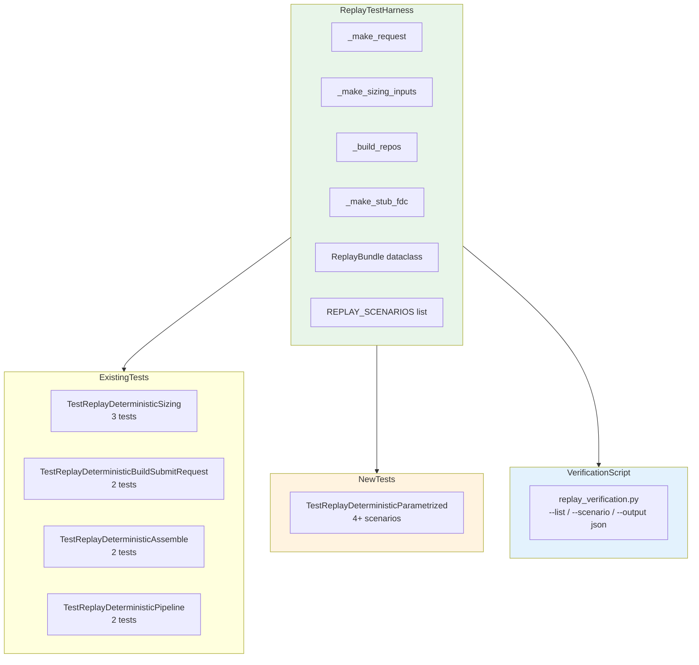

# Replay/Backtest Validation 고도화 — 설계

> **목적**: 저장된 decision context 기반의 deterministic paper-grade replay 경로를 확장하여,
> "같은 입력이면 같은 backend 결과가 나온다"를 더 넓은 범위에서 증명한다.
>
> **상태**: 설계 단계
>
> **제약 조건**:
> - admin UI 변경 금지
> - live 실계정 검증 금지
> - broker submit semantics 변경 금지
> - hard guardrail/reconciliation 경계 변경 금지
> - full historical backtest engine으로 과도 확장 금지
> - **승인 요청하지 말고 바로 진행**

---

## 1. 현재 상태 분석

### 1.1 기존 Replay 테스트 (9개)

| Test Class | 테스트 | 검증 범위 |
|-----------|--------|----------|
| `TestReplayDeterministicSizing` | 3개 | `calculate_sizing()` identity |
| `TestReplayDeterministicBuildSubmitRequest` | 2개 | `build_submit_order_request_from_decision()` identity |
| `TestReplayDeterministicAssemble` | 2개 | `assemble()` + sizing 통합 |
| `TestReplayDeterministicPipeline` | 2개 | `assemble_and_submit()` status identity |

### 1.2 중복 구조

3개 클래스가 각각 자체 `repos` fixture를 중복 정의:
- `TestReplayDeterministicBuildSubmitRequest.repos` (37줄)
- `TestReplayDeterministicAssemble.repos` (37줄)
- `TestReplayDeterministicPipeline.repos` (57줄 — snapshot seeding 추가)

`_StubFDC` 클래스도 3회 중복 정의됨.

### 1.3 누락된 범위

| 시나리오 | 현재 | 필요 |
|---------|------|------|
| REDUCE with position | ❌ | 결정론적 quantity 검증 |
| EXIT full liquidation | ❌ | 결정론적 quantity 검증 |
| Stale snapshot guard (account-level) | ❌ | Phase 4c 차단 결정론적 검증 |
| Cash constraint / concentration constraint | ❌ | sizing 축소 결정론적 검증 |
| Position-aware sizing | ❌ | position snapshot 반영 검증 |

---

## 2. Step 1: ReplayBundle 모델 정의

### 2.1 `ReplayBundle` dataclass

`tests/services/test_decision_replay.py` 내에 추가. 기존 파일 수정만으로 해결 (신규 파일 불필요).

```python
@dataclass(slots=True, frozen=True)
class ReplayBundle:
    """Deterministic replay bundle — encapsulates all inputs and expected outputs.

    Parameters
    ----------
    name
        Human-readable scenario name; MUST end with ``_submit`` (pipeline
        proceeds to broker) or ``_guard`` (pipeline stops at guardrail) so
        that test infrastructure can distinguish intent.
    request
        The ``SubmitOrderRequest`` that triggers the pipeline.
    repos
        Fully seeded ``RepositoryContainer`` (account, config, instrument,
        snapshots, etc.).
    stub_fdc
        A stub ``ProviderAIAgent`` that returns a canned
        ``FinalDecisionComposerOutput``.
    expected_status
        Expected ``SubmitResult.status`` (``"SUBMITTED"``, ``"SKIPPED"``, etc.).
    expected_quantity
        Expected ``SubmitResult.order.quantity`` (``None`` when no order created).
    expected_guardrail_rule
        Expected guardrail blocking rule code (``"STALE_SNAPSHOT_ACCOUNT"``,
        ``"STALE_SNAPSHOT"``, or ``None`` when no guardrail block).
    expected_submit_call_count
        Expected number of ``broker.submit_order()`` calls.
        ``0`` for guard-blocked scenarios, ``1`` for submit scenarios.
    """
    name: str  # MUST end with _submit or _guard
    request: SubmitOrderRequest
    repos: RepositoryContainer
    stub_fdc: ProviderAIAgent
    expected_status: str
    expected_quantity: Decimal | None
    expected_guardrail_rule: str | None
    expected_submit_call_count: int
```

### 2.2 `ReplayScenario` parametrize helper

pytest의 `@pytest.mark.parametrize`와 함께 사용할 bundle 리스트:

```python
# ── Naming convention ──────────────────────────────────────────────────
# Scenario names MUST end with:
#   _submit  → pipeline proceeds through to broker submission
#   _guard   → pipeline stops at guardrail (Phase 4c)
# This allows test code to infer intent without parsing expected_status.

REPLAY_SCENARIOS: list[ReplayBundle] = [
    ReplayBundle(
        name="happy_buy_submit",
        request=_make_request(client_order_id="RP-HAPPY-001"),
        repos=_build_repos(seed_cash=Decimal("1000000"), seed_position_qty=Decimal("0")),
        stub_fdc=_make_stub_fdc(decision_type="APPROVE", side="BUY"),
        expected_status="SUBMITTED",
        expected_quantity=Decimal("10"),
        expected_guardrail_rule=None,
        expected_submit_call_count=1,
    ),
    # ... more scenarios
]
```

---

## 3. Step 2: Fixture 리팩터

### 3.1 `_build_repos()` 공통 팩토리

3개 fixture의 중복을 제거하는 공통 팩토리 함수:

```python
def _build_repos(
    *,
    seed_cash: Decimal | None = None,
    seed_position_qty: Decimal | None = None,
    seed_instrument_symbol: str = "005930",
    seed_account_alias: str = "test-account",
) -> RepositoryContainer:
    """Build a fully seeded ``RepositoryContainer`` for replay testing.

    Parameters
    ----------
    seed_cash
        If set, seeds a ``CashBalanceSnapshotEntity`` with this amount.
    seed_position_qty
        If set, seeds a ``PositionSnapshotEntity`` with this quantity.
    seed_instrument_symbol
        Symbol for the seeded instrument.
    seed_account_alias
        Alias for the seeded account.
    """
    repos = build_in_memory_repositories()
    now = datetime.now(timezone.utc)

    account = AccountEntity(
        account_id=uuid4(),
        client_id=uuid4(),
        broker_account_id=uuid4(),
        environment=Environment.PAPER,
        account_alias=seed_account_alias,
        account_masked="test-****",
        status="active",
    )
    repos.accounts._items[account.account_id] = account

    config_version = ConfigVersionEntity(
        config_version_id=uuid4(),
        client_id=account.client_id,
        environment=Environment.PAPER,
        version_tag="v1.0",
        config_json={},
        checksum="abc123",
        activated_at=now,
    )
    repos.config_versions._items[config_version.config_version_id] = config_version

    instrument = InstrumentEntity(
        instrument_id=uuid4(),
        symbol=seed_instrument_symbol,
        market_code="KRX",
        asset_class=AssetClass.KR_STOCK,
        currency="KRW",
        name="Samsung Electronics",
    )
    repos.instruments._items[instrument.instrument_id] = instrument

    if seed_cash is not None:
        cash_snapshot = CashBalanceSnapshotEntity(
            cash_balance_snapshot_id=uuid4(),
            account_id=account.account_id,
            currency="KRW",
            available_cash=seed_cash,
            settled_cash=Decimal("0"),
            unsettled_cash=Decimal("0"),
            source_of_truth="broker",
            snapshot_at=now,
        )
        repos.cash_balance_snapshots._items[cash_snapshot.cash_balance_snapshot_id] = cash_snapshot

    if seed_position_qty is not None:
        pos_snapshot = PositionSnapshotEntity(
            position_snapshot_id=uuid4(),
            account_id=account.account_id,
            instrument_id=instrument.instrument_id,
            quantity=seed_position_qty,
            average_price=Decimal("50000"),
            market_price=Decimal("50000"),
            unrealized_pnl=Decimal("0"),
            source_of_truth="broker",
            snapshot_at=now,
        )
        repos.position_snapshots._items[pos_snapshot.position_snapshot_id] = pos_snapshot

    return repos
```

### 3.2 `_make_stub_fdc()` 팩토리

```python
def _make_stub_fdc(
    decision_type: str = "APPROVE",
    side: str = "BUY",
    symbol: str = "005930",
    confidence: float = 0.8,
    conviction: float = 0.7,
    summary: str = "Replay test stub",
) -> ProviderAIAgent:
    """Build a stub FDC agent returning a canned output."""
    class _StubFDCAgent:
        @property
        def agent_name(self) -> str:
            return "final_decision_composer"

        @property
        def schema_version(self) -> str:
            return "1.0.0"

        async def run(self, request: object) -> FinalDecisionComposerOutput:
            return FinalDecisionComposerOutput(
                decision_type=decision_type,
                side=side,
                symbol=symbol,
                confidence=confidence,
                conviction=conviction,
                summary=summary,
            )
    return _StubFDCAgent()
```

---

## 4. Step 3: Deterministic Replay 범위 확장

### 4.1 신규 시나리오 — 4개

#### Scenario A: REDUCE with position
```python
ReplayBundle(
    name="reduce_with_position",
    request=_make_request(
        client_order_id="RP-REDUCE-001",
        side=OrderSide.SELL,
        quantity=Decimal("5"),
    ),
    repos=_build_repos(
        seed_cash=Decimal("1000000"),
        seed_position_qty=Decimal("10"),  # 현재 10주 보유
    ),
    stub_fdc=_make_stub_fdc(decision_type="REDUCE", side="SELL"),
    expected_status="SUBMITTED",
    expected_quantity=Decimal("5"),  # 요청한 5주만 부분 매도
    expected_guardrail_rule=None,
    expected_submit_call_count=1,
)
```

#### Scenario B: EXIT full liquidation
```python
ReplayBundle(
    name="exit_full_liquidation",
    request=_make_request(
        client_order_id="RP-EXIT-001",
        side=OrderSide.SELL,
        quantity=Decimal("10"),
    ),
    repos=_build_repos(
        seed_cash=Decimal("1000000"),
        seed_position_qty=Decimal("10"),  # 10주 전량 보유
    ),
    stub_fdc=_make_stub_fdc(decision_type="EXIT", side="SELL"),
    expected_status="SUBMITTED",
    expected_quantity=Decimal("10"),  # 전량 매도
    expected_guardrail_rule=None,
    expected_submit_call_count=1,
)
```

#### Scenario C: Stale snapshot guard (account-level)
```python
ReplayBundle(
    name="stale_snapshot_account_guard",
    request=_make_request(client_order_id="RP-STALE-001"),
    repos=_build_repos(
        seed_cash=None,       # 캐시 스냅샷 없음 → stale
        seed_position_qty=None,
    ),
    stub_fdc=_make_stub_fdc(decision_type="APPROVE", side="BUY"),
    expected_status="SKIPPED",
    expected_quantity=None,   # order 생성되지 않음
    expected_guardrail_rule="STALE_SNAPSHOT_ACCOUNT",
    expected_submit_call_count=0,
)
```

#### Scenario D: Cash constraint — quantity capped
```python
ReplayBundle(
    name="cash_constraint_capped",
    request=_make_request(
        client_order_id="RP-CASH-CAP-001",
        quantity=Decimal("100"),
        price=Decimal("50000"),
    ),
    repos=_build_repos(
        seed_cash=Decimal("100000"),   # 10만원 — 5M KRW 필요 → cash constraint 발동
        seed_position_qty=Decimal("0"),
    ),
    stub_fdc=_make_stub_fdc(decision_type="APPROVE", side="BUY"),
    expected_status="SUBMITTED",
    expected_quantity=Decimal("1"),  # cash_limit으로 1주만 가능
    expected_guardrail_rule=None,
    expected_submit_call_count=1,
)
```

### 4.2 Parametrize 테스트 구조

신규 parametrize 테스트 클래스 (기존 4개 클래스 + 신규 1개):

```python
class TestReplayDeterministicParametrized:
    """``assemble_and_submit()`` 결정론적 검증 — parametrized scenarios.

    ``ReplayBundle`` 리스트를 ``@pytest.mark.parametrize``로 전달하여
    각 시나리오별로 동일 입력 → 동일 출력을 검증한다.
    """

    @pytest.mark.parametrize(
        "bundle",
        REPLAY_SCENARIOS,
        ids=lambda b: b.name,
    )
    @pytest.mark.asyncio
    async def test_replay_scenario(
        self,
        bundle: ReplayBundle,
    ) -> None:
        """동일 ReplayBundle → 결정론적 결과."""
        # Given: bundle inputs
        # When: run pipeline
        mock_broker = MagicMock(spec=BrokerAdapter)
        mock_broker.submit_order = AsyncMock()
        mock_broker.submit_order.return_value = SubmitOrderResult(
            accepted=True,
            broker_name=BrokerName.KOREA_INVESTMENT,
            client_order_id=bundle.request.client_order_id,
            broker_order_id="BRK-REPLAY-001",
            broker_status=OrderStatus.ACKNOWLEDGED,
            ack_timestamp=datetime.now(timezone.utc),
            raw_code="0000",
            raw_message="Accepted",
        )

        rs = ReconciliationService(bundle.repos)
        om = OrderManager(repos=bundle.repos, reconciliation_service=rs)

        service = DecisionOrchestratorService(
            repos=bundle.repos,
            final_decision_agent=bundle.stub_fdc,
        )

        result = await service.assemble_and_submit(
            bundle.request,
            order_manager=om,
            broker=mock_broker,  # type: ignore[arg-type]
        )

        # Then: deterministic results
        assert result.status == bundle.expected_status, (
            f"[{bundle.name}] Expected status {bundle.expected_status}, "
            f"got {result.status}"
        )
        if bundle.expected_quantity is not None:
            assert result.order is not None, (
                f"[{bundle.name}] Expected order but got None"
            )
            assert result.order.requested_quantity == bundle.expected_quantity, (
                f"[{bundle.name}] Expected qty {bundle.expected_quantity}, "
                f"got {result.order.requested_quantity}"
            )
        if bundle.expected_guardrail_rule is not None:
            guardrails = await bundle.repos.guardrail_evaluations.list_by_decision_context(
                # ... lookup by context ID
            )
            assert any(
                g.blocking_rule_code == bundle.expected_guardrail_rule
                for g in guardrails
            ), f"[{bundle.name}] Expected guardrail {bundle.expected_guardrail_rule}"

        assert mock_broker.submit_order.await_count == bundle.expected_submit_call_count, (
            f"[{bundle.name}] Expected {bundle.expected_submit_call_count} submit calls, "
            f"got {mock_broker.submit_order.await_count}"
        )
```

---

## 5. Step 4: Reusable Test Harness 정리

### 5.1 공유 fixture 파일

`tests/services/replay_test_harness.py` (신규):

| Export | 설명 |
|--------|------|
| `_make_request()` | `SubmitOrderRequest` builder (기존에서 이동) |
| `_make_sizing_inputs()` | `SizingInputs` builder (기존에서 이동) |
| `_build_repos()` | Seeded `RepositoryContainer` 팩토리 (신규) |
| `_make_stub_fdc()` | Stub FDC agent 팩토리 (신규) |
| `ReplayBundle` | Replay bundle dataclass (신규) |
| `REPLAY_SCENARIOS` | 공식 시나리오 리스트 (신규) |

### 5.2 기존 파일 영향

`tests/services/test_decision_replay.py`에서:
- `_make_request()` → `from replay_test_harness import _make_request`로 변경
- `_make_sizing_inputs()` → `from replay_test_harness import _make_sizing_inputs`로 변경
- 3개 중복 `repos` fixture → `_build_repos()` 호출로 대체
- 3개 중복 `_StubFDC` → `_make_stub_fdc()` 호출로 대체
- `TestReplayDeterministicParametrized` 클래스 추가

---

## 6. Step 5: 운영용 검증 진입점 검토

### 6.1 경량 replay 검증 스크립트

`scripts/replay_verification.py` (신규 — 선택적):

```python
#!/usr/bin/env python3
"""Replay verification — run canned scenarios and report results.

Usage:
    python -m scripts.replay_verification          # Run all scenarios
    python -m scripts.replay_verification --list   # List available scenarios
    python -m scripts.replay_verification --scenario happy_buy  # Single scenario
    python -m scripts.replay_verification --output json  # JSON output

This script uses the same ``ReplayBundle`` scenarios defined in the test
harness, but runs them outside of pytest for operational use.
"""

import argparse
import json
import sys
import asyncio
from unittest.mock import AsyncMock, MagicMock

from agent_trading.brokers.base import BrokerAdapter
from agent_trading.services.order_manager import OrderManager
from agent_trading.services.reconciliation_service import ReconciliationService
from agent_trading.services.decision_orchestrator import DecisionOrchestratorService

# Import from test harness
from tests.services.replay_test_harness import REPLAY_SCENARIOS, ReplayBundle

async def _run_scenario(bundle: ReplayBundle) -> dict:
    """Run a single replay scenario and return results."""
    mock_broker = MagicMock(spec=BrokerAdapter)
    mock_broker.submit_order = AsyncMock()
    mock_broker.submit_order.return_value = ...

    rs = ReconciliationService(bundle.repos)
    om = OrderManager(repos=bundle.repos, reconciliation_service=rs)
    service = DecisionOrchestratorService(repos=bundle.repos, final_decision_agent=bundle.stub_fdc)

    result = await service.assemble_and_submit(bundle.request, order_manager=om, broker=mock_broker)

    return {
        "name": bundle.name,
        "status": result.status,
        "expected_status": bundle.expected_status,
        "match": result.status == bundle.expected_status,
    }
```

### 6.2 출력 형식

```json
{
  "timestamp": "2026-05-09T07:00:00Z",
  "total": 6,
  "passed": 5,
  "failed": 1,
  "results": [
    {"name": "happy_buy", "status": "SUBMITTED", "expected": "SUBMITTED", "match": true},
    {"name": "stale_snapshot_account_guard", "status": "SKIPPED", "expected": "SKIPPED", "match": true},
    ...
  ]
}
```

---

## 7. Step 6: 문서/Backlog 정리

### 7.1 `plans/paper_trading_loop_validation.md` 업데이트

- 3.1절 "Replay-Style 검증" 업데이트:
  - `TestReplayDeterministicSizing` (3 tests) → ✅ 완료
  - `TestReplayDeterministicBuildSubmitRequest` (2 tests) → ✅ 완료
  - `TestReplayDeterministicAssemble` (2 tests) → ✅ 완료
  - `TestReplayDeterministicPipeline` (2 tests) → ✅ 완료
  - `TestReplayDeterministicParametrized` (4+ scenarios) → ✅ 신규
- 5.2절 Replay 테스트 설명 업데이트
- 4번 Go/No-Go 기준 업데이트 (13/13 pass)

### 7.2 `plans/BACKLOG.md` 업데이트

- Item 3 (Replay/Backtest) 상태 변경: ❌ 미착수 → ✅ 승격됨
- 승격 기록 추가

---

## 8. 변경 파일 목록

| 파일 | 변경 유형 | 설명 |
|------|----------|------|
| `tests/services/test_decision_replay.py` | **수정** | fixture 리팩터, `ReplayBundle` 추가, parametrize 테스트 4개 추가, 기존 9개 유지 |
| `tests/services/replay_test_harness.py` | **신규** | `_make_request()`, `_make_sizing_inputs()`, `_build_repos()`, `_make_stub_fdc()`, `ReplayBundle`, `REPLAY_SCENARIOS` |
| `scripts/replay_verification.py` | **신규** (선택) | 경량 replay 검증 스크립트 |
| `plans/paper_trading_loop_validation.md` | **수정** | 3.1절, 5.2절, Go/No-Go 업데이트 |
| `plans/BACKLOG.md` | **수정** | Item 3 상태 변경 + 승격 기록 |

---

## 9. Mermaid: Replay 테스트 구조



---

## 10. 완료 보고 형식

완료 시 아래 7개 항목을 보고:

1. **Step 1**: `ReplayBundle` dataclass + fixture builder 정의 완료
2. **Step 2**: 3개 fixture 중복 제거 → `_build_repos()` 공통 팩토리로 통합
3. **Step 3**: 4개 신규 시나리오 (REDUCE/EXIT/stale guard/cash constraint) + parametrize 테스트
4. **Step 4**: `replay_test_harness.py` 공유 모듈 분리
5. **Step 5**: `replay_verification.py` 경량 검증 스크립트
6. **Step 6**: 문서 업데이트 (`paper_trading_loop_validation.md` + `BACKLOG.md`)
7. **테스트 결과**: 기존 9개 + 신규 4개 = 13/13 통과, 회귀 0
