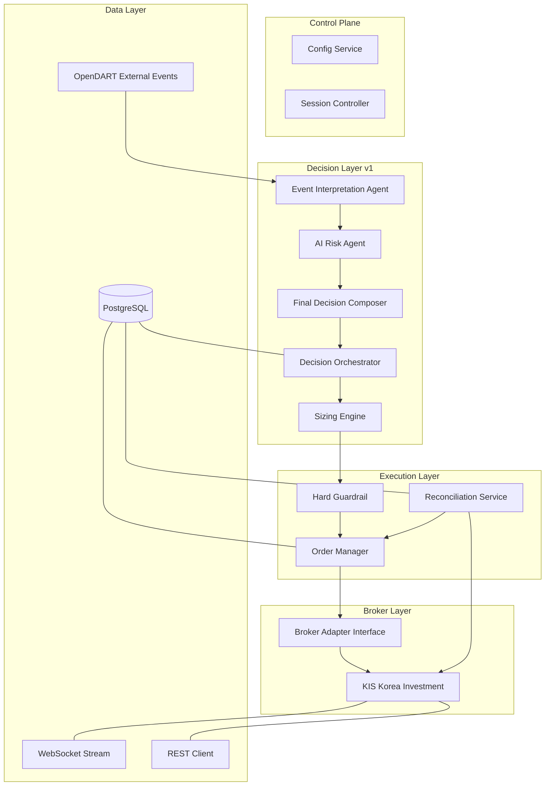

# Session #15 브리핑 — 현재 시스템 개발 단계 총정리 (수정 v2)

> 기준 시점: 2026-05-21  
> 기준 문서: HANDOVER, BACKLOG, ENTERPRISE_DESIGN V1/V2, HANDOFF, detailed_design 01~10, agents/ 01~03

---

## 1. 현재 시스템 개요

**프로젝트**: Enterprise AI Multi-Agent Trading System (한국투자증권 KIS API 기반)

**운영 환경**: **Paper Trading** (실전 모의환경) — paper를 마치 live처럼 운영

**핵심 철학**: "AI는 판단(해석/의견)을 내고, deterministic backend가 강제 집행한다"

**Python 3 + PostgreSQL + Docker** 기반, 단일 저장소 구조

---

## 2. 현재 구현 상태 — 완료된 부분

### 2.1 AI Agent Layer (v1 Core — 3개 Provider AI Agent)

| Agent | 역할 | 상태 |
|-------|------|------|
| Event Interpretation Agent (EI) | 외부 이벤트 → 구조화된 해석 | ✅ Implemented |
| AI Risk Agent (AR) | 리스크 의견 (allow/reduce/reject/review) | ✅ Implemented |
| Final Decision Composer (FDC) | 최종 의도 (APPROVE/REJECT/HOLD/WATCH/EXIT/REDUCE) | ✅ Implemented |

### 2.2 결정 파이프라인

```
EI → AR → FDC → Decision Orchestrator → Sizing Engine → Hard Guardrail → Order Manager → Broker Adapter (KIS)
```

- 결정 상태(decision state)와 주문 상태(order state) 분리 완료
- `client_order_id` 기반 멱등성 보장
- AI 판단 결과와 실제 주문 경로 분리

### 2.3 KIS Broker Integration

- REST API 클라이언트 (`rest_client`)
- WebSocket 실시간 체결통보 (`websocket_client`)
- Access Token 관리 (`auth_manager`)
- Approval Key 관리 (`approval_key_manager`)
- 응답 정규화 (`normalizer`)
- Paper/Live 환경 분리
- 환경별 rate limit safety scaling (paper=1 RPS, live=18 RPS)

### 2.4 주문 안전성 (직전 세션 완료)

**User Request 13 / 13b / 13c — BUY 수량 동적 계산 (2026-05-19~20 완료)**

- `reference_price` 기반 MARKET order sizing
- `_resolve_buy_target_quantity()` 구현 — `_ALLOCATION_PCT = 0.2` (20%)
- BUY 수량 공식: `floor(orderable_amount * 20% / effective_price)`
- 4단계 리스크 제약 체인: cash → concentration → max_order_value → max_order_qty
- 최소 1주, 상한 cap 없음 (기존 10주 제한 제거)
- **고가주도 sub-10주 매수 가능, 저가주는 10주 초과 매수 가능** — 두 방향으로 유연해짐
- SELL 경로는 변경 없음
- entrypoint 스크립트에서 `requested_quantity=Decimal("1")` 사용:
  - [`scripts/run_paper_decision_loop.py:738`](scripts/run_paper_decision_loop.py:738)
  - [`scripts/run_orchestrator_once.py:359`](scripts/run_orchestrator_once.py:359)
- [`src/agent_trading/services/decision_orchestrator.py:1598`](src/agent_trading/services/decision_orchestrator.py:1598)는 `requested_quantity=req.quantity`이며, 해당 위치에 `Decimal("10")` 상수는 존재하지 않음

**Rate Limit (2026-05-07 완료)**

- 5-bucket token budget: AUTH / ORDER / INQUIRY / MARKET_DATA / RECONCILIATION
- Priority ordering: auth recovery > reconciliation > open order/fill inquiry > risk-reducing exit > new entry
- Strict Global REST Cap 구현 완료

### 2.5 Storage Layer

- PostgreSQL 기반 (DDL 기준 entity 구현)
- 주요 테이블: `decision_context`, `agent_run`, `trade_decision`, `order_request`, `broker_order`, `fill_event`, `position_snapshot`, `cash_balance_snapshot`, `reconciliation_run`, `guardrail_evaluation`, `order_state_event`, `decision_state_event`, `broker_api_call_log`, `audit_log` 등 30+ entity
- Repository 패턴 (PostgresRepository / InMemoryRepository)
- Unit of Work 패턴 (`postgres_uow.py`)
- Row mapper (`row_mapper.py`)

### 2.6 Admin UI

- React + TypeScript 기반 관리자 UI
- Dashboard, Orders, Decisions, Agent Runs, Accounts, Reconciliation, Alerts 등
- Docker API 이미지로 운영 중

### 2.7 Docker 운영

- 4개 이미지: `app`, `api`, `reconciliation-worker`, `ops-scheduler`
- 서비스별 baked image 방식 (변경 반영 시 서비스별 rebuild 필요)
- `ops-scheduler`는 재빌드 후 `docker compose restart ops-scheduler`로 재시작

---

## 3. 현재 구현 상태 — 부분 완료된 영역

| 영역 | 상태 | 설명 |
|------|------|------|
| Data Collection | ⚠️ Partially | KIS REST/WS는 완료, 외부 이벤트는 OpenDART만 |
| Data Quality | ⚠️ Partially | freshness budget, gap fill, dedup 일부 구현 |
| External Events | ⚠️ Partially | OpenDART only (T1 규제 소스), 뉴스/리포트/거시캘린더 미구현 |
| Hard Guardrail | ⚠️ Partially | orchestrator 후단 분산 배치, 전용 엔진 아님 |
| Admin UI | ⚠️ Partially | 주요 뷰 존재, 운영 체크리스트/Inspection 추가 필요 |
| Execution Agent | ⚠️ Partially | OrderManager+BrokerAdapter+Reconciliation path 존재, 추가 hardening 필요 |

---

## 4. 현재 구현 상태 — 미완료/계획된 영역

### 4.1 아직 구현되지 않은 AI Agent (11개)

| Agent | 설계상 구현 형태 | 우선순위 |
|-------|----------------|---------|
| Market Regime Agent | Hybrid (deterministic + AI) | P2 |
| Universe Selection Agent | Deterministic ranking/filter | P2 |
| Strategy Selection Agent | Hybrid policy service | P2 |
| Signal Agent | Deterministic scoring engine | P2 |
| Portfolio Agent | Deterministic portfolio service | P2 |
| Order Construction Agent | Deterministic order service | P2 |
| AI Compliance Agent | Hybrid (AI opinion + hard validator) | P2 |
| Performance Agent | Deterministic analytics | P2 |
| Model Monitor Agent | Monitoring + offline eval | P3 |
| Data Collector Agent | Deterministic worker (KIS만 partial) | P1 |
| Data Quality Agent | Deterministic validator (partial) | P1 |

### 4.2 아직 구현되지 않은 핵심 인프라

| 항목 | 설명 | 우선순위 |
|------|------|---------|
| Event-driven Backtest Engine | 전체 backtest 인프라 | P1 |
| Control Plane | Config 활성화/변경 반영/승인 workflow | P1 |
| Observability Plane | 통합 모니터링/알렛/메트릭 | P1 |
| Live Canary Policy | Paper→Canary→Limited Live→Full Live gate | P1 |
| VaR Engine | 전용 deterministic risk engine | P2 |
| Multi-Broker | 키움증권 등 추가 브로커 | P2 |
| Portfolio Risk | 포트폴리오 레벨 리스크 관리 | P2 |
| Enterprise Infra/Security | 전체 인프라/보안 | P3 |

---

## 5. 직전 세션 (#14) 인계사항 — 차기 세션 핵심 이슈

### ⚠️ Priority 0: AR Layer 2 guard 운영 검증 (Pending)

- **상태**: 코드는 배포됨, 아직 실제 AR run 미실행
- **확인 필요** (2026-05-22 장중):
  1. AR이 `opinion=reject` 또는 `size_adjustment_factor < 1`을 정상 출력하는가
  2. AR output이 `RiskLevel.L2` 분기(`decision_orchestrator.py` Guardrail Phase 2)를 정상 타는가
  3. AR reject 시에도 `FDC decision != REJECT`인 경우 backend가 정상 차단하는가 (backend가 최종 차단)
- **검증 방법**: `logs/` 또는 DB `agent_run` 테이블에서 실제 AR run 확인

### 🔴 알려진 이슈 (참고용)

- 직전 세션 변경사항 (13/13b/13c)이 **고가 기준가격(`reference_price`)이 주문가능금액(`orderable_amount`) 대비 과도하여 1주도 매수 불가능한 시나리오**에서 아직 테스트되지 않음
  - 예: `orderable_amount=500,000원`인데 `reference_price=1,200,000원`이면 `floor(500,000 * 0.2 / 1,200,000) = 0주` → 1주로 보정되지만 시장가 매수가 실제 체결 가능한지 미검증
- AR Layer 2 guard는 아직 운영 검증 안 됨

### 🐳 Docker 운영 참고 (서비스별 반영 방식)

| 서비스 | 이미지 방식 | 변경 반영 방법 |
|--------|-----------|--------------|
| `app` | baked image | `docker compose build app` → 재시작 |
| `api` | baked image (단, 설정에 따라 volume mount 방식 병행 가능) | `docker compose build api` → 재시작, 또는 volume mount 시 rebuild 불필요 |
| `reconciliation-worker` | baked image | `docker compose build reconciliation-worker` → 재시작 |
| `ops-scheduler` | baked image | `docker compose build` 후 `docker compose restart ops-scheduler` |

---

## 6. V2 설계 기준 개발 단계 종합 평가

### ✅ 완료 또는 실질 완료
- KIS Broker Core (REST + WebSocket + Auth)
- Order Safety (rate limit, idempotency, state machine, reconciliation priority)
- Paper Operations Loop (snapshot → decide → submit → sync → refresh)
- 3 Provider AI Agents (EI + AR + FDC)
- Performance Evaluation Layer (paper performance summary/history/benchmark)
- Paper/Live Gate Evaluation (검증 기준 정의)
- Strict Global REST Cap

### ⚠️ 부분 완료
- Data Collection (KIS OK, 외부 이벤트 OpenDART only)
- Data Quality (freshness/basic checks, VaR 엔진 없음)
- External Event Pipeline (OpenDART + EI)
- Admin UI (main views exist)
- Hard Guardrail (분산 배치, 전용 엔진 아님)

### ❌ 미완성 (P1)
- Event-driven Backtest Engine
- Control Plane / Config Approval Workflow
- Observability Plane (통합 메트릭/알렛)
- Live Canary Execution Policy
- `reconcile_required` residual 처리 (Backlog #14)
- Subprocess isolation deployment (Backlog #15)
- Paper/Live metadata cleanup (Backlog #16)

### ❌ 미완성 (P2+)
- Full Multi-Agent Stack (11개 미구현 Agent)
- Multi-Broker (키움증권 등)
- Portfolio Risk Management
- Operator Intervention Workflow
- Near-real scheduler Docker daemon

---

## 7. 권장 다음 작업 우선순위

### Immediate (P0 — 장중 확인)
1. **AR Layer 2 guard 운영 검증** (2026-05-22) — `logs/` 및 `agent_run` 테이블 확인
2. **고가주 sub-10 매수 시나리오 테스트** — `reference_price`가 `orderable_amount` 대비 과도한 케이스에서 MARKET order 정상 체결 확인

### Short-term (P1)
3. **`reconcile_required` residual 처리** (Backlog #14) — unknown state handling 완결
4. **Paper/Live metadata cleanup** (Backlog #16) — paper 환경 metadata 정리
5. **Subprocess isolation deployment** (Backlog #15) — 안정적 배포 구조
6. **Hard Guardrail 전용 엔진 일원화** — 현재 분산된 차단 로직 통합

### Medium-term (P1~P2)
7. **Event-driven Backtest Engine** — P1 최우선 gap
8. **Control Plane / Config Workflow** — 설정 변경 승인 프로세스
9. **Live Canary Policy 구현** — Paper→Canary gate 통과 준비
10. **E2E test with TradeDecisionEntity** — 결정-주문 연동 테스트

---

## 8. V2 설계 대비 현재 Architecture 평가

### 잘 반영된 것
- **AI ≠ Execution**: AI는 판단 계층, backend가 집행
- **Order Safety First**: rate limit, idempotency, reconciliation, guardrail
- **Paper-first**: paper에서 모든 검증 후 live
- **Deterministic Override**: hard guardrail이 AI보다 우선

### 아직 Gap이 있는 것
- **14-Agent 설계 vs 3-Agent 구현**: 11개 Agent 미구현
- **Event-driven Backtest Engine 없음**: backtest 검증 불가
- **Control Plane 미구현**: config 변경/승인/활성화 workflow 없음
- **Observability Plane 미구현**: 통합 모니터링/알렛/메트릭 인프라 부족
- **Live Canary Gate 정의는 있으나 실행 준비 안 됨**
- **Multi-Broker 미구현**: KIS only

---

## 9. 시스템 아키텍처 다이어그램 (현재 구현 기준)



> **범례**: ✅ 구현됨 | ⚠️ 부분 구현 | ❌ 미구현
>
> - Control Plane: Config / Session ⚠️ (기본 설정만)
> - Decision Layer v1: EI / AR / FDC / DO / SE ✅
> - Execution Layer: HG ⚠️ (분산), OM ✅, RS ✅
> - Broker Layer: BA ✅, KIS ✅
> - Data Layer: PG ✅, WS ✅, REST ✅, OD ⚠️ (OpenDART only)

---

## 10. 차기 세션 시작 체크리스트

- [ ] AR Layer 2 guard 운영 검증 (`logs/` 및 DB `agent_run` 확인)
- [ ] 최근 변경사항(13/13b/13c) 고가 `reference_price` 대비 `orderable_amount` 부족 시나리오 테스트
- [ ] 서비스별 Docker 이미지 재빌드 필요 여부 확인 (app/api/reconciliation-worker/ops-scheduler)
- [ ] BACKLOG.md 우선순위 재확인 및 필요시 업데이트
