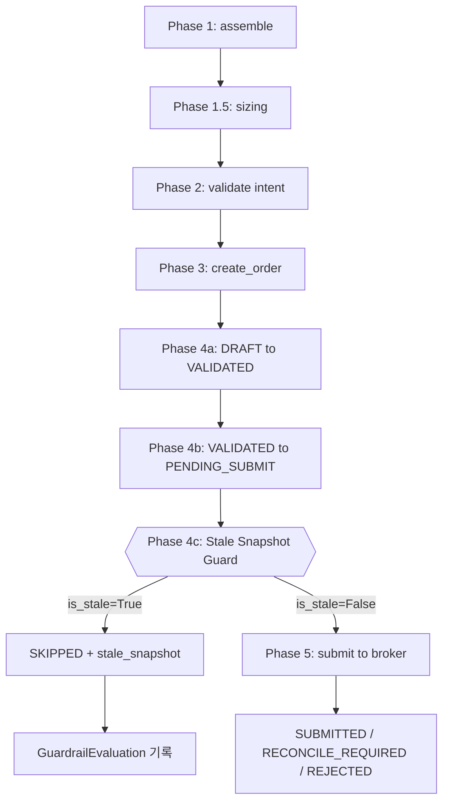

# Stale Snapshot Submit Guard — 추가 설계

## 1. 개요

**목적**: Snapshot freshness가 기준 이하일 때 broker submit(Phase 5)을 차단하는 guardrail 구현.

**현황**: Paper trading loop validation 완료 (14/15 passed). Scenario 4만 snapshot staleness guardrail 미구현으로 skip 상태.

**제약**:
- Admin UI 변경 금지
- Broker submit semantics 변경 금지
- Hard guardrail / reconciliation 경계 변경 금지
- Live 실계정 사용 금지

---

## 2. 설계 결정 사항

### Step 1: Freshness Source

| 항목 | 결정 |
|------|------|
| **Source** | `repos.snapshot_sync_runs.get_sync_health_summary(threshold_seconds)` |
| **판정 필드** | 반환된 `SnapshotSyncHealthSummary.is_stale` |
| **이유** | 이미 Postgres + InMemory 양쪽 구현 완료. `is_stale`은 `last_successful_run_at`과 `stale_threshold_seconds`를 비교하여 자동 계산 |
| **Account-level?** | 아니요, run-level global summary 기준. Account-level snapshot freshness는 future work |

### Step 2: Threshold

| 항목 | 결정 |
|------|------|
| **기본값** | 900초 (15분) |
| **Config** | `AppSettings.kis_snapshot_stale_threshold_seconds` 또는 `SNAPSHOT_STALE_THRESHOLD_SECONDS` env var |
| **서비스 주입** | `DecisionOrchestratorService.__init__()`에 `stale_threshold_seconds: int = 900` 파라미터 추가 |

> **참고**: `DecisionOrchestratorService`는 현재 `AppSettings`에 접근하지 않음. `stale_threshold_seconds`를 생성자 파라미터로 받아 테스트에서 쉽게 오버라이드 가능하도록 설계.

### Step 3: Guard Position

```
Phase 1: assemble() → OrderIntent
    ↓
Phase 1.5: sizing engine → quantity 조정
    ↓
Phase 2: validate intent → HOLD/WATCH skip 체크
    ↓
Phase 3: OrderManager.create_order() → DRAFT
    ↓
Phase 4a: transition DRAFT → VALIDATED
    ↓
Phase 4b: transition VALIDATED → PENDING_SUBMIT
    ↓
★ Phase 4c: **Stale Snapshot Guard** (신규) ← HERE
    ↓
Phase 5: submit_order_to_broker() → broker 전송
```

**위치**: [`src/agent_trading/services/decision_orchestrator.py`](src/agent_trading/services/decision_orchestrator.py:812) — Phase 4b 종료 후, Phase 5 진입 전 (line 811–812 사이)

**이유**: 
- Order creation까지는 정상 진행 (audit trail 확보)
- DRAFT → VALIDATED → PENDING_SUBMIT transition 완료 후 broker submit 직전 차단
- PENDING_SUBMIT 상태의 order는 재시도 가능 (fresh snapshot 확보 후 Phase 5 재실행)

### Step 4a: no_history 정책

| 상황 | is_stale | 차단 여부 | 사유 |
|------|----------|----------|------|
| **empty history** (sync run 없음) | `True` | ✅ 차단 | snapshot sync가 한 번도 실행되지 않음 → 운영 시작 전 |
| **stale** (마지막 성공이 threshold 초과) | `True` | ✅ 차단 | snapshot이 너무 오래됨 |
| **fresh** (최근 성공 있음) | `False` | ❌ 통과 | 정상 상태 |

`is_stale=True`는 empty history와 stale을 동등하게 차단한다. 이는 snapshot sync가 초기화되지 않은 상태에서의 주문 제출을 방지하는 안전장치이다.

> **한계**: 현재 freshness source는 **run-level global summary** 기준. 특정 account의 position/cash snapshot이 개별적으로 얼마나 최신인지는 확인하지 않음. Account-level freshness는 향후 position_snapshot.captured_at 또는 cash_balance_snapshot.snapshot_at 기준으로 정밀화 가능.

### Step 4b: Result Recording

| 항목 | 결정 |
|------|------|
| **SubmitResult.status** | `"SKIPPED"` — 기존 HOLD skip과 동일한 status. `error_phase`로 구분 |
| **error_phase** | `"stale_snapshot"` |
| **error_message** | `"Snapshot sync is stale: last successful run at {time}, threshold={threshold}s"` |
| **order** | `pending_order` — PENDING_SUBMIT 상태의 order 포함 |
| **GuardrailEvaluationRepository** | 필수 기록. 최소 필드: `decision_context_id`, `trade_decision_id`, `order_request_id`, `overall_passed`=False, `blocking_rule_codes`=["STALE_SNAPSHOT"] |

> **SKIPPED vs RECONCILE_REQUIRED**: `RECONCILE_REQUIRED`는 broker 상호작용 후 불확실한 결과에 사용. stale snapshot은 broker와 무관한 guardrail이므로 `SKIPPED`가 적절. 운영 관점에서 fresh snapshot 확보 후 재시도 가능.

---

## 3. 변경 파일 목록

### 3.1 [`src/agent_trading/services/decision_orchestrator.py`](src/agent_trading/services/decision_orchestrator.py)

**Import 추가**:
```python
from agent_trading.domain.entities import (
    ...,
    GuardrailEvaluationEntity,  # ← 추가
)
```

**생성자 변경** — `DecisionOrchestratorService.__init__()`:
```python
def __init__(
    self,
    repos: RepositoryContainer,
    *,
    stale_threshold_seconds: int = 900,  # ← 추가
    score_calculator: ScoreCalculator | None = None,
    ...
) -> None:
    self._repos = repos
    self._stale_threshold_seconds = stale_threshold_seconds  # ← 추가
```

**Phase 4c 추가** — `assemble_and_submit()` 메서드 내, Phase 4b 종료 후 (line 810 이후):

```python
        # ── Phase 4c: stale snapshot guard ──
        health = await self._repos.snapshot_sync_runs.get_sync_health_summary(
            stale_threshold_seconds=self._stale_threshold_seconds,
        )
        if health.is_stale:
            logger.info(
                "Phase 4c BLOCKED stale_snapshot: last_successful_run_at=%s "
                "threshold=%ds trade_decision_id=%s",
                health.last_successful_run_at,
                self._stale_threshold_seconds,
                trade_decision_id,
            )
            # GuardrailEvaluation: stale_snapshot outcome 기록 (최소 필드)
            try:
                guardrail_eval = GuardrailEvaluationEntity(
                    guardrail_evaluation_id=uuid4(),
                    decision_context_id=intent.decision_context_id,
                    trade_decision_id=trade_decision_id,
                    order_request_id=pending_order.order_request_id,
                    rule_set_version="stale_snapshot_guard_v1",
                    overall_passed=False,
                    evaluated_at=datetime.now(timezone.utc),
                    rule_results={
                        "is_stale": True,
                        "last_successful_run_at": (
                            str(health.last_successful_run_at)
                            if health.last_successful_run_at
                            else None
                        ),
                        "stale_threshold_seconds": self._stale_threshold_seconds,
                        "last_run_status": health.last_status,
                    },
                    blocking_rule_codes=["STALE_SNAPSHOT"],
                )
                await self._repos.guardrail_evaluations.add(guardrail_eval)
            except Exception:
                logger.warning(
                    "Failed to record guardrail evaluation for stale snapshot",
                    exc_info=True,
                )

            return SubmitResult(
                status="SKIPPED",
                intent=intent,
                order=pending_order,
                error_phase="stale_snapshot",
                error_message=(
                    f"Snapshot sync is stale: last successful run at "
                    f"{health.last_successful_run_at}, "
                    f"threshold={self._stale_threshold_seconds}s"
                ),
                trade_decision_id=trade_decision_id,
                decision_context_id=intent.decision_context_id,
            )
```

### 3.2 [`tests/services/test_paper_trading_scenarios.py`](tests/services/test_paper_trading_scenarios.py)

**Scenario 4 (`test_scenario_4_stale_snapshot_guard`)** — 변경 사항:
1. `@pytest.mark.skip` 제거
2. `DecisionOrchestratorService` 생성 시 `stale_threshold_seconds=1` 전달 (빠른 staleness)
3. `repos.snapshot_sync_runs` 비어 있음 → `is_stale=True` (no_history)
4. 검증 로직 업데이트:
   - `result.status == "SKIPPED"`
   - `result.error_phase == "stale_snapshot"`
   - **`mock_broker.submit_order.assert_not_called()`** — broker 미호출 강력 검증
   - `repos.guardrail_evaluations._items`에 STALE_SNAPSHOT 기록 존재 확인

**Scenario 4b (`test_scenario_4b_stale_snapshot_current_behavior`)** — 변경 사항:
1. fresh snapshot 상황에서의 정상 동작 검증으로 전환
2. `repos.snapshot_sync_runs.add()`로 completed sync run seeding
3. 기대값: `result.status == "SUBMITTED"`

### 3.3 [`plans/paper_trading_loop_validation.md`](plans/paper_trading_loop_validation.md)

- Scenario 4 상태를 "PENDING" → "IMPLEMENTED"로 업데이트
- Go/No-Go 테이블 갱신

---

## 4. 테스트 시나리오 상세

### Scenario 4: Stale Snapshot → Submit 차단 (no_history)

```python
Given:  snapshot_sync_runs가 비어 있음 (empty → is_stale=True)
        stale_threshold_seconds=1
When:   submit request (BUY, APPROVE)
        service = DecisionOrchestratorService(repos, stale_threshold_seconds=1, ...)
Then:   assemble() 정상 실행 (OrderIntent 반환)
        pipeline return SubmitResult(status="SKIPPED", error_phase="stale_snapshot")
        broker.submit_order() 호출되지 않음 (assert_not_called)
        guardrail_evaluations에 STALE_SNAPSHOT 기록 남음
```

### Scenario 4b: Fresh Snapshot → 정상 제출

```python
Given:  snapshot_sync_runs에 completed run 존재 (is_stale=False)
When:   submit request (BUY, APPROVE)
Then:   pipeline 정상 실행 → SUBMITTED
        broker.submit_order() 1회 호출
```

---

## 5. Mermaid 다이어그램



---

## 6. 변경 요약

| 파일 | 변경 유형 | 설명 |
|------|----------|------|
| `src/agent_trading/services/decision_orchestrator.py` | 수정 | Import + 생성자 파라미터 + Phase 4c guard 추가 |
| `tests/services/test_paper_trading_scenarios.py` | 수정 | Scenario 4 skip 제거 + 검증 로직 변경, Scenario 4b fresh path로 변경 |
| `plans/paper_trading_loop_validation.md` | 수정 | Scenario 4 상태 업데이트 |

---

## 7. Go/No-Go 영향

| 조건 | 이전 | 이후 |
|------|------|------|
| Scenario 4 통과 | ❌ (skip) | ✅ 통과 |
| Stale snapshot submit 차단 | ❌ 차단 안 됨 | ✅ Phase 4c에서 차단 |
| no_history submit 차단 | ❌ 차단 안 됨 | ✅ Phase 4c에서 차단 (동일) |
| Fresh snapshot submit | ✅ 정상 | ✅ 동일 |
| Guardrail audit trail | 없음 | ✅ GuardrailEvaluationEntity 기록 |
| 전체 테스트 통과율 | 14/15 (1 skip) | 15/15 통과 예상 |
