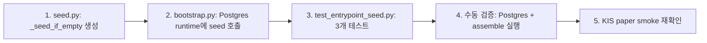

# Task #6 — Current State Analysis & Next Task Proposal

> 분석 일시: 2026-05-07 (UTC)
> 분석자: Architect Mode

---

## 1. 읽은 문서 목록 (총 20+ 건)

### 설계 문서
| 문서 | 파일 | 상태 |
|---|---|---|
| Enterprise Trading System Design | [`plan_docs/ENTERPRISE_TRADING_SYSTEM_DESIGN.md`](plan_docs/ENTERPRISE_TRADING_SYSTEM_DESIGN.md) | ✅ 완독 (1538 line) |
| Handoff to Roo Code | [`plan_docs/HANDOFF_TO_ROO_CODE.md`](plan_docs/HANDOFF_TO_ROO_CODE.md) | ✅ 완독 (519 line) |
| 01_system_architecture | [`plan_docs/detailed_design/01_system_architecture.md`](plan_docs/detailed_design/01_system_architecture.md) | ✅ 완독 |
| 02_order_execution_sequence | [`plan_docs/detailed_design/02_order_execution_sequence.md`](plan_docs/detailed_design/02_order_execution_sequence.md) | ✅ 완독 |
| 03_data_model_erd | [`plan_docs/detailed_design/03_data_model_erd.md`](plan_docs/detailed_design/03_data_model_erd.md) | ✅ 완독 |
| 04_broker_adapter_interface | [`plan_docs/detailed_design/04_broker_adapter_interface.md`](plan_docs/detailed_design/04_broker_adapter_interface.md) | ✅ 완독 |
| 05_koreainvestment_adapter_spec | [`plan_docs/detailed_design/05_koreainvestment_adapter_spec.md`](plan_docs/detailed_design/05_koreainvestment_adapter_spec.md) | ✅ 완독 |
| 06_config_schema | [`plan_docs/detailed_design/06_config_schema.md`](plan_docs/detailed_design/06_config_schema.md) | ✅ 완독 |
| 07_mvp_scope | [`plan_docs/detailed_design/07_mvp_scope_and_delivery_plan.md`](plan_docs/detailed_design/07_mvp_scope_and_delivery_plan.md) | ✅ 완독 |
| 08_ai_decision_policy | [`plan_docs/detailed_design/08_ai_decision_policy.md`](plan_docs/detailed_design/08_ai_decision_policy.md) | ✅ 완독 (1061 line) |
| 09_market_and_event_data | [`plan_docs/detailed_design/09_market_and_event_data_policy.md`](plan_docs/detailed_design/09_market_and_event_data_policy.md) | ✅ 완독 |
| 10_broker_rate_limit | [`plan_docs/detailed_design/10_broker_rate_limit_and_capacity_policy.md`](plan_docs/detailed_design/10_broker_rate_limit_and_capacity_policy.md) | ✅ 완독 |

### Plan 문서 (최신)
| Plan | 파일 | 상태 |
|---|---|---|
| README (index) | [`plans/README.md`](plans/README.md) | ✅ 완독 |
| BACKLOG | [`plans/BACKLOG.md`](plans/BACKLOG.md) | ✅ 완독 |
| 52 — AgentRun persistence | [`plans/52_agent_run_persistence_and_inspection.md`](plans/52_agent_run_persistence_and_inspection.md) | ✅ 완독 |
| 55 — KIS env standardization | [`plans/55_kis_env_standardization.md`](plans/55_kis_env_standardization.md) | ✅ 완독 |
| 56 — Orchestrator runtime entrypoint | [`plans/56_orchestrator_runtime_entrypoint.md`](plans/56_orchestrator_runtime_entrypoint.md) | ✅ 완독 |
| 62 — KIS paper event loop closed mitigation | [`plans/62_kis_paper_event_loop_closed_mitigation.md`](plans/62_kis_paper_event_loop_closed_mitigation.md) | ✅ 완독 |

### 소스코드
| 파일 | 내용 | 상태 |
|---|---|---|
| [`src/agent_trading/runtime/bootstrap.py`](src/agent_trading/runtime/bootstrap.py) | Runtime composition (431 line) | ✅ 완독 |
| [`src/agent_trading/services/decision_orchestrator.py`](src/agent_trading/services/decision_orchestrator.py) | Core orchestrator (1027 line) | ✅ 완독 |
| [`src/agent_trading/services/ai_agents/event_interpretation.py`](src/agent_trading/services/ai_agents/event_interpretation.py) | EI agent (238 line) | ✅ 완독 |
| [`src/agent_trading/services/ai_agents/ai_risk.py`](src/agent_trading/services/ai_agents/ai_risk.py) | AR agent (347 line) | ✅ 완독 |
| [`src/agent_trading/services/ai_agents/final_decision_composer.py`](src/agent_trading/services/ai_agents/final_decision_composer.py) | FDC agent (319 line) | ✅ 완독 |
| [`src/agent_trading/services/ai_agents/recorder.py`](src/agent_trading/services/ai_agents/recorder.py) | AgentRunRecorder (211 line) | ✅ 완독 |
| [`src/agent_trading/services/ai_agents/base.py`](src/agent_trading/services/ai_agents/base.py) | Agent protocols (187 line) | ✅ 완독 |
| [`src/agent_trading/services/order_manager.py`](src/agent_trading/services/order_manager.py) | Order lifecycle (796 line) | ✅ 부분 |
| [`src/agent_trading/services/reconciliation_service.py`](src/agent_trading/services/reconciliation_service.py) | Reconciliation (525 line) | ✅ 부분 |
| [`src/agent_trading/services/event_loop.py`](src/agent_trading/services/event_loop.py) | WS event loop (585 line) | ✅ 부분 |
| [`src/agent_trading/config/settings.py`](src/agent_trading/config/settings.py) | Settings (188 line) | ✅ 완독 |
| [`src/agent_trading/repositories/contracts.py`](src/agent_trading/repositories/contracts.py) | Repository protocols (389 line) | ✅ 완독 |
| [`src/agent_trading/repositories/bootstrap.py`](src/agent_trading/repositories/bootstrap.py) | InMemory repo boot | ✅ 완독 |
| [`src/agent_trading/repositories/container.py`](src/agent_trading/repositories/container.py) | RepositoryContainer | ✅ 완독 |
| [`src/agent_trading/repositories/postgres/bootstrap.py`](src/agent_trading/repositories/postgres/bootstrap.py) | Postgres repo boot | ✅ 완독 |
| [`src/agent_trading/repositories/postgres/agent_runs.py`](src/agent_trading/repositories/postgres/agent_runs.py) | PostgresAgentRunRepository | ✅ 완독 |
| [`src/agent_trading/api/app.py`](src/agent_trading/api/app.py) | FastAPI app | ✅ 완독 |
| [`src/agent_trading/api/routes/agent_runs.py`](src/agent_trading/api/routes/agent_runs.py) | `GET /agent-runs` | ✅ 완독 |
| [`admin_ui/src/components/AgentRunsView.tsx`](admin_ui/src/components/AgentRunsView.tsx) | Admin UI Agent Runs | ✅ 완독 |
| [`pyproject.toml`](pyproject.toml) | Project dependencies | ✅ 완독 |
| [`db/migrations/0001_initial_schema.sql`](db/migrations/0001_initial_schema.sql) | DB schema | ✅ 완독 |

### Smoke 테스트
| 파일 | 내용 |
|---|---|
| [`tests/smoke/test_runtime_three_agent_smoke.py`](tests/smoke/test_runtime_three_agent_smoke.py) | 3-agent chain real LLM smoke (502 line) |
| [`tests/smoke/test_kis_paper_ai_runtime_smoke.py`](tests/smoke/test_kis_paper_ai_runtime_smoke.py) | KIS + AI combined smoke (859 line) |
| [`tests/smoke/test_kis_paper_smoke.py`](tests/smoke/test_kis_paper_smoke.py) | KIS paper smoke (4 failing) |

---

## 2. 현재 구현 상태 종합

### 2.1 Infrastructure (✅ 안정화 완료)
| 항목 | 상태 | 비고 |
|---|---|---|
| Python 3.11+ project | ✅ | pyproject.toml 설정 완료 |
| asyncpg / Postgres 연결 | ✅ | connection.py, transaction.py |
| DB migrations 0001-0009 | ✅ | 전체 스키마 진화 완료 |
| docker-compose.yml | ✅ | Postgres 포함 |
| FastAPI inspection API | ✅ | Phase 1-3 라우터 모두 등록 |
| Auth/RBAC | ✅ | Static bearer token, require_viewer |
| Admin UI (React/Vite/TypeScript) | ✅ | Phase 1 완료, 보호된 라우터 |

### 2.2 Broker / Execution (✅ 안정화 완료)
| 항목 | 상태 | 비고 |
|---|---|---|
| KoreaInvestmentAdapter | ✅ | REST + WS real client |
| KISRestClient | ✅ | Hashkey, header, TR ID |
| KISWebSocketClient | ✅ | Heartbeat, reconnect |
| OrderManager | ✅ | State machine, transitions, idempotency |
| ReconciliationService | ✅ | Blocking locks, resolve_and_mark |
| RateLimitBudgetManager | ✅ | 5-bucket distribution |
| EventLoop (gap fill, dedup) | ✅ | `_GAP_FILL_LOOKBACK_SECONDS=300` |
| KIS env standardization | ✅ | Plan 55 적용됨 |

### 2.3 External Events (✅ 완료)
| 항목 | 상태 | 비고 |
|---|---|---|
| OpenDART adapter | ✅ | Polling worker |
| Polling workers infrastructure | ✅ | `_build_polling_workers()` |

### 2.4 AI Decision Layer (✅ 구조 완료)
| 항목 | 상태 | 비고 |
|---|---|---|
| DecisionOrchestratorService | ✅ | `assemble()` entry point |
| 3-agent chain (EI → AR → FDC) | ✅ | `_run_agents()` |
| AIDecisionInputs backend contract | ✅ | Normalised aggregate |
| StubScoreCalculator | ✅ | Deterministic stub |
| AssembledContext / OrderIntent | ✅ | Full data model |

### 2.5 Provider Connections (✅ 완료)
| 항목 | 상태 | 비고 |
|---|---|---|
| `LLM_PROVIDER` env resolver | ✅ | deepseek/openai/stub |
| DeepSeek default | ✅ | `deepseek-v4-pro`, `api.deepseek.com` |
| OpenAI alternative | ✅ | `gpt-4o`, `api.openai.com/v1` |
| AIProviderClient | ✅ | `generate_structured()` with JSON schema |
| Provider-agnostic settings | ✅ | `AppSettings` field group |

### 2.6 AI Agent Real Implementations (✅ 완료)
| Agent | Stub | Real | 비고 |
|---|---|---|---|
| EventInterpretationAgent | ✅ | ✅ | System + user prompt with JSON schema |
| AIRiskAgent | ✅ | ✅ | Position snapshot + risk limits in prompt |
| FinalDecisionComposerAgent | ✅ | ✅ | EI + AR output both consumed |
| AgentRunRecorder | ✅ | ✅ | Repository-backed (Plan 52) |
| PostgresAgentRunRepository | ✅ | ✅ | `trading.agent_runs` table |

### 2.7 Smoke / Test 상태
| Test | 상태 | 비고 |
|---|---|---|
| `test_runtime_three_agent_smoke.py` | ✅ | Full 3-agent chain via real LLM |
| `test_kis_paper_ai_runtime_smoke.py` | ✅ | KIS + AI combined, pre-submit guard |
| `test_kis_paper_smoke.py` | ⚠️ **4개 실패** | RuntimeError: event loop closed (Plan 62) |

---

## 3. 남은 핵심 갭 (3-5개)

### 갭 #1 (🔴 Critical): Orchestrator Runtime Entrypoint — `assemble()`가 Postgres 모드에서 실행 불가

**문제:**
- [`DecisionOrchestratorService.assemble()`](src/agent_trading/services/decision_orchestrator.py:300) → [`_ensure_or_create_decision_context()`](src/agent_trading/services/decision_orchestrator.py:523)는 FK 체인을 resolve해야 함:
  ```
  broker_accounts → accounts → clients → config_versions → strategies
  ```
- 이 FK 체인에 해당하는 seed 데이터가 InMemory/Postgres 모두에 존재하지 않음
- seed 데이터가 없으면 `_ensure_or_create_decision_context()`는 `None` 반환
- `decision_context_id=None`이면 `PostgresAgentRunRepository`가 FK 제약 위반으로 실패
- 결과: **Postgres 모드에서 AI 의사결정 파이프라인 전체가 작동하지 않음**

**Plan 56**에서 다음 해결책이 정의되어 있음:
- [`_seed_if_empty()`](plans/56_orchestrator_runtime_entrypoint.md:99) 패턴으로 FK 체인 seed
- 실 주문 제출(submit)은 차단 (inquiry-only)
- 3개 테스트: entrypoint seeds, idempotent seed, no broker submit

**변경 금지 경계:**
- Broker submit 절대 금지
- AI agent 실행 로직 변경 금지
- 기존 `assemble()` 흐름 변경 금지
- Orchestrator 하위에 seed-only 모듈 추가 (orchestrator 내부 로직 변경 없음)

### 갭 #2 (🔴 High): KIS Paper Smoke 4개 실패 — RuntimeError event loop closed

**문제:**
- Python 3.14 httpx/httpcore `RuntimeError: event loop closed` 이슈
- 4개 테스트 실패: `test_approval_key`, `test_get_orderbook`, `test_get_cash_balance`, `test_websocket_receive`
- [`websocket_client.py:disconnect()`](src/agent_trading/brokers/koreainvestment/websocket_client.py) 등 일부 경로에 safe handling 누락
- Plan 62에서 fix 분석 완료

### 갭 #3 (🟡 Medium): AgentRun Postgres Persistence End-to-End 검증

**문제:**
- [`PostgresAgentRunRepository`](src/agent_trading/repositories/postgres/agent_runs.py) 코드는 존재하지만,
- `AgentRunRecorder`에 repo를 주입하는 것도 [`bootstrap.py:248`](src/agent_trading/runtime/bootstrap.py:248)에서 완료되었으나,
- 실제로 Postgres 모드에서 `assemble()` 실행 → agent run이 DB에 저장되는 e2e 검증이 없음
- 갭 #1이 선행되어야 갭 #3 검증 가능

### 갭 #4 (🟡 Medium): Score Calculator — Stub에서 Real로 전환

**문제:**
- [`StubScoreCalculator`](src/agent_trading/services/decision_orchestrator.py:216)는 항상 `score=0.0`, `max_order_value=0` 반환
- [`_calculate_max_order_value()`](src/agent_trading/services/decision_orchestrator.py:1020)는 stub 수준
- AI Risk agent가 산출한 risk score / confidence / expected_value를 실제 score/threshold 계산에 연결하는 backend contract는 미구현
- [`08_ai_decision_policy.md`](plan_docs/detailed_design/08_ai_decision_policy.md:446)의 Deterministic Backend Boundary가 아직 연결되지 않음

### 갭 #5 (🟢 Low): Admin UI — Agent Runs Detail Panel 심화

**문제:**
- [`AgentRunsView.tsx`](admin_ui/src/components/AgentRunsView.tsx)는 목록 조회 + 필터링까지 구현
- [`AgentRunDetailPanel`](admin_ui/src/components/AgentRunDetailPanel.tsx) (참조됨)이 존재하지만 세부 정보 표시 수준 확인 필요
- `structured_output_json`의 JSON 시각화, agent chain 흐름 시각화 등 UX 개선 여지

---

## 4. 제안: 금회 작업 (Task #6)

### 선정: 갭 #1 — **Orchestrator Runtime Entrypoint (Plan 56)**

**선정 이유:**
1. **의존성 최상단** — 갭 #1이 해결되어야 갭 #3 (AgentRun Postgres persistence 검증) 가능
2. **AI Decision Pipeline 동작의 전제조건** — `assemble()`이 Postgres 모드에서 의미 있는 결과를 생성할 수 있어야 함
3. **Plan 56이 이미 완성된 설계** — 변경 범위, 테스트, compliance boundary가 모두 정의됨
4. **현재 상태에서 즉시 구현 가능** — 코드 변경이 격리된 seed 모듈에 국한됨
5. **검증 가능한 결과** — 3개 테스트로 명확한 통과 기준 제시

### 변경 범위

| 항목 | 상세 |
|---|---|
| **신규 파일** | [`src/agent_trading/services/seed.py`](src/agent_trading/services/seed.py) — `_seed_if_empty()` 패턴의 seed 로직 |
| **수정 파일** | [`src/agent_trading/runtime/bootstrap.py`](src/agent_trading/runtime/bootstrap.py) — Postgres runtime에 seed 호출 추가 |
| **신규 테스트** | `tests/services/test_entrypoint_seed.py` — 3개 테스트 케이스 |
| **변경 금지** | `orchestrator.assemble()` 기존 로직, AI agent 실행, broker submit, `order_manager.py`, `reconciliation_service.py` |

### 구현 순서



### 테스트 전략

| 테스트 | 검증 내용 |
|---|---|
| `test_entrypoint_seeds_and_assembles` | seed 후 `assemble()`이 `OrderIntent` 반환 + `decision_context_id` != None |
| `test_entrypoint_idempotent_seed` | 2회 seed 호출해도 중복 생성 없음 |
| `test_entrypoint_no_broker_submit` | `assemble()` 완료 후 broker submit이 호출되지 않음 |

### Compliance 경계 (변경 금지 목록)

- ❌ Broker submit 호출 금지
- ❌ `OrderManager.create_order()` / `submit_to_broker()` 호출 금지
- ❌ AI agent 실행 로직 변경 금지
- ❌ `DecisionOrchestratorService.assemble()` 내부 로직 변경 금지
- ✅ Seed-only: `_seed_if_empty()`는 orchestrator와 별도 모듈
- ✅ Inquiry-only: seed 데이터 조회/생성만 수행, 실 거래 행위 없음
- ✅ 기존 테스트 영향 없음: 새로운 seed 테스트 파일 추가

---

## 5. 승인 요청

제안된 작업(`Orchestrator Runtime Entrypoint — Plan 56`)에 동의하시면 `code` 모드로 전환하여 구현을 시작하겠습니다.

변경을 원하시거나 다른 작업을 선호하시면 피드백을 부탁드립니다.
