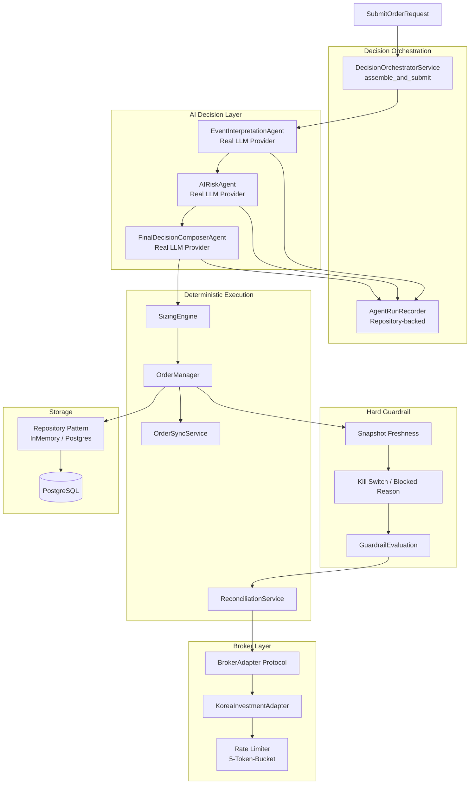

# Task #11 — 현황 분석 첫 보고서

> 작성일: 2026-05-12 07:14 UTC+9
> 기준: 문서 + 코드 상태 분석

---

## 1. 읽은 문서 요약

### 1.1 설계 문서 (plan_docs/)

| 문서 | 분량 | 주요 내용 |
|------|------|----------|
| [`ENTERPRISE_TRADING_SYSTEM_DESIGN.md`](plan_docs/ENTERPRISE_TRADING_SYSTEM_DESIGN.md) | 1,538 lines | 엔터프라이즈 AI 멀티 에이전트 매매 시스템 전체 설계 — 14개 Agent 정의, Broker Adapter 구조, AI Decision Policy, Risk/Kill Switch, Backtest/Paper/Live 전환 Gate |
| [`ENTERPRISE_TRADING_SYSTEM_DESIGN_V2.md`](plan_docs/ENTERPRISE_TRADING_SYSTEM_DESIGN_V2.md) | 640 lines | V2 실행 지향 개정판 — 실제 구현 상태 반영, Control/Trading/Observability Plane 분리, 현재 Gap 분석 (P1/P2/P3), V2 우선순위 재정의 |
| [`HANDOFF_TO_ROO_CODE.md`](plan_docs/HANDOFF_TO_ROO_CODE.md) | 519 lines | Codex → Roo Code 인수인계 문서 — 패키지 구조, 계층 역할, 9개 미해결 설계 쟁점 (주문 상태 전이, DDL-Entity 매핑, OrderManager-Guardrail 경계, Reconciliation 정책 등) |

### 1.2 상세 설계 문서 (plan_docs/detailed_design/)

| 문서 | 분량 | 주요 내용 |
|------|------|----------|
| [`01_system_architecture.md`](plan_docs/detailed_design/01_system_architecture.md) | 267 lines | 시스템 경계, Component 책임, Runtime Interaction, Safety Boundary, Plane Failure Isolation |
| [`02_order_execution_sequence.md`](plan_docs/detailed_design/02_order_execution_sequence.md) | 235 lines | 주문 생명주기, 상태 전이, Idempotency, Partial Fill, Unknown State Handling |
| [`03_data_model_erd.md`](plan_docs/detailed_design/03_data_model_erd.md) | 390 lines | 18개 엔티티 정의, 관계, Audit Trail, 인덱스, Enum 목록 |
| [`04_broker_adapter_interface.md`](plan_docs/detailed_design/04_broker_adapter_interface.md) | 224 lines | BrokerAdapter Protocol, SubmitOrderRequest/Result, 에러 계약, Capability Resolution |
| [`05_koreainvestment_adapter_spec.md`](plan_docs/detailed_design/05_koreainvestment_adapter_spec.md) | 236 lines | KIS Auth/REST/WS, 주문 처리, Rate Limit, 실패 처리, 부분 체결 |
| [`06_config_schema.md`](plan_docs/detailed_design/06_config_schema.md) | 217 lines | Client/Env/Strategy Config, Pydantic 스키마, 비밀값 처리 |
| [`07_mvp_scope_and_delivery_plan.md`](plan_docs/detailed_design/07_mvp_scope_and_delivery_plan.md) | 201 lines | MVP 범위, 8단계 Delivery Plan, 완료 기준 |
| [`08_ai_decision_policy.md`](plan_docs/detailed_design/08_ai_decision_policy.md) | 1,144 lines | AI 판단 계층 구조, 14개 Agent 상세, Fast/Slow 계층, Sizing 정책, JSON Schema |
| [`09_market_and_event_data_policy.md`](plan_docs/detailed_design/09_market_and_event_data_policy.md) | 258 lines | 데이터 Source Tier, Dedup, Classification, Freshness 정책 |
| [`10_broker_rate_limit_and_capacity_policy.md`](plan_docs/detailed_design/10_broker_rate_limit_and_capacity_policy.md) | 330 lines | 5개 Bucket 분리 (AUTH/ORDER/INQUIRY/RECONCILIATION/MARKET_DATA), Priority Ordering, Strict Global REST Cap ✅ |

### 1.3 Agents 설계 문서 (plan_docs/agents/)

| 문서 | 주요 내용 |
|------|----------|
| [`README.md`](plan_docs/agents/README.md) | 14개 Agent를 책임 단위로 재해석, 모두 LLM Agent가 아님을 명시 |
| [`01_agent_inventory_and_status.md`](plan_docs/agents/01_agent_inventory_and_status.md) | 14개 Agent 매핑 표 — Implemented(3), Partially Implemented(4), Planned(7) |
| [`02_agent_target_shapes.md`](plan_docs/agents/02_agent_target_shapes.md) | 각 Agent 최종 개발 형태 — Deterministic / Hybrid / Provider AI 분류 |
| [`03_risk_role_boundaries.md`](plan_docs/agents/03_risk_role_boundaries.md) | AR/Sizing/Guardrail/Compliance 역할 경계 — AR은 해석기, Sizing은 결정적 계산기, Guardrail은 최종 차단기 |

### 1.4 Plan 문서 (plans/)

| 문서 | 주요 내용 |
|------|----------|
| [`README.md`](plans/README.md) | 51+개 Plan 문서 인덱스, 상황별 읽기 가이드 |
| [`HANDOFF_CURRENT.md`](plans/HANDOFF_CURRENT.md) | 현 작업 인계 (2026-05-12) — Phase A-D 완료, Paper Mock 한계 문서화 완료 |
| [`BACKLOG.md`](plans/BACKLOG.md) | Medium-term (Operator Intervention, Migration 0010), Longer-term (Soak/Chaos, Provider Failover), 7개 Agent 미분해 |
| **Plan 52** | [AgentRun Persistence](plans/52_agent_run_persistence_and_inspection.md) — Repository-backed 전환 ✅ |
| **Plan 53** | [Admin UI Design Migration](plans/53_admin_ui_2nd_design_migration.md) — PicoCSS → Tailwind CSS v4 ✅ |
| **Plan 54** | [Agent Runs Page](plans/54_agent_runs_independent_page.md) — 독립 페이지 ✅ |
| **Plan 55** | [KIS Env Standardization](plans/55_kis_env_standardization.md) — KIS_APP_KEY/SECRET/ACCOUNT_NO ✅ |
| **Plan 56** | [Orchestrator Entrypoint](plans/56_orchestrator_runtime_entrypoint.md) — `run_orchestrator_once.py` ✅ |
| **Plan 57** | [KIS REST RPS Config](plans/57_kis_rest_rps_config.md) — Live 15 / Paper 1 RPS ✅ |
| **Plan 59** | [Rate Limit Mitigation](plans/59_kis_paper_smoke_rate_limit_mitigation.md) — EGW00133 early skip ✅ |
| **Plan 60** | [EGW00201 Pacing](plans/60_kis_paper_smoke_egw00201_pacing.md) — 1s autouse fixture ✅ |
| **Plan 62** | [Event Loop Closed Fix](plans/62_kis_paper_event_loop_closed_mitigation.md) — httpx/httpcore ✅ |
| **Plan 63** | [Dashboard 422 Fix](plans/63_fix_reconciliation_account_id.md) — account_id required ✅ |
| **Plan 65** | [Broker Capacity UI](plans/65_broker_capacity_ui.md) + [Freshness Indicators](plans/65_dashboard_freshness_indicators.md) ✅ |
| **Plan 66** | [Admin UI Korean Localization](plans/66_admin_ui_korean_localization.md) ✅ |
| **기타** | [`decision_type_contract_alignment.md`](plans/decision_type_contract_alignment.md) ✅ [`risk_opinion_contract_alignment.md`](plans/risk_opinion_contract_alignment.md) ✅ [`paper_submit_smoke_cleanup.md`](plans/paper_submit_smoke_cleanup.md) ✅ |

### 1.5 Reference Docs

| 문서 | 주요 내용 |
|------|----------|
| [`한국투자증권_오픈API_핵심요약_자동매매용.md`](reference_docs/한국투자증권_오픈API_핵심요약_자동매매용.md) | 433 lines — 338개 시트 중 MVP 직접 관련 14개 API 선별, Auth/Order/Inquiry/WS 파서 요약 |

---

## 2. 현재 구현 상태 요약

### 2.1 ✅ 완료 (Implemented)

**Core Architecture:**
- ✨ **3-Agent AI Core** (EI/AR/FDC) — 모두 실제 LLM Provider 연결 완료 (OpenAI 호환)
- ✨ **Request Chain Pattern** — `base request → request_with_ei → request_with_ei_and_ar` 3단계 전파
- ✨ **DecisionOrchestratorService.assemble_and_submit()** — AI 결정 → Order submit 전체 파이프라인
- ✨ **Stub↔Real Agent 전환** — bootstrap에서 Provider 설정 완료 시 real, 미설정 시 stub fallback

**Agent Infrastructure:**
- ✨ [`AIProviderClient` Protocol](src/agent_trading/services/ai_agents/base.py:138) — Provider 추상화
- ✨ [`OpenAICompatibleClient`](src/agent_trading/services/ai_agents/provider_client.py:92) — HTTP 기반 OpenAI 호환 provider
- ✨ [`AgentRunRecorder`](src/agent_trading/services/ai_agents/recorder.py:28) — Repository-backed (InMemory ↔ Postgres)
- ✨ [`AgentRunRepository` Protocol](src/agent_trading/repositories/contracts.py:594) + [`PostgresAgentRunRepository`](src/agent_trading/repositories/postgres/agent_runs.py:11)
- ✨ [`AgentRunResponse` Schema](src/agent_trading/api/schemas.py:396) + `GET /agent-runs` API

**Broker / Execution:**
- ✨ **[`KoreaInvestmentAdapter`](src/agent_trading/brokers/koreainvestment/adapter.py)** — REST 인증/주문/조회 + WebSocket
- ✨ **[`OrderManager`](src/agent_trading/services/order_manager.py)** — 주문 생성/전이/제출 + ReconciliationService wiring
- ✨ [`ReconciliationService`](src/agent_trading/services/reconciliation_service.py) — Blocking lock, unknown state 복구
- ✨ [`OrderSyncService`](src/agent_trading/services/order_sync_service.py) — Post-submit sync
- ✨ **5-Token-Bucket Rate Limiter** — AUTH/ORDER/INQUIRY/RECONCILIATION/MARKET_DATA
- ✨ **Strict Global REST Cap** — Live 15 RPS / Paper 1 RPS (env-driven)

**Hard Guardrail / Sizing:**
- ✨ [`SizingEngine`](src/agent_trading/services/sizing_engine.py) — 결정론적 수량 계산 (max position %, cash buffer, lot size)
- ✨ **Snapshot Freshness Gating** — Account-level freshness 체크
- ✨ **GuardrailEvaluationEntity** — Kill switch, blocked reason, risk check 기록

**Admin UI (React/Vite + FastAPI):**
- ✨ Tailwind CSS v4 마이그레이션 완료
- ✨ Agent Runs 독립 페이지, Broker Capacity Panel, Freshness Indicators
- ✨ Korean Localization (Plan 66)
- ✨ LoginForm (Auth), Dashboard (Overview), Orders, Reconciliation, Accounts, Decisions 페이지

**Infrastructure:**
- ✨ Docker Compose (PostgreSQL + Admin UI)
- ✨ DB Migrations (0011까지)
- ✨ KIS Env 표준화 (KIS_APP_KEY/KIS_APP_SECRET/KIS_ACCOUNT_NO)
- ✨ Orchestrator Runtime Entrypoint (`scripts/run_orchestrator_once.py`)

**Contract Alignment (최근 완료):**
- ✨ [`decision_type` Normalization](src/agent_trading/services/ai_agents/final_decision_composer.py) — "entry"→APPROVE, "exit"→EXIT
- ✨ [`risk_opinion` Field Split](src/agent_trading/services/ai_agents/ai_risk.py) — Machine-readable enum + Narrative 분리
- ✨ **EI Enhancement P1A/P1B** — Prompt provenance + Time window expansion

### 2.2 🔄 부분 완료 (Partially Implemented)

| 영역 | 상태 | 설명 |
|------|------|------|
| **Data Collector** | Partial | KIS REST/WS + PollingWorker + OpenDartSourceAdapter — but no News Source Adapter yet |
| **Data Quality** | Partial | Freshness budget, dedup, gap fill 존재 — but 전용 validator/service 부재 |
| **News/RAG Agent** | Partial | EI가 뉴스/공시 해석 일부 담당 + OpenDart — but P2 News Source Adapter 설계만 완료 |
| **Execution Agent** | Partial | OrderManager + BrokerAdapter + ReconciliationService — but 전용 execution pipeline 부재 |
| **Hard Guardrail** | Partial | Orchestrator/Sizing/Snapshot에 분산 — 전용 일원화된 engine 부재 |

### 2.3 📋 계획됨 / 미구현 (Planned)

BACKLOG 기준 7개 Agent 미분해:

| Agent | 설계 문서 | 현재 상태 |
|-------|----------|-----------|
| Market Regime Agent | 08_ai_decision_policy.md | 개념 정의만 존재 |
| Universe Selection Agent | 08_ai_decision_policy.md | 설계만 존재 |
| Strategy Selection Agent | 08_ai_decision_policy.md | 설계만 존재 |
| Signal Agent | 08_ai_decision_policy.md | 설계만 존재 |
| Portfolio Agent | 설계 문서 | 개념만 존재 |
| AI Compliance Agent | 01_system_architecture.md, 08_ai_decision_policy.md | 정의만 존재 |
| Model Monitor Agent | 설계 문서 | 개념만 존재 |

**기타 미구현:**
- News Source Adapter (Naver Finance) — P2 설계 완료, 구현 전
- Operator Intervention Workflow
- Soak/Chaos Tests
- Provider Failover Hardening
- Replay UX

### 2.4 🔬 알려진 이슈 / 제약

| 이슈 | 상태 | 설명 |
|------|------|------|
| KIS Paper `inquire-daily-ccld` empty array | **Known Limitation** | 복구 불가, RECONCILE_REQUIRED convergence 불가 |
| KIS Paper ODNO matching 실패 | **Known Limitation** | Paper mock의 내부 ID 불일치 |
| KIS Paper 1 RPS | **Constraint** | 테스트 간 1s 간격 필요 (autouse fixture) |
| FDC ReadTimeout → HOLD | **Mitigated** | Timeout 증가 + Model 변경 |
| RuntimeError (event loop closed) | **Mitigated** | httpx/httpcore safe handling |

### 2.5 📊 테스트 상태

- **총 589/589 all green** (최근 smoke cleanup 후)
- API 테스트, Repository 테스트, Service 테스트 전반적으로 구축됨
- KIS Paper Smoke — rate limit mitigation + pacing 적용 완료
- Websocket 테스트 — event loop closed 처리 완료

---

## 3. 현재 코드 아키텍처 다이어그램

---

## 4. 현재 작업 단계 (Phase A-D 완료)

HANDOFF_CURRENT.md 기준:
- **Phase A** ✅ Post-Submit Sync / Reconciliation E2E 실검증
- **Phase B** ✅ Post-Submit Sync 상태수렴 미완료 원인 분리
- **Phase C** ✅ KIS Paper `inquire-daily-ccld` 응답 계측
- **Phase D** ✅ Paper Mock 한계 문서화 + 검증 범위 재정의

---

## 5. 대기 상태

내용 파악이 완료되었습니다. 다음 프롬프트를 전달받을 수 있게 대기 중입니다.
